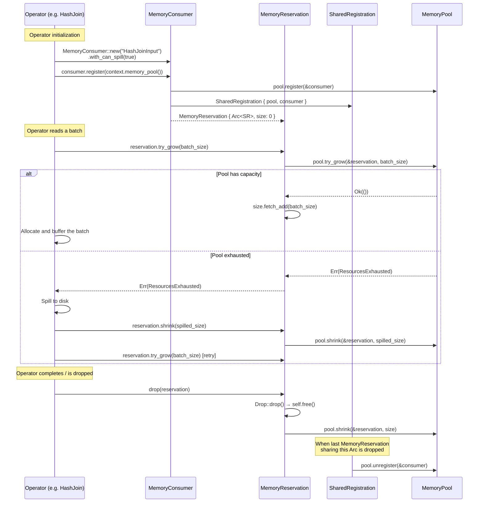

# Module Teardown: The `MemoryPool` Trait

## 1. High-Level Overview
* **Core Responsibility:** `MemoryPool` is the central abstraction for tracking and limiting memory usage across all concurrently-executing query operators. It provides a **cooperative bookkeeping** system — operators that buffer data proportional to input size (sorts, joins, aggregates) must request memory from the pool before allocating. The pool can reject requests, forcing operators to spill to disk or abort.
* **Key Triggers:** An operator creates a `MemoryConsumer`, registers it with the pool (obtaining a `MemoryReservation`), then calls `try_grow()` each time it buffers more data. The pool is consulted on every such call. On drop, `MemoryReservation`'s RAII pattern automatically returns memory.

## 2. Structural Architecture
* **Primary Source Files:**
  - `datafusion/execution/src/memory_pool/mod.rs` — The `MemoryPool` trait, `MemoryConsumer`, `SharedRegistration`, `MemoryReservation`
  - `datafusion/execution/src/memory_pool/pool.rs` — Concrete implementations: `UnboundedMemoryPool`, `GreedyMemoryPool`, `FairSpillPool`, `TrackConsumersPool`
  - `datafusion/execution/src/runtime_env.rs` — `RuntimeEnv` holds `Arc<dyn MemoryPool>`
  - `datafusion/execution/src/task.rs` — `TaskContext` exposes `memory_pool()` to operators

* **Key Data Structures:**
  - `MemoryConsumer` — A named entity with a process-unique `id: usize` and a `can_spill: bool` flag. Identity is based on `id` alone.
  - `SharedRegistration` — An internal struct that pairs an `Arc<dyn MemoryPool>` with a `MemoryConsumer`. Calls `pool.unregister()` on `Drop`.
  - `MemoryReservation` — Holds `Arc<SharedRegistration>` (shared across splits) plus an `AtomicUsize` for the current byte count. All pool interactions flow through this.
  - `MemoryLimit` — An enum (`Infinite`, `Finite(usize)`, `Unknown`) reported by pools.

### Class Diagram

```mermaid
classDiagram
    class MemoryPool {
        <<trait>>
        +register(consumer: &MemoryConsumer)
        +unregister(consumer: &MemoryConsumer)
        +grow(reservation: &MemoryReservation, additional: usize)
        +shrink(reservation: &MemoryReservation, shrink: usize)
        +try_grow(reservation: &MemoryReservation, additional: usize) Result
        +reserved() usize
        +memory_limit() MemoryLimit
    }

    class MemoryConsumer {
        -name: String
        -can_spill: bool
        -id: usize
        +new(name) MemoryConsumer
        +with_can_spill(bool) MemoryConsumer
        +register(pool) MemoryReservation
        +clone_with_new_id() MemoryConsumer
    }

    class SharedRegistration {
        -pool: Arc~dyn MemoryPool~
        -consumer: MemoryConsumer
        +Drop::drop() calls pool.unregister()
    }

    class MemoryReservation {
        -registration: Arc~SharedRegistration~
        -size: AtomicUsize
        +grow(capacity)
        +try_grow(capacity) Result
        +shrink(capacity)
        +free() usize
        +resize(capacity)
        +split(capacity) MemoryReservation
        +new_empty() MemoryReservation
        +Drop::drop() calls self.free()
    }

    class RuntimeEnv {
        +memory_pool: Arc~dyn MemoryPool~
    }

    class TaskContext {
        -runtime: Arc~RuntimeEnv~
        +memory_pool() &Arc~dyn MemoryPool~
    }

    MemoryReservation --> SharedRegistration : Arc
    SharedRegistration --> MemoryPool : Arc
    SharedRegistration --> MemoryConsumer : owns
    TaskContext --> RuntimeEnv : Arc
    RuntimeEnv --> MemoryPool : Arc
```


## 3. Execution & Call Flow

### Sequence Diagram


* **Step-by-step text breakdown:**
  1. **Consumer creation:** The operator (e.g. `GroupedHashAggregateStream`) creates a `MemoryConsumer` with a human-readable name and sets `can_spill` based on whether it supports spilling. Each consumer gets a process-unique id via a global `AtomicUsize` counter.
  2. **Registration:** `consumer.register(pool)` calls `pool.register(&consumer)` (so the pool can track the consumer — important for `FairSpillPool` which counts spillable consumers), then wraps the pool + consumer into a `SharedRegistration` behind an `Arc`, returning a `MemoryReservation` with `size: 0`.
  3. **Growing (fallible):** During execution, the operator calls `reservation.try_grow(n)`. This delegates to `pool.try_grow()` — if the pool's policy allows it, `Ok(())` is returned and the reservation's `AtomicUsize` is incremented. If denied, a `ResourcesExhausted` error is returned.
  4. **Growing (infallible):** `reservation.grow(n)` calls `pool.grow()` which **must always succeed** — it unconditionally updates bookkeeping. This is used when tracking memory that has *already been allocated* (e.g. measuring an existing data structure's size).
  5. **Shrinking:** `reservation.shrink(n)` atomically decrements the local size (panics on underflow) and calls `pool.shrink()`. `reservation.free()` shrinks by the full current size, returning the freed amount.
  6. **RAII cleanup:** `MemoryReservation::Drop` calls `self.free()`, returning all tracked bytes. When the last `MemoryReservation` sharing the same `Arc<SharedRegistration>` is dropped, `SharedRegistration::Drop` calls `pool.unregister()`.

## 4. Concurrency & State Management
* **Threading Model:** The `MemoryPool` trait requires `Send + Sync`, so all implementations must be thread-safe. A single pool instance is shared across all concurrently-executing partitions via `Arc<dyn MemoryPool>`. Each operator partition gets its own `MemoryConsumer` and `MemoryReservation`, but they all contend on the same pool.
* **Atomic operations in `MemoryReservation`:** The reservation's `size` field is an `AtomicUsize`, and all mutations use `Ordering::Relaxed`. This is safe because:
  - Each `MemoryReservation` is typically owned by a single async task (one partition of one operator).
  - The `split()` and `new_empty()` methods create new reservations sharing the same `SharedRegistration` (via `Arc::clone`), enabling sub-allocations within one operator.
  - `fetch_update` with `checked_sub` is used for shrink/split to prevent underflow atomically.
* **Synchronization in pool implementations:**
  - `UnboundedMemoryPool` / `GreedyMemoryPool`: Lock-free, using only `AtomicUsize` with `fetch_add`, `fetch_sub`, and `fetch_update`.
  - `FairSpillPool`: Uses a `parking_lot::Mutex<FairSpillPoolState>` because it must atomically read *and* update `num_spill`, `spillable`, and `unspillable` together.
  - `TrackConsumersPool`: Uses `parking_lot::Mutex<HashMap<usize, TrackedConsumer>>` for the consumer tracking map, plus delegates to the inner pool's own synchronization.

## 5. Memory & Resource Profile
* **Allocation Pattern:** The pool itself allocates very little memory — it's a bookkeeping layer, not an allocator. `MemoryConsumer` is a small struct (String + bool + usize). `MemoryReservation` adds an `Arc<SharedRegistration>` and an `AtomicUsize`. The `TrackConsumersPool` maintains a `HashMap` of `TrackedConsumer` entries, one per registered consumer.
* **Memory Tracking Philosophy:** DataFusion takes a **pragmatic, selective approach** — only operators that buffer data proportional to input size must track memory. Streaming operators (Filter, Projection) and the `RecordBatch`es flowing between operators are *not* tracked. The documentation recommends reserving ~10% overhead for these untracked allocations. Producers should not reserve memory for the batches they output; instead, the *consumer* operator that holds batches in memory is responsible for reserving.
* **The `grow()` vs `try_grow()` duality:** A critical design choice. `grow()` is infallible — it unconditionally updates the pool's counter even if it causes an "over-budget" state. This exists because sometimes you need to track memory that's *already allocated* (e.g., measuring a hash map that was just resized). `try_grow()` is the gatekeeper — it checks limits and returns `Err` if the budget would be exceeded. Operators should call `try_grow()` *before* allocating.

    ```rust
    // pool.rs:90-103 — GreedyMemoryPool::try_grow uses atomic fetch_update
    fn try_grow(&self, reservation: &MemoryReservation, additional: usize) -> Result<()> {
        self.used
            .fetch_update(Ordering::Relaxed, Ordering::Relaxed, |used| {
                let new_used = used + additional;
                (new_used <= self.pool_size).then_some(new_used)
            })
            .map_err(|used| {
                insufficient_capacity_err(
                    reservation,
                    additional,
                    self.pool_size.saturating_sub(used),
                )
            })?;
        Ok(())
    }
    ```

## 6. Key Design Insights

* **Cooperative, not enforced:** The pool is purely cooperative. It doesn't wrap a system allocator or intercept `malloc`. Operators must voluntarily report their memory usage. This is a deliberate trade-off: full-allocator wrapping would impose overhead on every allocation, while DataFusion only pays the cost on the "big" buffering operations.
* **`MemoryConsumer` identity is process-unique:** Each consumer gets an id from `AtomicUsize::fetch_add(1, Relaxed)` — a global counter. This means consumers are *not* `Clone` (to prevent accidental aliasing). `clone_with_new_id()` exists for when you genuinely need a second consumer that the pool treats as distinct.
* **`SharedRegistration` as a ref-counted unregister guard:** The `Arc<SharedRegistration>` is shared by all `MemoryReservation`s created from `split()` or `new_empty()`. Only when the last one is dropped does `unregister` fire. This ensures the consumer remains registered in the pool as long as *any* reservation references it.
* **The wiring path:** `SessionContext` → `RuntimeEnvBuilder` → `RuntimeEnv.memory_pool: Arc<dyn MemoryPool>` → `TaskContext.memory_pool()`. Every `ExecutionPlan::execute()` call receives a `TaskContext`, giving it access to the pool. The default pool is `UnboundedMemoryPool` (no limits). For production use, `RuntimeEnvBuilder::with_memory_limit(max_bytes, fraction)` creates a `TrackConsumersPool<GreedyMemoryPool>`.

    ```rust
    // runtime_env.rs:401-407
    pub fn with_memory_limit(self, max_memory: usize, memory_fraction: f64) -> Self {
        let pool_size = (max_memory as f64 * memory_fraction) as usize;
        self.with_memory_pool(Arc::new(TrackConsumersPool::new(
            GreedyMemoryPool::new(pool_size),
            NonZeroUsize::new(5).unwrap(),
        )))
    }
    ```

* **Operator usage pattern** (from `row_hash.rs`, the grouped hash aggregate):

    ```rust
    // row_hash.rs:591-596
    let reservation = MemoryConsumer::new(name)
        .with_can_spill(oom_mode != OutOfMemoryMode::ReportError)
        .register(context.memory_pool());
    ```

    The consumer name typically includes the operator name and partition index (e.g., `"HashJoinInput[3]"`), making it easy to identify in error messages and `TrackConsumersPool` reports.
