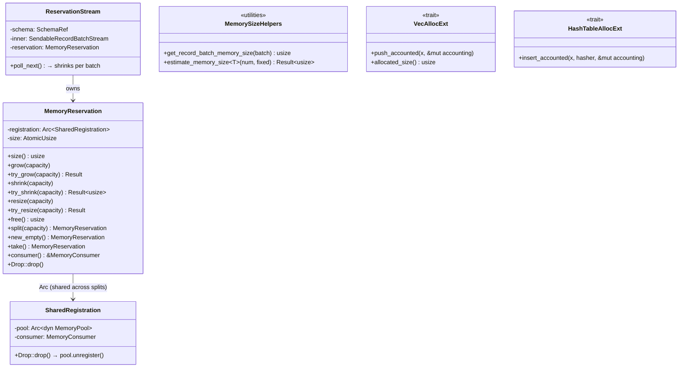
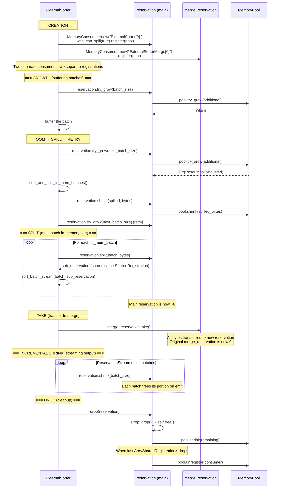

# Module Teardown: The `MemoryReservation` Lifecycle

## 1. High-Level Overview
* **Core Responsibility:** `MemoryReservation` is the RAII handle that operators hold to track their memory usage against a `MemoryPool`. It provides the complete API for growing, shrinking, splitting, and freeing memory. On `Drop`, it automatically returns all tracked bytes to the pool. Multiple reservations can share the same `MemoryConsumer` (via `Arc<SharedRegistration>`), enabling sub-allocations within a single operator — for example, one reservation for the hash table and another for buffered input.
* **Key Triggers:** Created when a `MemoryConsumer` calls `register(pool)`. Grown via `try_grow()` before each buffering allocation. Shrunk after spilling. Automatically freed on drop (RAII). Split when an operator needs independent sub-reservations that can be freed at different times.

## 2. Structural Architecture
* **Primary Source Files:**
  - `datafusion/execution/src/memory_pool/mod.rs` — `MemoryReservation`, `SharedRegistration`, `MemoryConsumer`
  - `datafusion/common/src/utils/memory.rs` — `get_record_batch_memory_size()`, `estimate_memory_size()`
  - `datafusion/common/src/utils/proxy.rs` — `VecAllocExt`, `HashTableAllocExt` (incremental tracking helpers)
  - `datafusion/physical-plan/src/stream.rs` — `ReservationStream` (ties reservation lifetime to stream lifetime)
  - `datafusion/physical-plan/src/common.rs` — `SharedMemoryReservation` type alias
  - `datafusion/physical-plan/src/sorts/sort.rs` — Best example of split/take/new_empty in practice

* **Key Data Structures:**
  - `MemoryReservation { registration: Arc<SharedRegistration>, size: AtomicUsize }` — The handle itself. `size` is atomic to support concurrent reads (though typically owned by one task).
  - `SharedRegistration { pool: Arc<dyn MemoryPool>, consumer: MemoryConsumer }` — Ref-counted link to pool. Calls `pool.unregister()` on `Drop`. Shared across all reservations created from `split()` or `new_empty()`.
  - `SharedMemoryReservation = Arc<Mutex<MemoryReservation>>` — Used when a reservation must be shared across multiple async tasks (e.g., repartition channels).

### Class Diagram


## 3. Execution & Call Flow

### The Full Reservation Lifecycle



### Step-by-step breakdown of each API method:

**1. `try_grow(capacity)` — The gatekeeper**
```rust
// mod.rs:454-458
pub fn try_grow(&self, capacity: usize) -> Result<()> {
    self.registration.pool.try_grow(self, capacity)?;
    self.size.fetch_add(capacity, atomic::Ordering::Relaxed);
    Ok(())
}
```
Pool is consulted first. Only if the pool accepts does the local counter increment. On error, the reservation is unchanged — the caller can spill and retry.

**2. `grow(capacity)` — Infallible tracking**
```rust
// mod.rs:446-449
pub fn grow(&self, capacity: usize) {
    self.registration.pool.grow(self, capacity);
    self.size.fetch_add(capacity, atomic::Ordering::Relaxed);
}
```
Unconditional — for tracking memory that's already allocated (e.g., measuring a `RecordBatch` that was just received). Can push the pool over its limit.

**3. `shrink(capacity)` — Atomic release with underflow protection**
```rust
// mod.rs:387-398
pub fn shrink(&self, capacity: usize) {
    self.size
        .fetch_update(
            atomic::Ordering::Relaxed,
            atomic::Ordering::Relaxed,
            |prev| prev.checked_sub(capacity),
        )
        .unwrap_or_else(|prev| {
            panic!("Cannot free the capacity {capacity} out of allocated size {prev}")
        });
    self.registration.pool.shrink(self, capacity);
}
```
Uses `fetch_update` with `checked_sub` to atomically verify the reservation has enough bytes. Panics on underflow — this is a programming error, not an expected condition.

**4. `try_shrink(capacity)` — Fallible shrink**
```rust
// mod.rs:404-420
pub fn try_shrink(&self, capacity: usize) -> Result<usize> {
    let prev = self.size
        .fetch_update(/* ... */ |prev| prev.checked_sub(capacity))
        .map_err(|prev| {
            internal_datafusion_err!(
                "Cannot free the capacity {capacity} out of allocated size {prev}"
            )
        })?;
    self.registration.pool.shrink(self, capacity);
    Ok(prev - capacity)
}
```
Like `shrink()` but returns `Err` instead of panicking. Returns the new size on success.

**5. `resize(capacity)` / `try_resize(capacity)` — Absolute sizing**
```rust
// mod.rs:423-443
pub fn resize(&self, capacity: usize) {
    let size = self.size.load(atomic::Ordering::Relaxed);
    match capacity.cmp(&size) {
        Ordering::Greater => self.grow(capacity - size),
        Ordering::Less => self.shrink(size - capacity),
        _ => {}
    }
}
```
Compares desired size to current size and dispatches to `grow`/`shrink`. `try_resize` is the fallible variant used by aggregates to adjust to their current data structure sizes. This avoids a release-then-reacquire cycle, which matters for pools with non-trivial grow/shrink costs.

**6. `split(capacity)` — Divide a reservation**
```rust
// mod.rs:470-482
pub fn split(&self, capacity: usize) -> MemoryReservation {
    self.size
        .fetch_update(/* ... */ |prev| prev.checked_sub(capacity))
        .unwrap();
    Self {
        size: atomic::AtomicUsize::new(capacity),
        registration: Arc::clone(&self.registration),
    }
}
```
Atomically moves `capacity` bytes from this reservation into a new one. Both share the same `Arc<SharedRegistration>`, so the consumer remains registered until *all* reservations are dropped. The pool is **not** called — total tracked bytes stay the same, they're just redistributed.

**7. `new_empty()` — Create a sibling reservation**
```rust
// mod.rs:485-490
pub fn new_empty(&self) -> Self {
    Self {
        size: atomic::AtomicUsize::new(0),
        registration: Arc::clone(&self.registration),
    }
}
```
Creates a zero-byte reservation sharing the same consumer. The new reservation can independently `try_grow`. Used when an operator needs a separate accounting scope (e.g., a merge phase) but wants it under the same consumer identity.

**8. `take()` — Transfer all bytes**
```rust
// mod.rs:494-496
pub fn take(&mut self) -> MemoryReservation {
    self.split(self.size.load(atomic::Ordering::Relaxed))
}
```
A convenience wrapper: splits off all bytes, leaving the original at zero. Critical difference from `free()` + `new_empty()` + `grow()`: `take()` never returns bytes to the pool, so another consumer cannot race to claim them. The sort operator uses this to safely hand off merge memory:

```rust
// sort.rs:352-367 — Transfer the pre-reserved merge memory to the streaming merge
// using `take()` instead of `new_empty()`. This ensures the merge
// stream starts with `sort_spill_reservation_bytes` already
// allocated, preventing starvation when concurrent sort partitions
// compete for pool memory.
.with_reservation(self.merge_reservation.take())
```

**9. `free()` — Release all bytes**
```rust
// mod.rs:374-380
pub fn free(&self) -> usize {
    let size = self.size.swap(0, atomic::Ordering::Relaxed);
    if size != 0 {
        self.registration.pool.shrink(self, size);
    }
    size
}
```
Atomically swaps size to 0 and returns the freed amount. Used for explicit cleanup. Also called by `Drop::drop()`.

**10. `Drop` — RAII guarantee**
```rust
// mod.rs:499-503
impl Drop for MemoryReservation {
    fn drop(&mut self) {
        self.free();
    }
}
```
And the `SharedRegistration` drop:
```rust
// mod.rs:344-348
impl Drop for SharedRegistration {
    fn drop(&mut self) {
        self.pool.unregister(&self.consumer);
    }
}
```
Two-level RAII: `MemoryReservation::Drop` frees bytes. When the last `Arc<SharedRegistration>` is dropped (no more reservations reference this consumer), the consumer is unregistered from the pool.

## 4. Concurrency & State Management
* **Threading Model:** Each `MemoryReservation` is typically owned by a single async task (one partition of one operator). The `size` is `AtomicUsize` but uses `Ordering::Relaxed` everywhere — no cross-thread visibility guarantees needed because the reservation is a single-owner resource.
* **`SharedMemoryReservation` for multi-task sharing:** When a reservation must be shared across tasks (e.g., repartition operator where multiple input tasks route to the same output partition), it's wrapped in `Arc<Mutex<MemoryReservation>>`:

    ```rust
    // common.rs:39
    pub(crate) type SharedMemoryReservation = Arc<Mutex<MemoryReservation>>;

    // repartition/mod.rs:325-329
    let reservation = Arc::new(Mutex::new(
        MemoryConsumer::new(format!("{name}[{partition}]"))
            .with_can_spill(true)
            .register(context.memory_pool()),
    ));
    ```
* **Split safety:** `split()` uses `fetch_update` with `checked_sub` — if the split amount exceeds the current size, it panics rather than silently creating a negative balance. Since both the original and the split share the same `Arc<SharedRegistration>`, the pool's `unregister` only fires when all related reservations have been dropped.

## 5. Memory & Resource Profile
* **Allocation Pattern:** `MemoryReservation` itself is tiny (one `Arc` pointer + one `AtomicUsize`). The important cost is in what it *accounts for* — the actual data buffers held by operators.
* **Memory size estimation utilities:** DataFusion provides three levels of memory measurement:

### Level 1: `get_record_batch_memory_size()` — Exact post-allocation measurement
Counts all unique `Buffer` capacities in a `RecordBatch`, de-duplicating shared buffers via pointer comparison:

```rust
// memory.rs:133-145
pub fn get_record_batch_memory_size(batch: &RecordBatch) -> usize {
    let mut counted_buffers: HashSet<NonNull<u8>> = HashSet::new();
    let mut total_size = 0;
    for array in batch.columns() {
        let array_data = array.to_data();
        count_array_data_memory_size(&array_data, &mut counted_buffers, &mut total_size);
    }
    total_size
}
```
De-duplication is critical: when a `RecordBatch` contains slices of the same underlying buffer, this function counts the buffer once, not once per slice. Recursively counts child arrays for nested types (List, Struct).

### Level 2: `estimate_memory_size<T>()` — Pre-allocation hash table estimation
Estimates memory *before* allocating, modeling hashbrown's internal bucket layout:

```rust
// memory.rs:81-102
pub fn estimate_memory_size<T>(num_elements: usize, fixed_size: usize) -> Result<usize> {
    num_elements
        .checked_mul(8)
        .and_then(|overestimate| {
            let estimated_buckets = (overestimate / 7).next_power_of_two();
            size_of::<T>()
                .checked_mul(estimated_buckets)?
                .checked_add(estimated_buckets)?    // 1 byte per bucket (control byte)
                .checked_add(fixed_size)            // collection struct overhead
        })
        .ok_or_else(|| /* overflow error */)
}
```
Formula: `(num_elements * 8 / 7).next_power_of_two()` buckets, each costing `size_of::<T>() + 1` bytes. Used by hash join to pre-reserve before building the hash map.

### Level 3: Proxy traits — Incremental per-element tracking

```rust
// proxy.rs:92-112
impl<T> VecAllocExt for Vec<T> {
    fn push_accounted(&mut self, x: Self::T, accounting: &mut usize) {
        let prev_capacity = self.capacity();
        self.push(x);
        let new_capacity = self.capacity();
        if new_capacity > prev_capacity {
            let bump_size = (new_capacity - prev_capacity) * size_of::<T>();
            *accounting = (*accounting).checked_add(bump_size).expect("overflow");
        }
    }
}

// proxy.rs:152-185
impl<T: Eq> HashTableAllocExt for HashTable<T> {
    fn insert_accounted(&mut self, x: Self::T, hasher: impl Fn(&Self::T) -> u64, accounting: &mut usize) {
        let hash = hasher(&x);
        if self.len() == self.capacity() {
            let bump_elements = self.capacity().max(16);
            let bump_size = bump_elements * size_of::<T>();
            *accounting = (*accounting).checked_add(bump_size).expect("overflow");
            self.reserve(bump_elements, &hasher);
        }
        self.insert_unique(hash, x, hasher);
    }
}
```
These track the `usize` accounting variable *incrementally* as elements are added. The operator later uses the accumulated total with `reservation.try_resize(accounting)` to sync with the pool. This avoids calling the pool on every single `push`/`insert`.

### `ReservationStream` — Stream-lifetime reservation binding

Ties a reservation to a stream, shrinking incrementally as batches are emitted:

```rust
// stream.rs:708-755
pub(crate) struct ReservationStream {
    schema: SchemaRef,
    inner: SendableRecordBatchStream,
    reservation: MemoryReservation,
}

impl Stream for ReservationStream {
    fn poll_next(mut self: Pin<&mut Self>, cx: &mut Context<'_>) -> Poll<Option<...>> {
        match self.inner.poll_next_unpin(cx) {
            Poll::Ready(Some(Ok(batch))) => {
                self.reservation.shrink(get_record_batch_memory_size(&batch));
                Poll::Ready(Some(Ok(batch)))
            }
            Poll::Ready(None) => {
                self.reservation.free();  // Stream done → free everything
                Poll::Ready(None)
            }
            // ...
        }
    }
}
```
As each batch is emitted downstream, the reservation shrinks by exactly that batch's size. When the stream ends, any remaining reservation is freed. This ensures the pool budget is gradually released as data flows downstream, rather than held until the entire stream completes.

## 6. Key Design Insights

* **Two-consumer pattern in the sort operator.** `ExternalSorter` creates *two* separate `MemoryConsumer`s with separate registrations:
  - `reservation` (spillable) — tracks buffered input batches
  - `merge_reservation` (non-spillable) — pre-reserves `sort_spill_reservation_bytes` for the merge phase

    ```rust
    // sort.rs:282-288
    let reservation = MemoryConsumer::new(format!("ExternalSorter[{partition_id}]"))
        .with_can_spill(true)
        .register(&runtime.memory_pool);

    let merge_reservation =
        MemoryConsumer::new(format!("ExternalSorterMerge[{partition_id}]"))
            .register(&runtime.memory_pool);
    ```

    The merge reservation is deliberately *not* spillable — it's a safety net to guarantee the sort can always complete its final merge even when the pool is under pressure. This pre-reservation prevents starvation.

* **`take()` vs `free()` + `new_empty()` + `grow()` — race prevention.** The sort operator uses `take()` to transfer bytes to the merge stream without ever releasing them to the pool. If it used `free()` followed by `grow()`, another concurrent sort partition could grab the freed bytes in between, starving this partition's merge. `take()` is atomic at the reservation level (though not at the pool level — the pool sees no change at all).

* **`split()` enables per-batch lifecycle management.** When the sort has multiple in-memory batches, it splits the reservation so each batch's memory is tracked independently:

    ```rust
    // sort.rs:692-702
    let streams = std::mem::take(&mut self.in_mem_batches)
        .into_iter()
        .map(|batch| {
            let reservation = self
                .reservation
                .split(get_reserved_bytes_for_record_batch(&batch)?);
            let input = self.sort_batch_stream(batch, &metrics, reservation)?;
            Ok(spawn_buffered(input, 1))
        })
        .collect::<Result<_>>()?;
    ```

    Each `spawn_buffered` creates an independent async task. When that task finishes and its stream is dropped, only that sub-reservation is freed — other batches' reservations remain intact.

* **Incremental accounting defers pool interaction.** The proxy traits (`VecAllocExt`, `HashTableAllocExt`) track allocations into a local `usize` counter without touching the pool. The operator periodically syncs with the pool via `try_resize(accumulated_total)`. This batching reduces contention on the pool's synchronization primitives. The aggregate operator does this in `update_memory_reservation()` after processing each input batch — not after every row.

* **`resize` avoids release-then-reacquire.** The code comments explicitly note this:
    > *"Using try_resize avoids a release-then-reacquire cycle, which matters for MemoryPool implementations where grow/shrink have non-trivial cost (e.g. JNI calls in Comet)."*

    `resize` computes the delta and calls a single `grow` or `shrink`, rather than `free()` + `try_grow(new_size)`. This is both more efficient and race-safe.
