# DataFusion Module Map

## Table of Contents

- [Mind Map](#mind-map)
- [Detailed Module Breakdown](#detailed-module-breakdown)
  - [1. Session & Context Layer](#1-session--context-layer)
  - [2. SQL Frontend](#2-sql-frontend)
  - [3. Logical Plan & Optimizer](#3-logical-plan--optimizer)
  - [4. Physical Plan Compilation](#4-physical-plan-compilation)
  - [5. Execution Engine](#5-execution-engine)
  - [6. Data Model](#6-data-model)
  - [7. Data Exchange (Repartition)](#7-data-exchange-repartition)
  - [8. Catalog & Data Sources](#8-catalog--data-sources)
  - [9. Memory Management](#9-memory-management)
  - [10. Function Registry](#10-function-registry)
- [Data Flow: How Modules Connect](#data-flow-how-modules-connect)
- [Query Lifecycle (end-to-end)](#query-lifecycle-end-to-end)

---

## Mind Map

Modules are plain text, key structs/traits listed beneath each module.

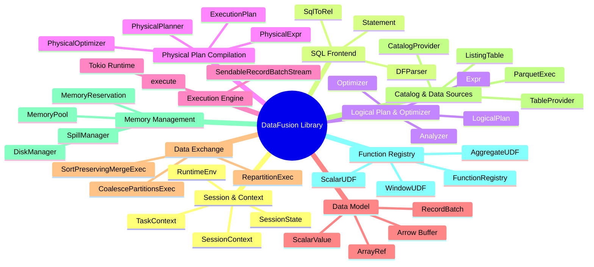

---

## Detailed Module Breakdown

Base path: `datafusion/datafusion/datafusion/`
- `core/src/` → abbreviated as `core.`
- `execution/src/` → abbreviated as `exec.`
- `physical-plan/src/` → abbreviated as `pp.`
- `expr/src/` → abbreviated as `expr.`
- `optimizer/src/` → abbreviated as `opt.`
- `catalog/src/` → abbreviated as `cat.`
- `sql/src/` → abbreviated as `sql.`
- `physical-expr/src/` → abbreviated as `pe.`
- `common/src/` → abbreviated as `common.`
- `datasource-parquet/src/` → abbreviated as `parquet.`

### 1. Session & Context Layer
The entry point API. DataFusion is a library — there is no HTTP server. Users interact through `SessionContext` directly in Rust.

| Struct/Trait | Path | Role |
|-------------|------|------|
| `SessionContext` | `core.execution.context.mod` | Top-level API. Registers tables, executes SQL/DataFrames, holds `SessionState`. Equivalent to instantiating the entire engine. |
| `SessionState` | `core.execution.session_state` | Internal state: catalog list, optimizer rules, physical planner, function registry, config. Shared via `Arc`. |
| `TaskContext` | `exec.task` | Per-partition execution context. Carries `SessionConfig`, `MemoryPool`, `DiskManager`, `RuntimeEnv`. Passed to every `ExecutionPlan::execute()` call. |
| `RuntimeEnv` | `exec.runtime_env` | Shared runtime resources: `MemoryPool`, `DiskManager`, `ObjectStoreRegistry`. Process-wide or per-session. |
| `SessionConfig` | `exec.config` | Configuration: batch size, target partitions, sort spill settings, parquet options. |
| `DataFrame` | `core.dataframe` | Lazy query builder. Wraps a `LogicalPlan`. `collect()` triggers physical planning and execution. |

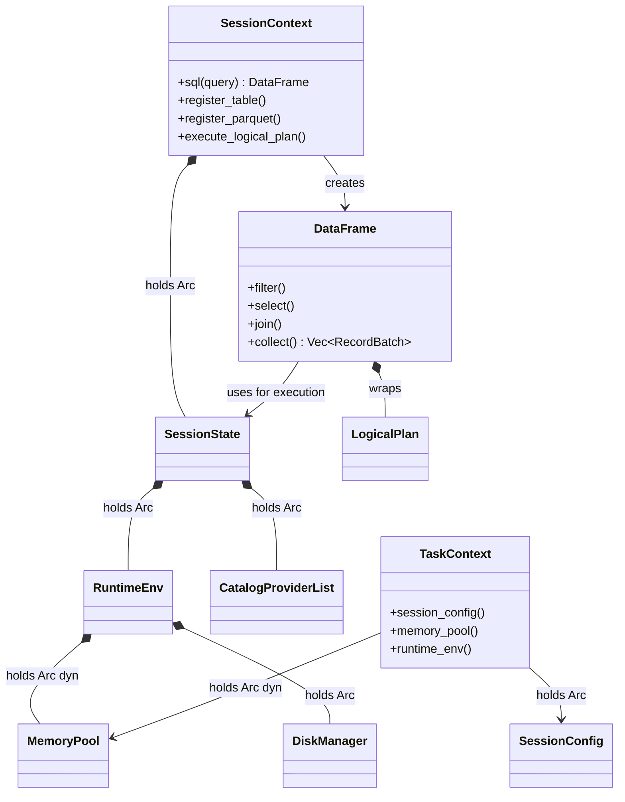

### 2. SQL Frontend
Parses SQL text into a logical plan. Uses `sqlparser-rs` for SQL parsing.

| Struct/Trait | Path | Role |
|-------------|------|------|
| `DFParser` | `sql.parser` | Extends `sqlparser::Parser` with DataFusion-specific statements (COPY, CREATE EXTERNAL TABLE, EXPLAIN). |
| `SqlToRel` | `sql.planner` | Converts `sqlparser::ast::Statement` → `LogicalPlan`. Resolves table names against the catalog, validates schemas, binds expressions. |
| `Statement` | `sql.parser` | DataFusion-specific statement enum wrapping sqlparser statements. |
| `PlannerContext` | `sql.planner` | Carries planning state: outer query schema (for correlated subqueries), CTEs, prepared statements. |

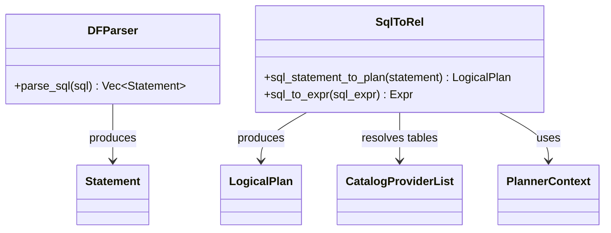

### 3. Logical Plan & Optimizer
The logical representation and its transformation pipeline.

| Struct/Trait | Path | Role |
|-------------|------|------|
| `LogicalPlan` | `expr.logical_plan.plan` | Enum with ~30 variants: `TableScan`, `Projection`, `Filter`, `Join`, `Aggregate`, `Sort`, `Limit`, `Subquery`, `Union`, `Window`, DDL, DML. |
| `Expr` | `expr.expr` | Logical expression enum: `Column`, `Literal`, `BinaryExpr`, `ScalarFunction`, `AggregateFunction`, `WindowFunction`, `Cast`, `Case`, `InList`, `Exists`, `ScalarSubquery`. |
| `Analyzer` | `opt.analyzer` | Semantic analysis pass. Runs `AnalyzerRule`s: type coercion, function resolution, subquery validation. |
| `Optimizer` | `opt.optimizer` | Logical optimization pass. Runs `OptimizerRule`s in configurable order with iteration. |
| `OptimizerRule` | `opt.optimizer` | Trait: `rewrite(plan, config) -> Result<Transformed<LogicalPlan>>`. |
| **Key rules** | `opt.*` | `PushDownFilter`, `PushDownLimit`, `CommonSubexprEliminate`, `EliminateFilter`, `EliminateJoin`, `OptimizeProjections`, `SimplifyExpressions`, `UnwrapCastInComparison`, ~30 total. |

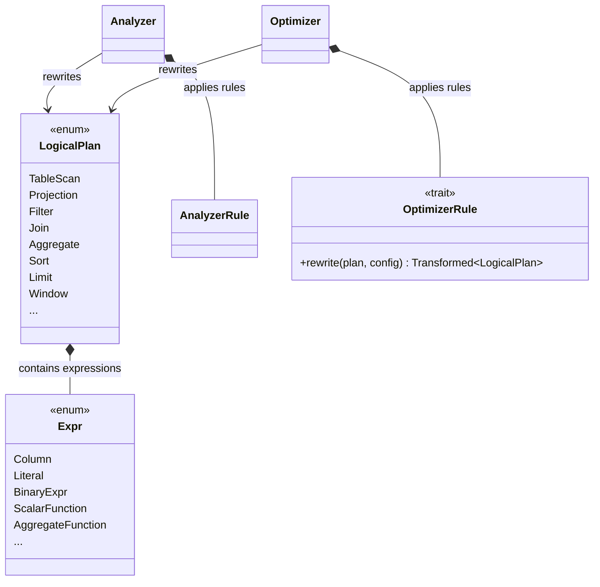

### 4. Physical Plan Compilation
Converts the optimized logical plan into an executable physical plan.

| Struct/Trait | Path | Role |
|-------------|------|------|
| `PhysicalPlanner` | `core.physical_planner` | Trait. `DefaultPhysicalPlanner` walks the `LogicalPlan` tree, maps each node to an `ExecutionPlan`. Inserts `RepartitionExec` for shuffle boundaries. |
| `ExecutionPlan` | `pp.execution_plan` | Core trait. Every physical operator implements this: `execute(partition) -> SendableRecordBatchStream`, `properties()`, `children()`, `required_input_distribution()`, `required_input_ordering()`. |
| `PhysicalExpr` | `pe-common.physical_expr` | Trait for physical expression evaluation: `evaluate(batch) -> ColumnarValue`. |
| `PhysicalOptimizer` | `core.physical_optimizer` | Runs `PhysicalOptimizerRule`s: `EnforceSorting`, `EnforceDistribution`, `CoalesceBatches`, `ProjectionPushdown`, `JoinSelection`, `TopKAggregation`. |
| `Partitioning` | `pe.partitioning` | Enum: `RoundRobinBatch(n)`, `Hash(exprs, n)`, `UnknownPartitioning(n)`. |
| `Distribution` | `pe.partitioning` | Enum: `UnspecifiedDistribution`, `SinglePartition`, `HashPartitioned(exprs)`. |

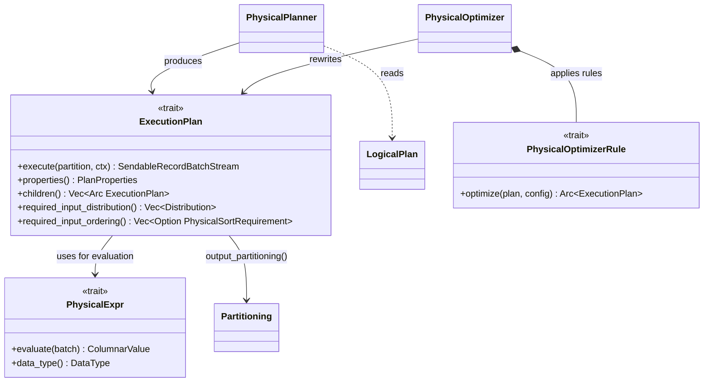

### 5. Execution Engine
Tokio-based async execution. No driver loop — pull-based via Rust async streams.

| Struct/Trait | Path | Role |
|-------------|------|------|
| `SendableRecordBatchStream` | `exec.stream` | Type alias: `Pin<Box<dyn RecordBatchStream>>`. The universal data pipe between operators. |
| `RecordBatchStream` | `exec.stream` | Trait: extends `Stream<Item = Result<RecordBatch>> + Send`. All operators produce this. |
| `execute()` | `pp.execution_plan` | Per-partition entry: `ExecutionPlan::execute(partition_idx, task_ctx)`. Each partition runs as an independent Tokio task. |
| **FilterExec** | `pp.filter` | `execute()`: wraps child stream, evaluates `PhysicalExpr` predicate per batch, applies `filter_record_batch()`. |
| **ProjectionExec** | `pp.projection` | `execute()`: wraps child stream, evaluates projection expressions per batch, assembles output `RecordBatch`. |
| **HashJoinExec** | `pp.joins.hash_join` | Build side: collects all batches into `JoinHashMap`. Probe side: streams through, probes hash map per batch. Build-probe coordination via `Arc<Mutex<SharedHashJoinState>>`. |
| **AggregateExec** | `pp.aggregates` | Two modes: `Partial` (per-partition grouping) and `Final` (merge groups). Uses `GroupedHashAggregateStream` with row-hash accumulation. |
| **SortExec** | `pp.sorts.sort` | External sort with spilling. Accumulates batches in memory, sorts via `arrow::compute::lexsort`, spills to disk when memory exceeded, merge-sorts on output. |
| **WindowAggExec** | `pp.windows` | Partitioned window evaluation. Sorts input by partition/order keys, evaluates window frames per partition. |

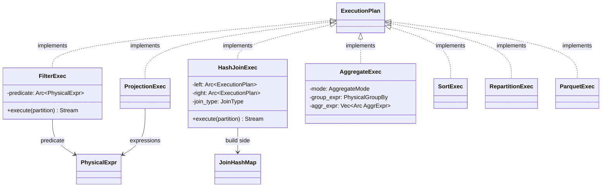

### 6. Data Model
Apache Arrow columnar format — DataFusion uses Arrow arrays directly, no custom columnar types.

| Struct/Trait | Path | Role |
|-------------|------|------|
| `RecordBatch` | `arrow::record_batch` | Envelope: `Arc<Schema>` + `Vec<ArrayRef>`. Equivalent to Trino's `Page`. Zero-copy column selection via `project()`. |
| `ArrayRef` | `arrow::array` | `Arc<dyn Array>`. Type-erased column. Equivalent to Trino's `Block`. |
| `PrimitiveArray<T>` | `arrow::array` | Typed array: `ScalarBuffer<T>` values + `NullBuffer` bitmap. Covers Int8-Int64, Float16-Float64, Date, Time, Timestamp, Duration. |
| `StringArray` | `arrow::array` | UTF-8 strings: offsets buffer + values buffer + null bitmap. |
| `DictionaryArray` | `arrow::array` | Index indirection: `keys: PrimitiveArray<K>` → `values: ArrayRef`. Zero-copy projection. |
| `Buffer` | `arrow::buffer` | Immutable byte slice. Reference-counted via `Arc<Bytes>`. 64-byte aligned. |
| `MutableBuffer` | `arrow::buffer` | Growable byte buffer. Builds `Buffer` on freeze. |
| `NullBuffer` | `arrow::buffer` | Validity bitmap: one bit per row. SIMD-friendly 64-byte alignment. |
| `ScalarValue` | `common.scalar` | Single-value enum: one variant per Arrow type. Used for constants, aggregation results, partition values. |
| `ColumnarValue` | `common.columnar_value` | Enum: `Array(ArrayRef)` or `Scalar(ScalarValue)`. Expression evaluation result — scalars broadcast to match batch length. |

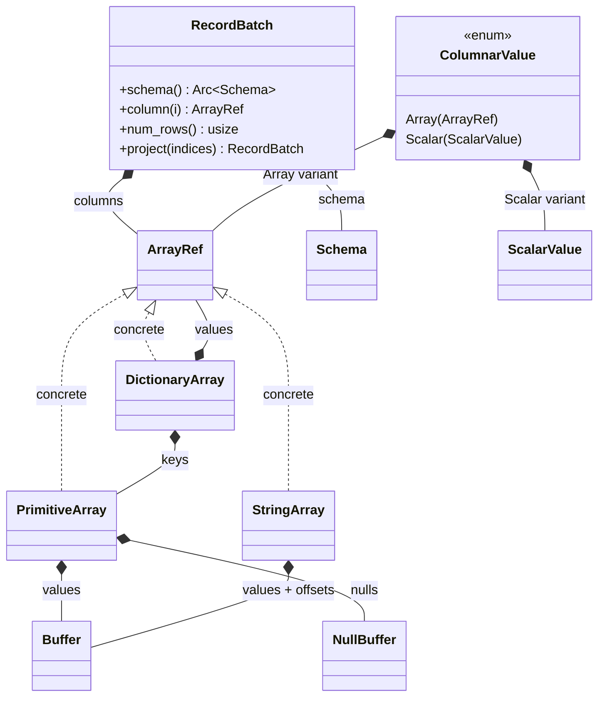

### 7. Data Exchange (Repartition)
Local-only shuffle. DataFusion has no built-in network exchange — the host handles inter-node communication.

| Struct/Trait | Path | Role |
|-------------|------|------|
| `RepartitionExec` | `pp.repartition` | Hash or round-robin repartition. Spawns Tokio tasks per input partition, routes batches to output channels via `tokio::sync::mpsc`. |
| `CoalescePartitionsExec` | `pp.coalesce_partitions` | Merges N input partitions into 1 output partition. Uses `mpsc` channels to collect from all inputs. |
| `SortPreservingMergeExec` | `pp.sorts.sort_preserving_merge` | Ordered merge of N sorted streams into 1 sorted stream. K-way merge via `SortPreservingMergeStream`. |
| `InterleaveExec` | `pp.repartition` | Round-robins across input partitions without hashing. |
| `EnforceDistribution` | physical optimizer | Physical optimizer rule that inserts `RepartitionExec` nodes to satisfy `required_input_distribution()`. |
| `EnforceSorting` | physical optimizer | Physical optimizer rule that inserts `SortExec` or `SortPreservingMergeExec` to satisfy `required_input_ordering()`. |

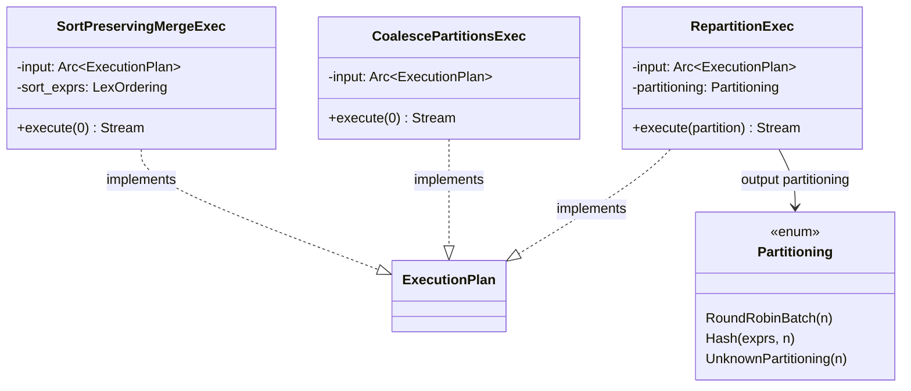

### 8. Catalog & Data Sources
The boundary between the engine and external data. Trait-based extensibility.

| Struct/Trait | Path | Role |
|-------------|------|------|
| **Catalog hierarchy** | | |
| `CatalogProvider` | `cat.catalog` | Trait: `schema_names()`, `schema(name)`. Top-level namespace. |
| `SchemaProvider` | `cat.schema` | Trait: `table_names()`, `table(name)`. Namespace within a catalog. |
| `TableProvider` | `cat.table` | Trait: the core data source interface. `scan(state, projection, filters, limit) -> ExecutionPlan`. Connectors implement this. |
| `TableProviderFilterPushDown` | `cat.table` | Enum: `Unsupported`, `Inexact`, `Exact`. Returned by `supports_filters_pushdown()` to indicate pushdown capability. |
| **Built-in sources** | | |
| `ListingTable` | `datasource.listing` | File-based table: discovers files via `ObjectStore`, partitions by file/row-group, delegates to format-specific readers. |
| `ParquetExec` | `parquet.source` | Parquet file reader. Row-group pruning via statistics, predicate pushdown via `ArrowPredicate`, page-level filtering. |
| `CsvExec` | `datasource-csv` | CSV file reader. |
| `JsonExec` | `datasource-json` | JSON file reader. |
| `MemTable` | `cat.memory` | In-memory table backed by `Vec<Vec<RecordBatch>>` (one vec per partition). |
| **Object storage** | | |
| `ObjectStore` | `object_store` crate | Trait: `get()`, `put()`, `list()`, `delete()`. Implementations for local FS, S3, GCS, Azure. |

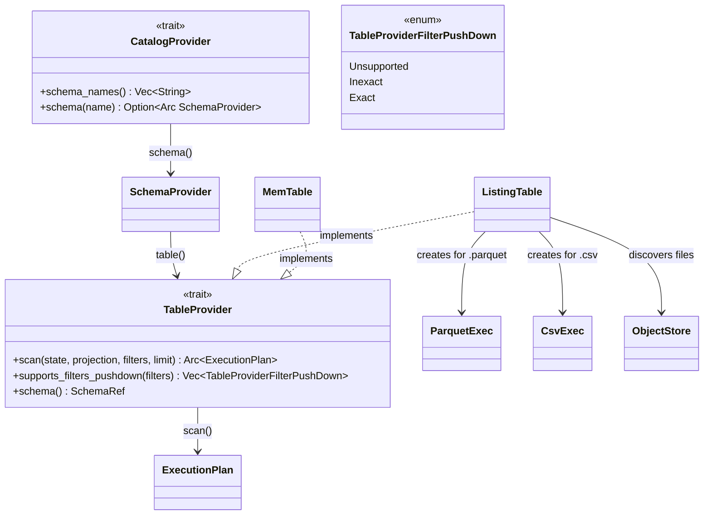

### 9. Memory Management
RAII-based tracking with optional pool limits. Simpler than Trino/Velox — no centralized arbitrator.

| Struct/Trait | Path | Role |
|-------------|------|------|
| `MemoryPool` | `exec.memory_pool` | Trait: `register(consumer)`, `grow(reservation, additional)`, `shrink(reservation, shrink)`. Process-wide or per-session. |
| `MemoryReservation` | `exec.memory_pool` | RAII guard. Tracks bytes reserved by one consumer. `try_grow(n)` requests from pool; `shrink(n)` returns to pool. Drop auto-frees. |
| `MemoryConsumer` | `exec.memory_pool.proxy` | Wraps a `MemoryReservation` with a human-readable name for diagnostics. |
| `GreedyMemoryPool` | `exec.memory_pool` | Tracks total across all consumers. `grow()` fails when total exceeds limit. No cross-query coordination. |
| `FairSpillPool` | `exec.memory_pool` | Distinguishes spillable vs non-spillable memory. Reserves a portion for non-spillable operations. |
| `UnboundedMemoryPool` | `exec.memory_pool` | No-op: always succeeds. For testing or unbounded use. |
| `DiskManager` | `exec.disk_manager` | Creates/manages temp files for spilling. Configurable: disabled, OS temp dir, or specific paths. |
| `SpillManager` | `pp.spill` | Coordinates spilling: serializes `RecordBatch` to Arrow IPC files, reads back as streams. |

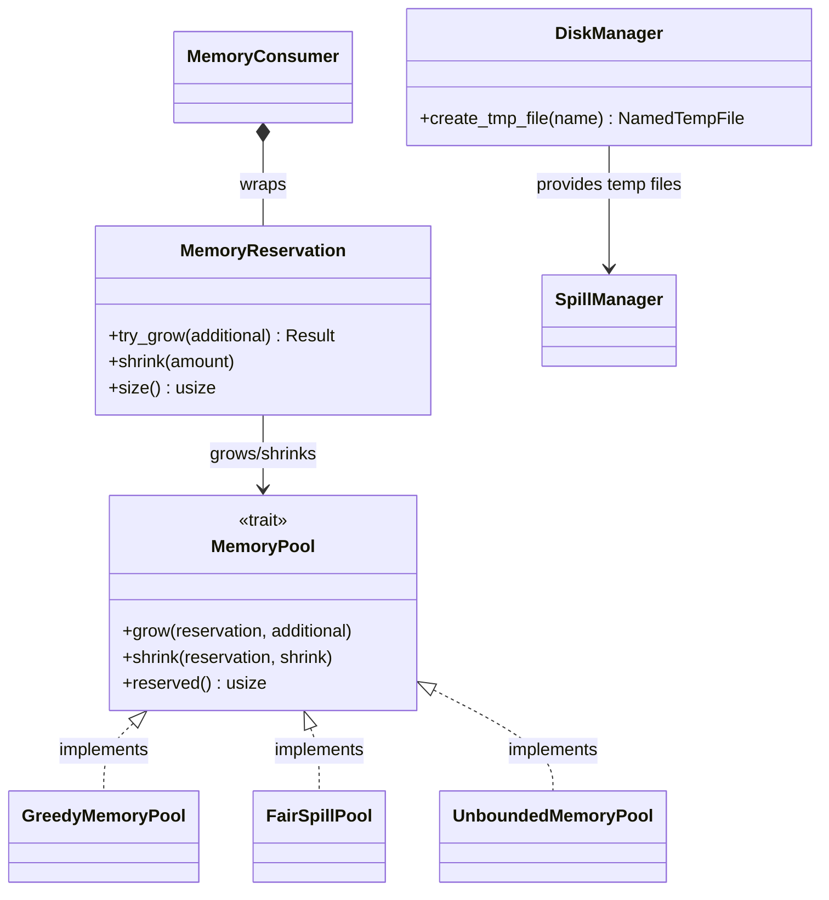

### 10. Function Registry
Extensible function system. Built-in functions organized by category across dedicated crates.

| Struct/Trait | Path | Role |
|-------------|------|------|
| `FunctionRegistry` | `expr.registry` | Trait: `udf(name)`, `udaf(name)`, `udwf(name)`. Resolves function names to implementations. |
| `ScalarUDF` | `expr.udf` | User-defined scalar function. Wraps a `ScalarUDFImpl` trait object. |
| `AggregateUDF` | `expr.udaf` | User-defined aggregate function. Wraps an `AggregateUDFImpl` with `Accumulator` factory. |
| `WindowUDF` | `expr.udwf` | User-defined window function. Wraps a `WindowUDFImpl`. |
| `Accumulator` | `functions-aggregate-common` | Trait: `update_batch()`, `merge_batch()`, `evaluate()`, `state()`. Per-group state for aggregation. |
| **Function crates** | | |
| `datafusion-functions` | | Math, string, regex, encoding, datetime, crypto functions. |
| `datafusion-functions-aggregate` | | `count`, `sum`, `avg`, `min`, `max`, `first_value`, `last_value`, `stddev`, `correlation`, `approx_distinct`, etc. |
| `datafusion-functions-window` | | `row_number`, `rank`, `dense_rank`, `ntile`, `lead`, `lag`, `cume_dist`, etc. |
| `datafusion-functions-nested` | | Array/map/struct manipulation functions. |
| `datafusion-functions-table` | | Table-generating functions (`generate_series`, `unnest`). |

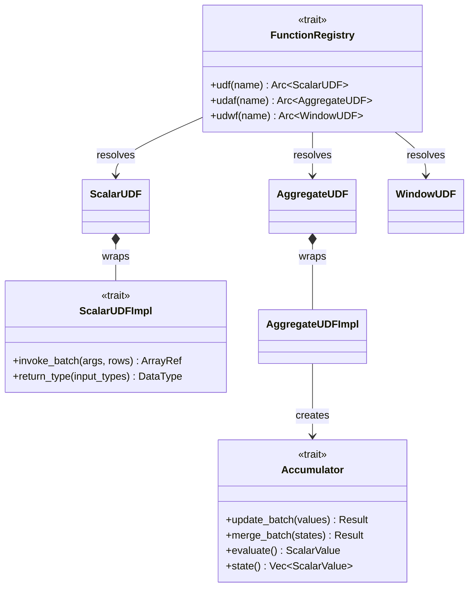

---

## Data Flow: How Modules Connect

```
┌───────────────────────────────────────────────────────────┐
│                      USER CODE                            │
│  SessionContext::sql("SELECT ...") or DataFrame API       │
└────────────────────────┬──────────────────────────────────┘
                         │
┌────────────────────────▼──────────────────────────────────┐
│                    [SQL Frontend]                          │
│  DFParser -> Statement -> SqlToRel -> LogicalPlan         │
└────────────────────────┬──────────────────────────────────┘
                         │
┌────────────────────────▼──────────────────────────────────┐
│              [Logical Plan & Optimizer]                    │
│  Analyzer (type coercion, validation)                     │
│  Optimizer (30+ rules: pushdown, eliminate, simplify)     │
│  -> Optimized LogicalPlan                                 │
└────────────────────────┬──────────────────────────────────┘
                         │
┌────────────────────────▼──────────────────────────────────┐
│              [Physical Plan Compilation]                   │
│  DefaultPhysicalPlanner: LogicalPlan -> ExecutionPlan     │
│  PhysicalOptimizer: enforce distribution, sorting,        │
│    insert RepartitionExec, SortExec, CoalesceBatches      │
└────────────────────────┬──────────────────────────────────┘
                         │ Arc<dyn ExecutionPlan>
┌────────────────────────▼──────────────────────────────────┐
│                 [Execution Engine]                         │
│  plan.execute(partition_idx, task_ctx)                     │
│  -> SendableRecordBatchStream (async Stream<RecordBatch>) │
│  Each partition = independent Tokio task                   │
│  ┌──────────┐   ┌──────────┐   ┌──────────┐              │
│  │   Scan   │──>│Transform │──>│   Sink   │              │
│  │ Operator │   │ Operator │   │ Operator │              │
│  └────┬─────┘   └──────────┘   └────┬─────┘              │
│       │         RecordBatch          │                    │
└───────┼──────────────────────────────┼────────────────────┘
        │                              │
┌───────▼──────────────┐    ┌──────────▼────────────────┐
│ [Catalog & Sources]  │    │ [Data Exchange]            │
│ TableProvider::scan() │    │ RepartitionExec            │
│ ParquetExec          │    │ CoalescePartitions         │
│ CsvExec              │    │ SortPreservingMerge        │
│       │              │    │ (local only, via           │
└───────┼──────────────┘    │  Tokio mpsc channels)      │
        │                   └────────────────────────────┘
┌───────▼──────────────┐
│    Object Store      │
│   (Local/S3/GCS)     │
└──────────────────────┘

CROSS-CUTTING:
┌───────────────────────────────────────────────────────────┐
│ [Memory Management]                                       │
│ MemoryPool <- MemoryReservation (RAII per-operator)       │
│ try_grow() -> Ok / Err (operator decides to spill)        │
│ DiskManager -> SpillManager -> Arrow IPC temp files       │
└───────────────────────────────────────────────────────────┘
┌───────────────────────────────────────────────────────────┐
│ [Data Model] (passive, used everywhere)                   │
│ Arrow Buffer -> Array (Primitive|String|Dict) -> RecordBatch │
└───────────────────────────────────────────────────────────┘
```

### Query Lifecycle (end-to-end)

1. **User** calls `SessionContext::sql("SELECT ...")` or builds a `DataFrame`
2. **DFParser** parses SQL into AST statements
3. **SqlToRel** converts AST → `LogicalPlan`, resolving tables against `CatalogProvider` → `SchemaProvider` → `TableProvider`
4. **Analyzer** runs semantic rules: type coercion, function resolution, subquery validation
5. **Optimizer** applies ~30 rules: filter pushdown, projection pruning, join reordering, common subexpression elimination
6. **DefaultPhysicalPlanner** maps each `LogicalPlan` node to an `ExecutionPlan` operator
7. **PhysicalOptimizer** inserts `RepartitionExec` (to satisfy distribution requirements), `SortExec` (to satisfy ordering), `CoalesceBatchesExec` (to right-size batches)
8. **Execution** begins: `plan.execute(partition_idx, task_ctx)` called per partition, each returning a `SendableRecordBatchStream`
9. **Tokio runtime** drives the async streams. Each partition runs as an independent task. Pull-based: downstream `poll_next()` pulls from upstream
10. **Scan operators** (`ParquetExec`, `CsvExec`) read from `ObjectStore`, apply row-group pruning and predicate pushdown
11. **Transform operators** (`FilterExec`, `ProjectionExec`, `HashJoinExec`, `AggregateExec`) process `RecordBatch` streams
12. **Exchange operators** (`RepartitionExec`) redistribute data across partitions via `tokio::sync::mpsc` channels — local only, no network
13. Each **operator** tracks memory via `MemoryReservation::try_grow()`. On failure, operators like `SortExec` spill to disk via `SpillManager` (Arrow IPC format)
14. **Results** flow back as `Vec<RecordBatch>` to `DataFrame::collect()` or as a stream to `DataFrame::execute_stream()`
15. **Memory** is freed automatically via RAII: `MemoryReservation` drops return bytes to the `MemoryPool`
