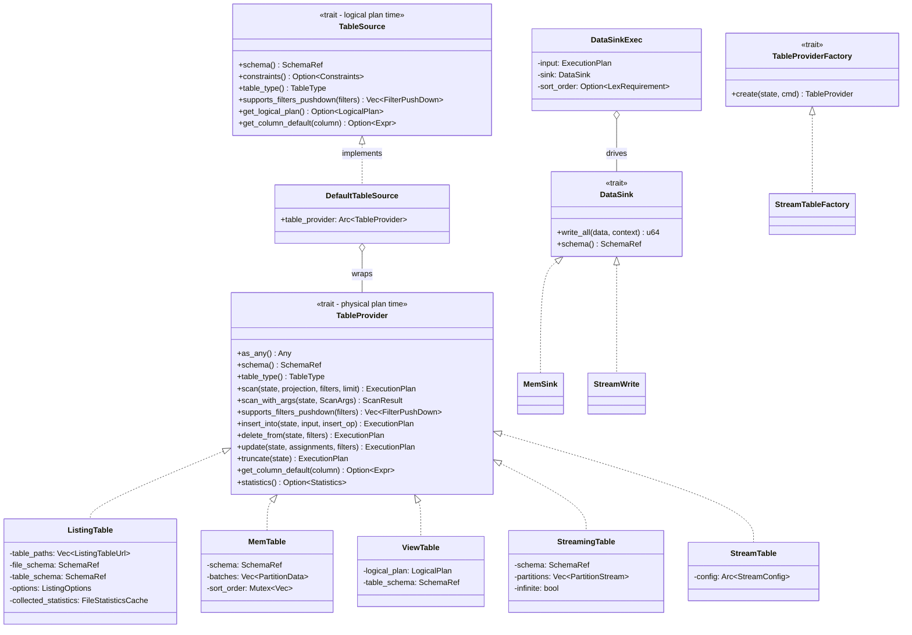

# Module Teardown: The Storage Plane -- TableProvider Contract

## Table of Contents

- [0. Research Focus](#0-research-focus)
- [1. High-Level Overview](#1-high-level-overview)
- [2. Structural Architecture](#2-structural-architecture)
  - [Primary Source Files](#primary-source-files)
  - [Key Data Structures](#key-data-structures)
  - [Class Diagram](#class-diagram)
- [3. Execution & Call Flow](#3-execution-call-flow)
  - [Read Path: Physical Planner Calls `scan()`](#read-path-physical-planner-calls-scan)
  - [Filter Pushdown: Optimizer Negotiation](#filter-pushdown-optimizer-negotiation)
  - [Write Path: INSERT INTO Flow](#write-path-insert-into-flow)
  - [Sequence Diagram](#sequence-diagram)
- [4. Concurrency & State Management](#4-concurrency-state-management)
  - [Read Side](#read-side)
  - [Write Side](#write-side)
- [5. Memory & Resource Profile](#5-memory-resource-profile)
  - [Read Path Allocation](#read-path-allocation)
  - [Write Path Allocation](#write-path-allocation)
  - [Critical Resource Concern: ListingTable File Discovery](#critical-resource-concern-listingtable-file-discovery)
- [6. Key Design Insights](#6-key-design-insights)
  - [Insight 1: The Two-Trait Split (TableSource vs TableProvider)](#insight-1-the-two-trait-split-tablesource-vs-tableprovider)
  - [Insight 2: Filter Pushdown Is a Negotiation, Not a Command](#insight-2-filter-pushdown-is-a-negotiation-not-a-command)
  - [Insight 3: scan() Can Receive Filter Columns Not in the Projection](#insight-3-scan-can-receive-filter-columns-not-in-the-projection)
  - [Insight 4: ListingTable's Partition Filter Splitting Strategy](#insight-4-listingtables-partition-filter-splitting-strategy)
  - [Insight 5: The DataSink Write Path Is Single-Partition by Design](#insight-5-the-datasink-write-path-is-single-partition-by-design)
  - [Insight 6: Write Operations Beyond INSERT (DELETE, UPDATE, TRUNCATE)](#insight-6-write-operations-beyond-insert-delete-update-truncate)
  - [Insight 7: scan_with_args() Is the New API Surface](#insight-7-scan_with_args-is-the-new-api-surface)
  - [Insight 8: TableProviderFactory for Dynamic Table Creation](#insight-8-tableproviderfactory-for-dynamic-table-creation)
  - [Insight 9: ViewTable Compiles to a Full Physical Plan at Scan Time](#insight-9-viewtable-compiles-to-a-full-physical-plan-at-scan-time)
  - [Insight 10: Comparison with Trino's Connector Model](#insight-10-comparison-with-trinos-connector-model)


## 0. Research Focus
* **Task ID:** 4.1.A
* **Focus:** Trace the `TableProvider` trait. How does `scan()` receive projections, filters, and limit hints? How does `supports_filters_pushdown()` negotiate predicate handling (Exact, Inexact, Unsupported)? Trace `DataSink` for write paths (`INSERT`, `CREATE TABLE AS`). Compare `TableProvider` to Trino's `ConnectorPageSource`.

## 1. High-Level Overview

* **Core Responsibility:** `TableProvider` is DataFusion's universal abstraction for any data source that can produce and consume Arrow `RecordBatch`es. It is the boundary between the query engine (optimizer + executor) and storage (files, memory, streams, remote systems). Every table in a DataFusion catalog is a `TableProvider`, and the trait's `scan()` method is the single entry point the physical planner uses to obtain an `ExecutionPlan` for reading data.

* **Key Triggers:** The physical planner encounters a `LogicalPlan::TableScan` node. It downcasts the `TableSource` to `DefaultTableSource`, extracts the wrapped `TableProvider`, and calls `scan_with_args()` (or `scan()`). For writes, the planner encounters `LogicalPlan::Dml` with `WriteOp::Insert` and calls `TableProvider::insert_into()`. The optimizer's `PushDownFilter` rule probes `supports_filters_pushdown()` before the physical plan is even created.

## 2. Structural Architecture

### Primary Source Files

| File | Purpose |
|------|---------|
| `datafusion/catalog/src/table.rs` | **`TableProvider` trait definition** -- the core contract with `scan()`, `insert_into()`, `delete_from()`, `update()`, `truncate()`, `supports_filters_pushdown()` |
| `datafusion/expr/src/table_source.rs` | **`TableSource` trait** -- planning-time subset of `TableProvider` (schema, filter pushdown, column defaults); **`TableProviderFilterPushDown` enum** |
| `datafusion/catalog/src/default_table_source.rs` | **`DefaultTableSource`** -- adapter that wraps `TableProvider` into `TableSource`; `source_as_provider()` / `provider_as_source()` conversion functions |
| `datafusion/catalog-listing/src/table.rs` | **`ListingTable`** -- file-based `TableProvider` (Parquet, CSV, JSON, etc.) |
| `datafusion/catalog/src/memory/table.rs` | **`MemTable`** -- in-memory `TableProvider` backed by `Vec<RecordBatch>` |
| `datafusion/catalog/src/streaming.rs` | **`StreamingTable`** -- `TableProvider` for `PartitionStream` sources |
| `datafusion/catalog/src/stream.rs` | **`StreamTable`** -- unbounded file-stream `TableProvider` (FIFO files) |
| `datafusion/catalog/src/view.rs` | **`ViewTable`** -- `TableProvider` backed by a `LogicalPlan` |
| `datafusion/datasource/src/sink.rs` | **`DataSink` trait** and **`DataSinkExec`** -- write-path execution |
| `datafusion/datasource/src/file_scan_config.rs` | **`FileScanConfig`** -- configuration for file-based scans |
| `datafusion/datasource/src/source.rs` | **`DataSourceExec`** -- generic physical plan node for data sources |
| `datafusion/core/src/physical_planner.rs` | Physical planner that bridges `LogicalPlan::TableScan` / `LogicalPlan::Dml` to `TableProvider` |
| `datafusion/optimizer/src/push_down_filter.rs` | Optimizer rule that calls `supports_filters_pushdown()` |

### Key Data Structures

```rust
// datafusion/catalog/src/table.rs

#[async_trait]
pub trait TableProvider: Debug + Sync + Send {
    fn as_any(&self) -> &dyn Any;
    fn schema(&self) -> SchemaRef;
    fn constraints(&self) -> Option<&Constraints> { None }
    fn table_type(&self) -> TableType;
    fn get_table_definition(&self) -> Option<&str> { None }
    fn get_logical_plan(&'_ self) -> Option<Cow<'_, LogicalPlan>> { None }
    fn get_column_default(&self, _column: &str) -> Option<&Expr> { None }

    // === Core read path ===
    async fn scan(
        &self,
        state: &dyn Session,
        projection: Option<&Vec<usize>>,  // column indices
        filters: &[Expr],                 // pushed-down predicates
        limit: Option<usize>,             // row limit hint
    ) -> Result<Arc<dyn ExecutionPlan>>;

    async fn scan_with_args<'a>(
        &self,
        state: &dyn Session,
        args: ScanArgs<'a>,
    ) -> Result<ScanResult> { /* default delegates to scan() */ }

    fn supports_filters_pushdown(
        &self,
        filters: &[&Expr],
    ) -> Result<Vec<TableProviderFilterPushDown>> {
        // Default: all Unsupported
        Ok(vec![TableProviderFilterPushDown::Unsupported; filters.len()])
    }

    fn statistics(&self) -> Option<Statistics> { None }

    // === Write paths ===
    async fn insert_into(&self, ...) -> Result<Arc<dyn ExecutionPlan>> { not_impl_err!() }
    async fn delete_from(&self, ...) -> Result<Arc<dyn ExecutionPlan>> { not_impl_err!() }
    async fn update(&self, ...) -> Result<Arc<dyn ExecutionPlan>> { not_impl_err!() }
    async fn truncate(&self, ...) -> Result<Arc<dyn ExecutionPlan>> { not_impl_err!() }
}
```

```rust
// datafusion/expr/src/table_source.rs

#[derive(Debug, Clone, PartialEq, Eq)]
pub enum TableProviderFilterPushDown {
    Unsupported,  // Filter NOT pushed to scan; engine applies Filter operator
    Inexact,      // Filter pushed to scan; engine ALSO applies Filter operator (double-check)
    Exact,        // Filter pushed to scan; engine REMOVES Filter operator (trusted)
}
```

```rust
// datafusion/catalog/src/table.rs -- ScanArgs (structured alternative to scan())

#[derive(Debug, Clone, Default)]
pub struct ScanArgs<'a> {
    filters: Option<&'a [Expr]>,
    projection: Option<&'a [usize]>,
    limit: Option<usize>,
}
```

### Class Diagram



## 3. Execution & Call Flow

### Read Path: Physical Planner Calls `scan()`

When the physical planner encounters `LogicalPlan::TableScan`, it follows this exact code path:

```rust
// datafusion/core/src/physical_planner.rs, line ~550
LogicalPlan::TableScan(scan) => {
    let TableScan { source, projection, filters, fetch, projected_schema, .. } = scan;

    if let Ok(source) = source_as_provider(source) {
        // Remove qualifiers -- provider doesn't know how the table was referenced
        let filters = unnormalize_cols(filters.iter().cloned());
        let filters_vec = filters.into_iter().collect::<Vec<_>>();
        let opts = ScanArgs::default()
            .with_projection(projection.as_deref())
            .with_filters(Some(&filters_vec))
            .with_limit(*fetch);
        let res = source.scan_with_args(session_state, opts).await?;
        Arc::clone(res.plan())
    } else {
        // Fall through to ExtensionPlanner for custom TableSource types
        for planner in &self.extension_planners {
            maybe_plan = planner.plan_table_scan(self, scan, session_state).await?;
        }
        // ...
    }
}
```

Key observations:
1. The `source_as_provider()` call downcasts `Arc<dyn TableSource>` back to `Arc<dyn TableProvider>` by looking for `DefaultTableSource`.
2. Column qualifiers are stripped via `unnormalize_cols()` -- the `TableProvider` sees bare column names.
3. The `fetch` field on `TableScan` (from LIMIT pushdown) becomes the `limit` argument.
4. If the `TableSource` is not a `DefaultTableSource`, the engine tries `ExtensionPlanner::plan_table_scan()` as a fallback for custom table sources.

### Filter Pushdown: Optimizer Negotiation

The `PushDownFilter` optimizer rule calls `supports_filters_pushdown()` on the `TableSource` (which delegates to `TableProvider`) to negotiate which filters the source can handle:

```rust
// datafusion/optimizer/src/push_down_filter.rs, line ~1144
LogicalPlan::TableScan(scan) => {
    let filter_predicates = split_conjunction(&filter.predicate);

    // Separate volatile (e.g., random()) from non-volatile filters
    let (volatile_filters, non_volatile_filters) =
        filter_predicates.into_iter().partition(|pred| pred.is_volatile());

    // Ask the source which filters it supports
    let supported_filters = scan
        .source
        .supports_filters_pushdown(non_volatile_filters.as_slice())?;

    // Filters with Exact or Inexact go INTO the scan
    let new_scan_filters = zip.clone()
        .filter(|(_, res)| res != &TableProviderFilterPushDown::Unsupported)
        .map(|(pred, _)| pred);

    // Filters with Unsupported or Inexact remain as a Filter node ABOVE the scan
    let new_predicate = zip
        .filter(|(_, res)| res != &TableProviderFilterPushDown::Exact)
        .map(|(pred, _)| pred)
        .chain(volatile_filters)  // volatile always stay above
        .cloned()
        .collect();

    let new_scan = LogicalPlan::TableScan(TableScan {
        filters: new_scan_filters,
        ..scan
    });

    // If there are remaining predicates, wrap in a Filter node
    if let Some(predicate) = conjunction(new_predicate) {
        make_filter(predicate, Arc::new(new_scan))
    }
}
```

The three-way negotiation:
- **`Exact`**: Filter goes into `TableScan.filters` AND is removed from the `Filter` node above. The source guarantees correctness.
- **`Inexact`**: Filter goes into `TableScan.filters` AND also stays in a `Filter` node above. Double-checking.
- **`Unsupported`**: Filter stays only in the `Filter` node above. Source cannot handle it.

**Critical detail on Limit + Inexact interaction** (from the `scan()` docs):
> Note: If any pushed-down filters are `Inexact`, the `LIMIT` cannot be pushed down. Inexact filters do not guarantee that every filtered row is removed, so applying the limit could leave too few rows to return in the final result.

### Write Path: INSERT INTO Flow

```rust
// datafusion/core/src/physical_planner.rs, line ~730
LogicalPlan::Dml(DmlStatement {
    target,
    op: WriteOp::Insert(insert_op),
    ..
}) => {
    let provider = target.as_any().downcast_ref::<DefaultTableSource>();
    let input_exec = children.one()?;  // the child physical plan producing data
    provider.table_provider
        .insert_into(session_state, input_exec, *insert_op)
        .await?
}
```

The `DmlStatement` logical plan carries:
- `table_name`: The target table reference
- `target`: `Arc<dyn TableSource>` (wrapping the `TableProvider`)
- `op`: `WriteOp::Insert(InsertOp)` where `InsertOp` is `Append`, `Overwrite`, or `Replace`
- `input`: The `LogicalPlan` producing data to write

Each `TableProvider` implementation returns an `ExecutionPlan` for the write. Typically this is a `DataSinkExec` wrapping a `DataSink`.

### Sequence Diagram

```mermaid
sequenceDiagram
    participant SQL as SQL Query
    participant LP as LogicalPlan
    participant OPT as PushDownFilter Optimizer
    participant TP as TableProvider
    participant PP as PhysicalPlanner
    participant EP as ExecutionPlan

    Note over SQL,EP: === Read Path ===

    SQL->>LP: SELECT a FROM t WHERE b > 5 LIMIT 10
    LP->>LP: Create TableScan(source, projection=None, filters=[], fetch=None)

    LP->>OPT: Optimize logical plan
    OPT->>TP: supports_filters_pushdown([b > 5])
    TP-->>OPT: [Inexact]
    OPT->>LP: TableScan(filters=[b > 5]) + Filter(b > 5) above
    Note over OPT: Inexact means filter in scan AND retained above

    OPT->>LP: Push LIMIT down: TableScan(fetch=None)
    Note over OPT: Cannot push limit because Inexact filter present

    OPT->>LP: Push projection: TableScan(projection=[0])

    LP->>PP: create_physical_plan(TableScan)
    PP->>PP: source_as_provider(source) -- downcast DefaultTableSource
    PP->>PP: unnormalize_cols(filters) -- strip qualifiers
    PP->>TP: scan_with_args(state, ScanArgs{projection=[0], filters=[b>5], limit=None})
    TP-->>PP: Arc<dyn ExecutionPlan> (e.g. DataSourceExec)
    PP->>EP: Return physical plan tree

    Note over SQL,EP: === Write Path (INSERT INTO) ===

    SQL->>LP: INSERT INTO t SELECT ...
    LP->>LP: Create Dml(target, WriteOp::Insert(Append), input)
    LP->>PP: create_physical_plan(Dml)
    PP->>PP: downcast target to DefaultTableSource
    PP->>TP: insert_into(state, input_exec, InsertOp::Append)
    TP-->>PP: Arc<DataSinkExec> wrapping a DataSink
    PP->>EP: Return DataSinkExec

    Note over EP: DataSinkExec.execute() calls sink.write_all(stream)
```

## 4. Concurrency & State Management

### Read Side

- **`ListingTable`**: File discovery (`list_files_for_scan`) runs concurrently via `stream::flatten_unordered(meta_fetch_concurrency)` and `buffer_unordered(meta_fetch_concurrency)` for statistics collection. Files are then split into `target_partitions` file groups, each group becoming one partition of the `DataSourceExec`. The executor runs partitions concurrently.

- **`MemTable`**: Each partition is an `Arc<RwLock<Vec<RecordBatch>>>`. The `scan()` method acquires read locks sequentially to clone the data. No cross-partition coordination is needed.

- **`StreamingTable` / `StreamTable`**: Each `PartitionStream` is independently executed. `StreamTable` uses `StreamingTableExec` which creates one stream per partition. `StreamRead` spawns a blocking task to read from the FIFO file and sends batches via a channel.

- **`ViewTable`**: Delegates entirely to `state.create_physical_plan()` -- it rebuilds a full physical plan from the view's `LogicalPlan` with filters, projections, and limits layered on.

### Write Side

- **`DataSinkExec`**: Requires `Distribution::SinglePartition` input -- the optimizer inserts a merge/coalesce before the sink. The `execute()` method is called on partition 0 only:

```rust
// datafusion/datasource/src/sink.rs, line ~234
fn execute(&self, partition: usize, context: Arc<TaskContext>) -> Result<...> {
    assert_eq_or_internal_err!(partition, 0, "DataSinkExec can only be called on partition 0!");
    let data = execute_input_stream(Arc::clone(&self.input), ...);
    let stream = futures::stream::once(async move {
        sink.write_all(data, &context).await.map(make_count_batch)
    });
    Ok(Box::pin(RecordBatchStreamAdapter::new(count_schema, stream)))
}
```

- **`MemSink::write_all()`**: Distributes incoming batches round-robin across partitions. Each partition is written under a write lock (`target.write().await`).

- **`StreamWrite::write_all()`**: Spawns a blocking task for the writer, sends batches through a `tokio::sync::mpsc::channel(2)` with a buffer of 2.

- **`MemTable::delete_from()` / `update()`**: Acquire write locks per partition, evaluate filters in-memory, and rebuild batches. No `DataSink` involved -- returns a `DmlResultExec` that yields the count.

## 5. Memory & Resource Profile

### Read Path Allocation

- **Projection pushdown** minimizes columns read. `scan()` receives `projection: Option<&Vec<usize>>` -- column indices into the table schema. Sources like Parquet use this to skip reading entire column chunks.

- **`ListingTable`** allocates `PartitionedFile` structs during file discovery, each holding `ObjectMeta` (size, path, last_modified). Statistics are cached in `Arc<dyn FileStatisticsCache>` (default: `DefaultFileStatisticsCache` backed by a `DashMap`). The cache persists across queries within a session.

- **`FileScanConfig`** holds all file groups, statistics, and orderings. The `file_groups: Vec<FileGroup>` determines parallelism -- each `FileGroup` becomes one partition.

- **`MemTable::scan()`** clones the `Vec<RecordBatch>` per partition (data is `Arc` so only metadata is copied, not the Arrow buffers).

### Write Path Allocation

- **`DataSinkExec`** produces a single-row output: `RecordBatch` with one `UInt64` column ("count"). The `count_schema` is allocated once.

- **`MemSink`** accumulates all incoming batches in a `Vec<Vec<RecordBatch>>` before distributing to partition write-locks. No intermediate buffering.

- **`StreamWrite`** uses a bounded channel (`capacity=2`) to bound memory between the async stream consumer and the blocking writer task.

### Critical Resource Concern: ListingTable File Discovery

`ListingTable::list_files_for_scan()` can be expensive for large datasets. When `collect_stat=true`, it reads file metadata (e.g., Parquet footers) for every file. This is mitigated by:
1. `FileStatisticsCache` -- reuses stats across queries
2. `meta_fetch_concurrency` config -- controls concurrent metadata reads
3. `get_files_with_limit()` -- stops collecting files once the accumulated row count exceeds the limit (when no filters are active)

## 6. Key Design Insights

### Insight 1: The Two-Trait Split (TableSource vs TableProvider)

DataFusion maintains a deliberate separation between `TableSource` (logical plan time) and `TableProvider` (physical plan time). This exists so that `datafusion-expr` has no dependency on the execution engine:

```rust
// datafusion/expr/src/table_source.rs
// TableSource is in the expr crate -- no physical plan dependency
pub trait TableSource: Sync + Send {
    fn schema(&self) -> SchemaRef;
    fn supports_filters_pushdown(&self, filters: &[&Expr]) -> Result<Vec<TableProviderFilterPushDown>>;
    fn get_logical_plan(&'_ self) -> Option<Cow<'_, LogicalPlan>>;
    // ...
}
```

```rust
// datafusion/catalog/src/default_table_source.rs
// DefaultTableSource bridges the two
pub struct DefaultTableSource {
    pub table_provider: Arc<dyn TableProvider>,
}
impl TableSource for DefaultTableSource {
    fn supports_filters_pushdown(&self, filter: &[&Expr]) -> Result<Vec<...>> {
        self.table_provider.supports_filters_pushdown(filter)  // delegation
    }
}
```

The `source_as_provider()` function reverses this bridge at physical planning time by downcasting `TableSource -> DefaultTableSource -> TableProvider`. If the downcast fails, the `ExtensionPlanner` mechanism handles custom `TableSource` implementations.

This design means projects can use DataFusion's logical planner and optimizer without pulling in the physical execution engine.

### Insight 2: Filter Pushdown Is a Negotiation, Not a Command

The optimizer does not force filters onto the source. It asks, and the source responds per-filter:

```rust
// ListingTable's implementation -- partition filters are Exact, everything else Inexact
fn supports_filters_pushdown(&self, filters: &[&Expr]) -> Result<Vec<...>> {
    filters.iter().map(|filter| {
        if can_be_evaluated_for_partition_pruning(&partition_column_names, filter) {
            Ok(TableProviderFilterPushDown::Exact)  // partition pruning is reliable
        } else {
            Ok(TableProviderFilterPushDown::Inexact)  // file format may or may not handle it
        }
    }).collect()
}
```

The critical consequence: `Inexact` prevents limit pushdown. The `scan()` documentation is explicit:
> Note: If any pushed-down filters are `Inexact`, the `LIMIT` cannot be pushed down.

This is because an inexact filter might pass rows that don't match, so if you apply LIMIT at the scan level, you might stop reading too early and miss valid rows.

`ViewTable` returns `Exact` for all filters because it wraps them into a `LogicalPlan::Filter` over the view's plan, letting the optimizer handle them with full correctness.

### Insight 3: scan() Can Receive Filter Columns Not in the Projection

The `scan()` documentation explicitly calls out a subtle case:

```
For example, given the query `SELECT t.a FROM t WHERE t.b > 5`,
after projection + filter pushdown, the scan may receive:
  projection = [a]  (only column a)
  filters = [b > 5] (references column b, NOT in projection)
```

This means `scan()` implementations must handle evaluating filter expressions that reference columns not in the output projection. Internally, the scan reads column `b` for filtering but does not include it in the output. This is a common source of bugs in custom `TableProvider` implementations.

### Insight 4: ListingTable's Partition Filter Splitting Strategy

`ListingTable::scan_with_args()` splits filters into two categories before doing any file I/O:

```rust
// catalog-listing/src/table.rs, line ~506
let (partition_filters, filters): (Vec<_>, Vec<_>) =
    filters.iter().cloned().partition(|filter| {
        can_be_evaluated_for_partition_pruning(&table_partition_col_names, filter)
    });
```

- **Partition filters** (referencing only partition columns like `year`, `month`): Used immediately for partition pruning via `pruned_partition_list()` to avoid listing irrelevant directories entirely.
- **Non-partition filters**: Passed to the file format's physical plan for in-file evaluation (e.g., Parquet predicate pushdown into row groups).

This two-level filtering is a performance-critical design: partition pruning eliminates entire file trees before any data is read, while data-level filters reduce I/O within the remaining files.

### Insight 5: The DataSink Write Path Is Single-Partition by Design

`DataSinkExec` enforces `Distribution::SinglePartition`:

```rust
// datafusion/datasource/src/sink.rs
fn required_input_distribution(&self) -> Vec<Distribution> {
    vec![Distribution::SinglePartition; self.children().len()]
}
```

This means the optimizer MUST insert a coalesce/merge before `DataSinkExec`. The sink receives a single `SendableRecordBatchStream` and writes it. This simplifies sink implementations (no concurrent write coordination needed) but can be a bottleneck for high-throughput writes.

`DataSinkExec::execute()` asserts `partition == 0` and calls `sink.write_all(data, &context)`, which returns `u64` (row count). The count is wrapped in a `RecordBatch` with schema `{count: UInt64}`.

### Insight 6: Write Operations Beyond INSERT (DELETE, UPDATE, TRUNCATE)

The `TableProvider` trait includes full DML support, not just reads:

```rust
// Physical planner handles all DML variants via the same pattern:
LogicalPlan::Dml(DmlStatement { target, op: WriteOp::Delete, input, .. }) => {
    let filters = extract_dml_filters(input, table_name)?;
    provider.table_provider.delete_from(session_state, filters).await?
}
LogicalPlan::Dml(DmlStatement { target, op: WriteOp::Update, input, .. }) => {
    let filters = extract_dml_filters(input, table_name)?;
    let assignments = extract_update_assignments(input)?;
    provider.table_provider.update(session_state, assignments, filters).await?
}
```

The `extract_dml_filters()` function walks the logical plan tree, collecting Filter predicates and TableScan filters, deduplicating them (since `Inexact` pushdown creates duplicates). It also handles `UPDATE...FROM` multi-table scenarios by only extracting predicates from the target table.

`MemTable` implements all four write operations. `ListingTable` implements only `insert_into()`. All default implementations return `not_impl_err!`.

### Insight 7: scan_with_args() Is the New API Surface

The `scan_with_args()` method with `ScanArgs` is the newer, extensible API:

```rust
pub struct ScanArgs<'a> {
    filters: Option<&'a [Expr]>,
    projection: Option<&'a [usize]>,
    limit: Option<usize>,
}
```

The default implementation delegates to the legacy `scan()`:

```rust
async fn scan_with_args<'a>(&self, state: &dyn Session, args: ScanArgs<'a>) -> Result<ScanResult> {
    let filters = args.filters().unwrap_or(&[]);
    let projection = args.projection().map(|p| p.to_vec());
    let limit = args.limit();
    let plan = self.scan(state, projection.as_ref(), filters, limit).await?;
    Ok(plan.into())
}
```

`ListingTable` overrides `scan_with_args()` directly and delegates `scan()` to it (the inverse). This is a migration pattern -- new implementations can override `scan_with_args()` while old code continues to call `scan()`.

### Insight 8: TableProviderFactory for Dynamic Table Creation

```rust
// datafusion/catalog/src/table.rs
#[async_trait]
pub trait TableProviderFactory: Debug + Sync + Send {
    async fn create(
        &self,
        state: &dyn Session,
        cmd: &CreateExternalTable,
    ) -> Result<Arc<dyn TableProvider>>;
}
```

This enables `CREATE EXTERNAL TABLE` to dynamically create table providers at runtime. `StreamTableFactory` is a concrete example that creates `StreamTable` instances from `CREATE UNBOUNDED EXTERNAL TABLE` statements, parsing the file location, encoding (CSV/JSON), and header options from the command.

### Insight 9: ViewTable Compiles to a Full Physical Plan at Scan Time

Unlike other `TableProvider` implementations that return a leaf `ExecutionPlan`, `ViewTable::scan()` constructs a new logical plan, applies filter/projection/limit on top, and calls `state.create_physical_plan()`:

```rust
// catalog/src/view.rs
async fn scan(&self, state: &dyn Session, projection, filters, limit) -> Result<...> {
    let plan = self.logical_plan().clone();
    let mut plan = LogicalPlanBuilder::from(plan);
    if let Some(filter) = filter { plan = plan.filter(filter)?; }
    if let Some(projection) = projection { plan = plan.project(fields)?; }
    if let Some(limit) = limit { plan = plan.limit(0, Some(limit))?; }
    state.create_physical_plan(&plan.build()?).await  // full re-optimization
}
```

This means querying a view triggers a full optimization pass on the view's underlying query, with the pushed-down predicates from the outer query. This is why `ViewTable` returns `Exact` for all filters -- it layers them into the plan for the optimizer to handle.

### Insight 10: Comparison with Trino's Connector Model

| Concept | DataFusion | Trino |
|---------|-----------|-------|
| **Table abstraction** | `TableProvider` trait | `ConnectorTableHandle` + `ConnectorMetadata` |
| **Read execution** | `scan()` returns `ExecutionPlan` (full tree) | `ConnectorPageSource` returns `Page`s (single reader) |
| **Granularity** | One `scan()` call per table; plan handles all parallelism | One `ConnectorPageSource` per `ConnectorSplit`; driver manages parallelism |
| **Filter negotiation** | `supports_filters_pushdown()` at plan time | `ConnectorMetadata.applyFilter()` during analysis |
| **Filter result** | `Exact` / `Inexact` / `Unsupported` per filter | `Constraint` applied to `TableHandle`; residual predicates |
| **Projection** | Column indices in `scan()` argument | Column handles in `ConnectorTableHandle` |
| **Write path** | `insert_into()` returns `ExecutionPlan` with `DataSink` | `ConnectorPageSink.appendPage()` called by operator |
| **Split discovery** | `ListingTable::list_files_for_scan()` internal | `ConnectorSplitManager.getSplits()` explicit |
| **Parallelism model** | File groups -> partitions of `DataSourceExec` | Splits -> Tasks assigned to workers |

**Key architectural difference**: In DataFusion, `scan()` returns a complete `ExecutionPlan` subtree that the provider controls entirely. In Trino, the connector provides a `ConnectorPageSource` that is a simple page-at-a-time reader, and the engine wraps it in its own `Driver` / `Operator` infrastructure. DataFusion gives more power to the provider (it can return multi-node plan trees), while Trino maintains tighter control over the execution model.

**Split management difference**: Trino has an explicit `ConnectorSplitManager` that produces `ConnectorSplit` objects, each representing a unit of work (e.g., one HDFS block, one S3 prefix range). DataFusion's equivalent is implicit -- `ListingTable::list_files_for_scan()` discovers files and groups them into `FileGroup`s, but this is internal to the `ListingTable` implementation rather than being a separate abstraction in the `TableProvider` contract. Custom providers handle their own partitioning inside `scan()`.
