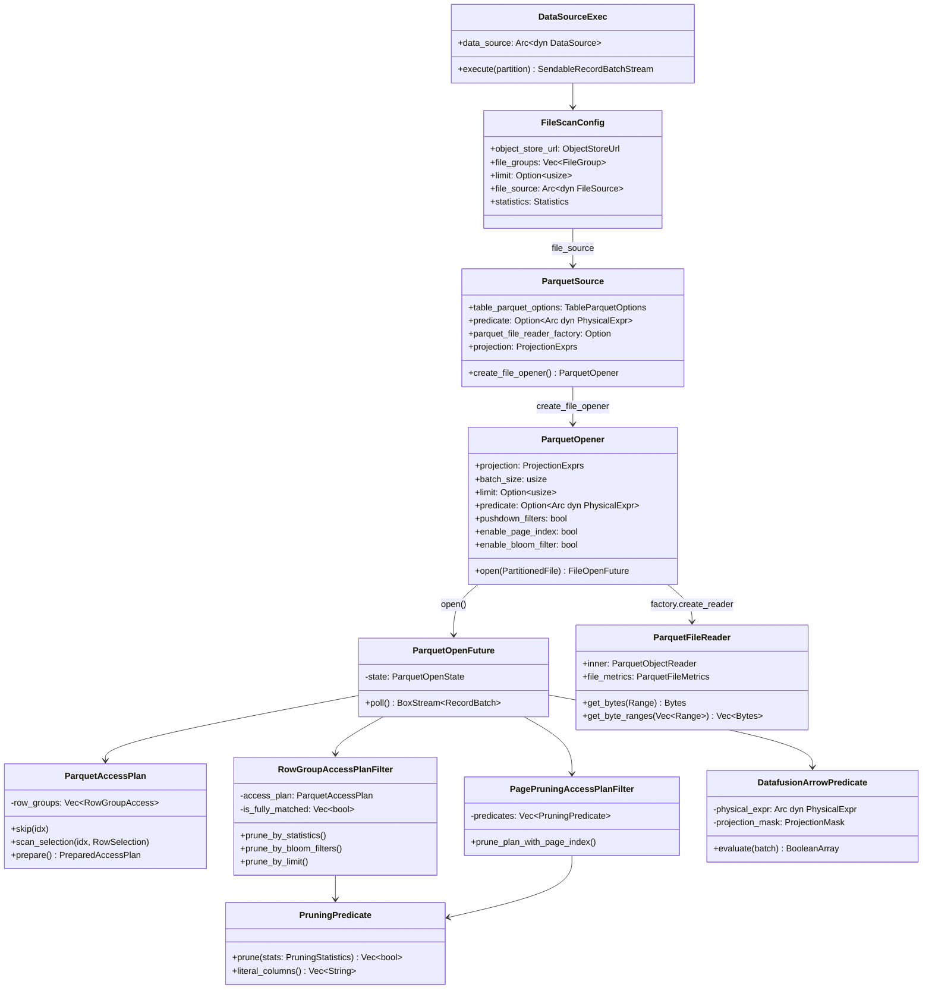
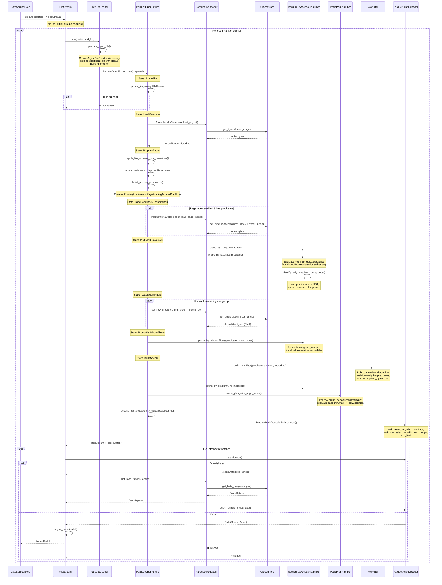

# Module Teardown: The Storage Plane -- Parquet Scan Pipeline

## 0. Research Focus
* **Task ID:** 4.1.B
* **Focus:** Trace the full Parquet scan pipeline inside `ParquetExec` / `DataSourceExec`. How does row-group pruning use min/max statistics? How does page index pruning work? How does the row-level `RowFilter` apply pushed-down predicates during decode? Trace `object_store` byte-range fetching and how it integrates with `tokio` for async I/O.

## 1. High-Level Overview

* **Core Responsibility:** The Parquet scan pipeline is DataFusion's primary mechanism for reading columnar data from Parquet files stored in object stores (local, S3, GCS, etc.). It implements a multi-level predicate pruning pipeline -- file-level, row-group-level (statistics + bloom filters), page-level (page index), and row-level (late materialization) -- to minimize I/O and decode work. The pipeline is fully async, driven by a hand-rolled state machine (`ParquetOpenState`) that interleaves CPU-only pruning steps with async I/O steps for metadata, page indexes, and bloom filters.

* **Key Triggers:** `DataSourceExec::execute(partition)` creates a `FileStream` with a `ParquetOpener`. When the stream is polled, it opens each `PartitionedFile` through the opener's state machine, which fetches metadata, applies pruning, builds the decoder, and yields `RecordBatch`es.

## 2. Structural Architecture

### Primary Source Files

| File | Crate | Role |
|------|-------|------|
| `datasource-parquet/src/source.rs` | `datafusion-datasource-parquet` | `ParquetSource` -- the `FileSource` impl that configures the scan |
| `datasource-parquet/src/opener.rs` | `datafusion-datasource-parquet` | `ParquetOpener` -- the state machine that opens each file |
| `datasource-parquet/src/access_plan.rs` | `datafusion-datasource-parquet` | `ParquetAccessPlan` -- tracks which row groups/rows to scan |
| `datasource-parquet/src/row_group_filter.rs` | `datafusion-datasource-parquet` | `RowGroupAccessPlanFilter` -- row group pruning via stats, bloom filters, limit |
| `datasource-parquet/src/page_filter.rs` | `datafusion-datasource-parquet` | `PagePruningAccessPlanFilter` -- page-level pruning via column/offset index |
| `datasource-parquet/src/row_filter.rs` | `datafusion-datasource-parquet` | `DatafusionArrowPredicate` / `build_row_filter` -- row-level filtering during decode |
| `datasource-parquet/src/reader.rs` | `datafusion-datasource-parquet` | `ParquetFileReaderFactory`, `DefaultParquetFileReaderFactory`, `CachedParquetFileReaderFactory` |
| `datasource-parquet/src/metrics.rs` | `datafusion-datasource-parquet` | `ParquetFileMetrics` -- per-file pruning/scan metrics |
| `datasource-parquet/src/metadata.rs` | `datafusion-datasource-parquet` | `DFParquetMetadata` -- metadata fetching with cache support |
| `datasource/src/file_scan_config.rs` | `datafusion-datasource` | `FileScanConfig` -- file groups, partitions, projection, limits |
| `datasource/src/file_stream/mod.rs` | `datafusion-datasource` | `FileStream` -- iterates files, calls `FileOpener::open` |
| `datasource/src/source.rs` | `datafusion-datasource` | `DataSourceExec` -- the `ExecutionPlan` that drives everything |
| `pruning/src/pruning_predicate.rs` | `datafusion-pruning` | `PruningPredicate` -- general-purpose stats-based pruning |
| `pruning/src/file_pruner.rs` | `datafusion-pruning` | `FilePruner` -- file-level pruning with dynamic filter support |

### Key Data Structures

| Structure | Description |
|-----------|-------------|
| `ParquetSource` | Holds `TableParquetOptions`, predicate, projection, `ParquetFileReaderFactory`. Implements `FileSource` trait. |
| `ParquetOpener` | Contains all config needed to open one file: projection, predicate, batch size, limit, pruning flags, factory. Implements `FileOpener`. |
| `ParquetOpenState` | 10-state FSM: `Start -> PruneFile -> LoadMetadata -> PrepareFilters -> LoadPageIndex -> PruneWithStatistics -> LoadBloomFilters -> PruneWithBloomFilters -> BuildStream -> Done` |
| `ParquetAccessPlan` | `Vec<RowGroupAccess>` where each entry is `Skip`, `Scan`, or `Selection(RowSelection)`. Progressive refinement through pruning stages. |
| `RowGroupAccessPlanFilter` | Wraps `ParquetAccessPlan` + `is_fully_matched` vector. Methods: `prune_by_statistics`, `prune_by_bloom_filters`, `prune_by_range`, `prune_by_limit`. |
| `PagePruningAccessPlanFilter` | Holds per-column `PruningPredicate`s extracted from the conjuncts. Converts page-level min/max to `RowSelection`. |
| `PruningPredicate` | Converts a `PhysicalExpr` into an expression that can be evaluated against `PruningStatistics` (min/max/null_count/row_count). |
| `DatafusionArrowPredicate` | Implements arrow-rs `ArrowPredicate` trait -- evaluates a `PhysicalExpr` against a `RecordBatch` during decode, producing a `BooleanArray` mask. |
| `FilterCandidate` | An expression that can be pushed down, annotated with `required_bytes` (for cost estimation) and a `ParquetReadPlan` (projection mask). |
| `ParquetFileReader` | Wraps `ParquetObjectReader`, implements `AsyncFileReader`, tracks `bytes_scanned`. |
| `CachedParquetFileReader` | Like `ParquetFileReader` but checks/updates `FileMetadataCache` for footer metadata. |
| `PushDecoderStreamState` | Drives the `ParquetPushDecoder` loop: requests byte ranges, pushes data, yields projected batches. |
| `FileScanConfig` | Core config: `object_store_url`, `file_groups: Vec<FileGroup>`, `limit`, `preserve_order`, `output_ordering`, `file_source`, `statistics`. |

### Class Diagram



## 3. Execution & Call Flow

### The 10-State File Opening State Machine

The heart of the Parquet scan is `ParquetOpenFuture`, which implements `Future` via an explicit state machine in `opener.rs`. The state diagram from the source:

```
     Start
       |
       v
 [LoadEncryption]?   (only with parquet_encryption feature)
       |
       v
   PruneFile          CPU: prune using file-level stats before loading metadata
       |
       v
  LoadMetadata        I/O: read Parquet footer (via AsyncFileReader::get_metadata)
       |
       v
 PrepareFilters       CPU: coerce schemas, adapt predicates, build PruningPredicates
       |
       v
  LoadPageIndex       I/O: conditionally load page index from file
       |
       v
PruneWithStatistics   CPU: prune row groups via min/max stats
       |
       v
 LoadBloomFilters     I/O: load bloom filters for remaining row groups
       |
       v
PruneWithBloomFilters CPU: prune row groups via bloom filter checks
       |
       v
  BuildStream         CPU+Config: build RowFilter, apply page index pruning,
       |                          construct ParquetPushDecoder
       v
     Done
```

The `Future::poll` loop drives this:
```rust
// opener.rs line 398-467
fn poll(mut self: Pin<&mut Self>, cx: &mut Context<'_>) -> Poll<Self::Output> {
    loop {
        let state = mem::replace(&mut self.state, ParquetOpenState::Done);
        let mut state = state.transition()?;  // CPU transitions
        match state {
            ParquetOpenState::LoadMetadata(mut future) => {
                state = match future.poll_unpin(cx) {
                    Poll::Ready(result) => ParquetOpenState::PrepareFilters(Box::new(result?)),
                    Poll::Pending => {
                        self.state = ParquetOpenState::LoadMetadata(future);
                        return Poll::Pending;
                    }
                };
            }
            // ... similar for LoadPageIndex, LoadBloomFilters
            ParquetOpenState::Ready(stream) => return Poll::Ready(Ok(stream)),
            ParquetOpenState::Done => return Poll::Ready(Ok(futures::stream::empty().boxed())),
            // All CPU states loop immediately
            _ => {}
        };
        self.state = state;
    }
}
```

Key insight: CPU-only states (`PruneFile`, `PrepareFilters`, `PruneWithStatistics`, `PruneWithBloomFilters`, `BuildStream`) execute synchronously within the poll loop. I/O states (`LoadMetadata`, `LoadPageIndex`, `LoadBloomFilters`) return `Poll::Pending` when the underlying future is not ready, allowing the tokio runtime to schedule other work.

### Sequence Diagram



## 4. Row-Group Pruning: Statistics (Min/Max)

### 4.1 PruningPredicate Construction

When a predicate exists, `build_pruning_predicates` in `opener.rs` creates two structures:

```rust
// opener.rs line 1512-1530
pub(crate) fn build_pruning_predicates(
    predicate: Option<&Arc<dyn PhysicalExpr>>,
    file_schema: &SchemaRef,
    predicate_creation_errors: &Count,
) -> (Option<Arc<PruningPredicate>>, Option<Arc<PagePruningAccessPlanFilter>>) {
    let Some(predicate) = predicate.as_ref() else { return (None, None) };
    let pruning_predicate = build_pruning_predicate(
        Arc::clone(predicate), file_schema, predicate_creation_errors,
    );
    let page_pruning_predicate = build_page_pruning_predicate(predicate, file_schema);
    (pruning_predicate, Some(page_pruning_predicate))
}
```

The `PruningPredicate` (from the `datafusion-pruning` crate) transforms a boolean expression like `x > 5 AND y = 'hello'` into an expression over statistics columns (`x_min`, `x_max`, `x_null_count`, etc.) that returns `true` if rows *might* match and `false` if they *definitely cannot* match.

### 4.2 Row Group Statistics Evaluation

`RowGroupAccessPlanFilter::prune_by_statistics` (in `row_group_filter.rs`):

```rust
// row_group_filter.rs line 252-307
pub fn prune_by_statistics(&mut self, arrow_schema, parquet_schema, groups, predicate, metrics) {
    let row_group_indexes = self.access_plan.row_group_indexes();
    let row_group_metadatas = row_group_indexes.iter().map(|&i| &groups[i]).collect();

    let pruning_stats = RowGroupPruningStatistics {
        parquet_schema, row_group_metadatas, arrow_schema,
    };

    // Single vectorized call evaluates ALL remaining row groups at once
    match predicate.prune(&pruning_stats) {
        Ok(values) => {
            for (idx, &value) in row_group_indexes.iter().zip(values.iter()) {
                if !value {
                    self.access_plan.skip(*idx);  // Definitely no match
                    metrics.row_groups_pruned_statistics.add_pruned(1);
                } else {
                    metrics.row_groups_pruned_statistics.add_matched(1);
                }
            }
            // Check for fully matched row groups
            self.identify_fully_matched_row_groups(...);
        }
        Err(e) => { /* log, count error, continue */ }
    }
}
```

The `RowGroupPruningStatistics` implements the `PruningStatistics` trait by delegating to arrow-rs `StatisticsConverter`:

```rust
// row_group_filter.rs line 605-644
impl PruningStatistics for RowGroupPruningStatistics<'_> {
    fn min_values(&self, column: &Column) -> Option<ArrayRef> {
        self.statistics_converter(column)
            .and_then(|c| Ok(c.row_group_mins(self.metadata_iter())?))
            .ok()
    }
    fn max_values(&self, column: &Column) -> Option<ArrayRef> {
        self.statistics_converter(column)
            .and_then(|c| Ok(c.row_group_maxes(self.metadata_iter())?))
            .ok()
    }
    fn null_counts(&self, column: &Column) -> Option<ArrayRef> { ... }
    fn row_counts(&self, column: &Column) -> Option<ArrayRef> { ... }
    fn contained(&self, _column, _values) -> Option<BooleanArray> { None }
}
```

### 4.3 Fully Matched Row Group Detection

A key optimization: DataFusion identifies row groups where **all** rows match the predicate. This enables LIMIT pushdown -- if enough fully-matched row groups exist, partially-matched ones can be skipped.

```rust
// row_group_filter.rs line 309-368
fn identify_fully_matched_row_groups(&mut self, candidates, ..., predicate, ...) {
    // Invert the predicate: NOT(original_predicate)
    let inverted_expr = Arc::new(NotExpr::new(Arc::clone(predicate.orig_expr())));
    let simplifier = PhysicalExprSimplifier::new(arrow_schema);
    let inverted_expr = simplifier.simplify(inverted_expr)?;
    let inverted_predicate = PruningPredicate::try_new(inverted_expr, ...)?;

    // If the inverted predicate prunes the row group, that means
    // NO rows fail the original predicate -> ALL rows match
    let inverted_values = inverted_predicate.prune(&inverted_pruning_stats)?;
    for (i, &original_idx) in candidates.iter().enumerate() {
        if !inverted_values[i] {
            self.is_fully_matched[original_idx] = true;
        }
    }
}
```

### 4.4 Bloom Filter Pruning

After statistics pruning, bloom filters are loaded for remaining row groups and checked:

```rust
// row_group_filter.rs line 380-414
pub(crate) fn prune_by_bloom_filters(&mut self, predicate, metrics, bloom_filters) {
    for (idx, stats) in bloom_filters.iter().enumerate() {
        if !self.access_plan.should_scan(idx) { continue; }
        let prune_group = match predicate.prune(stats) {
            Ok(values) => !values[0],  // single row group at a time
            Err(e) => { metrics.predicate_evaluation_errors.add(1); false }
        };
        if prune_group {
            metrics.row_groups_pruned_bloom_filter.add_pruned(1);
            self.access_plan.skip(idx);
        }
    }
}
```

`BloomFilterStatistics` implements `PruningStatistics` with a `contained` method that checks whether literal values from the predicate exist in the Sbbf:

```rust
// row_group_filter.rs line 548-577
fn contained(&self, column: &Column, values: &HashSet<ScalarValue>) -> Option<BooleanArray> {
    let (sbbf, parquet_type) = self.column_sbbf.get(column.name.as_str())?;
    let known_not_present = values.iter()
        .map(|value| BloomFilterStatistics::check_scalar(sbbf, value, parquet_type))
        .all(|v| !v);  // ALL checks returned false -> definitely not present
    let contains = if known_not_present { Some(false) } else { None };
    Some(BooleanArray::from(vec![contains]))
}
```

## 5. Page Index Pruning

### 5.1 Page-Level Statistics

`PagePruningAccessPlanFilter` splits the conjunction into single-column predicates and evaluates each against per-page statistics:

```rust
// page_filter.rs line 118-152
impl PagePruningAccessPlanFilter {
    pub fn new(expr: &Arc<dyn PhysicalExpr>, schema: SchemaRef) -> Self {
        // Only single-column predicates can use page index
        let predicates = split_conjunction(expr)
            .into_iter()
            .filter_map(|predicate| {
                let pp = PruningPredicate::try_new(Arc::clone(predicate), Arc::clone(&schema))?;
                if pp.always_true() { return None; }
                if pp.required_columns().single_column().is_none() {
                    // Multi-column predicates cannot use page index
                    return None;
                }
                Some(pp)
            })
            .collect();
        Self { predicates }
    }
}
```

For each row group, each predicate is evaluated against `PagesPruningStatistics`:

```rust
// page_filter.rs line 320-383
fn prune_pages_in_one_row_group(row_group_index, pruning_predicate, converter, metadata, ...) {
    let pruning_stats = PagesPruningStatistics::try_new(row_group_index, converter, metadata)?;

    // Evaluate predicate against page-level min/max
    let values = pruning_predicate.prune(&pruning_stats)?;
    // values[i] = true means page i might match, false means definitely skip

    // Convert bool array to RowSelection
    let page_row_counts = pruning_stats.page_row_counts()?;
    // Build select/skip ranges from consecutive same-valued pages
    let mut vec = Vec::with_capacity(values.len());
    // ... run-length encoding of select/skip based on values + page_row_counts
    Some((RowSelection::from(vec), total_pages, matched_pages))
}
```

The `PagesPruningStatistics` computes per-page min/max from the Parquet column index and offset index:

```rust
// page_filter.rs line 465-533
impl PruningStatistics for PagesPruningStatistics<'_> {
    fn min_values(&self, _column: &Column) -> Option<ArrayRef> {
        self.converter.data_page_mins(self.column_index, self.offset_index, [&self.row_group_index]).ok()
    }
    fn max_values(&self, _column: &Column) -> Option<ArrayRef> {
        self.converter.data_page_maxes(self.column_index, self.offset_index, [&self.row_group_index]).ok()
    }
    fn null_counts(&self, _column: &Column) -> Option<ArrayRef> { ... }
    fn row_counts(&self, _column: &Column) -> Option<ArrayRef> { ... }
}
```

Page row counts are derived from page `first_row_index` offsets:

```rust
// page_filter.rs line 445-463
fn page_row_counts(&self) -> Option<Vec<usize>> {
    let num_rows_in_row_group = row_group_metadata.num_rows() as usize;
    let page_offsets = self.page_offsets;
    let mut vec = Vec::with_capacity(page_offsets.len());
    page_offsets.windows(2).for_each(|x| {
        let start = x[0].first_row_index as usize;
        let end = x[1].first_row_index as usize;
        vec.push(end - start);
    });
    vec.push(num_rows_in_row_group - page_offsets.last()?.first_row_index as usize);
    Some(vec)
}
```

### 5.2 Selection Intersection

Multiple column predicates produce independent `RowSelection`s that are intersected:

```rust
// page_filter.rs line 302-309
fn update_selection(current_selection: Option<RowSelection>, row_selection: RowSelection) -> Option<RowSelection> {
    match current_selection {
        None => Some(row_selection),
        Some(current_selection) => Some(current_selection.intersection(&row_selection)),
    }
}
```

The final selection is applied to the `ParquetAccessPlan` via `scan_selection`, which also intersects with any existing selection:

```rust
// access_plan.rs line 163-172
pub fn scan_selection(&mut self, idx: usize, selection: RowSelection) {
    self.row_groups[idx] = match &self.row_groups[idx] {
        RowGroupAccess::Skip => RowGroupAccess::Skip,
        RowGroupAccess::Scan => RowGroupAccess::Selection(selection),
        RowGroupAccess::Selection(existing) => {
            RowGroupAccess::Selection(existing.intersection(&selection))
        }
    }
}
```

## 6. Row-Level Filtering (Late Materialization)

### 6.1 RowFilter Construction

`build_row_filter` in `row_filter.rs` converts the predicate into a `RowFilter` for the arrow-rs decoder:

```rust
// row_filter.rs line 1020-1088
pub fn build_row_filter(expr, file_schema, metadata, reorder_predicates, file_metrics) -> Result<Option<RowFilter>> {
    // 1. Split into conjuncts: `a = 1 AND b = 2` -> [`a = 1`, `b = 2`]
    let predicates = split_conjunction(expr);

    // 2. Build FilterCandidates (determine which can be pushed down)
    let mut candidates: Vec<FilterCandidate> = predicates.into_iter()
        .map(|expr| FilterCandidateBuilder::new(Arc::clone(expr), Arc::clone(file_schema)).build(metadata))
        .collect::<Result<Vec<_>, _>>()?
        .into_iter().flatten().collect();

    // 3. Sort by required_bytes (cheapest first) if reorder_predicates is true
    if reorder_predicates {
        candidates.sort_unstable_by_key(|c| c.required_bytes);
    }

    // 4. Compile to DatafusionArrowPredicate
    candidates.into_iter().enumerate()
        .map(|(idx, candidate)| {
            DatafusionArrowPredicate::try_new(candidate, rows_pruned, rows_matched, time)
                .map(|pred| Box::new(pred) as _)
        })
        .collect::<Result<Vec<_>, _>>()
        .map(|filters| Some(RowFilter::new(filters)))
}
```

### 6.2 Pushdown Eligibility Check

The `PushdownChecker` (a `TreeNodeVisitor`) determines whether an expression can be evaluated during decode:

- **Primitive columns**: always eligible
- **List columns**: eligible only if used with supported predicates (`array_has`, `array_has_all`, `array_has_any`, `IS NOT NULL`)
- **Struct columns via get_field**: eligible when the resolved leaf type is primitive (e.g., `s['value'] > 5`)
- **Whole struct references**: NOT eligible (evaluated post-decode)
- **Columns not in file**: NOT eligible (projected-away or partition columns)

```rust
// row_filter.rs line 145-172
impl ArrowPredicate for DatafusionArrowPredicate {
    fn projection(&self) -> &ProjectionMask {
        &self.projection_mask  // Only decode columns needed for this predicate
    }

    fn evaluate(&mut self, batch: RecordBatch) -> ArrowResult<BooleanArray> {
        self.physical_expr.evaluate(&batch)
            .and_then(|v| v.into_array(batch.num_rows()))
            .and_then(|array| {
                let bool_arr = as_boolean_array(&array)?.clone();
                self.rows_pruned.add(bool_arr.len() - bool_arr.true_count());
                self.rows_matched.add(bool_arr.true_count());
                Ok(bool_arr)
            })
    }
}
```

### 6.3 How Late Materialization Works

The arrow-rs `ParquetRecordBatchStream` with a `RowFilter` works as follows:
1. For each batch of rows, decode **only** the columns needed by the first predicate
2. Evaluate the predicate to get a `BooleanArray` mask
3. Use the mask to determine which rows to keep
4. For the second predicate, decode only its required columns for remaining rows
5. After all predicates, decode the final projected columns only for surviving rows

This is "late materialization" because expensive columns (e.g., large strings) are only decoded for rows that pass all filter predicates.

### 6.4 Cost-Based Predicate Ordering

When `reorder_filters` is true, predicates are sorted by `required_bytes` -- the total compressed size of all column chunks referenced by the predicate across all row groups:

```rust
// row_filter.rs line 553-578 (build_parquet_read_plan)
fn size_of_columns(leaf_indices: &[usize], metadata: &ParquetMetaData) -> Result<usize> {
    // Sum compressed size of all referenced columns across all row groups
}
```

This puts cheap predicates (those reading small columns) first, maximizing the rows eliminated before decoding expensive columns.

## 7. Object Store Integration

### 7.1 ParquetFileReaderFactory

The `ParquetFileReaderFactory` trait abstracts how Parquet files are read:

```rust
// reader.rs line 47-69
pub trait ParquetFileReaderFactory: Debug + Send + Sync + 'static {
    fn create_reader(
        &self,
        partition_index: usize,
        file: PartitionedFile,
        metadata_size_hint: Option<usize>,
        metrics: &ExecutionPlanMetricsSet,
    ) -> Result<Box<dyn AsyncFileReader + Send>>;
}
```

### 7.2 DefaultParquetFileReaderFactory

The default factory wraps `ParquetObjectReader` from arrow-rs:

```rust
// reader.rs line 145-175
impl ParquetFileReaderFactory for DefaultParquetFileReaderFactory {
    fn create_reader(&self, partition_index, partitioned_file, metadata_size_hint, metrics) -> Result<Box<dyn AsyncFileReader + Send>> {
        let mut inner = ParquetObjectReader::new(store, partitioned_file.object_meta.location.clone())
            .with_file_size(partitioned_file.object_meta.size);
        if let Some(hint) = metadata_size_hint {
            inner = inner.with_footer_size_hint(hint);
        }
        Ok(Box::new(ParquetFileReader { inner, file_metrics, partitioned_file }))
    }
}
```

### 7.3 Byte-Range Fetching

`ParquetFileReader` wraps `ParquetObjectReader` and tracks bytes scanned:

```rust
// reader.rs line 103-131
impl AsyncFileReader for ParquetFileReader {
    fn get_bytes(&mut self, range: Range<u64>) -> BoxFuture<'_, Result<Bytes>> {
        self.file_metrics.bytes_scanned.add((range.end - range.start) as usize);
        self.inner.get_bytes(range)  // delegates to ParquetObjectReader -> ObjectStore::get_range
    }

    fn get_byte_ranges(&mut self, ranges: Vec<Range<u64>>) -> BoxFuture<'_, Result<Vec<Bytes>>> {
        let total: u64 = ranges.iter().map(|r| r.end - r.start).sum();
        self.file_metrics.bytes_scanned.add(total as usize);
        self.inner.get_byte_ranges(ranges)  // coalesced multi-range fetch
    }

    fn get_metadata<'a>(&'a mut self, options: Option<&'a ArrowReaderOptions>) -> BoxFuture<'a, Result<Arc<ParquetMetaData>>> {
        self.inner.get_metadata(options)  // reads footer, parses Thrift metadata
    }
}
```

The `ParquetObjectReader` (in the `parquet` crate) translates `get_bytes`/`get_byte_ranges` to `ObjectStore::get_range` calls, which become HTTP byte-range GET requests for remote stores or filesystem reads for local stores.

### 7.4 Push-Based Decoder I/O Loop

The `PushDecoderStreamState` drives the actual data reading:

```rust
// opener.rs line 1184-1221
async fn transition(&mut self) -> Option<Result<RecordBatch>> {
    loop {
        match self.decoder.try_decode() {
            Ok(DecodeResult::NeedsData(ranges)) => {
                // Decoder tells us which byte ranges it needs
                let data = self.reader.get_byte_ranges(ranges.clone()).await?;
                self.decoder.push_ranges(ranges, data)?;
                // Loop back to try_decode again
            }
            Ok(DecodeResult::Data(batch)) => {
                // A full batch has been decoded
                let result = self.project_batch(&batch);
                return Some(result);
            }
            Ok(DecodeResult::Finished) => return None,
            Err(e) => return Some(Err(DataFusionError::from(e))),
        }
    }
}
```

This push-based design means the decoder requests exactly the byte ranges it needs for the current batch (based on projection, row selection, and row filter), and the `AsyncFileReader` fetches them. This naturally supports:
- **Column projection**: only byte ranges for projected columns are requested
- **Row selection**: only pages containing selected rows are requested
- **Row filter**: predicate columns are fetched first, then output columns only for matching rows

## 8. FileScanConfig & File Groups

### 8.1 FileScanConfig Structure

```rust
// file_scan_config.rs line 142-211
pub struct FileScanConfig {
    pub object_store_url: ObjectStoreUrl,
    pub file_groups: Vec<FileGroup>,     // Each FileGroup = one partition
    pub constraints: Constraints,
    pub limit: Option<usize>,
    pub preserve_order: bool,
    pub output_ordering: Vec<LexOrdering>,
    pub file_compression_type: FileCompressionType,
    pub file_source: Arc<dyn FileSource>,
    pub batch_size: Option<usize>,
    pub expr_adapter_factory: Option<Arc<dyn PhysicalExprAdapterFactory>>,
    pub(crate) statistics: Statistics,
    pub partitioned_by_file_group: bool,
}
```

### 8.2 Partition Columns (Hive-Style)

Partition columns are handled through `TableSchema`:
- `TableSchema` stores both `file_schema` (on-disk columns) and `partition_cols` (Hive-derived columns)
- `table_schema()` returns the union: file columns + partition columns

When `ParquetOpener::prepare_open_file` runs, partition values are extracted and used to replace column references in predicates with literal values:

```rust
// opener.rs line 532-556
let mut literal_columns: HashMap<String, ScalarValue> = self.table_schema
    .table_partition_cols().iter()
    .zip(partitioned_file.partition_values.iter())
    .map(|(field, value)| (field.name().clone(), value.clone()))
    .collect();
// Also add constant columns from file statistics (where min == max)
literal_columns.extend(constant_columns_from_stats(...));

if !literal_columns.is_empty() {
    projection = projection.try_map_exprs(|expr| replace_columns_with_literals(expr, &literal_columns))?;
    predicate = predicate.map(|p| replace_columns_with_literals(p, &literal_columns)).transpose()?;
}
```

This means a predicate like `region = 'us-west-2'` on a file at path `/data/region=us-east-1/...` becomes `'us-east-1' = 'us-west-2'` which simplifies to `FALSE`, allowing the entire file to be skipped.

### 8.3 Parallel File Reading

`DataSourceExec` creates one `FileStream` per partition. Each partition corresponds to one `FileGroup` (a `Vec<PartitionedFile>`). Files within a group are read **sequentially** (one after another), but different groups/partitions execute **concurrently** on different tokio tasks.

The `FileStream` state machine:
```rust
// file_stream/mod.rs line 100-150
fn poll_inner(&mut self, cx: &mut Context<'_>) -> Poll<Option<Result<RecordBatch>>> {
    loop {
        match &mut self.state {
            FileStreamState::Idle => {
                // Pop next file, call file_opener.open()
                match self.start_next_file() { ... }
            }
            FileStreamState::Open { future } => {
                // Wait for ParquetOpenFuture to complete
                match ready!(future.poll_unpin(cx)) {
                    Ok(reader) => self.state = FileStreamState::Scan { reader },
                    Err(e) => { /* handle error or skip */ }
                }
            }
            FileStreamState::Scan { reader } => {
                // Poll the record batch stream
                match ready!(reader.poll_next_unpin(cx)) {
                    Some(Ok(batch)) => {
                        // Apply limit, return batch
                    }
                    None => {
                        // File done, go back to Idle for next file
                        self.state = FileStreamState::Idle;
                    }
                }
            }
        }
    }
}
```

## 9. Metadata Caching

### 9.1 CachedParquetFileReaderFactory

DataFusion provides `CachedParquetFileReaderFactory` that integrates with a `FileMetadataCache`:

```rust
// reader.rs line 182-234
pub struct CachedParquetFileReaderFactory {
    store: Arc<dyn ObjectStore>,
    metadata_cache: Arc<dyn FileMetadataCache>,
}

impl ParquetFileReaderFactory for CachedParquetFileReaderFactory {
    fn create_reader(&self, ...) -> Result<Box<dyn AsyncFileReader + Send>> {
        Ok(Box::new(CachedParquetFileReader::new(
            file_metrics, store, inner, partitioned_file, metadata_cache, metadata_size_hint
        )))
    }
}
```

### 9.2 Cache Lookup in get_metadata

```rust
// reader.rs line 290-321 (CachedParquetFileReader)
fn get_metadata<'a>(&'a mut self, options: Option<&'a ArrowReaderOptions>) -> BoxFuture<'a, Result<Arc<ParquetMetaData>>> {
    async move {
        DFParquetMetadata::new(&self.store, &object_meta)
            .with_file_metadata_cache(Some(Arc::clone(&metadata_cache)))
            .with_metadata_size_hint(self.metadata_size_hint)
            .fetch_metadata()
            .await
    }.boxed()
}
```

And in `DFParquetMetadata::fetch_metadata`:

```rust
// metadata.rs line 121-147
pub async fn fetch_metadata(&self) -> Result<Arc<ParquetMetaData>> {
    // Check cache first
    if let Some(file_metadata_cache) = file_metadata_cache.as_ref()
        && let Some(cached) = file_metadata_cache.get(&object_meta.location)
        && cached.is_valid_for(object_meta)
        && let Some(cached_parquet) = cached.file_metadata.as_any().downcast_ref::<CachedParquetMetaData>()
    {
        return Ok(Arc::clone(cached_parquet.parquet_metadata()));
    }
    // Cache miss: fetch from object store
    let mut reader = ParquetMetaDataReader::new().with_prefetch_hint(*metadata_size_hint);
    // ... fetch and cache
}
```

The cached reader always loads the full metadata (including page index when not encrypted) so subsequent queries benefit from the pre-loaded data. The `CachedParquetMetaData` wrapper reports memory size for eviction decisions.

### 9.3 Default: No Caching

By default, `DefaultParquetFileReaderFactory` is used, which does **not** cache metadata. Each file open reads the footer fresh. Users must explicitly configure `CachedParquetFileReaderFactory` or provide a custom `ParquetFileReaderFactory` to enable caching.

## 10. Concurrency & State Management

### 10.1 Parallelism Model

- **Inter-partition**: Different partitions (file groups) run as independent tokio tasks, naturally parallel
- **Intra-file**: Row groups within a single file are NOT read concurrently; they are decoded sequentially by the push decoder within a single `PushDecoderStreamState`
- **I/O concurrency**: The `ParquetObjectReader` may coalesce nearby byte ranges into fewer object store requests, but this is handled by the arrow-rs/object_store layer

### 10.2 No Shared Mutable State

Each `ParquetOpenFuture` owns its state exclusively (no `Arc<Mutex<_>>` inside the pipeline). The `mem::replace` pattern in the poll loop transfers ownership between states:

```rust
let state = mem::replace(&mut self.state, ParquetOpenState::Done);
let mut state = state.transition()?;
```

### 10.3 Dynamic Filter Support

The `EarlyStoppingStream` wraps the output stream and checks a `FilePruner` after every batch. If a dynamic filter (e.g., from a TopK or hash join) has been updated and now prunes the file, the stream terminates early:

```rust
// opener.rs line 1349-1368
fn check_prune(&mut self, input: Result<RecordBatch>) -> Result<Option<RecordBatch>> {
    let batch = input?;
    if self.file_pruner.should_prune()? {
        self.done = true;
        Ok(None)  // Stop reading this file
    } else {
        Ok(Some(batch))
    }
}
```

## 11. Memory & Resource Profile

### 11.1 Memory Held During File Open

- `PreparedParquetOpen`: Holds the `AsyncFileReader`, predicates, schemas, projection. Roughly O(schema_size).
- `ArrowReaderMetadata`: Holds the `ParquetMetaData` (footer). Size proportional to number of row groups * columns. Can be substantial for wide tables with many row groups.
- `BloomFilterStatistics`: Loaded per row group. Each Sbbf is typically a few KB.
- Page index data: Loaded into `ParquetMetaData`. Size proportional to (row_groups * columns * pages_per_column).

### 11.2 Memory During Decode

- The `ParquetPushDecoder` holds intermediate decode state proportional to `batch_size * projected_column_width`
- The `RowFilter` decode columns are held temporarily for predicate evaluation, then released for non-matching rows

### 11.3 Scan Efficiency Ratio

The `scan_efficiency_ratio` metric tracks bytes_scanned / total_file_size. With aggressive pruning and projection, this can be very low (e.g., 1-5% for selective queries on wide tables).

## 12. Key Design Insights

### Insight 1: Explicit State Machine Over Async/Await Chains

The `ParquetOpenFuture` uses a hand-rolled state machine (`ParquetOpenState`) rather than async/await. This gives precise control over which steps are CPU-only (run synchronously in the poll loop) vs I/O (yield `Pending`). The `transition` method handles only CPU transitions; the `poll` method handles I/O futures. This avoids unnecessary executor bouncing for pure computation steps.

**Evidence:** `opener.rs` lines 319-467 -- `transition()` returns `Load*` states unchanged (they are polled separately), while all other states transform immediately.

### Insight 2: Progressive Access Plan Refinement

The `ParquetAccessPlan` is the single data structure that accumulates pruning decisions across all levels. It starts as "scan all" and each pruning stage narrows it:

1. User-provided `ParquetAccessPlan` (external index) -> initial plan
2. `prune_by_range` -> skip row groups outside file range
3. `prune_by_statistics` -> skip row groups by min/max
4. `prune_by_bloom_filters` -> skip row groups by bloom filter
5. `prune_by_limit` -> skip partially-matched groups if fully-matched groups suffice
6. `prune_plan_with_page_index` -> add `RowSelection` within row groups

The `scan_selection` method correctly **intersects** new selections with existing ones, so pruning stages compose correctly.

**Evidence:** `access_plan.rs` lines 163-172 -- the intersection logic for `Selection` variant.

### Insight 3: Cost-Based Late Materialization

Row-level filter predicates are ordered by the total compressed column size they require. This ensures that cheap predicates (small columns) are evaluated first, maximizing the rows eliminated before expensive columns (large strings, complex types) are decoded.

**Evidence:** `row_filter.rs` line 1052-1053 -- `candidates.sort_unstable_by_key(|c| c.required_bytes)`.

### Insight 4: Inverted Predicate for Full-Match Detection

Identifying fully-matched row groups (where ALL rows match) is done by inverting the predicate with `NOT` and checking if statistics prove the inverted predicate false for the group. If `NOT(predicate)` definitely has no matches, then `predicate` must match all rows.

This enables LIMIT optimization: if a query has `WHERE ... LIMIT N` and enough fully-matched row groups exist, partially-matched groups can be skipped entirely.

**Evidence:** `row_group_filter.rs` lines 309-368 and lines 175-212.

### Insight 5: Partition Column Literal Substitution Before All Pruning

Rather than carrying partition column values through the entire pipeline, they are substituted as literals into both the predicate and projection at file-open time. This means:
- A predicate like `region = 'us-west-2'` on a file from `region=us-east-1` becomes `'us-east-1' = 'us-west-2'` -> simplified to `FALSE`
- The file is pruned in the `PruneFile` state before even loading metadata
- Additionally, constant columns from file statistics (where min == max and no nulls) are substituted the same way

**Evidence:** `opener.rs` lines 532-556.

### Insight 6: No Default Metadata Caching

The default `DefaultParquetFileReaderFactory` does not cache metadata. Every file open reads the footer. The `CachedParquetFileReaderFactory` exists but must be explicitly configured. This is a deliberate design choice -- caching policy is left to the user/integrator because the optimal policy depends on workload (repeated scans of same files vs. scan-once patterns).

**Evidence:** `reader.rs` lines 71-87 (DefaultParquetFileReaderFactory doc: "Does not cache metadata or coalesce I/O operations") and lines 177-198 (CachedParquetFileReaderFactory).

### Insight 7: Push-Based Decoder for Demand-Driven I/O

The `ParquetPushDecoder` (from arrow-rs) returns `NeedsData(ranges)` to request exactly the byte ranges it needs for the current decode step. The DataFusion wrapper fetches those ranges and pushes them back via `push_ranges`. This means I/O is truly demand-driven -- only the bytes needed for the current batch (considering projection, row selection, and row filter) are fetched.

**Evidence:** `opener.rs` lines 1184-1221 -- the `PushDecoderStreamState::transition` loop.

### Insight 8: Dynamic Filter Early Stopping

The `EarlyStoppingStream` wrapper checks a `FilePruner` after every batch. If a dynamic filter (e.g., from TopK pushdown in `ORDER BY ... LIMIT`) is updated during execution and now proves the file has no more matching rows, the stream terminates immediately -- even mid-file. The `FilePruner` uses generation tracking (`snapshot_generation`) to avoid expensive re-evaluation when the dynamic filter has not changed.

**Evidence:** `opener.rs` lines 1319-1396 and `file_pruner.rs` lines 92-100.
