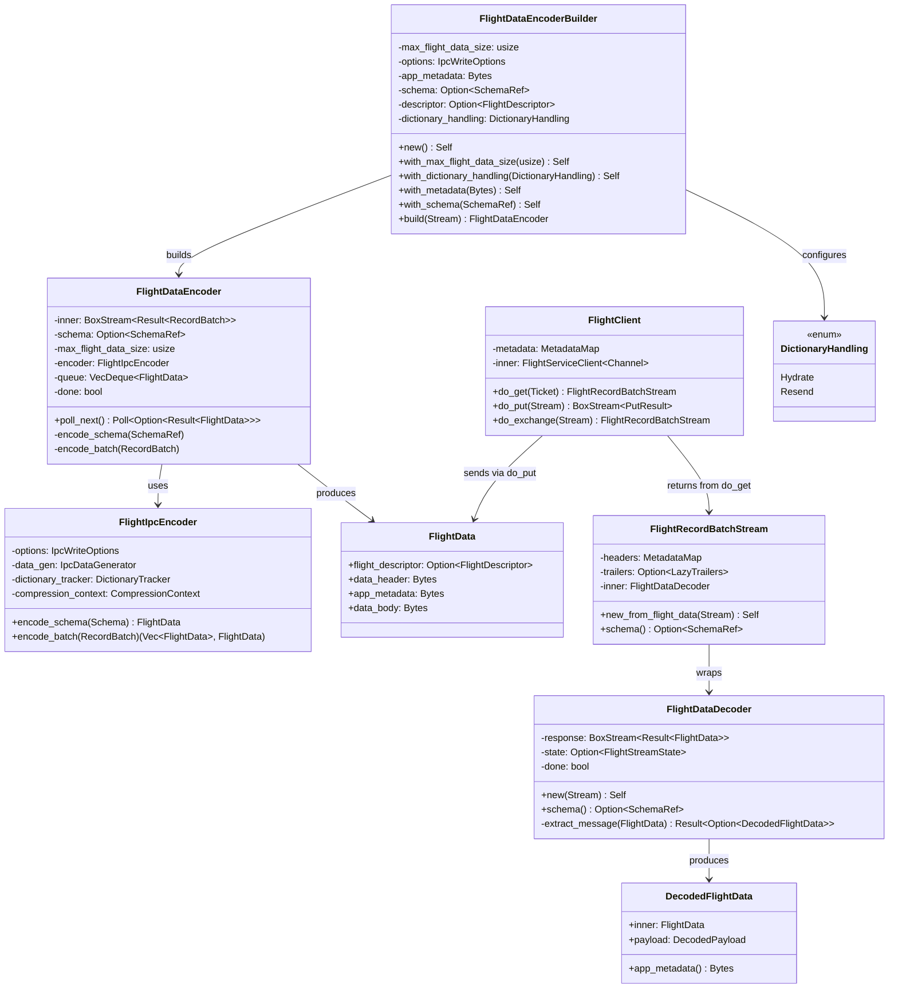
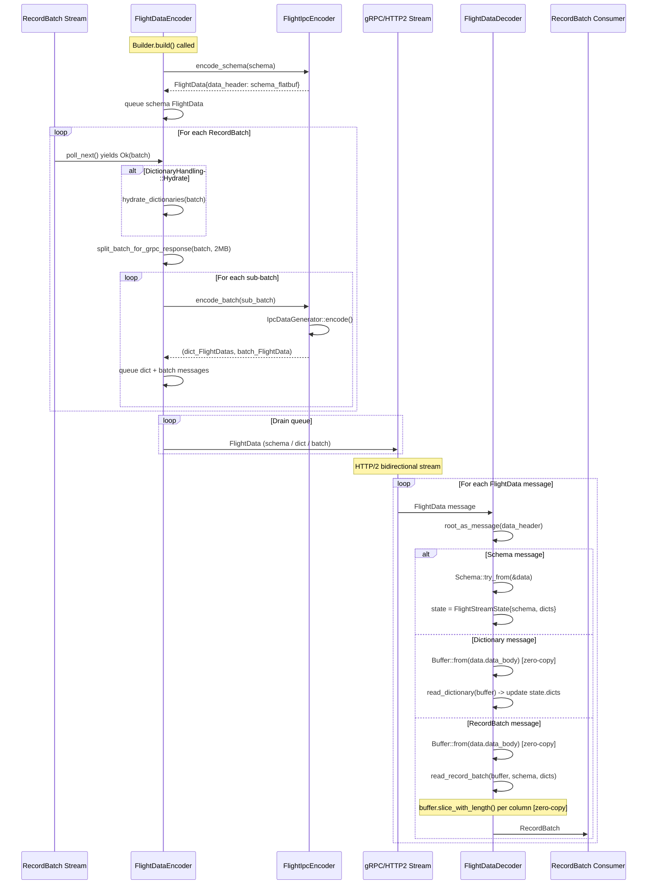

# Module Teardown: The Network Data Plane (Arrow Flight)

## Table of Contents

- [0. Research Focus](#0-research-focus)
- [1. High-Level Overview](#1-high-level-overview)
- [2. Structural Architecture](#2-structural-architecture)
  - [Primary Source Files](#primary-source-files)
  - [Key Data Structures](#key-data-structures)
  - [Class Diagram](#class-diagram)
- [3. Execution & Call Flow](#3-execution-call-flow)
  - [3.1 Encoding Pipeline (Send Side)](#31-encoding-pipeline-send-side)
  - [3.2 Decoding Pipeline (Receive Side)](#32-decoding-pipeline-receive-side)
  - [3.3 FlightRecordBatchStream filtering](#33-flightrecordbatchstream-filtering)
  - [Sequence Diagram](#sequence-diagram)
- [4. Concurrency & State Management](#4-concurrency-state-management)
  - [4.1 The gRPC Streaming Model](#41-the-grpc-streaming-model)
  - [4.2 Error Propagation with FallibleRequestStream](#42-error-propagation-with-falliblerequeststream)
  - [4.3 Server-Side Implementation](#43-server-side-implementation)
  - [4.4 State in the Decoder](#44-state-in-the-decoder)
- [5. Memory & Resource Profile](#5-memory-resource-profile)
  - [5.1 The Zero-Copy Chain](#51-the-zero-copy-chain)
  - [5.2 Memory Accounting](#52-memory-accounting)
  - [5.3 Message Size Budget](#53-message-size-budget)
- [6. Key Design Insights](#6-key-design-insights)
  - [Insight 1: Arrow IPC as the Universal Wire Format](#insight-1-arrow-ipc-as-the-universal-wire-format)
  - [Insight 2: Dictionary Handling is the Hardest Problem](#insight-2-dictionary-handling-is-the-hardest-problem)
  - [Insight 3: Zero-Copy is Structural, Not Just an Optimization](#insight-3-zero-copy-is-structural-not-just-an-optimization)
  - [Insight 4: The Queue-Based Encoding Pattern](#insight-4-the-queue-based-encoding-pattern)
  - [Insight 5: FlightDescriptor is a One-Shot Attachment](#insight-5-flightdescriptor-is-a-one-shot-attachment)
  - [Insight 6: Contrast with Trino's Data Exchange Model](#insight-6-contrast-with-trinos-data-exchange-model)
- [7. The Complete FlightClient API](#7-the-complete-flightclient-api)
- [8. IPC Write/Read Options](#8-ipc-writeread-options)
  - [IpcWriteOptions](#ipcwriteoptions)
  - [DictionaryTracker](#dictionarytracker)


## 0. Research Focus
* **Task ID:** 4.3
* **Focus:** Analyze how a `RecordBatch` stream is converted into a stream of `FlightData` protobuf messages via `FlightDataEncoder`. Trace the receiving side (`FlightDataDecoder`) to confirm how the byte payloads are wrapped into `Buffer`s without copying. Contrast the Arrow Flight gRPC streaming model with Trino's custom token-based HTTP chunk pulling.

## 1. High-Level Overview
* **Core Responsibility:** The `arrow-flight` crate implements the [Apache Arrow Flight protocol](https://arrow.apache.org/docs/format/Flight.html), a gRPC-based framework for high-performance data transport. Its central job is to move Arrow columnar data between processes with **minimal serialization overhead** by leveraging the Arrow IPC wire format. On the send side, `FlightDataEncoder` converts a `Stream<Item = Result<RecordBatch>>` into a stream of `FlightData` protobuf messages, each carrying Arrow IPC-encoded schema, dictionary, or record batch payloads. On the receive side, `FlightDataDecoder` reconstitutes `RecordBatch`es from `FlightData` messages, using `Buffer::from(Bytes)` to wrap incoming byte payloads into Arrow `Buffer`s **without a memory copy**. The Flight protocol defines six core RPC endpoints (`DoGet`, `DoPut`, `DoExchange`, `Handshake`, `ListFlights`, `DoAction`) over gRPC/HTTP2 bidirectional streams.

* **Key Triggers:**
  - A server-side `do_get` implementation produces a `Stream<FlightData>` to serve data to a remote client.
  - A client calls `FlightClient::do_get(ticket)` to receive a `FlightRecordBatchStream`.
  - A client calls `FlightClient::do_put(stream)` to upload data, or `do_exchange` for bidirectional streaming.

## 2. Structural Architecture

### Primary Source Files

| File | Role |
|------|------|
| `arrow-flight/src/encode.rs` | `FlightDataEncoderBuilder`, `FlightDataEncoder`, `FlightIpcEncoder`, `DictionaryHandling`, batch splitting |
| `arrow-flight/src/decode.rs` | `FlightDataDecoder`, `FlightRecordBatchStream`, `DecodedFlightData`, `DecodedPayload` |
| `arrow-flight/src/lib.rs` | `FlightData` protobuf struct, `SchemaAsIpc`, `From<EncodedData> for FlightData` conversions |
| `arrow-flight/src/client.rs` | `FlightClient` mid-level client wrapping `FlightServiceClient<Channel>` |
| `arrow-flight/src/utils.rs` | `flight_data_to_arrow_batch`, `batches_to_flight_data` utility functions |
| `arrow-flight/src/streams.rs` | `FallibleRequestStream`, `FallibleTonicResponseStream` error-forwarding stream adapters |
| `arrow-flight/src/arrow.flight.protocol.rs` | Prost-generated protobuf types (`FlightData`, `Ticket`, `FlightInfo`, etc.) |
| `arrow-ipc/src/writer.rs` | `IpcDataGenerator`, `DictionaryTracker`, `IpcWriteOptions`, `EncodedData` |
| `arrow-ipc/src/reader.rs` | `read_record_batch`, `read_dictionary`, `RecordBatchDecoder` |
| `arrow-buffer/src/buffer/immutable.rs` | `Buffer` struct with zero-copy `From<Bytes>` and `slice_with_length` |

### Key Data Structures

**FlightData (protobuf message):**
```rust
#[derive(Clone, PartialEq, Eq, Hash, ::prost::Message)]
pub struct FlightData {
    #[prost(message, optional, tag = "1")]
    pub flight_descriptor: Option<FlightDescriptor>,
    #[prost(bytes = "bytes", tag = "2")]
    pub data_header: ::prost::bytes::Bytes,    // Arrow IPC message header (flatbuffer)
    #[prost(bytes = "bytes", tag = "3")]
    pub app_metadata: ::prost::bytes::Bytes,   // Application-specific metadata
    #[prost(bytes = "bytes", tag = "1000")]
    pub data_body: ::prost::bytes::Bytes,      // Arrow IPC body (the actual column data)
}
```

The `data_header` contains a FlatBuffer-encoded IPC `Message` (schema, record batch header, or dictionary batch header). The `data_body` contains the raw Arrow buffer bytes (column data, offsets, null bitmaps). The tag "1000" for `data_body` is deliberately high to separate metadata from payload in the protobuf encoding for efficient handling.

**FlightDataEncoder (send side):**
```rust
pub struct FlightDataEncoder {
    inner: BoxStream<'static, Result<RecordBatch>>,
    schema: Option<SchemaRef>,
    max_flight_data_size: usize,         // Default 2MB
    encoder: FlightIpcEncoder,            // IPC serialization + dictionary tracking
    app_metadata: Option<Bytes>,          // Attached to first (schema) message
    queue: VecDeque<FlightData>,          // Buffered messages ready to send
    done: bool,
    descriptor: Option<FlightDescriptor>, // Attached to first message only
    dictionary_handling: DictionaryHandling,
}
```

**FlightDataDecoder (receive side):**
```rust
pub struct FlightDataDecoder {
    response: BoxStream<'static, Result<FlightData>>,
    state: Option<FlightStreamState>,  // Current schema + dictionary accumulator
    done: bool,
}

struct FlightStreamState {
    schema: SchemaRef,
    dictionaries_by_field: HashMap<i64, ArrayRef>,
}
```

**FlightIpcEncoder (internal serialization engine):**
```rust
struct FlightIpcEncoder {
    options: IpcWriteOptions,
    data_gen: IpcDataGenerator,
    dictionary_tracker: DictionaryTracker,
    compression_context: CompressionContext,
}
```

**EncodedData (IPC wire unit):**
```rust
pub struct EncodedData {
    pub ipc_message: Vec<u8>,   // FlatBuffer message header
    pub arrow_data: Vec<u8>,    // Raw column buffers
}
```

**Buffer (Arrow's immutable buffer):**
```rust
pub struct Buffer {
    data: Arc<Bytes>,  // Reference-counted backing store
    ptr: *const u8,    // Direct pointer into data
    length: usize,
}
```

### Class Diagram



## 3. Execution & Call Flow

### 3.1 Encoding Pipeline (Send Side)

The encoding pipeline transforms `RecordBatch`es into `FlightData` protobuf messages suitable for gRPC transmission.

**Step 1: Builder configuration and stream construction**

```rust
// Typical usage in a FlightService::do_get implementation
let flight_data_stream = FlightDataEncoderBuilder::new()
    .with_schema(schema)
    .with_max_flight_data_size(2_097_152)  // 2MB default
    .build(record_batch_stream);
// Returns: FlightDataEncoder implementing Stream<Item = Result<FlightData>>
```

The `build` method destructures the builder and creates a `FlightDataEncoder`. If a schema was provided, it is **immediately encoded and queued** before any batch data:

```rust
fn new(...) -> Self {
    let mut encoder = Self { /* ... */ };
    // If schema is known up front, enqueue it immediately
    if let Some(schema) = schema {
        encoder.encode_schema(&schema);
    }
    encoder
}
```

**Step 2: Schema encoding**

```rust
fn encode_schema(&mut self, schema: &SchemaRef) -> SchemaRef {
    let send_dictionaries = self.dictionary_handling == DictionaryHandling::Resend;
    let schema = Arc::new(prepare_schema_for_flight(
        schema,
        &mut self.encoder.dictionary_tracker,
        send_dictionaries,
    ));
    let mut schema_flight_data = self.encoder.encode_schema(&schema);

    // attach any metadata requested
    if let Some(app_metadata) = self.app_metadata.take() {
        schema_flight_data.app_metadata = app_metadata;
    }
    self.queue_message(schema_flight_data);
    self.schema = Some(schema.clone());
    schema
}
```

`prepare_schema_for_flight` recursively transforms the schema. When `DictionaryHandling::Hydrate` is used (the default), dictionary fields are replaced with their value types (e.g., `Dictionary<UInt32, Utf8>` becomes `Utf8`). When `DictionaryHandling::Resend`, dictionary fields are preserved and assigned sequential `dict_id`s via `dictionary_tracker.next_dict_id()`.

The schema becomes an IPC FlatBuffer message via `SchemaAsIpc`:

```rust
fn encode_schema(&self, schema: &Schema) -> FlightData {
    SchemaAsIpc::new(schema, &self.options).into()
}

// From impl in lib.rs:
impl From<SchemaAsIpc<'_>> for FlightData {
    fn from(schema_ipc: SchemaAsIpc) -> Self {
        let IpcMessage(vals) = flight_schema_as_flatbuffer(schema_ipc.0, schema_ipc.1);
        FlightData {
            data_header: vals,  // FlatBuffer-encoded schema
            ..Default::default()
        }
    }
}
```

The schema message has a populated `data_header` (the IPC schema FlatBuffer) but an **empty** `data_body`, since schemas have no buffer data.

**Step 3: Batch encoding**

```rust
fn encode_batch(&mut self, batch: RecordBatch) -> Result<()> {
    let schema = match &self.schema {
        Some(schema) => schema.clone(),
        None => self.encode_schema(batch.schema_ref()),
    };

    let batch = match self.dictionary_handling {
        DictionaryHandling::Resend => batch,
        DictionaryHandling::Hydrate => hydrate_dictionaries(&batch, schema)?,
    };

    for batch in split_batch_for_grpc_response(batch, self.max_flight_data_size) {
        let (flight_dictionaries, flight_batch) = self.encoder.encode_batch(&batch)?;
        self.queue_messages(flight_dictionaries);
        self.queue_message(flight_batch);
    }
    Ok(())
}
```

This method does three things:
1. **Schema inference on first batch**: If no schema was provided upfront, the first batch triggers schema encoding.
2. **Dictionary handling**: Either hydrates dictionaries to underlying types (expanding data but maximizing compatibility) or preserves them for separate dictionary message transmission.
3. **Batch splitting for gRPC size limits**: Splits large batches via zero-copy slicing.

**Step 4: Batch splitting for gRPC**

```rust
fn split_batch_for_grpc_response(
    batch: RecordBatch,
    max_flight_data_size: usize,
) -> Vec<RecordBatch> {
    let size = batch.columns().iter()
        .map(|col| col.get_buffer_memory_size())
        .sum::<usize>();

    let n_batches = (size / max_flight_data_size
        + usize::from(size % max_flight_data_size != 0)).max(1);
    let rows_per_batch = (batch.num_rows() / n_batches).max(1);
    let mut out = Vec::with_capacity(n_batches + 1);

    let mut offset = 0;
    while offset < batch.num_rows() {
        let length = (rows_per_batch).min(batch.num_rows() - offset);
        out.push(batch.slice(offset, length));  // Zero-copy slice!
        offset += length;
    }
    out
}
```

The default `max_flight_data_size` is `2,097,152` bytes (2MB). The split uses `RecordBatch::slice()`, which is a **zero-copy** operation -- it adjusts offsets and lengths on the underlying `ArrayData` without copying column buffers. This keeps memory stable even when a 100MB batch must be divided into 50 Flight messages.

**Step 5: IPC serialization**

```rust
// FlightIpcEncoder::encode_batch
fn encode_batch(&mut self, batch: &RecordBatch) -> Result<(Vec<FlightData>, FlightData)> {
    let (encoded_dictionaries, encoded_batch) = self.data_gen.encode(
        batch,
        &mut self.dictionary_tracker,
        &self.options,
        &mut self.compression_context,
    )?;

    let flight_dictionaries = encoded_dictionaries.into_iter().map(Into::into).collect();
    let flight_batch = encoded_batch.into();
    Ok((flight_dictionaries, flight_batch))
}
```

`IpcDataGenerator::encode` walks each column, extracts dictionary arrays (if `Resend` mode), serializes them as separate `EncodedData` (dictionary batch messages), then serializes the record batch itself. The `EncodedData` is converted to `FlightData` via:

```rust
impl From<EncodedData> for FlightData {
    fn from(data: EncodedData) -> Self {
        FlightData {
            data_header: data.ipc_message.into(),  // Vec<u8> -> Bytes (zero-copy via Bytes)
            data_body: data.arrow_data.into(),      // Vec<u8> -> Bytes
            ..Default::default()
        }
    }
}
```

**Step 6: Stream polling**

The `Stream` impl for `FlightDataEncoder` is a state machine loop:

```rust
impl Stream for FlightDataEncoder {
    type Item = Result<FlightData>;

    fn poll_next(mut self: Pin<&mut Self>, cx: &mut std::task::Context<'_>,
    ) -> Poll<Option<Self::Item>> {
        loop {
            if self.done && self.queue.is_empty() {
                return Poll::Ready(None);
            }
            // 1. Drain queued messages first
            if let Some(data) = self.queue.pop_front() {
                return Poll::Ready(Some(Ok(data)));
            }
            // 2. Poll inner stream for next batch
            let batch = ready!(self.inner.poll_next_unpin(cx));
            match batch {
                None => {
                    self.done = true;
                    assert!(self.queue.is_empty());
                    return Poll::Ready(None);
                }
                Some(Err(e)) => {
                    self.done = true;
                    self.queue.clear();
                    return Poll::Ready(Some(Err(e)));
                }
                Some(Ok(batch)) => {
                    if let Err(e) = self.encode_batch(batch) {
                        self.done = true;
                        self.queue.clear();
                        return Poll::Ready(Some(Err(e)));
                    }
                }
            }
        }
    }
}
```

The pattern is: drain the queue first (which may contain schema + N split batch messages from a single input batch), then poll the inner stream for the next batch. A single input `RecordBatch` may produce multiple output `FlightData` messages (dictionaries + split sub-batches), all buffered in the `VecDeque` queue.

### 3.2 Decoding Pipeline (Receive Side)

**Step 1: Stream wrapping**

```rust
// Client-side usage
let response_stream = client.do_get(request).await?.into_inner();
let record_batch_stream = FlightRecordBatchStream::new_from_flight_data(
    response_stream.map_err(|e| e.into())
);
```

`FlightRecordBatchStream` wraps `FlightDataDecoder` and filters out non-batch messages (schema, none payloads), exposing only `RecordBatch`es to the consumer.

**Step 2: Message extraction**

```rust
fn extract_message(&mut self, data: FlightData) -> Result<Option<DecodedFlightData>> {
    let message = arrow_ipc::root_as_message(&data.data_header[..])
        .map_err(|e| FlightError::DecodeError(format!("Error decoding root message: {e}")))?;

    match message.header_type() {
        MessageHeader::NONE => Ok(Some(DecodedFlightData::new_none(data))),

        MessageHeader::Schema => {
            let schema = Schema::try_from(&data)?;
            let schema = Arc::new(schema);
            self.state = Some(FlightStreamState {
                schema: Arc::clone(&schema),
                dictionaries_by_field: HashMap::new(),
            });
            Ok(Some(DecodedFlightData::new_schema(data, schema)))
        }

        MessageHeader::DictionaryBatch => {
            let state = self.state.as_mut().ok_or_else(|| {
                FlightError::protocol("Received DictionaryBatch prior to Schema")
            })?;
            let buffer = Buffer::from(data.data_body);  // <-- ZERO-COPY!
            let dictionary_batch = message.header_as_dictionary_batch().ok_or_else(|| {
                FlightError::protocol("Could not get dictionary batch ...")
            })?;
            arrow_ipc::reader::read_dictionary(
                &buffer,
                dictionary_batch,
                &state.schema,
                &mut state.dictionaries_by_field,
                &message.version(),
            )?;
            Ok(None) // Dictionary updates internal state; no user-visible message
        }

        MessageHeader::RecordBatch => {
            let state = self.state.as_ref().ok_or_else(|| {
                FlightError::protocol("Received RecordBatch prior to Schema")
            })?;
            let batch = flight_data_to_arrow_batch(
                &data,
                Arc::clone(&state.schema),
                &state.dictionaries_by_field,
            )?;
            Ok(Some(DecodedFlightData::new_record_batch(data, batch)))
        }
        // ...
    }
}
```

**Step 3: RecordBatch reconstruction (the zero-copy path)**

```rust
// utils.rs
pub fn flight_data_to_arrow_batch(
    data: &FlightData,
    schema: SchemaRef,
    dictionaries_by_id: &HashMap<i64, ArrayRef>,
) -> Result<RecordBatch, ArrowError> {
    let message = arrow_ipc::root_as_message(&data.data_header[..])?;
    message.header_as_record_batch()
        .map(|batch| {
            reader::read_record_batch(
                &Buffer::from(data.data_body.as_ref()),  // Bytes -> Buffer
                batch,
                schema,
                dictionaries_by_id,
                None,
                &message.version(),
            )
        })?
}
```

Inside `read_record_batch`, the IPC reader slices into the `Buffer` to extract individual column buffers:

```rust
fn read_buffer(
    buf: &crate::Buffer,
    a_data: &Buffer,
    compression_codec: Option<CompressionCodec>,
    decompression_context: &mut DecompressionContext,
) -> Result<Buffer, ArrowError> {
    let start_offset = buf.offset() as usize;
    let buf_data = a_data.slice_with_length(start_offset, buf.length() as usize);
    // ...
    Ok(buf_data)
}
```

And `slice_with_length` is zero-copy:

```rust
pub fn slice_with_length(&self, offset: usize, length: usize) -> Self {
    let ptr = unsafe { self.ptr.add(offset) };
    Self {
        data: self.data.clone(),  // Arc::clone -- just bumps refcount
        ptr,
        length,
    }
}
```

### 3.3 FlightRecordBatchStream filtering

```rust
impl Stream for FlightRecordBatchStream {
    type Item = Result<RecordBatch>;

    fn poll_next(mut self: Pin<&mut Self>, cx: &mut std::task::Context<'_>,
    ) -> Poll<Option<Result<RecordBatch>>> {
        loop {
            let had_schema = self.schema().is_some();
            let res = ready!(self.inner.poll_next_unpin(cx));
            match res {
                None => return Poll::Ready(None),
                Some(Err(e)) => return Poll::Ready(Some(Err(e))),
                Some(Ok(data)) => match data.payload {
                    DecodedPayload::Schema(_) if had_schema => {
                        return Poll::Ready(Some(Err(FlightError::protocol(
                            "Unexpectedly saw multiple Schema messages",
                        ))));
                    }
                    DecodedPayload::Schema(_) => { /* skip, poll again */ }
                    DecodedPayload::RecordBatch(batch) => {
                        return Poll::Ready(Some(Ok(batch)));
                    }
                    DecodedPayload::None => { /* skip, poll again */ }
                },
            }
        }
    }
}
```

This loop silently consumes schema messages (the first one), passes through `RecordBatch` payloads, and errors on duplicate schemas. It also skips `None` payloads (metadata-only messages).

### Sequence Diagram



## 4. Concurrency & State Management

### 4.1 The gRPC Streaming Model

Arrow Flight uses gRPC/HTTP2 bidirectional streaming. The key RPC methods and their streaming patterns:

| RPC | Request | Response | Pattern |
|-----|---------|----------|---------|
| `DoGet` | Unary `Ticket` | Server-streaming `FlightData` | Client sends ticket, server streams batches |
| `DoPut` | Client-streaming `FlightData` | Server-streaming `PutResult` | Client streams batches, server acks |
| `DoExchange` | Client-streaming `FlightData` | Server-streaming `FlightData` | Bidirectional batch exchange |
| `Handshake` | Client-streaming `HandshakeRequest` | Server-streaming `HandshakeResponse` | Auth negotiation |

```protobuf
service FlightService {
    rpc DoGet(Ticket) returns (stream FlightData) {}
    rpc DoPut(stream FlightData) returns (stream PutResult) {}
    rpc DoExchange(stream FlightData) returns (stream FlightData) {}
}
```

gRPC/HTTP2 provides **built-in flow control**: HTTP/2 window-based flow control regulates the rate of data transfer. The sender cannot overwhelm the receiver because the HTTP/2 transport layer itself throttles when the receiver's window is full. This is fundamentally different from Trino's application-level flow control (see Section 8).

### 4.2 Error Propagation with FallibleRequestStream

For `DoPut` and `DoExchange`, the client sends a stream. If the client stream errors, the error must be forwarded to the response stream. This is done via a oneshot channel:

```rust
pub async fn do_put<S: Stream<Item = Result<FlightData>> + Send + 'static>(
    &mut self, request: S,
) -> Result<BoxStream<'static, Result<PutResult>>> {
    let (sender, receiver) = futures::channel::oneshot::channel();

    let request = Box::pin(request);
    // FallibleRequestStream intercepts errors and sends them to the oneshot
    let request_stream = FallibleRequestStream::new(sender, request);

    let request = self.make_request(request_stream);
    let response_stream = self.inner.do_put(request).await?.into_inner();

    let response_stream = Box::pin(response_stream);
    // FallibleTonicResponseStream checks oneshot for client-side errors
    let error_stream = FallibleTonicResponseStream::new(receiver, response_stream);
    Ok(error_stream.boxed())
}
```

`FallibleRequestStream` strips `Result` from the stream -- it forwards `Ok(T)` values to gRPC, and on `Err(E)`, sends the error through the oneshot channel and terminates the stream. `FallibleTonicResponseStream` checks the oneshot on every poll and prioritizes client errors over server responses.

### 4.3 Server-Side Implementation

A server implements the `FlightService` trait:

```rust
#[async_trait]
pub trait FlightService: Send + Sync + 'static {
    type DoGetStream: Stream<Item = Result<FlightData, Status>> + Send + 'static;

    async fn do_get(
        &self,
        request: Request<Ticket>,
    ) -> Result<Response<Self::DoGetStream>, Status>;

    type DoPutStream: Stream<Item = Result<PutResult, Status>> + Send + 'static;

    async fn do_put(
        &self,
        request: Request<Streaming<FlightData>>,
    ) -> Result<Response<Self::DoPutStream>, Status>;

    type DoExchangeStream: Stream<Item = Result<FlightData, Status>> + Send + 'static;

    async fn do_exchange(
        &self,
        request: Request<Streaming<FlightData>>,
    ) -> Result<Response<Self::DoExchangeStream>, Status>;
    // ... other methods
}
```

The DataFusion example demonstrates a concrete implementation:

```rust
async fn do_get(
    &self, request: Request<Ticket>,
) -> Result<Response<Self::DoGetStream>, Status> {
    let ticket = request.into_inner();
    let sql = std::str::from_utf8(&ticket.ticket)?;

    let ctx = SessionContext::new();
    // ... register tables, execute query ...
    let results = df.collect().await?;

    // Encode schema + batches into FlightData
    let options = IpcWriteOptions::default();
    let schema_flight_data = SchemaAsIpc::new(&schema, &options);
    let mut flights = vec![FlightData::from(schema_flight_data)];

    let encoder = IpcDataGenerator::default();
    let mut tracker = DictionaryTracker::new(false);
    for batch in &results {
        let (flight_dictionaries, flight_batch) = encoder.encode(
            batch, &mut tracker, &options, &mut compression_context)?;
        flights.extend(flight_dictionaries.into_iter().map(Into::into));
        flights.push(flight_batch.into());
    }

    let output = futures::stream::iter(flights.into_iter().map(Ok));
    Ok(Response::new(Box::pin(output) as Self::DoGetStream))
}
```

### 4.4 State in the Decoder

`FlightDataDecoder` is a stateful stream. Its `FlightStreamState` accumulates:
- **Schema**: Set on the first `Schema` message. Re-set if a second schema arrives (the decoder supports multi-schema streams at the low level, though `FlightRecordBatchStream` rejects them).
- **Dictionaries**: A `HashMap<i64, ArrayRef>` mapping dictionary IDs to their value arrays. Updated by each `DictionaryBatch` message. A new schema clears all accumulated dictionaries.

This state must be **mutable across polls**, which is why `FlightDataDecoder` owns it directly (no shared references needed -- single consumer pattern).

## 5. Memory & Resource Profile

### 5.1 The Zero-Copy Chain

The critical performance claim of Arrow Flight is "zero-copy" data transfer. Here is the exact chain from network bytes to Arrow arrays:

**Network -> Protobuf deserialization:**
- gRPC/tonic receives HTTP/2 frames and assembles them into a protobuf message.
- Prost deserializes `FlightData`. Because `data_body` is declared as `bytes = "bytes"` in the proto, prost uses `bytes::Bytes` (reference-counted, not `Vec<u8>`). This means the deserialized `data_body` **shares the same allocation** as the HTTP/2 receive buffer (via `Bytes` refcounting).

**Protobuf -> Arrow Buffer:**
```rust
let buffer = Buffer::from(data.data_body);
```
`Buffer::from(bytes::Bytes)` wraps the `Bytes` in an `Arc` without copying:
```rust
impl From<bytes::Bytes> for Buffer {
    fn from(bytes: bytes::Bytes) -> Self {
        let bytes: Bytes = bytes.into();  // bytes::Bytes -> internal Bytes
        Self::from(bytes)                 // wraps in Arc, sets ptr + length
    }
}
```

**Arrow Buffer -> Column Buffers:**
```rust
// Inside read_record_batch -> read_buffer
let buf_data = a_data.slice_with_length(start_offset, buf.length() as usize);
```
`slice_with_length` is zero-copy: it increments the `Arc` refcount and adjusts the pointer/length. Each column's null bitmap, data buffer, and offsets buffer are all slices into the same underlying allocation.

**Result:** A single `FlightData` message's `data_body` bytes may be shared by **all columns** in the resulting `RecordBatch`. No byte is copied from network reception through to Arrow array access.

**Caveat -- when zero-copy breaks:**
- **Compression**: If `IpcWriteOptions::batch_compression_type` is set (LZ4 or ZSTD), the `read_buffer` function decompresses into a new allocation. The zero-copy path only applies to uncompressed data.
- **Dictionary hydration**: When `DictionaryHandling::Hydrate` is used, `arrow_cast::cast` allocates new arrays. The dictionary values are expanded into full arrays, consuming more memory but eliminating dictionary lookup overhead.

### 5.2 Memory Accounting

| Component | Memory Behavior |
|-----------|----------------|
| `FlightDataEncoder::queue` | `VecDeque<FlightData>` holding split messages. Bounded by: one input batch generates at most `ceil(batch_size / 2MB)` messages, so queue size is proportional to the largest batch. |
| `FlightIpcEncoder::dictionary_tracker` | `HashMap<i64, ArrayData>` caching the last-seen dictionary for each `dict_id`. Grows with the number of distinct dictionary columns. |
| `FlightDataDecoder::state.dictionaries_by_field` | Same pattern on the receive side: accumulates dictionary arrays until schema reset. |
| `Buffer` (received data) | Reference-counted via `Arc<Bytes>`. The original network buffer is freed only when all column slices are dropped. A long-lived reference to any column pins the entire `FlightData` body. |

### 5.3 Message Size Budget

The default 2MB target (`GRPC_TARGET_MAX_FLIGHT_SIZE_BYTES = 2_097_152`) is chosen conservatively:
- gRPC's default max message size is **4MB**.
- Arrow IPC adds encoding overhead (FlatBuffer headers, padding for 64-byte alignment).
- The 2MB target leaves ~50% headroom for overhead and gRPC framing.

The split is **approximate**: it calculates `get_buffer_memory_size()` for each column, sums them, and divides by `max_flight_data_size`. This does not account for IPC overhead, sliced arrays that have larger underlying buffers, or null bitmap compression. The resulting messages may be somewhat larger or smaller than the target.

## 6. Key Design Insights

### Insight 1: Arrow IPC as the Universal Wire Format

Arrow Flight does not define its own serialization format. It delegates entirely to Arrow IPC (a FlatBuffer-based format standardized across all Arrow implementations). The `FlightData` protobuf is a thin envelope:

- `data_header`: The FlatBuffer IPC message (schema descriptor, record batch metadata with field node counts and buffer offsets, or dictionary batch metadata).
- `data_body`: The raw column buffers concatenated in IPC layout order.

This means any Arrow implementation (C++, Java, Python, Go) that speaks Arrow IPC can interoperate via Flight with zero format translation. The `arrow-flight` Rust crate is literally a gRPC transport wrapper around `arrow-ipc` serialization.

**Code evidence:** The `FlightIpcEncoder::encode_batch` method delegates entirely to `IpcDataGenerator::encode`, which is the same code path used for writing Arrow IPC files and streams. The only Flight-specific logic is the `From<EncodedData> for FlightData` conversion, which splits `ipc_message` -> `data_header` and `arrow_data` -> `data_body`.

### Insight 2: Dictionary Handling is the Hardest Problem

The `DictionaryHandling` enum and the extensive `prepare_field_for_flight` function reveal that dictionary arrays are the most complex aspect of Flight encoding. Two strategies exist:

1. **Hydrate (default)**: Replace `DictionaryArray<K, V>` with a plain `V` array via `arrow_cast::cast`. This:
   - Sends more bytes on the wire (repeated values instead of compact dictionary + keys).
   - Requires no dictionary state management.
   - Is compatible with all Flight clients (some don't implement `DictionaryBatch`).
   - Changes the schema (the field type changes from `Dictionary<K, V>` to `V`).

2. **Resend**: Send `DictionaryBatch` messages before each `RecordBatch` that uses dictionaries. This:
   - Sends compact data (keys + dictionary).
   - Requires the `DictionaryTracker` to detect when dictionaries change between batches.
   - Uses pointer comparison (`ArrayData::ptr_eq`) to detect unchanged dictionaries and skip redundant sends.
   - Does NOT support delta dictionaries (the full dictionary is re-sent each time).

**Code evidence:** The `prepare_field_for_flight` function is 100+ lines of recursive pattern matching that handles dictionaries nested inside `List`, `Struct`, `Union`, `Map`, `FixedSizeList`, `RunEndEncoded`, `ListView`, and `LargeListView` types. Each container type must be recursively traversed to find and transform nested dictionary fields. This complexity is necessary because dictionary IDs must be assigned in depth-first order matching the IPC writer's `encode_dictionaries` traversal.

### Insight 3: Zero-Copy is Structural, Not Just an Optimization

The zero-copy property is not an afterthought -- it is baked into the type system:

1. **Protobuf fields use `bytes::Bytes`**: The `.proto` file declares `data_body` as `bytes`, and prost is configured to use `bytes::Bytes` (reference-counted) rather than `Vec<u8>` (owned). This is the `bytes = "bytes"` annotation in the generated code.

2. **Arrow `Buffer` wraps `Arc<Bytes>`**: The Arrow buffer type stores data as `Arc<Bytes>` with a raw pointer and length. `From<bytes::Bytes>` wraps without copying.

3. **Slicing is pointer arithmetic**: `slice_with_length` clones the `Arc`, adjusts the pointer, and sets a new length. No data moves.

4. **The entire decode path uses slicing**: `read_record_batch` -> `RecordBatchDecoder` -> `read_buffer` -> `slice_with_length`. Every column buffer is a slice of the original `FlightData::data_body`.

**Consequence:** A single `FlightData` message's `data_body` allocation may be referenced by dozens of column buffers, null bitmaps, and offset arrays. The allocation is freed only when **all** derived `Buffer` instances are dropped. This is ideal for streaming (process and drop), but can cause unexpected memory retention if any column reference is held long-term.

### Insight 4: The Queue-Based Encoding Pattern

`FlightDataEncoder` uses a `VecDeque<FlightData>` as an internal buffer. A single `poll_next` call from the consumer may:
1. Return a previously-queued message (from a prior batch that generated multiple messages).
2. Poll the inner stream for a new batch, encode it into multiple messages, queue them all, and return the first.

This design decouples the 1:1 assumption between input batches and output messages. A single 10MB `RecordBatch` with `DictionaryHandling::Resend` might produce: 1 dictionary message + 5 record batch messages (split for 2MB target) = 6 `FlightData` messages in the queue. The consumer sees a steady stream of appropriately-sized messages regardless of input batch sizes.

**Code evidence:**
```rust
fn poll_next(...) -> Poll<Option<Self::Item>> {
    loop {
        if self.done && self.queue.is_empty() { return Poll::Ready(None); }
        if let Some(data) = self.queue.pop_front() {
            return Poll::Ready(Some(Ok(data)));  // Drain queue first
        }
        // Only then poll inner for new batch...
    }
}
```

### Insight 5: FlightDescriptor is a One-Shot Attachment

The `FlightDescriptor` (which describes what data is being sent -- a command, a path, etc.) is attached only to the **first** `FlightData` message:

```rust
fn queue_message(&mut self, mut data: FlightData) {
    if let Some(descriptor) = self.descriptor.take() {
        data.flight_descriptor = Some(descriptor);
    }
    self.queue.push_back(data);
}
```

`self.descriptor.take()` consumes the descriptor on first use -- subsequent messages get `None`. This is consistent with the Flight protocol specification: the descriptor identifies the stream, not individual messages within the stream. On the `DoGet` path, the descriptor is actually in the `Ticket`, not the `FlightData` at all. It is only relevant for `DoPut`/`DoExchange` where the client must tell the server what dataset the incoming data represents.

### Insight 6: Contrast with Trino's Data Exchange Model

Arrow Flight and Trino's exchange protocol represent fundamentally different design philosophies. Here is a detailed comparison:

| Aspect | Arrow Flight | Trino Data Exchange |
|--------|-------------|---------------------|
| **Transport** | gRPC/HTTP2 bidirectional streaming | Custom HTTP/1.1 REST endpoints |
| **Wire Format** | Arrow IPC (columnar, FlatBuffer headers) | Custom binary: 12-byte page header + LZ4/ZSTD compressed blocks |
| **Serialization** | Columnar (Arrow IPC: null bitmaps + data buffers per column) | Row-oriented pages: `PagesSerde` serializes `Block`s (which are columnar internally, but the page envelope is row-scoped) |
| **Flow Control** | HTTP/2 window-based (transport layer) | Client-side capacity gating: `DirectExchangeClient` tracks `remainingCapacity` + concurrency multiplier |
| **State Management** | Stateless per-message; schema in first message | Token-based: each request carries a sequence token, server responds with pages starting at that token |
| **Data Retrieval** | Server pushes via gRPC stream (after client opens stream) | Client pulls via `GET /v1/task/{taskId}/results/{bufferId}/{token}` |
| **Idempotency** | Not inherently idempotent (stream position is implicit) | Idempotent: replaying a request with the same token returns the same pages |
| **Error Recovery** | gRPC stream fails; client must restart | Exponential backoff (0ms, 50ms, 100ms, 200ms, 500ms) with bounded error duration |
| **Acknowledgment** | Implicit (HTTP/2 flow control ACK) | Explicit: async `DELETE /v1/task/{taskId}/results/{bufferId}/{token}` to free upstream memory |
| **Schema Handling** | Schema sent as first `FlightData` message | Schema negotiated during planning; pages are self-describing via Block types |
| **Compression** | Optional per-message (Arrow IPC compression) | Per-block LZ4/ZSTD + optional AES-CBC encryption |
| **Zero-Copy** | Yes: `Bytes` -> `Buffer` -> `slice_with_length` chain | No: deserialization via `PagesSerde.deserialize()` creates new `Block` allocations from `Slice` bytes |
| **Dictionary Support** | First-class: separate `DictionaryBatch` messages | No wire-level dictionary support; dictionaries are engine-internal |
| **Max Message Size** | Configurable, default 2MB (gRPC limit ~4MB) | Configurable via `X-Trino-Max-Size` header per request |
| **Multi-Consumer** | One stream per `DoGet` call | Partitioned: `PartitionedOutputBuffer` with dedicated `ClientBuffer` per downstream partition |

**Key architectural difference:** Trino's exchange is designed for a **fixed-topology shuffle** within a single query: the coordinator knows exactly how many upstream/downstream tasks exist, assigns partition IDs, and the pull model with token-based sequencing provides exactly-once delivery and memory-efficient backpressure. Arrow Flight is designed as a **general-purpose data transfer protocol** that can connect arbitrary processes -- it doesn't assume a coordinator, partition topology, or query context.

**Flow control in depth:**
- In Trino, backpressure is entirely application-managed. `DirectExchangeClient` checks `buffer.getRemainingCapacity()` and only dispatches HTTP requests when capacity exists (multiplied by `concurrentRequestMultiplier = 3` to keep the pipeline full). On the producer side, `OutputBufferMemoryManager` blocks drivers via `SettableFuture` when the buffer is full.
- In Arrow Flight, HTTP/2 provides transport-layer flow control via `WINDOW_UPDATE` frames. If the receiver is slow to consume, the HTTP/2 send window fills, and `poll_next` on the encoder's output stream will return `Poll::Pending` because the tonic gRPC layer blocks when the send buffer is full. No application code is needed.

**Performance tradeoff:** Arrow Flight's zero-copy chain avoids serialization/deserialization costs entirely (for uncompressed data). Trino's custom format adds serialization overhead but gains: (1) per-block compression reducing network bandwidth, (2) encryption, (3) fault-tolerant token-based retry, and (4) explicit memory management with eager acknowledgment freeing upstream buffers immediately.

## 7. The Complete FlightClient API

The `FlightClient` wraps tonic's `FlightServiceClient<Channel>` with ergonomic methods:

```rust
pub struct FlightClient {
    metadata: MetadataMap,  // Custom headers for auth, etc.
    inner: FlightServiceClient<Channel>,
}
```

**Key methods:**

| Method | Request | Response | Notes |
|--------|---------|----------|-------|
| `handshake(Bytes)` | `HandshakeRequest` stream | `Bytes` | Auth negotiation; expects exactly one response |
| `do_get(Ticket)` | Unary `Ticket` | `FlightRecordBatchStream` | Primary data retrieval |
| `do_put(Stream<FlightData>)` | Client stream | `BoxStream<PutResult>` | Data upload with error forwarding |
| `do_exchange(Stream<FlightData>)` | Client stream | `FlightRecordBatchStream` | Bidirectional exchange |
| `get_flight_info(FlightDescriptor)` | Unary descriptor | `FlightInfo` | Dataset discovery |
| `poll_flight_info(FlightDescriptor)` | Unary descriptor | `PollInfo` | Long-running query polling |
| `get_schema(FlightDescriptor)` | Unary descriptor | `Schema` | Schema-only retrieval |
| `list_flights(Bytes)` | `Criteria` | `BoxStream<FlightInfo>` | Dataset listing |
| `list_actions()` | `Empty` | `BoxStream<ActionType>` | Available action listing |
| `do_action(Action)` | Unary `Action` | `BoxStream<Bytes>` | Custom action execution |
| `cancel_flight_info(CancelFlightInfoRequest)` | Via `DoAction` | `CancelFlightInfoResult` | Query cancellation (convention) |
| `renew_flight_endpoint(RenewFlightEndpointRequest)` | Via `DoAction` | `FlightEndpoint` | Endpoint renewal (convention) |

Note that `cancel_flight_info` and `renew_flight_endpoint` are implemented as special `DoAction` calls with conventional action names ("CancelFlightInfo", "RenewFlightEndpoint") rather than dedicated RPC methods.

## 8. IPC Write/Read Options

### IpcWriteOptions

```rust
pub struct IpcWriteOptions {
    alignment: u8,                        // Buffer padding: 8, 16, 32, or 64 (default 64)
    write_legacy_ipc_format: bool,        // V4 format for pre-0.15 compatibility
    metadata_version: MetadataVersion,    // V4 or V5 (default V5)
    batch_compression_type: Option<CompressionType>,  // None, LZ4, or ZSTD
    dictionary_handling: DictionaryHandling,           // Delta or Resend
}
```

- **Alignment (default 64)**: Column buffers are padded to this boundary. 64-byte alignment enables AVX-512 SIMD operations on the data without copying to an aligned buffer. This padding is part of the IPC format itself, not a Flight-specific concern.
- **Compression**: When set, the IPC writer compresses each buffer individually. The reader detects compression from the IPC message metadata and decompresses, **breaking the zero-copy chain** since decompression always produces a new allocation.
- **Metadata version V5** is the standard modern format. V4 (legacy) omits some features but is needed for interoperability with very old Arrow implementations.

### DictionaryTracker

The tracker uses `ArrayData::ptr_eq` for pointer-level comparison of dictionary values:

```rust
pub fn insert_column(&mut self, dict_id: i64, column: &ArrayRef,
    dict_handling: DictionaryHandling,
) -> Result<DictionaryUpdate, ArrowError> {
    let new_data = column.to_data();
    let new_values = &new_data.child_data()[0];

    let Some(old) = self.written.get(&dict_id) else {
        self.written.insert(dict_id, new_data);
        return Ok(DictionaryUpdate::New);  // First time seeing this dict
    };

    let old_values = &old.child_data()[0];
    if ArrayData::ptr_eq(old_values, new_values) {
        return Ok(DictionaryUpdate::None);  // Same pointer -> skip
    }
    // ... deep comparison for equal/delta/replaced
}
```

This means if consecutive batches share the same dictionary allocation (common when batches come from the same Parquet row group or the same string interning pool), the tracker detects pointer equality and **skips retransmission** entirely. Only when dictionaries actually change does a new `DictionaryBatch` message get generated.
