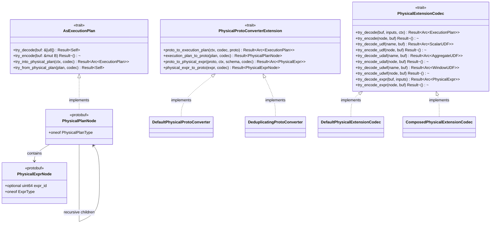
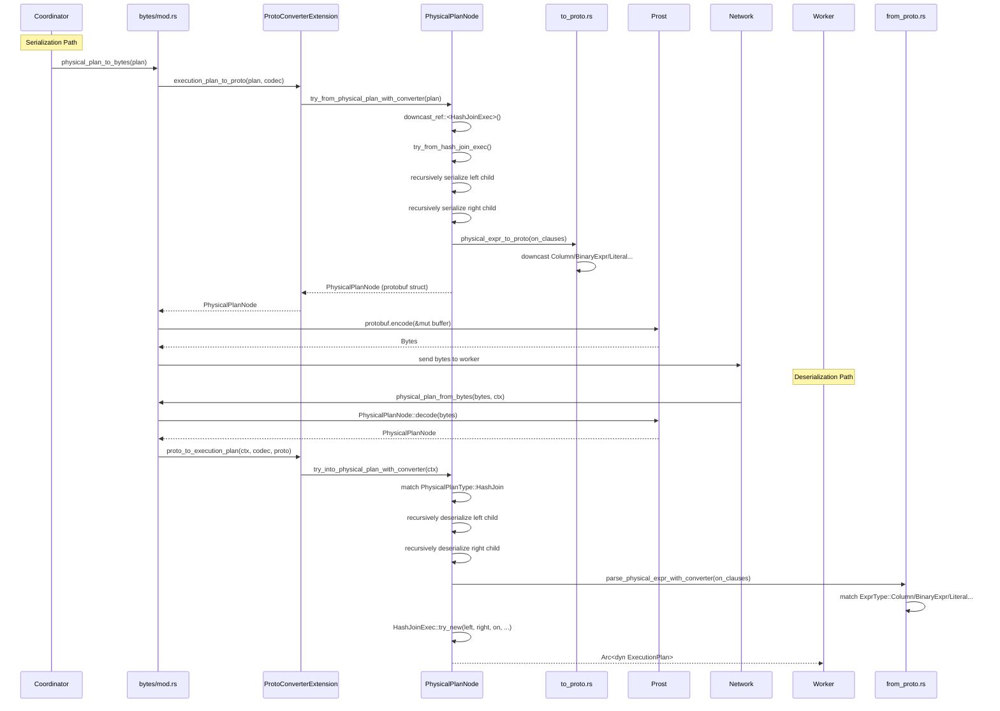

# Module Teardown: The Distributed Control Plane (Plan Serialization)

## Table of Contents

- [0. Research Focus](#0-research-focus)
- [1. High-Level Overview](#1-high-level-overview)
- [2. Structural Architecture](#2-structural-architecture)
  - [Primary Source Files](#primary-source-files)
  - [Key Data Structures](#key-data-structures)
  - [Class Diagram](#class-diagram)
- [3. Execution & Call Flow](#3-execution-call-flow)
  - [3.1 Serialization Path: `Arc<dyn ExecutionPlan>` -> bytes](#31-serialization-path-arcdyn-executionplan-bytes)
  - [3.2 Deserialization Path: bytes -> `Arc<dyn ExecutionPlan>`](#32-deserialization-path-bytes-arcdyn-executionplan)
  - [Sequence Diagram](#sequence-diagram)
- [4. Operator Serialization Deep Dives](#4-operator-serialization-deep-dives)
  - [4.1 HashJoinExecNode](#41-hashjoinexecnode)
  - [4.2 FilterExecNode](#42-filterexecnode)
  - [4.3 ParquetScanExecNode / FileScanExecConf](#43-parquetscanexecnode-filescanexecconf)
  - [4.4 Statistics and Schema Serialization](#44-statistics-and-schema-serialization)
- [5. Expression Serialization](#5-expression-serialization)
  - [5.1 PhysicalExprNode protobuf schema](#51-physicalexprnode-protobuf-schema)
  - [5.2 Serialization via downcast chain (`to_proto.rs`)](#52-serialization-via-downcast-chain-to_protors)
  - [5.3 Deserialization via match (`from_proto.rs`)](#53-deserialization-via-match-from_protors)
- [6. The `PhysicalExtensionCodec` Trait](#6-the-physicalextensioncodec-trait)
- [7. Expression Deduplication](#7-expression-deduplication)
- [8. Round-Trip Guarantees](#8-round-trip-guarantees)
- [9. Concurrency & State Management](#9-concurrency-state-management)
- [10. Memory & Resource Profile](#10-memory-resource-profile)
- [11. Key Design Insights](#11-key-design-insights)
  - [Insight 1: Downcast-chain pattern instead of visitor/registration](#insight-1-downcast-chain-pattern-instead-of-visitorregistration)
  - [Insight 2: Three-layer abstraction for extensibility](#insight-2-three-layer-abstraction-for-extensibility)
  - [Insight 3: The plan tree, not just plan nodes, is the unit of serialization](#insight-3-the-plan-tree-not-just-plan-nodes-is-the-unit-of-serialization)
  - [Insight 4: Runtime state is intentionally excluded](#insight-4-runtime-state-is-intentionally-excluded)
  - [Insight 5: Contrast with Trino's REST/JSON approach](#insight-5-contrast-with-trinos-restjson-approach)
  - [Insight 6: Expression deduplication via Arc pointer hashing](#insight-6-expression-deduplication-via-arc-pointer-hashing)


## 0. Research Focus
* **Task ID:** 4.4
* **Focus:** How does DataFusion serialize a complex Physical Plan (e.g., a HashJoin tree) into a byte array so it can be sent to remote workers? Trace the `AsExecutionPlan` trait. Contrast this Protobuf-based physical plan transmission with Trino's REST/JSON `TaskUpdateRequest`.

## 1. High-Level Overview
* **Core Responsibility:** The `datafusion-proto` crate converts the entire in-memory `ExecutionPlan` DAG (a tree of `Arc<dyn ExecutionPlan>` nodes) into a byte array via Protocol Buffers, and reconstructs it on the receiving side. This is the control-plane serialization layer that enables distributed execution -- a coordinator serializes a physical plan fragment, ships the bytes over the network, and a remote worker deserializes them into a live `ExecutionPlan` tree ready for execution.
* **Key Triggers:** Any distributed scheduler that needs to ship plan fragments to workers. The entry points are `physical_plan_to_bytes()` (serialize) and `physical_plan_from_bytes()` (deserialize). DataFusion itself is single-node, so this crate is a building block consumed by distributed engines like Ballista, DataFusion Ray, etc.

## 2. Structural Architecture

### Primary Source Files

| File | Role |
|------|------|
| `proto/proto/datafusion.proto` | Protobuf schema definitions for all plan nodes, expressions, and supporting types |
| `proto-common/proto/datafusion_common.proto` | Shared protobuf definitions: `Schema`, `Field`, `ArrowType`, `ScalarValue`, `Statistics`, `JoinType` |
| `proto/src/physical_plan/mod.rs` | Core orchestration: `AsExecutionPlan` trait impl, `PhysicalExtensionCodec` trait, the downcast-chain for serialization/deserialization of every operator |
| `proto/src/physical_plan/to_proto.rs` | Expression serialization: `serialize_physical_expr_with_converter()`, `serialize_file_scan_config()`, `serialize_physical_sort_exprs()` |
| `proto/src/physical_plan/from_proto.rs` | Expression deserialization: `parse_physical_expr_with_converter()`, `parse_protobuf_file_scan_config()`, `PartitionedFile` reconstruction |
| `proto/src/bytes/mod.rs` | Convenience entry points: `physical_plan_to_bytes()`, `physical_plan_from_bytes()`, prost `encode()`/`decode()` wrappers |

### Key Data Structures

| Structure | Purpose |
|-----------|---------|
| `protobuf::PhysicalPlanNode` | The root protobuf message. Contains a `oneof PhysicalPlanType` with ~38 operator variants (HashJoin, Filter, ParquetScan, etc.) |
| `protobuf::PhysicalExprNode` | The root protobuf message for expressions. Contains a `oneof ExprType` with ~21 expression variants (Column, Literal, BinaryExpr, Cast, etc.) |
| `protobuf::FileScanExecConf` | Shared config for all file-based scans: file groups, schema, projection, statistics, output ordering |
| `protobuf::JoinFilter` | Filter expression for join conditions with column indices and side info |
| `AsExecutionPlan` trait | Defines `try_encode()`/`try_decode()` for raw bytes, `try_into_physical_plan()`/`try_from_physical_plan()` for plan<->proto conversion |
| `PhysicalExtensionCodec` trait | Extension point for custom operators and UDFs that the default serializer doesn't know about |
| `PhysicalProtoConverterExtension` trait | Controls the conversion process itself, enabling optimizations like expression deduplication |
| `DeduplicatingProtoConverter` | Specialized converter that adds `expr_id` during serialization and caches expressions during deserialization for Arc sharing |

### Class Diagram



## 3. Execution & Call Flow

### 3.1 Serialization Path: `Arc<dyn ExecutionPlan>` -> bytes

The serialization starts at `physical_plan_to_bytes()` in `bytes/mod.rs`:

```rust
// bytes/mod.rs
pub fn physical_plan_to_bytes(plan: Arc<dyn ExecutionPlan>) -> Result<Bytes> {
    let extension_codec = DefaultPhysicalExtensionCodec {};
    let proto_converter = DefaultPhysicalProtoConverter {};
    physical_plan_to_bytes_with_proto_converter(plan, &extension_codec, &proto_converter)
}

pub fn physical_plan_to_bytes_with_proto_converter(
    plan: Arc<dyn ExecutionPlan>,
    extension_codec: &dyn PhysicalExtensionCodec,
    proto_converter: &dyn PhysicalProtoConverterExtension,
) -> Result<Bytes> {
    let protobuf = proto_converter.execution_plan_to_proto(&plan, extension_codec)?;
    let mut buffer = BytesMut::new();
    protobuf.encode(&mut buffer)  // prost::Message::encode
        .map_err(|e| plan_datafusion_err!(...))?;
    Ok(buffer.into())
}
```

The pipeline is: `ExecutionPlan` -> `PhysicalPlanNode` (protobuf struct) -> `bytes`.

#### Step 1: The Downcast Chain

`try_from_physical_plan_with_converter()` in `mod.rs` converts an `ExecutionPlan` DAG to a protobuf tree. It uses a series of `downcast_ref` calls to identify each concrete operator type:

```rust
// mod.rs, lines 327-598
pub fn try_from_physical_plan_with_converter(
    plan: Arc<dyn ExecutionPlan>,
    codec: &dyn PhysicalExtensionCodec,
    proto_converter: &dyn PhysicalProtoConverterExtension,
) -> Result<Self> {
    let plan_clone = Arc::clone(&plan);
    let plan = plan.as_ref() as &dyn Any;

    if let Some(exec) = plan.downcast_ref::<ExplainExec>() {
        return protobuf::PhysicalPlanNode::try_from_explain_exec(exec, codec);
    }
    if let Some(exec) = plan.downcast_ref::<ProjectionExec>() {
        return protobuf::PhysicalPlanNode::try_from_projection_exec(exec, codec, proto_converter);
    }
    if let Some(exec) = plan.downcast_ref::<FilterExec>() {
        return protobuf::PhysicalPlanNode::try_from_filter_exec(exec, codec, proto_converter);
    }
    if let Some(exec) = plan.downcast_ref::<HashJoinExec>() {
        return protobuf::PhysicalPlanNode::try_from_hash_join_exec(exec, codec, proto_converter);
    }
    // ... ~25 more downcast checks for built-in operators ...

    // Fallback: try the extension codec for custom operators
    let mut buf: Vec<u8> = vec![];
    match codec.try_encode(Arc::clone(&plan_clone), &mut buf) {
        Ok(_) => {
            let inputs: Vec<protobuf::PhysicalPlanNode> = plan_clone
                .children().into_iter().cloned()
                .map(|i| protobuf::PhysicalPlanNode::try_from_physical_plan_with_converter(i, codec, proto_converter))
                .collect::<Result<_>>()?;
            Ok(protobuf::PhysicalPlanNode {
                physical_plan_type: Some(PhysicalPlanType::Extension(
                    protobuf::PhysicalExtensionNode { node: buf, inputs },
                )),
            })
        }
        Err(e) => internal_err!("Unsupported plan and extension codec failed..."),
    }
}
```

**Critical design point:** The downcast chain is a linear sequence of `if let Some(...) = plan.downcast_ref::<ConcreteType>()` checks. There is no registration table or visitor pattern -- it is a hardcoded chain in the source. If a new built-in operator is added to DataFusion, a new arm must be added to this chain. Custom operators are handled by the extension codec fallback at the end.

#### Step 2: Recursive Tree Walk

Each `try_from_*_exec()` method recursively serializes its children. For example, `try_from_hash_join_exec`:

```rust
fn try_from_hash_join_exec(exec: &HashJoinExec, codec: ..., proto_converter: ...) -> Result<Self> {
    // Recursively serialize left and right children
    let left = protobuf::PhysicalPlanNode::try_from_physical_plan_with_converter(
        exec.left().to_owned(), codec, proto_converter)?;
    let right = protobuf::PhysicalPlanNode::try_from_physical_plan_with_converter(
        exec.right().to_owned(), codec, proto_converter)?;

    // Serialize join on-clauses (each is a pair of PhysicalExpr)
    let on: Vec<protobuf::JoinOn> = exec.on().iter().map(|tuple| {
        let l = proto_converter.physical_expr_to_proto(&tuple.0, codec)?;
        let r = proto_converter.physical_expr_to_proto(&tuple.1, codec)?;
        Ok(protobuf::JoinOn { left: Some(l), right: Some(r) })
    }).collect::<Result<_>>()?;

    // Serialize join filter if present
    let filter = exec.filter().as_ref().map(|f| {
        let expression = proto_converter.physical_expr_to_proto(f.expression(), codec)?;
        let column_indices = f.column_indices().iter().map(|i| {
            protobuf::ColumnIndex { index: i.index as u32, side: i.side.into() }
        }).collect();
        let schema = f.schema().as_ref().try_into()?;
        Ok(protobuf::JoinFilter { expression: Some(expression), column_indices, schema: Some(schema) })
    }).transpose()?;

    // Map enum values
    let partition_mode = match exec.partition_mode() { ... };

    Ok(protobuf::PhysicalPlanNode {
        physical_plan_type: Some(PhysicalPlanType::HashJoin(Box::new(
            protobuf::HashJoinExecNode {
                left: Some(Box::new(left)),     // children are Box'd
                right: Some(Box::new(right)),
                on, join_type, partition_mode, null_equality,
                filter, projection, null_aware,
            },
        ))),
    })
}
```

### 3.2 Deserialization Path: bytes -> `Arc<dyn ExecutionPlan>`

```rust
// bytes/mod.rs
pub fn physical_plan_from_bytes(bytes: &[u8], ctx: &TaskContext) -> Result<Arc<dyn ExecutionPlan>> {
    let protobuf = protobuf::PhysicalPlanNode::decode(bytes)?;  // prost::Message::decode
    proto_converter.proto_to_execution_plan(ctx, extension_codec, &protobuf)
}
```

The pipeline is: `bytes` -> `PhysicalPlanNode` (protobuf struct) -> `ExecutionPlan`.

`try_into_physical_plan_with_converter()` dispatches on the `oneof PhysicalPlanType` discriminant:

```rust
pub fn try_into_physical_plan_with_converter(&self, ctx: &TaskContext, ...) -> Result<Arc<dyn ExecutionPlan>> {
    let plan = self.physical_plan_type.as_ref()?;
    match plan {
        PhysicalPlanType::Filter(filter) =>
            self.try_into_filter_physical_plan(filter, ctx, codec, proto_converter),
        PhysicalPlanType::HashJoin(hashjoin) =>
            self.try_into_hash_join_physical_plan(hashjoin, ctx, codec, proto_converter),
        PhysicalPlanType::ParquetScan(scan) =>
            self.try_into_parquet_scan_physical_plan(scan, ctx, codec, proto_converter),
        PhysicalPlanType::Extension(extension) =>
            self.try_into_extension_physical_plan(extension, ctx, codec, proto_converter),
        // ... ~30 more arms ...
    }
}
```

### Sequence Diagram



## 4. Operator Serialization Deep Dives

### 4.1 HashJoinExecNode

The protobuf schema captures every dimension of a hash join:

```protobuf
// datafusion.proto
message HashJoinExecNode {
  PhysicalPlanNode left = 1;       // build side (plan tree)
  PhysicalPlanNode right = 2;      // probe side (plan tree)
  repeated JoinOn on = 3;          // equi-join key pairs
  JoinType join_type = 4;          // INNER, LEFT, RIGHT, FULL, SEMI, ANTI
  PartitionMode partition_mode = 6; // COLLECT_LEFT, PARTITIONED, AUTO
  NullEquality null_equality = 7;  // null matching semantics
  JoinFilter filter = 8;           // non-equi join predicate
  repeated uint32 projection = 9;  // output column selection
  bool null_aware = 10;            // for IN subquery optimization
}

message JoinOn {
  PhysicalExprNode left = 1;   // expression from left side
  PhysicalExprNode right = 2;  // expression from right side
}

message JoinFilter {
  PhysicalExprNode expression = 1;     // the filter predicate
  repeated ColumnIndex column_indices = 2; // maps columns to sides
  Schema schema = 3;                   // intermediate schema for filter evaluation
}

enum PartitionMode {
  COLLECT_LEFT = 0;  // single-partition: collect all build-side data
  PARTITIONED = 1;   // partitioned: both sides hash-partitioned
  AUTO = 2;          // optimizer decides at runtime
}
```

Key serialization detail: the `left` and `right` children are `Box<PhysicalPlanNode>` in the protobuf struct, enabling the recursive tree structure. The `on` clauses are pairs of `PhysicalExprNode` (not raw column names -- they can be arbitrary expressions). The `JoinFilter` carries its own `Schema` because the filter evaluates against a virtual schema combining columns from both sides, indexed by `ColumnIndex { index, side }`.

**HashTableLookupExpr handling:** During serialization, `HashTableLookupExpr` (a runtime-only expression containing the build-side hash table pointer) is replaced with `lit(true)`. This is correct because the hash table is a runtime structure that cannot be serialized -- the remote worker will rebuild it. The comment in the source explains:

```rust
// to_proto.rs, lines 266-288
// HashTableLookupExpr contains an Arc<dyn JoinHashMapType> (the build-side
// hash table) which cannot be serialized - the hash table is a runtime
// structure built during execution on the build side.
// We replace it with lit(true) which is safe because:
// 1. The filter is a performance optimization, not a correctness requirement
// 2. lit(true) passes all rows
// 3. The join itself will still produce correct results
if expr.downcast_ref::<HashTableLookupExpr>().is_some() {
    return Ok(protobuf::PhysicalExprNode {
        expr_type: Some(ExprType::Literal(ScalarValue { value: Some(BoolValue(true)) })),
    });
}
```

### 4.2 FilterExecNode

The filter is straightforward -- it wraps an input plan and a predicate expression:

```protobuf
message FilterExecNode {
  PhysicalPlanNode input = 1;
  PhysicalExprNode expr = 2;            // the predicate
  uint32 default_filter_selectivity = 3; // hint for optimizer
  repeated uint32 projection = 9;       // optional column pruning
  uint32 batch_size = 10;
  optional uint32 fetch = 11;           // LIMIT pushdown
}
```

Serialization (`try_from_filter_exec`):
```rust
fn try_from_filter_exec(exec: &FilterExec, ...) -> Result<Self> {
    let input = PhysicalPlanNode::try_from_physical_plan_with_converter(exec.input().to_owned(), ...)?;
    Ok(protobuf::PhysicalPlanNode {
        physical_plan_type: Some(PhysicalPlanType::Filter(Box::new(
            protobuf::FilterExecNode {
                input: Some(Box::new(input)),
                expr: Some(proto_converter.physical_expr_to_proto(exec.predicate(), codec)?),
                default_filter_selectivity: exec.default_selectivity() as u32,
                projection: exec.projection().as_ref().map_or_else(Vec::new, |v|
                    v.iter().map(|x| *x as u32).collect()),
                batch_size: exec.batch_size() as u32,
                fetch: exec.fetch().map(|f| f as u32),
            },
        ))),
    })
}
```

Deserialization (`try_into_filter_physical_plan`):
```rust
fn try_into_filter_physical_plan(filter_proto, ctx, ...) -> Result<Arc<dyn ExecutionPlan>> {
    let input = into_physical_plan(&filter.input, ctx, codec, proto_converter)?;
    let predicate = proto_converter.proto_to_physical_expr(
        filter.expr.as_ref().unwrap(), ctx, input.schema().as_ref(), codec)?;

    let filter = FilterExecBuilder::new(predicate, input)
        .apply_projection(projection)?
        .with_batch_size(filter.batch_size as usize)
        .with_fetch(filter.fetch.map(|f| f as usize))
        .build()?;
    Ok(Arc::new(filter.with_default_selectivity(filter_selectivity)?))
}
```

### 4.3 ParquetScanExecNode / FileScanExecConf

File scans use a two-level structure. `FileScanExecConf` is the shared base (used by Parquet, CSV, JSON, Avro, Arrow), and format-specific wrappers add format-specific config:

```protobuf
message FileScanExecConf {
  repeated FileGroup file_groups = 1;       // files partitioned into groups
  Schema schema = 2;                        // full table schema
  repeated uint32 projection = 4;           // column indices to read
  ScanLimit limit = 5;                      // row limit
  Statistics statistics = 6;                // table-level stats
  repeated string table_partition_cols = 7; // Hive-style partition columns
  string object_store_url = 8;             // e.g., "s3://bucket"
  repeated PhysicalSortExprNodeCollection output_ordering = 9;
  Constraints constraints = 11;
  optional uint64 batch_size = 12;
  optional ProjectionExprs projection_exprs = 13;
}

message ParquetScanExecNode {
  FileScanExecConf base_conf = 1;
  PhysicalExprNode predicate = 3;                    // pushdown predicate
  TableParquetOptions parquet_options = 4;            // Parquet-specific settings
}

message PartitionedFile {
  string path = 1;                                    // object store path
  uint64 size = 2;                                    // file size in bytes
  uint64 last_modified_ns = 3;                        // nanosecond timestamp
  repeated ScalarValue partition_values = 4;          // Hive partition values
  FileRange range = 5;                                // byte range within file
  Statistics statistics = 6;                          // per-file statistics
}

message FileGroup {
  repeated PartitionedFile files = 1;
}
```

**Serialization of `PartitionedFile`** (`to_proto.rs`):
```rust
impl TryFrom<&PartitionedFile> for protobuf::PartitionedFile {
    fn try_from(pf: &PartitionedFile) -> Result<Self> {
        Ok(protobuf::PartitionedFile {
            path: pf.object_meta.location.as_ref().to_owned(),
            size: pf.object_meta.size,
            last_modified_ns: pf.object_meta.last_modified.timestamp_nanos_opt()? as u64,
            partition_values: pf.partition_values.iter().map(|v| v.try_into()).collect()?,
            range: pf.range.as_ref().map(|r| r.try_into()).transpose()?,
            statistics: pf.statistics.as_ref().map(|s| s.as_ref().into()),
        })
    }
}
```

**Deserialization of `PartitionedFile`** (`from_proto.rs`):
```rust
impl TryFrom<&protobuf::PartitionedFile> for PartitionedFile {
    fn try_from(val: &protobuf::PartitionedFile) -> Result<Self> {
        let mut pf = PartitionedFile::new_from_meta(ObjectMeta {
            location: Path::parse(val.path.as_str())?,
            last_modified: Utc.timestamp_nanos(val.last_modified_ns as i64),
            size: val.size,
            e_tag: None,
            version: None,
        }).with_partition_values(
            val.partition_values.iter().map(|v| v.try_into()).collect()?
        );
        if let Some(range) = val.range.as_ref() {
            pf = pf.with_range(range.start, range.end);
        }
        if let Some(proto_stats) = val.statistics.as_ref() {
            pf = pf.with_statistics(Arc::new(proto_stats.try_into()?));
        }
        Ok(pf)
    }
}
```

**Parquet deserialization** is noteworthy because the remote worker must rebuild the `CachedParquetFileReaderFactory` from the `TaskContext`'s runtime environment:

```rust
fn try_into_parquet_scan_physical_plan(scan, ctx, ...) {
    let object_store_url = ObjectStoreUrl::parse(&base_conf.object_store_url)?;
    let store = ctx.runtime_env().object_store(object_store_url)?;
    let metadata_cache = ctx.runtime_env().cache_manager.get_file_metadata_cache();
    let reader_factory = Arc::new(CachedParquetFileReaderFactory::new(store, metadata_cache));

    let mut source = ParquetSource::new(table_schema)
        .with_parquet_file_reader_factory(reader_factory)
        .with_table_parquet_options(options);
    // ...
}
```

This means the `TaskContext` on the remote worker must have the object stores pre-registered. The plan bytes only contain the URL string, not the credentials.

### 4.4 Statistics and Schema Serialization

```protobuf
// datafusion_common.proto
message Statistics {
  Precision num_rows = 1;
  Precision total_byte_size = 2;
  repeated ColumnStats column_stats = 3;
}

message ColumnStats {
  Precision min_value = 1;
  Precision max_value = 2;
  Precision sum_value = 5;
  Precision null_count = 3;
  Precision distinct_count = 4;
  Precision byte_size = 6;
}

message Schema {
  repeated Field columns = 1;
  map<string, string> metadata = 2;
}

message Field {
  string name = 1;
  ArrowType arrow_type = 2;
  bool nullable = 3;
  repeated Field children = 4;       // for Struct, List, etc.
  map<string, string> metadata = 5;
}
```

Statistics are preserved through serde, including `Precision` wrappers (Exact, Inexact, Absent). Schema metadata is preserved as a string map.

## 5. Expression Serialization

### 5.1 PhysicalExprNode protobuf schema

```protobuf
message PhysicalExprNode {
  optional uint64 expr_id = 30;  // for deduplication
  oneof ExprType {
    PhysicalColumn column = 1;
    ScalarValue literal = 2;
    PhysicalBinaryExprNode binary_expr = 3;
    PhysicalAggregateExprNode aggregate_expr = 4;
    PhysicalIsNull is_null_expr = 5;
    PhysicalIsNotNull is_not_null_expr = 6;
    PhysicalNot not_expr = 7;
    PhysicalCaseNode case_ = 8;
    PhysicalCastNode cast = 9;
    PhysicalSortExprNode sort = 10;
    PhysicalNegativeNode negative = 11;
    PhysicalInListNode in_list = 12;
    PhysicalTryCastNode try_cast = 14;
    PhysicalWindowExprNode window_expr = 15;
    PhysicalScalarUdfNode scalar_udf = 16;
    PhysicalLikeExprNode like_expr = 18;
    PhysicalExtensionExprNode extension = 19;
    UnknownColumn unknown_column = 20;
    PhysicalHashExprNode hash_expr = 21;
  }
}
```

### 5.2 Serialization via downcast chain (`to_proto.rs`)

Expression serialization follows the same downcast-chain pattern as plan serialization. The function `serialize_physical_expr_with_converter()` tests each concrete type:

```rust
pub fn serialize_physical_expr_with_converter(value, codec, proto_converter) -> Result<PhysicalExprNode> {
    let value = snapshot_physical_expr(Arc::clone(value))?;  // snapshot dynamic state
    let expr = value.as_any();

    // Special case: replace runtime-only HashTableLookupExpr with lit(true)
    if expr.downcast_ref::<HashTableLookupExpr>().is_some() { return lit(true); }

    if let Some(expr) = expr.downcast_ref::<Column>() {
        Ok(PhysicalExprNode { expr_type: Some(ExprType::Column(PhysicalColumn {
            name: expr.name().to_string(),
            index: expr.index() as u32,
        })) })
    } else if let Some(expr) = expr.downcast_ref::<BinaryExpr>() {
        Ok(PhysicalExprNode { expr_type: Some(ExprType::BinaryExpr(Box::new(
            PhysicalBinaryExprNode {
                l: Some(Box::new(proto_converter.physical_expr_to_proto(expr.left(), codec)?)),
                r: Some(Box::new(proto_converter.physical_expr_to_proto(expr.right(), codec)?)),
                op: format!("{:?}", expr.op()),  // operator as debug string
            }
        ))) })
    } else if let Some(lit) = expr.downcast_ref::<Literal>() {
        Ok(PhysicalExprNode { expr_type: Some(ExprType::Literal(lit.value().try_into()?)) })
    } else if let Some(cast) = expr.downcast_ref::<CastExpr>() {
        Ok(PhysicalExprNode { expr_type: Some(ExprType::Cast(Box::new(
            PhysicalCastNode {
                expr: Some(Box::new(proto_converter.physical_expr_to_proto(cast.expr(), codec)?)),
                arrow_type: Some(cast.cast_type().try_into()?),
            }
        ))) })
    }
    // ... ScalarUDF, Like, InList, Case, TryCast, Negative, IsNull, IsNotNull, Not, Hash ...

    else {
        // Fallback: extension codec for custom expressions
        let mut buf: Vec<u8> = vec![];
        codec.try_encode_expr(&value, &mut buf)?;
        Ok(PhysicalExprNode { expr_type: Some(ExprType::Extension(
            PhysicalExtensionExprNode { expr: buf, inputs: /* serialize children */ }
        )) })
    }
}
```

### 5.3 Deserialization via match (`from_proto.rs`)

```rust
pub fn parse_physical_expr_with_converter(proto, ctx, input_schema, codec, proto_converter) {
    match expr_type {
        ExprType::Column(c) => Arc::new(Column::new(&c.name, c.index as usize)),
        ExprType::Literal(scalar) => Arc::new(Literal::new(scalar.try_into()?)),
        ExprType::BinaryExpr(e) => Arc::new(BinaryExpr::new(
            parse_required_physical_expr(e.l, ...),
            from_proto_binary_op(&e.op)?,
            parse_required_physical_expr(e.r, ...),
        )),
        ExprType::Cast(e) => Arc::new(CastExpr::new(
            parse_required_physical_expr(e.expr, ...),
            convert_required!(e.arrow_type)?,
            None,
        )),
        ExprType::ScalarUdf(e) => {
            let udf = match &e.fun_definition {
                Some(buf) => codec.try_decode_udf(&e.name, buf)?,
                None => ctx.udf(e.name.as_str())
                    .or_else(|_| codec.try_decode_udf(&e.name, &[]))?,
            };
            Arc::new(ScalarFunctionExpr::new(e.name, udf, args, ...))
        }
        // ... etc
    }
}
```

**UDF resolution during deserialization** is a key detail. If the UDF was serialized with a `fun_definition` byte blob (via `PhysicalExtensionCodec::try_encode_udf`), it is decoded via the codec. Otherwise, it is looked up by name from the `TaskContext`'s `FunctionRegistry`. This means the remote worker must have compatible UDFs registered.

## 6. The `PhysicalExtensionCodec` Trait

This is the extension mechanism for custom operators and UDFs that DataFusion's built-in serializer does not know about:

```rust
pub trait PhysicalExtensionCodec: Debug + Send + Sync + Any {
    // Custom ExecutionPlan nodes
    fn try_decode(&self, buf: &[u8], inputs: &[Arc<dyn ExecutionPlan>], ctx: &TaskContext)
        -> Result<Arc<dyn ExecutionPlan>>;
    fn try_encode(&self, node: Arc<dyn ExecutionPlan>, buf: &mut Vec<u8>) -> Result<()>;

    // Custom scalar UDFs
    fn try_decode_udf(&self, name: &str, buf: &[u8]) -> Result<Arc<ScalarUDF>>;
    fn try_encode_udf(&self, node: &ScalarUDF, buf: &mut Vec<u8>) -> Result<()>;

    // Custom aggregate UDFs
    fn try_decode_udaf(&self, name: &str, buf: &[u8]) -> Result<Arc<AggregateUDF>>;
    fn try_encode_udaf(&self, node: &AggregateUDF, buf: &mut Vec<u8>) -> Result<()>;

    // Custom window UDFs
    fn try_decode_udwf(&self, name: &str, buf: &[u8]) -> Result<Arc<WindowUDF>>;
    fn try_encode_udwf(&self, node: &WindowUDF, buf: &mut Vec<u8>) -> Result<()>;

    // Custom physical expressions
    fn try_decode_expr(&self, buf: &[u8], inputs: &[Arc<dyn PhysicalExpr>])
        -> Result<Arc<dyn PhysicalExpr>>;
    fn try_encode_expr(&self, node: &Arc<dyn PhysicalExpr>, buf: &mut Vec<u8>) -> Result<()>;
}
```

**The `DefaultPhysicalExtensionCodec`** returns `not_impl_err!` for everything -- it exists only as a type-system placeholder. Real distributed systems (Ballista, etc.) provide their own codec.

**The `ComposedPhysicalExtensionCodec`** chains multiple codecs together and records which codec succeeded, so the same codec is used for decoding:

```rust
pub struct ComposedPhysicalExtensionCodec {
    codecs: Vec<Arc<dyn PhysicalExtensionCodec>>,
}

// On encode: try each codec, record the position of the one that succeeded
// On decode: read the position from the serialized header, use that codec
```

It wraps the encoded data in a `DataEncoderTuple { encoder_position: u32, blob: Vec<u8> }` message, so the decoder knows which inner codec to dispatch to.

**Protocol for extension plan nodes in the protobuf:**
```protobuf
message PhysicalExtensionNode {
  bytes node = 1;                      // opaque codec-encoded bytes
  repeated PhysicalPlanNode inputs = 2; // children serialized normally
}
```

Children of custom operators are serialized using the standard recursive machinery, not the custom codec. Only the operator's own state is opaque bytes.

## 7. Expression Deduplication

The `DeduplicatingProtoConverter` is an optimization for plans with shared expression Arcs (e.g., the same `Column` expression used in multiple places, or large IN lists):

**Serialization** (`DeduplicatingSerializer`):
```rust
fn physical_expr_to_proto(&self, expr: &Arc<dyn PhysicalExpr>, codec: ...) {
    let mut proto = serialize_physical_expr_with_converter(expr, codec, self)?;
    // Hash: session_id XOR pointer_address XOR process_id
    let mut hasher = DefaultHasher::new();
    self.session_id.hash(&mut hasher);
    (Arc::as_ptr(expr) as *const () as u64).hash(&mut hasher);
    std::process::id().hash(&mut hasher);
    proto.expr_id = Some(hasher.finish());
    Ok(proto)
}
```

Each expression gets a unique `expr_id` based on its Arc pointer address, salted with a random session ID and process ID to prevent cross-process collisions.

**Deserialization** (`DeduplicatingDeserializer`):
```rust
struct DeduplicatingDeserializer {
    cache: RefCell<HashMap<u64, Arc<dyn PhysicalExpr>>>,
}

fn proto_to_physical_expr(&self, proto: ..., ctx, schema, codec) {
    if let Some(expr_id) = proto.expr_id {
        if let Some(cached) = self.cache.borrow().get(&expr_id) {
            return Ok(Arc::clone(cached));  // reuse cached Arc
        }
        let expr = parse_physical_expr_with_converter(proto, ...)?;
        self.cache.borrow_mut().insert(expr_id, Arc::clone(&expr));
        Ok(expr)
    } else {
        parse_physical_expr_with_converter(proto, ...)
    }
}
```

This ensures that expressions with the same `expr_id` share the same `Arc` on the receiving side, which is critical for `DynamicFilterPhysicalExpr` instances that must be linked across the plan tree.

## 8. Round-Trip Guarantees

The test suite in `tests/cases/roundtrip_physical_plan.rs` provides round-trip tests for every supported operator. The test pattern:

```rust
fn roundtrip_test(exec_plan: Arc<dyn ExecutionPlan>) -> Result<()> {
    let bytes = physical_plan_to_bytes_with_proto_converter(Arc::clone(&exec_plan), ...)?;
    let result_exec_plan = physical_plan_from_bytes_with_proto_converter(bytes.as_ref(), ...)?;
    pretty_assertions::assert_eq!(
        format!("{exec_plan:?}"),
        format!("{result_exec_plan:?}")
    );
    Ok(())
}
```

**Important caveat noted in the tests:**
> "Note that this often isn't sufficient to guarantee that no information is lost during serde because the string representation of a plan often only shows a subset of state."

The test compares `Debug` output, not structural equality. Some state may not round-trip perfectly (e.g., runtime-only state like hash tables, or object store handles).

Specific round-trip tests include:
- `roundtrip_hash_join` -- tests all 8 join types x 2 partition modes = 16 combinations
- `roundtrip_filter_with_not_and_in_list` -- complex predicate expressions
- `roundtrip_filter_with_fetch` -- LIMIT pushdown
- `roundtrip_aggregate` -- group-by with aggregates
- `roundtrip_window` -- window functions
- SQL-level round-trips: `roundtrip_test_sql_with_context("SELECT * FROM alltypes_plain WHERE id > 1")`

## 9. Concurrency & State Management

* **Thread safety:** All traits are `Send + Sync`. The `AsExecutionPlan` trait requires `Send + Sync + Clone`. The `PhysicalExtensionCodec` requires `Send + Sync + Any`.
* **No shared mutable state during serialization:** The `DefaultPhysicalProtoConverter` is stateless. The `DeduplicatingSerializer` creates a fresh random `session_id` per serialization, so concurrent serializations do not interfere.
* **`RefCell` in `DeduplicatingDeserializer`:** The expression cache uses `RefCell` (not `Mutex`), so deserialization is single-threaded. This is safe because each deserialization operation creates a fresh `DeduplicatingDeserializer` instance.
* **`snapshot_physical_expr()` call:** Before serializing any expression, the code calls `snapshot_physical_expr()` to capture a point-in-time snapshot of expressions with dynamic state (e.g., `DynamicFilterPhysicalExpr` whose predicate can change at runtime). This prevents race conditions between serialization and execution.

## 10. Memory & Resource Profile

* **Protobuf overhead:** Each node in the plan tree becomes a protobuf message. For a deep tree (e.g., a 10-way join), this means ~10 levels of nested `Box<PhysicalPlanNode>` allocations during both serialization and deserialization.
* **Expression tree explosion:** A complex predicate like `a AND b AND c AND d` becomes a deeply nested binary tree of `PhysicalBinaryExprNode` messages, each containing `Box`'d children.
* **Schema duplication:** The `FileScanExecConf` embeds the full schema. Each file scan in the plan carries a copy. For wide tables (hundreds of columns), this can be significant.
* **Statistics preservation:** Per-file statistics (min/max/null_count per column) are serialized for each `PartitionedFile`. For plans scanning thousands of files, this can dominate the serialized size.
* **No compression by default:** The protobuf bytes are not compressed. The caller (network layer) is responsible for compression.
* **Prost recursion limit:** The crate notes a known issue with prost's recursion limit for deeply nested plans (see `datafusion/issues/3968`). For `Expr` serialization, the code performs a trial deserialization to detect this early.

## 11. Key Design Insights

### Insight 1: Downcast-chain pattern instead of visitor/registration
The serialization code uses a hardcoded chain of `downcast_ref` calls rather than a visitor pattern or type-registry. This means every new built-in operator requires a source-code change in `mod.rs` (both a new `try_from_*` and `try_into_*` method). This is simple but does not scale to a plugin ecosystem -- hence the `PhysicalExtensionCodec` escape hatch.

**Evidence:** `mod.rs` lines 338-571 contain ~25 sequential `if let Some(exec) = plan.downcast_ref::<ConcreteType>()` blocks, ending with the extension codec fallback at line 572.

### Insight 2: Three-layer abstraction for extensibility
The crate provides three independent extension points:
1. `PhysicalExtensionCodec` -- for custom operators and UDFs (what to serialize)
2. `PhysicalProtoConverterExtension` -- for custom conversion strategies (how to serialize)
3. `ComposedPhysicalExtensionCodec` -- for combining multiple codecs

This separation allows distributed engines to: (a) add custom operators via their own codec, (b) add optimizations like deduplication via their own converter, and (c) compose multiple extensions via the composed codec.

### Insight 3: The plan tree, not just plan nodes, is the unit of serialization
Unlike some systems that serialize individual operators, DataFusion serializes the entire plan tree as a single protobuf message. `PhysicalPlanNode` is recursive -- each node contains its children as `Option<Box<PhysicalPlanNode>>` or `repeated PhysicalPlanNode`. This means a single `bytes` payload contains the complete plan fragment, ready for execution.

### Insight 4: Runtime state is intentionally excluded
Certain runtime-only state is either replaced or omitted during serialization:
- `HashTableLookupExpr` (build-side hash table pointer) -> replaced with `lit(true)`
- `CachedParquetFileReaderFactory` (object store handles) -> rebuilt from `TaskContext` on the remote side
- `DynamicFilterPhysicalExpr` -> snapshotted via `snapshot_physical_expr()` before serialization

This establishes a clear boundary: the protobuf contains the plan *structure* and *configuration*, while the `TaskContext` on the receiving side provides the runtime *environment*.

### Insight 5: Contrast with Trino's REST/JSON approach

| Dimension | DataFusion (Protobuf) | Trino (REST/JSON) |
|-----------|----------------------|-------------------|
| **Wire format** | Protocol Buffers (binary, compact) | JSON over HTTP REST |
| **Schema definition** | `.proto` files, code-generated Rust structs | Java class hierarchy with Jackson annotations |
| **Plan transmission** | Single `PhysicalPlanNode` message containing entire plan tree | `TaskUpdateRequest` JSON containing `PlanFragment` with serialized Java plan nodes |
| **Operator identification** | Protobuf `oneof` discriminant (static, compile-time) | Java class names in JSON `@type` annotations (dynamic, reflection-based) |
| **Expression encoding** | `PhysicalExprNode` with `oneof ExprType` | `RowExpression` JSON with `@type` annotations |
| **Custom operator support** | `PhysicalExtensionCodec` trait with opaque bytes | Java SPI + Jackson polymorphic deserialization |
| **UDF serialization** | UDF name + optional opaque bytes via codec | Function handle with `CatalogSchemaFunctionName` |
| **Version compatibility** | Not guaranteed across DataFusion versions | Trino maintains backward compatibility within major versions |
| **Compression** | None built-in (caller responsibility) | HTTP gzip compression |
| **Human readability** | Binary (not human-readable), but JSON mode available | JSON is human-readable |
| **Performance** | Faster encode/decode (binary), smaller payload | Slower (JSON parsing), larger payload, but easier debugging |

**Key architectural difference:** In Trino, the coordinator sends plan fragments to workers via HTTP POST to `/v1/task/{taskId}` with a `TaskUpdateRequest` JSON body. The plan fragment is a Java object graph serialized via Jackson. The worker deserializes it and creates a `SqlTaskExecution`. In DataFusion, the plan fragment is a protobuf byte array. There is no built-in HTTP layer -- the transport is left to the distributed engine (Ballista uses gRPC, for example).

**Trino's `TaskUpdateRequest` contains more context:** It includes session properties, split assignments (data locality), output buffer configuration, and the plan fragment -- all in one JSON payload. DataFusion's protobuf only contains the plan structure; the execution context (`TaskContext`) must be configured separately on the worker.

### Insight 6: Expression deduplication via Arc pointer hashing
The `DeduplicatingProtoConverter` uses the Arc pointer address as a proxy for expression identity. Two expressions sharing the same `Arc` will have the same pointer and thus the same `expr_id`. This is a clever hack that avoids expensive structural comparison, but it means expressions that are structurally identical but in different Arcs will NOT be deduplicated. The primary use case is `DynamicFilterPhysicalExpr` instances that must maintain referential identity across the serde boundary.
