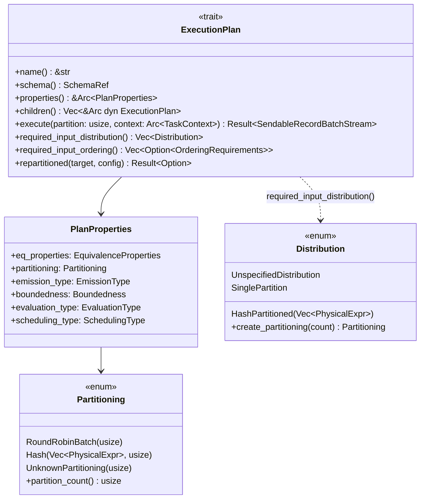
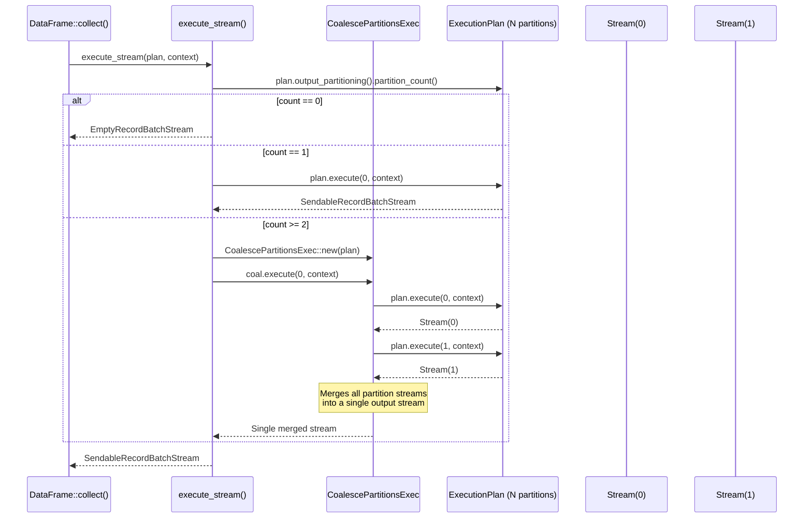

# Module Teardown: The `ExecutionPlan` & Partitioning

## 0. Research Focus
* **Task ID:** 2.1.A
* **Focus:** How does a physical plan define its level of concurrency? Trace the `output_partitioning()` method to understand how an operator declares how many parallel streams (drivers) it can produce.

## 1. High-Level Overview
* **Core Responsibility:** `ExecutionPlan` is the trait that all physical operators implement. It defines how an operator produces output: its schema, its partitioning (how many parallel streams it can produce), ordering guarantees, and the `execute()` method that creates a live async stream for a given partition index. `Partitioning` is the enum that describes how an operator's output is split — `RoundRobinBatch(N)`, `Hash(exprs, N)`, or `UnknownPartitioning(N)` — where N is the partition count (degree of parallelism).
* **Key Triggers:** The optimizer inspects `output_partitioning()` and `required_input_distribution()` to decide whether to insert `RepartitionExec` or `CoalescePartitionsExec` nodes. At execution time, the top-level API calls `execute(partition, context)` for each partition index from 0 to N-1.

## 2. Structural Architecture
* **Primary Source Files:**
  - `datafusion/physical-plan/src/execution_plan.rs` — `ExecutionPlan` trait, `PlanProperties`, `ExecutionPlanProperties` trait, top-level `collect`/`execute_stream` functions
  - `datafusion/physical-expr/src/partitioning.rs` — `Partitioning` enum, `Distribution` enum, satisfaction logic
  - `datafusion/physical-plan/src/filter.rs` — Example pass-through operator
  - `datafusion/physical-plan/src/repartition/mod.rs` — Example N→M repartitioning operator

* **Key Data Structures:**
  - `Partitioning` — Enum: `RoundRobinBatch(usize)`, `Hash(Vec<PhysicalExpr>, usize)`, `UnknownPartitioning(usize)`. All variants carry a partition count.
  - `Distribution` — Enum: `UnspecifiedDistribution`, `SinglePartition`, `HashPartitioned(Vec<PhysicalExpr>)`. Expresses what an operator *requires* from its input.
  - `PlanProperties` — Cached struct holding `Partitioning`, `EquivalenceProperties`, `EmissionType`, `Boundedness`, `EvaluationType`, `SchedulingType`.

### Class Diagram


## 3. Execution & Call Flow

### Sequence Diagram: From `collect()` to Partition Streams


### How operators set their partitioning:

**Pass-through (FilterExec):** Copies input's partitioning directly:
```rust
// filter.rs — compute_properties
let mut output_partitioning = input.output_partitioning().clone();
Ok(PlanProperties::new(
    eq_properties,
    output_partitioning,  // Same as input
    input.pipeline_behavior(),
    input.boundedness(),
))
```

**Repartitioning (RepartitionExec):** Replaces with a new scheme:
```rust
// repartition/mod.rs — compute_properties
PlanProperties::new(
    Self::eq_properties_helper(input, preserve_order),
    partitioning,  // NEW partitioning (e.g., Hash(exprs, M))
    input.pipeline_behavior(),
    input.boundedness(),
)
```

**Reduction (SortPreservingMergeExec):** Forces single partition:
```rust
// sort_preserving_merge.rs — compute_properties
PlanProperties::new(
    eq_properties,
    Partitioning::UnknownPartitioning(1),  // Single partition
    input.pipeline_behavior(),
    input.boundedness(),
)
```

### Top-level collection APIs:

```rust
// execution_plan.rs:1317-1332
pub fn execute_stream(plan, context) -> Result<SendableRecordBatchStream> {
    match plan.output_partitioning().partition_count() {
        0 => Ok(Box::pin(EmptyRecordBatchStream::new(plan.schema()))),
        1 => plan.execute(0, context),
        2.. => {
            let plan = CoalescePartitionsExec::new(Arc::clone(&plan));
            plan.execute(0, context)
        }
    }
}

// execution_plan.rs:1385-1395 — Keeps partitions separate
pub fn execute_stream_partitioned(plan, context) -> Result<Vec<SendableRecordBatchStream>> {
    let num_partitions = plan.output_partitioning().partition_count();
    let mut streams = Vec::with_capacity(num_partitions);
    for i in 0..num_partitions {
        streams.push(plan.execute(i, Arc::clone(&context))?);
    }
    Ok(streams)
}
```

## 4. Concurrency & State Management
* **Threading Model:** `ExecutionPlan` is `Send + Sync`. The `execute()` method itself is synchronous — it returns a `SendableRecordBatchStream` (a `Pin<Box<dyn RecordBatchStream + Send>>`). The actual parallel execution happens when multiple partition streams are polled concurrently by the Tokio runtime.
* **Partition semantics:** The `partition: usize` parameter in `execute()` is an *output* partition index. Pass-through operators (Filter, Projection) forward the same index to their input. Repartitioning operators (RepartitionExec) execute *all* input partitions internally when any output partition is requested.
* **`PlanProperties` caching:** Each operator computes its `PlanProperties` once at construction time and stores it in an `Arc`. The `properties()` method returns this cached value, avoiding repeated computation during optimization.

## 5. Memory & Resource Profile
* **Allocation Pattern:** `PlanProperties` is a small struct cached in an `Arc`. The `Partitioning` enum is lightweight — `Hash` carries a `Vec<Arc<dyn PhysicalExpr>>` plus a `usize`, others carry only a `usize`.
* **Memory Tracking:** The `ExecutionPlan` itself does not track memory. Memory tracking happens at the stream level via `MemoryConsumer`/`MemoryReservation` (covered in Phase 5). The `execute()` method receives a `TaskContext` which provides access to the `MemoryPool`.

## 6. Key Design Insights

* **`output_partitioning()` defines the degree of parallelism.** The partition count is the maximum number of independent streams the operator can produce. The optimizer uses `target_partitions` (from session config) to decide whether to insert additional `RepartitionExec` nodes to increase parallelism.

* **`Distribution` vs `Partitioning`:** `Distribution` expresses a *requirement* (what an operator needs from its input). `Partitioning` describes a *property* (what an operator actually produces). The optimizer bridges the gap by inserting repartition nodes when `required_input_distribution()` isn't satisfied by the child's `output_partitioning()`.

* **`execute()` is lazy.** The method creates and returns a stream immediately but does not start computation. Work only begins when the returned stream is polled. This enables the pull-based execution model where downstream operators drive execution.

* **The `execute()` signature is deliberately not `async`.** The docs explain: "The execute method itself is not async but it returns an async futures::stream::Stream. This Stream should incrementally compute the output, RecordBatch by RecordBatch (in a streaming fashion)." This design avoids the complexity of async trait methods while still enabling async I/O within the returned stream.
