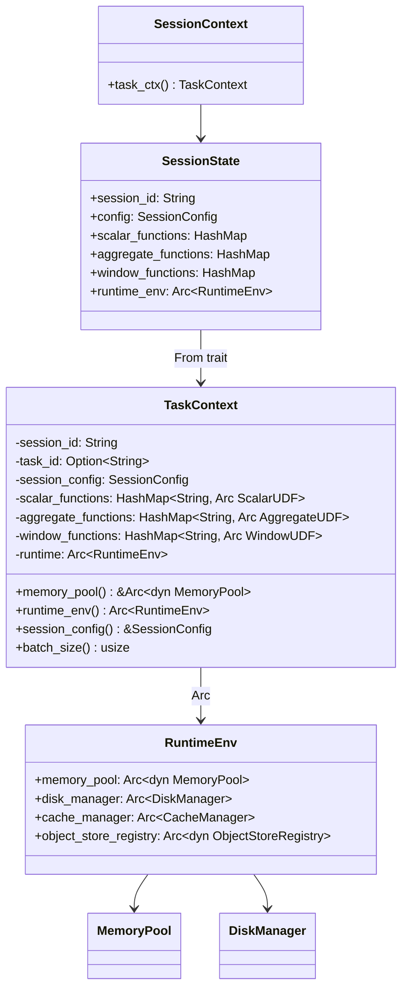
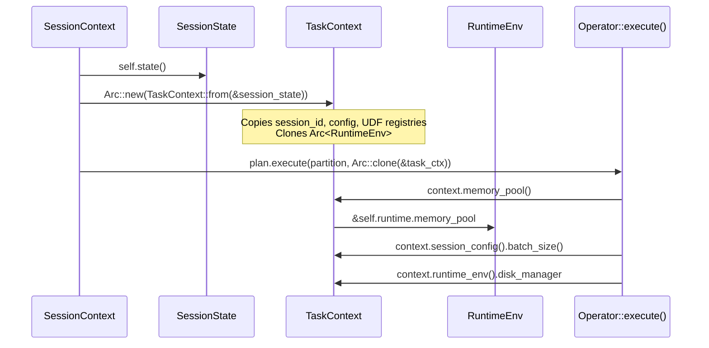

# Module Teardown: `TaskContext` Initialization & Resource Wiring

## 0. Research Focus
* **Task ID:** 2.1.B
* **Focus:** Trace how a `TaskContext` is wired up before execution begins. How does it link the `MemoryPool`, `DiskManager`, and session properties to the execution of a specific partition?

## 1. High-Level Overview
* **Core Responsibility:** `TaskContext` is the per-execution environment passed into every `ExecutionPlan::execute()` call. It bundles together the session configuration, registered UDFs (scalar, aggregate, window), and the `RuntimeEnv` which provides the `MemoryPool`, `DiskManager`, and `CacheManager`. It is the single point through which operators access all execution resources.
* **Key Triggers:** Created from `SessionContext::task_ctx()` or `SessionState` before query execution begins. Shared (via `Arc`) across all partition executions within a query. Operators access it in their `execute()` method to obtain memory pools, disk managers, batch sizes, etc.

## 2. Structural Architecture
* **Primary Source Files:**
  - `datafusion/execution/src/task.rs` — `TaskContext` struct and methods
  - `datafusion/execution/src/runtime_env.rs` — `RuntimeEnv` struct (holds MemoryPool, DiskManager)
  - `datafusion/core/src/execution/session_state.rs` — `From<&SessionState> for TaskContext`
  - `datafusion/core/src/execution/context/mod.rs` — `SessionContext::task_ctx()`

* **Key Data Structures:**
  - `TaskContext` — Holds session_id, task_id, SessionConfig, UDF registries, and `Arc<RuntimeEnv>`.
  - `RuntimeEnv` — Holds `Arc<dyn MemoryPool>`, `Arc<DiskManager>`, `Arc<CacheManager>`, `Arc<dyn ObjectStoreRegistry>`.

### Class Diagram


## 3. Execution & Call Flow

### Sequence Diagram: TaskContext Wiring


### Construction path:

```rust
// session_state.rs:2130-2143
impl From<&SessionState> for TaskContext {
    fn from(state: &SessionState) -> Self {
        TaskContext::new(
            None,                           // task_id
            state.session_id.clone(),
            state.config.clone(),           // SessionConfig
            state.scalar_functions.clone(), // UDF registries
            state.aggregate_functions.clone(),
            state.window_functions.clone(),
            Arc::clone(&state.runtime_env), // Shared RuntimeEnv
        )
    }
}
```

### Key accessor methods:

```rust
// task.rs
pub fn memory_pool(&self) -> &Arc<dyn MemoryPool> {
    &self.runtime.memory_pool
}
pub fn runtime_env(&self) -> Arc<RuntimeEnv> {
    Arc::clone(&self.runtime)
}
pub fn session_config(&self) -> &SessionConfig {
    &self.session_config
}
pub fn batch_size(&self) -> usize {
    self.session_config.batch_size()
}
```

## 4. Concurrency & State Management
* **Threading Model:** `TaskContext` is `Send + Sync` (all fields are either owned values or `Arc`-wrapped). A single `TaskContext` is shared via `Arc` across all partitions of a query. Each `execute()` call receives `Arc<TaskContext>`, not a unique copy.
* **No per-partition state:** `TaskContext` does not carry any partition-specific state. The partition index is a parameter to `execute()`, not a field on the context. This means all partitions of a query share the same memory pool, same config, same UDFs.
* **UDF registration:** UDF hashmaps are cloned from `SessionState` at creation time. Changes to the session's UDF registry after `TaskContext` creation are not reflected.

## 5. Memory & Resource Profile
* **Allocation Pattern:** `TaskContext` clones the UDF `HashMap`s (shallow clone — values are `Arc<UDF>`). The `RuntimeEnv` is shared via `Arc::clone`. Total overhead is modest.
* **Memory Tracking:** `TaskContext` itself is not memory-tracked. It provides the `MemoryPool` to operators via `memory_pool()`, but the pool tracks individual operator reservations, not the context.

## 6. Key Design Insights

* **`TaskContext` is a frozen snapshot.** It captures the session state at a point in time. This is intentional — a running query should not be affected by concurrent session changes (e.g., registering a new UDF mid-query).

* **Single `RuntimeEnv` per session.** The `RuntimeEnv` (and therefore the `MemoryPool`) is shared across all concurrent queries within a session. This enables global memory limits — a `GreedyMemoryPool` with a 1GB limit will enforce that limit across all queries, not per-query.

* **Operators access everything through `TaskContext`.** This is the only parameter (besides `partition`) to `execute()`. If an operator needs the batch size, it reads `context.session_config().batch_size()`. If it needs to spill to disk, it accesses `context.runtime_env().disk_manager`. This single-entry-point design simplifies the operator interface.
