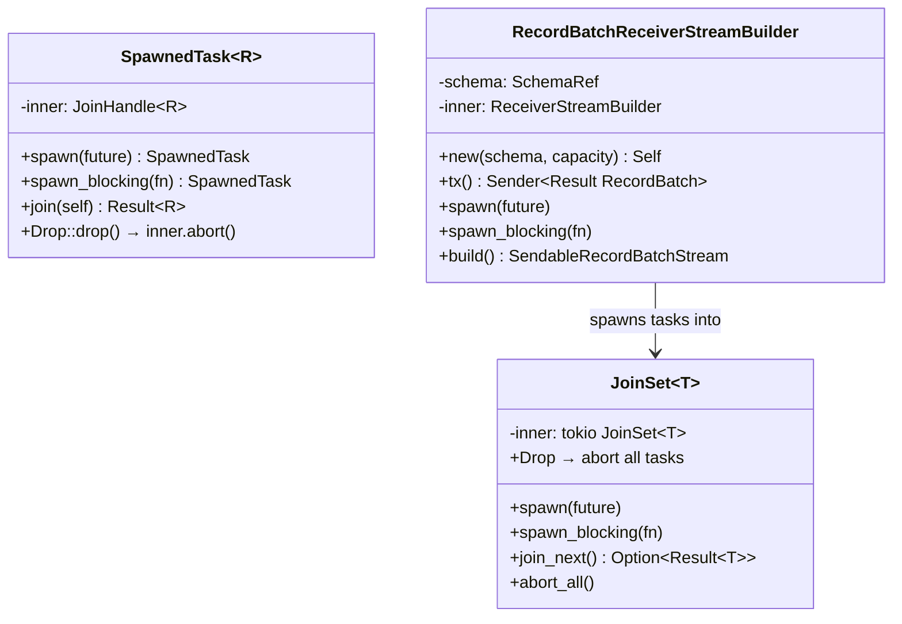
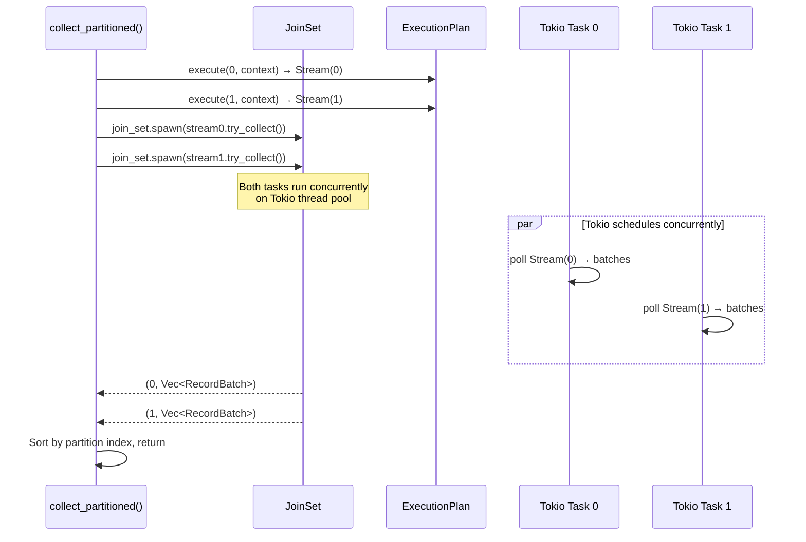

# Module Teardown: Tokio Task Spawning

## 0. Research Focus
* **Task ID:** 2.2.A
* **Focus:** How are multiple partitions mapped to actual CPU threads? Find the exact mechanisms where DataFusion uses `tokio::spawn` or `tokio::task::spawn_blocking` to hand off work to the async runtime.

## 1. High-Level Overview
* **Core Responsibility:** DataFusion maps partitions to OS threads indirectly through Tokio's async runtime. Rather than spawning one thread per partition, operators create async streams that are driven by the Tokio executor. Explicit task spawning is done through two controlled primitives: `SpawnedTask` (single task with abort-on-drop) and `JoinSet` (managed set of tasks). The key spawning function is `spawn_buffered()`, which decouples a producer stream from its consumer via a bounded channel and a background Tokio task.
* **Key Triggers:** Spawning happens in two scenarios: (1) `collect_partitioned()` spawns one Tokio task per partition to drive each stream concurrently; (2) Individual operators like `RepartitionExec` use `RecordBatchReceiverStreamBuilder` to spawn background tasks that pull from input streams and route batches through channels.

## 2. Structural Architecture
* **Primary Source Files:**
  - `datafusion/common-runtime/src/common.rs` — `SpawnedTask` (abort-on-drop wrapper)
  - `datafusion/common-runtime/src/join_set.rs` — `JoinSet` (managed task set wrapper)
  - `datafusion/physical-plan/src/common.rs` — `spawn_buffered()` function
  - `datafusion/physical-plan/src/stream.rs` — `RecordBatchReceiverStreamBuilder`
  - `datafusion/physical-plan/src/execution_plan.rs` — `collect_partitioned()`

* **Key Data Structures:**
  - `SpawnedTask<R>` — Wraps `tokio::task::JoinHandle<R>`. Aborts the task on `Drop`.
  - `JoinSet<T>` — Wraps `tokio::task::JoinSet<T>`. Instruments spawns with tracing. Aborts all tasks on `Drop`.
  - `RecordBatchReceiverStreamBuilder` — Creates a `mpsc::channel` + `JoinSet`, spawns producer tasks, and builds a consumer stream.

### Class Diagram


## 3. Execution & Call Flow

### Sequence Diagram: `collect_partitioned` — Parallel Partition Execution


### `collect_partitioned` implementation:

```rust
// execution_plan.rs:1335-1379
pub async fn collect_partitioned(
    plan: Arc<dyn ExecutionPlan>,
    context: Arc<TaskContext>,
) -> Result<Vec<Vec<RecordBatch>>> {
    let streams = execute_stream_partitioned(plan, context)?;
    let mut join_set = JoinSet::new();

    // Spawn one Tokio task per partition stream
    streams.into_iter().enumerate().for_each(|(idx, stream)| {
        join_set.spawn(async move {
            let result: Result<Vec<RecordBatch>> = stream.try_collect().await;
            (idx, result)
        });
    });

    let mut batches = vec![];
    while let Some(result) = join_set.join_next().await {
        match result {
            Ok((idx, res)) => batches.push((idx, res?)),
            Err(e) => {
                if e.is_panic() { std::panic::resume_unwind(e.into_panic()); }
                else { unreachable!(); }
            }
        }
    }
    batches.sort_by_key(|(idx, _)| *idx);
    Ok(batches.into_iter().map(|(_, batch)| batch).collect())
}
```

### `spawn_buffered` — Decoupling producer and consumer:

```rust
// common.rs:94-123
pub fn spawn_buffered(
    mut input: SendableRecordBatchStream,
    buffer: usize,
) -> SendableRecordBatchStream {
    match tokio::runtime::Handle::try_current() {
        Ok(handle)
            if handle.runtime_flavor() == tokio::runtime::RuntimeFlavor::MultiThread =>
        {
            let mut builder = RecordBatchReceiverStream::builder(input.schema(), buffer);
            let sender = builder.tx();
            builder.spawn(async move {
                while let Some(item) = input.next().await {
                    if sender.send(item).await.is_err() {
                        return Ok(());  // Receiver dropped → stop
                    }
                }
                Ok(())
            });
            builder.build()
        }
        _ => input,  // Single-threaded: no spawning
    }
}
```

### `SpawnedTask` — Abort-on-drop safety:

```rust
// common.rs:34-111
pub struct SpawnedTask<R> {
    inner: JoinHandle<R>,
}

impl<R> SpawnedTask<R> {
    pub fn spawn<T>(task: T) -> Self
    where T: Future<Output = R> + Send + 'static, R: Send,
    {
        let inner = tokio::task::spawn(trace_future(task));
        Self { inner }
    }

    pub fn spawn_blocking<T>(task: T) -> Self
    where T: FnOnce() -> R + Send + 'static, R: Send,
    {
        let inner = tokio::task::spawn_blocking(trace_block(task));
        Self { inner }
    }
}

impl<R> Drop for SpawnedTask<R> {
    fn drop(&mut self) {
        self.inner.abort();  // Cancel task when handle is dropped
    }
}
```

## 4. Concurrency & State Management
* **Threading Model:** DataFusion does NOT create OS threads or Tokio tasks per partition by default. Partitions are async streams, and the Tokio runtime multiplexes them across its thread pool. Explicit spawning only happens in specific cases:
  - `collect_partitioned`: Spawns one Tokio task per partition to drive them concurrently.
  - `spawn_buffered`: Spawns a background task to decouple a producer stream from its consumer (enabling pipeline parallelism).
  - `RepartitionExec`: Uses `RecordBatchReceiverStreamBuilder` to spawn input-reading tasks.
* **Cancellation safety:** All spawning primitives (`SpawnedTask`, `JoinSet`) abort tasks on drop. When a stream is dropped (e.g., query cancelled, limit reached), background tasks are automatically cancelled.
* **Multi-thread guard:** `spawn_buffered` checks for `RuntimeFlavor::MultiThread` — if running on a current-thread runtime, it skips spawning and returns the input stream directly (spawning on a current-thread runtime would deadlock).

## 5. Memory & Resource Profile
* **Allocation Pattern:** `SpawnedTask` is a thin wrapper around `JoinHandle` (one pointer). `JoinSet` holds a `tokio::task::JoinSet` internally. `RecordBatchReceiverStreamBuilder` allocates a bounded `mpsc::channel` (the `buffer` parameter controls capacity).
* **Memory Tracking:** Spawned tasks are not tracked by the `MemoryPool`. Memory tracking happens within the streams that the tasks drive, via `MemoryReservation`.

## 6. Key Design Insights

* **No 1:1 partition-to-thread mapping.** DataFusion relies on Tokio's work-stealing scheduler to distribute partition streams across the thread pool. A query with 8 partitions on a 4-core machine will have 8 streams multiplexed across 4 Tokio worker threads, with Tokio's work-stealing ensuring balanced utilization.

* **`tokio::spawn` is banned; `SpawnedTask` is required.** The `ExecutionPlan::execute()` docs explicitly state: "`spawn` is disallowed, and instead use `SpawnedTask`." Raw `tokio::spawn` creates orphaned tasks that continue running after the query is cancelled. `SpawnedTask`'s abort-on-drop guarantees cleanup.

* **`spawn_buffered` enables pipeline parallelism.** Without it, pulling from a sort operator would block the downstream consumer until the sort completes. With `spawn_buffered`, the sort runs in a background task and buffers results in a channel, allowing the consumer to start processing immediately when results are available.

* **`RecordBatchReceiverStreamBuilder` is the primary spawning pattern.** Most operators that need background tasks use this builder: create a channel, spawn producers that send batches, and build a consumer stream. The builder's `JoinSet` ensures all spawned tasks are cancelled when the stream is dropped.
