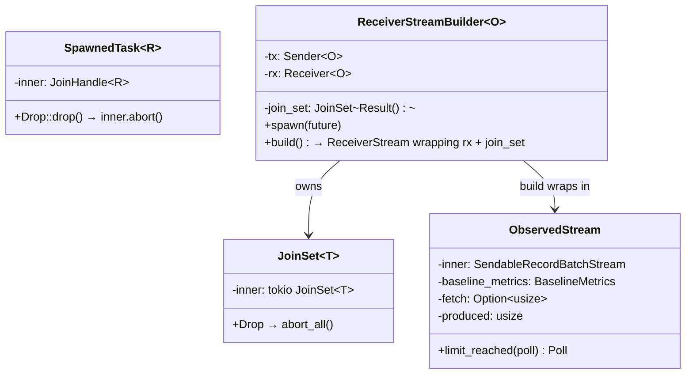
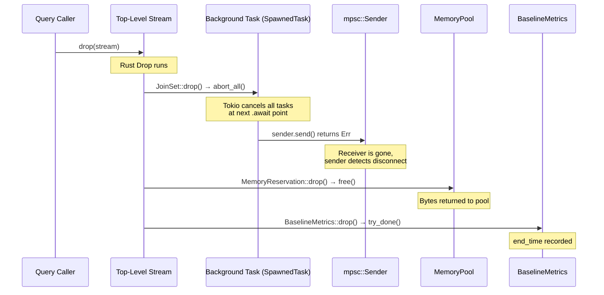
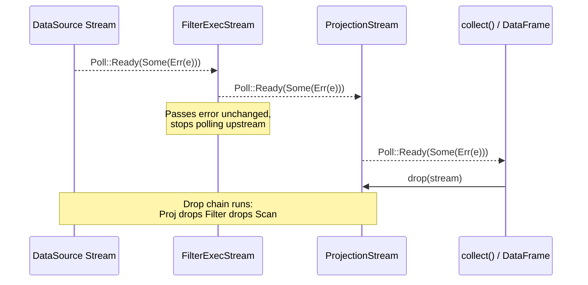

# Module Teardown: Task Cancellation & Failure Propagation

## 0. Research Focus
* **Task ID:** 2.2.B
* **Focus:** If one partition fails or the query is aborted, how is the failure propagated? Trace how dropping a Rust `Future` or aborting a Tokio task handles the teardown.

## 1. High-Level Overview
* **Core Responsibility:** DataFusion's cancellation model is entirely Drop-based — there are no explicit cancellation tokens or channels. When a stream is dropped (due to query cancellation, limit reached, or error), Rust's RAII guarantees trigger a cleanup chain: `SpawnedTask` and `JoinSet` abort their background Tokio tasks, `MemoryReservation` frees bytes back to the pool, and `BaselineMetrics` finalizes timing. Error propagation is immediate: when a stream's `poll_next()` receives an error from upstream, it passes it through unchanged and stops further polling.
* **Key Triggers:** (1) A query is cancelled by dropping the top-level stream. (2) A `LIMIT` clause is satisfied, causing the consumer to stop polling and drop the producer stream. (3) An operator returns `Err(...)` from `poll_next()`, causing the downstream consumer to propagate it upward and drop the stream. (4) A Tokio task panics inside `collect_partitioned()`, and the panic is resumed on the calling thread.

## 2. Structural Architecture
* **Primary Source Files:**
  - `datafusion/common-runtime/src/common.rs` — `SpawnedTask` abort-on-drop
  - `datafusion/common-runtime/src/join_set.rs` — `JoinSet` abort-all-on-drop
  - `datafusion/physical-plan/src/stream.rs` — `ReceiverStreamBuilder`, `ObservedStream` limit handling
  - `datafusion/physical-plan/src/execution_plan.rs` — `collect_partitioned()` panic handling
  - `datafusion/physical-plan/src/coalesce_partitions.rs` — Multi-partition cancellation
  - `datafusion/physical-plan/src/common.rs` — `spawn_buffered()` sender disconnect

* **Key Data Structures:**
  - `SpawnedTask<R>` — Wraps `JoinHandle<R>`, aborts on drop.
  - `JoinSet<T>` — Wraps `tokio::task::JoinSet<T>`, aborts all on drop.
  - `ReceiverStreamBuilder<O>` — Holds a `JoinSet` + `mpsc::Receiver`. When the receiver stream is dropped, the `JoinSet` is dropped, aborting all producer tasks.

### Class Diagram


## 3. Execution & Call Flow

### Sequence Diagram: Drop-Based Cancellation Chain


### Sequence Diagram: Error Propagation Through Stream Pipeline


### The Drop-Based Abort Mechanism

The foundation is `SpawnedTask`'s `Drop` impl, which aborts the background task:

```rust
// common.rs:89-93
impl<R> Drop for SpawnedTask<R> {
    fn drop(&mut self) {
        self.inner.abort();
    }
}
```

And `JoinSet`'s wrapper which aborts all tasks:

```rust
// join_set.rs — Drop impl
impl<T: 'static> Drop for JoinSet<T> {
    fn drop(&mut self) {
        self.inner.abort_all();
    }
}
```

### ReceiverStreamBuilder: Channel-Based Cleanup

The `ReceiverStreamBuilder` spawns producer tasks that send results through an `mpsc` channel. When the consumer stream is dropped, the receiver half is dropped, causing all `send()` calls to fail:

```rust
// stream.rs — ReceiverStreamBuilder::build()
// The built stream holds:
//   - rx: mpsc::Receiver (consumer side)
//   - join_set: JoinSet (producer tasks)
//
// When the stream is dropped:
//   1. rx is dropped → senders detect disconnect
//   2. join_set is dropped → abort_all() cancels tasks
```

Producer tasks detect the disconnect and exit gracefully:

```rust
// common.rs:107-112 — spawn_buffered producer task
builder.spawn(async move {
    while let Some(item) = input.next().await {
        if sender.send(item).await.is_err() {
            return Ok(());  // Receiver dropped → stop
        }
    }
    Ok(())
});
```

### CoalescePartitionsExec: Multi-Partition Cancellation

`CoalescePartitionsExec` merges N input partitions into a single output stream. It spawns one task per partition, all writing to a shared channel:

```rust
// coalesce_partitions.rs
for part_i in 0..input_partitions {
    builder.run_input(Arc::clone(&self.input), part_i, Arc::clone(&context));
}
let stream = builder.build();
```

When the merged stream is dropped, all N partition tasks are cancelled simultaneously via the `JoinSet`. DataFusion includes a test (`test_drop_cancel`) that verifies this:

```rust
// coalesce_partitions.rs — test
assert_is_pending(&mut fut);   // Tasks are running
drop(fut);                      // Drop the future
assert_strong_count_converges_to_zero(refs);  // All tasks cancelled
```

### Panic Handling in collect_partitioned

When multiple partitions run as separate Tokio tasks (via `JoinSet`), a panic in one task is caught and resumed on the calling thread:

```rust
// execution_plan.rs:1355-1365
while let Some(result) = join_set.join_next().await {
    match result {
        Ok((idx, res)) => batches.push((idx, res?)),
        Err(e) => {
            if e.is_panic() {
                std::panic::resume_unwind(e.into_panic());
            } else {
                unreachable!();
            }
        }
    }
}
```

When the panic is resumed, the remaining `JoinSet` is dropped (it's a local variable), which aborts all other partition tasks. This ensures a panic in partition 3 doesn't leave partitions 0, 1, 2 running indefinitely.

### ReceiverStreamBuilder: Panic Forwarding

The `ReceiverStreamBuilder` has similar logic. When polling the `JoinSet` for completed tasks, it resumes panics:

```rust
// stream.rs — ReceiverStreamBuilder poll logic
while let Some(result) = ready!(self.join_set.poll_join_next(cx)) {
    match result {
        Ok(Ok(())) => continue,
        Ok(Err(e)) => return Poll::Ready(Some(Err(e))),
        Err(e) => {
            if e.is_panic() {
                std::panic::resume_unwind(e.into_panic());
            }
            // else: task was cancelled, which is expected
        }
    }
}
```

### LIMIT-Triggered Cancellation via ObservedStream

`ObservedStream` wraps a stream with a fetch limit. When the limit is reached, it returns `Poll::Ready(None)`, which signals EOF and triggers the consumer to drop the stream:

```rust
// stream.rs:508-540
fn limit_reached(
    &mut self,
    poll: Poll<Option<Result<RecordBatch>>>,
) -> Poll<Option<Result<RecordBatch>>> {
    // Already past limit
    if self.produced >= fetch {
        return Poll::Ready(None);
    }
    // Batch would exceed limit — slice it
    if let Poll::Ready(Some(Ok(batch))) = &poll {
        if self.produced + batch.num_rows() > fetch {
            let batch = batch.slice(0, fetch - self.produced);
            self.produced += batch.num_rows();
            return Poll::Ready(Some(Ok(batch)));
        }
    }
    poll
}
```

This `Poll::Ready(None)` propagates up the consumer chain. The consumer drops the stream, triggering the Drop chain that cancels all upstream work.

### Error Propagation in Operators

Operators follow a consistent pattern — errors stop processing immediately and are passed through unchanged:

```rust
// filter.rs:919-924 — FilterExecStream::poll_next
match ready!(self.input.poll_next_unpin(cx)) {
    None => { self.batch_coalescer.finish()?; }
    Some(Ok(batch)) => { /* process batch */ }
    other => return Poll::Ready(other),  // Error passthrough
}
```

```rust
// projection.rs:549-553 — ProjectionStream::poll_next
let poll = self.input.poll_next_unpin(cx).map(|x| match x {
    Some(Ok(batch)) => Some(self.batch_project(&batch)),
    other => other,  // Error passthrough
});
```

The `ExecutionPlan` documentation explicitly mandates this behavior:

> "ExecutionPlan implementations in DataFusion **cancel additional work immediately once an error occurs**. The rationale is that if the overall query will return an error, any additional work such as continued polling of inputs will be wasted."

## 4. Concurrency & State Management
* **Threading Model:** Cancellation is thread-safe because it operates through two mechanisms: (1) `JoinHandle::abort()` is safe to call from any thread — it signals the Tokio runtime to cancel the task at its next `.await` point. (2) `mpsc::Sender::send()` returns `Err` when the receiver is dropped, which can be detected from any task.
* **No explicit cancellation tokens:** DataFusion does NOT use `tokio::sync::CancellationToken` or similar patterns. The entire cancellation model relies on Rust's ownership and Drop semantics. This is simpler and eliminates the risk of forgetting to check a cancellation token.
* **Cancellation granularity:** Cancellation is per-stream, not per-query. There is no global "kill query" signal. Cancelling a query means dropping its top-level stream, which cascades through the DAG. If the query has multiple independent streams (e.g., from `collect_partitioned`), each stream's `JoinSet` handles its own cleanup.

## 5. Memory & Resource Profile
* **Allocation Pattern:** Cancellation itself allocates nothing. The cleanup path only *frees* resources: `MemoryReservation::free()` returns bytes to the pool, `BaselineMetrics::try_done()` records a timestamp, and temp files from spilling are deleted.
* **Memory Tracking:** During cancellation, the `MemoryReservation::drop()` → `free()` → `pool.shrink()` path is guaranteed to run. This means the pool's accounting stays accurate even under abrupt cancellation. There is no risk of "leaked" memory reservations because `Drop` is unconditional in Rust.

## 6. Key Design Insights

* **Drop IS the cancellation mechanism.** DataFusion's design is a textbook example of Rust's RAII principle applied to async systems. Instead of explicit cancellation protocols (like Trino's `DriverContext.isDone()` or Java's `Future.cancel()`), dropping a stream triggers the entire cleanup chain. This eliminates an entire class of bugs where cancellation is "forgotten" or checked too late.

* **Two-layer cancellation: abort + disconnect.** Background tasks are cancelled through two independent mechanisms that reinforce each other: (1) `JoinSet::abort_all()` directly cancels the Tokio task, and (2) `mpsc::Receiver` drop causes `sender.send()` to return `Err`. Even if a task is blocked on something other than `.await` (which shouldn't happen in well-written async code), the sender disconnect provides a second signal.

* **Panics are not swallowed.** Both `collect_partitioned` and `ReceiverStreamBuilder` use `std::panic::resume_unwind()` to propagate panics from spawned tasks back to the calling context. This ensures that bugs in operator implementations surface as crashes rather than silent data corruption.

* **Error propagation is immediate and unidirectional.** Errors flow downstream only — from producer to consumer. There is no mechanism for a downstream consumer to signal an error back to the producer (other than dropping the stream). This simplifies the error model: an operator either produces batches, produces an error, or produces EOF. Once an error occurs, the operator stops and the consumer decides what to do (typically: propagate it further).

* **The `ExecutionPlan` contract bans raw `tokio::spawn`.** The docs state: "`spawn` is disallowed, and instead use `SpawnedTask`." Raw `tokio::spawn` creates orphaned tasks that outlive the query. `SpawnedTask`'s abort-on-drop is what makes the entire cancellation model work — without it, dropped streams would leak background computation indefinitely.
