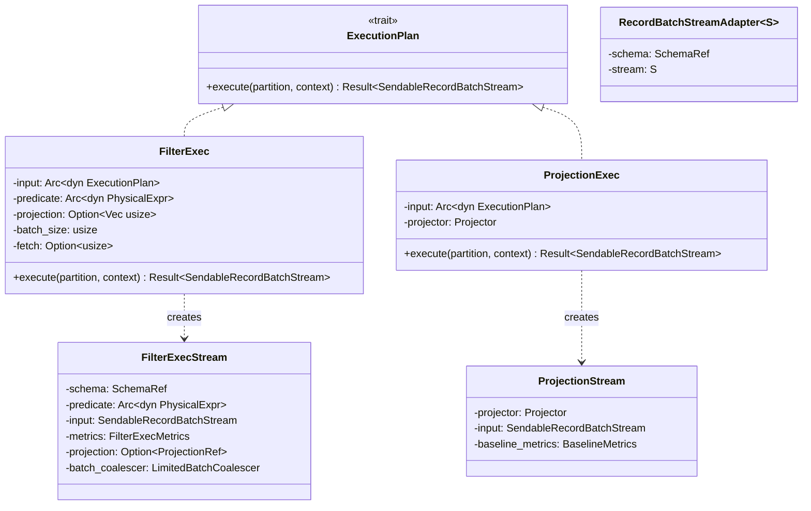
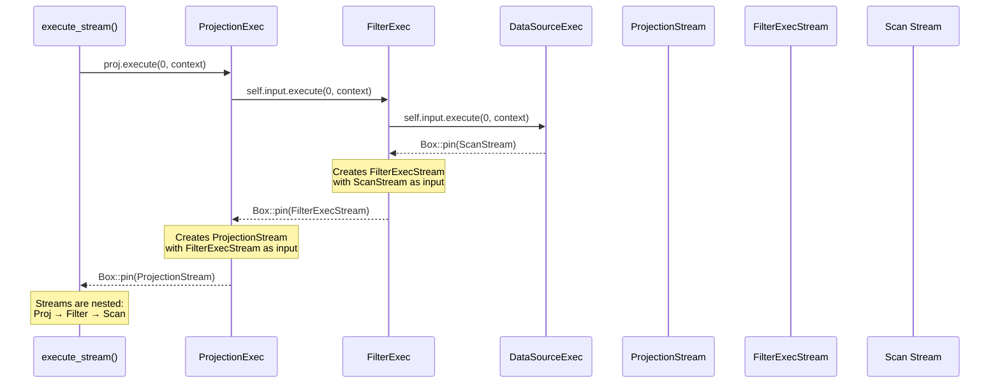

# Module Teardown: Stream Initialization

## 0. Research Focus
* **Task ID:** 2.3.A
* **Focus:** How is an operator instantiated into an active stream? Trace the `execute(partition: usize, context: Arc<TaskContext>)` method across core operators (Filter and Projection).

## 1. High-Level Overview
* **Core Responsibility:** Stream initialization is the transition from a static `ExecutionPlan` node to a live, pollable async stream. Each operator's `execute()` method is synchronous — it creates a stream struct, wires up its dependencies (by recursively calling `input.execute()`), and returns it wrapped in `Box::pin()`. The returned `SendableRecordBatchStream` is a type alias for `Pin<Box<dyn RecordBatchStream + Send>>`, which is the universal stream type across the entire execution engine.
* **Key Triggers:** Called by top-level APIs (`execute_stream`, `collect_partitioned`) or by parent operators during their own `execute()`. The `partition` parameter selects which output partition to produce. The `context` provides access to `MemoryPool`, `DiskManager`, batch size, and other execution resources.

## 2. Structural Architecture
* **Primary Source Files:**
  - `datafusion/physical-plan/src/filter.rs` — `FilterExec::execute()` and `FilterExecStream`
  - `datafusion/physical-plan/src/projection.rs` — `ProjectionExec::execute()` and `ProjectionStream`
  - `datafusion/physical-plan/src/stream.rs` — `RecordBatchStreamAdapter`, `RecordBatchReceiverStream`
  - `datafusion/physical-plan/src/execution_plan.rs` — `SendableRecordBatchStream` type alias, `execute_stream()`

* **Key Data Structures:**
  - `SendableRecordBatchStream` — `Pin<Box<dyn RecordBatchStream + Send>>`. The universal return type of all `execute()` calls.
  - `RecordBatchStream` — Trait combining `futures::Stream<Item = Result<RecordBatch>>` + `schema()` accessor.
  - `FilterExecStream` — Holds input stream, predicate expression, projection, metrics, and a `LimitedBatchCoalescer`.
  - `ProjectionStream` — Holds input stream, a `Projector`, and `BaselineMetrics`.
  - `RecordBatchStreamAdapter` — Wraps any `Stream<Item = Result<RecordBatch>>` + a schema into a `RecordBatchStream`.

### Class Diagram


## 3. Execution & Call Flow

### Sequence Diagram: Recursive Stream Initialization


### FilterExec::execute() — Full Implementation

```rust
// filter.rs:508-532
fn execute(
    &self,
    partition: usize,
    context: Arc<TaskContext>,
) -> Result<SendableRecordBatchStream> {
    trace!(
        "Start FilterExec::execute for partition {} of context session_id {} and task_id {:?}",
        partition,
        context.session_id(),
        context.task_id()
    );
    let metrics = FilterExecMetrics::new(&self.metrics, partition);
    Ok(Box::pin(FilterExecStream {
        schema: self.schema(),
        predicate: Arc::clone(&self.predicate),
        input: self.input.execute(partition, context)?,  // Recursive call
        metrics,
        projection: self.projection.clone(),
        batch_coalescer: LimitedBatchCoalescer::new(
            self.schema(),
            self.batch_size,
            self.fetch,
        ),
    }))
}
```

Key observations:
1. **Recursive initialization:** `self.input.execute(partition, context)?` walks down the plan tree. The `?` means if any child fails to initialize, the error propagates immediately.
2. **Partition pass-through:** The same `partition` index is forwarded to the child. Filter is a pass-through operator — it doesn't change the partitioning.
3. **Metrics per partition:** `FilterExecMetrics::new(&self.metrics, partition)` creates partition-specific metrics within the operator's shared `ExecutionPlanMetricsSet`.
4. **Batch coalescing:** The `LimitedBatchCoalescer` is initialized with the session's `batch_size` and the operator's `fetch` limit. It combines small filtered batches into target-sized output batches.

### ProjectionExec::execute() — Full Implementation

```rust
// projection.rs:339-357
fn execute(
    &self,
    partition: usize,
    context: Arc<TaskContext>,
) -> Result<SendableRecordBatchStream> {
    trace!(
        "Start ProjectionExec::execute for partition {} of context session_id {} and task_id {:?}",
        partition,
        context.session_id(),
        context.task_id()
    );

    let projector = self.projector.with_metrics(&self.metrics, partition);
    Ok(Box::pin(ProjectionStream::new(
        projector,
        self.input.execute(partition, context)?,  // Recursive call
        BaselineMetrics::new(&self.metrics, partition),
    )?))
}
```

Simpler than Filter — no batch coalescing, no fetch limit. The `Projector` is cloned with partition-specific metrics attached.

### FilterExecMetrics — Partition-Specific Metrics Setup

```rust
// filter.rs:844-862
struct FilterExecMetrics {
    baseline_metrics: BaselineMetrics,
    selectivity: RatioMetrics,
}

impl FilterExecMetrics {
    pub fn new(metrics: &ExecutionPlanMetricsSet, partition: usize) -> Self {
        Self {
            baseline_metrics: BaselineMetrics::new(metrics, partition),
            selectivity: MetricBuilder::new(metrics)
                .with_type(MetricType::Summary)
                .ratio_metrics("selectivity", partition),
        }
    }
}
```

`BaselineMetrics` tracks: elapsed_compute time, output_rows count, output_bytes, output_batches, and start/end timestamps. These are created per-partition but stored in the operator's shared metrics set.

### FilterExecStream — Stream Struct

```rust
// filter.rs:828-841
struct FilterExecStream {
    schema: SchemaRef,
    predicate: Arc<dyn PhysicalExpr>,
    input: SendableRecordBatchStream,
    metrics: FilterExecMetrics,
    projection: Option<ProjectionRef>,
    batch_coalescer: LimitedBatchCoalescer,
}
```

### ProjectionStream — Stream Struct

```rust
// projection.rs:536-540
struct ProjectionStream {
    projector: Projector,
    input: SendableRecordBatchStream,
    baseline_metrics: BaselineMetrics,
}
```

### RecordBatchStreamAdapter — Generic Stream Wrapper

For operators that produce a `futures::Stream` rather than a custom struct, `RecordBatchStreamAdapter` bridges the gap:

```rust
// stream.rs:429-464
pub struct RecordBatchStreamAdapter<S> {
    schema: SchemaRef,
    stream: S,
}

impl<S> RecordBatchStreamAdapter<S> {
    pub fn new(schema: SchemaRef, stream: S) -> Self {
        Self { schema, stream }
    }
}

impl<S> Stream for RecordBatchStreamAdapter<S>
where
    S: Stream<Item = Result<RecordBatch>>,
{
    type Item = Result<RecordBatch>;

    fn poll_next(self: Pin<&mut Self>, cx: &mut Context<'_>) -> Poll<Option<Self::Item>> {
        self.project().stream.poll_next(cx)
    }
}

impl<S> RecordBatchStream for RecordBatchStreamAdapter<S>
where
    S: Stream<Item = Result<RecordBatch>>,
{
    fn schema(&self) -> SchemaRef {
        Arc::clone(&self.schema)
    }
}
```

This is used extensively by operators that construct their output using `futures::stream::once(async { ... }).try_flatten()` patterns (e.g., `SortExec`).

## 4. Concurrency & State Management
* **Threading Model:** `execute()` is synchronous — it runs on the calling thread and returns immediately. No Tokio tasks are spawned during stream initialization for pass-through operators (Filter, Projection). The returned stream is `Send`, so it can be moved to any Tokio worker thread for polling.
* **Recursive initialization is depth-first.** The call to `self.input.execute()` recursively initializes the entire subtree below this operator before the current operator's stream struct is created. If the plan tree is Filter → Projection → Scan, the initialization order is: Scan creates its stream first, then Projection wraps it, then Filter wraps that.
* **No computation during initialization.** The `execute()` method creates the stream struct but does NOT start processing data. All computation happens lazily during `poll_next()`. This is why `execute()` is synchronous, not async.
* **Context sharing:** The same `Arc<TaskContext>` is passed to all operators in the tree. Each operator clones the `Arc` for its child. This means all partitions within a query share the same `MemoryPool`, `DiskManager`, and `SessionConfig`.

## 5. Memory & Resource Profile
* **Allocation Pattern:** Stream initialization allocates the stream struct itself (on the heap, via `Box::pin`), metrics handles, and any operator-specific state (e.g., `LimitedBatchCoalescer` with its internal `BatchCoalescer`). For pass-through operators, this is minimal — a few hundred bytes per stream.
* **Memory Tracking:** Stream initialization does NOT register with the `MemoryPool`. Memory tracking begins when the stream starts buffering data during `poll_next()` (e.g., when `GroupedHashAggregateStream` starts accumulating groups). Streaming operators like Filter and Projection never register because they don't buffer — they process one batch at a time.

## 6. Key Design Insights

* **`execute()` builds a nested stream pipeline.** The recursive `self.input.execute()` pattern creates a chain of nested streams: each stream holds its input stream as a field. When the top-level stream is polled, it polls its input, which polls its input, and so on — forming a pull-based pipeline. The entire query plan is "compiled" into a single stream object.

* **`Box::pin()` is the universal stream packaging.** Every `execute()` returns `Box::pin(MyStream { ... })`. This erases the concrete stream type behind the `dyn RecordBatchStream` trait object, allowing heterogeneous operator types to compose. The `Pin` is required because async streams may be self-referential.

* **Metrics are per-partition, stored per-operator.** Each `execute(partition, ...)` call creates metrics for that partition, but they're registered in the operator's shared `ExecutionPlanMetricsSet`. This means `EXPLAIN ANALYZE` can aggregate metrics across all partitions of an operator.

* **Separation between plan-time and execution-time state.** The `FilterExec` (plan node) holds the predicate and projection as configuration. The `FilterExecStream` (runtime stream) holds the live input stream and mutable state (metrics, batch coalescer). This separation means the same `FilterExec` can create multiple independent streams for different partitions — `execute(0, ctx)` and `execute(1, ctx)` produce completely independent `FilterExecStream` instances.

* **Error during initialization aborts the entire subtree.** If `self.input.execute()` fails (e.g., a table doesn't exist), the `?` propagates the error immediately. No partial stream is created, and no cleanup is needed because nothing was allocated yet. This is simpler than deferred initialization where errors might surface during the first `poll_next()`.
