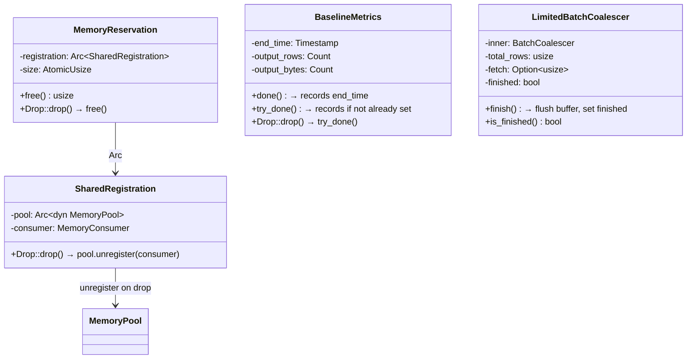
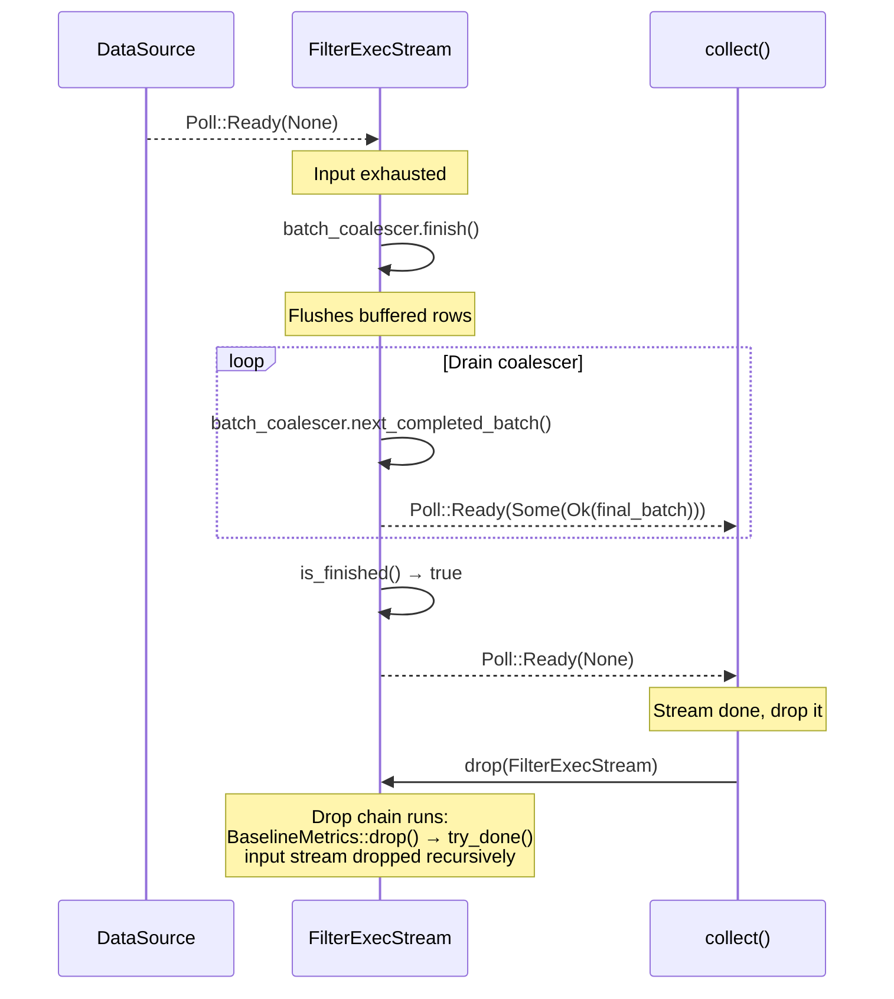
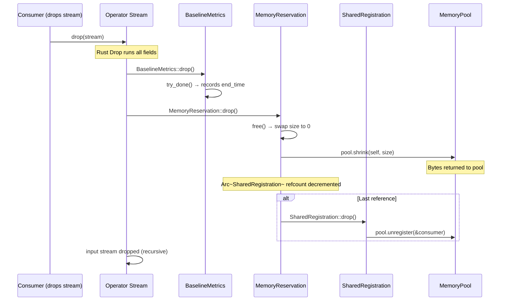

# Module Teardown: Stream Termination & Cleanup

## 0. Research Focus
* **Task ID:** 2.3.C
* **Focus:** When is a stream considered finished? Trace the path when `poll_next()` finally returns `Poll::Ready(None)`, and analyze how `MemoryReservation` drops automatically release memory back to the `TaskContext`.

## 1. High-Level Overview
* **Core Responsibility:** Stream termination in DataFusion follows two paths: natural completion (upstream returns `None`, meaning no more data) and early termination (limit reached, error, or cancellation via drop). In both cases, Rust's RAII guarantees drive the cleanup: `MemoryReservation::drop()` frees bytes back to the pool, `BaselineMetrics::drop()` finalizes timing, background tasks are aborted via `JoinSet::drop()`, and spill files are cleaned up by `SpillManager`. The cleanup is automatic, deterministic, and happens in reverse order of construction.
* **Key Triggers:** (1) Natural EOF: the leaf data source has no more rows. (2) Fetch limit: `ObservedStream` or `LimitedBatchCoalescer` detects the row limit is reached. (3) Error: an operator returns `Err`, causing the consumer to drop the stream. (4) Cancellation: the top-level future/stream is dropped.

## 2. Structural Architecture
* **Primary Source Files:**
  - `datafusion/physical-plan/src/filter.rs` — `FilterExecStream` termination (coalescer flush + EOF)
  - `datafusion/physical-plan/src/stream.rs` — `ReceiverStreamBuilder` termination (JoinSet drain + panic forwarding)
  - `datafusion/physical-plan/src/coalesce/mod.rs` — `LimitedBatchCoalescer` (limit + finish logic)
  - `datafusion/physical-expr-common/src/metrics/baseline.rs` — `BaselineMetrics::drop()` (metrics finalization)
  - `datafusion/execution/src/memory_pool/mod.rs` — `MemoryReservation::drop()` (memory release)
  - `datafusion/physical-plan/src/sorts/sort.rs` — `ExternalSorter` (spill file + memory cleanup)

* **Key Data Structures:**
  - `MemoryReservation` — RAII handle; `drop()` calls `free()` which calls `pool.shrink()`.
  - `BaselineMetrics` — RAII handle; `drop()` calls `try_done()` which records `end_time`.
  - `LimitedBatchCoalescer` — Buffers small batches; `finish()` flushes the buffer and marks finished.
  - `ReceiverStreamBuilder` (built stream) — Holds `JoinSet`; drains tasks on poll after receiver closes, forwards panics.

### Class Diagram


## 3. Execution & Call Flow

### Sequence Diagram: Natural Stream Termination


### Sequence Diagram: RAII Cleanup Chain


### Natural EOF: FilterExecStream Termination Path

When the upstream data source has no more rows, FilterExecStream goes through a multi-step flush:

```rust
// filter.rs:896-976 — Termination-relevant paths
fn poll_next(mut self: Pin<&mut Self>, cx: &mut Context<'_>) -> Poll<Option<Self::Item>> {
    loop {
        // Step 1: Drain any completed batches from the coalescer
        if let Some(batch) = self.batch_coalescer.next_completed_batch() {
            self.metrics.selectivity.add_part(batch.num_rows());
            let poll = Poll::Ready(Some(Ok(batch)));
            return self.metrics.baseline_metrics.record_poll(poll);
        }

        // Step 2: If coalescer is finished and drained, signal EOF
        if self.batch_coalescer.is_finished() {
            return Poll::Ready(None);
        }

        // Step 3: Poll upstream
        match ready!(self.input.poll_next_unpin(cx)) {
            None => {
                // Upstream done → flush buffered rows
                self.batch_coalescer.finish()?;
                // Loop back to step 1 to drain the flushed batch
            }
            Some(Ok(batch)) => { /* filter and push to coalescer */ }
            other => return Poll::Ready(other),
        }
    }
}
```

The termination sequence is:
1. Upstream returns `None` → `finish()` flushes the coalescer buffer.
2. Loop back → `next_completed_batch()` returns the flushed batch → emit it.
3. Loop back → `next_completed_batch()` returns `None`, `is_finished()` returns `true` → return `Poll::Ready(None)`.

### LimitedBatchCoalescer: The Flush Mechanism

```rust
// coalesce/mod.rs
impl LimitedBatchCoalescer {
    pub fn finish(&mut self) -> Result<()> {
        self.inner.finish_buffered_batch()?;
        self.finished = true;
        Ok(())
    }

    pub fn is_finished(&self) -> bool {
        self.finished && self.inner.next_completed_batch().is_none()
    }

    pub fn push_batch(&mut self, batch: RecordBatch) -> Result<PushBatchStatus> {
        // If fetch limit reached, slice the batch
        if let Some(fetch) = self.fetch {
            if self.total_rows + batch.num_rows() >= fetch {
                let remaining_rows = fetch - self.total_rows;
                let batch_head = batch.slice(0, remaining_rows);
                self.total_rows += batch_head.num_rows();
                self.inner.push_batch(batch_head)?;
                return Ok(PushBatchStatus::LimitReached);
            }
        }
        self.total_rows += batch.num_rows();
        self.inner.push_batch(batch)?;
        Ok(PushBatchStatus::Continue)
    }
}
```

When `PushBatchStatus::LimitReached` is returned, FilterExecStream calls `finish()` to flush the remaining buffer, then drains it — same as the natural EOF path.

### MemoryReservation::drop() — Memory Release

```rust
// memory_pool/mod.rs
impl Drop for MemoryReservation {
    fn drop(&mut self) {
        self.free();
    }
}

pub fn free(&self) -> usize {
    let size = self.size.swap(0, atomic::Ordering::Relaxed);
    if size != 0 {
        self.registration.pool.shrink(self, size);
    }
    size
}
```

This is unconditional — whether the stream ends naturally, via error, or via cancellation, the memory is returned to the pool. The `swap(0, Relaxed)` ensures idempotency: calling `free()` twice is safe (the second call sees size=0 and does nothing).

### SharedRegistration::drop() — Consumer Unregistration

```rust
// memory_pool/mod.rs
impl Drop for SharedRegistration {
    fn drop(&mut self) {
        self.pool.unregister(&self.consumer);
    }
}
```

The `SharedRegistration` is wrapped in `Arc`. The `unregister` call only runs when the last `Arc` reference is dropped. For most operators, this is when the single `MemoryReservation` is dropped. For operators using `split()` (which creates a new `MemoryReservation` sharing the same `SharedRegistration`), the consumer stays registered until all split reservations are dropped.

### BaselineMetrics::drop() — Metrics Finalization

```rust
// baseline.rs:234-238
impl Drop for BaselineMetrics {
    fn drop(&mut self) {
        self.try_done()
    }
}

pub fn try_done(&self) {
    if self.end_time.value().is_none() {
        self.end_time.record();
    }
}
```

The `try_done()` only records if `done()` hasn't been called yet. In the normal path, `record_poll()` calls `done()` when it sees `None` or `Err`. The `Drop` impl is a safety net for cases where the stream is dropped before it naturally completes (cancellation or early termination).

### BaselineMetrics::record_poll() — Done on Terminal States

```rust
// baseline.rs:213-231
pub fn record_poll(
    &self,
    poll: Poll<Option<Result<RecordBatch>>>,
) -> Poll<Option<Result<RecordBatch>>> {
    if let Poll::Ready(maybe_batch) = &poll {
        match maybe_batch {
            Some(Ok(batch)) => {
                batch.record_output(self);  // Count rows/bytes
            }
            Some(Err(_)) => self.done(),    // Error → finalize
            None => self.done(),            // EOF → finalize
        }
    }
    poll
}
```

### ReceiverStreamBuilder: Background Task Cleanup

For streams backed by channels and background tasks (used by `CoalescePartitionsExec`, `RepartitionExec`, `spawn_buffered`), termination involves draining the `JoinSet`:

```rust
// stream.rs — ReceiverStreamBuilder poll logic (simplified)
fn poll_next(self: Pin<&mut Self>, cx: &mut Context<'_>) -> Poll<Option<Self::Item>> {
    // First: try to receive from the channel
    if let Poll::Ready(Some(val)) = self.rx.poll_recv(cx) {
        return Poll::Ready(Some(val));
    }

    // Channel empty — drain the JoinSet to check for errors/panics
    while let Some(result) = ready!(self.join_set.poll_join_next(cx)) {
        match result {
            Ok(Ok(())) => continue,              // Task finished cleanly
            Ok(Err(e)) => return Poll::Ready(Some(Err(e))),  // Task error
            Err(e) => {
                if e.is_panic() {
                    std::panic::resume_unwind(e.into_panic());  // Resume panic
                }
                // Task was cancelled — expected during cleanup
            }
        }
    }

    // All tasks done, channel drained → EOF
    Poll::Ready(None)
}
```

This ensures that even after the channel is empty, the stream waits for all background tasks to complete. Panics from background tasks are forwarded to the polling thread.

### ExternalSorter: Spill File + Memory Cleanup

The sort operator has the most complex cleanup due to spill files and dual memory reservations:

```rust
// sorts/sort.rs — ExternalSorter fields
struct ExternalSorter {
    in_mem_batches: Vec<RecordBatch>,
    in_progress_spill_file: Option<(InProgressSpillFile, usize)>,
    finished_spill_files: Vec<SortedSpillFile>,
    reservation: MemoryReservation,       // Spillable main reservation
    merge_reservation: MemoryReservation, // Non-spillable merge headroom
    spill_manager: SpillManager,
}
```

On termination:
1. `reservation.drop()` → frees main buffer memory back to pool.
2. `merge_reservation.drop()` → frees merge headroom back to pool.
3. `in_mem_batches` dropped → `RecordBatch` reference counts decremented, Arrow buffers freed.
4. `SpillManager` handles temp file cleanup — spill files are deleted when the manager is dropped.

In the non-spill path, merge memory is explicitly freed early:

```rust
// sorts/sort.rs
async fn sort(&mut self) -> Result<SendableRecordBatchStream> {
    if self.spilled_before() {
        // Spill path: transfer merge reservation to the merge stream
        StreamingMergeBuilder::new()
            .with_reservation(self.merge_reservation.take())
            .build()
    } else {
        // Non-spill path: free merge memory early
        self.merge_reservation.free();
        self.in_mem_sort_stream(self.metrics.baseline.clone())
    }
}
```

The `take()` method atomically transfers the reserved bytes to a new `MemoryReservation` without releasing them back to the pool — preventing other operators from racing to claim that memory.

## 4. Concurrency & State Management
* **Threading Model:** Drop runs on whichever thread last held the stream. For streams polled by a Tokio task, this is the Tokio worker thread where the task was last scheduled. For streams dropped by user code (e.g., `drop(stream)` in a test), it runs on the calling thread.
* **Drop order:** Rust drops struct fields in declaration order. This means the order of fields in stream structs determines cleanup order. For most operators, the `input` stream is dropped before `metrics`, ensuring the entire subtree is cleaned up before the current operator's metrics are finalized.
* **Concurrent cleanup:** When `JoinSet::drop()` calls `abort_all()`, the background tasks may still be running briefly until they hit their next `.await` point. The abort is asynchronous — `drop()` returns immediately without waiting for the tasks to stop. However, since the `JoinSet` is being dropped, there's no way to observe the tasks' final state.

## 5. Memory & Resource Profile
* **Allocation Pattern:** Stream termination is a pure deallocation path. No new memory is allocated during cleanup. The `free()` method on `MemoryReservation` is a single atomic swap + a `pool.shrink()` call.
* **Memory Tracking:** The cleanup path ensures the `MemoryPool`'s accounting stays consistent. Whether a stream ends via natural EOF, error, limit, or cancellation, the same `Drop` chain runs. The pool's `shrink()` method reduces the counter by exactly the amount that was `grow()`-ed, maintaining the invariant that `pool.reserved <= pool.limit`.

## 6. Key Design Insights

* **Two-phase termination for buffering operators.** Operators with internal buffers (FilterExecStream with its coalescer, aggregates with their accumulators) follow a two-phase pattern: (1) flush the buffer when upstream signals EOF, (2) drain the flushed output batches one at a time. This ensures no data is lost at stream boundaries.

* **`record_poll` + `Drop` = guaranteed metrics.** The normal path records end_time via `record_poll()` when it sees `None` or `Err`. The `Drop` path records via `try_done()` as a fallback. This double coverage ensures metrics are finalized whether the stream ends normally or is abruptly dropped.

* **`free()` is idempotent.** The `swap(0, Relaxed)` in `MemoryReservation::free()` means calling `free()` multiple times is safe. Some operators call `free()` explicitly before the stream ends (e.g., sort's non-spill path frees merge memory early). The subsequent `Drop` call to `free()` sees size=0 and is a no-op.

* **`SharedRegistration` + `Arc` enables split reservations.** When an operator creates a child reservation via `split()`, both the parent and child share the same `Arc<SharedRegistration>`. The `unregister` call only runs when the last reservation is dropped. This is critical for the sort operator, which transfers its merge reservation to the merge stream — the consumer registration stays alive for the entire merge phase.

* **Background task cleanup is best-effort on drop.** When a `JoinSet` is dropped, `abort_all()` is called, but the tasks may not have stopped by the time `drop()` returns. This is acceptable because the tasks can only access resources through their captured state, and any channels they hold will report errors on their next operation. The design trades "guaranteed synchronous cleanup" for "non-blocking drop."
