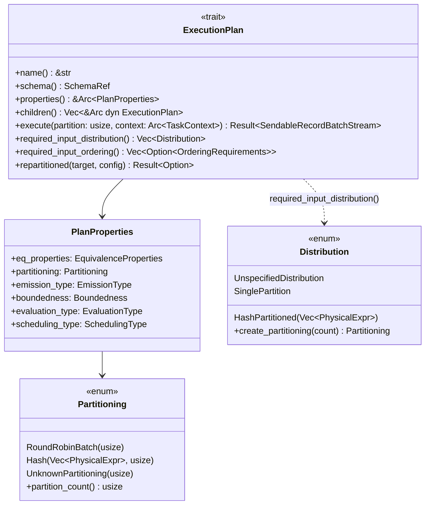
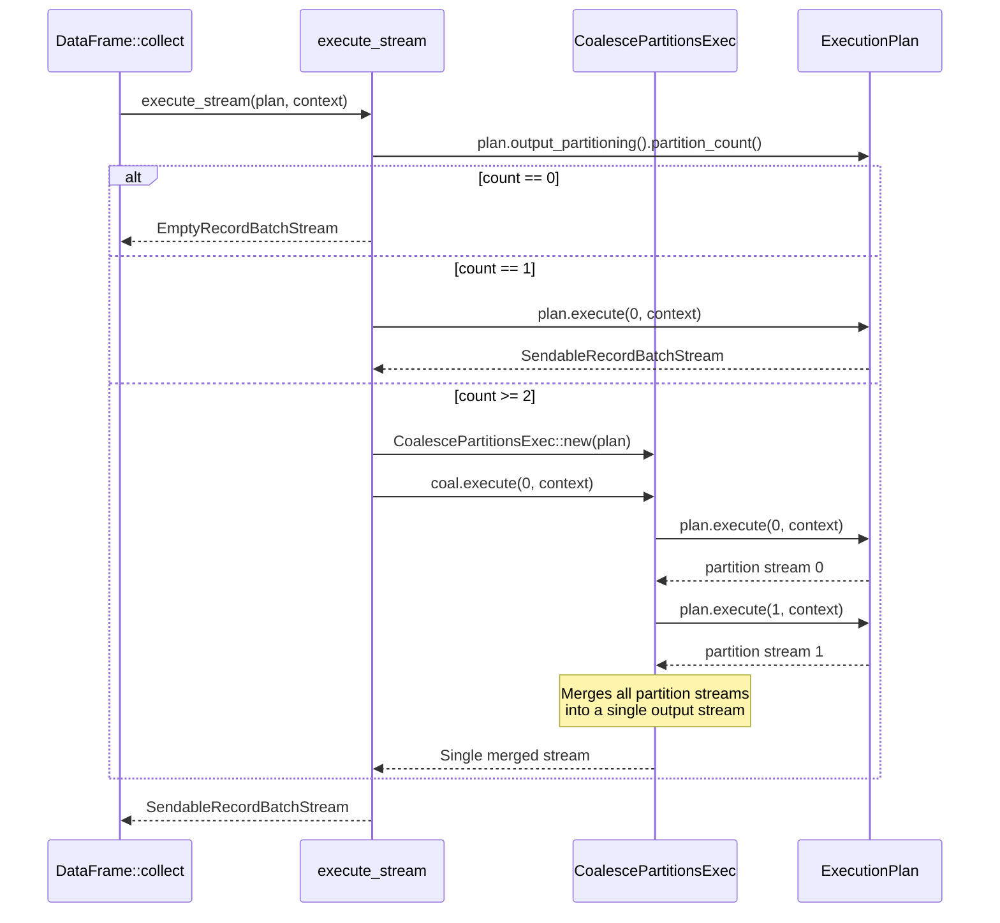

# Module Teardown: The Physical Plan Contract (`ExecutionPlan` & Partitioning)

## Table of Contents

- [0. Research Focus](#0-research-focus)
- [1. High-Level Overview](#1-high-level-overview)
- [2. Structural Architecture](#2-structural-architecture)
  - [Class Diagram](#class-diagram)
- [3. Execution & Call Flow](#3-execution-call-flow)
  - [Sequence Diagram: From `collect()` to Partition Streams](#sequence-diagram-from-collect-to-partition-streams)
  - [How operators set their partitioning:](#how-operators-set-their-partitioning)
  - [How operators set PlanProperties beyond Partitioning:](#how-operators-set-planproperties-beyond-partitioning)
  - [The `EnforceDistribution` Optimizer Rule](#the-enforcedistribution-optimizer-rule)
  - [The `repartitioned()` Method](#the-repartitioned-method)
  - [Top-level collection APIs:](#top-level-collection-apis)
- [4. Concurrency & State Management](#4-concurrency-state-management)
- [5. Memory & Resource Profile](#5-memory-resource-profile)
- [6. Key Design Insights](#6-key-design-insights)


## 0. Research Focus
* **Task ID:** 2.1
* **Focus:** Analyze the `ExecutionPlan` trait. Look at `properties()` (which defines partitioning and ordering via `PlanProperties`) and the `execute()` method. How does `execute()` take a partition index and a `TaskContext` to return a `SendableRecordBatchStream`? Trace how `output_partitioning()` declares the degree of concurrency. Analyze the `Partitioning` enum (`RoundRobinBatch`, `Hash`, `UnknownPartitioning`) and the `Distribution` enum. How does the optimizer bridge the gap between `required_input_distribution()` and `output_partitioning()` by inserting `RepartitionExec` or `CoalescePartitionsExec`?

## 1. High-Level Overview
* **Core Responsibility:** `ExecutionPlan` is the trait that all physical operators implement. It defines how an operator produces output: its schema, its partitioning (how many parallel streams it can produce), ordering guarantees, and the `execute()` method that creates a live async stream for a given partition index. `Partitioning` is the enum that describes how an operator's output is split — `RoundRobinBatch(N)`, `Hash(exprs, N)`, or `UnknownPartitioning(N)` — where N is the partition count (degree of parallelism).
* **Key Triggers:** The optimizer inspects `output_partitioning()` and `required_input_distribution()` to decide whether to insert `RepartitionExec` or `CoalescePartitionsExec` nodes. At execution time, the top-level API calls `execute(partition, context)` for each partition index from 0 to N-1.

## 2. Structural Architecture
* **Primary Source Files:**
  - `datafusion/physical-plan/src/execution_plan.rs` — `ExecutionPlan` trait, `PlanProperties`, `ExecutionPlanProperties` trait, top-level `collect`/`execute_stream` functions
  - `datafusion/physical-expr/src/partitioning.rs` — `Partitioning` enum, `Distribution` enum, satisfaction logic
  - `datafusion/physical-plan/src/filter.rs` — Example pass-through operator
  - `datafusion/physical-plan/src/repartition/mod.rs` — Example N->M repartitioning operator

* **Key Data Structures:**
  - `Partitioning` — Enum: `RoundRobinBatch(usize)`, `Hash(Vec<PhysicalExpr>, usize)`, `UnknownPartitioning(usize)`. All variants carry a partition count.
  - `Distribution` — Enum: `UnspecifiedDistribution`, `SinglePartition`, `HashPartitioned(Vec<PhysicalExpr>)`. Expresses what an operator *requires* from its input.
  - `PlanProperties` — Cached struct holding `Partitioning`, `EquivalenceProperties`, `EmissionType`, `Boundedness`, `EvaluationType`, `SchedulingType`.
  - `EmissionType` — Enum: `Incremental` (streaming as data arrives), `Final` (only after all input consumed), `Both` (e.g., left joins — incremental for matches, final for non-matches). Determines operator's streaming behavior.
  - `Boundedness` — Enum: `Bounded` (finite) or `Unbounded { requires_infinite_memory: bool }`. Tells the optimizer whether a stream will ever complete.
  - `EvaluationType` — Enum: `Lazy` (demand-driven, only works when polled) or `Eager` (spawns background Tokio tasks on first poll). Used by distributed engines to identify data exchange points via `need_data_exchange()`.
  - `SchedulingType` — Enum: `NonCooperative` (default) or `Cooperative` (consumes Tokio task budget per batch). The `EnsureCooperative` optimizer inserts `CooperativeExec` wrappers around non-cooperative leaf/exchange nodes.

### Class Diagram


## 3. Execution & Call Flow

### Sequence Diagram: From `collect()` to Partition Streams


### How operators set their partitioning:

**Pass-through (FilterExec):** Copies input's partitioning directly:
```rust
// filter.rs — compute_properties
let mut output_partitioning = input.output_partitioning().clone();
Ok(PlanProperties::new(
    eq_properties,
    output_partitioning,  // Same as input
    input.pipeline_behavior(),
    input.boundedness(),
))
```

**Repartitioning (RepartitionExec):** Replaces with a new scheme:
```rust
// repartition/mod.rs — compute_properties
PlanProperties::new(
    Self::eq_properties_helper(input, preserve_order),
    partitioning,  // NEW partitioning (e.g., Hash(exprs, M))
    input.pipeline_behavior(),
    input.boundedness(),
)
```

**Reduction (SortPreservingMergeExec):** Forces single partition:
```rust
// sort_preserving_merge.rs — compute_properties
PlanProperties::new(
    eq_properties,
    Partitioning::UnknownPartitioning(1),  // Single partition
    input.pipeline_behavior(),
    input.boundedness(),
)
```

### How operators set PlanProperties beyond Partitioning:

```rust
// RepartitionExec: Eager evaluation, Cooperative scheduling
PlanProperties::new(eq_properties, partitioning, input.pipeline_behavior(), input.boundedness())
    .with_scheduling_type(SchedulingType::Cooperative)
    .with_evaluation_type(EvaluationType::Eager)

// CoalescePartitionsExec: Conditional — only Eager if >1 input partition
let (drive, scheduling) = if input_partitions > 1 {
    (EvaluationType::Eager, SchedulingType::Cooperative)
} else {
    (input.properties().evaluation_type, input.properties().scheduling_type)
};

// SortExec: Final emission (must see all input before emitting)
PlanProperties::new(eq_properties, partitioning, EmissionType::Final, input.boundedness())
```

### The `EnforceDistribution` Optimizer Rule

The physical optimizer bridges Distribution vs Partitioning gaps in `enforce_distribution.rs`. It runs in two phases:

**Phase 1 — Top-down join key reordering:** Adjusts join key ordering to match input partitioning (avoids unnecessary repartitioning).

**Phase 2 — Bottom-up distribution enforcement:** For each plan node's children:

```rust
// For each child, check required_input_distribution()
match &requirement {
    Distribution::SinglePartition => {
        // Insert CoalescePartitionsExec (or SortPreservingMergeExec if ordered)
        if input.output_partitioning().partition_count() > 1 {
            if let Some(ordering) = input.output_ordering() {
                Arc::new(SortPreservingMergeExec::new(ordering, input))
            } else {
                Arc::new(CoalescePartitionsExec::new(input))
            }
        }
    }
    Distribution::HashPartitioned(exprs) => {
        // Insert RepartitionExec::Hash if partitioning doesn't satisfy requirement
        if !satisfaction.is_satisfied() || n_target > current_partition_count {
            RepartitionExec::try_new(input, Partitioning::Hash(exprs, n_target))?
                .with_preserve_order()
        }
    }
    Distribution::UnspecifiedDistribution => {
        // Insert RepartitionExec::RoundRobin to increase parallelism
        if partition_count < target_partitions && roundrobin_beneficial {
            RepartitionExec::try_new(input, Partitioning::RoundRobinBatch(target_partitions))?
        }
    }
}
```

The `target_partitions` config (default: num CPUs) drives the parallelism increase decisions. After modifying children, the optimizer calls `plan.with_new_children(modified_children)` to reconstruct the plan tree.

### The `repartitioned()` Method

Allows source operators to increase parallelism without a separate `RepartitionExec`:

```rust
// Default: no self-repartitioning
fn repartitioned(&self, _target_partitions: usize, _config: &ConfigOptions) -> Result<Option<Arc<dyn ExecutionPlan>>> {
    Ok(None)
}

// FileScanExec override: splits files across more partitions
// MemoryExec override: distributes in-memory data across partitions
```

Only called when `config.optimizer.repartition_file_scans` is enabled. This avoids inserting a `RepartitionExec` for source-level parallelism increases.

### Top-level collection APIs:

```rust
// execution_plan.rs:1317-1332
pub fn execute_stream(plan, context) -> Result<SendableRecordBatchStream> {
    match plan.output_partitioning().partition_count() {
        0 => Ok(Box::pin(EmptyRecordBatchStream::new(plan.schema()))),
        1 => plan.execute(0, context),
        2.. => {
            let plan = CoalescePartitionsExec::new(Arc::clone(&plan));
            plan.execute(0, context)
        }
    }
}

// execution_plan.rs:1385-1395 — Keeps partitions separate
pub fn execute_stream_partitioned(plan, context) -> Result<Vec<SendableRecordBatchStream>> {
    let num_partitions = plan.output_partitioning().partition_count();
    let mut streams = Vec::with_capacity(num_partitions);
    for i in 0..num_partitions {
        streams.push(plan.execute(i, Arc::clone(&context))?);
    }
    Ok(streams)
}
```

## 4. Concurrency & State Management
* **Threading Model:** `ExecutionPlan` is `Send + Sync`. The `execute()` method itself is synchronous — it returns a `SendableRecordBatchStream` (a `Pin<Box<dyn RecordBatchStream + Send>>`). The actual parallel execution happens when multiple partition streams are polled concurrently by the Tokio runtime.
* **Partition semantics:** The `partition: usize` parameter in `execute()` is an *output* partition index. Pass-through operators (Filter, Projection) forward the same index to their input. Repartitioning operators (RepartitionExec) execute *all* input partitions internally when any output partition is requested.
* **`PlanProperties` caching:** Each operator computes its `PlanProperties` once at construction time and stores it in an `Arc`. The `properties()` method returns this cached value, avoiding repeated computation during optimization.

## 5. Memory & Resource Profile
* **Allocation Pattern:** `PlanProperties` is a small struct cached in an `Arc`. The `Partitioning` enum is lightweight — `Hash` carries a `Vec<Arc<dyn PhysicalExpr>>` plus a `usize`, others carry only a `usize`.
* **Memory Tracking:** The `ExecutionPlan` itself does not track memory. Memory tracking happens at the stream level via `MemoryConsumer`/`MemoryReservation` (covered in Phase 5). The `execute()` method receives a `TaskContext` which provides access to the `MemoryPool`.

## 6. Key Design Insights

* **`output_partitioning()` defines the degree of parallelism.** The partition count is the maximum number of independent streams the operator can produce. The optimizer uses `target_partitions` (from session config) to decide whether to insert additional `RepartitionExec` nodes to increase parallelism.

* **`Distribution` vs `Partitioning`:** `Distribution` expresses a *requirement* (what an operator needs from its input). `Partitioning` describes a *property* (what an operator actually produces). The optimizer bridges the gap by inserting repartition nodes when `required_input_distribution()` isn't satisfied by the child's `output_partitioning()`.

* **`execute()` is lazy.** The method creates and returns a stream immediately but does not start computation. Work only begins when the returned stream is polled. This enables the pull-based execution model where downstream operators drive execution.

* **The `execute()` signature is deliberately not `async`.** The docs explain: "The execute method itself is not async but it returns an async futures::stream::Stream. This Stream should incrementally compute the output, RecordBatch by RecordBatch (in a streaming fashion)." This design avoids the complexity of async trait methods while still enabling async I/O within the returned stream.

* **The `execute()` contract mandates cooperative scheduling.** The full docstring requires: (1) The returned stream must free allocated resources when dropped — `spawn` is disallowed, use `SpawnedTask` instead. (2) The stream must not block the CPU indefinitely and must yield to Tokio regularly. This is achieved via the `coop` module utilities, manual `Poll::Pending` with wakers, or `tokio::task::yield_now()`. (3) Errors are sent as `Err` in the output stream, and implementations should cancel additional work immediately once an error occurs.

* **`EmissionType`, `Boundedness`, `EvaluationType`, and `SchedulingType` control the execution model beyond partitioning.** These four properties determine: when records are emitted (incremental vs final), whether the stream is infinite, whether the operator spawns background tasks (Eager vs Lazy), and whether it participates in Tokio's cooperative scheduling budget. The `EnsureCooperative` optimizer automatically wraps non-cooperative leaf and exchange nodes with `CooperativeExec`.

* **The `EnforceDistribution` optimizer is the bridge between Distribution and Partitioning.** It walks the plan bottom-up, comparing each operator's `required_input_distribution()` against its child's `output_partitioning()`. Three decisions: insert `CoalescePartitionsExec` (or `SortPreservingMergeExec` if ordered) for `SinglePartition`, insert `RepartitionExec::Hash` for `HashPartitioned`, insert `RepartitionExec::RoundRobin` for parallelism increase. Source operators can self-repartition via `repartitioned()` to avoid an extra exchange node.
