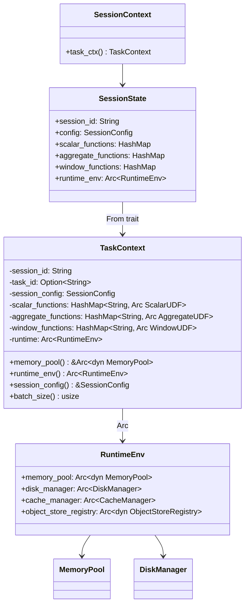
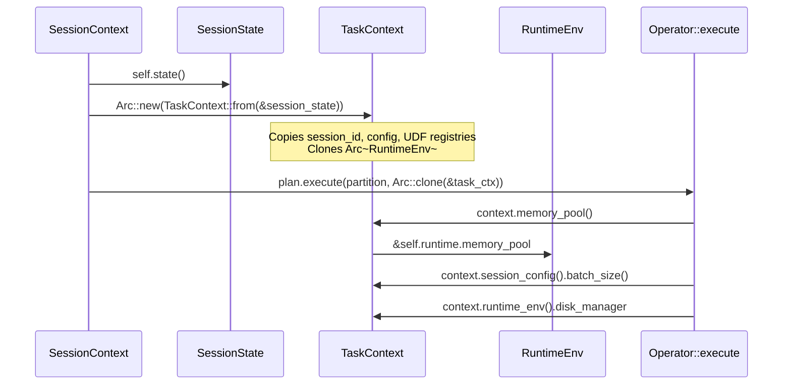

# Module Teardown: The Execution Context (`TaskContext` & Resource Wiring)

## Table of Contents

- [0. Research Focus](#0-research-focus)
- [1. High-Level Overview](#1-high-level-overview)
- [2. Structural Architecture](#2-structural-architecture)
  - [Class Diagram](#class-diagram)
- [3. Execution & Call Flow](#3-execution-call-flow)
  - [Sequence Diagram: TaskContext Wiring](#sequence-diagram-taskcontext-wiring)
  - [Construction path:](#construction-path)
  - [Key accessor methods:](#key-accessor-methods)
  - [RuntimeEnv construction via builder:](#runtimeenv-construction-via-builder)
  - [How operators access resources (real code patterns):](#how-operators-access-resources-real-code-patterns)
  - [Key SessionConfig execution options:](#key-sessionconfig-execution-options)
- [4. Concurrency & State Management](#4-concurrency-state-management)
- [5. Memory & Resource Profile](#5-memory-resource-profile)
- [6. Key Design Insights](#6-key-design-insights)


## 0. Research Focus
* **Task ID:** 2.2
* **Focus:** Trace the `TaskContext`. How is it wired up before execution begins? How does it link the `MemoryPool`, `DiskManager`, `ObjectStoreRegistry`, and session properties to the execution of a specific partition? Compare it to Trino's `DriverContext` — notice how lightweight it is, relying on Rust's call stack rather than a complex tracking tree.

## 1. High-Level Overview
* **Core Responsibility:** `TaskContext` is the per-execution environment passed into every `ExecutionPlan::execute()` call. It bundles together the session configuration, registered UDFs (scalar, aggregate, window), and the `RuntimeEnv` which provides the `MemoryPool`, `DiskManager`, and `CacheManager`. It is the single point through which operators access all execution resources.
* **Key Triggers:** Created from `SessionContext::task_ctx()` or `SessionState` before query execution begins. Shared (via `Arc`) across all partition executions within a query. Operators access it in their `execute()` method to obtain memory pools, disk managers, batch sizes, etc.

## 2. Structural Architecture
* **Primary Source Files:**
  - `datafusion/execution/src/task.rs` — `TaskContext` struct and methods
  - `datafusion/execution/src/runtime_env.rs` — `RuntimeEnv` struct (holds MemoryPool, DiskManager)
  - `datafusion/core/src/execution/session_state.rs` — `From<&SessionState> for TaskContext`
  - `datafusion/core/src/execution/context/mod.rs` — `SessionContext::task_ctx()`

* **Key Data Structures:**
  - `TaskContext` — Holds session_id, task_id, SessionConfig, UDF registries, and `Arc<RuntimeEnv>`.
  - `RuntimeEnv` — Holds `Arc<dyn MemoryPool>`, `Arc<DiskManager>`, `Arc<CacheManager>`, `Arc<dyn ObjectStoreRegistry>`.

### Class Diagram


## 3. Execution & Call Flow

### Sequence Diagram: TaskContext Wiring


### Construction path:

```rust
// session_state.rs:2130-2143
impl From<&SessionState> for TaskContext {
    fn from(state: &SessionState) -> Self {
        TaskContext::new(
            None,                           // task_id
            state.session_id.clone(),
            state.config.clone(),           // SessionConfig
            state.scalar_functions.clone(), // UDF registries
            state.aggregate_functions.clone(),
            state.window_functions.clone(),
            Arc::clone(&state.runtime_env), // Shared RuntimeEnv
        )
    }
}
```

### Key accessor methods:

```rust
// task.rs
pub fn memory_pool(&self) -> &Arc<dyn MemoryPool> {
    &self.runtime.memory_pool
}
pub fn runtime_env(&self) -> Arc<RuntimeEnv> {
    Arc::clone(&self.runtime)
}
pub fn session_config(&self) -> &SessionConfig {
    &self.session_config
}
pub fn batch_size(&self) -> usize {
    self.session_config.batch_size()
}
```

### RuntimeEnv construction via builder:

```rust
// RuntimeEnvBuilder pattern
RuntimeEnvBuilder::new()
    .with_memory_limit(max_memory, memory_fraction)  // Wraps in TrackConsumersPool<GreedyMemoryPool>
    .with_disk_manager_builder(
        DiskManagerBuilder::default()
            .with_mode(DiskManagerMode::Directories(vec![path.into()]))
            .with_max_temp_directory_size(size_bytes)
    )
    .with_metadata_cache_limit(limit_bytes)           // File statistics cache
    .with_object_list_cache_limit(limit_bytes)         // Directory listing cache
    .with_object_list_cache_ttl(Some(duration))
    .build()
```

**Default:** `RuntimeEnv::default()` creates an `UnboundedMemoryPool` (unlimited). `with_memory_limit()` creates `TrackConsumersPool<GreedyMemoryPool>` with top-5 consumer tracking for error messages.

### How operators access resources (real code patterns):

```rust
// Memory pool → MemoryReservation (SortExec, sorts/sort.rs:282-288)
let reservation = MemoryConsumer::new(format!("ExternalSorter[{partition_id}]"))
    .with_can_spill(true)
    .register(&runtime.memory_pool);

// Disk manager → SpillManager (SortExec, sorts/sort.rs:290-295)
let spill_manager = SpillManager::new(Arc::clone(&runtime), metrics, Arc::clone(&schema))
    .with_compression_type(spill_compression);

// Checking if spilling is enabled
if self.runtime.disk_manager.tmp_files_enabled() { /* spill path */ }

// Session config → execution options (SortExec, sorts/sort.rs:1269)
let execution_options = &context.session_config().options().execution;
let spill_reservation = execution_options.sort_spill_reservation_bytes;  // default 10 MB
let max_spill_file = execution_options.max_spill_file_size_bytes;        // default 128 MB
```

### Key SessionConfig execution options:

| Option | Default | Used By |
|---|---|---|
| `batch_size` | 8192 | 30+ operators — Sort, HashJoin, Aggregation, Merge, etc. |
| `target_partitions` | num_cpus() | EnforceDistribution optimizer |
| `sort_spill_reservation_bytes` | 10 MB | ExternalSorter merge phase pre-reservation |
| `max_spill_file_size_bytes` | 128 MB | SpillManager file rotation threshold |
| `coalesce_batches` | true | Reduces metadata overhead in streaming operators |
| `enforce_batch_size_in_joins` | false | Memory vs performance tradeoff in HashJoin |

## 4. Concurrency & State Management
* **Threading Model:** `TaskContext` is `Send + Sync` (all fields are either owned values or `Arc`-wrapped). A single `TaskContext` is shared via `Arc` across all partitions of a query. Each `execute()` call receives `Arc<TaskContext>`, not a unique copy.
* **No per-partition state:** `TaskContext` does not carry any partition-specific state. The partition index is a parameter to `execute()`, not a field on the context. This means all partitions of a query share the same memory pool, same config, same UDFs.
* **UDF registration:** UDF hashmaps are cloned from `SessionState` at creation time. Changes to the session's UDF registry after `TaskContext` creation are not reflected.

## 5. Memory & Resource Profile
* **Allocation Pattern:** `TaskContext` clones the UDF `HashMap`s (shallow clone — values are `Arc<UDF>`). The `RuntimeEnv` is shared via `Arc::clone`. Total overhead is modest.
* **Memory Tracking:** `TaskContext` itself is not memory-tracked. It provides the `MemoryPool` to operators via `memory_pool()`, but the pool tracks individual operator reservations, not the context.

## 6. Key Design Insights

* **`TaskContext` is a frozen snapshot.** It captures the session state at a point in time. This is intentional — a running query should not be affected by concurrent session changes (e.g., registering a new UDF mid-query).

* **Single `RuntimeEnv` per session.** The `RuntimeEnv` (and therefore the `MemoryPool`) is shared across all concurrent queries within a session. This enables global memory limits — a `GreedyMemoryPool` with a 1GB limit will enforce that limit across all queries, not per-query.

* **Operators access everything through `TaskContext`.** This is the only parameter (besides `partition`) to `execute()`. If an operator needs the batch size, it reads `context.session_config().batch_size()`. If it needs to spill to disk, it accesses `context.runtime_env().disk_manager`. This single-entry-point design simplifies the operator interface.

* **Flat context vs Trino's deep hierarchy.** Trino wires resources through a deep chain: `QueryContext` -> `TaskContext` -> `PipelineContext` -> `DriverContext` -> `OperatorContext`. DataFusion uses a single flat `TaskContext` shared across all operators. There is no per-pipeline or per-operator context — memory tracking is done at the operator level via `MemoryReservation`, which talks directly to the global `MemoryPool`. This eliminates the entire context hierarchy and its associated locking overhead.

* **`TaskContext` implements `FunctionRegistry`.** This allows operators to look up UDFs dynamically via `context.udf("my_func")`, `context.udaf(...)`, `context.udwf(...)`. New UDFs can even be registered mid-execution via `register_udf()`, though this is uncommon.

* **`CacheManager` provides two caches.** The `RuntimeEnv` holds a `CacheManager` with: (1) a file metadata cache (Parquet statistics, schema) with configurable size limit, and (2) a file list cache (directory listings from object stores) with size limit and TTL. These are process-wide caches shared across all queries, reducing repeated I/O for frequently-accessed tables.

* **Default memory pool is unbounded.** `RuntimeEnv::default()` creates an `UnboundedMemoryPool`. Production deployments must explicitly configure limits via `RuntimeEnvBuilder::with_memory_limit()`, which wraps the pool in `TrackConsumersPool<GreedyMemoryPool>` for both enforcement and diagnostic error messages showing the top memory consumers.
