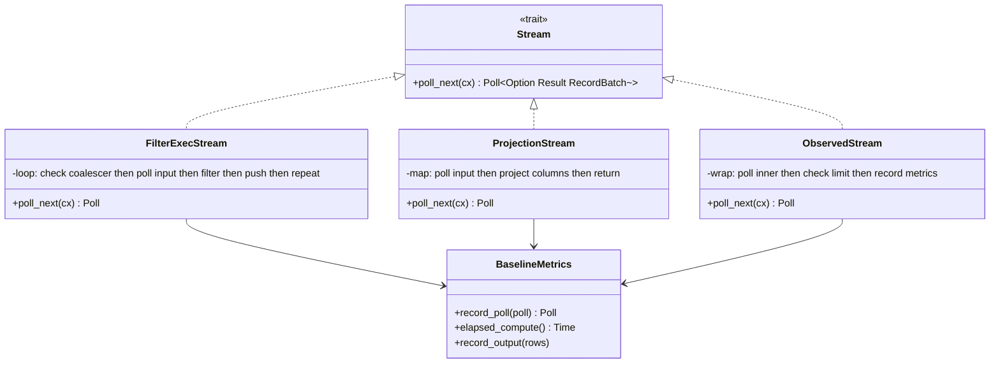
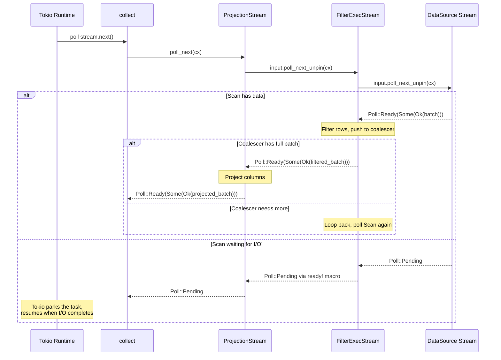

# Module Teardown: The Pull-Based Execution Loop (`poll_next`)

## Table of Contents

- [0. Research Focus](#0-research-focus)
- [1. High-Level Overview](#1-high-level-overview)
- [2. Structural Architecture](#2-structural-architecture)
  - [Class Diagram](#class-diagram)
- [3. Execution & Call Flow](#3-execution-call-flow)
  - [Sequence Diagram: A Single poll_next Cascade](#sequence-diagram-a-single-poll_next-cascade)
  - [FilterExecStream::poll_next() — The Complex Case](#filterexecstreampoll_next-the-complex-case)
  - [ProjectionStream::poll_next() — The Simple Case](#projectionstreampoll_next-the-simple-case)
  - [ObservedStream::poll_next() — Metrics + Limit Wrapper](#observedstreampoll_next-metrics-limit-wrapper)
  - [BaselineMetrics::record_poll() — The Universal Metrics Hook](#baselinemetricsrecord_poll-the-universal-metrics-hook)
  - [The `ready!` Macro — Where Tokio Gets Control](#the-ready-macro-where-tokio-gets-control)
  - [CooperativeStream — Tokio Task Budget Integration](#cooperativestream-tokio-task-budget-integration)
  - [SortPreservingMergeExec — Loser Tree K-Way Merge](#sortpreservingmergeexec-loser-tree-k-way-merge)
  - [HashJoinStream — State Machine Poll Loop](#hashjoinstream-state-machine-poll-loop)
  - [GroupedHashAggregateStream — OOM-Aware Aggregation](#groupedhashaggregatestream-oom-aware-aggregation)
  - [Contrast with Trino's Driver Loop](#contrast-with-trinos-driver-loop)
- [4. Concurrency & State Management](#4-concurrency-state-management)
- [5. Memory & Resource Profile](#5-memory-resource-profile)
- [6. Key Design Insights](#6-key-design-insights)


## 0. Research Focus
* **Task ID:** 2.3.B
* **Focus:** This is the core engine loop. Trace how `poll_next()` cascades down the stream chain. Note how the `ready!` macro bubbles up `Poll::Pending` asynchronously. Document where the stream hits `.await` points that yield control back to Tokio. Contrast with Trino's `Driver` loop manually checking `operator.needsInput()` and `operator.isBlocked()`. How does `BaselineMetrics::record_poll()` wrap every stream for observability?

## 1. High-Level Overview
* **Core Responsibility:** The pull-based execution loop is driven by the Tokio runtime polling `poll_next()` on the top-level stream. Each `poll_next()` call cascades down the stream pipeline — a consumer polls its input, which polls its input, recursively until a leaf stream (e.g., a data source) either produces a batch or returns `Poll::Pending`. The key macro is `ready!()`, which yields control back to Tokio when the upstream is not ready, and resumes execution when data becomes available.
* **Key Triggers:** Polling begins when a consumer (like `collect()`, `DataFrame::show()`, or an Arrow Flight server) starts `.await`-ing on the stream. The Tokio runtime drives the polling loop via its work-stealing scheduler.

## 2. Structural Architecture
* **Primary Source Files:**
  - `datafusion/physical-plan/src/filter.rs` — `FilterExecStream::poll_next()` (complex: loop + coalescing)
  - `datafusion/physical-plan/src/projection.rs` — `ProjectionStream::poll_next()` (simple: map-and-forward)
  - `datafusion/physical-plan/src/stream.rs` — `RecordBatchStreamAdapter`, `ObservedStream::poll_next()`
  - `datafusion/physical-expr-common/src/metrics/baseline.rs` — `BaselineMetrics::record_poll()`

* **Key Data Structures:**
  - `Poll<Option<Result<RecordBatch>>>` — The return type of every `poll_next()`. Three states: `Ready(Some(Ok(batch)))` (data), `Ready(Some(Err(e)))` (error), `Ready(None)` (EOF), `Pending` (not ready, will wake when available).
  - `BaselineMetrics` — Wraps around every stream's output to record rows, bytes, batches, and compute time.
  - `LimitedBatchCoalescer` — Used by Filter to accumulate small output batches into target-sized batches before emitting.

### Class Diagram


## 3. Execution & Call Flow

### Sequence Diagram: A Single poll_next Cascade


### FilterExecStream::poll_next() — The Complex Case

This is the most instructive `poll_next` implementation because it demonstrates the internal loop pattern:

```rust
// filter.rs:896-976
impl Stream for FilterExecStream {
    type Item = Result<RecordBatch>;

    fn poll_next(
        mut self: Pin<&mut Self>,
        cx: &mut Context<'_>,
    ) -> Poll<Option<Self::Item>> {
        let elapsed_compute = self.metrics.baseline_metrics.elapsed_compute().clone();
        loop {
            // 1. Check if the coalescer has a completed batch ready
            if let Some(batch) = self.batch_coalescer.next_completed_batch() {
                self.metrics.selectivity.add_part(batch.num_rows());
                let poll = Poll::Ready(Some(Ok(batch)));
                return self.metrics.baseline_metrics.record_poll(poll);
            }

            // 2. Check if we're completely done
            if self.batch_coalescer.is_finished() {
                return Poll::Ready(None);
            }

            // 3. Poll upstream — THIS IS THE YIELD POINT
            match ready!(self.input.poll_next_unpin(cx)) {
                // 4a. Input exhausted → flush the coalescer
                None => {
                    self.batch_coalescer.finish()?;
                    // Loop back to drain remaining batches from coalescer
                }
                // 4b. Got a batch → filter it
                Some(Ok(batch)) => {
                    let timer = elapsed_compute.timer();
                    let status = self.predicate.as_ref()
                        .evaluate(&batch)
                        .and_then(|v| v.into_array(batch.num_rows()))
                        .and_then(|(array, batch)| {
                            let filter_array = as_boolean_array(&array)?;
                            self.metrics.selectivity.add_total(batch.num_rows());
                            let batch = filter_record_batch(&batch, filter_array)?;
                            self.batch_coalescer.push_batch(batch)
                        })?;
                    timer.done();

                    match status {
                        PushBatchStatus::Continue => {
                            // Loop back — coalescer may not have a full batch yet
                        }
                        PushBatchStatus::LimitReached => {
                            self.batch_coalescer.finish()?;
                            // Loop back to drain the coalescer
                        }
                    }
                }
                // 4c. Error → propagate immediately
                other => return Poll::Ready(other),
            }
        }
    }
}
```

**The yield point** is `ready!(self.input.poll_next_unpin(cx))` on line 919. The `ready!` macro expands to:

```rust
match self.input.poll_next_unpin(cx) {
    Poll::Ready(val) => val,
    Poll::Pending => return Poll::Pending,  // ← yields to Tokio
}
```

When upstream returns `Pending`, the entire `poll_next` returns `Pending`, and Tokio parks the task. The task will be woken by the `Waker` stored in the `Context` (`cx`) when the underlying I/O or channel operation completes.

**Why the loop?** Filtering can produce empty batches (all rows filtered out) or small batches. The `LimitedBatchCoalescer` accumulates these until it has a target-sized batch. The loop keeps pulling from upstream until either a full batch is ready or upstream is exhausted.

### ProjectionStream::poll_next() — The Simple Case

```rust
// projection.rs:542-555
impl Stream for ProjectionStream {
    type Item = Result<RecordBatch>;

    fn poll_next(
        mut self: Pin<&mut Self>,
        cx: &mut Context<'_>,
    ) -> Poll<Option<Self::Item>> {
        let poll = self.input.poll_next_unpin(cx).map(|x| match x {
            Some(Ok(batch)) => Some(self.batch_project(&batch)),
            other => other,
        });

        self.baseline_metrics.record_poll(poll)
    }
}
```

This is the simplest possible pattern: poll upstream, transform the result, record metrics. No loop, no buffering. The yield point is `self.input.poll_next_unpin(cx)` — if upstream returns `Pending`, the entire `map()` returns `Pending`.

```rust
// projection.rs:528-532
fn batch_project(&self, batch: &RecordBatch) -> Result<RecordBatch> {
    let _timer = self.baseline_metrics.elapsed_compute().timer();
    self.projector.project_batch(batch)
}
```

The `_timer` records CPU time via RAII — it starts when created and records elapsed time when dropped at the end of the function.

### ObservedStream::poll_next() — Metrics + Limit Wrapper

```rust
// stream.rs:557-570
impl Stream for ObservedStream {
    type Item = Result<RecordBatch>;

    fn poll_next(
        mut self: Pin<&mut Self>,
        cx: &mut Context<'_>,
    ) -> Poll<Option<Self::Item>> {
        let mut poll = self.inner.poll_next_unpin(cx);
        if self.fetch.is_some() {
            poll = self.limit_reached(poll);
        }
        self.baseline_metrics.record_poll(poll)
    }
}
```

`ObservedStream` adds two concerns: fetch limit enforcement and metrics recording. It wraps any `SendableRecordBatchStream` and intercepts its output.

### BaselineMetrics::record_poll() — The Universal Metrics Hook

```rust
// baseline.rs:213-231
pub fn record_poll(
    &self,
    poll: Poll<Option<Result<RecordBatch>>>,
) -> Poll<Option<Result<RecordBatch>>> {
    if let Poll::Ready(maybe_batch) = &poll {
        match maybe_batch {
            Some(Ok(batch)) => {
                batch.record_output(self);
            }
            Some(Err(_)) => self.done(),
            None => self.done(),
        }
    }
    poll
}
```

This intercepts every `poll_next` result:
- **`Some(Ok(batch))`** — Increments `output_rows`, `output_bytes`, `output_batches` counters.
- **`Some(Err(_))`** — Calls `done()` to record the end timestamp.
- **`None`** — Calls `done()` to record the end timestamp.
- **`Pending`** — Does nothing (not a `Ready` value).

The `record_output` on `RecordBatch`:

```rust
// baseline.rs:315-376
impl RecordOutput for RecordBatch {
    fn record_output(self, bm: &BaselineMetrics) -> Self {
        bm.record_output(self.num_rows());
        let n_bytes = get_record_batch_memory_size(&self);
        bm.output_bytes.add(n_bytes);
        bm.output_batches.add(1);
        self
    }
}
```

### The `ready!` Macro — Where Tokio Gets Control

The `ready!` macro (from `std::task::ready` / `futures::ready`) is the mechanism by which the Tokio runtime regains control:

```rust
// Conceptual expansion of: let batch = ready!(self.input.poll_next_unpin(cx));
let batch = match self.input.poll_next_unpin(cx) {
    Poll::Ready(val) => val,
    Poll::Pending => return Poll::Pending,  // Return to Tokio's event loop
};
```

When `Poll::Pending` is returned up the entire call stack, Tokio parks the current task and moves on to poll other ready tasks. The task is woken by the `Waker` stored in the `Context` (`cx`) when the underlying I/O or channel operation completes.

**Common yield points across operators:**
| Operator | Yield Point | Trigger |
|---|---|---|
| FilterExecStream | `ready!(self.input.poll_next_unpin(cx))` | Upstream not ready |
| ProjectionStream | `self.input.poll_next_unpin(cx)` (via `.map()`) | Upstream not ready |
| RecordBatchReceiverStream | `ready!(self.rx.poll_recv(cx))` | Channel empty |
| SortExec stream | `ready!(self.input.poll_next_unpin(cx))` inside `try_flatten` | Input not ready |
| CoalescePartitions | `ready!(self.inner.poll_next_unpin(cx))` | Merged stream not ready |

### CooperativeStream — Tokio Task Budget Integration

`CooperativeStream` (in `coop.rs`) is a critical wrapper that prevents long-running streams from starving other Tokio tasks. It wraps any `RecordBatchStream` and consumes Tokio's cooperative scheduling budget for each batch produced.

```rust
// coop.rs:102-213
pub struct CooperativeStream<T: RecordBatchStream + Unpin> {
    inner: T,
    budget: u8,  // Tracks remaining budget (per_stream mode)
}

const YIELD_FREQUENCY: u8 = 128;  // Matches Tokio's internal budget
```

**Three compile-time operating modes:**
1. **`tokio` mode (default):** Uses `tokio::task::coop::poll_proceed(cx)` before polling the inner stream, and calls `coop.made_progress()` after producing a batch.
2. **`tokio_fallback` mode:** Uses `has_budget_remaining()` + `consume_budget()` for older Tokio versions.
3. **`per_stream` mode:** Manual counter — decrements per batch, resets to 128 when exhausted, yields via `Poll::Pending` + waker.

**How it integrates:** The `EnsureCooperative` physical optimizer rule automatically inserts `CooperativeExec` wrappers around non-cooperative leaf and exchange nodes:

```rust
// ensure_coop.rs:88-116
let is_cooperative = props.scheduling_type == SchedulingType::Cooperative;
let is_leaf = plan.children().is_empty();
let is_exchange = props.evaluation_type == EvaluationType::Eager;

if (is_leaf || is_exchange) && !is_cooperative {
    return Ok(Transformed::yes(Arc::new(CooperativeExec::new(plan))));
}
```

Operators that declare `SchedulingType::Cooperative` (file scans, RepartitionExec, CoalescePartitionsExec, MemoryExec) consume budget themselves. Non-cooperative operators are automatically wrapped. This ensures every stream path in the plan cooperates with Tokio's scheduler, enabling timely query cancellation and fair scheduling.

### SortPreservingMergeExec — Loser Tree K-Way Merge

For merging N sorted streams, DataFusion uses a tournament loser tree (O(log N) comparisons per element):

```rust
// sorts/merge.rs
pub struct SortPreservingMergeStream<C: CursorValues> {
    loser_tree: Vec<usize>,      // Tournament tree: node 0 = winner, nodes 1..N = losers
    cursors: Vec<Option<Cursor<C>>>,  // One cursor per input stream
    in_progress: BatchBuilder,        // Accumulates output batch
}
```

The tree structure: node 0 holds the current minimum (winner), nodes 1..N form a binary tree where each internal node stores the loser of the comparison at that level. To advance, only the path from the winner's leaf to the root needs updating — O(log N) comparisons.

A **round-robin tie-breaker** prevents upstream buffer overflow when multiple streams have identical values: it tracks poll counts per stream and favors the least-polled stream, balancing consumption across inputs.

### HashJoinStream — State Machine Poll Loop

```rust
// joins/hash_join/stream.rs:426-469
fn poll_next_impl(&mut self, cx: &mut Context<'_>) -> Poll<Option<Result<RecordBatch>>> {
    loop {
        if let Some(batch) = self.output_buffer.next_completed_batch() {
            return self.join_metrics.baseline.record_poll(Poll::Ready(Some(Ok(batch))));
        }
        return match self.state {
            WaitBuildSide => handle_state!(ready!(self.collect_build_side(cx))),
            FetchProbeBatch => handle_state!(ready!(self.fetch_probe_batch(cx))),
            ProcessProbeBatch(_) => handle_state!(self.process_probe_batch()),
            ExhaustedProbeSide => handle_state!(self.process_unmatched_build_side()),
            Completed => Poll::Ready(None),
        };
    }
}
```

States: `WaitBuildSide` (polls build-side `OnceFut`) -> `FetchProbeBatch` (polls probe stream) -> `ProcessProbeBatch` (synchronous probing) -> `ExhaustedProbeSide` (emit unmatched left rows for outer joins) -> `Completed`. The build side is collected into memory before any probe-side polling begins.

### GroupedHashAggregateStream — OOM-Aware Aggregation

The aggregate operator supports three OOM modes:

```rust
// aggregates/row_hash.rs:569-588
let oom_mode = match (agg.mode, &group_ordering) {
    (AggregateMode::Partial, _) => OutOfMemoryMode::EmitEarly,     // Emit partial results
    (_, GroupOrdering::None | GroupOrdering::Partial(_))
        if disk_manager.tmp_files_enabled() => OutOfMemoryMode::Spill,  // Spill to disk
    (_, GroupOrdering::Full) => OutOfMemoryMode::ReportError,      // Can't spill ordered input
};
```

Its poll loop includes a **skip aggregation probe**: it monitors the ratio of `num_groups / input_rows` and switches to pass-through mode if the ratio exceeds a threshold (aggregation is providing no benefit). It also supports **ordered group emission** — for inputs sorted by group keys, it emits complete groups incrementally without waiting for all input.

### Contrast with Trino's Driver Loop

Trino's `Driver` implements a manual state machine:
```java
// Trino: Driver.processInternal()
while (!done) {
    ListenableFuture<?> blocked = processFor(SPLIT_RUN_QUANTA); // 1 second
    if (!blocked.isDone()) { return blocked; } // Yield to scheduler
    updateDriverBlockedFuture(blocked);
}
```

DataFusion replaces this with:
1. **No explicit loop** — Tokio drives polling automatically.
2. **No time quanta** — The `ready!()` macro yields at natural I/O boundaries, not after a fixed time.
3. **No `needsInput()`/`isBlocked()` checks** — The `Poll::Pending`/`Poll::Ready` protocol encodes blocking state directly in the return type.

## 4. Concurrency & State Management
* **Threading Model:** A single `poll_next()` call executes synchronously on the Tokio worker thread that picks up the task. There is no parallelism within a single poll — the cascade from consumer to leaf is a synchronous depth-first traversal. Parallelism comes from multiple partition streams being polled concurrently by different Tokio worker threads.
* **No preemption within a poll.** Once `poll_next()` starts executing (after receiving a `Ready` from upstream), it runs to completion without interruption. The compute-intensive work (predicate evaluation, column projection, hashing) happens inline. If an operator takes too long in a single poll, it blocks the Tokio worker thread. This is why DataFusion processes data in batches — the batch size bounds the maximum work per poll.
* **Waker propagation.** When an operator returns `Pending`, it's because it called `ready!()` on upstream, which stored the waker from `cx`. When data becomes available (e.g., an I/O read completes, or a channel send occurs), the waker is triggered, and Tokio re-schedules the task for polling.

## 5. Memory & Resource Profile
* **Allocation Pattern:** Each `poll_next()` call may allocate a new `RecordBatch` for its output (e.g., `filter_record_batch` creates a new batch with filtered rows). These per-batch allocations are not tracked by the `MemoryPool` for streaming operators — they are considered transient. Memory tracking is reserved for operators that accumulate state across batches (sorts, aggregates, joins).
* **Compute time tracking:** `BaselineMetrics` uses `elapsed_compute` (a `Time` metric) to measure CPU time spent in the operator's computation. This is recorded via RAII timers that start/stop around the compute section. The `record_poll` wrapper also records output metrics (rows, bytes, batches) for every emitted batch.

## 6. Key Design Insights

* **The loop in FilterExecStream vs the single-shot in ProjectionStream reveals the fundamental distinction.** Filter may consume multiple input batches before producing one output batch (because filtering can eliminate all rows). Projection always produces exactly one output batch per input batch. The loop pattern is used by any operator that may need to "amplify" or "reduce" the batch count.

* **`poll_next()` is not `async`.** This is deliberate. The `Stream` trait uses `poll_next(cx: &mut Context)` rather than `async fn next()`. This gives operators precise control over when they yield and what state they preserve between yields. The `cx` carries the waker, which is the mechanism by which the Tokio runtime knows when to re-poll the task.

* **Batch size bounds per-poll compute.** The `batch_size` configuration (default 8192 rows) controls how much work each `poll_next` does. A larger batch size means more computation per poll (better throughput, less polling overhead) but longer blocking of the Tokio worker thread. This is the fundamental tuning knob for balancing throughput vs latency.

* **The `record_poll` wrapper is applied at the boundary.** It wraps the final `Poll` value just before returning, ensuring that metrics capture exactly what the consumer sees — not internal intermediate states. This is why metrics are accurate even when the operator has an internal loop.

* **Channel-based streams have a different yield pattern.** Operators like `RecordBatchReceiverStream` yield on `rx.poll_recv(cx)` (a Tokio channel receive). This is fundamentally different from the recursive-poll pattern — the channel decouples the producer and consumer into independent Tokio tasks, enabling pipeline parallelism. The producer fills the channel buffer while the consumer processes the previous batch.

* **`CooperativeStream` is the Tokio fairness mechanism.** Without it, a CPU-intensive operator (e.g., a complex aggregation) could monopolize a Tokio worker thread for the duration of a batch. `CooperativeStream` consumes Tokio's task budget per batch, allowing the scheduler to interleave other tasks. The `EnsureCooperative` optimizer automatically inserts these wrappers, making cooperation transparent to operator implementations.

* **Complex operators use state machines instead of simple loops.** HashJoinStream has 5 states, GroupedHashAggregateStream has 4. Each `poll_next()` checks the current state and either advances synchronously or yields via `ready!()`. This pattern enables operators with multiple phases (build + probe, accumulate + emit) to suspend and resume across async boundaries.

* **SortPreservingMerge uses a loser tree for O(log N) merges.** Rather than a naive O(N) min-scan across N inputs, the loser tree tournament maintains a binary tree where only the path from the consumed element's leaf to the root needs updating. The round-robin tie-breaker prevents pathological cases where one input is polled far more than others.
