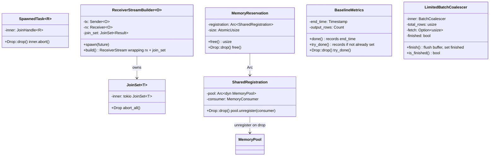
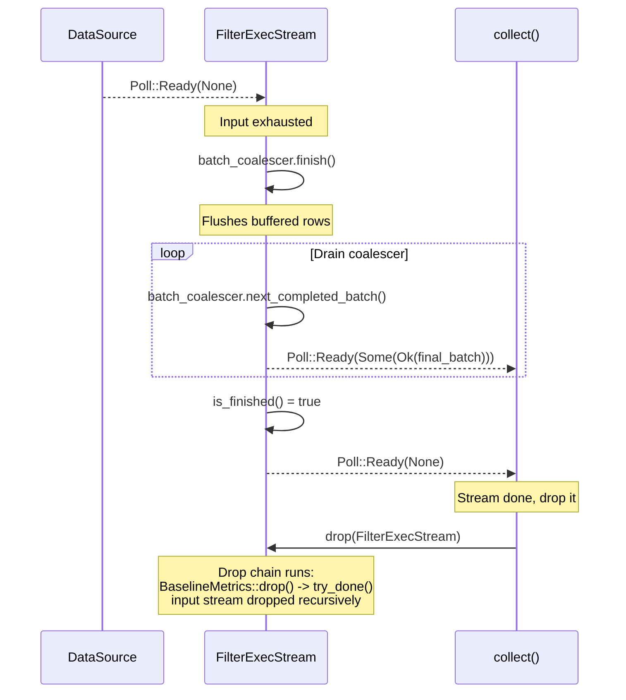
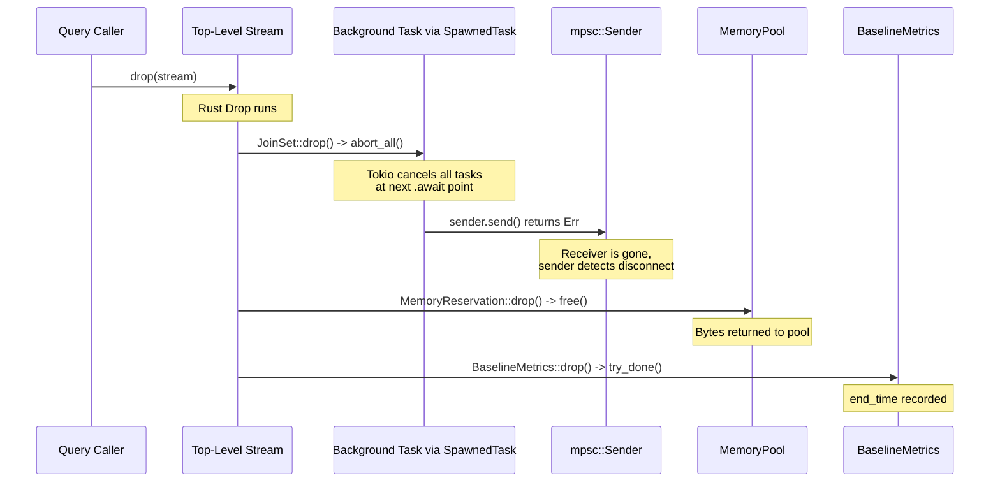
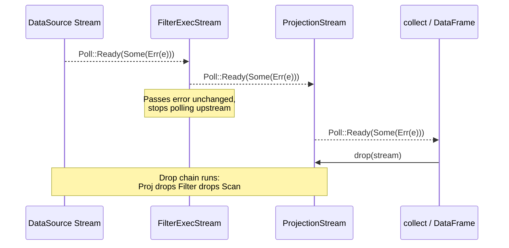

# Module Teardown: Stream Termination & Cancellation

## Table of Contents

- [0. Research Focus](#0-research-focus)
- [1. High-Level Overview](#1-high-level-overview)
- [2. Structural Architecture](#2-structural-architecture)
  - [Class Diagram](#class-diagram)
- [3. Execution & Call Flow](#3-execution-call-flow)
  - [Path 1: Natural Stream Termination](#path-1-natural-stream-termination)
  - [Path 2: Drop-Based Cancellation](#path-2-drop-based-cancellation)
  - [Path 3: Error Propagation](#path-3-error-propagation)
  - [Path 4: LIMIT-Triggered Cancellation via ObservedStream](#path-4-limit-triggered-cancellation-via-observedstream)
  - [Panic Handling in collect_partitioned](#panic-handling-in-collect_partitioned)
  - [RAII Cleanup: Memory Release](#raii-cleanup-memory-release)
  - [RAII Cleanup: Consumer Unregistration](#raii-cleanup-consumer-unregistration)
  - [RAII Cleanup: Metrics Finalization](#raii-cleanup-metrics-finalization)
  - [HashJoin Build-Side Cancellation](#hashjoin-build-side-cancellation)
  - [ExternalSorter: Spill File + Memory Cleanup](#externalsorter-spill-file-memory-cleanup)
  - [Spill File Cleanup via `RefCountedTempFile`](#spill-file-cleanup-via-refcountedtempfile)
- [4. Concurrency & State Management](#4-concurrency-state-management)
- [5. Memory & Resource Profile](#5-memory-resource-profile)
- [6. Key Design Insights](#6-key-design-insights)
  - [Cleanup Path Comparison](#cleanup-path-comparison)


## 0. Research Focus
* **Task ID:** 2.3.C
* **Focus:** Two shutdown paths: normal completion and cancellation. For normal completion, trace the path when `poll_next()` returns `Poll::Ready(None)` — how do `MemoryReservation` drops automatically release memory back to the pool? For cancellation, trace the drop-based protocol: how does `SpawnedTask`'s abort-on-drop guarantee cleanup? How do channel closures propagate shutdown to background tasks? Contrast with Trino's explicit `CANCELING -> CANCELED` state machine and `DriverAndTaskTerminationTracker`.

## 1. High-Level Overview
* **Core Responsibility:** Stream termination in DataFusion follows two paths: natural completion (upstream returns `None`, meaning no more data) and cancellation (stream dropped due to query abort, limit reached, or error). In both cases, Rust's RAII guarantees drive the cleanup: `MemoryReservation::drop()` frees bytes back to the pool, `BaselineMetrics::drop()` finalizes timing, background tasks are aborted via `JoinSet::drop()`, and spill files are cleaned up by `SpillManager`. The cleanup is automatic, deterministic, and happens in reverse order of construction.
* **Key Triggers:** (1) Natural EOF: the leaf data source has no more rows. (2) Fetch limit: `ObservedStream` or `LimitedBatchCoalescer` detects the row limit is reached. (3) Error: an operator returns `Err(...)`, causing the consumer to drop the stream. (4) Cancellation: the top-level future/stream is dropped.

## 2. Structural Architecture
* **Primary Source Files:**
  - `datafusion/common-runtime/src/common.rs` — `SpawnedTask` abort-on-drop
  - `datafusion/common-runtime/src/join_set.rs` — `JoinSet` abort-all-on-drop
  - `datafusion/physical-plan/src/stream.rs` — `ReceiverStreamBuilder`, `ObservedStream` limit handling
  - `datafusion/physical-plan/src/filter.rs` — `FilterExecStream` termination (coalescer flush + EOF)
  - `datafusion/physical-plan/src/coalesce/mod.rs` — `LimitedBatchCoalescer` (limit + finish logic)
  - `datafusion/physical-plan/src/coalesce_partitions.rs` — Multi-partition cancellation
  - `datafusion/physical-plan/src/common.rs` — `spawn_buffered()` sender disconnect
  - `datafusion/physical-plan/src/execution_plan.rs` — `collect_partitioned()` panic handling
  - `datafusion/physical-expr-common/src/metrics/baseline.rs` — `BaselineMetrics::drop()` (metrics finalization)
  - `datafusion/execution/src/memory_pool/mod.rs` — `MemoryReservation::drop()` (memory release)
  - `datafusion/physical-plan/src/sorts/sort.rs` — `ExternalSorter` (spill file + memory cleanup)

* **Key Data Structures:**
  - `SpawnedTask<R>` — Wraps `JoinHandle<R>`, aborts on drop.
  - `JoinSet<T>` — Wraps `tokio::task::JoinSet<T>`, aborts all on drop.
  - `ReceiverStreamBuilder<O>` — Holds a `JoinSet` + `mpsc::Receiver`. When the receiver stream is dropped, the `JoinSet` is dropped, aborting all producer tasks.
  - `MemoryReservation` — RAII handle; `drop()` calls `free()` which calls `pool.shrink()`.
  - `BaselineMetrics` — RAII handle; `drop()` calls `try_done()` which records `end_time`.
  - `LimitedBatchCoalescer` — Buffers small batches; `finish()` flushes the buffer and marks finished.

### Class Diagram


## 3. Execution & Call Flow

### Path 1: Natural Stream Termination

#### Sequence Diagram: Natural EOF


#### FilterExecStream Termination Path

When the upstream data source has no more rows, FilterExecStream goes through a multi-step flush:

```rust
// filter.rs:896-976 — Termination-relevant paths
fn poll_next(mut self: Pin<&mut Self>, cx: &mut Context<'_>) -> Poll<Option<Self::Item>> {
    loop {
        // Step 1: Drain any completed batches from the coalescer
        if let Some(batch) = self.batch_coalescer.next_completed_batch() {
            self.metrics.selectivity.add_part(batch.num_rows());
            let poll = Poll::Ready(Some(Ok(batch)));
            return self.metrics.baseline_metrics.record_poll(poll);
        }

        // Step 2: If coalescer is finished and drained, signal EOF
        if self.batch_coalescer.is_finished() {
            return Poll::Ready(None);
        }

        // Step 3: Poll upstream
        match ready!(self.input.poll_next_unpin(cx)) {
            None => {
                // Upstream done → flush buffered rows
                self.batch_coalescer.finish()?;
                // Loop back to step 1 to drain the flushed batch
            }
            Some(Ok(batch)) => { /* filter and push to coalescer */ }
            other => return Poll::Ready(other),
        }
    }
}
```

The termination sequence is:
1. Upstream returns `None` -> `finish()` flushes the coalescer buffer.
2. Loop back -> `next_completed_batch()` returns the flushed batch -> emit it.
3. Loop back -> `next_completed_batch()` returns `None`, `is_finished()` returns `true` -> return `Poll::Ready(None)`.

#### LimitedBatchCoalescer: The Flush Mechanism

```rust
// coalesce/mod.rs
impl LimitedBatchCoalescer {
    pub fn finish(&mut self) -> Result<()> {
        self.inner.finish_buffered_batch()?;
        self.finished = true;
        Ok(())
    }

    pub fn is_finished(&self) -> bool {
        self.finished && self.inner.next_completed_batch().is_none()
    }

    pub fn push_batch(&mut self, batch: RecordBatch) -> Result<PushBatchStatus> {
        // If fetch limit reached, slice the batch
        if let Some(fetch) = self.fetch {
            if self.total_rows + batch.num_rows() >= fetch {
                let remaining_rows = fetch - self.total_rows;
                let batch_head = batch.slice(0, remaining_rows);
                self.total_rows += batch_head.num_rows();
                self.inner.push_batch(batch_head)?;
                return Ok(PushBatchStatus::LimitReached);
            }
        }
        self.total_rows += batch.num_rows();
        self.inner.push_batch(batch)?;
        Ok(PushBatchStatus::Continue)
    }
}
```

When `PushBatchStatus::LimitReached` is returned, FilterExecStream calls `finish()` to flush the remaining buffer, then drains it — same as the natural EOF path.

### Path 2: Drop-Based Cancellation

#### Sequence Diagram: Drop-Based Cancellation Chain


#### The Drop-Based Abort Mechanism

The foundation is `SpawnedTask`'s `Drop` impl, which aborts the background task:

```rust
// common.rs:89-93
impl<R> Drop for SpawnedTask<R> {
    fn drop(&mut self) {
        self.inner.abort();
    }
}
```

And `JoinSet`'s wrapper which aborts all tasks:

```rust
// join_set.rs — Drop impl
impl<T: 'static> Drop for JoinSet<T> {
    fn drop(&mut self) {
        self.inner.abort_all();
    }
}
```

#### ReceiverStreamBuilder: Channel-Based Cleanup

Producer tasks detect the disconnect and exit gracefully:

```rust
// common.rs:107-112 — spawn_buffered producer task
builder.spawn(async move {
    while let Some(item) = input.next().await {
        if sender.send(item).await.is_err() {
            return Ok(());  // Receiver dropped → stop
        }
    }
    Ok(())
});
```

#### CoalescePartitionsExec: Multi-Partition Cancellation

`CoalescePartitionsExec` merges N input partitions into a single output stream. It spawns one task per partition, all writing to a shared channel:

```rust
// coalesce_partitions.rs
for part_i in 0..input_partitions {
    builder.run_input(Arc::clone(&self.input), part_i, Arc::clone(&context));
}
let stream = builder.build();
```

When the merged stream is dropped, all N partition tasks are cancelled simultaneously via the `JoinSet`. DataFusion includes a test (`test_drop_cancel`) that verifies this:

```rust
// coalesce_partitions.rs — test
assert_is_pending(&mut fut);   // Tasks are running
drop(fut);                      // Drop the future
assert_strong_count_converges_to_zero(refs);  // All tasks cancelled
```

### Path 3: Error Propagation

#### Sequence Diagram: Error Propagation Through Stream Pipeline


Operators follow a consistent pattern — errors stop processing immediately and are passed through unchanged:

```rust
// filter.rs:919-924 — FilterExecStream::poll_next
match ready!(self.input.poll_next_unpin(cx)) {
    None => { self.batch_coalescer.finish()?; }
    Some(Ok(batch)) => { /* process batch */ }
    other => return Poll::Ready(other),  // Error passthrough
}
```

```rust
// projection.rs:549-553 — ProjectionStream::poll_next
let poll = self.input.poll_next_unpin(cx).map(|x| match x {
    Some(Ok(batch)) => Some(self.batch_project(&batch)),
    other => other,  // Error passthrough
});
```

The `ExecutionPlan` documentation explicitly mandates this behavior:

> "ExecutionPlan implementations in DataFusion **cancel additional work immediately once an error occurs**. The rationale is that if the overall query will return an error, any additional work such as continued polling of inputs will be wasted."

### Path 4: LIMIT-Triggered Cancellation via ObservedStream

`ObservedStream` wraps a stream with a fetch limit. When the limit is reached, it returns `Poll::Ready(None)`, which signals EOF and triggers the consumer to drop the stream:

```rust
// stream.rs:508-540
fn limit_reached(
    &mut self,
    poll: Poll<Option<Result<RecordBatch>>>,
) -> Poll<Option<Result<RecordBatch>>> {
    // Already past limit
    if self.produced >= fetch {
        return Poll::Ready(None);
    }
    // Batch would exceed limit — slice it
    if let Poll::Ready(Some(Ok(batch))) = &poll {
        if self.produced + batch.num_rows() > fetch {
            let batch = batch.slice(0, fetch - self.produced);
            self.produced += batch.num_rows();
            return Poll::Ready(Some(Ok(batch)));
        }
    }
    poll
}
```

### Panic Handling in collect_partitioned

When multiple partitions run as separate Tokio tasks (via `JoinSet`), a panic in one task is caught and resumed on the calling thread:

```rust
// execution_plan.rs:1355-1365
while let Some(result) = join_set.join_next().await {
    match result {
        Ok((idx, res)) => batches.push((idx, res?)),
        Err(e) => {
            if e.is_panic() {
                std::panic::resume_unwind(e.into_panic());
            } else {
                unreachable!();
            }
        }
    }
}
```

When the panic is resumed, the remaining `JoinSet` is dropped (it's a local variable), which aborts all other partition tasks. This ensures a panic in partition 3 doesn't leave partitions 0, 1, 2 running indefinitely.

The `ReceiverStreamBuilder` has similar logic:

```rust
// stream.rs — ReceiverStreamBuilder poll logic
while let Some(result) = ready!(self.join_set.poll_join_next(cx)) {
    match result {
        Ok(Ok(())) => continue,
        Ok(Err(e)) => return Poll::Ready(Some(Err(e))),
        Err(e) => {
            if e.is_panic() {
                std::panic::resume_unwind(e.into_panic());
            }
            // else: task was cancelled, which is expected
        }
    }
}
```

### RAII Cleanup: Memory Release

```rust
// memory_pool/mod.rs
impl Drop for MemoryReservation {
    fn drop(&mut self) {
        self.free();
    }
}

pub fn free(&self) -> usize {
    let size = self.size.swap(0, atomic::Ordering::Relaxed);
    if size != 0 {
        self.registration.pool.shrink(self, size);
    }
    size
}
```

This is unconditional — whether the stream ends naturally, via error, or via cancellation, the memory is returned to the pool. The `swap(0, Relaxed)` ensures idempotency: calling `free()` twice is safe.

### RAII Cleanup: Consumer Unregistration

```rust
// memory_pool/mod.rs
impl Drop for SharedRegistration {
    fn drop(&mut self) {
        self.pool.unregister(&self.consumer);
    }
}
```

The `SharedRegistration` is wrapped in `Arc`. The `unregister` call only runs when the last `Arc` reference is dropped. For operators using `split()` (which creates a new `MemoryReservation` sharing the same `SharedRegistration`), the consumer stays registered until all split reservations are dropped.

### RAII Cleanup: Metrics Finalization

```rust
// baseline.rs:234-238
impl Drop for BaselineMetrics {
    fn drop(&mut self) {
        self.try_done()
    }
}

pub fn try_done(&self) {
    if self.end_time.value().is_none() {
        self.end_time.record();
    }
}
```

The `try_done()` only records if `done()` hasn't been called yet. In the normal path, `record_poll()` calls `done()` when it sees `None` or `Err`. The `Drop` impl is a safety net for cancellation.

### HashJoin Build-Side Cancellation

When a `HashJoinStream` is dropped mid-build (during `WaitBuildSide` state):

1. The `OnceFut<JoinLeftData>` is dropped — it wraps the build future in `futures::future::Shared`, so dropping the last clone drops the future.
2. `JoinLeftData` holds `_reservation: MemoryReservation` — a guard field kept explicitly for RAII cleanup.
3. When `_reservation` is dropped, `MemoryReservation::drop()` calls `free()`, returning all build-side memory to the pool.
4. The hash table (`Arc<Map>`) is freed when the last `Arc` clone is dropped.
5. No explicit `Drop` implementation — relies entirely on implicit field drops.

DataFusion includes `test_drop_cancel` for sort that confirms:
```rust
assert_is_pending(&mut fut);   // Tasks are running
drop(fut);                      // Drop the future mid-execution
assert_eq!(task_ctx.runtime_env().memory_pool.reserved(), 0,
    "The sort should have returned all memory used back to the memory manager");
```

### ExternalSorter: Spill File + Memory Cleanup

The sort operator has the most complex cleanup due to spill files and dual memory reservations:

```rust
// sorts/sort.rs — ExternalSorter fields
struct ExternalSorter {
    in_mem_batches: Vec<RecordBatch>,
    in_progress_spill_file: Option<(InProgressSpillFile, usize)>,
    finished_spill_files: Vec<SortedSpillFile>,
    reservation: MemoryReservation,       // Spillable main reservation
    merge_reservation: MemoryReservation, // Non-spillable merge headroom
    spill_manager: SpillManager,
}
```

On termination:
1. `reservation.drop()` -> frees main buffer memory back to pool.
2. `merge_reservation.drop()` -> frees merge headroom back to pool.
3. `in_mem_batches` dropped -> `RecordBatch` reference counts decremented, Arrow buffers freed.
4. `SpillManager` handles temp file cleanup.

In the non-spill path, merge memory is explicitly freed early:

```rust
// sorts/sort.rs
async fn sort(&mut self) -> Result<SendableRecordBatchStream> {
    if self.spilled_before() {
        // Spill path: transfer merge reservation to the merge stream
        StreamingMergeBuilder::new()
            .with_reservation(self.merge_reservation.take())
            .build()
    } else {
        // Non-spill path: free merge memory early
        self.merge_reservation.free();
        self.in_mem_sort_stream(self.metrics.baseline.clone())
    }
}
```

The `take()` method atomically transfers the reserved bytes to a new `MemoryReservation` without releasing them back to the pool — preventing other operators from racing to claim that memory.

### Spill File Cleanup via `RefCountedTempFile`

Spill files are managed by `RefCountedTempFile` (in `disk_manager.rs`), which provides guaranteed cleanup:

```rust
// disk_manager.rs:442-457
impl Drop for RefCountedTempFile {
    fn drop(&mut self) {
        if Arc::strong_count(&self.tempfile) == 1 {
            let current_usage = self.current_file_disk_usage.load(Ordering::Relaxed);
            self.disk_manager
                .used_disk_space
                .fetch_sub(current_usage, Ordering::Relaxed);
            self.disk_manager
                .active_files_count
                .fetch_sub(1, Ordering::Relaxed);
        }
    }
}
```

When the last reference to a temp file is dropped: (1) disk usage counter is decremented, (2) active file count is decremented, (3) the underlying `NamedTempFile` (from the `tempfile` crate) automatically deletes the file. This means spill files are always cleaned up, even if the operator is cancelled mid-spill. The only caveat is that spill metrics (`spill_file_count`, `spilled_bytes`) may be inaccurate if the stream is dropped mid-write — but the files themselves are always deleted.

## 4. Concurrency & State Management
* **Threading Model:** Drop runs on whichever thread last held the stream. For streams polled by a Tokio task, this is the Tokio worker thread where the task was last scheduled. Cancellation is thread-safe because `JoinHandle::abort()` is safe to call from any thread, and `mpsc::Sender::send()` returns `Err` when the receiver is dropped.
* **No explicit cancellation tokens:** DataFusion does NOT use `tokio::sync::CancellationToken` or similar patterns. The entire cancellation model relies on Rust's ownership and Drop semantics.
* **Cancellation granularity:** Cancellation is per-stream, not per-query. There is no global "kill query" signal. Cancelling a query means dropping its top-level stream, which cascades through the DAG.
* **Drop order:** Rust drops struct fields in declaration order. For most operators, the `input` stream is dropped before `metrics`, ensuring the entire subtree is cleaned up before the current operator's metrics are finalized.
* **Concurrent cleanup:** When `JoinSet::drop()` calls `abort_all()`, the background tasks may still be running briefly until they hit their next `.await` point. The abort is asynchronous — `drop()` returns immediately.

## 5. Memory & Resource Profile
* **Allocation Pattern:** Stream termination is a pure deallocation path. No new memory is allocated during cleanup. The `free()` method on `MemoryReservation` is a single atomic swap + a `pool.shrink()` call.
* **Memory Tracking:** The cleanup path ensures the `MemoryPool`'s accounting stays consistent. Whether a stream ends via natural EOF, error, limit, or cancellation, the same `Drop` chain runs. The pool's `shrink()` method reduces the counter by exactly the amount that was `grow()`-ed.

## 6. Key Design Insights

* **Drop IS the cancellation mechanism.** DataFusion's design is a textbook example of Rust's RAII principle applied to async systems. Instead of explicit cancellation protocols (like Trino's `DriverContext.isDone()` or Java's `Future.cancel()`), dropping a stream triggers the entire cleanup chain. This eliminates an entire class of bugs where cancellation is "forgotten" or checked too late.

* **Two-layer cancellation: abort + disconnect.** Background tasks are cancelled through two independent mechanisms that reinforce each other: (1) `JoinSet::abort_all()` directly cancels the Tokio task, and (2) `mpsc::Receiver` drop causes `sender.send()` to return `Err`. Even if a task is blocked on something other than `.await`, the sender disconnect provides a second signal.

* **Two-phase termination for buffering operators.** Operators with internal buffers (FilterExecStream with its coalescer, aggregates with their accumulators) follow a two-phase pattern: (1) flush the buffer when upstream signals EOF, (2) drain the flushed output batches one at a time. This ensures no data is lost at stream boundaries.

* **`record_poll` + `Drop` = guaranteed metrics.** The normal path records end_time via `record_poll()` when it sees `None` or `Err`. The `Drop` path records via `try_done()` as a fallback. This double coverage ensures metrics are finalized whether the stream ends normally or is abruptly dropped.

* **`free()` is idempotent.** The `swap(0, Relaxed)` in `MemoryReservation::free()` means calling `free()` multiple times is safe. Some operators call `free()` explicitly before the stream ends (e.g., sort's non-spill path frees merge memory early). The subsequent `Drop` call sees size=0 and is a no-op.

* **Panics are not swallowed.** Both `collect_partitioned` and `ReceiverStreamBuilder` use `std::panic::resume_unwind()` to propagate panics from spawned tasks back to the calling context. This ensures bugs in operator implementations surface as crashes rather than silent data corruption.

* **Error propagation is immediate and unidirectional.** Errors flow downstream only — from producer to consumer. There is no mechanism for a downstream consumer to signal an error back to the producer (other than dropping the stream).

* **RepartitionExec uses Arc refcounting for partial cancellation.** `PerPartitionStream` holds `_drop_helper: Arc<Vec<SpawnedTask<()>>>`. Input tasks are only aborted when ALL output partitions are dropped (Arc refcount reaches zero). If one output partition is dropped early (e.g., due to LIMIT), its receiver closes, causing the sender to get `SendError` and skip that output — but input tasks keep running for the remaining outputs. Full cleanup only happens when the last output is dropped.

* **Three distinct cleanup behaviors.** Natural completion (cooperative state transitions, explicit `shrink()` calls, accurate metrics), cancellation/drop (implicit RAII cleanup, resources freed via Drop, metrics may be incomplete), and error propagation (error returned to caller, resources held until stream is eventually dropped). All three paths guarantee memory is returned to the pool and spill files are deleted.

### Cleanup Path Comparison

| Aspect | Natural Completion | Cancellation (Drop) | Error |
|---|---|---|---|
| **Memory** | Explicit `shrink()`/`free()` during state transitions | Automatic via `MemoryReservation::drop()` | Held until stream dropped |
| **Spill files** | Finished files kept until consumed | `RefCountedTempFile::drop()` auto-deletes | Held until stream dropped |
| **Metrics** | Accurate — `record_poll()` records end_time | May be incomplete — `try_done()` in Drop is a fallback | Incomplete if stream not re-polled |
| **Background tasks** | Tasks complete normally | `SpawnedTask::drop()` aborts at next `.await` | Not automatically aborted |
| **Guarantee** | All cleanup done, metrics correct | Resources freed, metrics may be stale | Resources leak if stream not dropped |

* **Contrast with Trino's explicit state machine.** Trino manages cancellation through a multi-step state machine (`CANCELING -> CANCELED`) with explicit termination trackers (`DriverAndTaskTerminationTracker`). DataFusion's Drop-based approach eliminates this entire subsystem — the compiler guarantees destructors run, making the two-phase cleanup impossible to forget.
