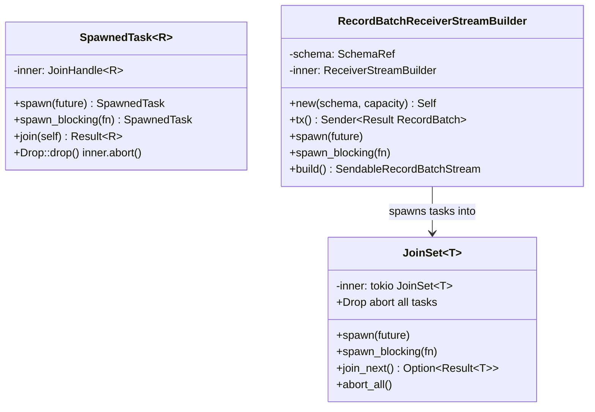
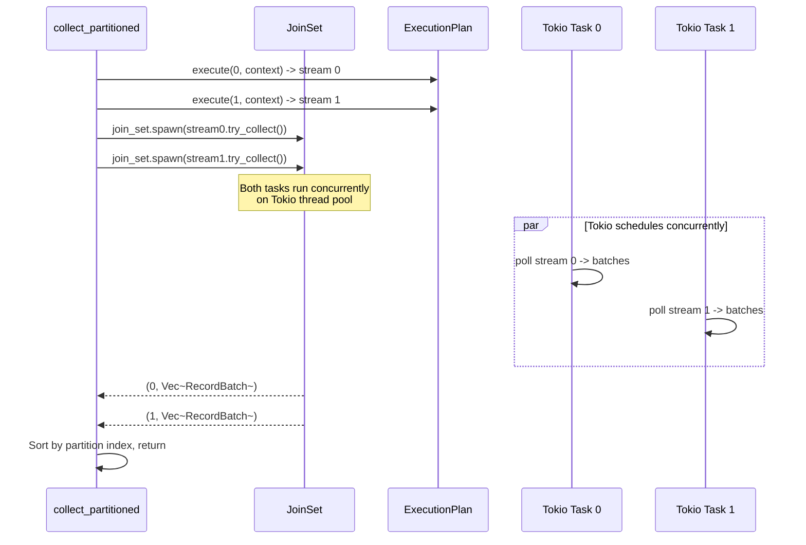

# Module Teardown: Tokio Task Spawning

## Table of Contents

- [0. Research Focus](#0-research-focus)
- [1. High-Level Overview](#1-high-level-overview)
- [2. Structural Architecture](#2-structural-architecture)
  - [Class Diagram](#class-diagram)
- [3. Execution & Call Flow](#3-execution-call-flow)
  - [Sequence Diagram: `collect_partitioned` — Parallel Partition Execution](#sequence-diagram-collect_partitioned-parallel-partition-execution)
  - [`collect_partitioned` implementation:](#collect_partitioned-implementation)
  - [`spawn_buffered` — Decoupling producer and consumer:](#spawn_buffered-decoupling-producer-and-consumer)
  - [`SpawnedTask` — Abort-on-drop safety:](#spawnedtask-abort-on-drop-safety)
  - [`trace_future` / `trace_block` — Global Tracer Injection](#trace_future-trace_block-global-tracer-injection)
  - [`EnsureCooperative` — Automatic Cooperative Scheduling](#ensurecooperative-automatic-cooperative-scheduling)
- [4. Concurrency & State Management](#4-concurrency-state-management)
- [5. Memory & Resource Profile](#5-memory-resource-profile)
- [6. Key Design Insights](#6-key-design-insights)


## 0. Research Focus
* **Task ID:** 2.4.A
* **Focus:** How are multiple partitions mapped to actual CPU threads? Trace `SpawnedTask` (abort-on-drop wrapper around `tokio::task::JoinHandle`), `JoinSet` (managed task set), `spawn_buffered()` (channel-based stream decoupling), and `collect_partitioned()` (one Tokio task per partition). Why is raw `tokio::spawn` banned in operator code?

## 1. High-Level Overview
* **Core Responsibility:** DataFusion maps partitions to OS threads indirectly through Tokio's async runtime. Rather than spawning one thread per partition, operators create async streams that are driven by the Tokio executor. Explicit task spawning is done through two controlled primitives: `SpawnedTask` (single task with abort-on-drop) and `JoinSet` (managed set of tasks). The key spawning function is `spawn_buffered()`, which decouples a producer stream from its consumer via a bounded channel and a background Tokio task.
* **Key Triggers:** Spawning happens in two scenarios: (1) `collect_partitioned()` spawns one Tokio task per partition to drive each stream concurrently; (2) Individual operators like `RepartitionExec` use `RecordBatchReceiverStreamBuilder` to spawn background tasks that pull from input streams and route batches through channels.

## 2. Structural Architecture
* **Primary Source Files:**
  - `datafusion/common-runtime/src/common.rs` — `SpawnedTask` (abort-on-drop wrapper)
  - `datafusion/common-runtime/src/join_set.rs` — `JoinSet` (managed task set wrapper)
  - `datafusion/physical-plan/src/common.rs` — `spawn_buffered()` function
  - `datafusion/physical-plan/src/stream.rs` — `RecordBatchReceiverStreamBuilder`
  - `datafusion/physical-plan/src/execution_plan.rs` — `collect_partitioned()`

* **Key Data Structures:**
  - `SpawnedTask<R>` — Wraps `tokio::task::JoinHandle<R>`. Aborts the task on `Drop`.
  - `JoinSet<T>` — Wraps `tokio::task::JoinSet<T>`. Instruments spawns with tracing. Aborts all tasks on `Drop`.
  - `RecordBatchReceiverStreamBuilder` — Creates a `mpsc::channel` + `JoinSet`, spawns producer tasks, and builds a consumer stream.

### Class Diagram


## 3. Execution & Call Flow

### Sequence Diagram: `collect_partitioned` — Parallel Partition Execution


### `collect_partitioned` implementation:

```rust
// execution_plan.rs:1335-1379
pub async fn collect_partitioned(
    plan: Arc<dyn ExecutionPlan>,
    context: Arc<TaskContext>,
) -> Result<Vec<Vec<RecordBatch>>> {
    let streams = execute_stream_partitioned(plan, context)?;
    let mut join_set = JoinSet::new();

    // Spawn one Tokio task per partition stream
    streams.into_iter().enumerate().for_each(|(idx, stream)| {
        join_set.spawn(async move {
            let result: Result<Vec<RecordBatch>> = stream.try_collect().await;
            (idx, result)
        });
    });

    let mut batches = vec![];
    while let Some(result) = join_set.join_next().await {
        match result {
            Ok((idx, res)) => batches.push((idx, res?)),
            Err(e) => {
                if e.is_panic() { std::panic::resume_unwind(e.into_panic()); }
                else { unreachable!(); }
            }
        }
    }
    batches.sort_by_key(|(idx, _)| *idx);
    Ok(batches.into_iter().map(|(_, batch)| batch).collect())
}
```

### `spawn_buffered` — Decoupling producer and consumer:

```rust
// common.rs:94-123
pub fn spawn_buffered(
    mut input: SendableRecordBatchStream,
    buffer: usize,
) -> SendableRecordBatchStream {
    match tokio::runtime::Handle::try_current() {
        Ok(handle)
            if handle.runtime_flavor() == tokio::runtime::RuntimeFlavor::MultiThread =>
        {
            let mut builder = RecordBatchReceiverStream::builder(input.schema(), buffer);
            let sender = builder.tx();
            builder.spawn(async move {
                while let Some(item) = input.next().await {
                    if sender.send(item).await.is_err() {
                        return Ok(());  // Receiver dropped → stop
                    }
                }
                Ok(())
            });
            builder.build()
        }
        _ => input,  // Single-threaded: no spawning
    }
}
```

### `SpawnedTask` — Abort-on-drop safety:

```rust
// common.rs:34-111
pub struct SpawnedTask<R> {
    inner: JoinHandle<R>,
}

impl<R> SpawnedTask<R> {
    pub fn spawn<T>(task: T) -> Self
    where T: Future<Output = R> + Send + 'static, R: Send,
    {
        let inner = tokio::task::spawn(trace_future(task));  // ← wrapped with tracer
        Self { inner }
    }

    pub fn spawn_blocking<T>(task: T) -> Self
    where T: FnOnce() -> R + Send + 'static, R: Send,
    {
        let inner = tokio::task::spawn_blocking(trace_block(task));  // ← wrapped with tracer
        Self { inner }
    }
}

impl<R> Drop for SpawnedTask<R> {
    fn drop(&mut self) {
        self.inner.abort();  // Cancel task when handle is dropped
    }
}
```

### `trace_future` / `trace_block` — Global Tracer Injection

All spawned tasks are wrapped with `trace_future()` or `trace_block()` before being handed to Tokio. These wrappers delegate to a global `JoinSetTracer` trait object:

```rust
// trace_utils.rs
pub trait JoinSetTracer: Send + Sync + 'static {
    fn trace_future(&self, fut: BoxFuture<'static, Box<dyn Any + Send>>)
        -> BoxFuture<'static, Box<dyn Any + Send>>;
    fn trace_block(&self, f: Box<dyn FnOnce() -> Box<dyn Any + Send> + Send>)
        -> Box<dyn FnOnce() -> Box<dyn Any + Send> + Send>;
}

static GLOBAL_TRACER: OnceCell<&'static dyn JoinSetTracer> = OnceCell::const_new();
```

By default, a no-op tracer is used (zero-cost). Embedders can install a custom tracer at startup via `set_join_set_tracer()` for distributed tracing integration (e.g., OpenTelemetry, Jaeger). The type-erasing mechanism uses `Box<dyn Any + Send>` with a downcast on return, allowing the tracer to be completely generic.

### `EnsureCooperative` — Automatic Cooperative Scheduling

The `EnsureCooperative` physical optimizer rule injects `CooperativeExec` wrappers around non-cooperative operators:

```rust
// ensure_coop.rs:88-116
let is_cooperative = props.scheduling_type == SchedulingType::Cooperative;
let is_leaf = plan.children().is_empty();
let is_exchange = props.evaluation_type == EvaluationType::Eager;

// Wrap non-cooperative leaf/exchange nodes with CooperativeExec
if (is_leaf || is_exchange) && !is_cooperative && !is_under_cooperative_context {
    return Ok(Transformed::yes(Arc::new(CooperativeExec::new(plan))));
}
```

`CooperativeExec` wraps the inner plan's streams with `CooperativeStream`, which consumes Tokio's task budget for each batch produced. This ensures that even CPU-intensive operators yield to the scheduler periodically, enabling query cancellation and fair scheduling across concurrent queries.

## 4. Concurrency & State Management
* **Threading Model:** DataFusion does NOT create OS threads or Tokio tasks per partition by default. Partitions are async streams, and the Tokio runtime multiplexes them across its thread pool. Explicit spawning only happens in specific cases:
  - `collect_partitioned`: Spawns one Tokio task per partition to drive them concurrently.
  - `spawn_buffered`: Spawns a background task to decouple a producer stream from its consumer (enabling pipeline parallelism).
  - `RepartitionExec`: Uses `RecordBatchReceiverStreamBuilder` to spawn input-reading tasks.
* **Cancellation safety:** All spawning primitives (`SpawnedTask`, `JoinSet`) abort tasks on drop. When a stream is dropped (e.g., query cancelled, limit reached), background tasks are automatically cancelled.
* **Multi-thread guard:** `spawn_buffered` checks for `RuntimeFlavor::MultiThread` — if running on a current-thread runtime, it skips spawning and returns the input stream directly (spawning on a current-thread runtime would deadlock).

## 5. Memory & Resource Profile
* **Allocation Pattern:** `SpawnedTask` is a thin wrapper around `JoinHandle` (one pointer). `JoinSet` holds a `tokio::task::JoinSet` internally. `RecordBatchReceiverStreamBuilder` allocates a bounded `mpsc::channel` (the `buffer` parameter controls capacity).
* **Memory Tracking:** Spawned tasks are not tracked by the `MemoryPool`. Memory tracking happens within the streams that the tasks drive, via `MemoryReservation`.

## 6. Key Design Insights

* **No 1:1 partition-to-thread mapping.** DataFusion relies on Tokio's work-stealing scheduler to distribute partition streams across the thread pool. A query with 8 partitions on a 4-core machine will have 8 streams multiplexed across 4 Tokio worker threads, with Tokio's work-stealing ensuring balanced utilization.

* **`tokio::spawn` is banned; `SpawnedTask` is required.** The `ExecutionPlan::execute()` docs explicitly state: "`spawn` is disallowed, and instead use `SpawnedTask`." Raw `tokio::spawn` creates orphaned tasks that continue running after the query is cancelled. `SpawnedTask`'s abort-on-drop guarantees cleanup.

* **`spawn_buffered` enables pipeline parallelism.** Without it, pulling from a sort operator would block the downstream consumer until the sort completes. With `spawn_buffered`, the sort runs in a background task and buffers results in a channel, allowing the consumer to start processing immediately when results are available.

* **`RecordBatchReceiverStreamBuilder` is the primary spawning pattern.** Most operators that need background tasks use this builder: create a channel, spawn producers that send batches, and build a consumer stream. The builder's `JoinSet` ensures all spawned tasks are cancelled when the stream is dropped.

* **`spawn_buffered` buffer size is almost always 1.** Across the codebase, `spawn_buffered(stream, 1)` is the dominant pattern (used by SortExec, SortPreservingMergeExec, SpillManager). A buffer of 1 creates a "producer-consumer" decoupling — the producer can work on the next batch while the consumer processes the current one — without unbounded memory growth. This is intentional: larger buffers would consume more memory without proportionally increasing throughput.

* **All task spawning is traced.** `SpawnedTask::spawn()` wraps futures with `trace_future()`, which delegates to a global `JoinSetTracer`. This enables embedders to inject distributed tracing (OpenTelemetry, Jaeger) into every spawned task without modifying operator code. The default no-op tracer adds zero overhead.

* **`EnsureCooperative` optimizer makes cooperation automatic.** Operators don't need to explicitly manage Tokio's task budget. The physical optimizer identifies non-cooperative leaf and exchange nodes and wraps them with `CooperativeExec`, which injects a `CooperativeStream` that consumes budget per batch. This means cooperative scheduling is a property of the plan, not of individual operator implementations.

* **No thread affinity or `spawn_local`.** DataFusion uses no `spawn_local()`, `LocalSet`, CPU binding, or thread affinity hints anywhere in its operator code. All tasks are `Send` and can migrate freely between Tokio worker threads. The work-stealing scheduler distributes work automatically.
