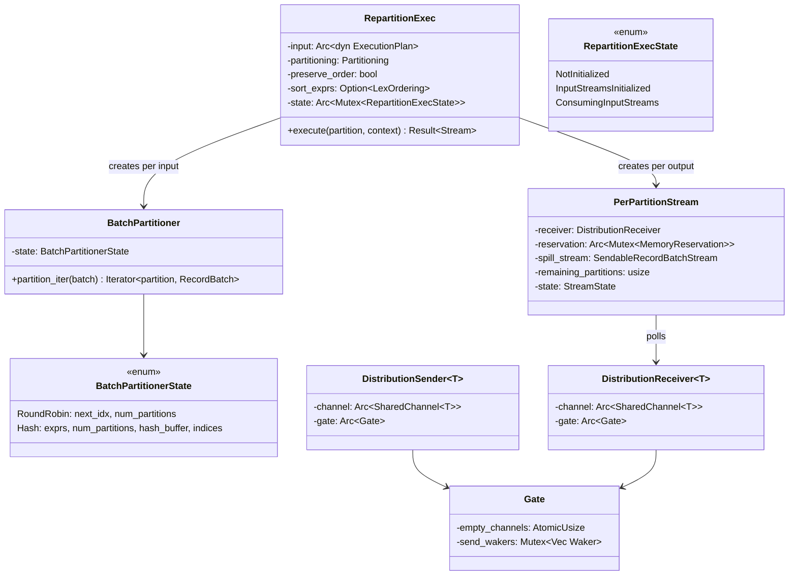
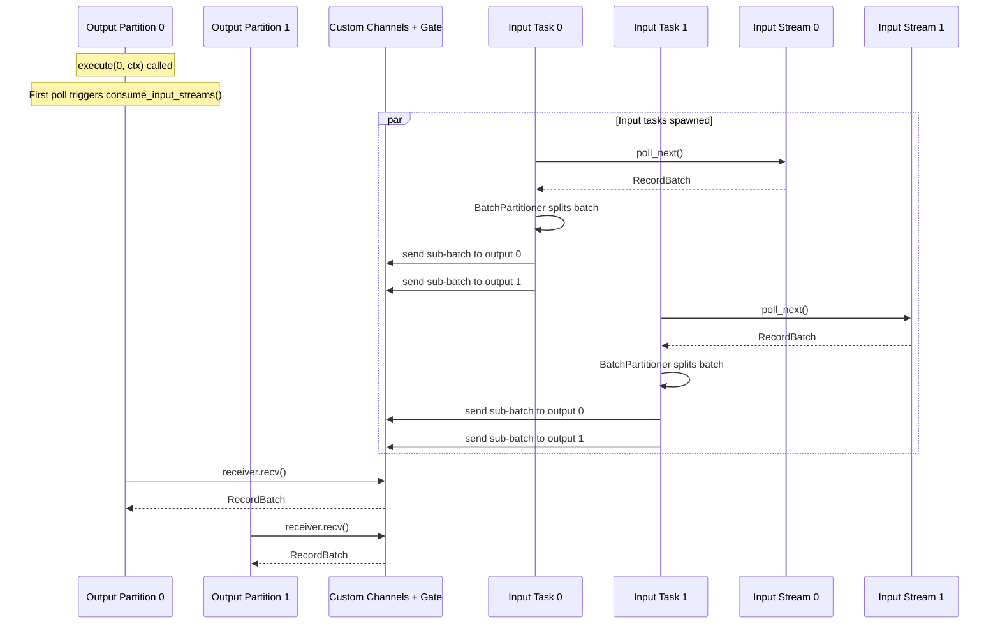

# Module Teardown: Local Repartitioning (The Exchange)

## Table of Contents

- [0. Research Focus](#0-research-focus)
- [1. High-Level Overview](#1-high-level-overview)
- [2. Structural Architecture](#2-structural-architecture)
  - [Class Diagram](#class-diagram)
- [3. Execution & Call Flow](#3-execution-call-flow)
  - [Sequence Diagram: RepartitionExec N->M Data Flow](#sequence-diagram-repartitionexec-n-m-data-flow)
  - [execute() — Entry Point (Lazy Initialization)](#execute-entry-point-lazy-initialization)
  - [consume_input_streams() — Channel and Task Setup](#consume_input_streams-channel-and-task-setup)
  - [pull_from_input() — The Input Task](#pull_from_input-the-input-task)
  - [BatchPartitioner: Hash vs Round-Robin](#batchpartitioner-hash-vs-round-robin)
  - [The Custom Gate-Based Channel System](#the-custom-gate-based-channel-system)
  - [Channel Topology: Preserve-Order vs Standard](#channel-topology-preserve-order-vs-standard)
  - [PerPartitionStream: Output State Machine](#perpartitionstream-output-state-machine)
  - [Error Propagation and Task Cleanup](#error-propagation-and-task-cleanup)
- [4. Concurrency & State Management](#4-concurrency-state-management)
- [5. Memory & Resource Profile](#5-memory-resource-profile)
- [6. Key Design Insights](#6-key-design-insights)


## 0. Research Focus
* **Task ID:** 2.4.B
* **Focus:** Trace `RepartitionExec`. How does it take N input streams and map them to M output streams? Analyze how it uses channels to move `RecordBatch`es across thread boundaries. How does it handle backpressure (channel capacity)? How does hash vs. round-robin routing work?

## 1. High-Level Overview
* **Core Responsibility:** `RepartitionExec` is DataFusion's local exchange operator — the single-node equivalent of Trino's `LocalExchange`. It maps N input partitions to M output partitions by spawning async tasks that pull from input streams, partition each `RecordBatch` using either hash or round-robin routing, and distribute the resulting sub-batches to output partitions via custom channels. It supports order preservation (via per-input-output channels + merge sort), spill-to-disk on memory pressure, and cooperative Tokio yielding.
* **Key Triggers:** Inserted by the physical optimizer when `required_input_distribution()` (e.g., `HashPartitioned(exprs)` for a join) doesn't match the child's `output_partitioning()`. Also inserted to increase parallelism when a scan has fewer partitions than `target_partitions`.

## 2. Structural Architecture
* **Primary Source Files:**
  - `datafusion/physical-plan/src/repartition/mod.rs` — `RepartitionExec`, `BatchPartitioner`, `PerPartitionStream`, `RepartitionExecState`
  - `datafusion/physical-plan/src/repartition/distributor_channels.rs` — Custom channel implementation with `Gate` backpressure

* **Key Data Structures:**
  - `RepartitionExec` — The `ExecutionPlan` implementation. Holds the input plan, target `Partitioning`, `preserve_order` flag, sort expressions, and shared `RepartitionExecState`.
  - `RepartitionExecState` — Three-phase state machine: `NotInitialized` -> `InputStreamsInitialized` -> `ConsumingInputStreams`. Protected by `Mutex`.
  - `BatchPartitioner` — Routes rows from a `RecordBatch` to output partitions. Supports `Hash` (expression evaluation + modulo) and `RoundRobin` (cycling index).
  - `PerPartitionStream` — The output stream for a single output partition. Polls from a channel receiver and falls back to spill readers.
  - `DistributionSender<T>` / `DistributionReceiver<T>` — Custom unbounded channels with a shared `Gate` for backpressure.
  - `Gate` — Atomic counter tracking how many channels are empty. Senders become `Pending` when ALL channels are non-empty (prevents deadlock).
  - `RepartitionBatch` — Enum: `Memory(RecordBatch)` (in-memory batch) or `Spilled` (marker indicating data is on disk).

### Class Diagram


## 3. Execution & Call Flow

### Sequence Diagram: RepartitionExec N->M Data Flow


### execute() — Entry Point (Lazy Initialization)

```rust
// repartition/mod.rs:960-1103
fn execute(&self, partition: usize, context: Arc<TaskContext>) -> Result<SendableRecordBatchStream> {
    // Step 1: Ensure input streams initialized (early, under lock)
    let state = Arc::clone(&self.state);
    if let Some(mut state) = state.try_lock() {
        state.ensure_input_streams_initialized(
            &input, &metrics, partitioning.partition_count(), &context,
        )?;
    }

    // Step 2: Return an async stream that finishes setup on first poll
    let stream = futures::stream::once(async move {
        let mut state = state.lock();
        let state = state.consume_input_streams(
            &input, &metrics, &partitioning,
            preserve_order, &name, &context, spill_manager,
        )?;

        // Extract this output partition's channels
        let PartitionChannels { rx, reservation, spill_readers, .. } =
            state.channels.remove(&partition)?;

        // Build output stream based on mode
        if preserve_order {
            // N input streams per output, merge-sorted
            StreamingMergeBuilder::new()
                .with_streams(input_streams)
                .with_expressions(&sort_exprs)
                .build()
        } else {
            // Single coalescing stream
            PerPartitionStream::new(rx, reservation, spill_stream, ...)
        }
    })
    .try_flatten();

    Ok(Box::pin(ObservedStream::new(stream, baseline_metrics)))
}
```

Key design: **lazy initialization**. Input tasks are only spawned when the first output partition is actually polled. This avoids wasted work if the query is cancelled before execution begins.

### consume_input_streams() — Channel and Task Setup

```rust
// repartition/mod.rs:266-415
fn consume_input_streams(&mut self, ...) -> Result<&mut ConsumingInputStreamsState> {
    // Create channels based on mode
    let (txs, rxs) = if preserve_order {
        // N×M channels: one per (input, output) pair
        partition_aware_channels(n_input, n_output)
    } else {
        // M channels: one per output, shared across inputs
        channels(n_output)
    };

    // Create spill writers/readers per output
    let (spill_writers, spill_readers) = (0..num_spill_channels)
        .map(|_| spill_pool::channel(max_file_size, spill_manager))
        .unzip();

    // Create per-output memory reservations
    let reservations = (0..n_output).map(|partition| {
        Arc::new(Mutex::new(
            MemoryConsumer::new(format!("{name}[{partition}]"))
                .with_can_spill(true)
                .register(context.memory_pool()),
        ))
    });

    // Spawn one async task per input partition
    for input_idx in 0..n_input {
        let task = SpawnedTask::spawn(pull_from_input(
            input_stream, partitioner, output_channels, ...
        ));
        let wait_task = SpawnedTask::spawn(wait_for_task(task, txs_for_error));
        tasks.push(wait_task);
    }
}
```

### pull_from_input() — The Input Task

```rust
// repartition/mod.rs:1348-1457
async fn pull_from_input(
    mut input: SendableRecordBatchStream,
    mut partitioner: BatchPartitioner,
    mut output_channels: HashMap<usize, OutputChannel>,
    ...
) -> Result<()> {
    let mut batches_until_yield = partitioner.num_partitions();

    while let Some(result) = input.next().await {
        let batch = result?;
        if batch.num_rows() == 0 { continue; }

        // Partition the batch and send to outputs
        for (partition, sub_batch) in partitioner.partition_iter(batch)? {
            if let Some(channel) = output_channels.get_mut(&partition) {
                let size = sub_batch.get_array_memory_size();

                // Memory check: try to grow reservation
                let (repartition_batch, is_memory) =
                    match channel.reservation.lock().try_grow(size) {
                        Ok(_) => (RepartitionBatch::Memory(sub_batch), true),
                        Err(_) => {
                            // Memory pressure → spill to disk
                            channel.spill_writer.push_batch(&sub_batch)?;
                            (RepartitionBatch::Spilled, false)
                        }
                    };

                // Send through channel
                if channel.sender.send(Some(Ok(repartition_batch))).await.is_err() {
                    // Receiver dropped (early shutdown)
                    if is_memory { channel.reservation.lock().shrink(size); }
                    output_channels.remove(&partition);
                }
            }
        }

        // Cooperative yielding: yield after N batches
        if batches_until_yield == 0 {
            tokio::task::yield_now().await;
            batches_until_yield = partitioner.num_partitions();
        } else {
            batches_until_yield -= 1;
        }
    }
    Ok(())
}
```

### BatchPartitioner: Hash vs Round-Robin

**Hash Partitioning:**
```rust
// repartition/mod.rs:585-648
BatchPartitionerState::Hash { exprs, num_partitions, hash_buffer, indices } => {
    // 1. Evaluate hash expressions on batch
    let arrays = exprs.iter()
        .map(|expr| expr.evaluate(&batch)?.into_array(batch.num_rows()))
        .collect()?;

    // 2. Compute hashes (deterministic seed: REPARTITION_RANDOM_STATE with seed=0)
    create_hashes(&arrays, &REPARTITION_RANDOM_STATE, hash_buffer)?;

    // 3. Map hash to partition index, collect row indices per partition
    for (idx, hash) in hash_buffer.iter().enumerate() {
        indices[(*hash % num_partitions as u64) as usize].push(idx as u32);
    }

    // 4. Create sub-batches by taking rows at collected indices
    for (partition, partition_indices) in indices.iter().enumerate() {
        if !partition_indices.is_empty() {
            let columns = take_arrays(&batch, partition_indices, None)?;
            let batch = RecordBatch::try_new(schema, columns)?;
            yield (partition, batch);
        }
    }
}
```

**Round-Robin Routing:**
```rust
// repartition/mod.rs:568-574
BatchPartitionerState::RoundRobin { num_partitions, next_idx } => {
    // Each batch goes to the next partition in rotation
    let partition = *next_idx;
    *next_idx = (*next_idx + 1) % *num_partitions;
    yield (partition, batch);  // Entire batch, no splitting
}
```

Starting index is distributed across inputs to avoid skew:
```rust
// repartition/mod.rs:478-490
next_idx = (input_partition * num_partitions) / num_input_partitions;
```

### The Custom Gate-Based Channel System

DataFusion does NOT use `tokio::sync::mpsc`. It uses a custom channel implementation with a `Gate` for coordinated backpressure.

```rust
// distributor_channels.rs:418-470
struct Gate {
    /// Number of currently empty (and still open) channels
    empty_channels: AtomicUsize,
    /// Wakers for the sender side
    send_wakers: Mutex<Option<Vec<(Waker, usize)>>>,
}
```

**How the Gate prevents deadlocks:**
1. N virtual channels with unbounded internal `VecDeque<T>` buffers.
2. If ALL channels are non-empty, the global gate **closes** — senders become `Pending`.
3. When a receiver drains its channel to empty, it increments `empty_channels` and wakes registered senders.
4. A sender only blocks when **every** output channel has data. This prevents the scenario where all output buffers fill up and no receiver can make progress.

```rust
// distributor_channels.rs — SendFuture::poll
fn poll(self: Pin<&mut Self>, cx: &mut Context<'_>) -> Poll<Result<(), SendError<T>>> {
    let mut guard = this.channel.state.lock();
    let Some(data) = guard.data.as_mut() else {
        return Poll::Ready(Err(SendError(value)));  // Receiver dropped
    };
    if this.gate.empty_channels.load(Ordering::SeqCst) == 0 {
        // All channels non-empty → block sender
        this.gate.send_wakers.lock().push((cx.waker().clone(), channel_id));
        return Poll::Pending;
    }
    // At least one channel is empty → proceed to send
    data.push_back(value);
    // Wake receiver for this channel
    Poll::Ready(Ok(()))
}
```

**Channel Drop behavior** is critical for cancellation correctness:

```rust
// DistributionReceiver::drop() — signals senders that this output is gone
impl<T> Drop for DistributionReceiver<T> {
    fn drop(&mut self) {
        let mut guard = self.channel.state.lock();
        let data = guard.data.take().expect("not dropped yet");  // Sets data = None
        if data.is_empty() && (self.channel.n_senders.load(Ordering::SeqCst) > 0) {
            self.gate.decr_empty_channels();  // Adjust gate count
        }
        self.gate.wake_channel_senders(self.channel.id);  // Wake blocked senders
    }
}

// DistributionSender::drop() — when last sender drops, wake receivers
impl<T> Drop for DistributionSender<T> {
    fn drop(&mut self) {
        let n_senders_pre = self.channel.n_senders.fetch_sub(1, Ordering::SeqCst);
        if n_senders_pre > 1 { return; }  // Not the last sender
        // Last sender: wake all receivers so they see EOF
        // ...
    }
}
```

Senders detect receiver drop by checking `channel.state.data.is_none()` on next poll. This is how `pull_from_input` knows to remove a dead output partition from its routing map.

### Channel Topology: Preserve-Order vs Standard

**Non-preserve-order:** M channels (one per output). All inputs share the same channel to each output.
```
Input 0 ──┐
Input 1 ──┤──→ Channel 0 ──→ Output 0
Input N ──┘
           ──→ Channel 1 ──→ Output 1
           ──→ Channel M ──→ Output M
```

**Preserve-order:** N x M channels (one per input-output pair). Each output merges its N channels via streaming merge sort.
```
Input 0 ──→ Channel(0,0) ──┐
Input 1 ──→ Channel(1,0) ──┤──→ StreamingMerge ──→ Output 0
Input N ──→ Channel(N,0) ──┘

Input 0 ──→ Channel(0,1) ──┐
Input 1 ──→ Channel(1,1) ──┤──→ StreamingMerge ──→ Output 1
Input N ──→ Channel(N,1) ──┘
```

### PerPartitionStream: Output State Machine

```rust
// repartition/mod.rs:1548-1555
enum StreamState {
    ReadingMemory,   // Polling the channel for the next batch
    ReadingSpilled,  // Polling the spill stream for batch data
}
```

```rust
// repartition/mod.rs:1617-1696 (simplified)
fn poll_next_inner(&mut self, cx: &mut Context) -> Poll<Option<Result<RecordBatch>>> {
    loop {
        match self.state {
            StreamState::ReadingMemory => {
                match self.receiver.recv().poll_unpin(cx) {
                    Poll::Ready(Some(Some(Ok(RepartitionBatch::Memory(batch))))) => {
                        self.reservation.lock().shrink(batch.get_array_memory_size());
                        return Poll::Ready(Some(Ok(batch)));
                    }
                    Poll::Ready(Some(Some(Ok(RepartitionBatch::Spilled)))) => {
                        // Switch to reading from disk
                        self.state = StreamState::ReadingSpilled;
                        continue;
                    }
                    Poll::Ready(Some(None)) => {
                        // One input partition finished
                        self.remaining_partitions -= 1;
                        if self.remaining_partitions == 0 {
                            return Poll::Ready(None);  // All inputs done
                        }
                        continue;
                    }
                    Poll::Pending => return Poll::Pending,
                }
            }
            StreamState::ReadingSpilled => {
                match self.spill_stream.poll_next_unpin(cx) {
                    Poll::Ready(Some(Ok(batch))) => {
                        self.state = StreamState::ReadingMemory;  // Back to channel
                        return Poll::Ready(Some(Ok(batch)));
                    }
                    Poll::Pending => return Poll::Pending,
                }
            }
        }
    }
}
```

### Error Propagation and Task Cleanup

```rust
// repartition/mod.rs:1464-1503 — wait_for_task
async fn wait_for_task(task: SpawnedTask<Result<()>>, txs: HashMap<usize, Sender>) {
    let msg = match task.join().await {
        Ok(Ok(())) => None,  // Clean completion
        Ok(Err(e)) => Some(Err(Arc::new(e))),  // Task error → broadcast to all outputs
        Err(e) => Some(Err(DataFusionError::External(Box::new(e)))),  // Join error
    };
    // Send completion/error signal to all outputs
    for (_, tx) in txs {
        let _ = tx.send(msg.clone()).await;
    }
}
```

Task cleanup is handled by `Arc<Vec<SpawnedTask<()>>>` held by `ConsumingInputStreamsState`. When all output `PerPartitionStream`s are dropped, the `Arc` ref count hits zero, dropping the `SpawnedTask`s, which abort all input tasks.

## 4. Concurrency & State Management
* **Threading Model:** Each input partition runs as an independent Tokio task (via `SpawnedTask`). The `Mutex<RepartitionExecState>` ensures that `consume_input_streams()` runs exactly once, even if multiple output partitions call `execute()` concurrently. After initialization, there is no shared mutable state — channels handle cross-task communication.
* **Backpressure:** The Gate mechanism provides coarse-grained backpressure: senders block only when ALL output channels are non-empty. This is intentionally weaker than per-channel backpressure to avoid deadlocks (a sender blocked on channel A cannot make progress on channel B to unblock A's consumer).
* **Cooperative yielding:** Input tasks yield to Tokio after processing N batches (where N = number of output partitions). This prevents a single input task from monopolizing a Tokio worker thread on high-throughput streams.

## 5. Memory & Resource Profile
* **Allocation Pattern:** Each output partition has a `MemoryReservation` (marked `can_spill = true`) shared across all input tasks sending to it. When `try_grow()` fails, the batch is spilled to disk rather than held in memory. The reservation tracks the aggregate in-flight memory across all channels to a given output.
* **Memory Tracking:** Memory is reserved before sending (`try_grow(size)` in `pull_from_input`) and released after receiving (`shrink(size)` in `PerPartitionStream`). This ensures the pool accurately reflects in-flight data in the channels.
* **Spill management:** Uses `spill_pool::channel()` for spill file rotation. Preserve-order mode uses N spill channels (one per input); non-preserve-order uses 1 shared spill channel. Spill files are cleaned up when `SpillManager` is dropped.

## 6. Key Design Insights

* **Custom channels, not `tokio::sync::mpsc`.** DataFusion uses a custom `DistributionSender`/`DistributionReceiver` with a shared `Gate` rather than standard Tokio channels. The Gate's "block only when all channels are non-empty" policy prevents deadlocks that could occur with per-channel bounded channels in an N-to-M routing topology.

* **Spill-transparent routing.** The `RepartitionBatch` enum (`Memory` vs `Spilled`) allows the channel to carry a mix of in-memory and spilled batches. The output `PerPartitionStream` transparently switches between reading from the channel and reading from the spill file, preserving FIFO order. This design is invisible to downstream operators.

* **Lazy async startup.** Input tasks are spawned only when the first output partition is polled (`consume_input_streams` runs inside a `futures::stream::once(async { ... })`). This avoids wasted work if the query is never executed or is cancelled before reaching the repartition operator.

* **Preserve-order mode uses N x M channels.** To maintain sort order across a repartition, each (input, output) pair gets a dedicated channel. The output partition then merge-sorts its N input channels via `StreamingMergeBuilder`. This is more expensive (more channels, merge overhead) but guarantees global ordering is preserved.

* **Hash partitioning uses deterministic seeding.** `REPARTITION_RANDOM_STATE = SeededRandomState::with_seed(0)` ensures identical hash-to-partition mapping across all input tasks. Without this, the same key could be routed to different output partitions from different input tasks, breaking correctness.

* **Cooperative yielding prevents starvation.** The `batches_until_yield` counter in `pull_from_input` ensures input tasks periodically yield to Tokio's scheduler. The heuristic (yield every N batches where N = output partition count) balances throughput against responsiveness for other tasks sharing the thread pool.

* **Contrast with Trino's `LocalExchange`.** Trino's `LocalPartitionGenerator` uses a similar N-to-M channel pattern, but with Java's explicit `ListenableFuture`-based blocking and the custom cooperative scheduler. DataFusion achieves the same result with Rust's async/await and the Gate backpressure primitive, eliminating the need for a custom scheduler.
