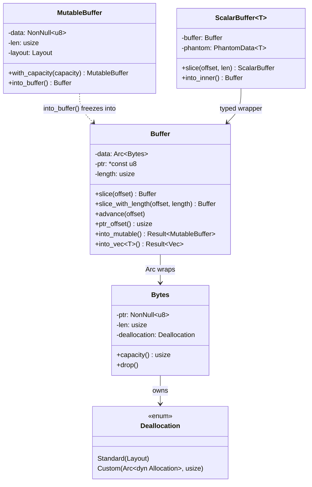
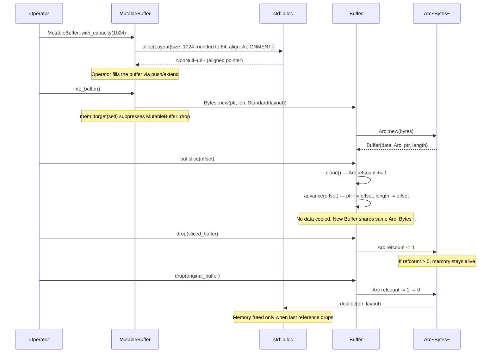

# Module Teardown: The `Buffer` and Arrow Memory Management

## Table of Contents

- [0. Research Focus](#0-research-focus)
- [1. High-Level Overview](#1-high-level-overview)
- [2. Structural Architecture](#2-structural-architecture)
  - [Class Diagram](#class-diagram)
- [3. Execution & Call Flow](#3-execution-call-flow)
  - [Sequence Diagram: Allocation, Freeze, Slice, Drop](#sequence-diagram-allocation-freeze-slice-drop)
- [4. Concurrency & State Management](#4-concurrency-state-management)
- [5. Memory & Resource Profile](#5-memory-resource-profile)
- [6. Key Design Insights](#6-key-design-insights)

## 0. Research Focus
* **Task ID:** 1.1
* **Focus:** Trace how `Buffer` manages underlying `Bytes`. Analyze the implementation of `Buffer::slice()`. How does it use `Arc` for shared ownership? How is 64-byte alignment enforced?

## 1. High-Level Overview
* **Core Responsibility:** `Buffer` is Arrow's foundational immutable, reference-counted, zero-copy-sliceable byte container. It wraps a `Bytes` allocation inside an `Arc` and adds a pointer+length window for O(1) slicing without copying data. Every Arrow array — primitive, string, boolean, nested — ultimately stores its columnar data in one or more `Buffer` instances.
* **Key Triggers:** `Buffer` is created by freezing a `MutableBuffer` (the build-phase allocator), by converting from `Vec<T>`, or by adopting externally-owned memory (e.g., `bytes::Bytes` from network I/O). Once created, it is shared across array slices, `RecordBatch` projections, and cross-thread access via `Arc` cloning.

## 2. Structural Architecture
* **Primary Source Files:**
  - `arrow-buffer/src/buffer/immutable.rs` — `Buffer` struct, `slice()`, `advance()`, `into_mutable()`, `into_vec()`
  - `arrow-buffer/src/bytes.rs` — `Bytes` struct, raw memory ownership, `Deallocation` enum
  - `arrow-buffer/src/buffer/mutable.rs` — `MutableBuffer`, aligned allocation, `into_buffer()` freeze path
  - `arrow-buffer/src/alloc/mod.rs` — `Deallocation` enum (`Standard`, `Custom`)
  - `arrow-buffer/src/alloc/alignment.rs` — `ALIGNMENT` constant (architecture-specific)
  - `arrow-buffer/src/buffer/scalar.rs` — `ScalarBuffer<T>`, typed wrapper over `Buffer`

* **Key Data Structures:**
  - `Bytes` — Raw memory region: `NonNull<u8>` pointer + `usize` length + `Deallocation` strategy. Owns the allocation.
  - `Buffer` — Immutable shared window: `Arc<Bytes>` + raw `*const u8` pointer + `usize` length. The pointer may diverge from `Bytes.ptr` after slicing.
  - `MutableBuffer` — Build-phase buffer: `NonNull<u8>` data + `usize` len + `Layout` (carries size and alignment). Single-owner, growable.
  - `Deallocation` — Enum: `Standard(Layout)` for Rust-allocated memory, `Custom(Arc<dyn Allocation>, usize)` for externally-owned memory (FFI, `bytes::Bytes`).
  - `ScalarBuffer<T>` — Typed wrapper: `Buffer` + `PhantomData<T>`. Conceptually `Arc<Vec<T>>` with O(1) slice/clone.

### Class Diagram

## 3. Execution & Call Flow

### Sequence Diagram: Allocation, Freeze, Slice, Drop

* **Step-by-step breakdown:**
  1. **Allocation:** `MutableBuffer::with_capacity(n)` rounds `n` up to a multiple of 64 bytes, creates a `Layout` with the architecture-specific `ALIGNMENT` (64 bytes on aarch64, 128 bytes on x86_64), and calls `std::alloc::alloc(layout)`.
  2. **Fill:** The operator appends data via `push()`, `extend_from_slice()`, etc. `MutableBuffer` tracks `len` (bytes written) separately from the layout's `size` (capacity).
  3. **Freeze:** `into_buffer()` constructs a `Bytes` from the raw pointer, length, and `Deallocation::Standard(layout)`, then wraps it in `Arc::new()`. `mem::forget(self)` suppresses `MutableBuffer`'s destructor to prevent double-free.
  4. **Slice:** `Buffer::slice(offset)` clones the `Arc<Bytes>` (refcount increment), then advances the raw pointer and shrinks the length. No data is copied.
  5. **Drop:** When the last `Buffer` referencing a given `Arc<Bytes>` is dropped, the `Arc` refcount reaches zero, triggering `Bytes::drop()`, which calls `std::alloc::dealloc()` for `Standard` allocations.

## 4. Concurrency & State Management
* **Threading Model:** `Buffer` is `Send + Sync` (explicitly declared via `unsafe impl`). Multiple threads can hold `Buffer` instances pointing to the same `Arc<Bytes>` and read concurrently. The `Arc` atomic refcount handles cross-thread lifetime management.
* **Immutability Invariant:** Once a `MutableBuffer` is frozen into a `Buffer`, the underlying bytes are never modified. All "mutations" (slice, advance) only adjust the view window. This eliminates data races by construction — shared read-only access requires no synchronization.
* **Mutable Reclamation:** `Buffer::into_mutable()` uses `Arc::try_unwrap()` to check if the refcount is 1. If so, it reclaims exclusive ownership and returns a `MutableBuffer`. If the buffer is shared (refcount > 1) or has been sliced (ptr != base), the conversion fails and returns the original `Buffer`.

## 5. Memory & Resource Profile
* **Allocation Pattern:** All `MutableBuffer` allocations go through `std::alloc::alloc` with cache-aligned layouts. Sizes are rounded to 64-byte multiples, which causes minor over-allocation (up to 63 bytes per buffer) but ensures cache-friendly access patterns.
* **Architecture-Specific Alignment:**
  - `x86`: 64 bytes (cache line)
  - `x86_64`: 128 bytes (Intel L2D streamer block size)
  - `aarch64`: 64 bytes (cache line)
* **Overhead per Buffer:** 3 fields on stack: `Arc` pointer (8 bytes) + raw pointer (8 bytes) + length (8 bytes) = 24 bytes. The `Arc<Bytes>` header adds 16 bytes (strong + weak counts) plus the `Bytes` struct (pointer + length + deallocation enum ≈ 40 bytes).
* **Zero-Copy Budget:** Slicing a `Buffer` costs exactly one atomic refcount increment (`Arc::clone`) plus two `usize` copies. No heap allocation, no data movement.
* **External Memory Adoption:** `Bytes::from(bytes::Bytes)` wraps the `bytes::Bytes` value in an `Arc<dyn Allocation>` as `Deallocation::Custom`. The raw pointer is borrowed from the original allocation. No data is copied. When the last reference drops, the `bytes::Bytes`'s own `Drop` frees the memory.

## 6. Key Design Insights

* **Two-tier ownership model:** `Bytes` owns the raw memory; `Arc<Bytes>` enables shared ownership; `Buffer` adds a sliding window (ptr + length) over the shared `Bytes`. This separation means slicing only adjusts the window without touching the ownership layer.

* **Raw pointer for LLVM vectorization:** `Buffer` stores a `*const u8` pointer rather than a `usize` offset. The source code comments explain this is deliberate: storing an offset would require pointer arithmetic (`base + offset`) at every access, which causes LLVM's auto-vectorizer to fail on certain patterns. The raw pointer avoids this by making the address directly available.

* **Dual deallocation strategy:** `Deallocation::Standard` for memory allocated by Rust's global allocator (carries the `Layout` for correct `dealloc`), and `Deallocation::Custom` for externally-owned memory (FFI buffers, `bytes::Bytes` from network I/O). The `Custom` variant uses `Arc<dyn Allocation>` — a type-erased, reference-counted handle — so the external allocation is freed when the last Arrow buffer referencing it is dropped.

* **Size rounding is separate from pointer alignment.** Requested capacities are rounded up to multiples of 64 bytes (`round_upto_multiple_of_64`). Pointer alignment uses the architecture-specific `ALIGNMENT` constant (64 or 128 bytes). These are independent guarantees: a 100-byte request becomes a 128-byte allocation at a 64-or-128-byte-aligned address.

* **Alignment is NOT preserved after slicing.** After `Buffer::slice(offset)`, the `ptr` may point to an address that is not cache-line-aligned, because `offset` can be any byte value. The alignment guarantee applies only to the original allocation base. This is acceptable because SIMD and cache prefetch benefit from the base being aligned, even if sub-views start at arbitrary offsets.

* **Zero-copy conversion cycle:** `Vec<T>` → `MutableBuffer` → `Buffer` → `Vec<T>`, all without copying, as long as the buffer is uniquely owned (`Arc::try_unwrap` succeeds), not sliced (ptr == base), and standard-allocated (not custom). `mem::forget` is used at each ownership transfer boundary to prevent double-free.

* **`from(bytes::Bytes)` enables zero-copy network ingestion.** Data received from `object_store` (S3, GCS) arrives as `bytes::Bytes`. Arrow can wrap this directly into a `Buffer` without copying, provided the data layout matches what the Parquet decoder expects. This is the bridge between network I/O and columnar compute.
