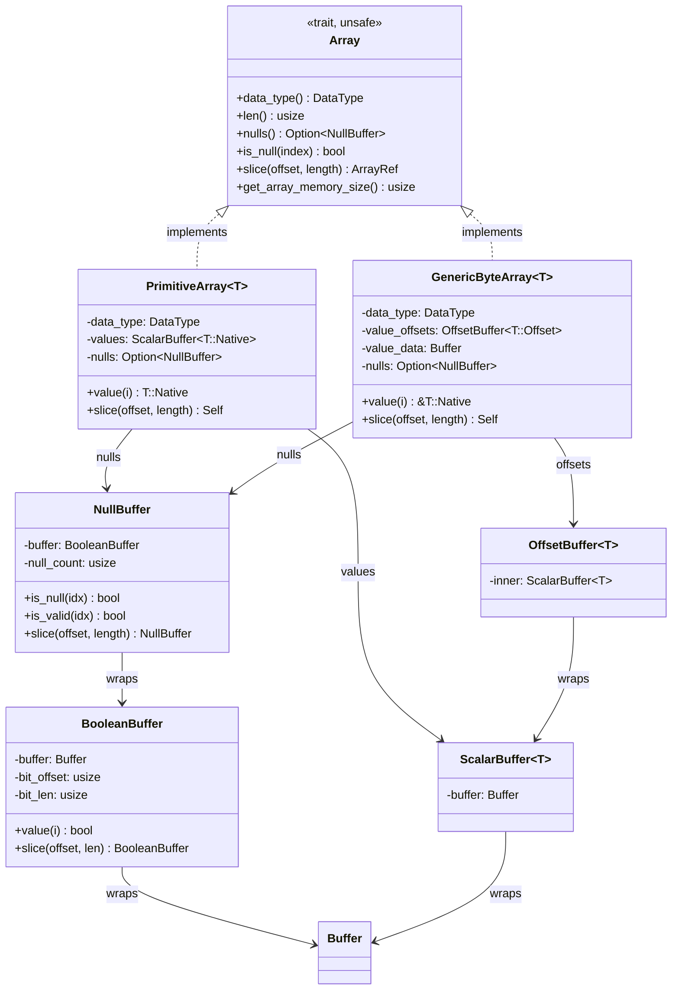
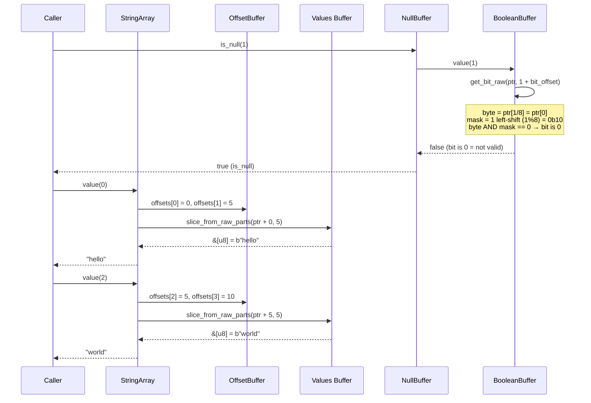

# Module Teardown: Columnar Construction and Bitmaps (`Array`)

## Table of Contents

- [0. Research Focus](#0-research-focus)
- [1. High-Level Overview](#1-high-level-overview)
- [2. Structural Architecture](#2-structural-architecture)
  - [Class Diagram](#class-diagram)
- [3. Execution & Call Flow](#3-execution-call-flow)
  - [StringArray Memory Layout Example](#stringarray-memory-layout-example)
  - [Sequence Diagram: Reading a String Value](#sequence-diagram-reading-a-string-value)
  - [Zero-Copy Slicing: `GenericByteArray::slice(offset, length)`](#zero-copy-slicing-genericbytearraysliceoffset-length)
- [4. Concurrency & State Management](#4-concurrency-state-management)
- [5. Memory & Resource Profile](#5-memory-resource-profile)
- [6. Key Design Insights](#6-key-design-insights)


## 0. Research Focus
* **Task ID:** 1.2
* **Focus:** Inspect the internal fields of a `StringArray`. How does it map to multiple `Buffer`s? Trace the `NullBuffer` implementation — how does Arrow pack 8 null values into a single byte, and how does this contrast with Trino's `boolean[]`?

## 1. High-Level Overview
* **Core Responsibility:** The `Array` trait is the core abstraction for all Arrow columnar data. Concrete implementations (`PrimitiveArray`, `GenericByteArray`/`StringArray`, `BooleanArray`, etc.) compose multiple `Buffer` instances to represent typed columnar data with optional null bitmaps. The `NullBuffer` uses bit-packing (1 bit per value) to represent nullability 8x more efficiently than Trino's `boolean[]` approach.
* **Key Triggers:** Arrays are constructed by operators (from `RecordBatch` columns), by I/O decoders (Parquet → Arrow), and by compute kernels (filter, project, aggregate output). Once constructed, arrays are immutable and shared via `ArrayRef = Arc<dyn Array>`.

## 2. Structural Architecture
* **Primary Source Files:**
  - `arrow-array/src/array/mod.rs` — `Array` trait definition, `ArrayRef` type alias
  - `arrow-array/src/array/primitive_array.rs` — `PrimitiveArray<T>` (Int32Array, Float64Array, etc.)
  - `arrow-array/src/array/byte_array.rs` — `GenericByteArray<T>` (the real struct behind StringArray)
  - `arrow-array/src/array/string_array.rs` — `StringArray` type alias chain
  - `arrow-buffer/src/buffer/null_buffer.rs` — `NullBuffer` (null count cache + `BooleanBuffer`)
  - `arrow-buffer/src/buffer/boolean_buffer.rs` — `BooleanBuffer` (bit-packed buffer with bit-level offset)
  - `arrow-buffer/src/buffer/offset.rs` — `OffsetBuffer<T>` (monotonic offset array for variable-width types)
  - `arrow-buffer/src/buffer/scalar.rs` — `ScalarBuffer<T>` (typed `Buffer` wrapper)

* **Key Data Structures:**
  - `PrimitiveArray<T>` — 3 fields: `DataType`, `ScalarBuffer<T::Native>` (values), `Option<NullBuffer>` (nulls)
  - `GenericByteArray<T>` — 4 fields: `DataType`, `OffsetBuffer<T::Offset>` (offsets), `Buffer` (concatenated values), `Option<NullBuffer>` (nulls)
  - `NullBuffer` — `BooleanBuffer` + cached `null_count: usize`
  - `BooleanBuffer` — `Buffer` + `bit_offset: usize` + `bit_len: usize` (bit-level windowing over a byte-aligned buffer)

### Class Diagram


## 3. Execution & Call Flow

### StringArray Memory Layout Example
For `StringArray::from(vec![Some("hello"), None, Some("world")])`:

```text
Offsets buffer (OffsetBuffer<i32>):
  [0, 5, 5, 10]  — 4 x i32 = 16 bytes
   │  │  │   └── end of "world" (bytes 5..10)
   │  │  └────── null element (offsets[1]==offsets[2], zero-length)
   │  └───────── end of "hello" (bytes 0..5)
   └──────────── start

Values buffer (Buffer):
  b"helloworld"  — 10 bytes, no separator between strings

Null buffer (NullBuffer → BooleanBuffer):
  [0b00000101]   — 1 byte packing 3 bits: bit0=1(valid), bit1=0(null), bit2=1(valid)
  null_count = 1 (cached)
```

### Sequence Diagram: Reading a String Value


* **Step-by-step value access (`value_unchecked(i)`):**
  1. Read `start = offsets[i]` and `end = offsets[i + 1]` from the `OffsetBuffer`.
  2. Compute `length = end - start`.
  3. Create a `&[u8]` slice from `value_data.as_ptr() + start` with `length` bytes.
  4. For `StringArray`, call `std::str::from_utf8_unchecked()` to interpret as `&str`.
  5. No allocation, no copy — just pointer arithmetic into the shared `Buffer`.

### Zero-Copy Slicing: `GenericByteArray::slice(offset, length)`

```rust
pub fn slice(&self, offset: usize, length: usize) -> Self {
    Self {
        data_type: T::DATA_TYPE,
        value_offsets: self.value_offsets.slice(offset, length),  // adjusts offset window
        value_data: self.value_data.clone(),                       // Arc::clone — no copy
        nulls: self.nulls.as_ref().map(|n| n.slice(offset, length)),
    }
}
```

The entire `value_data` buffer is shared. Only the offsets window and null bitmap window are adjusted. A sliced `StringArray` still holds the original value bytes — the offsets correctly index into the shared buffer.

## 4. Concurrency & State Management
* **Threading Model:** The `Array` trait requires `Send + Sync`. All concrete array types are immutable after construction. Cross-thread sharing is via `ArrayRef = Arc<dyn Array>`, which provides atomic reference counting. No locks are needed because the data is never mutated.
* **`unsafe trait Array`:** The trait is marked `unsafe` because implementations must guarantee compliance with the Arrow specification. Incorrect implementations (wrong offset calculations, invalid buffer lengths) can cause undefined behavior since the runtime trusts length/offset values for direct memory indexing without bounds checks.
* **Downcasting:** `as_any()` enables runtime downcasting from `&dyn Array` to concrete types like `&Int32Array`. This is Arrow's mechanism for type-specific processing in compute kernels.

## 5. Memory & Resource Profile
* **PrimitiveArray overhead:** 3 fields — `DataType` (enum, typically 16-32 bytes), `ScalarBuffer` (24 bytes — wraps a `Buffer`), `Option<NullBuffer>` (0 or ~56 bytes). Per-element cost: `size_of::<T>` bytes for value + 1 bit for null bitmap (if present).
* **StringArray overhead:** 4 fields — `DataType` (~16 bytes), `OffsetBuffer` (24 bytes), `Buffer` (24 bytes), `Option<NullBuffer>` (0 or ~56 bytes). Per-element cost: 4 bytes (i32 offset) + variable string bytes + 1 bit for null bitmap.
* **NullBuffer memory savings vs Trino:**

| Rows | Arrow NullBuffer | Trino boolean[] | Savings |
|---|---|---|---|
| 1,000 | 125 bytes | 1,000 bytes | 8x |
| 1,000,000 | ~122 KB | ~977 KB | 8x |
| 100 columns x 1M rows | ~12 MB | ~93 MB | ~81 MB saved |

* **`Option<NullBuffer>` optimization:** When a column has no nulls, the null buffer is `None` — no bitmap is allocated. This is common in practice (many columns are NOT NULL) and saves both memory and the cost of checking the bitmap on every access.

## 6. Key Design Insights

* **Bit-packing null checks cost 2 integer ops.** The `is_null(i)` call chain bottoms out at `get_bit_raw(ptr, i + bit_offset)`: `(*ptr.add(i / 8) & (1 << (i % 8))) != 0`. This is 1 divide, 1 shift, 1 AND, and 1 compare — negligible compared to the 8x memory savings. Arrow also provides `BitChunks` for bulk 64-bit-at-a-time bitmap processing, making batch operations near-optimal.

* **Arrow validity convention is inverted from intuition.** Bit = 1 means **valid** (not null), bit = 0 means **null**. `is_null()` returns `true` when the bit is 0. This means an all-ones bitmap represents "no nulls" and an all-zeros bitmap represents "all nulls."

* **`BooleanBuffer::slice()` is always zero-copy.** Unlike byte-level `Buffer::slice()` which adjusts a pointer, `BooleanBuffer::slice()` adjusts a `bit_offset` field. Subsequent `value(i)` calls add this offset: `get_bit_raw(ptr, i + self.bit_offset)`. The underlying byte buffer is shared via `Arc`. The `NullBuffer::slice()` must recompute `null_count` (via popcount) because it cannot derive the subset's count from the parent's count.

* **`OffsetBuffer` enforces monotonicity at construction.** The offsets array must be monotonically non-decreasing (each offset >= the previous). This invariant is checked in safe construction paths and assumed in unsafe paths. It guarantees that `offsets[i+1] - offsets[i] >= 0` for every element, so string length computations never produce negative values.

* **GenericByteArray slicing shares the full values buffer.** When you slice a `StringArray`, the `value_data` buffer is `Arc::clone`d (shared entirely), not trimmed. Only the `OffsetBuffer` window shrinks. This means a slice of 10 rows from a million-row `StringArray` still holds a reference to the full concatenated string bytes. This is a deliberate tradeoff: O(1) slice vs. potential memory retention of unreferenced string data.

* **`StringArray` is a type alias chain, not a separate struct.** `StringArray = GenericStringArray<i32> = GenericByteArray<GenericStringType<i32>>`. `LargeStringArray` uses `i64` offsets for arrays with >2GB of string data. `BinaryArray` uses the same `GenericByteArray` with `GenericBinaryType`, sharing the identical offset+values+nulls layout but without the UTF-8 invariant.

* **`PrimitiveArray` stores values at null positions.** The values buffer has entries for every index, including null positions. The values at null positions are arbitrary (not zeroed). The null bitmap is the sole source of truth for validity. This avoids branch-heavy "skip nulls during write" logic and enables SIMD processing of the values buffer without masking.
