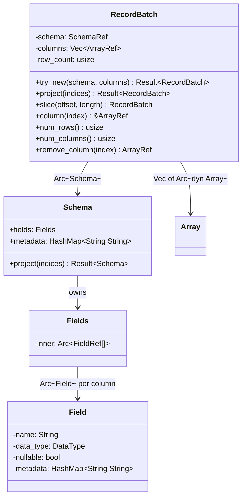
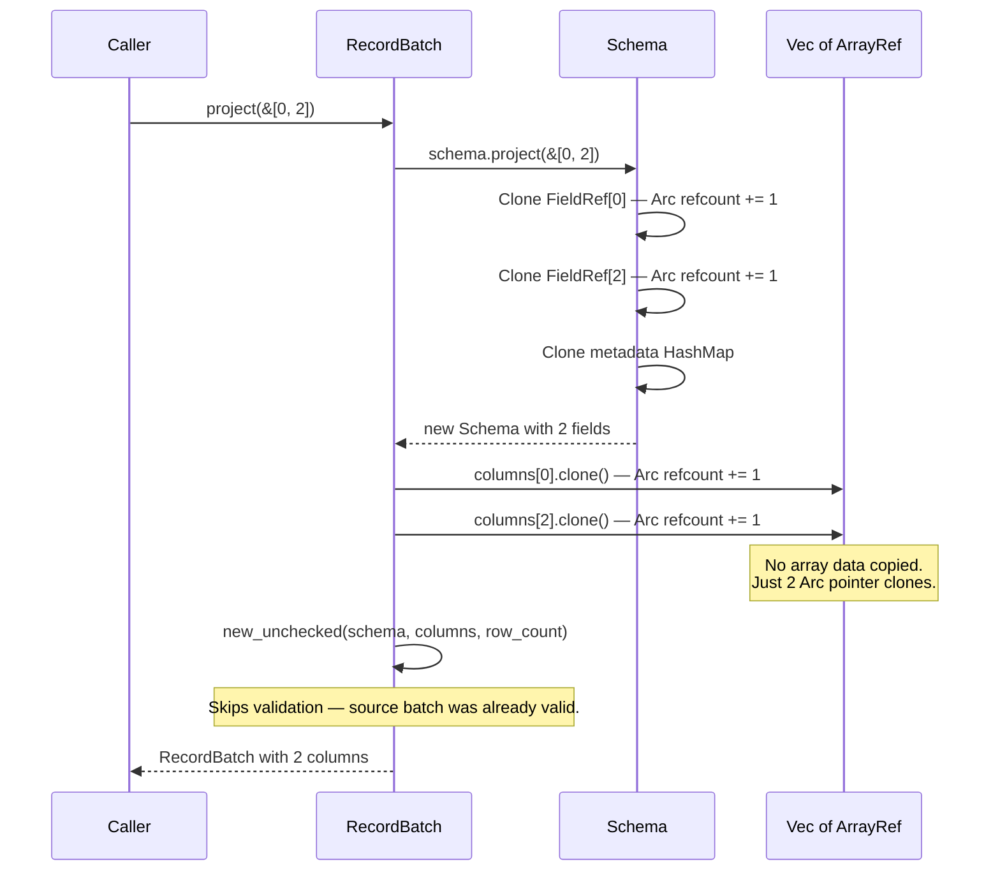

# Module Teardown: The `RecordBatch` Envelope

## Table of Contents

- [0. Research Focus](#0-research-focus)
- [1. High-Level Overview](#1-high-level-overview)
- [2. Structural Architecture](#2-structural-architecture)
  - [Class Diagram](#class-diagram)
- [3. Execution & Call Flow](#3-execution-call-flow)
  - [Sequence Diagram: project() — Zero-Copy Column Selection](#sequence-diagram-project-zero-copy-column-selection)
  - [`project()` Implementation (exact source)](#project-implementation-exact-source)
  - [`slice()` Implementation](#slice-implementation)
  - [`try_new()` — Validated Construction](#try_new-validated-construction)
- [4. Concurrency & State Management](#4-concurrency-state-management)
- [5. Memory & Resource Profile](#5-memory-resource-profile)
- [6. Key Design Insights](#6-key-design-insights)


## 0. Research Focus
* **Task ID:** 1.3
* **Focus:** Analyze `RecordBatch::project()`. Confirm that it is a zero-copy operation manipulating `Arc<dyn Array>`. Compare its memory overhead to Trino's `Page`.

## 1. High-Level Overview
* **Core Responsibility:** `RecordBatch` is Arrow's 2D columnar data container — a self-describing envelope holding a `Schema` and a vector of `ArrayRef` columns with a common row count. Like Trino's `Page`, it is a passive payload with no compute methods. Projection and slicing are O(1) operations that clone `Arc` pointers without touching row data.
* **Key Triggers:** `RecordBatch` instances are produced by data source streams (Parquet, CSV readers), by compute kernels (filter, project, aggregate output), and by the execution engine's stream infrastructure. They flow through the operator pipeline as the fundamental unit of data exchange.

## 2. Structural Architecture
* **Primary Source Files:**
  - `arrow-array/src/record_batch.rs` — `RecordBatch` struct, `try_new()`, `project()`, `slice()`, `new_unchecked()`
  - `arrow-schema/src/schema.rs` — `Schema` struct, `SchemaRef = Arc<Schema>`
  - `arrow-schema/src/field.rs` — `Field` struct, `FieldRef = Arc<Field>`
  - `arrow-schema/src/fields.rs` — `Fields = Arc<[FieldRef]>` (reference-counted field list)

* **Key Data Structures:**
  - `RecordBatch` — `SchemaRef` + `Vec<Arc<dyn Array>>` + `row_count: usize`
  - `Schema` — `Fields` (column definitions) + `HashMap<String, String>` (metadata)
  - `Fields` — `Arc<[FieldRef]>` — doubly reference-counted: the slice itself is `Arc`, and each element is `Arc<Field>`
  - `Field` — `name: String` + `data_type: DataType` + `nullable: bool` + `metadata: HashMap<String, String>`
  - `SchemaRef` — `Arc<Schema>` — the batch shares the schema with other batches via reference counting

### Class Diagram


## 3. Execution & Call Flow

### Sequence Diagram: project() — Zero-Copy Column Selection


### `project()` Implementation (exact source)

```rust
pub fn project(&self, indices: &[usize]) -> Result<RecordBatch, ArrowError> {
    let projected_schema = self.schema.project(indices)?;
    let batch_fields = indices
        .iter()
        .map(|f| {
            self.columns.get(*f).cloned().ok_or_else(|| {
                ArrowError::SchemaError(format!(
                    "project index {} out of bounds, max field {}",
                    f, self.columns.len()
                ))
            })
        })
        .collect::<Result<Vec<_>, _>>()?;

    unsafe {
        Ok(RecordBatch::new_unchecked(
            SchemaRef::new(projected_schema),
            batch_fields,
            self.row_count,
        ))
    }
}
```

* **Step-by-step breakdown:**
  1. `schema.project(indices)` — creates a new `Schema` by cloning `FieldRef` entries (Arc increments) for the selected indices. The metadata `HashMap` is cloned.
  2. `self.columns.get(*f).cloned()` — `.cloned()` on `&Arc<dyn Array>` calls `Arc::clone()`, incrementing the atomic refcount. No array data is copied.
  3. `new_unchecked()` — directly stores the new schema, column Vec, and same `row_count`. Validation is skipped because the source batch was already validated.

**Complexity:** O(K) where K = number of projected columns. Independent of row count.

### `slice()` Implementation

```rust
pub fn slice(&self, offset: usize, length: usize) -> RecordBatch {
    assert!((offset + length) <= self.num_rows());
    let columns = self.columns()
        .iter()
        .map(|column| column.slice(offset, length))
        .collect();
    Self { schema: self.schema.clone(), columns, row_count: length }
}
```

Delegates to `Array::slice()` on each column. Each column slice adjusts buffer pointers/offsets and increments `Arc` refcounts on the underlying `Buffer`s. No data is copied.

### `try_new()` — Validated Construction

```rust
pub fn try_new(schema: SchemaRef, columns: Vec<ArrayRef>) -> Result<Self, ArrowError> { ... }
```

Performs four validations:
1. Column count matches schema field count
2. Non-nullable fields have zero null count
3. All columns have the same row count
4. Each column's `data_type()` matches its schema field's type

Failure at any step returns an `ArrowError`, not a panic.

## 4. Concurrency & State Management
* **Threading Model:** `RecordBatch` is `Send + Sync` by construction — `Arc<Schema>` and `Vec<Arc<dyn Array>>` are both thread-safe. Batches flow freely across Tokio task boundaries without copying.
* **Immutability:** `RecordBatch` has no `&mut self` methods that modify existing columns. `remove_column(index)` returns the removed `ArrayRef` and produces a new batch. The underlying array data is never mutated.
* **Schema sharing:** Multiple batches from the same stream typically share a single `Arc<Schema>` (the schema is cloned from the `ExecutionPlan`'s schema at stream creation). The `Arc` refcount tracks how many batches reference the schema.

## 5. Memory & Resource Profile
* **Envelope overhead (stack):**
  - `SchemaRef` (`Arc<Schema>` pointer): 8 bytes
  - `Vec<Arc<dyn Array>>`: 24 bytes (ptr + len + capacity)
  - `row_count`: 8 bytes
  - **Total stack**: 40 bytes

* **Envelope overhead (heap):**
  - `Vec` backing array: K × 16 bytes (each `Arc<dyn Array>` is a fat pointer: 8-byte data + 8-byte vtable)
  - `Arc<Schema>` control block: 16 bytes (strong + weak counts)
  - `Schema` struct: `Fields` (`Arc<[FieldRef]>`) + metadata `HashMap`
  - Each `Field`: ~80-120 bytes (String name + DataType enum + metadata HashMap)

* **Data memory:** Zero additional. The `RecordBatch` envelope does not own any row data — it holds `Arc` references to the same `Buffer` allocations that the `Array` instances use. Multiple batches can share the same underlying buffers.

* **Project vs. Trino comparison:**

| Operation | Arrow RecordBatch | Trino Page |
|---|---|---|
| Column type | `Arc<dyn Array>` (16 bytes each) | `Block` reference (8 bytes each) |
| Projection cost | K × `Arc::clone` (atomic increment) | K × Java reference copy |
| Copies data? | No | No |
| Schema attached? | Yes (`Arc<Schema>`) — self-describing | No — tracked externally by operators |
| Thread safety | Built-in via `Arc` (`Send + Sync`) | Requires explicit handoff |
| Slice cost | K × `Array::slice()` (pointer adjust + Arc clone per buffer) | K × `Block.getRegion()` (similar) |

## 6. Key Design Insights

* **`RecordBatch` is self-describing; Trino's `Page` is not.** Arrow attaches `Arc<Schema>` to every batch, enabling runtime type checking at batch boundaries (`try_new` validates types). Trino's `Page` has no schema — type correctness is enforced by pipeline construction, not by the data container. The Arrow approach catches type mismatches earlier (batch creation time) but costs one `Arc<Schema>` per batch.

* **`new_unchecked` bypasses validation for internal paths.** `project()` and `slice()` use `unsafe { new_unchecked(...) }` because the source batch was already validated. This avoids redundant O(K) type checking on every projection. The safety argument: a valid batch projected to a subset of its columns is always valid.

* **`Fields = Arc<[FieldRef]>` is doubly reference-counted.** Cloning `Fields` increments the outer `Arc`'s refcount (one atomic op for all fields). Projecting individual fields clones inner `FieldRef = Arc<Field>` entries. This two-level structure makes full-schema sharing O(1) while field-level projection is O(K).

* **`row_count` is stored separately for the zero-column edge case.** A `RecordBatch` can have zero columns but a non-zero row count (e.g., `SELECT count(*) FROM ...` intermediate results). Without the explicit `row_count` field, `num_rows()` would have no column to query.

* **Projection does not compact the underlying buffers.** After `project(&[0, 2])`, the excluded column's `Array` (column 1) still exists in memory until all other references to it are dropped. The `RecordBatch` only drops its `Arc` reference — if another batch or stream holds a reference, the data persists. This is the same behavior as Trino's `Page.getColumns()` creating a new `Block[]` without freeing the excluded blocks.
