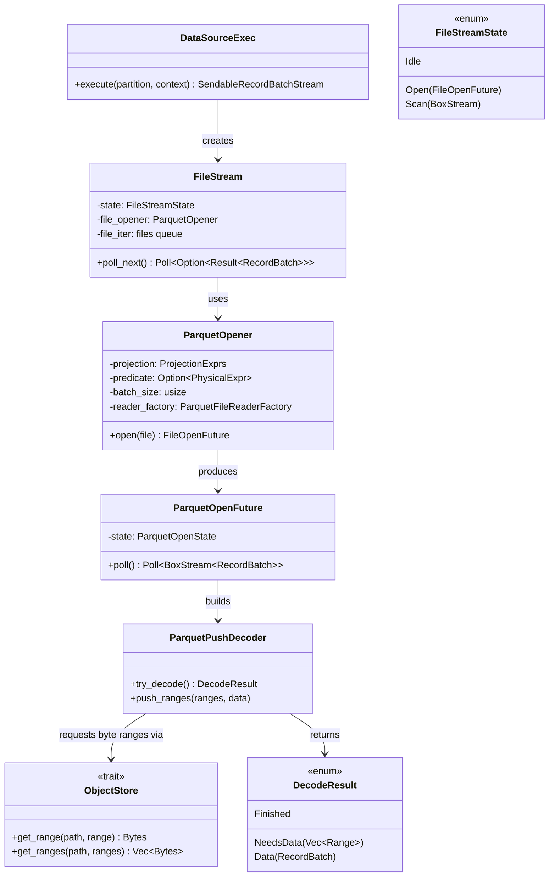
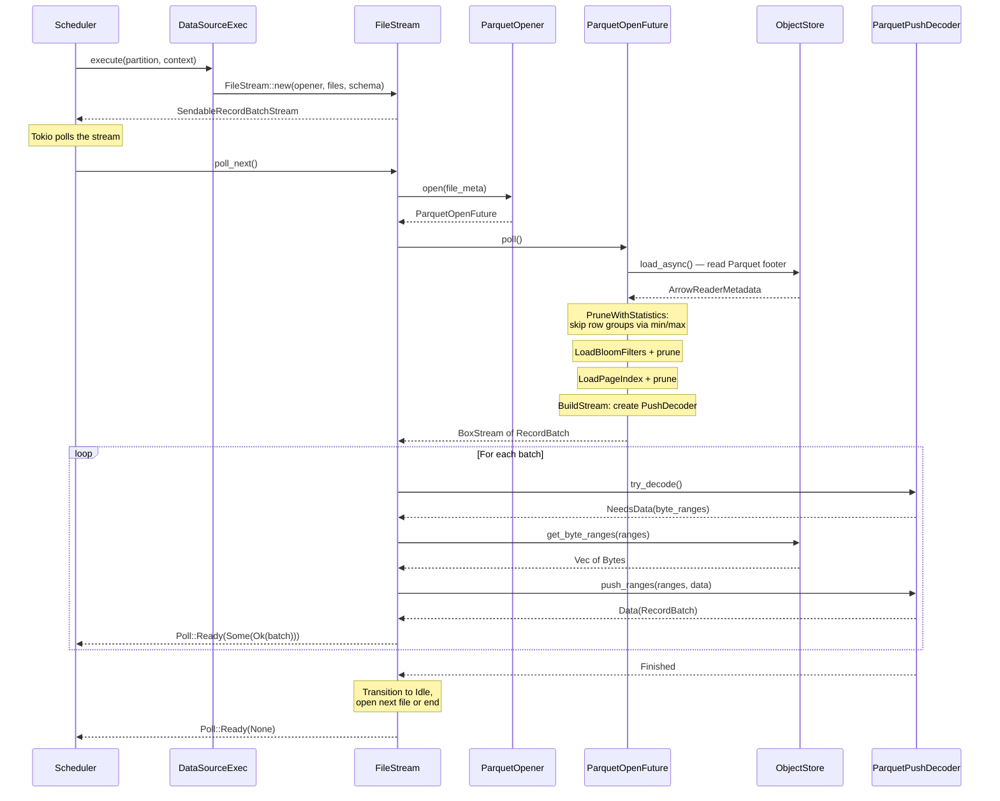

# Module Teardown: Async Physical Data Mapping (The S3 Bridge)

## Table of Contents

- [0. Research Focus](#0-research-focus)
- [1. High-Level Overview](#1-high-level-overview)
- [2. Structural Architecture](#2-structural-architecture)
  - [Class Diagram](#class-diagram)
- [3. Execution & Call Flow](#3-execution-call-flow)
  - [Sequence Diagram: Full Parquet Read Path](#sequence-diagram-full-parquet-read-path)
- [4. Concurrency & State Management](#4-concurrency-state-management)
- [5. Memory & Resource Profile](#5-memory-resource-profile)
- [6. Key Design Insights](#6-key-design-insights)

## 0. Research Focus
* **Task ID:** 1.4
* **Focus:** Trace the execution of `ParquetExec::execute()`. How does it interact with `object_store` to fetch byte ranges asynchronously? Trace `ParquetRecordBatchStream` to see how `tokio::spawn` is used to parallelize I/O and decoding.

## 1. High-Level Overview
* **Core Responsibility:** The Parquet ingestion pipeline bridges object storage (S3, GCS, local files) to Arrow `RecordBatch` streams. It is orchestrated by `DataSourceExec` + `ParquetSource`, which creates a multi-stage state machine (`ParquetOpener`) that loads metadata, prunes row groups via statistics/bloom filters/page indexes, and drives a push-based decoder that separates I/O from CPU decode work.
* **Key Triggers:** Execution begins when the scheduler calls `DataSourceExec::execute(partition, context)`. Each file group (set of files assigned to a partition) is processed sequentially within the partition, while partitions run concurrently as separate Tokio tasks.

## 2. Structural Architecture
* **Primary Source Files:**
  - `datafusion/datasource/src/source.rs` — `DataSourceExec::execute()` entry point
  - `datafusion/datasource/src/file_scan_config.rs` — `FileScanConfig::open()`, creates `FileStream` + opener
  - `datafusion/datasource/src/file_stream/mod.rs` — `FileStream` outer loop: Idle → Open → Scan state machine
  - `datafusion/datasource-parquet/src/source.rs` — `ParquetSource`, `create_file_opener()`
  - `datafusion/datasource-parquet/src/opener.rs` — `ParquetOpener` + `ParquetOpenFuture` (1574 lines, the core state machine)
  - `datafusion/datasource-parquet/src/reader.rs` — `ParquetFileReaderFactory`, metrics wrapper
  - `datafusion/datasource-parquet/src/row_filter.rs` — Row-level predicate pushdown, projection mask building
  - `datafusion/datasource-parquet/src/row_group_filter.rs` — Row group pruning via statistics
  - `datafusion/datasource-parquet/src/page_filter.rs` — Page-level pruning via page index
  - `parquet/src/arrow/async_reader/store.rs` (arrow-rs) — `ParquetObjectReader` (ObjectStore → AsyncFileReader bridge)

* **Key Data Structures:**
  - `FileStream` — State machine: `Idle` (pop next file) → `Open` (poll `FileOpenFuture`) → `Scan` (poll inner batch stream). Implements `RecordBatchStream`.
  - `ParquetOpenFuture` — Hand-written `Future::poll` with 11-state enum: `Start` → `LoadEncryption?` → `PruneFile` → `LoadMetadata` → `PrepareFilters` → `LoadPageIndex` → `PruneWithStatistics` → `LoadBloomFilters` → `PruneWithBloomFilters` → `BuildStream` → `Done`.
  - `ParquetPushDecoder` (arrow-rs) — Demand-driven decoder: `try_decode()` returns `NeedsData(ranges)` or `Data(batch)` or `Finished`. Separates I/O requests from decode logic.
  - `ParquetObjectReader` (arrow-rs) — Bridges `ObjectStore` trait to `AsyncFileReader` trait. Translates byte range requests into `ObjectStore::get_range()`/`get_ranges()` calls.

### Class Diagram

## 3. Execution & Call Flow

### Sequence Diagram: Full Parquet Read Path

* **Step-by-step breakdown:**
  1. **Partition assignment:** `DataSourceExec::execute(partition)` resolves the `ObjectStore` and creates a `FileStream` with a `ParquetOpener` and the list of files for this partition.
  2. **File opening (ParquetOpenFuture):** A hand-written 11-state `Future::poll` that drives metadata loading, multi-level pruning, and decoder construction. CPU-only states execute in a loop; I/O states yield `Poll::Pending`.
  3. **Metadata loading:** `ArrowReaderMetadata::load_async()` reads the Parquet footer from object storage. The footer size hint can reduce this to a single HTTP request.
  4. **Four-level pruning cascade:**
     - **File-level:** `FilePruner::should_prune()` — skips entire files using file statistics + partition values.
     - **Row group-level:** `PruningPredicate` with min/max statistics + bloom filters.
     - **Page-level:** `PagePruningAccessPlanFilter` using page index min/max → generates `RowSelection`.
     - **Row-level:** `RowFilter` with `ArrowPredicate`s applied during decoding (late materialization — filter columns decoded first, then predicate evaluated, then remaining columns decoded for matching rows only).
  5. **Push-based decode loop:** `ParquetPushDecoder::try_decode()` returns `NeedsData(ranges)` (byte ranges needed), `Data(batch)` (decoded batch), or `Finished`. The caller fetches bytes from `ObjectStore` and pushes them into the decoder. This separates I/O scheduling from decode logic.
  6. **CooperativeStream wrapper:** Each returned batch consumes a unit of Tokio's cooperative scheduling budget, preventing CPU-heavy decoding from starving other tasks.

## 4. Concurrency & State Management
* **Threading Model:** No intra-partition thread spawning. All work within a single partition (file open, metadata load, decode) runs on a single Tokio task. There are zero occurrences of `tokio::spawn` or `SpawnedTask` in the datasource-parquet read path. Parallelism comes from:
  1. **Inter-partition:** Each file group is a separate execution partition; the scheduler runs partitions as concurrent Tokio tasks.
  2. **Async I/O overlap:** While one partition waits for I/O (`Poll::Pending`), Tokio's work-stealing scheduler runs other partitions.
  3. **ObjectStore batching:** `get_ranges()` can fetch multiple column chunks in a single HTTP request (implementation-dependent).
* **State Machine:** `ParquetOpenFuture` is an explicit `enum` state machine (not `async fn`) for precise control over I/O vs. CPU transitions. CPU-only states execute in a tight loop without yielding, minimizing context switches.
* **No Shared Mutable State:** Each partition's `FileStream` is fully independent. No cross-partition locks, channels, or shared counters in the read path.

## 5. Memory & Resource Profile
* **I/O Pattern:** Byte-range reads via `ObjectStore::get_range()` / `get_ranges()`. Column chunks are fetched as `Bytes` (reference-counted byte buffers from the `bytes` crate). These are passed to the Parquet decoder, which maps them directly into Arrow `Buffer`s via zero-copy `From<bytes::Bytes>` conversion (see Task 1.1).
* **Memory Tracking:** `ParquetFileReader` wraps the underlying reader with DataFusion metrics: `bytes_scanned`, `scan_efficiency_ratio`, `metadata_load_time`, and 14 other per-file metrics. Memory used for buffered column chunks is transient — held only during decode, then released as the decoder produces `RecordBatch`es.
* **Projection Pushdown:** `ProjectionMask` ensures only requested columns are read from the Parquet file. Unreferenced columns are never fetched from object storage or decoded.
* **Row Group Metadata:** The Parquet footer is loaded once per file and held in memory during the file's scan. For files with many row groups, this can be significant (bloom filters and page indexes are loaded lazily on demand).

## 6. Key Design Insights

* **Hand-written `Future::poll` state machine over async/await.** The `ParquetOpenFuture` uses an explicit 11-state enum rather than `async fn`. This gives precise control over yielding: CPU-only states (pruning, filter preparation) execute in a tight loop without ever returning `Poll::Pending`, while I/O states (metadata load, bloom filter fetch) yield to Tokio. An `async fn` would yield at every `.await` point, including between CPU-only operations, adding unnecessary context switches.

* **Push-based decoder separates I/O from compute.** The `ParquetPushDecoder` never performs I/O itself. It declares what byte ranges it needs (`NeedsData`), the caller fetches them from any source (object store, local file, in-memory cache), and pushes them in. This clean separation allows the same decoder to work with any I/O backend and enables future optimizations like prefetching or caching without modifying the decoder.

* **No intra-partition spawning — all parallelism is at the partition level.** This is a deliberate simplification over Trino's model (where a single task can have multiple driver threads). DataFusion avoids intra-partition thread synchronization entirely. The tradeoff: a single large file cannot be decoded in parallel within one partition. Instead, large tables should be split into many small files across many partitions.

* **Four-level predicate cascade with lazy metadata loading.** File → Row Group → Page → Row. Each deeper level is more expensive but more precise. Metadata for deeper levels is loaded only when needed: page index is fetched only if a page pruning predicate exists, bloom filters only if predicate columns have them. This avoids wasting I/O on metadata that won't be used.

* **Schema evolution at read time.** The `PrepareFilters` stage adapts predicates and projections to each file's physical schema. Missing columns are filled with nulls, type coercions are applied automatically, and INT96 timestamps are converted. This means different files in the same table can have different schemas — the reader handles the mismatch per-file.

* **`CooperativeStream` prevents CPU starvation.** After each batch, the wrapper calls `tokio::task::consume_budget().await`, which yields control to Tokio if the task has consumed its cooperative scheduling budget. Without this, a CPU-heavy decode loop could starve other tasks sharing the same Tokio worker thread. This is DataFusion's analog to Trino's 1-second time quantum, but at batch granularity rather than wall-clock time.
