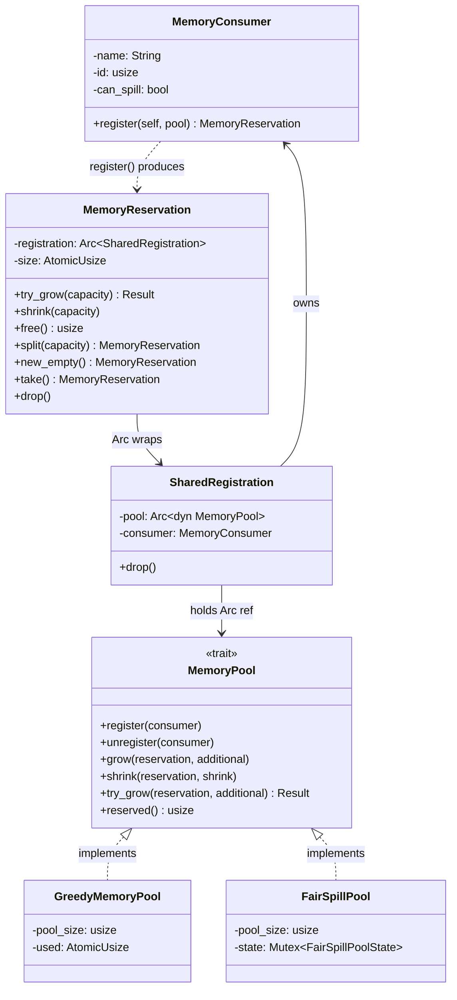
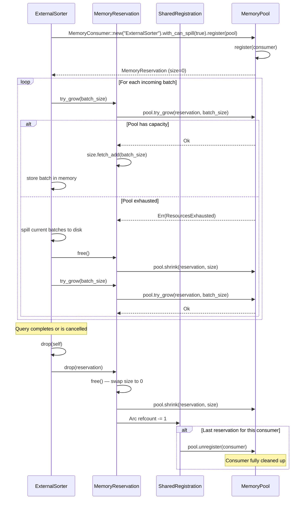

# Module Teardown: RAII Memory Accounting

## Table of Contents

- [0. Research Focus](#0-research-focus)
- [1. High-Level Overview](#1-high-level-overview)
- [2. Structural Architecture](#2-structural-architecture)
  - [Class Diagram](#class-diagram)
- [3. Execution & Call Flow](#3-execution-call-flow)
  - [Sequence Diagram: Reservation Lifecycle (Sort Operator)](#sequence-diagram-reservation-lifecycle-sort-operator)
  - [`try_grow()` — The Gatekeeper](#try_grow-the-gatekeeper)
  - [`Drop` — The RAII Guarantee](#drop-the-raii-guarantee)
  - [`split()` — Zero-Pool-Interaction Transfer](#split-zero-pool-interaction-transfer)
- [4. Concurrency & State Management](#4-concurrency-state-management)
- [5. Memory & Resource Profile](#5-memory-resource-profile)
- [6. Key Design Insights](#6-key-design-insights)
  - [Comparison with Trino's Memory Model](#comparison-with-trinos-memory-model)


## 0. Research Focus
* **Task ID:** 1.5
* **Focus:** Analyze the `MemoryReservation` struct. Trace its `try_grow()` method and its `Drop` implementation. How does this Rust-native approach prevent the under-counting issues possible in Trino's GC-based `getRetainedSizeInBytes()` model?

## 1. High-Level Overview
* **Core Responsibility:** `MemoryReservation` is the RAII handle that operators hold to track and limit their memory usage against a shared `MemoryPool`. It provides the complete API for growing, shrinking, splitting, and freeing memory. On `Drop`, it automatically returns all tracked bytes to the pool — a guarantee enforced by the Rust compiler, not by developer discipline.
* **Key Triggers:** Created when an operator registers a `MemoryConsumer` with the pool. Grown via `try_grow()` before each buffering allocation. Shrunk after spilling. Automatically freed on drop when the operator's stream terminates or is cancelled.

## 2. Structural Architecture
* **Primary Source Files:**
  - `datafusion/execution/src/memory_pool/mod.rs` — `MemoryPool` trait, `MemoryConsumer`, `SharedRegistration`, `MemoryReservation`
  - `datafusion/execution/src/memory_pool/pool.rs` — `GreedyMemoryPool`, `FairSpillPool`, `UnboundedMemoryPool`, `TrackConsumersPool`
  - `datafusion/execution/src/runtime_env.rs` — `RuntimeEnv` holds `Arc<dyn MemoryPool>`
  - `datafusion/execution/src/task.rs` — `TaskContext` exposes `memory_pool()` to operators
  - `datafusion/common/src/utils/memory.rs` — `estimate_memory_size()`, `get_record_batch_memory_size()`
  - `datafusion/common/src/utils/proxy.rs` — `VecAllocExt`, `HashTableAllocExt` (incremental tracking helpers)

* **Key Data Structures:**
  - `MemoryReservation` — `Arc<SharedRegistration>` + `AtomicUsize` size. The RAII handle.
  - `SharedRegistration` — `Arc<dyn MemoryPool>` + `MemoryConsumer`. Calls `pool.unregister()` on `Drop`. Shared via `Arc` across split reservations.
  - `MemoryConsumer` — `name: String` + `id: usize` (process-unique) + `can_spill: bool`. One-shot factory: `register(self, pool)` consumes it.
  - `GreedyMemoryPool` — `pool_size: usize` + `AtomicUsize` used. Lock-free, first-come-first-served.
  - `FairSpillPool` — `pool_size: usize` + `Mutex<FairSpillPoolState>` tracking `num_spill`, `spillable`, `unspillable` bytes.

### Class Diagram


## 3. Execution & Call Flow

### Sequence Diagram: Reservation Lifecycle (Sort Operator)


* **Step-by-step breakdown:**
  1. **Registration:** `MemoryConsumer::new("ExternalSorter").register(pool)` creates a `SharedRegistration` wrapping the pool + consumer, wrapped in an `Arc`, paired with an `AtomicUsize` size = 0.
  2. **Growth:** `try_grow(batch_size)` calls `pool.try_grow()` first — if the pool has capacity, the pool's counter is incremented atomically, then the reservation's local `size` is incremented. If the pool rejects, the operator must spill or fail.
  3. **Spill-and-retry:** On `Err(ResourcesExhausted)`, the sort operator spills buffered batches to disk, calls `free()` (returns all bytes to pool), then retries `try_grow()` for the new batch.
  4. **Drop guarantee:** When the operator is dropped (stream completes, query cancelled, or panic unwind), `MemoryReservation::drop()` calls `free()`, which atomically swaps size to 0 and calls `pool.shrink()`. The compiler guarantees this runs.
  5. **Consumer cleanup:** When the last `MemoryReservation` sharing a `SharedRegistration` is dropped, `Arc`'s refcount reaches 0, triggering `SharedRegistration::drop()` which calls `pool.unregister()`.

### `try_grow()` — The Gatekeeper

```rust
pub fn try_grow(&self, capacity: usize) -> Result<()> {
    self.registration.pool.try_grow(self, capacity)?;
    self.size.fetch_add(capacity, atomic::Ordering::Relaxed);
    Ok(())
}
```

Pool approval FIRST, then local increment. If the pool returns `Err`, the local size is never changed.

### `Drop` — The RAII Guarantee

```rust
impl Drop for MemoryReservation {
    fn drop(&mut self) {
        self.free();
    }
}

pub fn free(&self) -> usize {
    let size = self.size.swap(0, atomic::Ordering::Relaxed);
    if size != 0 {
        self.registration.pool.shrink(self, size);
    }
    size
}
```

`free()` atomically swaps size to 0 and returns the bytes to the pool. Idempotent — calling `free()` on a zero-size reservation is a no-op.

### `split()` — Zero-Pool-Interaction Transfer

```rust
pub fn split(&self, capacity: usize) -> MemoryReservation {
    self.size.fetch_update(..., |prev| prev.checked_sub(capacity)).unwrap();
    Self {
        size: atomic::AtomicUsize::new(capacity),
        registration: Arc::clone(&self.registration),
    }
}
```

Transfers bytes from one reservation to a new one sharing the same `SharedRegistration`. No pool call needed — the total pool-tracked amount is unchanged.

## 4. Concurrency & State Management
* **Threading Model:** `MemoryReservation` uses `AtomicUsize` for its size field, making it safe to call `try_grow`/`shrink`/`free` from any thread. The `SharedRegistration` is wrapped in `Arc` for cross-thread sharing.
* **Pool-Level Synchronization:**
  - `GreedyMemoryPool`: Lock-free. Uses `AtomicUsize::fetch_update()` (CAS loop) for both `try_grow` and `shrink`. A single atomic instruction on most architectures.
  - `FairSpillPool`: Uses `Mutex<FairSpillPoolState>` because it must read and update `num_spill`, `spillable`, and `unspillable` atomically.
  - `TrackConsumersPool`: Uses `Mutex<HashMap<usize, TrackedConsumer>>` for per-consumer tracking.
* **No Blocking/Futures on Exhaustion:** Unlike Trino (which returns a `ListenableFuture` when the pool is full, causing the driver to yield and resume later), DataFusion returns `Err(ResourcesExhausted)` immediately. The operator must handle this synchronously — either spill and retry, or propagate the error.

## 5. Memory & Resource Profile
* **Reservation Overhead:** `Arc<SharedRegistration>` (8 bytes pointer) + `AtomicUsize` (8 bytes) = 16 bytes per reservation. Negligible.
* **Pool Overhead:** `GreedyMemoryPool` = 16 bytes (`usize` + `AtomicUsize`). `FairSpillPool` = `usize` + `Mutex` (~40 bytes). No per-query or per-task tracking structures.
* **Estimation Helpers:**
  - `estimate_memory_size::<T>(num_rows, fixed_size)` — models hashbrown's allocation: `capacity = (num_rows * 8 / 7).next_power_of_two()`, accounting for load factor and bucket alignment.
  - `get_record_batch_memory_size(batch)` — sums each column's `get_array_memory_size()`, deduplicating shared buffers.
  - `VecAllocExt::push_accounted(&mut self, x, accounting)` — tracks `Vec` capacity growth incrementally, catching reallocation events.

## 6. Key Design Insights

* **`MemoryConsumer::register()` consumes `self`, preventing double-registration.** The method signature is `pub fn register(self, pool)` — taking `self` by value. After registration, the consumer is moved into the `SharedRegistration` and cannot be reused. The type system makes double-registration a compile error, not a runtime bug.

* **`Arc<SharedRegistration>` enables N:1 reservation multiplexing.** Multiple reservations can share one consumer identity (via `split()` and `new_empty()`). When the last reservation drops, `SharedRegistration::drop()` calls `pool.unregister()`. This is reference counting as lifecycle management — replacing the explicit register/unregister bookkeeping that Trino must do.

* **The "declare before allocate" convention is NOT compiler-enforced.** Rust does not force `try_grow` before `Vec::push`. It is a convention. But it is easy to follow (the API is simple) and easy to audit (every buffering operator should have a `MemoryReservation` field). In Trino, the equivalent convention (implement `getRetainedSizeInBytes()` accurately on every data structure) is harder to audit because accuracy requires understanding every internal allocation path.

* **No GC timing gap.** In Trino, there can be seconds between when an operator nulls a reference and when the GC frees the memory. During that window, the pool's view of available memory is wrong. In DataFusion, `MemoryReservation::drop()` and the actual memory deallocation happen in the same synchronous call stack — zero gap.

* **`can_spill` is a contract, not a hint.** Setting `can_spill = true` is a promise that the operator will handle `ResourcesExhausted` by spilling to disk. `FairSpillPool` actively relies on this: each spillable consumer gets at most `(pool_size - unspillable) / num_spill`. An operator that lies (sets `can_spill = true` but doesn't handle errors) will receive unrecoverable errors from `try_grow`.

* **Multi-consumer operators separate spillable from non-spillable memory.** `ExternalSorter` creates two consumers: a spillable main reservation for buffered input and a non-spillable merge reservation for the final merge phase. `RepartitionExec` similarly splits its memory. This pattern ensures the operator always has enough memory for its non-optional work, while allowing the optimizer to reclaim the optional buffers under pressure.

* **Pragmatic, not total, accounting.** The design philosophy (documented in `mod.rs`): "Intermediate memory used as data streams through the system is not accounted (it is assumed to be 'small') but the large consumers must register and constrain their use." Streaming operators (Filter, Projection) that process one batch at a time without buffering are not tracked. Only operators that accumulate data proportional to input size (Sort, HashJoin, Aggregate) register with the pool. This keeps the overhead proportional to the risk.

### Comparison with Trino's Memory Model

| Dimension | Trino | DataFusion |
|---|---|---|
| **Accounting model** | Pull: `getRetainedSizeInBytes()` queries each structure | Push: `try_grow()` declares intent before allocation |
| **Enforcement** | `LocalMemoryContext.setBytes()` propagates delta up context tree | `MemoryReservation.try_grow()` talks directly to pool |
| **On exhaustion** | Returns `ListenableFuture` — driver yields and resumes later | Returns `Err` immediately — operator must spill or fail |
| **Deallocation timing** | GC-dependent: non-deterministic delay between release and reclamation | `Drop`: synchronous, deterministic, zero delay |
| **Under-counting risk** | Operator can allocate without telling pool; `getRetainedSizeInBytes()` can miss nested allocations | Convention-based: operator should call `try_grow`, but compiler doesn't enforce it |
| **Over-counting risk** | GC delay means freed objects still counted in heap | None: `Drop` runs synchronously |
| **Tracking hierarchy** | 6 levels: Pool → Query → Task → Pipeline → Driver → Operator | Flat: Pool ← Reservation (per operator) |
| **Per-query limits** | `query.max-memory-per-node` at QueryContext level | None — all consumers share one flat pool |
| **Lock contention** | `CoarseGrainLocalMemoryContext` (64KB batching), CAS-based futures | `AtomicUsize` (lock-free) or single `Mutex` |
