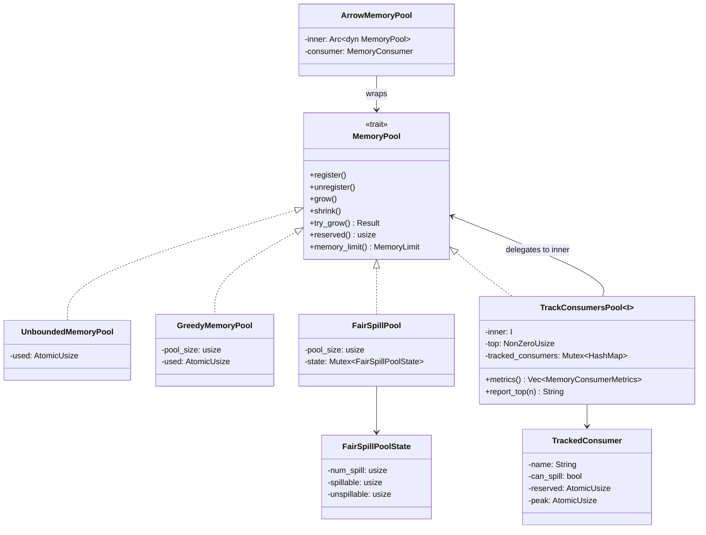
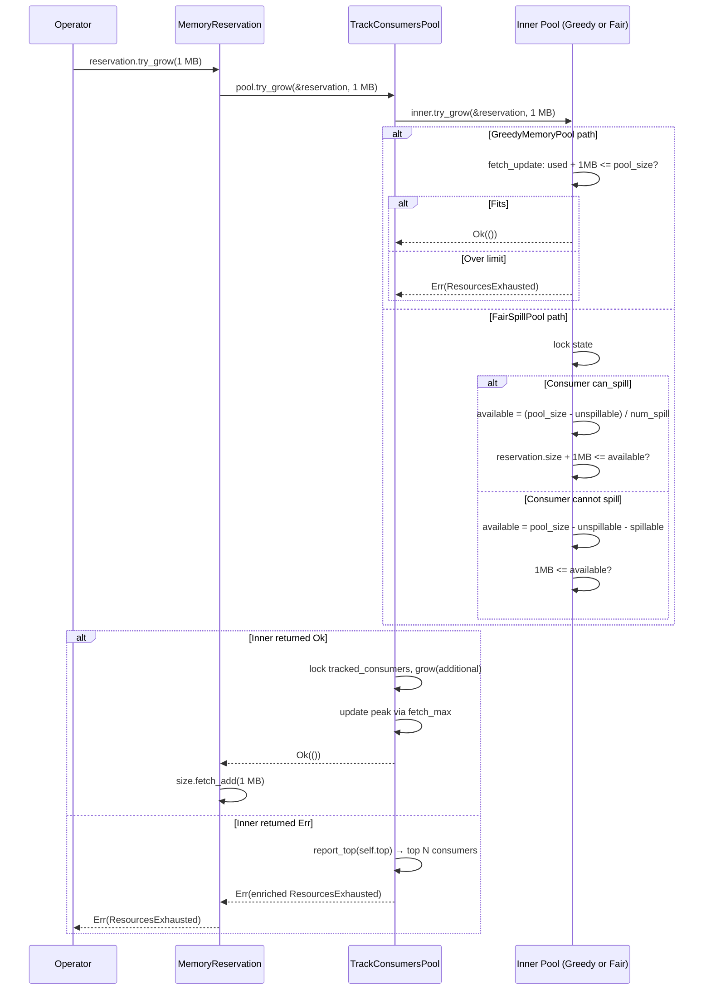

# Module Teardown: Pool Implementations

## 0. Research Focus
* **Task ID:** 5.1.B
* **Focus:** Compare `GreedyMemoryPool` (first-come, first-served) and `FairSpillPool` (ensuring even distribution among tasks).

## 1. High-Level Overview
* **Core Responsibility:** DataFusion ships four `MemoryPool` implementations offering a spectrum from no limits to fair-share allocation. `UnboundedMemoryPool` is the default (no limits). `GreedyMemoryPool` enforces a hard cap with first-come-first-served semantics. `FairSpillPool` divides available memory evenly among spillable consumers. `TrackConsumersPool<I>` is a decorator that wraps any pool to track per-consumer usage and produce rich error messages. Additionally, `ArrowMemoryPool` bridges DataFusion's pool to Arrow's own `MemoryPool` trait.
* **Key Triggers:** Pool selection happens once at session startup (via `RuntimeEnvBuilder`). Thereafter, every `try_grow()` call from an operator hits the selected pool's allocation policy. The choice directly determines when operators are forced to spill vs. when they get unbounded memory.

## 2. Structural Architecture
* **Primary Source Files:**
  - `datafusion/execution/src/memory_pool/pool.rs` — `UnboundedMemoryPool`, `GreedyMemoryPool`, `FairSpillPool`, `TrackConsumersPool`
  - `datafusion/execution/src/memory_pool/arrow.rs` — `ArrowMemoryPool` (feature-gated behind `arrow_buffer_pool`)
  - `datafusion-cli/src/main.rs` — CLI pool selection logic

* **Key Data Structures:**
  - `UnboundedMemoryPool` — A single `AtomicUsize` counter. No limit.
  - `GreedyMemoryPool` — `pool_size: usize` + `AtomicUsize` counter. Lock-free.
  - `FairSpillPool` — `pool_size: usize` + `Mutex<FairSpillPoolState>` where state tracks `num_spill`, `spillable`, and `unspillable` bytes separately.
  - `TrackConsumersPool<I: MemoryPool>` — Generic decorator wrapping `inner: I`, with a `Mutex<HashMap<usize, TrackedConsumer>>` mapping consumer id to per-consumer stats (current + peak).
  - `ArrowMemoryPool` — Adapts `Arc<dyn MemoryPool>` to Arrow's `arrow_buffer::MemoryPool` trait.

### Class Diagram


## 3. Execution & Call Flow

### Sequence Diagram: `try_grow()` across pool types


### Pool-by-Pool Breakdown

#### 1. `UnboundedMemoryPool` — No Limits
The simplest pool. A single `AtomicUsize` counter that always succeeds:

```rust
// pool.rs:30-57
pub struct UnboundedMemoryPool {
    used: AtomicUsize,
}

impl MemoryPool for UnboundedMemoryPool {
    fn grow(&self, _reservation: &MemoryReservation, additional: usize) {
        self.used.fetch_add(additional, Ordering::Relaxed);
    }
    fn shrink(&self, _reservation: &MemoryReservation, shrink: usize) {
        self.used.fetch_sub(shrink, Ordering::Relaxed);
    }
    fn try_grow(&self, reservation: &MemoryReservation, additional: usize) -> Result<()> {
        self.grow(reservation, additional);
        Ok(())  // Always succeeds
    }
    fn memory_limit(&self) -> MemoryLimit {
        MemoryLimit::Infinite
    }
}
```

- **No `register`/`unregister`** — uses default no-op implementations.
- **`try_grow` always succeeds** — simply delegates to `grow()`.
- **Use case:** Development, testing, or when the OS/container is the only memory boundary.

#### 2. `GreedyMemoryPool` — First-Come-First-Served Cap
A fixed-size pool with lock-free enforcement:

```rust
// pool.rs:65-113
pub struct GreedyMemoryPool {
    pool_size: usize,
    used: AtomicUsize,
}

impl MemoryPool for GreedyMemoryPool {
    fn try_grow(&self, reservation: &MemoryReservation, additional: usize) -> Result<()> {
        self.used
            .fetch_update(Ordering::Relaxed, Ordering::Relaxed, |used| {
                let new_used = used + additional;
                (new_used <= self.pool_size).then_some(new_used)
            })
            .map_err(|used| {
                insufficient_capacity_err(
                    reservation, additional,
                    self.pool_size.saturating_sub(used),
                )
            })?;
        Ok(())
    }
}
```

- **Lock-free** via `AtomicUsize::fetch_update` — the CAS loop atomically checks `used + additional <= pool_size` and updates in one step.
- **`grow()` bypasses the limit** — it unconditionally adds, which can push `used` above `pool_size`. This is intentional for tracking already-allocated memory.
- **No `register`/`unregister`** — uses default no-op implementations. The pool doesn't know about individual consumers.
- **Fairness:** None. First operator to call `try_grow` gets the memory. A single operator can monopolize the entire pool.
- **Use case:** Single-operator queries, or queries where only one operator buffers significant data.

#### 3. `FairSpillPool` — Even Distribution Among Spillers
Partitions available memory into spillable vs. unspillable budgets:

```rust
// pool.rs:138-250
pub struct FairSpillPool {
    pool_size: usize,
    state: Mutex<FairSpillPoolState>,
}

struct FairSpillPoolState {
    num_spill: usize,    // count of registered spillable consumers
    spillable: usize,    // total bytes reserved by spillable consumers
    unspillable: usize,  // total bytes reserved by unspillable consumers
}
```

The critical `try_grow` logic:

```rust
// pool.rs:202-240
fn try_grow(&self, reservation: &MemoryReservation, additional: usize) -> Result<()> {
    let mut state = self.state.lock();
    match reservation.registration.consumer.can_spill {
        true => {
            // Total memory available to spillers = pool_size - unspillable
            let spill_available = self.pool_size.saturating_sub(state.unspillable);
            // Each spiller gets an equal share
            let available = spill_available
                .checked_div(state.num_spill)
                .unwrap_or(spill_available);
            if reservation.size() + additional > available {
                return Err(insufficient_capacity_err(reservation, additional, available));
            }
            state.spillable += additional;
        }
        false => {
            // Unspillable gets whatever isn't already used
            let available = self.pool_size
                .saturating_sub(state.unspillable + state.spillable);
            if available < additional {
                return Err(insufficient_capacity_err(reservation, additional, available));
            }
            state.unspillable += additional;
        }
    }
    Ok(())
}
```

- **Uses a mutex** because it must atomically read and update `num_spill`, `spillable`, and `unspillable` together.
- **`register`/`unregister` are significant** — they increment/decrement `num_spill`, changing every spillable consumer's budget.
- **Fair share formula:** `(pool_size - unspillable) / num_spill`. If 3 spillable consumers exist and 20 bytes are unspillable from 100 bytes total, each spiller gets `(100-20)/3 = 26` bytes.
- **Drop-then-rebalance:** When a spillable consumer drops (`unregister`), `num_spill` decreases, so remaining spillers' budgets increase. But note: `free()` vs `drop()` matters. `free()` returns bytes but the consumer remains registered, still dividing the budget. Only `drop()` (which triggers `unregister`) changes the share.
- **Unspillable consumers** compete for `pool_size - unspillable - spillable` — purely first-come-first-served on the leftover.
- **Use case:** Queries with multiple spillable operators (e.g., hash aggregate + sort + join) that should all get a chance to buffer data before being forced to spill.

#### 4. `TrackConsumersPool<I>` — Decorator for Rich Error Messages
A generic wrapper that delegates to any inner pool while tracking per-consumer stats:

```rust
// pool.rs:355-363
pub struct TrackConsumersPool<I> {
    inner: I,
    top: NonZeroUsize,
    tracked_consumers: Mutex<HashMap<usize, TrackedConsumer>>,
}
```

Each `TrackedConsumer` maintains current and peak usage:

```rust
// pool.rs:272-303
struct TrackedConsumer {
    name: String,
    can_spill: bool,
    reserved: AtomicUsize,
    peak: AtomicUsize,
}

impl TrackedConsumer {
    fn grow(&self, additional: usize) {
        self.reserved.fetch_add(additional, Ordering::Relaxed);
        self.peak.fetch_max(self.reserved(), Ordering::Relaxed);
    }
}
```

On `try_grow` failure, the error message is enriched with top-N consumers:

```rust
// pool.rs:500-524
fn try_grow(&self, reservation: &MemoryReservation, additional: usize) -> Result<()> {
    self.inner
        .try_grow(reservation, additional)
        .map_err(|e| match e {
            DataFusionError::ResourcesExhausted(e) => {
                DataFusionError::ResourcesExhausted(
                    provide_top_memory_consumers_to_error_msg(
                        &reservation.consumer().name,
                        &e,
                        &self.report_top(self.top.into()),
                    ),
                )
            }
            _ => e,
        })?;
    // ... track growth on success
    Ok(())
}
```

Example enriched error message:
```
Resources exhausted: Additional allocation failed for r5 with top memory consumers (across reservations) as:
  r1#42(can spill: false) consumed 50.0 B, peak 70.0 B,
  r3#44(can spill: false) consumed 20.0 B, peak 25.0 B,
  r2#43(can spill: false) consumed 15.0 B, peak 15.0 B.
Error: Failed to allocate additional 150.0 B for r5 with 0.0 B already allocated...
```

- **`metrics()` API** returns `Vec<MemoryConsumerMetrics>` for runtime observability, even without errors.
- **Default configuration:** `RuntimeEnvBuilder::with_memory_limit()` wraps `GreedyMemoryPool` in `TrackConsumersPool` with `top=5`.
- **Use case:** Always recommended in production. The overhead (one `Mutex` lock per grow/shrink) is negligible compared to the debugging value of knowing which operators consumed the most memory.

#### 5. `ArrowMemoryPool` — Bridge to Arrow's Memory Tracking
Feature-gated behind `arrow_buffer_pool`, this adapter lets Arrow's internal allocations (array builders, compute kernels) participate in DataFusion's memory accounting:

```rust
// arrow.rs:36-85
pub struct ArrowMemoryPool {
    inner: Arc<dyn MemoryPool>,
    consumer: MemoryConsumer,
}

impl arrow_buffer::MemoryPool for ArrowMemoryPool {
    fn reserve(&self, size: usize) -> Box<dyn arrow_buffer::MemoryReservation> {
        let consumer = self.consumer.clone_with_new_id();
        let reservation = consumer.register(&self.inner);
        reservation.grow(size);
        Box::new(reservation)
    }

    fn available(&self) -> isize {
        (self.capacity() as i128 - self.used() as i128)
            .try_into()
            .unwrap_or(isize::MIN)
    }
}
```

This works because `MemoryReservation` also implements Arrow's `arrow_buffer::MemoryReservation` trait (via `resize()` delegation). Each `reserve()` call creates a fresh consumer clone with a new id.

## 4. Concurrency & State Management
* **Threading Model:** All pools are `Send + Sync` behind an `Arc`. A single pool instance is shared by all Tokio tasks executing partitions of all concurrent queries.
* **Synchronization comparison:**

  | Pool | Lock Type | Contention |
  |------|-----------|------------|
  | `UnboundedMemoryPool` | Lock-free (`AtomicUsize`) | Minimal — CAS on a single counter |
  | `GreedyMemoryPool` | Lock-free (`AtomicUsize::fetch_update`) | Low — CAS loop retries on contention |
  | `FairSpillPool` | `parking_lot::Mutex` | Medium — holds lock for duration of `try_grow` computation |
  | `TrackConsumersPool` | `parking_lot::Mutex` + inner pool's sync | Higher — two locks per operation (tracker + inner pool if `FairSpillPool`) |

* **No deadlock risk:** Locks are always acquired in the same order (outer `TrackConsumersPool` lock → inner pool lock) and released promptly. No lock is held across `await` points.

## 5. Memory & Resource Profile
* **Pool overhead:**
  - `UnboundedMemoryPool`: 8 bytes (`AtomicUsize`).
  - `GreedyMemoryPool`: 16 bytes (`usize` + `AtomicUsize`).
  - `FairSpillPool`: 16 bytes + Mutex overhead + 24 bytes state.
  - `TrackConsumersPool`: Inner pool + `NonZeroUsize` + `HashMap` with one `TrackedConsumer` (~72 bytes) per registered consumer.
* **Memory Tracking:** The pools themselves are *not* tracked by any memory pool. Their overhead is considered negligible.

## 6. Key Design Insights

* **`grow()` intentionally ignores limits.** All pools implement `grow()` as an unconditional counter increment. This means the `used` counter can exceed `pool_size`. This is by design — `grow()` is for *reporting* already-allocated memory, not for *requesting permission*. The limit enforcement is exclusively in `try_grow()`.

* **`FairSpillPool` checks individual reservation size, not total spillable.** The check is `reservation.size() + additional > available`, not `state.spillable + additional > pool_size`. This means each spiller is capped at its *fair share*, even if other spillers haven't used their share yet. This can cause premature spilling — a known trade-off documented in the code:
  > *"Sometimes it will cause spills even when there was sufficient memory (reserved for other operators) to avoid doing so."*

* **The spill-on-OOM loop pattern.** Operators that support spilling follow a canonical pattern:
  ```rust
  // Sort operator: sorts/sort.rs:805-819
  match self.reservation.try_grow(size) {
      Ok(_) => Ok(()),
      Err(e) => {
          if self.in_mem_batches.is_empty() {
              return Err(Self::err_with_oom_context(e));
          }
          self.sort_and_spill_in_mem_batches().await?;
          self.reservation
              .try_grow(size)
              .map_err(Self::err_with_oom_context)
      }
  }
  ```
  Try → fail → spill (which calls `shrink`) → retry. If the retry fails, the operator propagates the error.

* **Aggregation has three OOM modes:**
  ```rust
  // aggregates/row_hash.rs:215-222
  enum OutOfMemoryMode {
      Spill,        // spill state to disk
      EmitEarly,    // emit partial results to reduce memory
      ReportError,  // immediately fail
  }
  ```
  The mode is chosen based on whether the aggregate is a partial or final aggregation and whether the grouping order supports early emission. The aggregate's `can_spill` flag on its `MemoryConsumer` is set based on this mode, which in turn affects `FairSpillPool`'s behavior.

* **CLI pool selection:**
  ```rust
  // datafusion-cli/src/main.rs:192-206
  let pool: Arc<dyn MemoryPool> = match args.mem_pool_type {
      PoolType::Fair if args.top_memory_consumers == 0 =>
          Arc::new(FairSpillPool::new(memory_limit)),
      PoolType::Fair =>
          Arc::new(TrackConsumersPool::new(FairSpillPool::new(memory_limit), ...)),
      PoolType::Greedy if args.top_memory_consumers == 0 =>
          Arc::new(GreedyMemoryPool::new(memory_limit)),
      PoolType::Greedy =>
          Arc::new(TrackConsumersPool::new(GreedyMemoryPool::new(memory_limit), ...)),
  };
  ```
  The CLI defaults to `PoolType::Greedy`. `TrackConsumersPool` is only added when `--top-memory-consumers` is non-zero. By contrast, `RuntimeEnvBuilder::with_memory_limit()` always wraps with `TrackConsumersPool` (top=5).

* **Design comparison with Trino:** Trino's memory management operates at the query level with a memory pool per node and explicit revocation callbacks. DataFusion's approach is more granular (per-operator, per-partition) but simpler — there's no revocation protocol or query-killing mechanism. The pool simply returns `Err`, and the operator decides whether to spill or propagate. This fits DataFusion's single-process model where there's no coordinator to arbitrate between queries.
