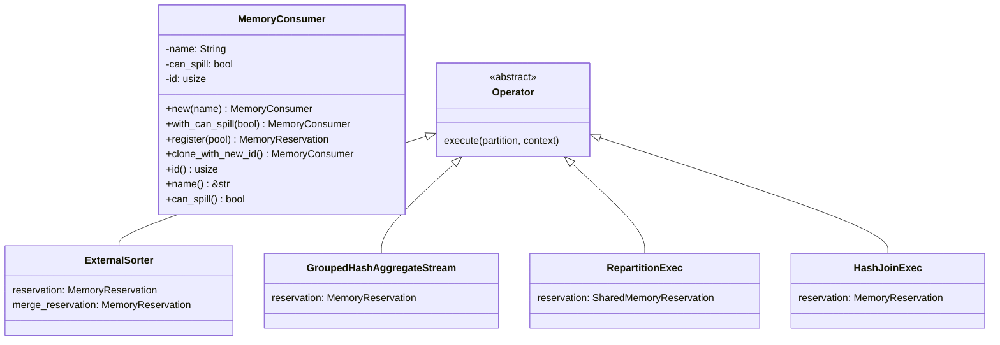
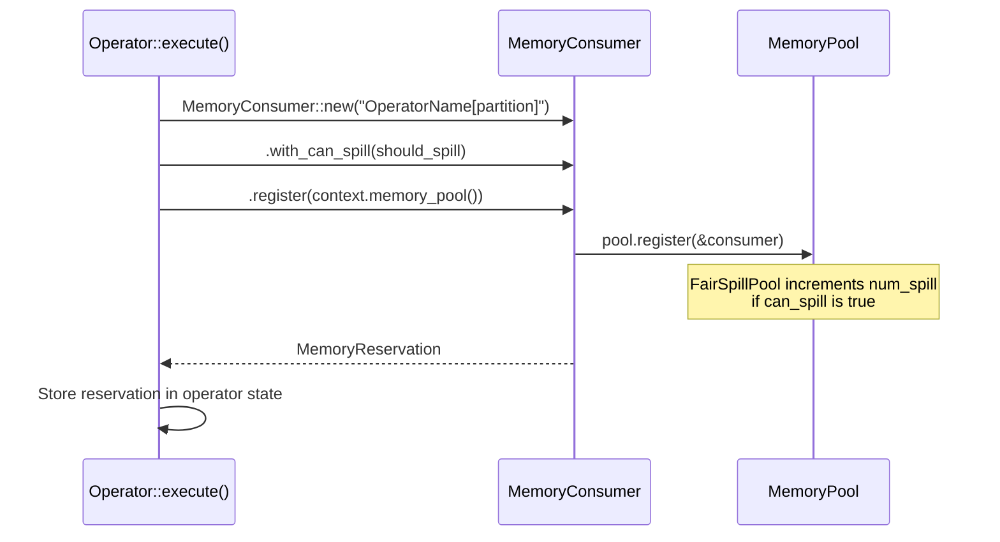
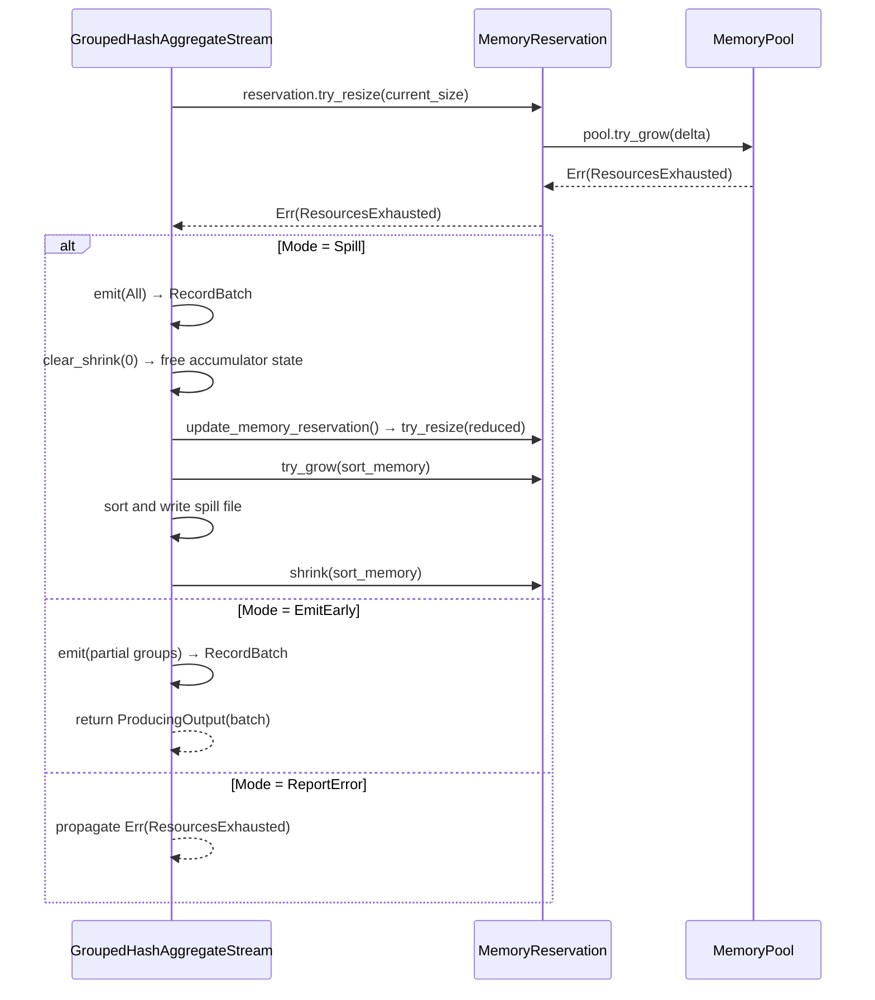

# Module Teardown: Memory Consumers

## 0. Research Focus
* **Task ID:** 5.2.B
* **Focus:** How does a specific operator register itself as a consumer? Trace the mechanism an operator uses to request an allocation size.

## 1. High-Level Overview
* **Core Responsibility:** `MemoryConsumer` is a named identity that operators create to register themselves with a `MemoryPool`. It acts as the link between an operator and the pool — it carries the operator's name (for error messages and debugging), a `can_spill` flag (which influences pool policies like `FairSpillPool`), and a process-unique id. The consumer is not itself an allocation tracker — it produces a `MemoryReservation` upon registration, which is the actual tracking handle.
* **Key Triggers:** Created in an operator's `execute()` method (or constructor), immediately before the operator begins buffering data. The `can_spill` flag is set based on the operator's OOM handling capability. Registration with the pool happens exactly once per consumer; the resulting `MemoryReservation` is then used for all subsequent memory accounting.

## 2. Structural Architecture
* **Primary Source Files:**
  - `datafusion/execution/src/memory_pool/mod.rs` — `MemoryConsumer` struct and its `register()` method
  - `datafusion/physical-plan/src/aggregates/row_hash.rs` — Best example of `can_spill` decision logic
  - `datafusion/physical-plan/src/sorts/sort.rs` — Two-consumer pattern (main + merge)
  - `datafusion/physical-plan/src/repartition/mod.rs` — `SharedMemoryReservation` pattern
  - `datafusion/physical-plan/src/common.rs` — `SharedMemoryReservation` type alias

* **Key Data Structures:**
  - `MemoryConsumer { name: String, can_spill: bool, id: usize }` — Identity + policy flag. Not `Clone` (uses `clone_with_new_id()` for genuinely separate consumers).
  - Global `AtomicUsize` counter — produces unique ids via `fetch_add(1, Relaxed)`.

### Class Diagram


## 3. Execution & Call Flow

### The Consumer Registration Pattern

Every memory-tracking operator follows the same three-step pattern:



### Complete Operator Consumer Survey

The following table catalogs every production `MemoryConsumer` creation in the physical-plan crate (excluding tests):

| Operator | Consumer Name Pattern | `can_spill` | Notes |
|---|---|---|---|
| `ExternalSorter` | `ExternalSorter[{partition}]` | `true` | Main buffering reservation |
| `ExternalSorter` (merge) | `ExternalSorterMerge[{partition}]` | `false` | Pre-reserved merge headroom |
| `GroupedHashAggregateStream` | `GroupedHashAggregateStream[{p}] ({agg_fns})` | mode-dependent | See OOM mode logic below |
| `AggregateStream` (no grouping) | `AggregateStream[{partition}]` | `false` | Simple aggregation, no spill |
| `RepartitionExec` | `{name}[{partition}]` | `true` | Wrapped in `Arc<Mutex<>>` |
| `RepartitionExec` (merge) | `{name}[Merge {partition}]` | `false` | For sort-preserving merge |
| `HashJoinExec` (collect) | `HashJoinInput` | `false` | Build side, collect-left mode |
| `HashJoinExec` (partitioned) | `HashJoinInput[{partition}]` | `false` | Build side, partitioned mode |
| `CrossJoinExec` | `CrossJoinExec` | `false` | Buffers left side |
| `NestedLoopJoinExec` | `NestedLoopJoinLoad[{partition}]` | `false` | Loads build side |
| `SortMergeJoinExec` | `SMJStream[{partition}]` | `false` | Buffers for merge |
| `PiecewiseMergeJoin` | `PiecewiseMergeJoinInput` | `false` | Buffers buffered side |
| `SymmetricHashJoinExec` | `SymmetricHashJoinStream[{partition}]` | `false` | Wrapped in `Arc<Mutex<>>` |
| `SortPreservingMergeExec` | `SortPreservingMergeExec[{partition}]` | `false` | Merge stream tracking |
| `TopK` | `TopK[{partition}]` | `false` | Top-K heap |
| `RecursiveQuery` | `RecursiveQuery` | `false` | CTE working table |
| `RecursiveQuery` (dedup) | `RecursiveQueryHashTable` | `false` | DISTINCT deduplication |
| `BufferExec` | `BufferExec[{partition}]` | `false` | In-memory buffering |

### The `can_spill` Decision Logic

The `can_spill` flag is the critical policy signal that determines how the pool treats a consumer. `FairSpillPool` uses it to count registered spillers and divide memory evenly among them. Setting `can_spill = true` means:
1. The operator **promises** it can handle a `ResourcesExhausted` error gracefully (by spilling or emitting early)
2. The pool will apply **back-pressure** (tighter limits) to this consumer, expecting it to yield

The aggregate operator has the most sophisticated logic for this decision:

```rust
// row_hash.rs:569-596
let oom_mode = match (agg.mode, &group_ordering) {
    // In partial aggregation mode, always prefer to emit incomplete results early.
    (AggregateMode::Partial, _) => OutOfMemoryMode::EmitEarly,

    // For non-partial modes, use disk spilling if disk is available
    (_, GroupOrdering::None | GroupOrdering::Partial(_))
        if context.runtime_env().disk_manager.tmp_files_enabled() =>
    {
        OutOfMemoryMode::Spill
    }

    // GroupOrdering::Full or no disk → just error
    _ => OutOfMemoryMode::ReportError,
};

let reservation = MemoryConsumer::new(name)
    // 'can_spill' == 'can handle memory back pressure'
    .with_can_spill(oom_mode != OutOfMemoryMode::ReportError)
    .register(context.memory_pool());
```

Three modes map to `can_spill`:
- **`EmitEarly`** (`can_spill = true`) — Partial aggregation: emit incomplete groups to reduce memory
- **`Spill`** (`can_spill = true`) — Final aggregation: sort and write intermediate state to disk
- **`ReportError`** (`can_spill = false`) — Fully-ordered input or no disk: just fail

### Sequence Diagram: Aggregate OOM Handling by Mode



## 4. Concurrency & State Management
* **Threading Model:** Each `MemoryConsumer` is created on a single thread and consumed by `register()`. The resulting `MemoryReservation` is typically owned by one async task. The consumer's id is generated from a global `AtomicUsize` — no coordination needed.
* **Identity semantics:** Two consumers with the same name are *different* consumers (different ids). This is intentional — each partition of the same operator gets its own consumer. `PartialEq` compares only `id`. `Hash` includes `id`, `name`, and `can_spill`.
* **`clone_with_new_id()`:** Creates a genuinely separate consumer that the pool treats as distinct. Used by `ArrowMemoryPool` where each `reserve()` call needs an independent consumer. The clone shares the name but gets a new id.
* **`SharedMemoryReservation` pattern:** When multiple async tasks must access the same reservation (e.g., repartition's input tasks routing to the same output partition), the reservation is wrapped in `Arc<Mutex<MemoryReservation>>`:

    ```rust
    // repartition/mod.rs:325-329
    let reservation = Arc::new(Mutex::new(
        MemoryConsumer::new(format!("{name}[{partition}]"))
            .with_can_spill(true)
            .register(context.memory_pool()),
    ));
    ```

    The `Mutex` ensures only one task grows/shrinks the reservation at a time. This is necessary because `MemoryReservation`'s API expects single-owner usage (even though `size` is atomic, the grow→allocate sequence must be atomic at a higher level).

## 5. Memory & Resource Profile
* **Allocation Pattern:** `MemoryConsumer` itself is minimal — a `String` name, a `bool`, and a `usize`. It is consumed by `register()` (moved into `SharedRegistration`), so its lifetime is tied to the reservation.
* **Naming conventions:** Consumer names consistently follow the pattern `OperatorName[partition_id]` with optional context (e.g., aggregate function names). This makes `TrackConsumersPool` error messages immediately actionable:

    ```
    Resources exhausted: Additional allocation failed for
    GroupedHashAggregateStream[2] (SUM, COUNT) with top memory consumers:
      ExternalSorter[0] consumed 50.0 MB, peak 80.0 MB,
      GroupedHashAggregateStream[1] (SUM, COUNT) consumed 30.0 MB, peak 30.0 MB,
      HashJoinInput consumed 20.0 MB, peak 20.0 MB.
    ```

* **Which operators do NOT track memory:** Streaming operators (`FilterExec`, `ProjectionExec`, `CoalescePartitionsExec`) that pass through `RecordBatch`es without buffering do not create consumers. The design philosophy states:
    > *"Intermediate memory used as data streams through the system is not accounted (it is assumed to be 'small') but the large consumers of memory must register and constrain their use."*

## 6. Key Design Insights

* **`MemoryConsumer` is a one-shot factory.** It's created, configured, and immediately consumed by `register()`. It's not stored by the operator — only the resulting `MemoryReservation` is kept. This prevents accidental re-registration. The `register()` method takes `self` (not `&self`), making it impossible to register the same consumer twice:

    ```rust
    // mod.rs:322-332
    pub fn register(self, pool: &Arc<dyn MemoryPool>) -> MemoryReservation {
        pool.register(&self);
        MemoryReservation {
            registration: Arc::new(SharedRegistration {
                pool: Arc::clone(pool),
                consumer: self,  // moved in
            }),
            size: atomic::AtomicUsize::new(0),
        }
    }
    ```

* **`can_spill` is a contract, not a hint.** Setting `can_spill = true` is a promise to the pool that the operator will handle `ResourcesExhausted` gracefully. The `FairSpillPool` actively relies on this — it caps each spillable consumer at `(pool_size - unspillable) / num_spill`. If an operator sets `can_spill = true` but doesn't actually handle OOM, it will receive errors from `try_grow` that it cannot recover from.

* **Multi-consumer operators.** The sort operator creates *two* consumers: a spillable main reservation and a non-spillable merge reservation. The repartition operator also creates two: a spillable per-partition reservation and a non-spillable merge reservation. This pattern separates "memory that can be freed under pressure" from "memory that must be guaranteed for correctness."

* **Non-spillable consumers have no special treatment in `GreedyMemoryPool`.** The `can_spill` flag only affects `FairSpillPool` and `TrackConsumersPool` (for reporting). In `GreedyMemoryPool`, all consumers compete equally — the flag is ignored. This means the pool type determines whether `can_spill` has any practical effect.

* **The `id` as the source of truth.** Even though `Hash` includes `name` and `can_spill`, equality is purely id-based. The `debug_assert` in `PartialEq` verifies that same-id consumers have the same name and `can_spill` — catching bugs in debug builds. In `TrackConsumersPool`, consumers are stored by id in a `HashMap<usize, TrackedConsumer>`, not by name.

* **Comparison with Trino's memory tracking model.** Trino tracks memory at the query level with explicit `MemoryTrackingContext` hierarchies (query → pipeline → operator). DataFusion's model is flatter — each operator partition independently registers a consumer with a single global pool. There's no query-level aggregation or per-query limits. Multi-tenancy is achieved by sharing one pool across all concurrent queries, with the pool's global limit preventing total OOM. This simpler model fits DataFusion's single-process, library-embedded use case.
