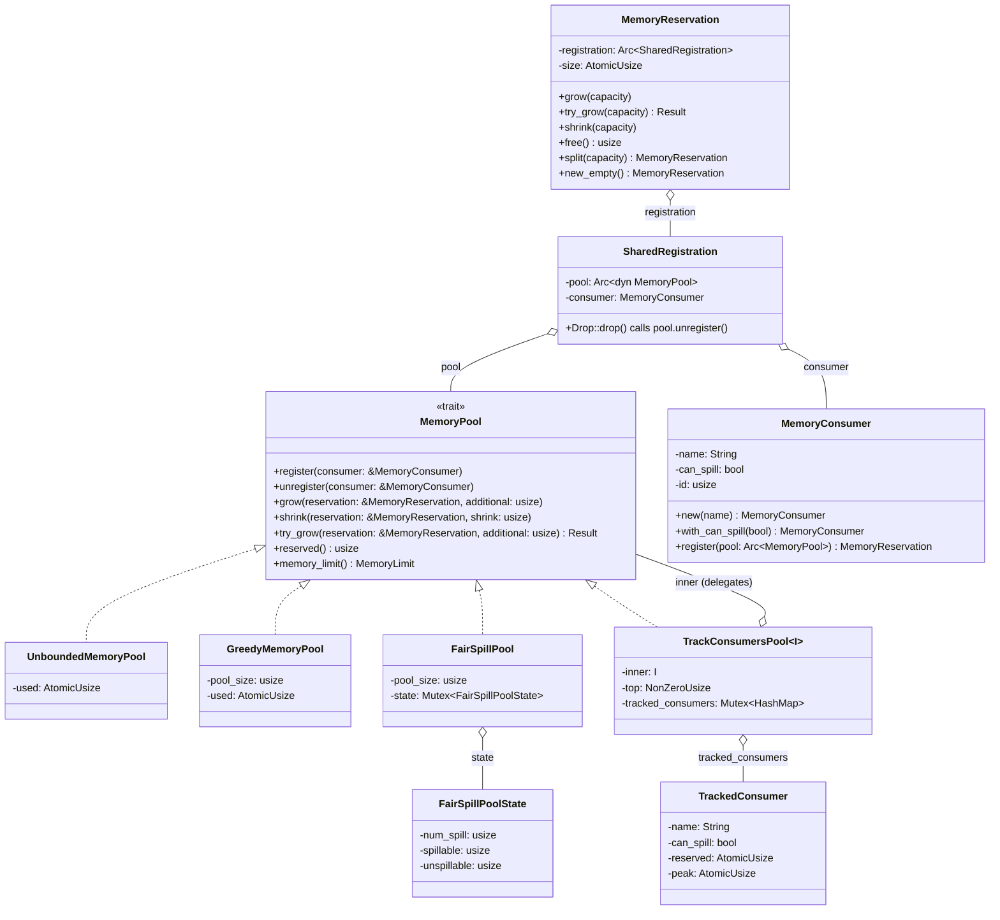
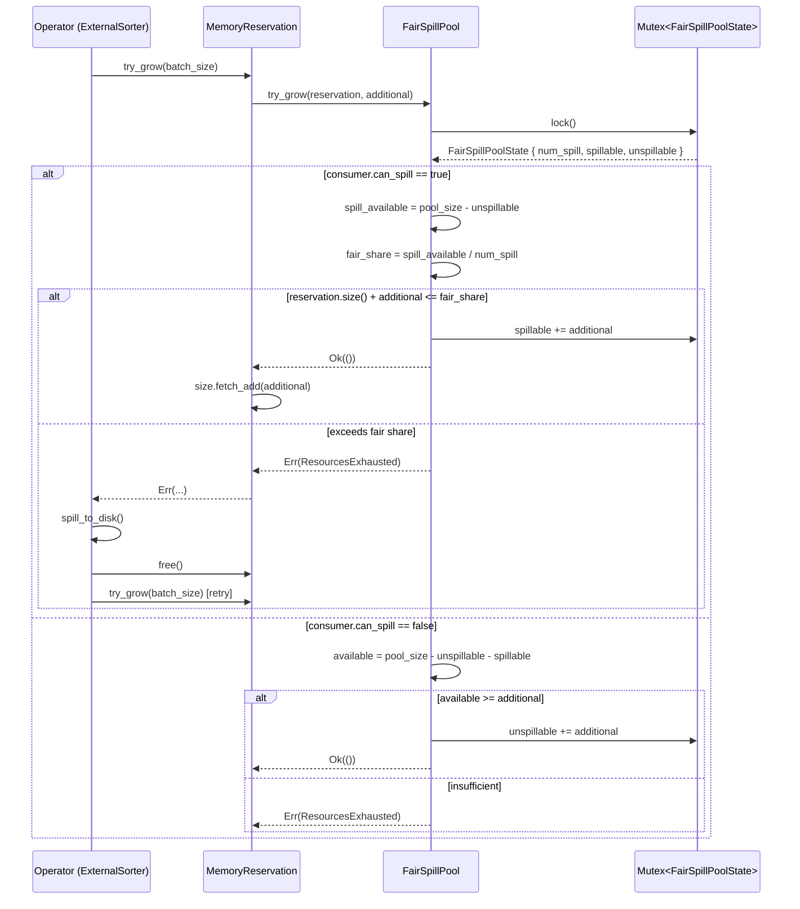
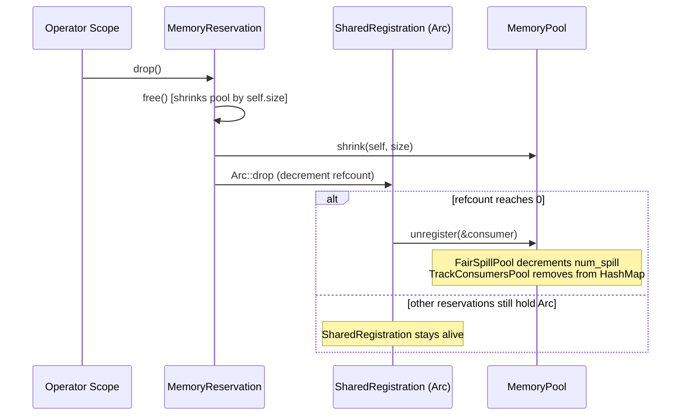

# Module Teardown: The `MemoryPool` Trait and Implementations

## Table of Contents

- [0. Research Focus](#0-research-focus)
- [1. High-Level Overview](#1-high-level-overview)
- [2. Structural Architecture](#2-structural-architecture)
  - [Class Diagram](#class-diagram)
- [3. Execution & Call Flow](#3-execution-call-flow)
  - [The Registration-Reservation Lifecycle](#the-registration-reservation-lifecycle)
  - [Sequence Diagram: try_grow with FairSpillPool](#sequence-diagram-try_grow-with-fairspillpool)
  - [Sequence Diagram: RAII Drop Chain](#sequence-diagram-raii-drop-chain)
- [4. Concurrency & State Management](#4-concurrency-state-management)
  - [UnboundedMemoryPool and GreedyMemoryPool: Lock-Free with AtomicUsize](#unboundedmemorypool-and-greedymemorypool-lock-free-with-atomicusize)
  - [FairSpillPool: Mutex-Protected Compound State](#fairspillpool-mutex-protected-compound-state)
  - [TrackConsumersPool: Dual Locking](#trackconsumerspool-dual-locking)
  - [MemoryReservation Itself: AtomicUsize for Size](#memoryreservation-itself-atomicusize-for-size)
  - [MemoryConsumer ID Generation: Global Atomic Counter](#memoryconsumer-id-generation-global-atomic-counter)
- [5. Memory & Resource Profile](#5-memory-resource-profile)
  - [Per-Implementation Overhead](#per-implementation-overhead)
  - [What Is NOT Tracked](#what-is-not-tracked)
  - [Default Wiring](#default-wiring)
- [6. Key Design Insights](#6-key-design-insights)
  - [Insight 1: Cooperative Accounting, Not Allocation Interception](#insight-1-cooperative-accounting-not-allocation-interception)
  - [Insight 2: FairSpillPool's Fair-Share Algorithm is Statically Per-Consumer, Not Dynamic](#insight-2-fairspillpools-fair-share-algorithm-is-statically-per-consumer-not-dynamic)
  - [Insight 3: The `grow()` vs `try_grow()` Asymmetry is Intentional](#insight-3-the-grow-vs-try_grow-asymmetry-is-intentional)
  - [Insight 4: SharedRegistration + Arc Enable Multiple Reservations Per Consumer](#insight-4-sharedregistration-arc-enable-multiple-reservations-per-consumer)
  - [Insight 5: TrackConsumersPool is a Decorator, Not a Pool](#insight-5-trackconsumerspool-is-a-decorator-not-a-pool)
  - [Insight 6: Trino vs DataFusion -- Fundamentally Different Memory Models](#insight-6-trino-vs-datafusion-fundamentally-different-memory-models)
  - [Insight 7: ArrowMemoryPool Bridge](#insight-7-arrowmemorypool-bridge)
  - [Insight 8: CLI Pool Selection Differs from Library Default](#insight-8-cli-pool-selection-differs-from-library-default)
  - [Insight 9: Pool Overhead in Bytes](#insight-9-pool-overhead-in-bytes)
  - [Insight 10: No Deadlock Risk — Lock Ordering Guarantee](#insight-10-no-deadlock-risk-lock-ordering-guarantee)
  - [Insight 11: FairSpillPool's Non-Spillable Path is Pure First-Come-First-Served](#insight-11-fairspillpools-non-spillable-path-is-pure-first-come-first-served)
  - [Insight 12: Cooperative, Not Enforced](#insight-12-cooperative-not-enforced)
  - [Insight 13: MemoryConsumer Identity is ID-Based, Not Name-Based](#insight-13-memoryconsumer-identity-is-id-based-not-name-based)


## 0. Research Focus
* **Task ID:** 5.1
* **Focus:** Analyze the `MemoryPool` trait. Trace the implementations of `GreedyMemoryPool`, `FairSpillPool`, `UnboundedMemoryPool`, and `TrackConsumersPool`. How does `FairSpillPool` track per-consumer usage to ensure even distribution? Compare this to Trino's unified global pool.

## 1. High-Level Overview
* **Core Responsibility:** `MemoryPool` is the central trait governing runtime memory accounting in DataFusion. It does NOT perform actual allocation; instead, operators must *ask permission* before allocating, and the pool tracks a running counter of reserved bytes. When a bounded pool rejects a `try_grow()`, the operator must either spill to disk or abort. This "cooperative accounting" model keeps the process alive without relying on OS-level OOM killers.
* **Key Triggers:** Operators that buffer intermediate results proportional to input size (hash aggregation, sort, cross join) create a `MemoryConsumer`, register it with the pool, and call `try_grow()` before each significant allocation. Streaming operators (filter, projection) do not participate -- their memory is assumed "small" and untracked.

## 2. Structural Architecture
* **Primary Source Files:**
  - `datafusion/execution/src/memory_pool/mod.rs` -- trait definition, `MemoryConsumer`, `MemoryReservation`, `SharedRegistration`
  - `datafusion/execution/src/memory_pool/pool.rs` -- `UnboundedMemoryPool`, `GreedyMemoryPool`, `FairSpillPool`, `TrackConsumersPool`
  - `datafusion/execution/src/memory_pool/arrow.rs` -- adapter bridging DataFusion pools to Arrow's `arrow_buffer::MemoryPool`
  - `datafusion/execution/src/runtime_env.rs` -- wires the pool into `RuntimeEnv`

* **Key Data Structures:**

| Structure | Purpose |
|---|---|
| `MemoryPool` (trait) | Abstract interface: `register`, `unregister`, `grow`, `shrink`, `try_grow`, `reserved` |
| `MemoryConsumer` | Named entity with a process-unique `id: usize` and a `can_spill: bool` flag |
| `SharedRegistration` | Ref-counted link between a `MemoryConsumer` and a `MemoryPool`; calls `unregister` on drop |
| `MemoryReservation` | User-facing handle holding an `Arc<SharedRegistration>` and an `AtomicUsize` for its current size |
| `FairSpillPoolState` | Mutex-guarded struct: `num_spill`, `spillable`, `unspillable` |
| `TrackedConsumer` | Per-consumer tracking in `TrackConsumersPool`: `reserved: AtomicUsize`, `peak: AtomicUsize` |

### Class Diagram



## 3. Execution & Call Flow

### The Registration-Reservation Lifecycle

The entire lifecycle of a memory consumer flows through four phases: **register**, **grow/try_grow**, **shrink/free**, and **unregister** (automatic on drop).

```
MemoryConsumer::new("ExternalSorter[0]")
    .with_can_spill(true)            // Mark as spillable
    .register(&runtime.memory_pool)  // Returns MemoryReservation
```

This single line does:
1. Creates a `MemoryConsumer` with a globally unique ID (via `static AtomicUsize`)
2. Calls `pool.register(&consumer)` -- some pools record the consumer
3. Wraps the consumer in an `Arc<SharedRegistration>` linking it to the pool
4. Returns a `MemoryReservation` with `size = AtomicUsize::new(0)`

### Sequence Diagram: try_grow with FairSpillPool



### Sequence Diagram: RAII Drop Chain



## 4. Concurrency & State Management

### UnboundedMemoryPool and GreedyMemoryPool: Lock-Free with AtomicUsize

Both simple pools use only `AtomicUsize` with `Ordering::Relaxed`. This is safe because:
- Each counter (`used`) is a single monotonically-updated value
- No complex invariants link multiple atomic variables
- `GreedyMemoryPool::try_grow` uses `fetch_update` (CAS loop) to atomically check-and-increment:

```rust
// GreedyMemoryPool::try_grow -- pool.rs:90-103
fn try_grow(&self, reservation: &MemoryReservation, additional: usize) -> Result<()> {
    self.used
        .fetch_update(Ordering::Relaxed, Ordering::Relaxed, |used| {
            let new_used = used + additional;
            (new_used <= self.pool_size).then_some(new_used)
        })
        .map_err(|used| {
            insufficient_capacity_err(
                reservation,
                additional,
                self.pool_size.saturating_sub(used),
            )
        })?;
    Ok(())
}
```

The `fetch_update` is a CAS loop: it reads the current value, applies the closure, and if the closure returns `Some(new_val)`, atomically swaps. If another thread modifies `used` between read and swap, the CAS fails and retries. This is the standard lock-free pattern for bounded counters.

### FairSpillPool: Mutex-Protected Compound State

`FairSpillPool` uses `parking_lot::Mutex<FairSpillPoolState>` because it must atomically read and modify THREE related values (`num_spill`, `spillable`, `unspillable`) together. A single `AtomicUsize` cannot protect this invariant.

```rust
// FairSpillPool state -- pool.rs:146-155
struct FairSpillPoolState {
    num_spill: usize,      // count of registered spillable consumers
    spillable: usize,      // total bytes reserved by spillable consumers
    unspillable: usize,    // total bytes reserved by non-spillable consumers
}
```

Every method (`register`, `unregister`, `grow`, `shrink`, `try_grow`, `reserved`) acquires the mutex. The critical section is short -- just arithmetic and comparisons -- so contention is minimal. `parking_lot::Mutex` is chosen over `std::sync::Mutex` for its smaller size (1 byte vs. platform-dependent) and absence of poisoning.

### TrackConsumersPool: Dual Locking

`TrackConsumersPool` holds a `Mutex<HashMap<usize, TrackedConsumer>>`. Each `TrackedConsumer` internally uses `AtomicUsize` for `reserved` and `peak`. The HashMap lock is acquired on every `grow`/`shrink`/`try_grow` to look up the consumer entry, then the atomic within `TrackedConsumer` is updated. This means the lock is held very briefly -- just long enough for HashMap lookup and an atomic fetch_add.

```rust
// TrackedConsumer::grow -- pool.rs:293-296
fn grow(&self, additional: usize) {
    self.reserved.fetch_add(additional, Ordering::Relaxed);
    self.peak.fetch_max(self.reserved(), Ordering::Relaxed);  // racy but acceptable
}
```

Note the subtle race in `peak` tracking: `fetch_max(self.reserved())` reads `reserved` non-atomically relative to the preceding `fetch_add`. Another thread could shrink between the add and the max read. This is tolerable because `peak` is purely diagnostic -- it only appears in error messages.

### MemoryReservation Itself: AtomicUsize for Size

`MemoryReservation.size` is an `AtomicUsize` (not a plain `usize`). This allows `split()` and concurrent reads to work correctly. The `shrink` method uses `fetch_update` (CAS) to atomically subtract and detect underflow:

```rust
// MemoryReservation::shrink -- mod.rs:387-398
pub fn shrink(&self, capacity: usize) {
    self.size
        .fetch_update(
            atomic::Ordering::Relaxed,
            atomic::Ordering::Relaxed,
            |prev| prev.checked_sub(capacity),
        )
        .unwrap_or_else(|prev| {
            panic!("Cannot free the capacity {capacity} out of allocated size {prev}")
        });
    self.registration.pool.shrink(self, capacity);
}
```

### MemoryConsumer ID Generation: Global Atomic Counter

```rust
// mod.rs:275-278
fn new_unique_id() -> usize {
    static ID: atomic::AtomicUsize = atomic::AtomicUsize::new(0);
    ID.fetch_add(1, atomic::Ordering::Relaxed)
}
```

This is a process-global monotonic counter. `Relaxed` ordering is fine because the only invariant is uniqueness -- no ordering relationship between IDs is required.

## 5. Memory & Resource Profile

### Per-Implementation Overhead

| Pool | Fixed Overhead | Per-Consumer Overhead | Synchronization Cost |
|---|---|---|---|
| `UnboundedMemoryPool` | 8 bytes (AtomicUsize) | 0 | Lock-free (Relaxed atomics) |
| `GreedyMemoryPool` | 16 bytes (pool_size + AtomicUsize) | 0 | Lock-free (CAS loop) |
| `FairSpillPool` | 8 + ~32 bytes (pool_size + Mutex + state) | 0 (aggregated counters only) | Mutex per operation |
| `TrackConsumersPool` | inner + NonZeroUsize + Mutex<HashMap> | ~64 bytes per consumer (String + bool + 2 AtomicUsize) | Mutex + inner pool lock |

### What Is NOT Tracked

DataFusion's documentation is explicit that the pool only tracks "large" consumers:

> Rather than tracking all allocations, DataFusion takes a pragmatic approach: Intermediate memory used as data streams through the system is not accounted (it assumed to be "small") but the large consumers of memory must register and constrain their use. (mod.rs:49-53)

Specifically untracked:
- RecordBatches flowing between operators (the streaming data)
- Internal buffers in `DataSourceExec`, `FilterExec`, `ProjectionExec`
- Arrow array allocations within compute kernels

The recommendation is to reserve ~10% overhead in pool_size for these untracked allocations.

### Default Wiring

```rust
// runtime_env.rs:401-407
pub fn with_memory_limit(self, max_memory: usize, memory_fraction: f64) -> Self {
    let pool_size = (max_memory as f64 * memory_fraction) as usize;
    self.with_memory_pool(Arc::new(TrackConsumersPool::new(
        GreedyMemoryPool::new(pool_size),
        NonZeroUsize::new(5).unwrap(),
    )))
}
```

The default when no pool is set:
```rust
// runtime_env.rs:452-453
let memory_pool = memory_pool.unwrap_or_else(|| Arc::new(UnboundedMemoryPool::default()));
```

So out of the box, DataFusion is unbounded. The `with_memory_limit` convenience wraps `GreedyMemoryPool` in `TrackConsumersPool` (top 5 consumers in error messages).

## 6. Key Design Insights

### Insight 1: Cooperative Accounting, Not Allocation Interception

DataFusion's memory pool does NOT intercept `malloc` or `Vec::push`. It is a pure accounting system. Operators must voluntarily call `try_grow()` before allocating. If an operator forgets, the pool knows nothing about it. This is a fundamental design tradeoff:

- **Pro:** Zero overhead on the hot path. No custom allocator, no global hooks, no `jemalloc_ctl`.
- **Con:** Incomplete coverage. Buggy or third-party operators can bypass it entirely.

Evidence from the ExternalSorter:
```rust
// sort.rs:561
if self.reservation.try_grow(sorted_size).is_err() {
    // batch is already in memory, so it's okay to combine it
    globally_sorted_batches.push(batch);
    self.consume_and_spill_append(&mut globally_sorted_batches)
```

The batch is *already in memory* when `try_grow` fails. The pool didn't prevent the allocation; the operator is responsible for reacting to the rejection.

### Insight 2: FairSpillPool's Fair-Share Algorithm is Statically Per-Consumer, Not Dynamic

`FairSpillPool` divides memory evenly by the *count* of registered spillable consumers, not by their actual usage or demand:

```rust
// pool.rs:208-213
let spill_available = self.pool_size.saturating_sub(state.unspillable);
let available = spill_available
    .checked_div(state.num_spill)
    .unwrap_or(spill_available);
```

Key consequences:
- **A consumer's share is `(pool_size - unspillable) / num_spill`**, regardless of how much others have used
- **The check is `reservation.size() + additional > available`** (pool.rs:215) -- it checks the *requesting consumer's* total against its share, not total pool usage
- A consumer that has freed its memory still counts toward `num_spill` until dropped. The test proves this (pool.rs:608-611): after `r2.free()`, `r3` still cannot allocate 70 bytes because `num_spill` is 2, so each gets 40.
- Only `drop(r2)` (which triggers `unregister`) reduces `num_spill`, allowing `r3` to get the full 80.

This means `FairSpillPool` is conservative: it may force spilling even when the pool has plenty of free memory, because it caps each consumer to their fraction.

### Insight 3: The `grow()` vs `try_grow()` Asymmetry is Intentional

`grow()` is **infallible** -- it always succeeds, even if it pushes the pool over its limit. `try_grow()` is the **fallible** variant that can reject. This is not a bug; it's the documented design:

```rust
// mod.rs:196-198
/// Infallibly grow the provided `reservation` by `additional` bytes
/// This must always succeed
fn grow(&self, reservation: &MemoryReservation, additional: usize);
```

The test confirms that `grow()` can exceed pool capacity:
```rust
// pool.rs:565-567
let r1 = MemoryConsumer::new("unspillable").register(&pool);
r1.grow(2000);  // Pool size is 100, but this succeeds!
assert_eq!(pool.reserved(), 2000);
```

The rationale: some situations (like receiving a batch from a child operator) have already allocated the memory before the pool can be consulted. The operator calls `grow()` to record the fact, then reacts (e.g., spills) if needed. Only pre-allocation checks should use `try_grow()`.

### Insight 4: SharedRegistration + Arc Enable Multiple Reservations Per Consumer

A single `MemoryConsumer` can have many `MemoryReservation` objects (via `split()` or `new_empty()`), all sharing the same `Arc<SharedRegistration>`. The `SharedRegistration` is only dropped (and `unregister` called) when the *last* reservation is dropped.

```rust
// mod.rs:470-482
pub fn split(&self, capacity: usize) -> MemoryReservation {
    self.size
        .fetch_update(/* ... */)
        .unwrap();
    Self {
        size: atomic::AtomicUsize::new(capacity),
        registration: Arc::clone(&self.registration),  // same consumer, same pool
    }
}
```

This is critical for the ExternalSorter, which has separate reservations for in-memory batches and the merge phase:
```rust
// sort.rs:282-288
let reservation = MemoryConsumer::new(format!("ExternalSorter[{partition_id}]"))
    .with_can_spill(true)
    .register(&runtime.memory_pool);
let merge_reservation =
    MemoryConsumer::new(format!("ExternalSorterMerge[{partition_id}]"))
        .register(&runtime.memory_pool);  // separate consumer, NOT spillable
```

Note: the merge reservation is a *different* `MemoryConsumer` (non-spillable), not a split of the sort reservation. This ensures the merge phase's memory is protected from being included in fair-share calculations.

### Insight 5: TrackConsumersPool is a Decorator, Not a Pool

`TrackConsumersPool<I: MemoryPool>` is a generic wrapper that delegates ALL allocation logic to its inner pool. It adds zero allocation policy of its own. Its sole purpose is enriching error messages:

```rust
// pool.rs:500-515
fn try_grow(&self, reservation: &MemoryReservation, additional: usize) -> Result<()> {
    self.inner
        .try_grow(reservation, additional)
        .map_err(|e| match e {
            DataFusionError::ResourcesExhausted(e) => {
                DataFusionError::ResourcesExhausted(
                    provide_top_memory_consumers_to_error_msg(
                        &reservation.consumer().name,
                        &e,
                        &self.report_top(self.top.into()),
                    ),
                )
            }
            _ => e,
        })?;
    // ... update tracking ...
}
```

The error message format (from the tests):
```
Resources exhausted: Additional allocation failed for r5 with top memory consumers (across reservations) as:
  r1#42(can spill: false) consumed 50.0 B, peak 70.0 B,
  r3#44(can spill: false) consumed 20.0 B, peak 25.0 B,
  r2#43(can spill: false) consumed 15.0 B, peak 15.0 B.
Error: Failed to allocate additional 150.0 B for r5 with 0.0 B already allocated...
```

It also exposes `metrics()` and `report_top()` for runtime observability without requiring an error condition.

### Insight 6: Trino vs DataFusion -- Fundamentally Different Memory Models

| Dimension | DataFusion `MemoryPool` | Trino `MemoryPool` |
|---|---|---|
| **Language** | Rust -- cooperative accounting via `AtomicUsize`/`Mutex` | Java -- `synchronized` blocks + `ConcurrentHashMap` |
| **Granularity** | Per-consumer (operator partition) | Per-query and per-task (`QueryId`/`TaskId`) |
| **On Exhaustion** | Returns `Err(ResourcesExhausted)` -- caller must spill or abort | Returns `ListenableFuture<Void>` -- caller *blocks* until memory is freed |
| **Over-commit** | `grow()` allows over-commit; `try_grow()` rejects | `reserve()` always succeeds but returns a blocked future if over limit |
| **Revocable Memory** | `can_spill` flag on `MemoryConsumer`; `FairSpillPool` uses it for fair-share | Separate `reservedRevocableBytes` counter; explicit `reserveRevocable()`/`freeRevocable()` |
| **Tracking** | Separate `TrackConsumersPool` decorator (opt-in) | Built-in `taggedMemoryAllocations` map per query |
| **Notification** | None -- synchronous error return | `MemoryPoolListener` + `ListenableFuture` -- async notification when memory is freed |
| **Global Coordination** | None (single process) | Coordinator aggregates per-worker pool info; can kill queries across cluster |

**Trino's key architectural difference** is the `ListenableFuture` mechanism:

```java
// Trino MemoryPool.java:123-149
public ListenableFuture<Void> reserve(TaskId taskId, String allocationTag, long bytes) {
    synchronized (this) {
        reservedBytes += bytes;
        if (getFreeBytes() <= 0) {
            if (future == null) {
                future = NonCancellableMemoryFuture.create();
            }
            result = future;
        } else {
            result = NOT_BLOCKED;
        }
    }
    onMemoryReserved();
    return result;
}
```

Trino *always allows the reservation* (even if it over-commits), but returns a blocked future. The operator must wait on this future before proceeding. When memory is freed elsewhere, `future.set(null)` unblocks all waiters. This is a back-pressure mechanism that DataFusion lacks -- DataFusion operators must handle rejection synchronously.

**Trino also tracks allocations at two levels** that DataFusion does not:
1. `queryMemoryReservations: ConcurrentHashMap<QueryId, Long>` -- per-query totals
2. `taggedMemoryAllocations: HashMap<QueryId, HashMap<String, Long>>` -- per-operator-tag within each query

This allows Trino's memory killer to target the largest *query* for eviction, whereas DataFusion can only report the largest *operator partition*.

### Insight 7: ArrowMemoryPool Bridge

`MemoryReservation` also implements Arrow's `arrow_buffer::MemoryReservation` trait (via `resize()` delegation). This enables Arrow's `ArrowMemoryPool` adapter, which wraps DataFusion's pool for use by Arrow compute kernels. Each `reserve()` call in the Arrow bridge creates a fresh consumer clone with `clone_with_new_id()`, ensuring the pool treats them as distinct.

### Insight 8: CLI Pool Selection Differs from Library Default

```rust
// datafusion-cli/src/main.rs:192-206
let pool: Arc<dyn MemoryPool> = match args.mem_pool_type {
    PoolType::Fair if args.top_memory_consumers == 0 =>
        Arc::new(FairSpillPool::new(memory_limit)),
    PoolType::Fair =>
        Arc::new(TrackConsumersPool::new(FairSpillPool::new(memory_limit), ...)),
    PoolType::Greedy if args.top_memory_consumers == 0 =>
        Arc::new(GreedyMemoryPool::new(memory_limit)),
    PoolType::Greedy =>
        Arc::new(TrackConsumersPool::new(GreedyMemoryPool::new(memory_limit), ...)),
};
```

The CLI defaults to `PoolType::Greedy`. `TrackConsumersPool` is only added when `--top-memory-consumers` is non-zero. By contrast, `RuntimeEnvBuilder::with_memory_limit()` always wraps with `TrackConsumersPool` (top=5).

### Insight 9: Pool Overhead in Bytes

| Pool | Memory Overhead |
|------|----------------|
| `UnboundedMemoryPool` | 8 bytes (`AtomicUsize`) |
| `GreedyMemoryPool` | 16 bytes (`usize` + `AtomicUsize`) |
| `FairSpillPool` | 16 bytes + Mutex overhead + 24 bytes state |
| `TrackConsumersPool` | Inner pool + `NonZeroUsize` + `HashMap` with ~72 bytes per registered consumer |

The pools themselves are *not* tracked by any memory pool. Their overhead is considered negligible.

### Insight 10: No Deadlock Risk — Lock Ordering Guarantee

Locks are always acquired in the same order: outer `TrackConsumersPool` lock → inner pool lock, and released promptly. No lock is held across `.await` points. This makes deadlocks structurally impossible.

### Insight 11: FairSpillPool's Non-Spillable Path is Pure First-Come-First-Served

For `can_spill == false` consumers, `FairSpillPool` degrades to the same logic as `GreedyMemoryPool`, but with a twist: unspillable consumers compete only for the space NOT used by spillable consumers:

```rust
// pool.rs:224-237
false => {
    let available = self
        .pool_size
        .saturating_sub(state.unspillable + state.spillable);
    if available < additional {
        return Err(insufficient_capacity_err(reservation, additional, available));
    }
    state.unspillable += additional;
}
```

This means unspillable memory has *priority* in one direction: spillable consumers' fair share is calculated *after* subtracting unspillable usage (`pool_size - unspillable`). But unspillable consumers cannot reclaim memory currently held by spillable consumers. The test at pool.rs:622-624 confirms: when 80 of 100 bytes are used by a spillable consumer, a new unspillable consumer can only get 20 bytes.

### Insight 12: Cooperative, Not Enforced

The pool is purely cooperative. It doesn't wrap a system allocator or intercept `malloc`. Operators must voluntarily report their memory usage. This is a deliberate trade-off: full-allocator wrapping would impose overhead on every allocation, while DataFusion only pays the cost on the "big" buffering operations (sorts, joins, aggregates).

### Insight 13: MemoryConsumer Identity is ID-Based, Not Name-Based

Two consumers with the same name are still distinct entities:

```rust
// mod.rs:250-262
impl PartialEq for MemoryConsumer {
    fn eq(&self, other: &Self) -> bool {
        let is_same_id = self.id == other.id;
        #[cfg(debug_assertions)]
        if is_same_id {
            assert_eq!(self.name, other.name);
            assert_eq!(self.can_spill, other.can_spill);
        }
        is_same_id
    }
}
```

And the `Hash` implementation includes all three fields (id, name, can_spill), which is unusual -- typically if `Eq` is based on `id` alone, `Hash` should be too. This is safe but overly broad; the debug assertion enforces that equal IDs always have equal names and spill flags, so the extra hash fields are redundant but not harmful.

`TrackConsumersPool` tracks by `consumer.id()` as the HashMap key (pool.rs:459), so same-named consumers get separate tracking entries. The error messages distinguish them by appending `#id` (e.g., `foo#42`, `foo#43`).
