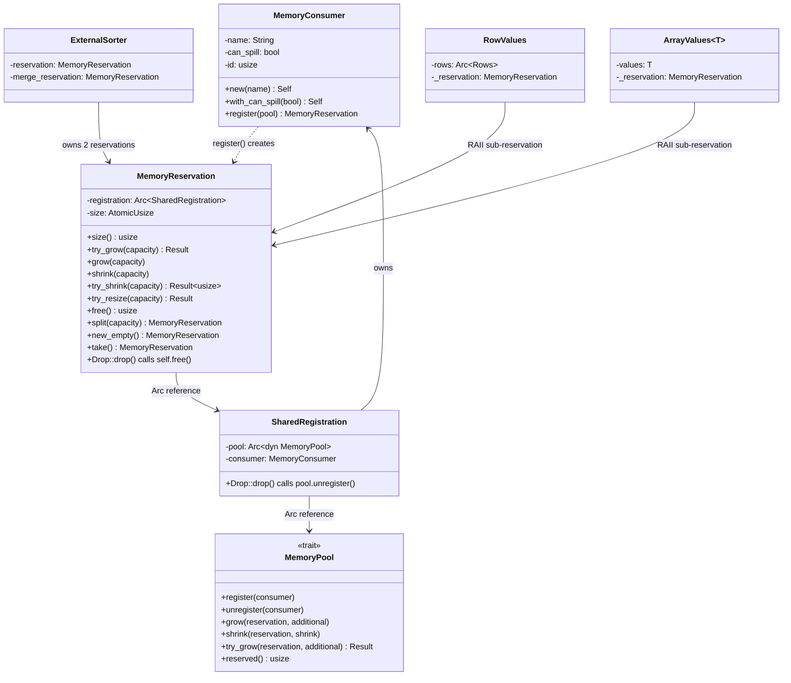
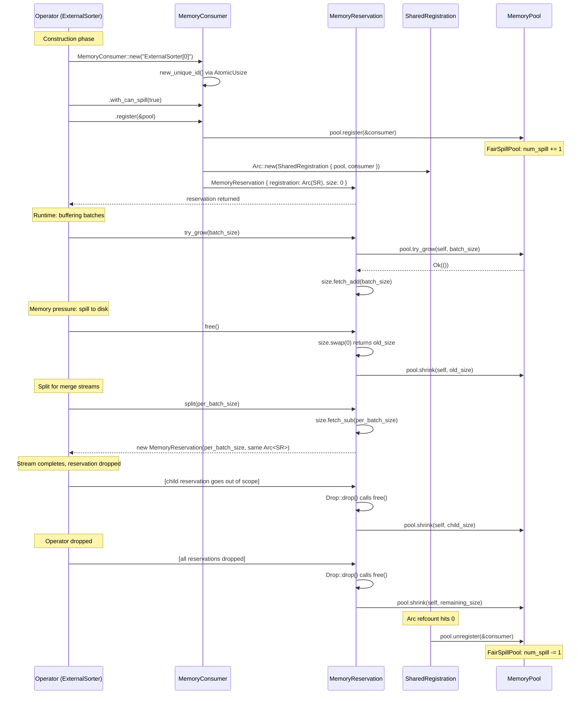

# Module Teardown: The RAII Memory Reservation Lifecycle

## 0. Research Focus
* **Task ID:** 5.2
* **Focus:** Trace the creation of a `MemoryReservation`. Look closely at its `Drop` implementation. How does it guarantee that `pool.shrink()` is called when the reservation is destroyed? Contrast this compiler-enforced safety with Trino's `free()` calls.

## 1. High-Level Overview
* **Core Responsibility:** `MemoryReservation` is the RAII handle through which DataFusion operators account for their memory usage against a shared `MemoryPool`. Each reservation tracks a `size: AtomicUsize` of claimed bytes and holds an `Arc<SharedRegistration>` that ties it to the pool. The `Drop` implementation calls `self.free()`, which atomically zeroes the size and calls `pool.shrink()` -- this is a compiler-enforced guarantee that memory is returned regardless of how the reservation goes out of scope (normal return, early `?` error, panic unwind). Multiple reservations can share the same `SharedRegistration` via `split()` / `new_empty()` / `take()`, enabling operators like `ExternalSorter` to manage independent sub-budgets (spillable data vs. merge buffer) under a single logical consumer.
* **Key Triggers:** Created when `MemoryConsumer::new("name").register(&pool)` is called. Grown via `try_grow()` / `grow()` before buffering data. Shrunk via `shrink()` / `free()` after spilling or releasing batches. Automatically zeroed and returned to the pool on `Drop`. The `SharedRegistration` unregisters the consumer from the pool only when the last `Arc` reference is dropped.

## 2. Structural Architecture
* **Primary Source Files:**
  - `datafusion/execution/src/memory_pool/mod.rs` -- `MemoryReservation`, `SharedRegistration`, `MemoryConsumer`, `MemoryPool` trait
  - `datafusion/execution/src/memory_pool/pool.rs` -- `UnboundedMemoryPool`, `GreedyMemoryPool`, `FairSpillPool`, `TrackConsumersPool`
  - `datafusion/physical-plan/src/sorts/sort.rs` -- `ExternalSorter` (best example of dual-reservation pattern)
  - `datafusion/physical-plan/src/sorts/stream.rs` -- `RowCursorStream` / `FieldCursorStream` (sub-reservation via `new_empty()`)
  - `datafusion/physical-plan/src/sorts/cursor.rs` -- `RowValues` / `ArrayValues` (RAII sub-reservation holders)
  - `datafusion/physical-plan/src/sorts/builder.rs` -- `BatchBuilder` (reservation transferred via `take()`)
  - `datafusion/physical-plan/src/stream.rs` -- `ReservationStream` (reservation shrinks as batches are yielded)
  - `datafusion/physical-plan/src/aggregates/row_hash.rs` -- `GroupedHashAggregateStream` (try_resize pattern)

* **Key Data Structures:**
  - `MemoryReservation { registration: Arc<SharedRegistration>, size: AtomicUsize }` -- The RAII handle itself
  - `SharedRegistration { pool: Arc<dyn MemoryPool>, consumer: MemoryConsumer }` -- Ref-counted link; calls `pool.unregister()` on its own Drop
  - `MemoryConsumer { name: String, can_spill: bool, id: usize }` -- Named, process-unique identity for each allocation source

### Class Diagram


## 3. Execution & Call Flow

### 3.1 Creation Chain: `MemoryConsumer::new("name").register(&pool)`

The full creation path from source (`mod.rs` lines 274-331):

```rust
// Step 1: Create the consumer with a process-unique ID
impl MemoryConsumer {
    fn new_unique_id() -> usize {
        static ID: atomic::AtomicUsize = atomic::AtomicUsize::new(0);
        ID.fetch_add(1, atomic::Ordering::Relaxed)
    }

    pub fn new(name: impl Into<String>) -> Self {
        Self {
            name: name.into(),
            can_spill: false,
            id: Self::new_unique_id(),  // globally unique, monotonically increasing
        }
    }
}
```

The ID counter is a process-global `AtomicUsize`. Every `MemoryConsumer::new()` call gets a unique ID via `fetch_add(1, Relaxed)`. This means two partitions of the same operator get distinct IDs, which is critical for `FairSpillPool` and `TrackConsumersPool` to treat them as separate entities.

```rust
// Step 2: Register with the pool, wrapping in SharedRegistration + MemoryReservation
pub fn register(self, pool: &Arc<dyn MemoryPool>) -> MemoryReservation {
    pool.register(&self);                          // notify pool of new consumer
    MemoryReservation {
        registration: Arc::new(SharedRegistration {
            pool: Arc::clone(pool),                // Arc to shared pool
            consumer: self,                        // takes ownership of consumer
        }),
        size: atomic::AtomicUsize::new(0),         // starts at zero bytes
    }
}
```

Key observations:
1. `pool.register(&self)` is called BEFORE constructing the reservation. For `FairSpillPool`, this increments `num_spill` if `can_spill` is true. For `GreedyMemoryPool` / `UnboundedMemoryPool`, `register` is a no-op.
2. The `MemoryConsumer` is moved (consumed) into `SharedRegistration`. It cannot be reused -- a design that prevents accidentally double-registering the same consumer.
3. The initial size is 0. No memory is claimed yet; the operator must call `try_grow()` to request bytes.

### 3.2 `try_grow(additional: usize)` -- Fallible Memory Acquisition

```rust
pub fn try_grow(&self, capacity: usize) -> Result<()> {
    self.registration.pool.try_grow(self, capacity)?;       // ask pool first
    self.size.fetch_add(capacity, atomic::Ordering::Relaxed); // only bump if pool said OK
    Ok(())
}
```

The ordering is critical: pool check THEN local counter update. If `pool.try_grow()` returns `Err`, the local `size` is never incremented. This two-phase protocol means the reservation's `size` is always <= the amount the pool has accounted for, never greater.

For `GreedyMemoryPool`, the pool-level check is an atomic CAS loop:

```rust
// pool.rs lines 90-103
fn try_grow(&self, reservation: &MemoryReservation, additional: usize) -> Result<()> {
    self.used
        .fetch_update(Ordering::Relaxed, Ordering::Relaxed, |used| {
            let new_used = used + additional;
            (new_used <= self.pool_size).then_some(new_used)
        })
        .map_err(|used| {
            insufficient_capacity_err(
                reservation, additional,
                self.pool_size.saturating_sub(used),
            )
        })?;
    Ok(())
}
```

The `fetch_update` atomically checks and updates in a single operation. If `used + additional > pool_size`, the closure returns `None`, the CAS fails, and the error message includes the consumer name and available capacity.

### 3.3 `grow(capacity: usize)` -- Infallible Growth

```rust
pub fn grow(&self, capacity: usize) {
    self.registration.pool.grow(self, capacity);
    self.size.fetch_add(capacity, atomic::Ordering::Relaxed);
}
```

This bypasses the limit check. For `GreedyMemoryPool`, the pool-level `grow()` simply does `self.used.fetch_add(additional, Relaxed)` without checking the limit. This is intentional -- `grow()` is used in scenarios where the memory is already allocated (e.g., the batch is already in memory) and must be accounted for even if it pushes past the limit.

### 3.4 `try_resize(new_size: usize)` -- Grow or Shrink to Target

```rust
pub fn try_resize(&self, capacity: usize) -> Result<()> {
    let size = self.size.load(atomic::Ordering::Relaxed);
    match capacity.cmp(&size) {
        Ordering::Greater => self.try_grow(capacity - size)?,  // need more
        Ordering::Less => {
            self.try_shrink(size - capacity)?;                 // release excess
        }
        _ => {}                                                // already exact
    };
    Ok(())
}
```

This is the primary API used by `GroupedHashAggregateStream`:

```rust
// row_hash.rs line 1078
let reservation_result = self.reservation.try_resize(new_size);
```

The aggregation operator periodically recomputes `new_size = groups_and_acc_size + sort_headroom` and calls `try_resize`. This is more efficient than manually computing deltas because the reservation handles the direction internally.

### 3.5 `shrink(capacity: usize)` -- Return Memory to Pool

```rust
pub fn shrink(&self, capacity: usize) {
    self.size
        .fetch_update(
            atomic::Ordering::Relaxed,
            atomic::Ordering::Relaxed,
            |prev| prev.checked_sub(capacity),   // underflow check
        )
        .unwrap_or_else(|prev| {
            panic!("Cannot free the capacity {capacity} out of allocated size {prev}")
        });
    self.registration.pool.shrink(self, capacity);
}
```

The `fetch_update` with `checked_sub` is a panic-on-underflow guard. The atomic CAS ensures that even if two threads were to call `shrink` concurrently (unusual but possible with `&self`), neither could drive the size below zero. On success, the pool is notified immediately.

### 3.6 `try_shrink(capacity: usize)` -- Non-Panicking Shrink

```rust
pub fn try_shrink(&self, capacity: usize) -> Result<usize> {
    let prev = self
        .size
        .fetch_update(
            atomic::Ordering::Relaxed,
            atomic::Ordering::Relaxed,
            |prev| prev.checked_sub(capacity),
        )
        .map_err(|prev| {
            internal_datafusion_err!(
                "Cannot free the capacity {capacity} out of allocated size {prev}"
            )
        })?;
    self.registration.pool.shrink(self, capacity);
    Ok(prev - capacity)   // returns new size
}
```

Same logic as `shrink` but returns `Result` instead of panicking. This is used by `try_resize` internally.

### 3.7 `free()` -- Zero Out the Reservation

```rust
pub fn free(&self) -> usize {
    let size = self.size.swap(0, atomic::Ordering::Relaxed);  // atomic zero
    if size != 0 {
        self.registration.pool.shrink(self, size);             // return all bytes
    }
    size  // returns how much was freed
}
```

`free()` uses `swap(0)` -- an unconditional atomic exchange. This is idempotent: calling `free()` on an already-freed reservation harmlessly returns 0 without touching the pool. This property is essential because `Drop` calls `free()`, and operators may also call `free()` explicitly before the reservation is dropped.

### 3.8 `split(capacity: usize)` -- Create a Child Reservation

```rust
pub fn split(&self, capacity: usize) -> MemoryReservation {
    self.size
        .fetch_update(
            atomic::Ordering::Relaxed,
            atomic::Ordering::Relaxed,
            |prev| prev.checked_sub(capacity),     // take bytes from self
        )
        .unwrap();
    Self {
        size: atomic::AtomicUsize::new(capacity),  // give them to the new reservation
        registration: Arc::clone(&self.registration),  // SAME SharedRegistration
    }
}
```

Critical design: `split()` does NOT call `pool.grow()` or `pool.shrink()`. It is a zero-sum redistribution of bytes between two reservations that share the same `Arc<SharedRegistration>`. From the pool's perspective, the total memory for this consumer has not changed. When either reservation is dropped, its `Drop` calls `free()` which calls `pool.shrink()`, correctly returning that portion.

This is used heavily in `ExternalSorter::in_mem_sort_stream`:

```rust
// sort.rs lines 692-698 -- split reservation per batch for merge streams
let streams = std::mem::take(&mut self.in_mem_batches)
    .into_iter()
    .map(|batch| {
        let reservation = self
            .reservation
            .split(get_reserved_bytes_for_record_batch(&batch)?);
        let input = self.sort_batch_stream(batch, &metrics, reservation)?;
        Ok(spawn_buffered(input, 1))
    })
    .collect::<Result<_>>()?;
```

Each batch gets its own `MemoryReservation` (via `split`) that is tied to the stream processing it. When the stream finishes and drops, that reservation's `Drop` returns those bytes.

### 3.9 `new_empty()` -- Sibling Reservation with Zero Bytes

```rust
pub fn new_empty(&self) -> Self {
    Self {
        size: atomic::AtomicUsize::new(0),
        registration: Arc::clone(&self.registration),
    }
}
```

Creates a new `MemoryReservation` sharing the same `SharedRegistration` but with 0 bytes. No pool interaction at all. The new reservation must call `try_grow()` to acquire bytes. This is used in `FieldCursorStream` to create per-array sub-reservations:

```rust
// cursor.rs line 253 (FieldCursorStream::convert_batch)
let array_reservation = self.reservation.new_empty();
array_reservation.try_grow(size_in_mem)?;
Ok(ArrayValues::new(self.sort.options, array, array_reservation))
```

Each `ArrayValues` holds a `_reservation: MemoryReservation` field. When the `ArrayValues` is dropped (because the cursor has moved past it), its `Drop` frees those bytes.

### 3.10 `take(&mut self)` -- Transfer All Bytes

```rust
pub fn take(&mut self) -> MemoryReservation {
    self.split(self.size.load(atomic::Ordering::Relaxed))
}
```

`take()` is `split()` with `capacity = self.size` -- it transfers ALL bytes to a new reservation, leaving the original at 0. This is used when transferring a reservation's ownership to a downstream stream:

```rust
// sort.rs line 367 -- transfer merge reservation to streaming merge
.with_reservation(self.merge_reservation.take())
```

The merge reservation's bytes move to the `BatchBuilder` inside the streaming merge. The original `self.merge_reservation` now has size 0, but still shares the same `SharedRegistration`.

### Sequence Diagram: Full Lifecycle



## 4. Concurrency & State Management

### 4.1 Atomic Operations on `size`

The `size` field is `AtomicUsize`, not a plain `usize`. All reads use `load(Relaxed)`, all writes use `fetch_add`, `fetch_sub`, `fetch_update`, or `swap` with `Relaxed` ordering. This means:

- **No locks** are needed for the reservation's own bookkeeping.
- **Relaxed ordering** is sufficient because the reservation is conceptually single-owner. While `&self` methods permit concurrent access (e.g., from `split()` being called while `size()` is read), the atomicity prevents torn reads. Relaxed is safe because there are no dependent reads/writes on other memory locations that need to be ordered relative to the size update.

### 4.2 The `fetch_update` Pattern for Checked Subtraction

Both `shrink()` and `split()` use `fetch_update` with `checked_sub`:

```rust
self.size.fetch_update(Relaxed, Relaxed, |prev| prev.checked_sub(capacity))
```

This is a CAS (compare-and-swap) loop that:
1. Loads the current value
2. Applies the closure (checked_sub)
3. If the closure returns `Some(new_val)`, attempts to CAS from old to new
4. On CAS failure (concurrent modification), retries from step 1
5. If the closure returns `None` (underflow), fails immediately

This guarantees that even under (hypothetical) concurrent access, the size never goes negative.

### 4.3 Pool-Level Synchronization

Each pool implementation handles its own synchronization:

- **`UnboundedMemoryPool`**: `AtomicUsize` for `used`. Lock-free.
- **`GreedyMemoryPool`**: `AtomicUsize` for `used` with `fetch_update` CAS loop for `try_grow`. Lock-free.
- **`FairSpillPool`**: `parking_lot::Mutex<FairSpillPoolState>` because `try_grow` needs to read both `num_spill` and `unspillable` atomically relative to each other.
- **`TrackConsumersPool`**: `parking_lot::Mutex<HashMap<usize, TrackedConsumer>>` for the consumer tracking map. Delegates to inner pool for actual memory accounting.

### 4.4 `SharedRegistration` and Arc Refcounting

`split()`, `new_empty()`, and `take()` all do `Arc::clone(&self.registration)`. This means multiple `MemoryReservation`s can coexist pointing to the same `SharedRegistration`. The `SharedRegistration::Drop` only fires when the last `Arc` is dropped:

```rust
impl Drop for SharedRegistration {
    fn drop(&mut self) {
        self.pool.unregister(&self.consumer);
    }
}
```

This means:
- Dropping a child reservation (from `split()`) does NOT unregister the consumer.
- Only when the very last reservation sharing that `SharedRegistration` is dropped does `unregister` fire.
- For `FairSpillPool`, this is when `num_spill` is decremented.

## 5. Memory & Resource Profile

### 5.1 The Drop Guarantee

The entire safety model rests on three lines:

```rust
// mod.rs lines 499-503
impl Drop for MemoryReservation {
    fn drop(&mut self) {
        self.free();
    }
}
```

And `free()` itself:

```rust
pub fn free(&self) -> usize {
    let size = self.size.swap(0, atomic::Ordering::Relaxed);
    if size != 0 {
        self.registration.pool.shrink(self, size);
    }
    size
}
```

**Why this is watertight:**

1. **Rust's ownership model** guarantees `Drop::drop()` is called when a value goes out of scope -- whether by normal return, early `?` return, or panic unwinding. There is no garbage collector delay; it happens at the exact point of scope exit.

2. **`swap(0, Relaxed)` is idempotent.** If `free()` was already called explicitly, `swap` returns 0 and the `if size != 0` guard skips the pool call. Double-free is impossible.

3. **`pool.shrink()` always succeeds.** The `shrink` method on `MemoryPool` is infallible (returns `()`). There is no error path that could cause bytes to be "lost" during cleanup.

4. **No allocation in Drop.** The `Drop` path does not allocate memory or acquire resources that could fail. It is a pure deallocation path.

### 5.2 The Two-Level Drop Cascade

```
MemoryReservation::drop()
    -> self.free()
        -> pool.shrink(self, size)          // returns bytes to pool
    // Arc<SharedRegistration> refcount decremented
    // If refcount hits 0:
    SharedRegistration::drop()
        -> pool.unregister(&self.consumer)  // removes consumer from pool's tracking
```

For `FairSpillPool`, the cascade is:
- `shrink()`: `state.spillable -= shrink` (under mutex)
- `unregister()`: `state.num_spill -= 1` (under mutex)

These are separate mutex acquisitions, which is fine because `shrink` is called first (returning bytes), then `unregister` (removing the consumer from the fair-share calculation).

### 5.3 Operator Usage Patterns

**Pattern 1: Dual Reservation (ExternalSorter)**

```rust
// sort.rs lines 282-288
let reservation = MemoryConsumer::new(format!("ExternalSorter[{partition_id}]"))
    .with_can_spill(true)
    .register(&runtime.memory_pool);

let merge_reservation =
    MemoryConsumer::new(format!("ExternalSorterMerge[{partition_id}]"))
        .register(&runtime.memory_pool);   // NOTE: NOT can_spill
```

Two separate `MemoryConsumer` instances, two separate `SharedRegistration`s. The main `reservation` is spillable; the `merge_reservation` is not. This matters for `FairSpillPool`: the merge reservation's bytes count against `unspillable`, ensuring the merge always has memory available even when spillable operators are under pressure.

The merge reservation is pre-allocated to `sort_spill_reservation_bytes`:

```rust
// sort.rs lines 783-792
fn reserve_memory_for_merge(&mut self) -> Result<()> {
    if self.runtime.disk_manager.tmp_files_enabled() {
        let size = self.sort_spill_reservation_bytes;
        if self.merge_reservation.size() != size {
            self.merge_reservation.try_resize(size)?;
        }
    }
    Ok(())
}
```

When it is time to merge, the reservation is transferred atomically:

```rust
// sort.rs line 367 -- spill path: transfer to streaming merge
.with_reservation(self.merge_reservation.take())

// sort.rs line 374 -- non-spill path: release back to pool
self.merge_reservation.free();
```

**Pattern 2: RAII Sub-Reservation (RowValues / ArrayValues)**

```rust
// cursor.rs lines 154-159
pub struct RowValues {
    rows: Arc<Rows>,
    _reservation: MemoryReservation,  // prefixed with _ to suppress unused warning
}
```

The `_reservation` field exists purely for its `Drop` effect. When `RowValues` is dropped (because the merge cursor moves past it), the reservation's `Drop` returns those bytes to the pool. The underscore prefix is idiomatic Rust for "this field is held for side effects only."

**Pattern 3: Incremental Shrink (ReservationStream)**

```rust
// stream.rs lines 730-755
fn poll_next(...) -> Poll<Option<Self::Item>> {
    match self.inner.poll_next_unpin(cx) {
        Poll::Ready(Some(Ok(batch))) => {
            self.reservation.shrink(get_record_batch_memory_size(&batch));
            Poll::Ready(Some(Ok(batch)))
        }
        Poll::Ready(None) => {
            self.reservation.free();   // stream done, free remaining
            Poll::Ready(None)
        }
        ...
    }
}
```

As each batch is yielded out of the stream, the reservation shrinks by that batch's size. When the stream ends, any remaining bytes are freed. And if the stream is dropped mid-iteration (e.g., LIMIT operator), `Drop` handles the cleanup.

**Pattern 4: try_resize for Dynamic Bookkeeping (GroupedHashAggregateStream)**

```rust
// row_hash.rs line 1078
let reservation_result = self.reservation.try_resize(new_size);
```

The aggregation operator recomputes its total memory need (`groups_and_acc_size + sort_headroom`) on each batch and calls `try_resize`. If the new size exceeds the pool limit, it triggers spilling. The `try_resize` API handles the direction (grow vs. shrink) internally.

**Pattern 5: Grow-then-shrink Bracket (Aggregation Spill)**

```rust
// row_hash.rs lines 1155-1175
self.reservation.try_grow(sort_memory)?;      // reserve for sort
// ... perform sort and write spill file ...
self.reservation.shrink(sort_memory);          // release sort memory
```

A manual bracket pattern: reserve temporary memory, use it, then return it. If the code between grow and shrink panics, `Drop` will clean up the full reservation (not just `sort_memory`), which is still correct because the pool gets all bytes back.

## 6. Key Design Insights

### Insight 1: Compiler-Enforced Cleanup vs. Trino's Manual `free()` Calls

**DataFusion (Rust RAII):**
```rust
// The Drop impl is the ENTIRE cleanup mechanism:
impl Drop for MemoryReservation {
    fn drop(&mut self) {
        self.free();
    }
}
```

The Rust compiler guarantees `Drop::drop()` is called at scope exit. There is no way to "forget" to free memory. Even in error paths, the reservation is cleaned up because `Result<T, E>` unwinding drops all locals. This is a zero-cost abstraction -- no runtime overhead, no garbage collector, no reference counting for the cleanup itself.

**Trino (Java manual lifecycle):**
In Trino, `LocalMemoryContext.setBytes(0)` or `close()` must be called explicitly. The Java pattern typically looks like:
```java
// Trino pattern (pseudocode from memory management)
localMemoryContext.setBytes(newSize);
// ... if exception thrown here ...
// GC will eventually collect the LocalMemoryContext, but:
// 1. GC timing is non-deterministic
// 2. finalizers are not guaranteed to run
// 3. Memory pool sees "phantom" usage until GC collects
```

Trino mitigates this with try-finally blocks and `Closeable` patterns, but these are convention-enforced, not compiler-enforced. A missing `finally` block or a `close()` call in the wrong order is a silent memory leak that manifests as phantom pool pressure.

**The fundamental difference:** In DataFusion, the compiler rejects any code path where memory might not be returned. In Trino, correctness depends on developer discipline for every allocation site.

### Insight 2: `Arc<SharedRegistration>` Enables Zero-Cost Reservation Splitting

The `split()` / `new_empty()` / `take()` operations never touch the pool. They merely redistribute bytes between two `MemoryReservation` instances that share the same `Arc<SharedRegistration>`. The pool sees no difference -- it still tracks the same total for that consumer.

This is exploited in `ExternalSorter::in_mem_sort_stream` where each in-memory batch gets its own split reservation:

```rust
let reservation = self.reservation.split(get_reserved_bytes_for_record_batch(&batch)?);
```

Each batch's reservation has an independent `Drop` that returns exactly that batch's bytes when the batch's sort stream finishes. This is a compositional RAII pattern: the parent reservation distributes bytes to children, and each child cleans up independently.

### Insight 3: Spillable vs. Non-Spillable Creates a Two-Tier Memory Economy

The `ExternalSorter` deliberately creates two consumers with different `can_spill` flags:

```rust
// Spillable -- main data reservation
MemoryConsumer::new("ExternalSorter[0]").with_can_spill(true)

// Non-spillable -- merge buffer reservation
MemoryConsumer::new("ExternalSorterMerge[0]")  // can_spill defaults to false
```

In `FairSpillPool`, this means:
- The spillable reservation competes with other spillable operators for `(pool_size - unspillable) / num_spill` bytes.
- The merge reservation's bytes are deducted from the "unspillable" pool, guaranteeing they cannot be taken by competing spillable operators.

This is a deliberate design choice: the merge phase MUST have memory to complete (it cannot spill mid-merge), so its memory is protected from fair-sharing pressure.

### Insight 4: `take()` Prevents Race Conditions During Reservation Transfer

When the `ExternalSorter` transfers its merge reservation to the streaming merge:

```rust
// sort.rs lines 352-368 (with comments from source)
// Transfer the pre-reserved merge memory to the streaming merge
// using `take()` instead of `new_empty()`. This ensures the merge
// stream starts with `sort_spill_reservation_bytes` already
// allocated, preventing starvation when concurrent sort partitions
// compete for pool memory. `take()` moves the bytes atomically
// without releasing them back to the pool, so other partitions
// cannot race to consume the freed memory.
.with_reservation(self.merge_reservation.take())
```

If instead the code did `free()` then `try_grow()` on the new reservation, there would be a TOCTOU window where concurrent partitions could grab the freed bytes. `take()` (which is `split(self.size)`) atomically moves bytes between reservations without ever releasing them to the pool. This is a concurrency-safe ownership transfer.

### Insight 5: The `_reservation` Field Pattern is Compositional RAII

`RowValues` and `ArrayValues` hold `_reservation: MemoryReservation` fields that exist solely for their `Drop` effect:

```rust
pub struct RowValues {
    rows: Arc<Rows>,
    _reservation: MemoryReservation,  // held for Drop side-effect only
}
```

This pattern ties memory accounting to data lifetime without any explicit cleanup code. When the `RowValues` is replaced (cursor advances), the old value is dropped, the reservation's `Drop` fires, and bytes return to the pool. This is compositional: each layer of the system can embed a reservation and get automatic cleanup.

### Insight 6: Idempotent `free()` via `swap(0)` Prevents Double-Free

```rust
pub fn free(&self) -> usize {
    let size = self.size.swap(0, atomic::Ordering::Relaxed);
    if size != 0 {
        self.registration.pool.shrink(self, size);
    }
    size
}
```

`swap(0)` is unconditional and atomic -- it returns the old value and sets to 0 in one operation. This means:
- First call: returns `N`, calls `pool.shrink(N)`.
- Second call (including `Drop`): returns `0`, skips `pool.shrink`.

No double-accounting, no panics, no errors. The explicit `free()` call pattern (common in spill paths) coexists safely with the implicit `Drop` call. This eliminates an entire class of bugs where manual cleanup and automatic cleanup could conflict.

### Insight 7: Process-Unique IDs Enable Per-Consumer Tracking Across Partitions

```rust
fn new_unique_id() -> usize {
    static ID: atomic::AtomicUsize = atomic::AtomicUsize::new(0);
    ID.fetch_add(1, atomic::Ordering::Relaxed)
}
```

Every `MemoryConsumer::new()` gets a globally unique ID. This means that `ExternalSorter[0]` and `ExternalSorter[1]` (partitions 0 and 1) get distinct IDs. The `TrackConsumersPool` uses this ID as a `HashMap` key to track per-consumer usage and peak:

```rust
// pool.rs line 459
let existing = guard.insert(consumer.id(), TrackedConsumer { ... });
```

When `try_grow` fails, the error message includes the top N consumers by reserved bytes:

```rust
"Additional allocation failed for ExternalSorter[0] with top memory consumers:
  ExternalSorter[1]#7(can spill: true) consumed 50.0 MiB, peak 80.0 MiB,
  HashJoinInput#3(can spill: false) consumed 40.0 MiB, peak 40.0 MiB."
```

This is invaluable for debugging memory pressure in production queries.

### Insight 8: `VecAllocExt` and `HashTableAllocExt` — Incremental Accounting Proxies

DataFusion provides proxy traits that track memory incrementally into a local `usize` counter without touching the pool on every push/insert:

```rust
// Used in aggregation group values, join hash maps, etc.
pub trait VecAllocExt {
    fn push_accounted(&mut self, x: T, accounting: &mut usize) { ... }
}
pub trait HashTableAllocExt {
    fn insert_accounted(&mut self, x: T, hasher: impl Fn(&T) -> u64, accounting: &mut usize) { ... }
}
```

The operator periodically syncs with the pool via `reservation.try_resize(accumulated_total)`. This batching reduces contention on the pool's synchronization primitives. The aggregate operator does this in `update_memory_reservation()` after processing each input batch — not after every row.

### Insight 9: `ReservationStream` — Stream-Lifetime Reservation Binding

`ReservationStream` ties a reservation to a stream, shrinking incrementally as batches are emitted:

```rust
pub(crate) struct ReservationStream {
    schema: SchemaRef,
    inner: SendableRecordBatchStream,
    reservation: MemoryReservation,
}

impl Stream for ReservationStream {
    fn poll_next(...) -> Poll<Option<...>> {
        match self.inner.poll_next_unpin(cx) {
            Poll::Ready(Some(Ok(batch))) => {
                self.reservation.shrink(get_record_batch_memory_size(&batch));
                Poll::Ready(Some(Ok(batch)))
            }
            Poll::Ready(None) => {
                self.reservation.free();  // Stream done → free everything
                Poll::Ready(None)
            }
            // ...
        }
    }
}
```

As each batch is emitted downstream, the reservation shrinks by exactly that batch's size. This ensures the pool budget is gradually released as data flows, rather than held until the entire stream completes.

### Insight 10: `try_resize` Avoids Release-Then-Reacquire

The code comments explicitly note:
> *"Using try_resize avoids a release-then-reacquire cycle, which matters for MemoryPool implementations where grow/shrink have non-trivial cost (e.g. JNI calls in Comet)."*

`try_resize(new_size)` dispatches to `try_grow` or `shrink` based on direction comparison, avoiding the window where freed bytes could be grabbed by another consumer.
