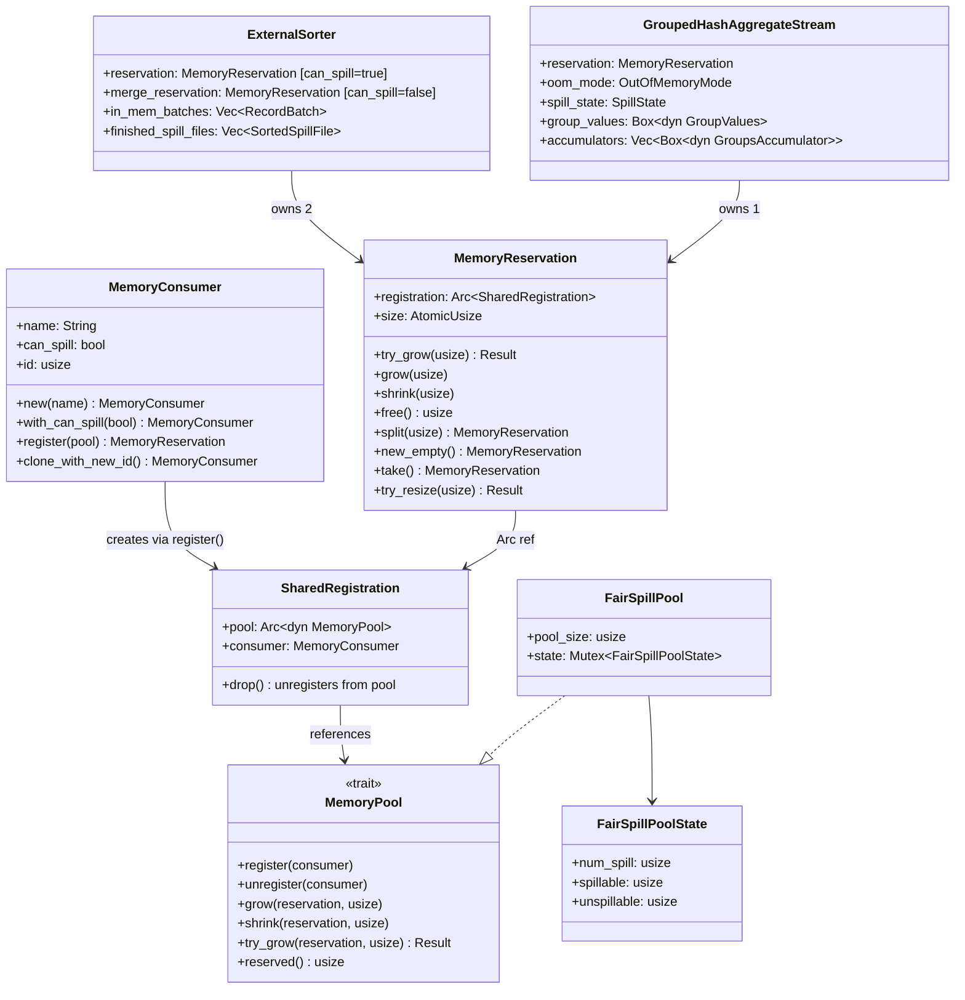
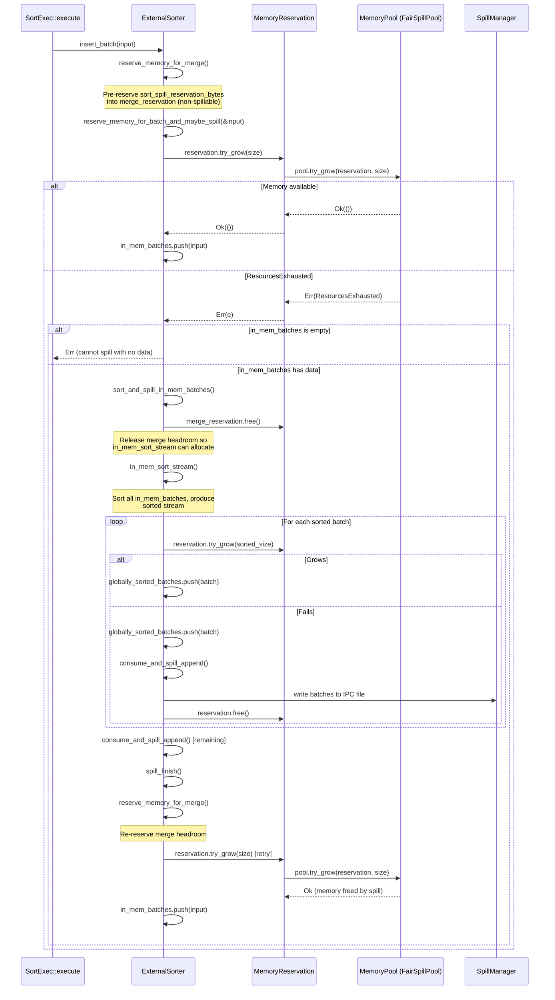

# Module Teardown: Memory Consumers & Proactive Spilling

## Table of Contents

- [0. Research Focus](#0-research-focus)
- [1. High-Level Overview](#1-high-level-overview)
- [2. Structural Architecture](#2-structural-architecture)
  - [Class Diagram](#class-diagram)
- [3. Execution & Call Flow](#3-execution-call-flow)
  - [3.1 MemoryConsumer Builder Pattern & Registration](#31-memoryconsumer-builder-pattern-registration)
  - [3.2 ExternalSorter: Dual Reservation Strategy](#32-externalsorter-dual-reservation-strategy)
  - [3.3 ExternalSorter Spill Trigger Path](#33-externalsorter-spill-trigger-path)
  - [3.4 GroupedHashAggregateStream: Three OOM Modes](#34-groupedhashaggregatestream-three-oom-modes)
  - [3.5 HashJoinExec: Non-Spillable Build Side](#35-hashjoinexec-non-spillable-build-side)
  - [3.6 RepartitionExec: Spillable Channel Memory](#36-repartitionexec-spillable-channel-memory)
  - [3.7 Other Operator Registrations](#37-other-operator-registrations)
- [4. Concurrency & State Management](#4-concurrency-state-management)
  - [The `can_spill` Contract and FairSpillPool](#the-can_spill-contract-and-fairspillpool)
  - [AtomicUsize for Reservation Size](#atomicusize-for-reservation-size)
  - [No Background Thread](#no-background-thread)
- [5. Memory & Resource Profile](#5-memory-resource-profile)
  - [ExternalSorter Memory Lifecycle](#externalsorter-memory-lifecycle)
  - [GroupedHashAggregateStream Memory Lifecycle](#groupedhashaggregatestream-memory-lifecycle)
  - [Memory Estimation for Sort](#memory-estimation-for-sort)
- [6. Key Design Insights](#6-key-design-insights)
  - [Insight 1: Synchronous Inline Spilling Eliminates Coordination Complexity](#insight-1-synchronous-inline-spilling-eliminates-coordination-complexity)
  - [Insight 2: Dual Reservation Pattern Protects Merge Phase](#insight-2-dual-reservation-pattern-protects-merge-phase)
  - [Insight 3: The `can_spill` Flag is a Contract, Not a Mechanism](#insight-3-the-can_spill-flag-is-a-contract-not-a-mechanism)
  - [Insight 4: Aggregate Sort Headroom Prevents OOM During Spill](#insight-4-aggregate-sort-headroom-prevents-oom-during-spill)
  - [Insight 5: One-Shot Spill Merge Prevents Recursive Spilling](#insight-5-one-shot-spill-merge-prevents-recursive-spilling)
  - [Insight 6: RepartitionExec Demonstrates Batch-Level Spill Granularity](#insight-6-repartitionexec-demonstrates-batch-level-spill-granularity)
  - [Insight 7: RAII Registration Lifecycle via Arc Reference Counting](#insight-7-raii-registration-lifecycle-via-arc-reference-counting)
  - [Insight 8: `SharedMemoryReservation` Pattern for Multi-Task Access](#insight-8-sharedmemoryreservation-pattern-for-multi-task-access)
  - [Insight 9: `MemoryConsumer` is a One-Shot Factory](#insight-9-memoryconsumer-is-a-one-shot-factory)


## 0. Research Focus
* **Task ID:** 5.3
* **Focus:** Trace how a specific operator (like `ExternalSorter`) registers as a `MemoryConsumer`. Trace the execution path when `reservation.try_grow()` fails. How does this directly trigger the spilling logic without requiring a background revoking thread?

## 1. High-Level Overview
* **Core Responsibility:** DataFusion's memory management uses a **synchronous, inline spilling model** where each operator is individually responsible for reacting to memory pressure at the exact point of allocation failure. There is no background memory revoking thread, no asynchronous revocation protocol, and no central coordinator that decides which operator should spill. Instead, when `reservation.try_grow()` returns `Err(ResourcesExhausted)`, the calling operator immediately decides whether and how to free memory (spill to disk, emit early, or propagate the error). This design eliminates the complexity of cross-operator coordination and makes memory management deterministic and lock-free in the common path.
* **Key Triggers:** `MemoryReservation::try_grow()` failure (returns `DataFusionError::ResourcesExhausted`); operator-level budget checks after each input batch; `FairSpillPool` fair-share enforcement for spillable consumers.

## 2. Structural Architecture
* **Primary Source Files:**
  - `datafusion/execution/src/memory_pool/mod.rs` -- `MemoryConsumer`, `MemoryReservation`, `SharedRegistration`, `MemoryPool` trait
  - `datafusion/execution/src/memory_pool/pool.rs` -- `UnboundedMemoryPool`, `GreedyMemoryPool`, `FairSpillPool`, `TrackConsumersPool`
  - `datafusion/physical-plan/src/sorts/sort.rs` -- `ExternalSorter` (dual-reservation spilling)
  - `datafusion/physical-plan/src/aggregates/row_hash.rs` -- `GroupedHashAggregateStream` (spill/emit-early/report-error modes)
  - `datafusion/physical-plan/src/joins/hash_join/exec.rs` -- `HashJoinExec` build-side collection
  - `datafusion/physical-plan/src/repartition/mod.rs` -- `RepartitionExec` channel memory + spill-to-SpillPool

* **Key Data Structures:**
  - `MemoryConsumer` -- named allocation identity with `can_spill` flag
  - `SharedRegistration` -- Arc-shared link between a consumer and a pool (RAII unregister on drop)
  - `MemoryReservation` -- mutable reservation counter; multiple can share one `SharedRegistration`
  - `FairSpillPoolState` -- tracks `num_spill`, `spillable`, `unspillable` bytes
  - `TrackedConsumer` -- per-consumer peak/current tracking in `TrackConsumersPool`

### Class Diagram



## 3. Execution & Call Flow

### 3.1 MemoryConsumer Builder Pattern & Registration

The `MemoryConsumer` struct has three fields:

```rust
// datafusion/execution/src/memory_pool/mod.rs
pub struct MemoryConsumer {
    name: String,
    can_spill: bool,
    id: usize,      // process-unique, from AtomicUsize counter
}
```

Construction follows a builder pattern:

```rust
// Step 1: Create with name (can_spill defaults to false)
MemoryConsumer::new(format!("ExternalSorter[{partition_id}]"))
// Step 2: Optionally mark as spillable
    .with_can_spill(true)
// Step 3: Register with pool, consuming self, returning a MemoryReservation
    .register(&runtime.memory_pool);
```

The `register()` method is the critical linkage point. It calls `pool.register()` (which the pool uses for bookkeeping -- e.g., `FairSpillPool` increments `num_spill`), then wraps the consumer inside a `SharedRegistration` held by `Arc`, and returns a `MemoryReservation` with size 0:

```rust
// datafusion/execution/src/memory_pool/mod.rs:322-332
pub fn register(self, pool: &Arc<dyn MemoryPool>) -> MemoryReservation {
    pool.register(&self);
    MemoryReservation {
        registration: Arc::new(SharedRegistration {
            pool: Arc::clone(pool),
            consumer: self,
        }),
        size: atomic::AtomicUsize::new(0),
    }
}
```

The `SharedRegistration` implements `Drop` to call `pool.unregister()`, which decrements `num_spill` in `FairSpillPool`. Since `MemoryReservation` holds an `Arc<SharedRegistration>`, the unregister only fires when ALL reservations sharing that registration are dropped.

### 3.2 ExternalSorter: Dual Reservation Strategy

`ExternalSorter` creates **two** separate `MemoryConsumer`/`MemoryReservation` pairs at construction:

```rust
// datafusion/physical-plan/src/sorts/sort.rs:282-288
let reservation = MemoryConsumer::new(format!("ExternalSorter[{partition_id}]"))
    .with_can_spill(true)                    // <-- SPILLABLE
    .register(&runtime.memory_pool);

let merge_reservation =
    MemoryConsumer::new(format!("ExternalSorterMerge[{partition_id}]"))
                                              // <-- NOT spillable (default false)
        .register(&runtime.memory_pool);
```

**Why two reservations:**
1. `reservation` (spillable) -- tracks `in_mem_batches`. Since `FairSpillPool` enforces fair-share limits on spillable consumers, this reservation will hit the limit early, triggering spills.
2. `merge_reservation` (non-spillable) -- pre-reserves `sort_spill_reservation_bytes` for the final merge phase. This is marked non-spillable so `FairSpillPool` does not count it against the spillable share. It ensures the merge always has enough memory even under heavy contention.

This dual-reservation pattern is a key design insight: the merge headroom is **protected** from the fair-share arithmetic that constrains spillable reservations.

### 3.3 ExternalSorter Spill Trigger Path

#### Sequence Diagram



The critical function is `reserve_memory_for_batch_and_maybe_spill`:

```rust
// datafusion/physical-plan/src/sorts/sort.rs:799-819
async fn reserve_memory_for_batch_and_maybe_spill(
    &mut self,
    input: &RecordBatch,
) -> Result<()> {
    let size = get_reserved_bytes_for_record_batch(input)?;

    match self.reservation.try_grow(size) {
        Ok(_) => Ok(()),
        Err(e) => {
            if self.in_mem_batches.is_empty() {
                return Err(Self::err_with_oom_context(e));
            }
            // Spill and try again.
            self.sort_and_spill_in_mem_batches().await?;
            self.reservation
                .try_grow(size)
                .map_err(Self::err_with_oom_context)
        }
    }
}
```

The flow is strictly **synchronous** within the operator's execution context:
1. `try_grow()` fails
2. Operator immediately calls `sort_and_spill_in_mem_batches()` -- no scheduling delay, no background thread
3. Inside `sort_and_spill_in_mem_batches()`, `merge_reservation.free()` releases the merge headroom
4. Data is sorted via `in_mem_sort_stream()` and incrementally written to an IPC spill file
5. `reservation.free()` is called inside `consume_and_spill_append()` after each chunk is written
6. After spill completes, `reserve_memory_for_merge()` re-acquires the merge headroom
7. `try_grow()` is retried -- now succeeds because spilling freed memory

### 3.4 GroupedHashAggregateStream: Three OOM Modes

The aggregate stream has a richer OOM handling model with three modes:

```rust
// datafusion/physical-plan/src/aggregates/row_hash.rs:215-222
enum OutOfMemoryMode {
    Spill,       // Sort+write intermediate state to disk
    EmitEarly,   // Emit partial results to downstream
    ReportError, // Propagate error immediately
}
```

Mode selection at construction:

```rust
// row_hash.rs:569-588
let oom_mode = match (agg.mode, &group_ordering) {
    (AggregateMode::Partial, _) => OutOfMemoryMode::EmitEarly,
    (_, GroupOrdering::None | GroupOrdering::Partial(_))
        if context.runtime_env().disk_manager.tmp_files_enabled() =>
    {
        OutOfMemoryMode::Spill
    }
    _ => OutOfMemoryMode::ReportError,
};
```

The `can_spill` flag is set dynamically based on mode:

```rust
// row_hash.rs:591-596
let reservation = MemoryConsumer::new(name)
    .with_can_spill(oom_mode != OutOfMemoryMode::ReportError)
    .register(context.memory_pool());
```

This means both `Spill` and `EmitEarly` modes register as spillable consumers, which matters for `FairSpillPool` fair-share calculation. The comment is illuminating:

> "We interpret 'can spill' as 'can handle memory back pressure'."

#### Aggregate Spill Trigger

The spill check happens after every input batch in the `poll_next` loop:

```rust
// row_hash.rs:783-791  (inside ReadingInput match arm)
// If we reach this point, try to update the memory reservation
// handling out-of-memory conditions as determined by the OOM mode.
if let Some(new_state) = self.try_update_memory_reservation()? {
    timer.done();
    self.exec_state = new_state;
    break 'reading_input;
}
```

The `try_update_memory_reservation` method:

```rust
// row_hash.rs:1019-1053
fn try_update_memory_reservation(&mut self) -> Result<Option<ExecutionState>> {
    let oom = match self.update_memory_reservation() {
        Err(e @ DataFusionError::ResourcesExhausted(_)) => e,
        Err(e) => return Err(e),
        Ok(_) => return Ok(None),
    };

    match self.oom_mode {
        OutOfMemoryMode::Spill if !self.group_values.is_empty() => {
            self.spill()?;
            self.clear_shrink(self.batch_size);
            self.update_memory_reservation()?;
            Ok(None)
        }
        OutOfMemoryMode::EmitEarly if self.group_values.len() > 1 => {
            // ... emit partial results to downstream ...
            // returns Ok(Some(ExecutionState::ProducingOutput(batch)))
        }
        _ => Err(oom),
    }
}
```

#### Key Difference from Sort's Spill Path

The `update_memory_reservation` method uses `try_resize` instead of `try_grow`:

```rust
// row_hash.rs:1055-1087
fn update_memory_reservation(&mut self) -> Result<()> {
    let acc = self.accumulators.iter().map(|x| x.size()).sum::<usize>();
    let groups_and_acc_size = acc
        + self.group_values.size()
        + self.group_ordering.size()
        + self.current_group_indices.allocated_size();

    // Reserve extra headroom for sorting during potential spill
    let sort_headroom =
        if self.oom_mode == OutOfMemoryMode::Spill && !self.group_values.is_empty() {
            acc + self.group_values.size()
        } else {
            0
        };

    let new_size = groups_and_acc_size + sort_headroom;
    self.reservation.try_resize(new_size);
    // ...
}
```

This is a **resize** pattern (not grow): the aggregate measures its actual memory footprint after processing a batch, then adjusts the reservation to match. The `sort_headroom` is a proactive reserve that ensures when spilling does happen, there is enough memory to sort the emitted data before writing it to disk.

#### Aggregate Spill Internals

```rust
// row_hash.rs:1131-1192
fn spill(&mut self) -> Result<()> {
    let Some(emit) = self.emit(EmitTo::All, true)? else {
        return Ok(());
    };

    // Free accumulated state BEFORE reserving sort memory
    self.clear_shrink(0);
    self.update_memory_reservation()?;

    // Calculate sort memory needed
    let sort_memory = ...;

    // Reserve memory for sorting
    self.reservation.try_grow(sort_memory)?;

    // Sort incrementally and write to spill file
    let sorted_iter = IncrementalSortIterator::new(emit, ...);
    let spillfile = self.spill_state.spill_manager
        .spill_record_batch_iter_and_return_max_batch_memory(sorted_iter, ...)?;

    // Release sort memory
    self.reservation.shrink(sort_memory);

    self.spill_state.spills.push(SortedSpillFile { ... });
    Ok(())
}
```

After all input is consumed, if spills exist, the aggregate enters a **merge phase**:

```rust
// row_hash.rs:1232-1282 (inside set_input_done_and_produce_output)
// Spill remaining data
self.spill()?;
self.spill_state.is_stream_merging = true;

// Create streaming merge over all spill files
self.input = StreamingMergeBuilder::new()
    .with_sorted_spill_files(std::mem::take(&mut self.spill_state.spills))
    // ...
    .build()?;
self.input_done = false;

// CRITICAL: switch to ReportError mode to prevent infinite spill loop
self.oom_mode = OutOfMemoryMode::ReportError;

ExecutionState::ReadingInput  // re-enters the reading loop with merged input
```

### 3.5 HashJoinExec: Non-Spillable Build Side

`HashJoinExec` registers a non-spillable consumer for the build (left) side:

```rust
// joins/hash_join/exec.rs:1323-1324
let reservation =
    MemoryConsumer::new("HashJoinInput").register(context.memory_pool());
```

No `with_can_spill(true)` is called, so `can_spill` defaults to `false`. This means hash join will simply fail with `ResourcesExhausted` if the build side exceeds memory. In the `collect_left_input` function, each batch's size is tracked:

```rust
// joins/hash_join/exec.rs:1929-1931
let batch_size = get_record_batch_memory_size(&batch);
state.reservation.try_grow(batch_size)?;
```

If `try_grow` fails, the `?` propagates the error up through the `try_fold`, terminating the query. There is no spill fallback for hash join's build side.

### 3.6 RepartitionExec: Spillable Channel Memory

`RepartitionExec` is the most interesting non-sort/aggregate consumer because it uses `can_spill` with a completely different spill mechanism -- the `SpillPool`:

```rust
// repartition/mod.rs:325-328
let reservation = Arc::new(Mutex::new(
    MemoryConsumer::new(format!("{name}[{partition}]"))
        .with_can_spill(true)
        .register(context.memory_pool()),
));
```

The spill decision happens inline during batch routing:

```rust
// repartition/mod.rs:1402-1416
match channel.reservation.lock().try_grow(size) {
    Ok(_) => {
        // Memory available - send in-memory batch
        (RepartitionBatch::Memory(batch), true)
    }
    Err(_) => {
        // Memory limited - spill to SpillPool
        channel.spill_writer.push_batch(&batch)?;
        (RepartitionBatch::Spilled, false)
    }
};
```

When memory is available, batches flow through channels in-memory. When `try_grow` fails, the batch is written to a `SpillPool` (a disk-backed queue), and a `Spilled` marker is sent through the channel. The receiver checks this marker and reads from the spill stream when it encounters `Spilled` entries.

### 3.7 Other Operator Registrations

| Operator | Consumer Name | `can_spill` | Spill Strategy |
|---|---|---|---|
| `ExternalSorter` main | `ExternalSorter[{p}]` | `true` | Sort + write IPC files |
| `ExternalSorter` merge | `ExternalSorterMerge[{p}]` | `false` | Protected headroom |
| `GroupedHashAggregateStream` | `GroupedHashAggregateStream[{p}]` | mode-dependent | Spill/EmitEarly/Error |
| `HashJoinExec` (CollectLeft) | `HashJoinInput` | `false` | Error only |
| `HashJoinExec` (Partitioned) | `HashJoinInput[{p}]` | `false` | Error only |
| `RepartitionExec` | `{name}[{p}]` | `true` | SpillPool disk queue |
| `RepartitionExec` merge | `{name}[Merge {p}]` | `false` | Error only |
| `CrossJoinExec` | `CrossJoinExec` | `false` | Error only |
| `NestedLoopJoinExec` | `NestedLoopJoinLoad[{p}]` | `false` | Error only |
| `SymmetricHashJoin` | `SymmetricHashJoinStream[{p}]` | `false` | Error only |
| `SortMergeJoinExec` | `SMJStream[{p}]` | `false` | Error only |

## 4. Concurrency & State Management

### The `can_spill` Contract and FairSpillPool

`FairSpillPool` is the only pool implementation where `can_spill` changes behavior. It partitions memory into spillable and unspillable regions:

```rust
// pool.rs:202-239
fn try_grow(&self, reservation: &MemoryReservation, additional: usize) -> Result<()> {
    let mut state = self.state.lock();

    match reservation.registration.consumer.can_spill {
        true => {
            // Fair share: each spillable consumer gets
            // (pool_size - unspillable) / num_spill
            let spill_available = self.pool_size.saturating_sub(state.unspillable);
            let available = spill_available
                .checked_div(state.num_spill)
                .unwrap_or(spill_available);

            if reservation.size() + additional > available {
                return Err(insufficient_capacity_err(...));
            }
            state.spillable += additional;
        }
        false => {
            // Unspillable: first-come-first-served from remaining pool
            let available = self.pool_size
                .saturating_sub(state.unspillable + state.spillable);
            if available < additional {
                return Err(insufficient_capacity_err(...));
            }
            state.unspillable += additional;
        }
    }
    Ok(())
}
```

Key invariant: **A spillable consumer's limit = (pool_size - unspillable_total) / num_spillable_consumers**. This means:
- Adding more spillable operators reduces each one's share, causing earlier spills
- Non-spillable reservations (like `ExternalSorterMerge`) eat into the spillable budget without being divided
- The registration count (`num_spill`) is tracked via `register`/`unregister` lifecycle

### AtomicUsize for Reservation Size

`MemoryReservation::size` uses `AtomicUsize` with `Ordering::Relaxed`:

```rust
// mod.rs:356-359
pub struct MemoryReservation {
    registration: Arc<SharedRegistration>,
    size: atomic::AtomicUsize,
}
```

This allows `split()`, `new_empty()`, and `take()` to create new reservations that share the same `SharedRegistration` without requiring `&mut self` on the original. The `Relaxed` ordering is sufficient because reservation accounting only needs eventual consistency -- the pool itself handles synchronization via `Mutex` (FairSpillPool) or `AtomicUsize::fetch_update` (GreedyMemoryPool).

### No Background Thread

The entire spill model is cooperative and inline:
- No `MemoryRevokingScheduler` background thread (contrast with Trino)
- No `startMemoryRevoke()`/`finishMemoryRevoke()` protocol
- No `ListenableFuture` for asynchronous revocation completion
- Each operator handles its own pressure at the point of `try_grow()` failure

## 5. Memory & Resource Profile

### ExternalSorter Memory Lifecycle

```
Phase 1: Buffering input
  reservation grows with each insert_batch()
  merge_reservation holds sort_spill_reservation_bytes

Phase 2: Spill triggered (try_grow fails)
  merge_reservation.free() -- release headroom
  in_mem_sort_stream() -- sort in place
  consume_and_spill_append() -- write to disk
    reservation.free() -- release after writing each chunk
  spill_finish() -- finalize IPC file
  reserve_memory_for_merge() -- re-acquire headroom
  reservation.try_grow(size) -- retry the failed allocation

Phase 3: Final merge (after all input consumed)
  If spills exist:
    merge_reservation.take() -- transfer bytes to streaming merge
    StreamingMergeBuilder reads from spill files + remaining in-memory data
  If no spills:
    merge_reservation.free() -- release back to pool
    in_mem_sort_stream() -- sort entirely in memory
```

### GroupedHashAggregateStream Memory Lifecycle

```
Phase 1: Aggregating input
  After each batch: update_memory_reservation()
    try_resize(groups + accumulators + sort_headroom)
  If resize fails (ResourcesExhausted):
    Spill mode: spill() -> emit all -> sort -> write to disk -> clear_shrink
    EmitEarly mode: emit partial results -> ProducingOutput state
    ReportError mode: propagate error

Phase 2: Input exhausted
  If no spills: emit all groups directly
  If spills exist:
    spill() remaining data
    Build StreamingMerge over all spill files
    Reset to ReadingInput with merged stream
    oom_mode = ReportError (prevents recursive spilling)
    Re-aggregate merged data in memory
```

### Memory Estimation for Sort

```rust
// sort.rs:846-854
pub(crate) fn get_reserved_bytes_for_record_batch_size(
    record_batch_size: usize,
    sliced_size: usize,
) -> usize {
    // 2x: original batch + sorted copy (row format or array format cursors)
    record_batch_size + sliced_size
}
```

This deliberately over-estimates to account for the sort/merge phase creating sorted copies of key columns (either row-format or array-format, depending on the `CursorData` implementation).

## 6. Key Design Insights

### Insight 1: Synchronous Inline Spilling Eliminates Coordination Complexity

**Evidence:** In `ExternalSorter::reserve_memory_for_batch_and_maybe_spill` (sort.rs:799-819), the spill path is a simple `match` on `try_grow()`:

```rust
match self.reservation.try_grow(size) {
    Ok(_) => Ok(()),
    Err(e) => {
        if self.in_mem_batches.is_empty() {
            return Err(Self::err_with_oom_context(e));
        }
        self.sort_and_spill_in_mem_batches().await?;
        self.reservation.try_grow(size).map_err(Self::err_with_oom_context)
    }
}
```

There is no cross-operator negotiation, no scheduling delay, no `Future` to poll for completion. The operator that encounters memory pressure is the one that spills, immediately. This is possible because DataFusion's pull-based execution model means the operator is already running on a Tokio task -- it can block that task to do I/O without affecting other operators' execution.

**Contrast with Trino:** Trino's `MemoryRevokingScheduler` runs as a background `ScheduledExecutorService` that periodically checks total memory usage, selects operators to revoke via `OperatorContext.requestMemoryRevoking()`, and then waits for the operator's `Driver` to call `startMemoryRevoke()` on its next iteration. This requires a two-phase protocol (request -> start -> finish) with `ListenableFuture` coordination.

### Insight 2: Dual Reservation Pattern Protects Merge Phase

**Evidence:** `ExternalSorter` creates two reservations with different `can_spill` flags (sort.rs:282-288). The merge reservation is non-spillable, meaning `FairSpillPool` does not include it in the fair-share denominator for spillable consumers. This ensures that when multiple sort operators compete for memory, each one has guaranteed headroom for its merge phase, even if all spillable budget is consumed.

The `sort_spill_reservation_bytes` parameter (configurable via `datafusion.execution.sort_spill_reservation_bytes`) controls how much is pre-reserved. If this value is too large, it wastes memory that could be used for buffering. If too small, the merge phase itself may OOM after a spill.

### Insight 3: The `can_spill` Flag is a Contract, Not a Mechanism

**Evidence:** The `GroupedHashAggregateStream` sets `can_spill` based on whether it can handle backpressure at all -- not just disk spilling:

```rust
// row_hash.rs:591-596
.with_can_spill(oom_mode != OutOfMemoryMode::ReportError)
```

Both `Spill` and `EmitEarly` modes set `can_spill = true`. The `EmitEarly` mode never writes to disk; it just emits partial aggregation results to the downstream operator. But it still claims `can_spill` because from `FairSpillPool`'s perspective, what matters is whether the operator can make forward progress when denied memory -- not how it does so.

### Insight 4: Aggregate Sort Headroom Prevents OOM During Spill

**Evidence:** In `update_memory_reservation` (row_hash.rs:1070-1075), the aggregate reserves extra headroom:

```rust
let sort_headroom =
    if self.oom_mode == OutOfMemoryMode::Spill && !self.group_values.is_empty() {
        acc + self.group_values.size()
    } else {
        0
    };
```

This doubles the apparent memory usage. The effect is that OOM triggers **before** the actual data fills memory, ensuring that when `spill()` is called, there is enough freed reservation to cover the sort of the emitted batch. Without this headroom, the sequence would be: accumulate data -> OOM -> emit all -> try to sort emitted data -> OOM again (since the emitted batch is as large as the accumulated state).

### Insight 5: One-Shot Spill Merge Prevents Recursive Spilling

**Evidence:** After the aggregate enters its merge phase, it explicitly switches to `ReportError` mode (row_hash.rs:1275-1277):

```rust
self.oom_mode = OutOfMemoryMode::ReportError;
```

This prevents the pathological case of spilling the spilled data. During the merge phase, the `StreamingMerge` reads back spill files and the aggregate re-aggregates them. If this re-aggregation itself exceeded memory and triggered another spill, the merge would never converge. By switching to `ReportError`, any OOM during merge is a hard error.

### Insight 6: RepartitionExec Demonstrates Batch-Level Spill Granularity

**Evidence:** In `repartition/mod.rs:1402-1416`, each individual batch independently decides whether to go to memory or disk:

```rust
match channel.reservation.lock().try_grow(size) {
    Ok(_) => (RepartitionBatch::Memory(batch), true),
    Err(_) => {
        channel.spill_writer.push_batch(&batch)?;
        (RepartitionBatch::Spilled, false)
    }
};
```

This is the finest granularity of spill decision in DataFusion. Unlike the sort and aggregate operators which spill their entire accumulated state, repartition can mix in-memory and spilled batches within a single partition channel, deciding per-batch based on instantaneous memory availability.

### Insight 7: RAII Registration Lifecycle via Arc Reference Counting

**Evidence:** `SharedRegistration` unregisters on drop (mod.rs:344-348), and `MemoryReservation` frees its bytes on drop (mod.rs:499-503). Since `MemoryReservation` holds `Arc<SharedRegistration>`, the registration persists as long as any reservation exists. The `split()`, `new_empty()`, and `take()` methods all clone the `Arc`, keeping the registration alive:

```rust
pub fn split(&self, capacity: usize) -> MemoryReservation {
    // ...
    Self {
        size: atomic::AtomicUsize::new(capacity),
        registration: Arc::clone(&self.registration),  // shares registration
    }
}
```

This means an operator can create many reservations for different internal data structures (sort buffers, merge buffers, etc.), and the consumer remains registered with the pool until all of them are dropped.

### Insight 8: `SharedMemoryReservation` Pattern for Multi-Task Access

When multiple async tasks must access the same reservation (e.g., repartition's input tasks routing to the same output partition), the reservation is wrapped in `Arc<Mutex<MemoryReservation>>`:

```rust
// repartition/mod.rs:325-329
let reservation = Arc::new(Mutex::new(
    MemoryConsumer::new(format!("{name}[{partition}]"))
        .with_can_spill(true)
        .register(context.memory_pool()),
));
```

The `Mutex` ensures only one task grows/shrinks the reservation at a time. This is necessary because `MemoryReservation`'s API expects single-owner usage — even though `size` is atomic, the grow→allocate sequence must be atomic at a higher level to prevent races where two tasks both succeed at `try_grow()` but the pool only has room for one.

### Insight 9: `MemoryConsumer` is a One-Shot Factory

`register()` takes `self` (not `&self`), consuming the consumer and making it impossible to register the same consumer twice:

```rust
pub fn register(self, pool: &Arc<dyn MemoryPool>) -> MemoryReservation {
    pool.register(&self);
    MemoryReservation {
        registration: Arc::new(SharedRegistration {
            pool: Arc::clone(pool),
            consumer: self,  // moved in
        }),
        size: atomic::AtomicUsize::new(0),
    }
}
```

The operator never stores the `MemoryConsumer` — only the resulting `MemoryReservation`. This prevents accidental re-registration.
