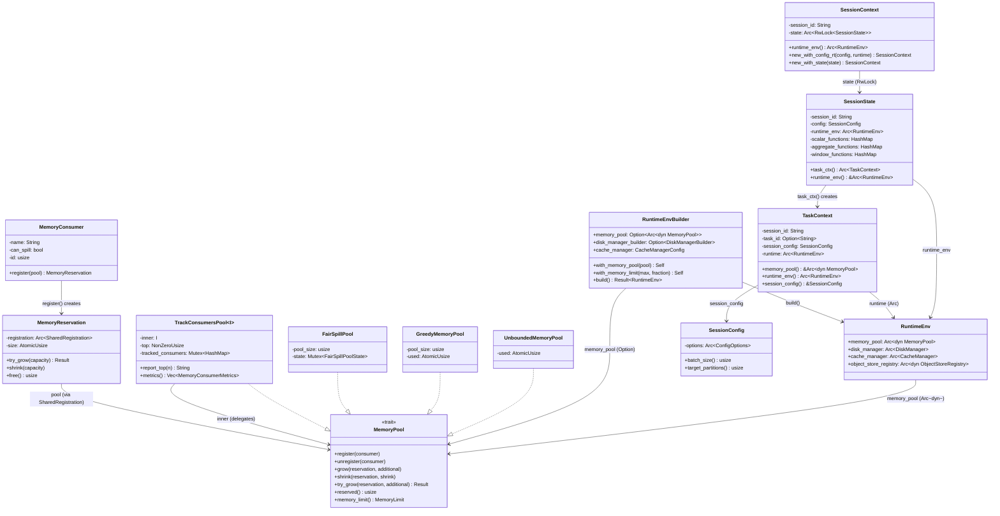
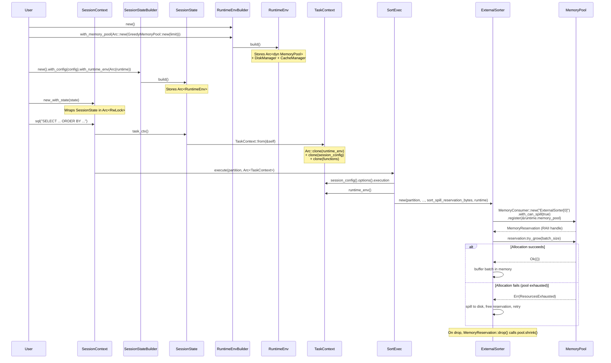

# Module Teardown: Task Context and Global Limits

## Table of Contents

- [0. Research Focus](#0-research-focus)
- [1. High-Level Overview](#1-high-level-overview)
- [2. Structural Architecture](#2-structural-architecture)
  - [Class Diagram](#class-diagram)
- [3. Execution & Call Flow](#3-execution-call-flow)
  - [3.1 RuntimeEnv Construction](#31-runtimeenv-construction)
  - [3.2 SessionContext -> SessionState -> TaskContext Chain](#32-sessioncontext-sessionstate-taskcontext-chain)
  - [3.3 Operator Access to the Pool](#33-operator-access-to-the-pool)
  - [Sequence Diagram](#sequence-diagram)
- [4. Concurrency & State Management](#4-concurrency-state-management)
  - [4.1 Pool Sharing Across Queries](#41-pool-sharing-across-queries)
  - [4.2 Atomic Operations in Pool Implementations](#42-atomic-operations-in-pool-implementations)
  - [4.3 RAII Memory Lifecycle](#43-raii-memory-lifecycle)
- [5. Memory & Resource Profile](#5-memory-resource-profile)
  - [5.1 Memory-Related Configuration Options](#51-memory-related-configuration-options)
  - [5.2 Runtime Configuration Options](#52-runtime-configuration-options)
  - [5.3 Memory Pool Types](#53-memory-pool-types)
  - [5.4 DiskManager Configuration](#54-diskmanager-configuration)
- [6. Key Design Insights](#6-key-design-insights)
  - [Insight 1: The Pool Lives in RuntimeEnv, NOT in SessionConfig](#insight-1-the-pool-lives-in-runtimeenv-not-in-sessionconfig)
  - [Insight 2: No Per-Query Memory Limits -- Pool is Process-Global](#insight-2-no-per-query-memory-limits-pool-is-process-global)
  - [Insight 3: Default is Unbounded -- Explicit Opt-In for Limits](#insight-3-default-is-unbounded-explicit-opt-in-for-limits)
  - [Insight 4: Pragmatic Memory Tracking -- Only Large Consumers Register](#insight-4-pragmatic-memory-tracking-only-large-consumers-register)
  - [Insight 5: Operators Explicitly Manage Spillable vs Unspillable Reservations](#insight-5-operators-explicitly-manage-spillable-vs-unspillable-reservations)
  - [Insight 6: TrackConsumersPool is Decorative -- Better OOM Error Messages](#insight-6-trackconsumerspool-is-decorative-better-oom-error-messages)
  - [Insight 7: Two-Level Resource Management -- Memory Pool vs DiskManager](#insight-7-two-level-resource-management-memory-pool-vs-diskmanager)
  - [Insight 8: SessionConfig and RuntimeEnv are Independent -- Joined Only at SessionState](#insight-8-sessionconfig-and-runtimeenv-are-independent-joined-only-at-sessionstate)
  - [Insight 9: FairSpillPool Prevents Starvation Among Spillable Operators](#insight-9-fairspillpool-prevents-starvation-among-spillable-operators)
  - [Insight 10: MemoryConsumer Identity is Process-Unique via AtomicUsize](#insight-10-memoryconsumer-identity-is-process-unique-via-atomicusize)


## 0. Research Focus
* **Task ID:** 5.4
* **Focus:** Trace how the `MemoryPool` is instantiated and attached to the `TaskContext`. How are global memory limits defined in the `SessionConfig` and passed down to the physical execution plan?

## 1. High-Level Overview
* **Core Responsibility:** `RuntimeEnv` holds the shared `MemoryPool` (via `Arc<dyn MemoryPool>`) along with the `DiskManager`, `CacheManager`, and `ObjectStoreRegistry`. The `TaskContext` receives a cloned `Arc<RuntimeEnv>` from the `SessionState`, becoming the single gateway through which every physical operator accesses memory accounting, spill files, and object storage during query execution.
* **Key Triggers:** `SessionContext` creation (wires `RuntimeEnv`), `SessionState::task_ctx()` (snapshots state into `TaskContext`), operator `execute()` methods (consume `Arc<TaskContext>` and call `context.memory_pool()` to register `MemoryConsumer`s).

## 2. Structural Architecture
* **Primary Source Files:**
  - `datafusion/execution/src/runtime_env.rs` -- `RuntimeEnv`, `RuntimeEnvBuilder`
  - `datafusion/execution/src/task.rs` -- `TaskContext`, `TaskContextProvider`
  - `datafusion/execution/src/memory_pool/mod.rs` -- `MemoryPool` trait, `MemoryConsumer`, `MemoryReservation`
  - `datafusion/execution/src/memory_pool/pool.rs` -- `UnboundedMemoryPool`, `GreedyMemoryPool`, `FairSpillPool`, `TrackConsumersPool`
  - `datafusion/execution/src/config.rs` -- `SessionConfig`
  - `datafusion/common/src/config.rs` -- `ExecutionOptions` (batch_size, target_partitions, spill configs)
  - `datafusion/execution/src/disk_manager.rs` -- `DiskManager`, `DiskManagerBuilder`, `RefCountedTempFile`
  - `datafusion/execution/src/cache/cache_manager.rs` -- `CacheManager`, `CacheManagerConfig`
  - `datafusion/core/src/execution/session_state.rs` -- `SessionState`, `SessionStateBuilder`, `From<&SessionState> for TaskContext`
  - `datafusion/core/src/execution/context/mod.rs` -- `SessionContext`

* **Key Data Structures:**
  - `RuntimeEnv` -- Holds `Arc<dyn MemoryPool>`, `Arc<DiskManager>`, `Arc<CacheManager>`, `Arc<dyn ObjectStoreRegistry>`
  - `RuntimeEnvBuilder` -- Builder with `Option<Arc<dyn MemoryPool>>`, defaults to `UnboundedMemoryPool`
  - `TaskContext` -- Holds `Arc<RuntimeEnv>`, `SessionConfig`, function registries, session/task IDs
  - `MemoryPool` trait -- `register()`, `unregister()`, `grow()`, `shrink()`, `try_grow()`, `reserved()`, `memory_limit()`
  - `MemoryConsumer` -- Named allocation unit with unique ID and `can_spill` flag
  - `MemoryReservation` -- RAII handle tracking bytes reserved against a pool, auto-frees on drop
  - `SessionConfig` -- Wraps `Arc<ConfigOptions>` with extensions
  - `ExecutionOptions` -- `batch_size`, `target_partitions`, `sort_spill_reservation_bytes`, `max_spill_file_size_bytes`, etc.

### Class Diagram



## 3. Execution & Call Flow

### 3.1 RuntimeEnv Construction

When no custom pool is provided, `RuntimeEnvBuilder::build()` defaults to `UnboundedMemoryPool`:

```rust
// datafusion/execution/src/runtime_env.rs, RuntimeEnvBuilder::build()
let memory_pool =
    memory_pool.unwrap_or_else(|| Arc::new(UnboundedMemoryPool::default()));

Ok(RuntimeEnv {
    memory_pool,
    disk_manager: if let Some(builder) = disk_manager_builder {
        Arc::new(builder.build()?)
    } else {
        #[expect(deprecated)]
        DiskManager::try_new(disk_manager)?
    },
    cache_manager: CacheManager::try_new(&cache_manager)?,
    object_store_registry,
    // ...
})
```

The convenience method `with_memory_limit()` wraps `GreedyMemoryPool` inside `TrackConsumersPool`:

```rust
// datafusion/execution/src/runtime_env.rs
pub fn with_memory_limit(self, max_memory: usize, memory_fraction: f64) -> Self {
    let pool_size = (max_memory as f64 * memory_fraction) as usize;
    self.with_memory_pool(Arc::new(TrackConsumersPool::new(
        GreedyMemoryPool::new(pool_size),
        NonZeroUsize::new(5).unwrap(),
    )))
}
```

### 3.2 SessionContext -> SessionState -> TaskContext Chain

```rust
// datafusion/core/src/execution/context/mod.rs
pub fn new_with_config_rt(config: SessionConfig, runtime: Arc<RuntimeEnv>) -> Self {
    let state = SessionStateBuilder::new()
        .with_config(config)
        .with_runtime_env(runtime)
        .with_default_features()
        .build();
    Self::new_with_state(state)
}
```

`SessionStateBuilder::build()` stores the `Arc<RuntimeEnv>` directly into `SessionState`:

```rust
// datafusion/core/src/execution/session_state.rs, SessionStateBuilder::build()
let runtime_env = runtime_env.unwrap_or_else(|| Arc::new(RuntimeEnv::default()));
// ...
let mut state = SessionState {
    // ...
    config,
    runtime_env,   // <-- the Arc<RuntimeEnv> is stored here
    // ...
};
```

`SessionState::task_ctx()` creates a `TaskContext` by snapshotting the current state:

```rust
// datafusion/core/src/execution/session_state.rs
pub fn task_ctx(&self) -> Arc<TaskContext> {
    Arc::new(TaskContext::from(self))
}

impl From<&SessionState> for TaskContext {
    fn from(state: &SessionState) -> Self {
        let task_id = None;
        TaskContext::new(
            task_id,
            state.session_id.clone(),
            state.config.clone(),
            state.scalar_functions.clone(),
            state.aggregate_functions.clone(),
            state.window_functions.clone(),
            Arc::clone(&state.runtime_env),   // <-- Arc clone, same RuntimeEnv
        )
    }
}
```

### 3.3 Operator Access to the Pool

`TaskContext` provides direct access to the pool:

```rust
// datafusion/execution/src/task.rs
pub fn memory_pool(&self) -> &Arc<dyn MemoryPool> {
    &self.runtime.memory_pool
}

pub fn runtime_env(&self) -> Arc<RuntimeEnv> {
    Arc::clone(&self.runtime)
}
```

Operators register a `MemoryConsumer` and get a `MemoryReservation` RAII handle:

```rust
// Example: datafusion/physical-plan/src/joins/cross_join.rs
let reservation =
    MemoryConsumer::new("CrossJoinExec").register(context.memory_pool());

// Example: datafusion/physical-plan/src/sorts/sort.rs, ExternalSorter::new()
let reservation = MemoryConsumer::new(format!("ExternalSorter[{partition_id}]"))
    .with_can_spill(true)
    .register(&runtime.memory_pool);

let merge_reservation =
    MemoryConsumer::new(format!("ExternalSorterMerge[{partition_id}]"))
        .register(&runtime.memory_pool);
```

Operators also read config from the `TaskContext`:

```rust
// datafusion/physical-plan/src/sorts/sort.rs, SortExec::execute()
let execution_options = &context.session_config().options().execution;
// ...
let mut sorter = ExternalSorter::new(
    partition,
    input.schema(),
    self.expr.clone(),
    context.session_config().batch_size(),              // from config
    execution_options.sort_spill_reservation_bytes,     // from config
    execution_options.sort_in_place_threshold_bytes,    // from config
    context.session_config().spill_compression(),       // from config
    &self.metrics_set,
    context.runtime_env(),                              // passes RuntimeEnv for pool + disk manager
)?;
```

### Sequence Diagram



## 4. Concurrency & State Management

### 4.1 Pool Sharing Across Queries

The `MemoryPool` is shared across **all queries** in a process via `Arc<dyn MemoryPool>`. Multiple `SessionContext`s created with the same `RuntimeEnv` share the same pool:

```rust
// From test in context/mod.rs:
let ctx2 = SessionContext::new_with_config_rt(SessionConfig::new(), ctx1.runtime_env());
// ctx1 and ctx2 share the same memory pool:
assert_eq!(ctx1.runtime_env().memory_pool.reserved(), 100);
assert_eq!(ctx2.runtime_env().memory_pool.reserved(), 100);
```

By default, each `SessionContext::new()` creates its own `RuntimeEnv::default()`, so queries in different sessions do **not** share memory limits. This is called out explicitly in the documentation:

> By default, each new `SessionContext` creates a new `RuntimeEnv`, and therefore will not enforce memory or disk limits for queries run on different `SessionContext`s. To enforce resource limits across all DataFusion queries in a process, all `SessionContext`s should be configured with the same `RuntimeEnv`.

### 4.2 Atomic Operations in Pool Implementations

- **UnboundedMemoryPool**: `AtomicUsize` with `Ordering::Relaxed` -- no limit enforcement, pure accounting.
- **GreedyMemoryPool**: `fetch_update` with `Ordering::Relaxed` for CAS-based limit enforcement -- first-come-first-serve.
- **FairSpillPool**: `Mutex<FairSpillPoolState>` -- holds `num_spill`, `spillable`, `unspillable` counters under a lock. Fair division: each spillable consumer gets `(pool_size - unspillable) / num_spill` bytes.
- **TrackConsumersPool**: `Mutex<HashMap<usize, TrackedConsumer>>` wrapping an inner pool. Delegates actual allocation to inner, adds per-consumer peak/current tracking for error reporting.

### 4.3 RAII Memory Lifecycle

`MemoryReservation` implements `Drop`:

```rust
// datafusion/execution/src/memory_pool/mod.rs
impl Drop for MemoryReservation {
    fn drop(&mut self) {
        self.free();
    }
}
```

`SharedRegistration` also implements `Drop` to call `pool.unregister()`:

```rust
impl Drop for SharedRegistration {
    fn drop(&mut self) {
        self.pool.unregister(&self.consumer);
    }
}
```

This means when an operator's partition finishes (its stream is dropped), all reservations are automatically freed. Multiple `MemoryReservation`s can share the same `SharedRegistration` via `Arc`, so the consumer is only unregistered when the last reservation is dropped.

## 5. Memory & Resource Profile

### 5.1 Memory-Related Configuration Options

All options live in `ExecutionOptions` (`datafusion.execution.*`):

| Option | Default | Purpose |
|--------|---------|---------|
| `batch_size` | 8192 rows | Controls output batch size; affects per-batch memory footprint |
| `target_partitions` | `num_cpus` | Parallelism level; more partitions = more concurrent memory consumers |
| `sort_spill_reservation_bytes` | 10 MB | Reserved for in-memory sort/merge before spilling |
| `sort_in_place_threshold_bytes` | 1 MB | Below this, concatenate and sort in single RecordBatch |
| `max_spill_file_size_bytes` | 128 MB | Maximum size per spill file before rotation (RepartitionExec) |
| `spill_compression` | Uncompressed | Compression codec for spill files (uncompressed, lz4_frame, zstd) |
| `enforce_batch_size_in_joins` | false | When true, reduces memory in joins with selective filters |
| `coalesce_batches` | true | Merges small batches between operators to reduce metadata overhead |

### 5.2 Runtime Configuration Options

These are set via `RuntimeEnvBuilder`, not `SessionConfig`:

| Config Key | Default | Purpose |
|------------|---------|---------|
| `datafusion.runtime.memory_limit` | unlimited | Memory pool limit for query execution |
| `datafusion.runtime.max_temp_directory_size` | 100 GB | Max total size of temporary spill files |
| `datafusion.runtime.temp_directory` | OS temp dir | Path for temporary spill files |
| `datafusion.runtime.metadata_cache_limit` | 50 MB | Max memory for file metadata cache (e.g. Parquet) |
| `datafusion.runtime.list_files_cache_limit` | 1 MB | Max memory for object list cache |
| `datafusion.runtime.list_files_cache_ttl` | None (infinite) | TTL for list files cache entries |

### 5.3 Memory Pool Types

| Pool Type | Limit Enforced | Spill-Aware | Error Reporting | Use Case |
|-----------|---------------|-------------|-----------------|----------|
| `UnboundedMemoryPool` | No (infinite) | No | Minimal | Default; development/testing |
| `GreedyMemoryPool` | Yes (pool_size) | No | Per-reservation | Single spillable operator; first-come-first-serve |
| `FairSpillPool` | Yes (pool_size) | Yes | Per-reservation | Multiple spillable operators; fair division |
| `TrackConsumersPool<I>` | Delegates to I | Delegates to I | Top-N consumer report | Wraps any pool; better OOM error messages |

### 5.4 DiskManager Configuration

The `DiskManager` has three modes:

```rust
pub enum DiskManagerMode {
    OsTmpDirectory,           // Default: OS-chosen temp dir, created lazily
    Directories(Vec<PathBuf>), // User-specified directories
    Disabled,                  // No spilling allowed
}
```

- Default max temp directory size: **100 GB** (`DEFAULT_MAX_TEMP_DIRECTORY_SIZE`)
- Disk usage is tracked globally via `AtomicU64` and checked on each `RefCountedTempFile::update_disk_usage()` call
- `RefCountedTempFile` implements `Drop` to subtract its disk usage from the global counter when the file is cleaned up
- Active file count is also tracked via `AtomicUsize`

## 6. Key Design Insights

### Insight 1: The Pool Lives in RuntimeEnv, NOT in SessionConfig

The memory pool is fundamentally a runtime resource, not a configuration option. `SessionConfig` holds declarative settings (batch_size, target_partitions) while `RuntimeEnv` holds shared mutable resources (pool, disk manager, cache, object stores). This is why there is no `memory_limit` field in `ExecutionOptions` -- the pool is injected via `RuntimeEnvBuilder::with_memory_pool()`.

**Evidence** -- `RuntimeEnv` struct at `runtime_env.rs:74-86`:
```rust
pub struct RuntimeEnv {
    pub memory_pool: Arc<dyn MemoryPool>,       // runtime resource
    pub disk_manager: Arc<DiskManager>,          // runtime resource
    pub cache_manager: Arc<CacheManager>,        // runtime resource
    pub object_store_registry: Arc<dyn ObjectStoreRegistry>,
}
```

While `SessionConfig` stores only declarative options via `Arc<ConfigOptions>` at `config.rs:96-104`.

### Insight 2: No Per-Query Memory Limits -- Pool is Process-Global

DataFusion has **no per-query memory limit mechanism**. The `MemoryPool` is shared by all queries executing within the same `RuntimeEnv`. Every `TaskContext` created from a `SessionState` gets `Arc::clone(&state.runtime_env)` -- the same pool instance.

**Evidence** -- `From<&SessionState> for TaskContext` at `session_state.rs:2130-2143`:
```rust
impl From<&SessionState> for TaskContext {
    fn from(state: &SessionState) -> Self {
        TaskContext::new(
            task_id,
            state.session_id.clone(),
            state.config.clone(),
            state.scalar_functions.clone(),
            state.aggregate_functions.clone(),
            state.window_functions.clone(),
            Arc::clone(&state.runtime_env),  // same RuntimeEnv, same pool
        )
    }
}
```

**Contrast with Trino**: Trino has `query.max-memory-per-node` and `query.max-total-memory-per-node` enforced via per-query `QueryContext` and `MemoryTrackingContext`. Each query has its own memory tracking that rolls up to a node-level limit. DataFusion's model is simpler: a single global pool shared by all concurrent queries, with no query-level isolation.

### Insight 3: Default is Unbounded -- Explicit Opt-In for Limits

By default (`RuntimeEnv::default()`), DataFusion uses `UnboundedMemoryPool` which never rejects allocations. This is a deliberate design choice: memory limits must be explicitly configured.

**Evidence** -- `RuntimeEnvBuilder::build()` at `runtime_env.rs:452-453`:
```rust
let memory_pool =
    memory_pool.unwrap_or_else(|| Arc::new(UnboundedMemoryPool::default()));
```

Users must explicitly create a bounded pool:
```rust
let pool_size = 100 * 1024 * 1024; // 100MB
let runtime_env = RuntimeEnvBuilder::new()
    .with_memory_pool(Arc::new(GreedyMemoryPool::new(pool_size)))
    .build()
    .unwrap();
```

### Insight 4: Pragmatic Memory Tracking -- Only Large Consumers Register

DataFusion intentionally does **not** track all memory allocations. Only operators that buffer data proportional to input size (sorts, hash joins, aggregates, cross joins) register with the pool. Streaming operators (filters, projections) and intermediate `RecordBatch`es flowing between operators are NOT tracked.

**Evidence** -- `MemoryPool` trait doc comment at `memory_pool/mod.rs:48-56`:
> Rather than tracking all allocations, DataFusion takes a pragmatic approach: Intermediate memory used as data streams through the system is not accounted (it assumed to be "small") but the large consumers of memory must register and constrain their use.

The documentation explicitly recommends reserving ~10% overhead for untracked "small" allocations:
> When limiting memory with a `MemoryPool` you should typically reserve some overhead (e.g. 10%) for the "small" memory allocations that are not tracked.

### Insight 5: Operators Explicitly Manage Spillable vs Unspillable Reservations

The `MemoryConsumer` has a `can_spill` flag that affects how `FairSpillPool` allocates memory. Spillable consumers are given a fair share of (pool_size - unspillable_memory) / num_spillable_consumers. Unspillable consumers are first-come-first-serve from the remaining pool.

**Evidence** -- `ExternalSorter` at `sorts/sort.rs:282-288`:
```rust
let reservation = MemoryConsumer::new(format!("ExternalSorter[{partition_id}]"))
    .with_can_spill(true)       // main buffer can spill
    .register(&runtime.memory_pool);

let merge_reservation =
    MemoryConsumer::new(format!("ExternalSorterMerge[{partition_id}]"))
        .register(&runtime.memory_pool);  // merge buffer is NOT spillable
```

The sort operator has **two** reservations: one spillable (main data buffer) and one unspillable (merge buffer). The `sort_spill_reservation_bytes` (default 10MB) pre-reserves space for the merge operation, ensuring that even when the pool is full, there is guaranteed memory for the final merge.

### Insight 6: TrackConsumersPool is Decorative -- Better OOM Error Messages

`TrackConsumersPool` is a decorator that wraps any `MemoryPool` and adds per-consumer tracking. Its primary value is in error reporting: when an allocation fails, it reports the top-N memory consumers, making it much easier to diagnose which operator is consuming the most memory.

**Evidence** -- `TrackConsumersPool::try_grow()` at `pool.rs:500-523`:
```rust
fn try_grow(&self, reservation: &MemoryReservation, additional: usize) -> Result<()> {
    self.inner
        .try_grow(reservation, additional)
        .map_err(|e| match e {
            DataFusionError::ResourcesExhausted(e) => {
                DataFusionError::ResourcesExhausted(
                    provide_top_memory_consumers_to_error_msg(
                        &reservation.consumer().name,
                        &e,
                        &self.report_top(self.top.into()),
                    ),
                )
            }
            _ => e,
        })?;
    // ... track on success
}
```

This produces error messages like:
```
Resources exhausted: Additional allocation failed for r5 with top memory consumers:
  r1#123(can spill: false) consumed 50.0 B, peak 70.0 B,
  r3#125(can spill: false) consumed 20.0 B, peak 25.0 B,
  r2#124(can spill: false) consumed 15.0 B, peak 15.0 B.
Error: Failed to allocate additional 150.0 B for r5 with 0.0 B already allocated...
```

### Insight 7: Two-Level Resource Management -- Memory Pool vs DiskManager

When a bounded pool rejects an allocation, spillable operators fall back to the `DiskManager` for temporary file storage. The `DiskManager` has its own independent limit (`max_temp_directory_size`, default 100GB) tracked via a separate `AtomicU64`. This creates a two-tier resource model:

1. **Memory tier**: `MemoryPool` -- fast, limited, enforced via `try_grow()` returning `Err`
2. **Disk tier**: `DiskManager` -- slower, larger, enforced via `update_disk_usage()` checking the limit

**Evidence** -- `RefCountedTempFile::update_disk_usage()` at `disk_manager.rs:401-434`:
```rust
pub fn update_disk_usage(&mut self) -> Result<()> {
    let metadata = self.tempfile.as_file().metadata()?;
    let new_disk_usage = metadata.len();
    // ... update global counter ...
    let global_disk_usage = self.disk_manager.used_disk_space.load(Ordering::Relaxed);
    if global_disk_usage > self.disk_manager.max_temp_directory_size {
        return resources_err!(
            "The used disk space during the spilling process has exceeded the allowable limit..."
        );
    }
    Ok(())
}
```

### Insight 8: SessionConfig and RuntimeEnv are Independent -- Joined Only at SessionState

`SessionConfig` and `RuntimeEnv` are independent data structures from different concerns. They are only joined together when `SessionStateBuilder::build()` creates a `SessionState`. The `TaskContext` then carries both as siblings:

- `task_context.session_config()` -- returns declarative config (batch_size, spill settings)
- `task_context.runtime_env()` -- returns resource handles (pool, disk, cache)

Operators access both independently during `execute()`:

```rust
// SortExec::execute()
let execution_options = &context.session_config().options().execution;  // config
let runtime = context.runtime_env();                                     // resources
ExternalSorter::new(
    ...,
    context.session_config().batch_size(),                // from config
    execution_options.sort_spill_reservation_bytes,       // from config
    ...,
    context.runtime_env(),                                // runtime resources
)?;
```

### Insight 9: FairSpillPool Prevents Starvation Among Spillable Operators

Unlike `GreedyMemoryPool` which is purely first-come-first-serve, `FairSpillPool` divides the non-unspillable portion of the pool equally among all registered spillable consumers. This prevents a fast hash join from starving a slower sort operation.

**Evidence** -- `FairSpillPool::try_grow()` at `pool.rs:202-240`:
```rust
true => {  // spillable consumer
    let spill_available = self.pool_size.saturating_sub(state.unspillable);
    let available = spill_available
        .checked_div(state.num_spill)
        .unwrap_or(spill_available);
    if reservation.size() + additional > available {
        return Err(insufficient_capacity_err(...));
    }
    state.spillable += additional;
}
```

The trade-off: FairSpillPool may cause unnecessary spilling when one operator has small needs and another has large needs, because the fair division does not account for actual demand.

### Insight 10: MemoryConsumer Identity is Process-Unique via AtomicUsize

Each `MemoryConsumer` gets a process-unique ID from a global `AtomicUsize` counter. This is critical for `TrackConsumersPool`'s ability to track consumers independently even when they share the same name (e.g., multiple partitions of the same operator).

**Evidence** -- `MemoryConsumer::new_unique_id()` at `memory_pool/mod.rs:275-278`:
```rust
fn new_unique_id() -> usize {
    static ID: atomic::AtomicUsize = atomic::AtomicUsize::new(0);
    ID.fetch_add(1, atomic::Ordering::Relaxed)
}
```

This is why `MemoryConsumer` is not `Clone` -- cloning would create two consumers with the same ID. Instead, `clone_with_new_id()` is provided for cases where a logically similar but distinct consumer is needed.
