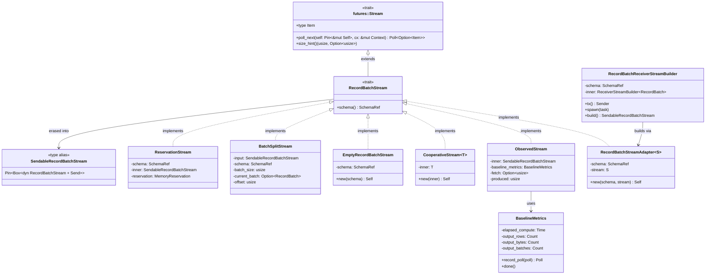
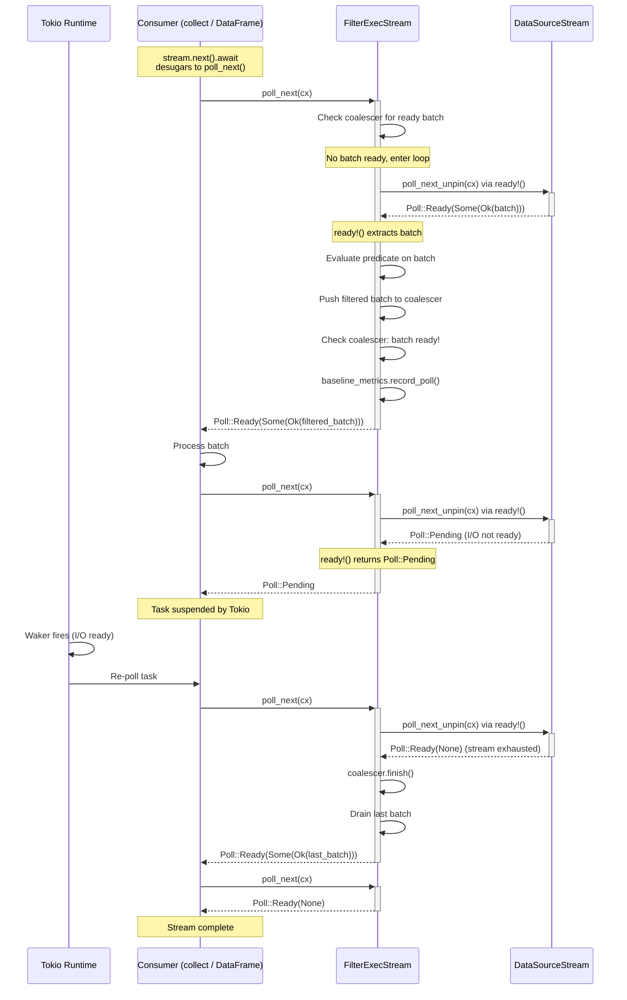

# Module Teardown: The Async Volcano Contract (`Stream`)

## Table of Contents

- [0. Research Focus](#0-research-focus)
- [1. High-Level Overview](#1-high-level-overview)
- [2. Structural Architecture](#2-structural-architecture)
  - [Class Diagram](#class-diagram)
- [3. Execution & Call Flow](#3-execution-call-flow)
  - [3.1 The Core Trait Hierarchy](#31-the-core-trait-hierarchy)
  - [3.2 `RecordBatchStreamAdapter` -- The Universal Adapter](#32-recordbatchstreamadapter-the-universal-adapter)
  - [3.3 The `poll_next()` Cascade and `ready!` Macro](#33-the-poll_next-cascade-and-ready-macro)
  - [3.4 Canonical `poll_next` Patterns](#34-canonical-poll_next-patterns)
  - [Sequence Diagram](#sequence-diagram)
- [4. Concurrency & State Management](#4-concurrency-state-management)
  - [4.1 Pin Safety and `poll_next_unpin`](#41-pin-safety-and-poll_next_unpin)
  - [4.2 `ObservedStream` -- Transparent Metrics Wrapping](#42-observedstream-transparent-metrics-wrapping)
  - [4.3 Cooperative Scheduling (`CooperativeStream`)](#43-cooperative-scheduling-cooperativestream)
  - [4.4 `RecordBatchReceiverStreamBuilder` -- Multi-Task Fan-In](#44-recordbatchreceiverstreambuilder-multi-task-fan-in)
- [5. Memory & Resource Profile](#5-memory-resource-profile)
  - [5.1 `ReservationStream` -- Tracking Batch Memory](#51-reservationstream-tracking-batch-memory)
  - [5.2 `BatchSplitStream` -- Controlling Batch Granularity](#52-batchsplitstream-controlling-batch-granularity)
  - [5.3 Stream Layering Stack (Typical Query)](#53-stream-layering-stack-typical-query)
  - [5.4 Error and Cancellation Semantics](#54-error-and-cancellation-semantics)
- [6. Key Design Insights](#6-key-design-insights)
  - [Insight 1: The `Stream` Trait Collapses Trino's Four-Method Operator Interface Into One](#insight-1-the-stream-trait-collapses-trinos-four-method-operator-interface-into-one)
  - [Insight 2: `ready!` Is the Async Equivalent of Trino's `isBlocked()` Check](#insight-2-ready-is-the-async-equivalent-of-trinos-isblocked-check)
  - [Insight 3: `RecordBatchStreamAdapter` Is the Glue That Makes Composable Stream Pipelines Possible](#insight-3-recordbatchstreamadapter-is-the-glue-that-makes-composable-stream-pipelines-possible)
  - [Insight 4: The `ObservedStream` / `record_poll()` Pattern Provides Zero-Overhead-When-Pending Observability](#insight-4-the-observedstream-record_poll-pattern-provides-zero-overhead-when-pending-observability)
  - [Insight 5: State Machine Enums Replace Trino's Operator Lifecycle Methods](#insight-5-state-machine-enums-replace-trinos-operator-lifecycle-methods)
  - [Insight 6: Cooperative Scheduling Is a Bolt-On Layer, Not Fundamental to the Contract](#insight-6-cooperative-scheduling-is-a-bolt-on-layer-not-fundamental-to-the-contract)
  - [Insight 7: Cancellation Is Implicit via Drop Semantics](#insight-7-cancellation-is-implicit-via-drop-semantics)


## 0. Research Focus
* **Task ID:** 3.1
* **Focus:** Analyze the `RecordBatchStream` trait. How does it extend Rust's `Stream`? Trace how the `poll_next()` macro `ready!` is used to bubble up `Poll::Pending` states asynchronously. Document the exact mechanical differences between Trino's explicit `addInput/getOutput` and DataFusion's implicit `poll_next()`.

## 1. High-Level Overview
* **Core Responsibility:** `RecordBatchStream` is the foundational abstraction that makes DataFusion an "async Volcano" engine. It extends Rust's `futures::Stream` trait with a single additional method -- `schema()` -- creating a typed, asynchronous iterator contract where every operator produces `Result<RecordBatch>` items. The type alias `SendableRecordBatchStream = Pin<Box<dyn RecordBatchStream + Send>>` is the universal currency of the execution engine: every `ExecutionPlan::execute()` returns one, and every operator's internal stream holds references to its children's streams.
* **Key Triggers:** The entire system is *demand-driven*. Nothing executes until a consumer calls `stream.poll_next(cx)` (or equivalently `stream.next().await` via `StreamExt`). The Tokio runtime's task waker system drives the polling: when an operator returns `Poll::Pending`, Tokio suspends the task and re-polls it only when the registered waker fires (typically due to I/O completion or channel readiness).

## 2. Structural Architecture
* **Primary Source Files:**
  - `datafusion/execution/src/stream.rs` -- Defines `RecordBatchStream` trait and `SendableRecordBatchStream` type alias
  - `datafusion/physical-plan/src/stream.rs` -- Concrete adapters: `RecordBatchStreamAdapter`, `ObservedStream`, `EmptyRecordBatchStream`, `BatchSplitStream`, `ReservationStream`, `RecordBatchReceiverStreamBuilder`
  - `datafusion/physical-plan/src/coop.rs` -- `CooperativeStream` wrapper for Tokio cooperative scheduling
  - `datafusion/physical-plan/src/execution_plan.rs` -- `ExecutionPlan` trait with `execute()` returning `SendableRecordBatchStream`
  - `datafusion/physical-expr-common/src/metrics/baseline.rs` -- `BaselineMetrics::record_poll()` observability wrapper

* **Key Data Structures:**
  - `RecordBatchStream` trait (supertrait: `Stream<Item = Result<RecordBatch>>`)
  - `SendableRecordBatchStream` (= `Pin<Box<dyn RecordBatchStream + Send>>`)
  - `RecordBatchStreamAdapter<S>` -- generic wrapper pairing any `Stream<Item = Result<RecordBatch>>` with a `SchemaRef`
  - `ObservedStream` -- metrics-recording wrapper
  - `CooperativeStream<T>` -- Tokio coop budget wrapper
  - `RecordBatchReceiverStreamBuilder` -- multi-task fan-in stream via `mpsc` channels
  - `BatchSplitStream` -- large-batch splitting wrapper
  - `ReservationStream` -- memory-tracking wrapper

### Class Diagram



## 3. Execution & Call Flow

### 3.1 The Core Trait Hierarchy

The `RecordBatchStream` trait is defined in `datafusion/execution/src/stream.rs` with extraordinary simplicity:

```rust
// datafusion/execution/src/stream.rs:26
pub trait RecordBatchStream: Stream<Item = Result<RecordBatch>> {
    fn schema(&self) -> SchemaRef;
}
```

It is a *supertrait* of `futures::Stream<Item = Result<RecordBatch>>`. This means any implementor must provide both `schema()` and `poll_next()`. The `Stream` trait itself (from the `futures` crate) defines:

```rust
// futures-core/src/stream.rs (conceptual)
pub trait Stream {
    type Item;
    fn poll_next(self: Pin<&mut Self>, cx: &mut Context<'_>) -> Poll<Option<Self::Item>>;
    fn size_hint(&self) -> (usize, Option<usize>) { (0, None) }
}
```

The type alias that erases the concrete type for cross-operator interop:

```rust
// datafusion/execution/src/stream.rs:60
pub type SendableRecordBatchStream = Pin<Box<dyn RecordBatchStream + Send>>;
```

Three properties are enforced by this type:
1. **`Pin<Box<...>>`** -- The stream is heap-allocated and pinned, allowing it to contain self-referential futures safely.
2. **`dyn RecordBatchStream`** -- Dynamic dispatch enables heterogeneous operator pipelines.
3. **`+ Send`** -- The stream can be moved across thread boundaries, enabling Tokio to schedule it on any worker.

### 3.2 `RecordBatchStreamAdapter` -- The Universal Adapter

`RecordBatchStreamAdapter<S>` is the primary mechanism for converting arbitrary `Stream<Item = Result<RecordBatch>>` values into `RecordBatchStream`. It uses `pin_project_lite` for safe pin projection:

```rust
// physical-plan/src/stream.rs:401-412
pin_project! {
    pub struct RecordBatchStreamAdapter<S> {
        schema: SchemaRef,
        #[pin]
        stream: S,
    }
}
```

The `#[pin]` attribute on `stream` means the adapter structurally pins its inner stream, enabling it to safely delegate `poll_next`:

```rust
// physical-plan/src/stream.rs:451-463
impl<S> Stream for RecordBatchStreamAdapter<S>
where
    S: Stream<Item = Result<RecordBatch>>,
{
    type Item = Result<RecordBatch>;

    fn poll_next(self: Pin<&mut Self>, cx: &mut Context<'_>) -> Poll<Option<Self::Item>> {
        self.project().stream.poll_next(cx)
    }
}

impl<S> RecordBatchStream for RecordBatchStreamAdapter<S>
where
    S: Stream<Item = Result<RecordBatch>>,
{
    fn schema(&self) -> SchemaRef {
        Arc::clone(&self.schema)
    }
}
```

This adapter is used pervasively. For example, `ExecutionPlan::execute()` documentation shows the canonical pattern:

```rust
// physical-plan/src/execution_plan.rs (docs)
fn execute(&self, partition: usize, context: Arc<TaskContext>) -> Result<SendableRecordBatchStream> {
    let fut = futures::future::ready(Ok(self.batch.clone()));
    let stream = futures::stream::once(fut);
    Ok(Box::pin(RecordBatchStreamAdapter::new(self.batch.schema(), stream)))
}
```

### 3.3 The `poll_next()` Cascade and `ready!` Macro

The `ready!` macro (from `futures::ready` or `std::task::ready`) is the mechanical heart of async Volcano execution. Its expansion is:

```rust
macro_rules! ready {
    ($e:expr) => {
        match $e {
            Poll::Ready(t) => t,
            Poll::Pending => return Poll::Pending,
        }
    };
}
```

When an operator calls `ready!(self.input.poll_next_unpin(cx))`, one of two things happens:
1. **`Poll::Ready(value)`** -- The macro extracts `value` and execution continues in the current operator.
2. **`Poll::Pending`** -- The macro immediately returns `Poll::Pending` from the *caller's* `poll_next`, propagating the pending state up the entire operator chain to Tokio.

This creates a **zero-overhead cascading yield**: a single `Poll::Pending` from a leaf operator (e.g., waiting on I/O) bubbles up through every intermediate operator back to the Tokio runtime, which then suspends the entire task.

### 3.4 Canonical `poll_next` Patterns

There are three dominant patterns used across the 26+ operator stream implementations:

**Pattern 1: Simple Pass-Through (ProjectionStream)**

The simplest operators apply a transformation and delegate directly. No `ready!` needed because `map` on `Poll` handles both `Ready` and `Pending`:

```rust
// physical-plan/src/projection.rs:545-555
fn poll_next(mut self: Pin<&mut Self>, cx: &mut Context<'_>) -> Poll<Option<Self::Item>> {
    let poll = self.input.poll_next_unpin(cx).map(|x| match x {
        Some(Ok(batch)) => Some(self.batch_project(&batch)),
        other => other,
    });
    self.baseline_metrics.record_poll(poll)
}
```

**Pattern 2: Accumulation Loop with `ready!` (FilterExecStream, CoalesceBatchesStream)**

Operators that may need multiple input batches to produce one output batch use a `loop` + `ready!` pattern:

```rust
// physical-plan/src/filter.rs:899-921
fn poll_next(mut self: Pin<&mut Self>, cx: &mut Context<'_>) -> Poll<Option<Self::Item>> {
    let elapsed_compute = self.metrics.baseline_metrics.elapsed_compute().clone();
    loop {
        if let Some(batch) = self.batch_coalescer.next_completed_batch() {
            let poll = Poll::Ready(Some(Ok(batch)));
            return self.metrics.baseline_metrics.record_poll(poll);
        }
        if self.batch_coalescer.is_finished() {
            return Poll::Ready(None);
        }
        // KEY: ready!() either unwraps the next batch or returns Pending
        match ready!(self.input.poll_next_unpin(cx)) {
            None => { self.batch_coalescer.finish()?; }
            Some(Ok(batch)) => {
                let timer = elapsed_compute.timer();
                // ... filter the batch and push to coalescer ...
            }
            Some(Err(e)) => return Poll::Ready(Some(Err(e))),
        }
    }
}
```

The `loop` is essential: after consuming an input batch that doesn't produce output (e.g., all rows filtered out), the loop re-polls the input. The `ready!` macro ensures that if the input isn't ready, we yield back to Tokio immediately.

**Pattern 3: State Machine with `ready!` (HashJoinStream, GroupedHashAggregateStream)**

Complex operators encode their execution phase as an enum and use `ready!` at each phase transition:

```rust
// physical-plan/src/joins/hash_join/stream.rs:426-468
fn poll_next_impl(&mut self, cx: &mut std::task::Context<'_>) -> Poll<Option<Result<RecordBatch>>> {
    loop {
        if let Some(batch) = self.output_buffer.next_completed_batch() {
            return self.join_metrics.baseline.record_poll(Poll::Ready(Some(Ok(batch))));
        }
        return match self.state {
            HashJoinStreamState::WaitBuildSide => {
                handle_state!(ready!(self.collect_build_side(cx)))
            }
            HashJoinStreamState::FetchProbeBatch => {
                handle_state!(ready!(self.fetch_probe_batch(cx)))
            }
            HashJoinStreamState::ProcessProbeBatch(_) => {
                handle_state!(self.process_probe_batch())
            }
            HashJoinStreamState::Completed => Poll::Ready(None),
            // ... other states ...
        };
    }
}
```

The state enum for HashJoin:

```rust
// physical-plan/src/joins/hash_join/stream.rs:125-138
pub(super) enum HashJoinStreamState {
    WaitBuildSide,
    WaitPartitionBoundsReport,
    FetchProbeBatch,
    ProcessProbeBatch(ProcessProbeBatchState),
    ExhaustedProbeSide,
    Completed,
}
```

And for GroupedHashAggregate:

```rust
// physical-plan/src/aggregates/row_hash.rs:62-74
pub(crate) enum ExecutionState {
    ReadingInput,
    ProducingOutput(RecordBatch),
    SkippingAggregation,
    Done,
}
```

### Sequence Diagram



## 4. Concurrency & State Management

### 4.1 Pin Safety and `poll_next_unpin`

`SendableRecordBatchStream` is `Pin<Box<dyn RecordBatchStream + Send>>`. Since `Box<T>` implements `Unpin` regardless of `T`, a `Pin<Box<T>>` can be safely moved (the `Box` pointer doesn't move, only the box itself). This is why operators can call `self.input.poll_next_unpin(cx)` -- the `poll_next_unpin` method from `StreamExt` is available because `Pin<Box<dyn RecordBatchStream + Send>>: Unpin`.

For operators with structurally pinned inner streams (using `pin_project!`), the `#[pin]` attribute generates safe projection:

```rust
pin_project! {
    pub struct RecordBatchStreamAdapter<S> {
        schema: SchemaRef,
        #[pin]
        stream: S,   // pinned: can contain self-referential futures
    }
}

// Generated: self.project() returns a projection where `stream` is Pin<&mut S>
fn poll_next(self: Pin<&mut Self>, cx: &mut Context<'_>) -> Poll<Option<Self::Item>> {
    self.project().stream.poll_next(cx)
}
```

### 4.2 `ObservedStream` -- Transparent Metrics Wrapping

`ObservedStream` wraps any `SendableRecordBatchStream` to record `BaselineMetrics` on every poll:

```rust
// physical-plan/src/stream.rs:557-569
impl Stream for ObservedStream {
    type Item = Result<RecordBatch>;

    fn poll_next(mut self: Pin<&mut Self>, cx: &mut Context<'_>) -> Poll<Option<Self::Item>> {
        let mut poll = self.inner.poll_next_unpin(cx);
        if self.fetch.is_some() {
            poll = self.limit_reached(poll);
        }
        self.baseline_metrics.record_poll(poll)
    }
}
```

`BaselineMetrics::record_poll()` is a pass-through that intercepts only `Ready` results:

```rust
// physical-expr-common/src/metrics/baseline.rs:217-231
pub fn record_poll(&self, poll: Poll<Option<Result<RecordBatch>>>) -> Poll<Option<Result<RecordBatch>>> {
    if let Poll::Ready(maybe_batch) = &poll {
        match maybe_batch {
            Some(Ok(batch)) => { batch.record_output(self); }
            Some(Err(_)) => self.done(),
            None => self.done(),
        }
    }
    poll  // pass through unchanged
}
```

This pattern is used by virtually every operator: the stream's `poll_next` computes a result, then passes it through `record_poll` which counts rows/bytes/batches and records completion time, returning the `Poll` unchanged. On `Poll::Pending`, the method is a no-op -- it only acts on `Ready` values.

### 4.3 Cooperative Scheduling (`CooperativeStream`)

DataFusion addresses Tokio task starvation via `CooperativeStream`, which integrates with Tokio's cooperative budget system:

```rust
// physical-plan/src/coop.rs:142-160
fn poll_next(mut self: Pin<&mut Self>, cx: &mut Context<'_>) -> Poll<Option<Self::Item>> {
    // Default mode: tokio coop integration
    {
        let coop = std::task::ready!(tokio::task::coop::poll_proceed(cx));
        let value = self.inner.poll_next_unpin(cx);
        if value.is_ready() {
            coop.made_progress();
        }
        value
    }
}
```

`poll_proceed(cx)` checks if the current task has remaining cooperative budget. If budget is exhausted, it returns `Poll::Pending` (and registers the waker), causing the stream to yield to Tokio without actually blocking. This prevents a single query from monopolizing a Tokio worker thread.

The `EnsureCooperative` physical optimizer rule automatically inserts `CooperativeExec` wrappers into query plans where needed (around source operators and non-cooperative exchange operators).

### 4.4 `RecordBatchReceiverStreamBuilder` -- Multi-Task Fan-In

For operators that spawn background tasks (like `RepartitionExec`), `RecordBatchReceiverStreamBuilder` bridges task-based parallelism back into the stream world:

```rust
// physical-plan/src/stream.rs:57-61
pub(crate) struct ReceiverStreamBuilder<O> {
    tx: Sender<Result<O>>,
    rx: Receiver<Result<O>>,
    join_set: JoinSet<Result<()>>,
}
```

Key behaviors:
1. **Multiple producers** via cloned `Sender` handles -- each spawned task writes `RecordBatch`es to its `tx`.
2. **Single consumer** -- the `rx` is wrapped into a `futures::stream::unfold` stream.
3. **Panic propagation** -- `join_set.join_next()` is monitored via a separate `check` stream. Panics in spawned tasks are propagated via `std::panic::resume_unwind`.
4. **Cancellation** -- dropping the stream drops the `JoinSet`, which aborts all spawned tasks.

```rust
// physical-plan/src/stream.rs:121-176
pub fn build(self) -> BoxStream<'static, Result<O>> {
    // ... setup ...
    let rx_stream = futures::stream::unfold(rx, |mut rx| async move {
        let next_item = rx.recv().await;
        next_item.map(|next_item| (next_item, rx))
    });
    // Merge data stream with task-health check stream
    futures::stream::select(rx_stream, check_stream).boxed()
}
```

The `run_input` method shows how an `ExecutionPlan`'s output stream is forwarded to a channel:

```rust
// physical-plan/src/stream.rs:326-377
pub(crate) fn run_input(&mut self, input: Arc<dyn ExecutionPlan>, partition: usize, context: Arc<TaskContext>) {
    let output = self.tx();
    self.inner.spawn(async move {
        let mut stream = input.execute(partition, context)?;
        while let Some(item) = stream.next().await {
            let is_err = item.is_err();
            if output.send(item).await.is_err() { return Ok(()); }
            if is_err { return Ok(()); }
        }
        Ok(())
    });
}
```

## 5. Memory & Resource Profile

### 5.1 `ReservationStream` -- Tracking Batch Memory

`ReservationStream` holds a `MemoryReservation` that is decremented as batches are consumed and freed when the stream ends:

```rust
// physical-plan/src/stream.rs:728-755
impl Stream for ReservationStream {
    type Item = Result<RecordBatch>;

    fn poll_next(mut self: Pin<&mut Self>, cx: &mut Context<'_>) -> Poll<Option<Self::Item>> {
        let res = self.inner.poll_next_unpin(cx);
        match res {
            Poll::Ready(Some(Ok(batch))) => {
                self.reservation.shrink(get_record_batch_memory_size(&batch));
                Poll::Ready(Some(Ok(batch)))
            }
            Poll::Ready(None) => {
                self.reservation.free();
                Poll::Ready(None)
            }
            Poll::Pending => Poll::Pending,
            // ... error case ...
        }
    }
}
```

### 5.2 `BatchSplitStream` -- Controlling Batch Granularity

`BatchSplitStream` uses `ready!` to split oversized batches from upstream into `batch_size`-bounded chunks:

```rust
// physical-plan/src/stream.rs:656-678
fn poll_upstream(&mut self, cx: &mut Context<'_>) -> Poll<Option<Result<RecordBatch>>> {
    match ready!(self.input.as_mut().poll_next(cx)) {
        Some(Ok(batch)) => {
            if batch.num_rows() <= self.batch_size {
                Poll::Ready(Some(Ok(batch)))
            } else {
                self.current_batch = Some(batch);
                // Store and return first slice
                match self.next_sliced_batch() {
                    Some(result) => Poll::Ready(Some(result)),
                    None => Poll::Ready(None),
                }
            }
        }
        Some(Err(e)) => Poll::Ready(Some(Err(e))),
        None => Poll::Ready(None),
    }
}
```

The `poll_next` implementation first drains any remaining slices before polling upstream:

```rust
fn poll_next(mut self: Pin<&mut Self>, cx: &mut Context<'_>) -> Poll<Option<Self::Item>> {
    if let Some(result) = self.next_sliced_batch() {
        return Poll::Ready(Some(result));
    }
    self.poll_upstream(cx)
}
```

### 5.3 Stream Layering Stack (Typical Query)

For a typical query, a single partition's stream may look like:

```
CooperativeStream          -- coop scheduling budget
  ObservedStream           -- metrics recording
    FilterExecStream       -- predicate evaluation
      RecordBatchStreamAdapter  -- schema attachment
        ParquetStream      -- I/O-bound leaf (returns Pending during reads)
```

Each layer is ~1 pointer indirection (dynamic dispatch through `SendableRecordBatchStream`) or a direct struct field (when generics are used). The overhead per batch is minimal: a few counter increments for metrics, one budget check for coop.

### 5.4 Error and Cancellation Semantics

The `SendableRecordBatchStream` documentation specifies:

```rust
// datafusion/execution/src/stream.rs:50-59
/// Once a stream returns an error, it should not be polled again (the caller
/// should stop calling `next`) and handle the error.
///
/// However, returning `Ready(None)` (end of stream) is likely the safest
/// behavior after an error.
```

Cancellation is implicit through Rust's ownership model: dropping a `SendableRecordBatchStream` drops all its inner resources. For `RecordBatchReceiverStreamBuilder`-based streams, this also aborts all spawned tasks in the `JoinSet`.

## 6. Key Design Insights

### Insight 1: The `Stream` Trait Collapses Trino's Four-Method Operator Interface Into One

**Trino's Operator interface** requires implementors to define five methods that the `Driver` loop calls explicitly:

| Trino Method | Purpose |
|---|---|
| `needsInput()` | Can this operator accept a new Page? |
| `addInput(Page)` | Push a Page into the operator |
| `getOutput()` | Pull the next output Page (may return null) |
| `isBlocked()` | Returns a `ListenableFuture` if the operator is waiting on external resources |
| `isFinished()` | Has the operator completed all work? |

**DataFusion collapses all five into `poll_next()`:**

| DataFusion `poll_next` Return | Equivalent Trino State |
|---|---|
| `Poll::Ready(Some(Ok(batch)))` | `getOutput()` returns a non-null Page |
| `Poll::Ready(None)` | `isFinished()` returns true |
| `Poll::Ready(Some(Err(e)))` | Exception thrown from `getOutput()` |
| `Poll::Pending` | `isBlocked()` returns an incomplete future, OR `needsInput()` returns false |

The Trino `Driver` loop *explicitly* orchestrates the data flow:
```java
// Trino Driver.processInternal() (conceptual)
while (!done) {
    for (Operator op : operators) {
        if (op.isBlocked().isDone()) {
            if (op.needsInput() && predecessor.getOutput() != null) {
                op.addInput(page);
            }
            Page output = op.getOutput();
            if (output != null) { successor.addInput(output); }
        }
    }
}
```

DataFusion's `poll_next()` cascade does the same thing implicitly:
```rust
// DataFusion: consumer just calls next(), the entire tree polls recursively
while let Some(batch) = stream.next().await {
    // process batch
}
```

**Evidence:** The `FilterExecStream::poll_next` (filter.rs:899-921) shows this: it calls `ready!(self.input.poll_next_unpin(cx))` which either returns data (equivalent to `getOutput` succeeding) or propagates `Pending` (equivalent to `isBlocked` being incomplete). There is no separate `addInput` -- the filtered batch is immediately processed in the same `poll_next` call.

### Insight 2: `ready!` Is the Async Equivalent of Trino's `isBlocked()` Check

In Trino, the `Driver` loop checks `operator.isBlocked()` and skips the operator if it returns an incomplete future. This is an *explicit, opt-in* mechanism -- the operator must implement `isBlocked()` correctly.

In DataFusion, `ready!` provides the same semantics *automatically* at every boundary. Found across **23 files with 64 occurrences** in `physical-plan/src`, the `ready!` macro is used at every point where an operator waits on its input:

```rust
// Aggregation (row_hash.rs:720)
match ready!(self.input.poll_next_unpin(cx)) { ... }

// CoalesceBatches (coalesce_batches.rs:338)
let input_batch = ready!(self.input.poll_next_unpin(cx));

// Sort merge (sorts/merge.rs:205)
match futures::ready!(self.streams.poll_next(cx, idx)) { ... }

// HashJoin state transitions (hash_join/stream.rs:446)
HashJoinStreamState::WaitBuildSide => {
    handle_state!(ready!(self.collect_build_side(cx)))
}
```

The critical difference: in Trino, the `Driver` polls `isBlocked()` on a time quantum and the operator must *remember* it is blocked. In DataFusion, `ready!` causes an immediate return to the Tokio executor, and the `Context`'s waker ensures the task is re-polled only when the underlying resource (I/O, channel, etc.) becomes ready. There is no busy-waiting or periodic checking.

### Insight 3: `RecordBatchStreamAdapter` Is the Glue That Makes Composable Stream Pipelines Possible

Every `ExecutionPlan::execute()` returns `Result<SendableRecordBatchStream>`, which is a trait object. But `Stream` implementations are typically generic (iterators, futures, channels). `RecordBatchStreamAdapter` bridges this gap by attaching a `SchemaRef` to any `Stream<Item = Result<RecordBatch>>`:

```rust
// Typical pattern in execute():
Ok(Box::pin(RecordBatchStreamAdapter::new(self.schema(), my_stream)))
```

This is used in:
- `RecordBatchReceiverStreamBuilder::build()` -- wraps channel-based streams
- `StreamingTableExec::execute()` -- wraps projected partition streams
- `CoalescePartitionsExec` (via receiver builder) -- merges multiple partitions
- Test utilities -- wraps `futures::stream::iter` for mock data

Without this adapter, every operator would need its own `RecordBatchStream` impl even for trivial cases. The adapter makes the stream contract composable.

### Insight 4: The `ObservedStream` / `record_poll()` Pattern Provides Zero-Overhead-When-Pending Observability

`BaselineMetrics::record_poll()` is called at the end of nearly every operator's `poll_next`. Its design is carefully optimized:

```rust
pub fn record_poll(&self, poll: Poll<Option<Result<RecordBatch>>>) -> Poll<Option<Result<RecordBatch>>> {
    if let Poll::Ready(maybe_batch) = &poll {
        match maybe_batch {
            Some(Ok(batch)) => { batch.record_output(self); }  // count rows, bytes
            Some(Err(_)) => self.done(),   // record end_time
            None => self.done(),           // record end_time
        }
    }
    poll  // pass through unchanged -- ZERO cost on Pending
}
```

On `Poll::Pending`, the function is a single branch-not-taken and a return. On `Poll::Ready`, it records `output_rows`, `output_bytes`, `output_batches` (via `RecordOutput` trait) using atomic counters. The `Drop` impl on `BaselineMetrics` calls `try_done()` to record end time if the stream is dropped without explicit completion.

This stands in contrast to Trino, where operator timing is managed externally by the `DriverContext` with explicit `addCpuTime` / `addBlockedTime` calls.

### Insight 5: State Machine Enums Replace Trino's Operator Lifecycle Methods

Complex DataFusion operators that need multi-phase execution (build then probe for hash joins, accumulate then emit for aggregations) encode their state as Rust enums rather than separate lifecycle methods:

- `HashJoinStreamState`: `WaitBuildSide -> WaitPartitionBoundsReport -> FetchProbeBatch -> ProcessProbeBatch -> ExhaustedProbeSide -> Completed`
- `ExecutionState` (aggregation): `ReadingInput -> ProducingOutput(batch) -> SkippingAggregation -> Done`

The `poll_next` method dispatches on the current state, and state transitions happen by assigning a new enum variant. The `loop` + `match` pattern allows the operator to process multiple state transitions in a single `poll_next` call (e.g., transitioning from `ProcessProbeBatch` to `FetchProbeBatch` and immediately polling for the next probe batch without yielding to Tokio).

In Trino, the equivalent state is spread across boolean flags (`finishing`, `finished`, `blocked`) and separate methods (`startOutput()`, `finishInput()`). DataFusion's enum approach makes the state machine explicit and exhaustive (the Rust compiler enforces that all states are handled).

### Insight 6: Cooperative Scheduling Is a Bolt-On Layer, Not Fundamental to the Contract

Unlike Trino where the `Driver` loop enforces time quanta (1 second by default) and preempts operators explicitly, DataFusion's cooperative scheduling is implemented as a wrapper stream (`CooperativeStream`) that is optionally injected by the physical optimizer:

```rust
// coop.rs:154
let coop = std::task::ready!(tokio::task::coop::poll_proceed(cx));
```

This uses Tokio's internal cooperative budget (128 operations by default). When budget is exhausted, `poll_proceed` returns `Pending`, which causes the stream to yield. The budget is replenished when the task is re-scheduled.

The key insight is that this is *entirely optional and transparent* -- operators don't know about cooperative scheduling. It's a property of the stream wrapper, not the operator contract. Operators that naturally yield (e.g., those using channels which call Tokio I/O) don't need the wrapper. The `SchedulingType` enum in `PlanProperties` tracks this:

```rust
pub enum SchedulingType {
    NonCooperative,  // default -- most operators
    Cooperative,     // explicitly consumes coop budget
}
```

### Insight 7: Cancellation Is Implicit via Drop Semantics

In Trino, query cancellation requires explicit signaling through `OperatorContext.isAborted()` checks. In DataFusion, dropping a `SendableRecordBatchStream` automatically:

1. Drops the inner stream struct, which drops all held resources (Arrow buffers, memory reservations).
2. For `RecordBatchReceiverStreamBuilder`-based streams, dropping the `JoinSet` aborts all spawned tasks.
3. For channel-based streams, dropping the `Receiver` causes all `Sender::send()` calls to return errors, signaling producers to stop.

The `run_input` method explicitly handles this:

```rust
// If send fails, plan being torn down, there is no place to send the error
if output.send(item).await.is_err() {
    debug!("Stopping execution: output is gone, plan cancelling: {}", ...);
    return Ok(());
}
```

This makes cancellation a zero-code-cost feature for operators: they don't need to check any abort flag. The `CooperativeStream` wrapper ensures that even CPU-intensive operators yield frequently enough to notice that their task has been cancelled (the Tokio runtime drops the task's future, triggering the drop cascade).
