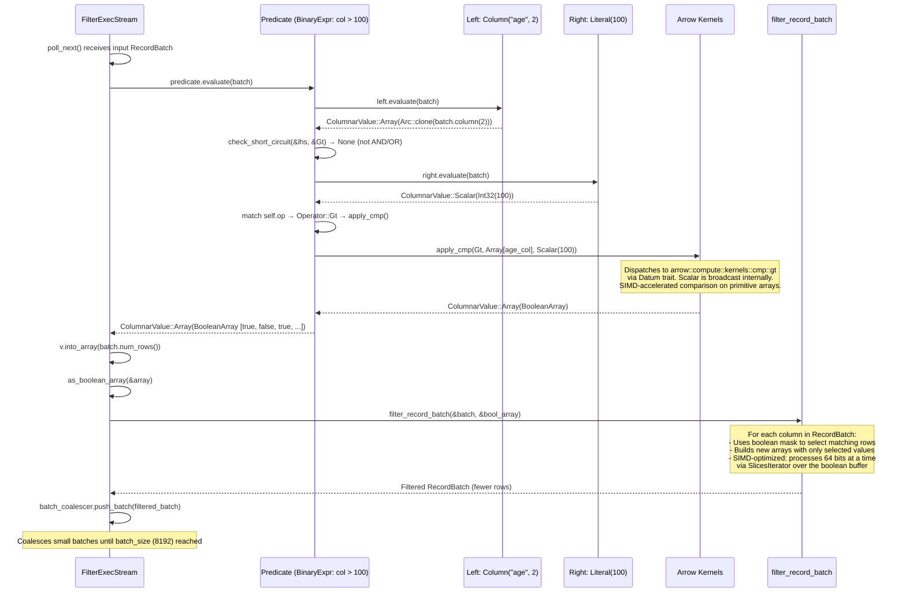
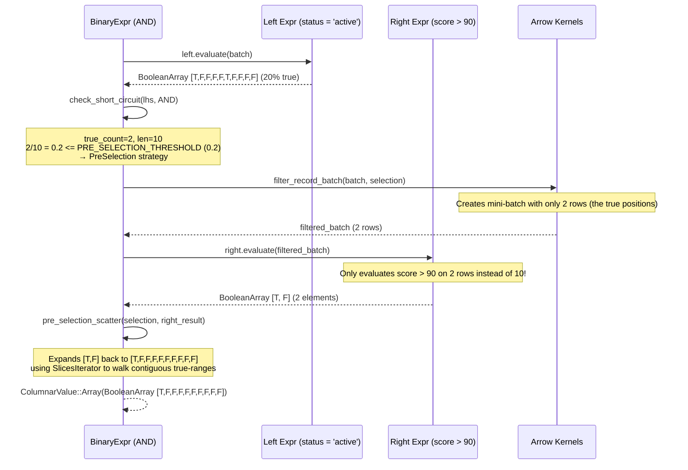

# Module Teardown: Physical Expressions & Compute Kernels

## Table of Contents

- [0. Research Focus](#0-research-focus)
- [1. High-Level Overview](#1-high-level-overview)
- [2. Structural Architecture](#2-structural-architecture)
  - [Class Diagram](#class-diagram)
- [3. Execution & Call Flow](#3-execution-call-flow)
  - [3.1 The `PhysicalExpr` Trait Contract](#31-the-physicalexpr-trait-contract)
  - [3.2 `ColumnarValue`: The Expression Result Type](#32-columnarvalue-the-expression-result-type)
  - [3.3 Leaf Expression Evaluation](#33-leaf-expression-evaluation)
  - [3.4 BinaryExpr: The Heart of Expression Evaluation](#34-binaryexpr-the-heart-of-expression-evaluation)
  - [3.5 The `apply()` and `apply_cmp()` Bridge (datum.rs)](#35-the-apply-and-apply_cmp-bridge-datumrs)
  - [3.6 Short-Circuit Evaluation in BinaryExpr](#36-short-circuit-evaluation-in-binaryexpr)
  - [3.7 Unary Expression Evaluation](#37-unary-expression-evaluation)
  - [3.8 FilterExec: Connecting Expressions to Record Batch Filtering](#38-filterexec-connecting-expressions-to-record-batch-filtering)
  - [Sequence Diagram: Filter Predicate Evaluation](#sequence-diagram-filter-predicate-evaluation)
  - [Sequence Diagram: AND with Short-Circuit PreSelection](#sequence-diagram-and-with-short-circuit-preselection)
- [4. Concurrency & State Management](#4-concurrency-state-management)
  - [Thread Safety](#thread-safety)
  - [Dynamic Expressions](#dynamic-expressions)
  - [InListExpr Static Filter](#inlistexpr-static-filter)
- [5. Memory & Resource Profile](#5-memory-resource-profile)
  - [Allocation Patterns](#allocation-patterns)
  - [Scalar Optimization Impact](#scalar-optimization-impact)
  - [Batch Size Tuning](#batch-size-tuning)
  - [evaluate_selection() Optimization](#evaluate_selection-optimization)
  - [The `scatter()` Function](#the-scatter-function)
- [6. Key Design Insights](#6-key-design-insights)
  - [Insight 1: ColumnarValue Dual-Representation Avoids Allocation in the Common Case](#insight-1-columnarvalue-dual-representation-avoids-allocation-in-the-common-case)
  - [Insight 2: Short-Circuit Evaluation with PreSelection is a Three-Level Strategy](#insight-2-short-circuit-evaluation-with-preselection-is-a-three-level-strategy)
  - [Insight 3: Arrow Kernels Provide the SIMD Foundation, DataFusion Provides the Dispatch](#insight-3-arrow-kernels-provide-the-simd-foundation-datafusion-provides-the-dispatch)
  - [Insight 4: The Expression Tree is a Physical DAG with Pointer-Equality Optimization](#insight-4-the-expression-tree-is-a-physical-dag-with-pointer-equality-optimization)
  - [Insight 5: Physical Expression Simplification Operates at Three Levels](#insight-5-physical-expression-simplification-operates-at-three-levels)
  - [Insight 6: Logical-to-Physical Expression Translation is a Direct Recursive Mapping](#insight-6-logical-to-physical-expression-translation-is-a-direct-recursive-mapping)
  - [Insight 7: InListExpr Uses Hash-Based Static Filters for O(1) Lookup](#insight-7-inlistexpr-uses-hash-based-static-filters-for-o1-lookup)
  - [Insight 8: evaluate_selection() Avoids Evaluating Fallible Expressions on Empty Selection](#insight-8-evaluate_selection-avoids-evaluating-fallible-expressions-on-empty-selection)
  - [Insight 9: FilterExec's Batch Coalescing Prevents the Tiny-Batch Problem](#insight-9-filterexecs-batch-coalescing-prevents-the-tiny-batch-problem)


## 0. Research Focus
* **Task ID:** 3.2
* **Focus:** Analyze the `PhysicalExpr` trait and its `evaluate()` method. Trace a simple filter predicate evaluation to a `BooleanArray`. Trace `arrow::compute::filter_record_batch` for SIMD application. Understand how expressions compose into trees and delegate to Arrow compute kernels.

## 1. High-Level Overview
* **Core Responsibility:** `PhysicalExpr` is the runtime expression evaluation abstraction in DataFusion. Every expression in a physical plan -- column references, literals, arithmetic, comparisons, casts, boolean logic -- implements this trait. Its central method, `evaluate(&RecordBatch) -> Result<ColumnarValue>`, takes a columnar batch of Arrow data and produces either an `Array` or a `Scalar` result. This is the bridge between DataFusion's query plan and Arrow's vectorized compute kernels.
* **Key Triggers:** The `FilterExec` operator calls `predicate.evaluate(batch)` on each incoming `RecordBatch`, then passes the resulting `BooleanArray` to `arrow::compute::filter_record_batch` to produce a filtered batch. Projection, join, and aggregation operators similarly call `evaluate()` on their expression trees.

## 2. Structural Architecture
* **Primary Source Files:**
  - `datafusion/physical-expr-common/src/physical_expr.rs` -- `PhysicalExpr` trait definition, `PhysicalExprRef` type alias, `evaluate_selection()` default implementation
  - `datafusion/physical-expr/src/expressions/mod.rs` -- module organization and re-exports
  - `datafusion/physical-expr/src/expressions/column.rs` -- `Column` expression
  - `datafusion/physical-expr/src/expressions/literal.rs` -- `Literal` expression
  - `datafusion/physical-expr/src/expressions/binary.rs` -- `BinaryExpr` (arithmetic, comparison, boolean logic)
  - `datafusion/physical-expr/src/expressions/cast.rs` -- `CastExpr`
  - `datafusion/physical-expr/src/expressions/is_null.rs` -- `IsNullExpr`
  - `datafusion/physical-expr/src/expressions/is_not_null.rs` -- `IsNotNullExpr`
  - `datafusion/physical-expr/src/expressions/not.rs` -- `NotExpr`
  - `datafusion/physical-expr/src/expressions/negative.rs` -- `NegativeExpr`
  - `datafusion/physical-expr/src/expressions/in_list.rs` -- `InListExpr`
  - `datafusion/physical-expr/src/expressions/case.rs` -- `CaseExpr`
  - `datafusion/physical-expr-common/src/datum.rs` -- `apply()` and `apply_cmp()` bridge to Arrow Datum kernels
  - `datafusion/physical-expr-common/src/utils.rs` -- `scatter()` function
  - `datafusion/physical-expr/src/planner.rs` -- `create_physical_expr()` logical-to-physical translation
  - `datafusion/physical-expr/src/simplifier/` -- Physical expression simplification (constant folding, NOT pushdown, cast unwrapping)
  - `datafusion/physical-plan/src/filter.rs` -- `FilterExec` operator that uses expressions + `filter_record_batch`

* **Key Data Structures:**

| Structure | Location | Purpose |
|---|---|---|
| `PhysicalExpr` (trait) | `physical-expr-common/src/physical_expr.rs` | Core trait: `evaluate()`, `children()`, `with_new_children()` |
| `PhysicalExprRef` | same | `Arc<dyn PhysicalExpr>` type alias |
| `ColumnarValue` | `expr-common/src/columnar_value.rs` | `Array(ArrayRef)` or `Scalar(ScalarValue)` -- evaluation result |
| `Column` | `expressions/column.rs` | Column reference by (name, index) |
| `Literal` | `expressions/literal.rs` | Constant scalar value |
| `BinaryExpr` | `expressions/binary.rs` | `left op right` -- arithmetic, comparison, boolean |
| `CastExpr` | `expressions/cast.rs` | Type coercion: `CAST(expr AS type)` |
| `IsNullExpr` / `IsNotNullExpr` | `expressions/is_null.rs`, `is_not_null.rs` | Null-checking expressions |
| `NotExpr` | `expressions/not.rs` | Boolean negation |
| `NegativeExpr` | `expressions/negative.rs` | Arithmetic negation |
| `InListExpr` | `expressions/in_list.rs` | `expr IN (list)` with hash-based lookup |
| `CaseExpr` | `expressions/case.rs` | `CASE WHEN ... THEN ... END` |
| `FilterExec` | `physical-plan/src/filter.rs` | Plan node that uses expressions to filter batches |

### Class Diagram

```mermaid
classDiagram
    class PhysicalExpr {
        <<trait>>
        +as_any() &dyn Any
        +data_type(Schema) Result~DataType~
        +nullable(Schema) Result~bool~
        +evaluate(RecordBatch) Result~ColumnarValue~
        +evaluate_selection(RecordBatch, BooleanArray) Result~ColumnarValue~
        +children() Vec~&Arc~PhysicalExpr~~
        +with_new_children(Vec~Arc~PhysicalExpr~~) Result~Arc~PhysicalExpr~~
        +evaluate_bounds(children) Result~Interval~
        +propagate_constraints(interval, children) Result~Option~Vec~Interval~~~
        +get_properties(children) Result~ExprProperties~
        +fmt_sql(Formatter) fmt_Result
        +is_volatile_node() bool
        +placement() ExpressionPlacement
    }

    class ColumnarValue {
        <<enum>>
        Array(ArrayRef)
        Scalar(ScalarValue)
        +into_array(num_rows) Result~ArrayRef~
        +cast_to(DataType, CastOptions) Result~ColumnarValue~
        +values_to_arrays(args) Result~Vec~ArrayRef~~
    }

    class Column {
        -name: String
        -index: usize
        +evaluate() → Arc::clone(batch.column(index))
    }

    class Literal {
        -value: ScalarValue
        -field: FieldRef
        +evaluate() → ColumnarValue::Scalar(value.clone())
    }

    class BinaryExpr {
        -left: Arc~PhysicalExpr~
        -op: Operator
        -right: Arc~PhysicalExpr~
        -fail_on_overflow: bool
        +evaluate() → short_circuit OR arrow_kernel(lhs, rhs)
    }

    class CastExpr {
        -expr: Arc~PhysicalExpr~
        -target_field: FieldRef
        -cast_options: CastOptions
        +evaluate() → value.cast_to(cast_type)
    }

    class IsNullExpr {
        -arg: Arc~PhysicalExpr~
        +evaluate() → arrow::compute::is_null(array)
    }

    class NotExpr {
        -arg: Arc~PhysicalExpr~
        +evaluate() → arrow::compute::boolean::not(array)
    }

    class NegativeExpr {
        -arg: Arc~PhysicalExpr~
        +evaluate() → arrow::compute::numeric::neg_wrapping(array)
    }

    class InListExpr {
        -expr: Arc~PhysicalExpr~
        -list: Vec~Arc~PhysicalExpr~~
        -negated: bool
        -static_filter: Option~Arc~StaticFilter~~
    }

    class FilterExec {
        -predicate: Arc~PhysicalExpr~
        -input: Arc~ExecutionPlan~
        +filter_and_project() → filter_record_batch(batch, bool_array)
    }

    PhysicalExpr <|.. Column
    PhysicalExpr <|.. Literal
    PhysicalExpr <|.. BinaryExpr
    PhysicalExpr <|.. CastExpr
    PhysicalExpr <|.. IsNullExpr
    PhysicalExpr <|.. NotExpr
    PhysicalExpr <|.. NegativeExpr
    PhysicalExpr <|.. InListExpr
    PhysicalExpr --> ColumnarValue : evaluate() returns
    BinaryExpr --> PhysicalExpr : left, right children
    CastExpr --> PhysicalExpr : child
    IsNullExpr --> PhysicalExpr : child
    NotExpr --> PhysicalExpr : child
    NegativeExpr --> PhysicalExpr : child
    FilterExec --> PhysicalExpr : predicate
```



## 3. Execution & Call Flow

### 3.1 The `PhysicalExpr` Trait Contract

The trait is defined at `physical-expr-common/src/physical_expr.rs:74`:

```rust
pub trait PhysicalExpr: Any + Send + Sync + Display + Debug + DynEq + DynHash {
    fn as_any(&self) -> &dyn Any;
    fn data_type(&self, input_schema: &Schema) -> Result<DataType>;
    fn nullable(&self, input_schema: &Schema) -> Result<bool>;
    fn evaluate(&self, batch: &RecordBatch) -> Result<ColumnarValue>;      // THE core method
    fn evaluate_selection(&self, batch: &RecordBatch, selection: &BooleanArray) -> Result<ColumnarValue>;
    fn children(&self) -> Vec<&Arc<dyn PhysicalExpr>>;
    fn with_new_children(self: Arc<Self>, children: Vec<Arc<dyn PhysicalExpr>>) -> Result<Arc<dyn PhysicalExpr>>;
    fn evaluate_bounds(&self, children: &[&Interval]) -> Result<Interval>;
    fn propagate_constraints(&self, interval: &Interval, children: &[&Interval]) -> Result<Option<Vec<Interval>>>;
    fn get_properties(&self, children: &[ExprProperties]) -> Result<ExprProperties>;
    fn fmt_sql(&self, f: &mut Formatter<'_>) -> fmt::Result;
    fn is_volatile_node(&self) -> bool;
    fn placement(&self) -> ExpressionPlacement;
}
```

The type alias `PhysicalExprRef = Arc<dyn PhysicalExpr>` is the standard way to reference expressions. Expressions form a tree through `children()` / `with_new_children()`. The `DynTreeNode` impl (in `physical-expr-common/src/tree_node.rs`) delegates `arc_children()` to `children()`, enabling `TreeNode` traversals (`transform_up`, `transform_down`, etc.) on expression trees.

### 3.2 `ColumnarValue`: The Expression Result Type

Defined in `expr-common/src/columnar_value.rs`:

```rust
pub enum ColumnarValue {
    Array(ArrayRef),      // A full column of values
    Scalar(ScalarValue),  // A single value that logically repeats for all rows
}
```

**Key insight: The `Scalar` variant is a critical performance optimization.** A literal like `42` does not allocate an array of N copies of `42`. It stays as a `Scalar` throughout evaluation. Only when an Arrow kernel requires an `ArrayRef` input does `into_array(num_rows)` expand the scalar by calling `scalar.to_array_of_size(num_rows)`.

```rust
// ColumnarValue::into_array -- the expansion point
pub fn into_array(self, num_rows: usize) -> Result<ArrayRef> {
    Ok(match self {
        ColumnarValue::Array(array) => array,
        ColumnarValue::Scalar(scalar) => scalar.to_array_of_size(num_rows)?,
    })
}
```

### 3.3 Leaf Expression Evaluation

**Column** (`expressions/column.rs:127`): Zero-copy column extraction by index.
```rust
fn evaluate(&self, batch: &RecordBatch) -> Result<ColumnarValue> {
    self.bounds_check(batch.schema().as_ref())?;
    Ok(ColumnarValue::Array(Arc::clone(batch.column(self.index))))
}
```
This is an `Arc::clone` -- just a reference count bump, no data copy. The `Column` struct stores both a name (for display) and an index (for lookup).

**Literal** (`expressions/literal.rs:112`): Returns a `Scalar` clone.
```rust
fn evaluate(&self, _batch: &RecordBatch) -> Result<ColumnarValue> {
    Ok(ColumnarValue::Scalar(self.value.clone()))
}
```
The batch is completely ignored. The result is always `ColumnarValue::Scalar`.

### 3.4 BinaryExpr: The Heart of Expression Evaluation

`BinaryExpr` (`expressions/binary.rs:54`) handles all binary operations: arithmetic (`+`, `-`, `*`, `/`, `%`), comparison (`=`, `<`, `>`, etc.), boolean logic (`AND`, `OR`), string concat, bitwise ops, and regex matching.

```rust
pub struct BinaryExpr {
    left: Arc<dyn PhysicalExpr>,
    op: Operator,
    right: Arc<dyn PhysicalExpr>,
    fail_on_overflow: bool,
}
```

The `evaluate()` method at line 273 follows this critical path:

```rust
fn evaluate(&self, batch: &RecordBatch) -> Result<ColumnarValue> {
    use arrow::compute::kernels::numeric::*;

    // 1. Evaluate left-hand side
    let lhs = self.left.evaluate(batch)?;

    // 2. Check for short-circuit (AND/OR only)
    match check_short_circuit(&lhs, &self.op) {
        ShortCircuitStrategy::None => {}
        ShortCircuitStrategy::ReturnLeft => return Ok(lhs),
        ShortCircuitStrategy::ReturnRight => { /* evaluate and return right */ }
        ShortCircuitStrategy::PreSelection(selection) => { /* filter then evaluate right */ }
    }

    // 3. Evaluate right-hand side
    let rhs = self.right.evaluate(batch)?;

    // 4. Dispatch to Arrow kernels by operator type:
    match self.op {
        // Arithmetic -> arrow::compute::kernels::numeric::{add,sub,mul,div,rem}
        Operator::Plus if self.fail_on_overflow => return apply(&lhs, &rhs, add),
        Operator::Plus => return apply(&lhs, &rhs, add_wrapping),
        Operator::Minus => return apply(&lhs, &rhs, sub_wrapping),
        Operator::Multiply => return apply(&lhs, &rhs, mul_wrapping),
        Operator::Divide => return apply(&lhs, &rhs, div),
        Operator::Modulo => return apply(&lhs, &rhs, rem),

        // Comparison -> arrow::compute::kernels::cmp::{eq,neq,lt,gt,...}
        Operator::Eq | Operator::NotEq | Operator::Lt | ... => {
            return apply_cmp(self.op, &lhs, &rhs);
        }

        // Boolean -> and_kleene / or_kleene (after short-circuit fails)
        _ => {}
    }

    // 5. Fallback: array-scalar optimization for bitwise/regex, then full array evaluation
}
```

### 3.5 The `apply()` and `apply_cmp()` Bridge (datum.rs)

The `datum.rs` module bridges DataFusion's `ColumnarValue` to Arrow's `Datum` trait-based kernels. This is where the Array-vs-Scalar optimization happens at the kernel level.

```rust
// physical-expr-common/src/datum.rs
pub fn apply(
    lhs: &ColumnarValue,
    rhs: &ColumnarValue,
    f: impl Fn(&dyn Datum, &dyn Datum) -> Result<ArrayRef, ArrowError>,
) -> Result<ColumnarValue> {
    match (&lhs, &rhs) {
        (ColumnarValue::Array(left), ColumnarValue::Array(right)) => {
            Ok(ColumnarValue::Array(f(&left.as_ref(), &right.as_ref())?))
        }
        (ColumnarValue::Scalar(left), ColumnarValue::Array(right)) => Ok(
            ColumnarValue::Array(f(&left.to_scalar()?, &right.as_ref())?),
        ),
        (ColumnarValue::Array(left), ColumnarValue::Scalar(right)) => Ok(
            ColumnarValue::Array(f(&left.as_ref(), &right.to_scalar()?)?),
        ),
        (ColumnarValue::Scalar(left), ColumnarValue::Scalar(right)) => {
            let array = f(&left.to_scalar()?, &right.to_scalar()?)?;
            let scalar = ScalarValue::try_from_array(array.as_ref(), 0)?;
            Ok(ColumnarValue::Scalar(scalar))
        }
    }
}
```

**Four dispatch paths:**
1. **Array-Array**: Both operands are full arrays -- the standard vectorized path
2. **Scalar-Array**: Left is scalar, Arrow's `Datum` trait handles broadcasting internally
3. **Array-Scalar**: Right is scalar -- the most common case for filter predicates like `col > 100`
4. **Scalar-Scalar**: Both scalars -- result stays as scalar (no array allocation)

For comparisons, `apply_cmp()` maps each `Operator` to the corresponding `arrow::compute::kernels::cmp` function:

```rust
pub fn apply_cmp(op: Operator, lhs: &ColumnarValue, rhs: &ColumnarValue) -> Result<ColumnarValue> {
    let f = match op {
        Operator::Eq => eq,
        Operator::NotEq => neq,
        Operator::Lt => lt,
        Operator::LtEq => lt_eq,
        Operator::Gt => gt,
        Operator::GtEq => gt_eq,
        Operator::IsDistinctFrom => distinct,
        Operator::IsNotDistinctFrom => not_distinct,
        Operator::LikeMatch => like,
        Operator::ILikeMatch => ilike,
        Operator::NotLikeMatch => nlike,
        Operator::NotILikeMatch => nilike,
        _ => return internal_err!("Invalid compare operator: {}", op),
    };
    apply(lhs, rhs, |l, r| Ok(Arc::new(f(l, r)?)))
}
```

For nested types (List, Struct, etc.), a separate `apply_cmp_for_nested()` path uses `arrow::array::make_comparator` for element-wise comparison.

### 3.6 Short-Circuit Evaluation in BinaryExpr

Short-circuit evaluation is a critical optimization for AND/OR chains in filter predicates. The logic is at `binary.rs:759`:

```rust
enum ShortCircuitStrategy<'a> {
    None,                          // Normal evaluation
    ReturnLeft,                    // All false (AND) or all true (OR)
    ReturnRight,                   // All true (AND) or all false (OR)
    PreSelection(&'a BooleanArray), // AND with <=20% true -- filter before evaluating right
}

const PRE_SELECTION_THRESHOLD: f32 = 0.2;
```

**AND short-circuit rules (after evaluating LHS):**
- LHS all false (true_count == 0) --> `ReturnLeft` (result is all-false)
- LHS all true (true_count == len) --> `ReturnRight` (result is whatever RHS evaluates to)
- LHS <=20% true --> `PreSelection`: filter the RecordBatch to only the true rows, evaluate RHS on the filtered batch, then scatter the result back

**OR short-circuit rules:**
- LHS all true (true_count == len) --> `ReturnLeft`
- LHS all false (true_count == 0) --> `ReturnRight`
- No PreSelection for OR (the threshold check only applies to AND)

**PreSelection detail** (the most sophisticated optimization):

When `a AND b` has LHS `a` returning <=20% true values, evaluating `b` on the full batch wastes work. Instead:
1. `filter_record_batch(batch, selection)` creates a compact batch with only the true rows
2. `self.right.evaluate(&filtered_batch)` evaluates RHS on the smaller batch
3. `pre_selection_scatter(selection, right_result)` re-expands the result to match original batch length, filling false/null in gaps

The scatter function at `binary.rs:879` uses `SlicesIterator` to iterate over contiguous true-ranges in the selection bitmap, copying RHS results into those positions and filling gaps with `false`.

**Null handling:** Arrays with nulls cannot be short-circuited (null AND true = null, not false), so `check_short_circuit` returns `None` when `null_count > 0`.

### 3.7 Unary Expression Evaluation

**IsNullExpr** (`is_null.rs:83`):
```rust
fn evaluate(&self, batch: &RecordBatch) -> Result<ColumnarValue> {
    let arg = self.arg.evaluate(batch)?;
    match arg {
        ColumnarValue::Array(array) => Ok(ColumnarValue::Array(Arc::new(
            arrow::compute::is_null(&array)?,
        ))),
        ColumnarValue::Scalar(scalar) => Ok(ColumnarValue::Scalar(
            ScalarValue::Boolean(Some(scalar.is_null())),
        )),
    }
}
```

**NotExpr** (`not.rs:86`):
```rust
fn evaluate(&self, batch: &RecordBatch) -> Result<ColumnarValue> {
    match self.arg.evaluate(batch)? {
        ColumnarValue::Array(array) => {
            let array = as_boolean_array(&array)?;
            Ok(ColumnarValue::Array(Arc::new(
                arrow::compute::kernels::boolean::not(array)?,
            )))
        }
        ColumnarValue::Scalar(scalar) => {
            if scalar.is_null() {
                return Ok(ColumnarValue::Scalar(ScalarValue::Boolean(None)));
            }
            let bool_value: bool = scalar.try_into()?;
            Ok(ColumnarValue::Scalar(ScalarValue::from(!bool_value)))
        }
    }
}
```

**CastExpr** (`cast.rs:252`):
```rust
fn evaluate(&self, batch: &RecordBatch) -> Result<ColumnarValue> {
    let value = self.expr.evaluate(batch)?;
    value.cast_to(self.cast_type(), Some(&self.cast_options))
}
```
Delegates to `ColumnarValue::cast_to()`, which calls `arrow::compute::kernels::cast` for arrays or `ScalarValue::cast_to()` for scalars.

**NegativeExpr** (`negative.rs:95`):
```rust
fn evaluate(&self, batch: &RecordBatch) -> Result<ColumnarValue> {
    match self.arg.evaluate(batch)? {
        ColumnarValue::Array(array) => {
            let result = neg_wrapping(array.as_ref())?;
            Ok(ColumnarValue::Array(result))
        }
        ColumnarValue::Scalar(scalar) => {
            Ok(ColumnarValue::Scalar(scalar.arithmetic_negate()?))
        }
    }
}
```

**Pattern across all unary expressions:** Each evaluates its child first, then pattern-matches on `ColumnarValue::Array` vs `ColumnarValue::Scalar`. For arrays, it delegates to an Arrow compute kernel. For scalars, it operates directly on the `ScalarValue`.

### 3.8 FilterExec: Connecting Expressions to Record Batch Filtering

The `FilterExec` node at `physical-plan/src/filter.rs` is where expression evaluation meets data filtering.

**Structure:**
```rust
pub struct FilterExec {
    predicate: Arc<dyn PhysicalExpr>,
    input: Arc<dyn ExecutionPlan>,
    metrics: ExecutionPlanMetricsSet,
    default_selectivity: u8,       // 0-100, default 20%
    cache: Arc<PlanProperties>,
    projection: Option<ProjectionRef>,
    batch_size: usize,             // default 8192
    fetch: Option<usize>,          // optional row limit
}
```

**The batch filtering path** (`filter.rs:871`):

```rust
fn filter_and_project(
    batch: &RecordBatch,
    predicate: &Arc<dyn PhysicalExpr>,
    projection: Option<&Vec<usize>>,
) -> Result<RecordBatch> {
    predicate
        .evaluate(batch)                              // Step 1: evaluate predicate -> ColumnarValue
        .and_then(|v| v.into_array(batch.num_rows())) // Step 2: expand to BooleanArray
        .and_then(|array| {
            Ok(match (as_boolean_array(&array), projection) {
                (Ok(filter_array), None) =>
                    filter_record_batch(batch, filter_array)?,   // Step 3: apply boolean mask
                (Ok(filter_array), Some(projection)) => {
                    let projected_batch = batch.project(projection)?;
                    filter_record_batch(&projected_batch, filter_array)?
                }
                (Err(_), _) => {
                    return internal_err!("Cannot create filter_array from non-boolean predicates");
                }
            })
        })
}
```

**The streaming filter loop** (`filter.rs:896`):

```rust
impl Stream for FilterExecStream {
    fn poll_next(mut self: Pin<&mut Self>, cx: &mut Context<'_>) -> Poll<Option<Self::Item>> {
        loop {
            // Return completed batch if available
            if let Some(batch) = self.batch_coalescer.next_completed_batch() { ... }

            // Pull next batch from input
            match ready!(self.input.poll_next_unpin(cx)) {
                Some(Ok(batch)) => {
                    let timer = elapsed_compute.timer();
                    // Evaluate predicate
                    let array = self.predicate.evaluate(&batch)?.into_array(batch.num_rows())?;
                    // Apply optional projection
                    let (array, batch) = match self.projection.as_ref() {
                        Some(projection) => (array, batch.project(projection)?),
                        None => (array, batch),
                    };
                    // Filter + coalesce
                    let filter_array = as_boolean_array(&array)?;
                    let filtered = filter_record_batch(&batch, filter_array)?;
                    self.batch_coalescer.push_batch(filtered)?;
                    timer.done();
                }
                ...
            }
        }
    }
}
```

**Batch coalescing:** FilterExec uses a `LimitedBatchCoalescer` to combine small filtered batches into the configured `batch_size` (default 8192). This prevents downstream operators from receiving tiny batches after a highly selective filter.

### Sequence Diagram: Filter Predicate Evaluation



### Sequence Diagram: AND with Short-Circuit PreSelection



## 4. Concurrency & State Management

### Thread Safety
All `PhysicalExpr` implementations are `Send + Sync` (required by the trait bound). This enables the same expression tree to be shared across partitions via `Arc`:

```rust
pub type PhysicalExprRef = Arc<dyn PhysicalExpr>;
```

Expression evaluation is stateless -- `evaluate()` takes `&self` and `&RecordBatch`, producing a new `ColumnarValue`. No mutable state is accessed during evaluation, making it inherently thread-safe for concurrent partition execution.

### Dynamic Expressions
The `snapshot()` and `snapshot_generation()` methods on `PhysicalExpr` support "dynamic" expressions that can change during execution (e.g., `DynamicFilterPhysicalExpr` that references a TopK's current threshold or a hash join's key set). These use interior mutability and generation counters for change detection, but the standard expression types are fully immutable.

### InListExpr Static Filter
`InListExpr` pre-computes a `HashMap`-based `StaticFilter` at planning time when all list elements are literals. This converts O(n*m) evaluation to O(n) via hash lookups at runtime, but the filter itself is immutable after construction.

## 5. Memory & Resource Profile

### Allocation Patterns

1. **Column::evaluate()** -- Zero-copy. Just an `Arc::clone` reference count bump.
2. **Literal::evaluate()** -- Near-zero. Clones a `ScalarValue` (typically small).
3. **BinaryExpr::evaluate()** -- Allocates a new array for the result. For a comparison like `col > 100`, this creates one `BooleanArray`. Arrow kernels handle buffer allocation internally.
4. **CastExpr::evaluate()** -- Allocates a new array of the target type.
5. **filter_record_batch()** -- Allocates new arrays for every column in the batch. This is the most expensive allocation point in the filter path.

### Scalar Optimization Impact
The `ColumnarValue::Scalar` variant avoids array allocation in several key scenarios:
- `Literal` values never become arrays until forced by `into_array()`
- Scalar-scalar operations (e.g., `1 + 2` after constant folding) remain scalar
- Arrow's `Datum` trait handles scalar broadcasting at the kernel level, avoiding explicit expansion

### Batch Size Tuning
`FilterExec` uses `batch_size = 8192` (default) and a `LimitedBatchCoalescer` to prevent the "tiny batch problem." After a selective filter, output batches may have very few rows. The coalescer accumulates filtered batches until reaching the target size, amortizing per-batch overhead in downstream operators.

### evaluate_selection() Optimization
The default `evaluate_selection()` implementation at `physical_expr.rs:102` handles three cases efficiently:
1. **All selected** (selection_count == row_count) -- Skip filtering entirely, evaluate normally
2. **None selected** (selection_count == 0) -- Return empty array without calling evaluate() at all (avoids triggering runtime errors like division by zero)
3. **Partial selection** -- `filter_record_batch()` to create a compact batch, evaluate, then `scatter()` to restore original positions

### The `scatter()` Function
`scatter()` in `physical-expr-common/src/utils.rs` is carefully optimized with type-specialized paths:
- `scatter_primitive()` for numeric types
- `scatter_boolean()` for boolean
- `scatter_bytes()` for string/binary
- `scatter_byte_view()` for string view
- `scatter_dict()` for dictionary-encoded
- A selectivity threshold (`SCATTER_SLICES_SELECTIVITY_THRESHOLD = 0.8`): above 80% selectivity, uses `set_slices()` (contiguous range copies); below, uses `set_indices()` (individual position copies)

## 6. Key Design Insights

### Insight 1: ColumnarValue Dual-Representation Avoids Allocation in the Common Case
**Evidence:** `Literal::evaluate()` returns `ColumnarValue::Scalar(self.value.clone())` (literal.rs:112). `Column::evaluate()` returns `ColumnarValue::Array(Arc::clone(...))` (column.rs:129). The `apply()` function in datum.rs:40-56 dispatches across all four combinations (Array-Array, Scalar-Array, Array-Scalar, Scalar-Scalar), meaning Arrow's `Datum` kernels natively handle the scalar case without explicit expansion. The scalar-scalar case at line 50-54 even returns a `ColumnarValue::Scalar`, keeping the result compact. This means a filter like `WHERE 1 = 1` or a constant expression never allocates an array at all.

### Insight 2: Short-Circuit Evaluation with PreSelection is a Three-Level Strategy
**Evidence:** The `ShortCircuitStrategy` enum (binary.rs:728-733) and `PRE_SELECTION_THRESHOLD = 0.2` (binary.rs:738) implement three levels of optimization for AND/OR:
1. **Full short-circuit** (all-true or all-false LHS) -- zero cost for the skipped side
2. **PreSelection** (<=20% true for AND) -- evaluates the RHS on a fraction of the data
3. **Normal evaluation** (>20% true) -- falls through to standard vectorized evaluation

The threshold of 20% is a heuristic balancing the cost of `filter_record_batch()` + `pre_selection_scatter()` against evaluating the full array. This is particularly effective for queries like `WHERE is_active AND expensive_function(col)` where `is_active` is highly selective.

### Insight 3: Arrow Kernels Provide the SIMD Foundation, DataFusion Provides the Dispatch
**Evidence:** DataFusion never implements SIMD directly. Every compute operation delegates to Arrow crate kernels:
- Arithmetic: `arrow::compute::kernels::numeric::{add, sub, mul, div, rem, neg_wrapping}` (binary.rs:274, negative.rs:98)
- Comparison: `arrow::compute::kernels::cmp::{eq, neq, lt, gt, lt_eq, gt_eq, distinct, not_distinct}` (datum.rs:68-75)
- Boolean: `arrow::compute::kernels::boolean::{and_kleene, or_kleene, not}` (binary.rs:26-27, not.rs:91)
- Null checking: `arrow::compute::{is_null, is_not_null}` (is_null.rs:87, is_not_null.rs:87)
- Filtering: `arrow::compute::filter_record_batch` (filter.rs:48)

Arrow's kernels use SIMD intrinsics via auto-vectorization and explicit SIMD on supported platforms. For boolean operations, Arrow processes 64 bits at a time through `BooleanBuffer` bitwise operations. The `SlicesIterator` used in scatter and filter walks contiguous true-runs in the bitmap, enabling efficient memcpy of row ranges.

### Insight 4: The Expression Tree is a Physical DAG with Pointer-Equality Optimization
**Evidence:** `with_new_children_if_necessary()` (physical_expr.rs:467) uses `Arc::ptr_eq()` to detect unchanged children:
```rust
if children.is_empty()
    || children.iter().zip(old_children.iter()).any(|(c1, c2)| !Arc::ptr_eq(c1, c2))
{
    Ok(expr.with_new_children(children)?)
} else {
    Ok(expr) // Return same Arc -- no allocation
}
```
This enables tree transformations (like the simplifier) to avoid allocating new expression nodes when nothing changes, which is critical for optimizer rules that traverse the entire expression tree.

### Insight 5: Physical Expression Simplification Operates at Three Levels
**Evidence:** `PhysicalExprSimplifier` (simplifier/mod.rs:53) applies three transformations in a loop (up to 5 iterations):
1. **NOT simplification** (`simplifier/not.rs`): Pushes NOT through AND/OR (De Morgan's laws), eliminates double-NOT
2. **Cast unwrapping** (`simplifier/unwrap_cast.rs`): Removes unnecessary casts in comparisons (e.g., `CAST(int_col AS bigint) > 100` -> `int_col > 100`)
3. **Constant folding** (`simplifier/const_evaluator.rs`): Evaluates expressions with all-literal children at plan time (e.g., `1 + 2` -> `3`)

The constant folding evaluates expressions against a zero-row dummy batch, so it works for any expression that doesn't reference columns:
```rust
pub(crate) fn simplify_const_expr_immediate(
    expr: Arc<dyn PhysicalExpr>, batch: &RecordBatch,
) -> Result<Transformed<Arc<dyn PhysicalExpr>>> {
    if expr.as_any().is::<Literal>() { return Ok(Transformed::no(expr)); }
    if expr.as_any().is::<Column>() { return Ok(Transformed::no(expr)); }
    // Check if all children are literals...
    // If yes, evaluate and replace with literal result
}
```

### Insight 6: Logical-to-Physical Expression Translation is a Direct Recursive Mapping
**Evidence:** `create_physical_expr()` (planner.rs:109) recursively maps each `Expr` variant to its physical counterpart:
- `Expr::Column(c)` -> `Column::new(&c.name, idx)` where idx is resolved from the DFSchema
- `Expr::Literal(v)` -> `Literal::new(v)`
- `Expr::BinaryExpr { left, op, right }` -> `BinaryExpr::new(create_physical_expr(left), op, create_physical_expr(right))`
- `Expr::Cast { expr, field }` -> `CastExpr::new(create_physical_expr(expr), target_type)`
- `Expr::IsTrue(e)` -> `BinaryExpr(e, IsNotDistinctFrom, true)` -- rewrites IS TRUE as a comparison
- `Expr::IsNull(e)` -> `IsNullExpr(create_physical_expr(e))`

The logical planner is responsible for type coercion. By the time expressions reach the physical layer, no coercion is needed -- types are already resolved.

### Insight 7: InListExpr Uses Hash-Based Static Filters for O(1) Lookup
**Evidence:** `InListExpr` (in_list.rs:55) stores an optional `static_filter: Option<Arc<dyn StaticFilter + Send + Sync>>`. When all list elements are literals, it pre-builds an `ArrayStaticFilter` containing:
- `in_array`: A sorted Arrow array of all list values
- `state: RandomState`: Hash function state
- `map: HashMap<usize, (), ()>`: A hashmap mapping hashes to array indices

At evaluation time, `contains()` hashes each value in the input column and probes the map, achieving O(1) per-row lookup instead of O(list_size) comparisons. Dictionary-encoded columns are handled by evaluating against the dictionary values and mapping back via keys.

### Insight 8: evaluate_selection() Avoids Evaluating Fallible Expressions on Empty Selection
**Evidence:** At `physical_expr.rs:125`:
```rust
let filtered_result = if selection_count == 0 {
    // Do not call `evaluate` when the selection is empty.
    // `evaluate_selection` is used to conditionally evaluate expressions.
    // When the expression in question is fallible, evaluating it with an empty
    // record batch may trigger a runtime error (e.g. division by zero).
    let datatype = self.data_type(batch.schema_ref().as_ref())?;
    ColumnarValue::Array(new_empty_array(&datatype))
} else { ... }
```
This is a safety mechanism for CASE expressions. When evaluating `CASE WHEN x != 0 THEN y/x ELSE 0 END`, the THEN branch must not be evaluated for rows where `x = 0`. The selection vector marks which rows should be evaluated, and `evaluate_selection()` creates an empty array (rather than calling `evaluate()`) when no rows match, preventing division-by-zero errors.

### Insight 9: FilterExec's Batch Coalescing Prevents the Tiny-Batch Problem
**Evidence:** `FilterExec` at filter.rs:79 stores `batch_size: usize` (default 8192) and uses a `LimitedBatchCoalescer` in `FilterExecStream` (filter.rs:840). The stream loop at line 942 pushes filtered batches into the coalescer:
```rust
let batch = filter_record_batch(&batch, filter_array)?;
let state = self.batch_coalescer.push_batch(batch)?;
```
The coalescer accumulates small batches and only yields when `batch_size` is reached or the input is exhausted. This is critical for highly selective filters: without coalescing, a filter that selects 1% of rows from 8192-row input batches would produce ~82-row batches, dramatically increasing per-batch overhead in downstream operators (hash joins, aggregations, etc.).
