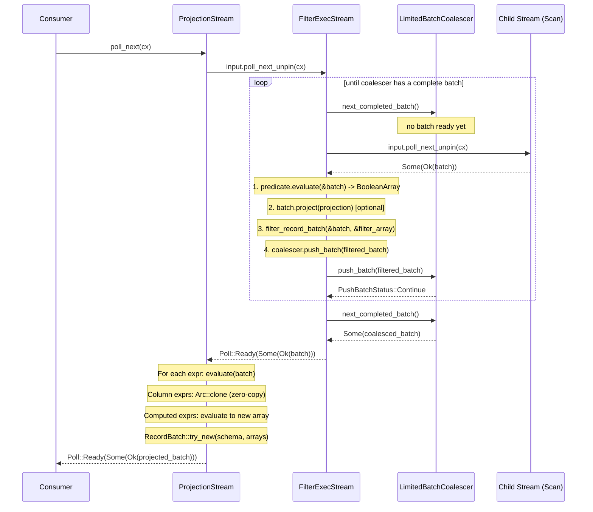

# Module Teardown: Simple Pipelines (Stateless Stream Nesting)

## Table of Contents

- [0. Research Focus](#0-research-focus)
- [1. High-Level Overview](#1-high-level-overview)
- [2. Structural Architecture](#2-structural-architecture)
  - [Class Diagram](#class-diagram)
- [3. Execution & Call Flow](#3-execution-call-flow)
  - [3.1 FilterExec: execute() and Stream Creation](#31-filterexec-execute-and-stream-creation)
  - [3.2 FilterExecStream::poll_next() -- The Core Filter Loop](#32-filterexecstreampoll_next-the-core-filter-loop)
  - [3.3 Batch Coalescing Inside FilterExec](#33-batch-coalescing-inside-filterexec)
  - [3.4 ProjectionExec: execute() and Stream Creation](#34-projectionexec-execute-and-stream-creation)
  - [3.5 ProjectionStream::poll_next() -- Columnar Projection](#35-projectionstreampoll_next-columnar-projection)
  - [3.6 Zero-Copy Proof: Column::evaluate()](#36-zero-copy-proof-columnevaluate)
  - [Sequence Diagram](#sequence-diagram)
- [4. Concurrency & State Management](#4-concurrency-state-management)
  - [4.1 Single-Threaded Per Partition](#41-single-threaded-per-partition)
  - [4.2 State Machine in FilterExecStream](#42-state-machine-in-filterexecstream)
  - [4.3 ProjectionStream: Purely Stateless](#43-projectionstream-purely-stateless)
- [5. Memory & Resource Profile](#5-memory-resource-profile)
  - [5.1 FilterExec Memory](#51-filterexec-memory)
  - [5.2 ProjectionExec Memory](#52-projectionexec-memory)
  - [5.3 No Batch Amplification in ProjectionStream](#53-no-batch-amplification-in-projectionstream)
  - [5.4 FilterExec Batch Coalescing Prevents Fragment Proliferation](#54-filterexec-batch-coalescing-prevents-fragment-proliferation)
- [6. Key Design Insights](#6-key-design-insights)
  - [Insight 1: FilterExec Has Inline Batch Coalescing (No Separate CoalesceBatchesExec Needed)](#insight-1-filterexec-has-inline-batch-coalescing-no-separate-coalescebatchesexec-needed)
  - [Insight 2: Column::evaluate() is Truly Zero-Copy via Arc::clone](#insight-2-columnevaluate-is-truly-zero-copy-via-arcclone)
  - [Insight 3: FilterExec Supports Embedded Projection (Filter+Project Fusion)](#insight-3-filterexec-supports-embedded-projection-filterproject-fusion)
  - [Insight 4: DataFusion Uses Optimizer-Based Fusion, Not a Single Fused Operator](#insight-4-datafusion-uses-optimizer-based-fusion-not-a-single-fused-operator)
  - [Insight 5: The filter_and_project() Helper Reveals the Optimal Ordering](#insight-5-the-filter_and_project-helper-reveals-the-optimal-ordering)
  - [Insight 6: ProjectionStream is a Pure Functor -- No Buffering](#insight-6-projectionstream-is-a-pure-functor-no-buffering)
  - [Insight 7: CoalesceBatchesExec is Deprecated -- Coalescing is Now Operator-Local](#insight-7-coalescebatchesexec-is-deprecated-coalescing-is-now-operator-local)
  - [Insight 8: Nested Stream Model vs. Trino's Operator Model](#insight-8-nested-stream-model-vs-trinos-operator-model)


## 0. Research Focus
* **Task ID:** 3.3
* **Focus:** Trace the `poll_next()` loop in `FilterExecStream`. How does it pull a batch, apply the mask, and yield the result without row-by-row iteration? Confirm the zero-copy nature of `ProjectionExecStream`. Contrast this nested struct model with Trino's fused `ScanFilterAndProjectOperator`.

## 1. High-Level Overview
* **Core Responsibility:** `FilterExec` and `ProjectionExec` are the two fundamental stateless operators in DataFusion's physical plan. FilterExec evaluates a boolean predicate against each input batch, applying a columnar boolean mask to select rows (never iterating row-by-row). ProjectionExec evaluates a set of physical expressions per batch, constructing output batches by referencing (or computing from) input columns. Together they compose as nested streams in a pull-based pipeline: `ProjectionExec(FilterExec(ScanExec))`.
* **Key Triggers:** The downstream consumer calls `poll_next()` on the outermost stream. Each stream in turn polls its child, processes the batch, and yields the result upward. The entire pipeline is driven by async/await through Rust's `Stream` trait (Futures-based).

## 2. Structural Architecture
* **Primary Source Files:**
  - `datafusion/physical-plan/src/filter.rs` -- `FilterExec`, `FilterExecStream`, `FilterExecMetrics`, `batch_filter()`, `filter_and_project()`
  - `datafusion/physical-plan/src/projection.rs` -- `ProjectionExec`, `ProjectionStream`, `EmbeddedProjection`, `remove_unnecessary_projections()`
  - `datafusion/physical-expr/src/projection.rs` -- `Projector`, `ProjectionExprs`, `ProjectionExpr`
  - `datafusion/physical-expr/src/expressions/column.rs` -- `Column` expression (zero-copy evaluate)
  - `datafusion/physical-plan/src/coalesce/mod.rs` -- `LimitedBatchCoalescer`
  - `datafusion/physical-plan/src/coalesce_batches.rs` -- `CoalesceBatchesExec` (deprecated, replaced by inline coalescing)
  - `datafusion/physical-optimizer/src/projection_pushdown.rs` -- `ProjectionPushdown` optimizer rule

* **Key Data Structures:**

| Structure | Location | Role |
|---|---|---|
| `FilterExec` | `filter.rs:79` | Physical plan node wrapping a predicate, input, optional projection, batch_size, fetch limit |
| `FilterExecStream` | `filter.rs:828` | Runtime stream: holds predicate, input stream, metrics, projection, and a `LimitedBatchCoalescer` |
| `FilterExecMetrics` | `filter.rs:844` | Baseline metrics + selectivity ratio tracking |
| `ProjectionExec` | `projection.rs:72` | Physical plan node holding a `Projector`, input, metrics, cached plan properties |
| `ProjectionStream` | `projection.rs:536` | Runtime stream: holds `Projector`, input stream, baseline metrics |
| `Projector` | `physical-expr/projection.rs:747` | Reusable batch transformer: holds `ProjectionExprs`, pre-computed output schema, optional per-expression metrics |
| `ProjectionExprs` | `physical-expr/projection.rs` | Arc'd slice of `ProjectionExpr` (expression + alias name) |
| `LimitedBatchCoalescer` | `coalesce/mod.rs:27` | Wraps Arrow's `BatchCoalescer`; buffers small batches, respects a row limit (`fetch`), and emits batches of `target_batch_size` |
| `Column` | `expressions/column.rs` | Physical expression that evaluates to a zero-copy `Arc::clone` of an input column |

### Class Diagram

```mermaid
classDiagram
    class FilterExec {
        -predicate: Arc~dyn PhysicalExpr~
        -input: Arc~dyn ExecutionPlan~
        -metrics: ExecutionPlanMetricsSet
        -default_selectivity: u8
        -projection: Option~ProjectionRef~
        -batch_size: usize
        -fetch: Option~usize~
        +execute(partition, context) SendableRecordBatchStream
    }

    class FilterExecStream {
        -schema: SchemaRef
        -predicate: Arc~dyn PhysicalExpr~
        -input: SendableRecordBatchStream
        -metrics: FilterExecMetrics
        -projection: Option~ProjectionRef~
        -batch_coalescer: LimitedBatchCoalescer
        +poll_next(cx) Poll~Option~Result~RecordBatch~~~
    }

    class ProjectionExec {
        -projector: Projector
        -input: Arc~dyn ExecutionPlan~
        -metrics: ExecutionPlanMetricsSet
        -cache: Arc~PlanProperties~
        +execute(partition, context) SendableRecordBatchStream
    }

    class ProjectionStream {
        -projector: Projector
        -input: SendableRecordBatchStream
        -baseline_metrics: BaselineMetrics
        +poll_next(cx) Poll~Option~Result~RecordBatch~~~
        +batch_project(batch) Result~RecordBatch~
    }

    class Projector {
        -projection: ProjectionExprs
        -output_schema: SchemaRef
        -expression_metrics: Option~ExpressionEvaluatorMetrics~
        +project_batch(batch) Result~RecordBatch~
        +with_metrics(metrics, partition) Projector
    }

    class LimitedBatchCoalescer {
        -inner: BatchCoalescer
        -total_rows: usize
        -fetch: Option~usize~
        -finished: bool
        +push_batch(batch) Result~PushBatchStatus~
        +finish() Result
        +next_completed_batch() Option~RecordBatch~
    }

    class Column {
        -name: String
        -index: usize
        +evaluate(batch) Result~ColumnarValue~
    }

    FilterExec --> FilterExecStream : creates via execute()
    ProjectionExec --> ProjectionStream : creates via execute()
    ProjectionExec --> Projector : owns
    ProjectionStream --> Projector : uses
    FilterExecStream --> LimitedBatchCoalescer : owns
    ProjectionStream ..> Column : evaluates expressions
    FilterExecStream ..> "arrow::filter_record_batch" : applies boolean mask
```

## 3. Execution & Call Flow

### 3.1 FilterExec: execute() and Stream Creation

When `FilterExec::execute()` is called, it creates a `FilterExecStream` and wires in everything needed for runtime execution:

```rust
// filter.rs:508-532
fn execute(
    &self,
    partition: usize,
    context: Arc<TaskContext>,
) -> Result<SendableRecordBatchStream> {
    let metrics = FilterExecMetrics::new(&self.metrics, partition);
    Ok(Box::pin(FilterExecStream {
        schema: self.schema(),
        predicate: Arc::clone(&self.predicate),
        input: self.input.execute(partition, context)?,  // <-- recursively calls child's execute
        metrics,
        projection: self.projection.clone(),
        batch_coalescer: LimitedBatchCoalescer::new(
            self.schema(),
            self.batch_size,       // default: 8192
            self.fetch,            // optional row limit
        ),
    }))
}
```

Key architectural points:
- The child's `execute()` is called eagerly during stream construction -- this is how the nested stream chain is built.
- The `LimitedBatchCoalescer` is embedded directly in the FilterExecStream. This is a critical design point: FilterExec **coalesces its own output**, so small filtered batches are automatically combined before being sent upstream. This was introduced in DataFusion 52.0.0, replacing the need for a separate `CoalesceBatchesExec` operator.
- The `batch_size` defaults to `FILTER_EXEC_DEFAULT_BATCH_SIZE = 8192`.

### 3.2 FilterExecStream::poll_next() -- The Core Filter Loop

This is the most important code path. The entire function is a single `loop` that interleaves batch coalescing with batch filtering:

```rust
// filter.rs:896-970
impl Stream for FilterExecStream {
    type Item = Result<RecordBatch>;

    fn poll_next(
        mut self: Pin<&mut Self>,
        cx: &mut Context<'_>,
    ) -> Poll<Option<Self::Item>> {
        let elapsed_compute = self.metrics.baseline_metrics.elapsed_compute().clone();
        loop {
            // PHASE 1: Check if the coalescer has a completed batch ready to emit
            if let Some(batch) = self.batch_coalescer.next_completed_batch() {
                self.metrics.selectivity.add_part(batch.num_rows());
                let poll = Poll::Ready(Some(Ok(batch)));
                return self.metrics.baseline_metrics.record_poll(poll);
            }

            // PHASE 2: Check if the stream is fully exhausted
            if self.batch_coalescer.is_finished() {
                return Poll::Ready(None);
            }

            // PHASE 3: Pull the next batch from the child stream
            match ready!(self.input.poll_next_unpin(cx)) {
                None => {
                    // Input exhausted -- flush remaining buffered rows
                    self.batch_coalescer.finish()?;
                    // continue to PHASE 1 to drain any final batch
                }
                Some(Ok(batch)) => {
                    let timer = elapsed_compute.timer();

                    // STEP A: Evaluate predicate to get boolean array
                    let status = self.predicate.as_ref()
                        .evaluate(&batch)
                        .and_then(|v| v.into_array(batch.num_rows()))
                        // STEP B: Apply optional projection
                        .and_then(|array| {
                            Ok(match self.projection.as_ref() {
                                Some(projection) => {
                                    let projected_batch = batch.project(projection)?;
                                    (array, projected_batch)
                                },
                                None => (array, batch)
                            })
                        })
                        // STEP C: Apply boolean mask via arrow::filter_record_batch
                        .and_then(|(array, batch)| {
                            match as_boolean_array(&array) {
                                Ok(filter_array) => {
                                    self.metrics.selectivity.add_total(batch.num_rows());
                                    let batch = filter_record_batch(&batch, filter_array)?;
                                    // STEP D: Push filtered batch into coalescer
                                    let state = self.batch_coalescer.push_batch(batch)?;
                                    Ok(state)
                                }
                                Err(_) => internal_err!(
                                    "Cannot create filter_array from non-boolean predicates"
                                )
                            }
                        })?;
                    timer.done();

                    // STEP E: Handle coalescer status
                    match status {
                        PushBatchStatus::Continue => {
                            // Keep looping -- need more rows to fill target batch
                        }
                        PushBatchStatus::LimitReached => {
                            // fetch limit reached -- flush and stop
                            self.batch_coalescer.finish()?;
                        }
                    }
                }
                // Error case: propagate upstream
                other => return Poll::Ready(other),
            }
        }
    }
}
```

**Critical observation: There is NO row-by-row iteration anywhere.** The entire pipeline operates at the columnar batch level:
1. Predicate evaluation produces a boolean `ArrayRef` in one vectorized call
2. `filter_record_batch()` (from Arrow's `arrow::compute`) applies the boolean mask to every column simultaneously, producing a new batch with only matching rows
3. The filtered batch is pushed into the coalescer, which buffers until `target_batch_size` is reached

### 3.3 Batch Coalescing Inside FilterExec

The `LimitedBatchCoalescer` wraps Arrow's `BatchCoalescer`:

```rust
// coalesce/mod.rs:27-36
pub struct LimitedBatchCoalescer {
    inner: BatchCoalescer,
    total_rows: usize,
    fetch: Option<usize>,
    finished: bool,
}
```

Creation uses a `biggest_coalesce_batch_size` of `target_batch_size / 2`:

```rust
// coalesce/mod.rs:57-68
pub fn new(schema: SchemaRef, target_batch_size: usize, fetch: Option<usize>) -> Self {
    Self {
        inner: BatchCoalescer::new(schema, target_batch_size)
            .with_biggest_coalesce_batch_size(Some(target_batch_size / 2)),
        total_rows: 0,
        fetch,
        finished: false,
    }
}
```

The `push_batch()` method handles the fetch limit by slicing the batch:

```rust
// coalesce/mod.rs:90-121
pub fn push_batch(&mut self, batch: RecordBatch) -> Result<PushBatchStatus> {
    if let Some(fetch) = self.fetch {
        if self.total_rows >= fetch {
            return Ok(PushBatchStatus::LimitReached);
        }
        if self.total_rows + batch.num_rows() >= fetch {
            let remaining_rows = fetch - self.total_rows;
            let batch_head = batch.slice(0, remaining_rows);  // zero-copy slice!
            self.total_rows += batch_head.num_rows();
            self.inner.push_batch(batch_head)?;
            return Ok(PushBatchStatus::LimitReached);
        }
    }
    self.total_rows += batch.num_rows();
    self.inner.push_batch(batch)?;
    Ok(PushBatchStatus::Continue)
}
```

The `next_completed_batch()` method returns buffered batches when the coalescer has accumulated enough rows. This ensures that even if a filter is highly selective (e.g., only 10 rows pass out of 8192), the downstream operator receives reasonably-sized batches instead of tiny fragments.

### 3.4 ProjectionExec: execute() and Stream Creation

```rust
// projection.rs:339-357
fn execute(
    &self,
    partition: usize,
    context: Arc<TaskContext>,
) -> Result<SendableRecordBatchStream> {
    let projector = self.projector.with_metrics(&self.metrics, partition);
    Ok(Box::pin(ProjectionStream::new(
        projector,
        self.input.execute(partition, context)?,
        BaselineMetrics::new(&self.metrics, partition),
    )?))
}
```

The `Projector` is cloned with metrics attached. This avoids recomputing the output schema per batch.

### 3.5 ProjectionStream::poll_next() -- Columnar Projection

```rust
// projection.rs:542-555
impl Stream for ProjectionStream {
    type Item = Result<RecordBatch>;

    fn poll_next(
        mut self: Pin<&mut Self>,
        cx: &mut Context<'_>,
    ) -> Poll<Option<Self::Item>> {
        let poll = self.input.poll_next_unpin(cx).map(|x| match x {
            Some(Ok(batch)) => Some(self.batch_project(&batch)),
            other => other,
        });
        self.baseline_metrics.record_poll(poll)
    }
}
```

This is remarkably simple -- a single-pass mapping. No buffering, no looping, no coalescing. Each input batch produces exactly one output batch.

The actual projection work is done by `Projector::project_batch()`:

```rust
// physical-expr/src/projection.rs:780-800
pub fn project_batch(&self, batch: &RecordBatch) -> Result<RecordBatch> {
    let arrays = evaluate_expressions_to_arrays_with_metrics(
        self.projection.exprs.iter().map(|p| &p.expr),
        batch,
        self.expression_metrics.as_ref(),
    )?;

    if arrays.is_empty() {
        let options = RecordBatchOptions::new().with_row_count(Some(batch.num_rows()));
        RecordBatch::try_new_with_options(
            Arc::clone(&self.output_schema),
            arrays,
            &options,
        ).map_err(Into::into)
    } else {
        RecordBatch::try_new(Arc::clone(&self.output_schema), arrays)
            .map_err(Into::into)
    }
}
```

Each expression is evaluated independently via `evaluate_expressions_to_arrays_with_metrics`:

```rust
// physical-expr-common/src/utils.rs:411-426
pub fn evaluate_expressions_to_arrays_with_metrics<'a>(
    exprs: impl IntoIterator<Item = &'a Arc<dyn PhysicalExpr>>,
    batch: &RecordBatch,
    metrics: Option<&ExpressionEvaluatorMetrics>,
) -> Result<Vec<ArrayRef>> {
    let num_rows = batch.num_rows();
    exprs
        .into_iter()
        .enumerate()
        .map(|(idx, e)| {
            let _timer = metrics.and_then(|m| m.scoped_timer(idx));
            e.evaluate(batch)
                .and_then(|col| col.into_array_of_size(num_rows))
        })
        .collect::<Result<Vec<ArrayRef>>>()
}
```

### 3.6 Zero-Copy Proof: Column::evaluate()

For simple column references (the most common case in projections), the `Column` expression evaluates as:

```rust
// expressions/column.rs:127-130
fn evaluate(&self, batch: &RecordBatch) -> Result<ColumnarValue> {
    self.bounds_check(batch.schema().as_ref())?;
    Ok(ColumnarValue::Array(Arc::clone(batch.column(self.index))))
}
```

**This is zero-copy.** `Arc::clone()` increments a reference count -- it does not copy any data. The output `ArrayRef` points to the exact same memory buffers as the input column. When a projection is `SELECT a, b, c` with simple column references, the entire projection is essentially a reference-count bump per column plus constructing a new `RecordBatch` struct with a new schema. No data movement occurs.

For computed expressions (e.g., `a + b`), the expression evaluation creates a new array, but the intermediate column arrays used as inputs are still zero-copy references.

### Sequence Diagram



## 4. Concurrency & State Management

### 4.1 Single-Threaded Per Partition

Both `FilterExecStream` and `ProjectionStream` are **not shared across threads**. Each partition gets its own stream instance, created by `execute(partition, context)`. There is no locking or atomic synchronization inside these streams.

### 4.2 State Machine in FilterExecStream

The `FilterExecStream::poll_next()` loop implements an implicit state machine through the `LimitedBatchCoalescer`:

1. **Active**: pulling batches from input, filtering, pushing to coalescer
2. **Draining**: input exhausted (`finish()` called), emitting remaining buffered batches
3. **Done**: `is_finished()` returns true, all batches drained

The `ready!()` macro from futures handles the async suspension point: if the child stream returns `Poll::Pending`, the filter stream also returns `Poll::Pending`, and the waker will re-drive the poll when data is available.

### 4.3 ProjectionStream: Purely Stateless

`ProjectionStream` has **no internal buffer or state machine**. Each `poll_next()` maps exactly one input batch to one output batch. If the input is `Pending`, the output is `Pending`. If the input is `None`, the output is `None`. This makes `ProjectionStream` trivially correct from a concurrency perspective.

## 5. Memory & Resource Profile

### 5.1 FilterExec Memory

- **Predicate evaluation**: Allocates one boolean array of size `batch.num_rows()` per input batch. For a typical batch of 8192 rows, this is ~1 KB (1 bit per row + padding).
- **filter_record_batch()**: Allocates new arrays containing only the passing rows. This is the primary memory cost. If selectivity is `s`, the output batch is approximately `s * input_size`.
- **Coalescer buffer**: The `LimitedBatchCoalescer` holds buffered batches until `target_batch_size` rows are accumulated. Maximum buffer size is roughly `target_batch_size * row_width` bytes. The `biggest_coalesce_batch_size` is set to `target_batch_size / 2`, meaning batches with more than half the target rows are emitted directly without concatenation.
- **Projection inside filter**: When `FilterExec` has an embedded projection (via `self.projection`), `batch.project(projection)` is called before `filter_record_batch`. `RecordBatch::project()` creates a new `RecordBatch` with `Arc::clone`'d column arrays -- this is zero-copy for the column data itself.

### 5.2 ProjectionExec Memory

- **Column references**: Zero allocation beyond `Arc` bookkeeping and new `RecordBatch` struct. The output shares memory with the input.
- **Computed expressions** (e.g., `a + b`): Each expression evaluation allocates a new array of `batch.num_rows()` elements. The memory cost is proportional to the number of computed (non-column) expressions.
- **Schema**: The output schema is pre-computed once in the `Projector` and shared via `Arc` across all batches. No per-batch schema allocation.

### 5.3 No Batch Amplification in ProjectionStream

Because `ProjectionStream` produces exactly one output batch per input batch (1:1 mapping), there is no risk of memory amplification or buffering. Input batches are dropped as soon as they are projected.

### 5.4 FilterExec Batch Coalescing Prevents Fragment Proliferation

Without coalescing, a filter with 1% selectivity on 8192-row input batches would produce ~82-row output batches. These tiny batches would degrade vectorized processing performance in downstream operators. The embedded `LimitedBatchCoalescer` ensures output batches are at least `target_batch_size` rows (or the final partial batch).

## 6. Key Design Insights

### Insight 1: FilterExec Has Inline Batch Coalescing (No Separate CoalesceBatchesExec Needed)

**Code Evidence:** `FilterExecStream` at `filter.rs:839-840` contains:
```rust
batch_coalescer: LimitedBatchCoalescer,
```

The standalone `CoalesceBatchesExec` was deprecated in DataFusion 52.0.0 with the note: `"We now use BatchCoalescer from arrow-rs instead of a dedicated operator"`. The coalescing logic moved **inside** FilterExec, eliminating an entire plan node and its overhead (extra stream wrapper, extra poll_next indirection, extra metrics). This is a subtle but important optimization: the filter can push filtered rows directly into the coalescer's buffer without any intermediate allocation or stream boundary crossing.

### Insight 2: Column::evaluate() is Truly Zero-Copy via Arc::clone

**Code Evidence:** `expressions/column.rs:129`:
```rust
Ok(ColumnarValue::Array(Arc::clone(batch.column(self.index))))
```

This is not "conceptually zero-copy" -- it is literally a single atomic reference count increment. The output `ArrayRef` points to the same underlying Arrow buffer memory as the input. For a `SELECT a, b, c` projection over a scan, the `ProjectionExec` adds virtually zero memory overhead beyond the `RecordBatch` metadata struct. This design is fundamentally different from row-oriented engines where projection inherently copies field values.

### Insight 3: FilterExec Supports Embedded Projection (Filter+Project Fusion)

**Code Evidence:** `FilterExec` has a `projection: Option<ProjectionRef>` field (`filter.rs:91`), and the `EmbeddedProjection` trait implementation (`filter.rs:749-755`):
```rust
impl EmbeddedProjection for FilterExec {
    fn with_projection(&self, projection: Option<Vec<usize>>) -> Result<Self> {
        FilterExecBuilder::from(self)
            .apply_projection(projection)?
            .build()
    }
}
```

The `ProjectionPushdown` optimizer rule (`projection_pushdown.rs:77`) calls `remove_unnecessary_projections`, which in turn calls `try_swapping_with_projection` on the child. For `FilterExec`, this either reorders the operators (moving the projection below the filter) or embeds the column projection directly into the filter via `try_embed_projection`. This means the plan `ProjectionExec(FilterExec(Scan))` can be optimized to `FilterExec[with embedded projection](Scan)`, eliminating the `ProjectionExec` entirely.

### Insight 4: DataFusion Uses Optimizer-Based Fusion, Not a Single Fused Operator

**Code Evidence:** There is no `ScanFilterAndProjectOperator` equivalent in DataFusion. Instead, DataFusion achieves similar results through multiple optimizer rules:

1. **Projection pushdown into scan** (`DataSourceExec::try_swapping_with_projection`, `source.rs:388-401`): The `ProjectionPushdown` rule pushes column selection all the way into the parquet reader's `ProjectionMask`, so the scan only reads needed columns from disk.

2. **Filter pushdown into scan** (`ParquetSource::try_pushdown_filters`, `source.rs:670-736`): The `FilterPushdown` rule pushes predicates into the `ParquetSource`, which applies them at multiple levels:
   - Row group pruning via min/max statistics
   - Page index pruning
   - Row-level filtering during decode via Arrow's `RowFilter` (`opener.rs:1020-1044`)

3. **Projection embedding into filter** (`FilterExec::try_swapping_with_projection`, `filter.rs:558-576`): If a projection sits above a filter, the optimizer can embed the column indices into FilterExec itself.

**Contrast with Trino:** Trino has a single `ScanFilterAndProjectOperator` that fuses all three operations into one operator with a unified `getOutput()` loop. DataFusion's approach is more modular -- each optimization is a separate, composable rule -- but achieves comparable results through the optimizer pipeline. The key difference is that DataFusion's fused behavior emerges from optimizer rule composition rather than a hand-coded combined operator.

### Insight 5: The filter_and_project() Helper Reveals the Optimal Ordering

**Code Evidence:** `filter.rs:871-894`:
```rust
fn filter_and_project(
    batch: &RecordBatch,
    predicate: &Arc<dyn PhysicalExpr>,
    projection: Option<&Vec<usize>>,
) -> Result<RecordBatch> {
    predicate
        .evaluate(batch)
        .and_then(|v| v.into_array(batch.num_rows()))
        .and_then(|array| {
            Ok(match (as_boolean_array(&array), projection) {
                (Ok(filter_array), None) => filter_record_batch(batch, filter_array)?,
                (Ok(filter_array), Some(projection)) => {
                    let projected_batch = batch.project(projection)?;
                    filter_record_batch(&projected_batch, filter_array)?
                }
                ...
            })
        })
}
```

When a projection is present, the order is **project first, then filter** on the projected batch. This is counterintuitive -- one might expect filtering first to reduce the number of rows before projecting. However, `batch.project()` is zero-copy (just `Arc::clone` per column), so it costs nothing. Projecting first reduces the number of columns that `filter_record_batch` must process, which is the expensive operation (it allocates new arrays for every column). If the query selects 3 out of 100 columns, projecting first means `filter_record_batch` only processes 3 columns instead of 100.

Note: In the `FilterExecStream::poll_next()` loop (the actual runtime path), the implementation does the same: project first, then filter (`filter.rs:929-941`).

### Insight 6: ProjectionStream is a Pure Functor -- No Buffering

**Code Evidence:** `projection.rs:542-555`:
```rust
fn poll_next(mut self: Pin<&mut Self>, cx: &mut Context<'_>) -> Poll<Option<Self::Item>> {
    let poll = self.input.poll_next_unpin(cx).map(|x| match x {
        Some(Ok(batch)) => Some(self.batch_project(&batch)),
        other => other,
    });
    self.baseline_metrics.record_poll(poll)
}
```

This is a textbook functor map: `Stream<Item=Batch> -> Stream<Item=Batch>` with no internal state, no buffering, no coalescing. Every input batch produces exactly one output batch in the same `poll_next` call. The `ProjectionStream` never returns `Poll::Pending` unless its input does. This means `ProjectionStream` adds exactly zero latency to the pipeline and never holds batches longer than a single poll.

### Insight 7: CoalesceBatchesExec is Deprecated -- Coalescing is Now Operator-Local

**Code Evidence:** `coalesce_batches.rs:61-64`:
```rust
#[deprecated(
    since = "52.0.0",
    note = "We now use BatchCoalescer from arrow-rs instead of a dedicated operator"
)]
pub struct CoalesceBatchesExec { ... }
```

The changelog confirms: *"Coalesce batches inside FilterExec #18604"*. This architectural shift moves batch coalescing from a plan-level concern (requiring the optimizer to insert `CoalesceBatchesExec` nodes) to an operator-local concern. FilterExec now manages its own output batch sizes. The `LimitedBatchCoalescer` uses `biggest_coalesce_batch_size = target_batch_size / 2`, meaning input batches with more than half the target rows are emitted directly rather than being copied into the coalescer's buffer. This avoids unnecessary concatenation for batches that are already reasonably sized.

### Insight 8: Nested Stream Model vs. Trino's Operator Model

DataFusion's approach of composing `ProjectionExec(FilterExec(ScanExec))` is structurally different from Trino's model in several ways:

| Aspect | DataFusion | Trino |
|---|---|---|
| **Composition** | Nested `Stream` structs (`Box::pin`) | Flat `Operator` array in `Driver` |
| **Data flow** | Pull-based via `poll_next()` on Rust `Stream` trait | Pull-based via `getOutput()` on `Operator` interface |
| **Batch format** | Arrow `RecordBatch` (columnar) | Trino `Page` (columnar blocks) |
| **Fusion** | Optimizer removes/embeds operators | `ScanFilterAndProjectOperator` is a single fused class |
| **Filter+coalesce** | FilterExec has inline coalescer | `FilterAndProjectOperator` has internal page builder |
| **Async** | Native Rust async (`Future`/`Stream`) | Java `ListenableFuture` for blocked operators |

The key insight is that DataFusion's modular design achieves similar runtime characteristics to Trino's fused operator through optimizer rules rather than hand-coded fusion. However, the trade-off is that DataFusion relies more heavily on its optimizer to produce efficient plans -- if the optimizer fails to push projections down or embed them, an unnecessary `ProjectionExec` remains in the pipeline (though its overhead is minimal due to zero-copy column references).
