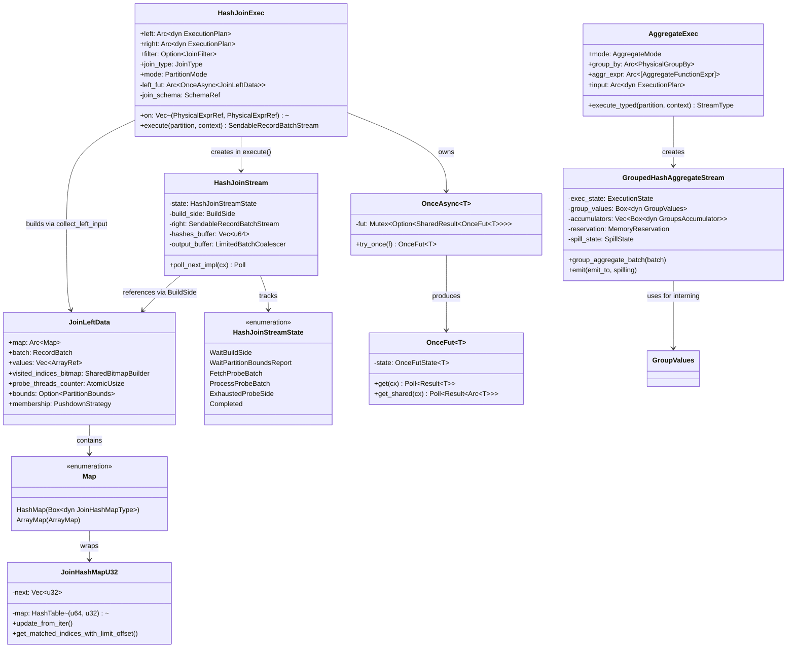
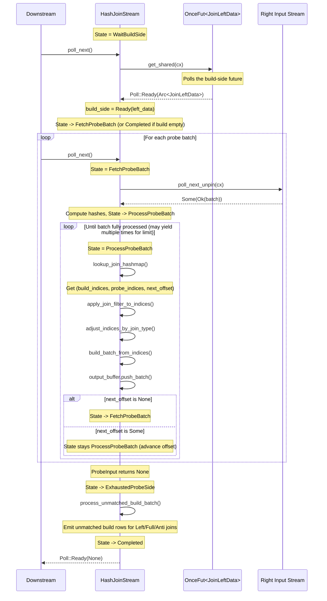
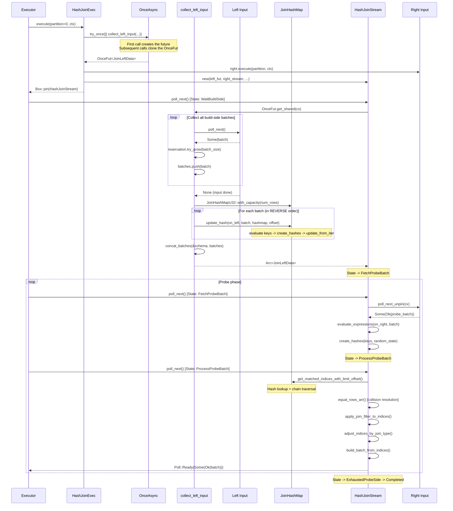

# Module Teardown: Complex Pipelines -- Stateful Breakers & Joins

## Table of Contents

- [0. Research Focus](#0-research-focus)
- [1. High-Level Overview](#1-high-level-overview)
- [2. Structural Architecture](#2-structural-architecture)
  - [Class Diagram](#class-diagram)
- [3. Execution & Call Flow](#3-execution-call-flow)
  - [3.1 HashJoinExec: Build Phase](#31-hashjoinexec-build-phase)
  - [3.2 JoinHashMap Construction: Chained LIFO Structure](#32-joinhashmap-construction-chained-lifo-structure)
  - [3.3 HashJoinStream State Machine](#33-hashjoinstream-state-machine)
  - [3.4 Probe-Side Processing Detail](#34-probe-side-processing-detail)
  - [3.5 Join Type Effects on the State Machine](#35-join-type-effects-on-the-state-machine)
  - [3.6 AggregateExec and GroupedHashAggregateStream](#36-aggregateexec-and-groupedhashaggregatestream)
  - [3.7 GroupValues: Group Key Interning](#37-groupvalues-group-key-interning)
  - [Sequence Diagram: Full HashJoin Execution](#sequence-diagram-full-hashjoin-execution)
- [4. Concurrency & State Management](#4-concurrency-state-management)
  - [4.1 No `tokio::spawn` for Build Side](#41-no-tokiospawn-for-build-side)
  - [4.2 Visited Bitmap Synchronization](#42-visited-bitmap-synchronization)
  - [4.3 Null-Aware Anti Join: Cross-Partition Atomics](#43-null-aware-anti-join-cross-partition-atomics)
  - [4.4 AggregateExec: No Cross-Partition Sharing](#44-aggregateexec-no-cross-partition-sharing)
- [5. Memory & Resource Profile](#5-memory-resource-profile)
  - [5.1 HashJoinExec Memory](#51-hashjoinexec-memory)
  - [5.2 ArrayMap Optimization](#52-arraymap-optimization)
  - [5.3 AggregateExec Memory and Spilling](#53-aggregateexec-memory-and-spilling)
  - [5.4 Output Coalescing](#54-output-coalescing)
- [6. Key Design Insights](#6-key-design-insights)
  - [Insight 1: Pipeline Breakers Are Modeled as Async State Machines, Not Separate Threads](#insight-1-pipeline-breakers-are-modeled-as-async-state-machines-not-separate-threads)
  - [Insight 2: LIFO Chained Hash Map Preserves Input Order Through Reverse Insertion](#insight-2-lifo-chained-hash-map-preserves-input-order-through-reverse-insertion)
  - [Insight 3: ProcessProbeBatch Is Synchronous With Batch-Size Limiting](#insight-3-processprobebatch-is-synchronous-with-batch-size-limiting)
  - [Insight 4: Join Type Affects Three Distinct Code Paths](#insight-4-join-type-affects-three-distinct-code-paths)
  - [Insight 5: GroupValues Uses Vectorized Interning for Performance](#insight-5-groupvalues-uses-vectorized-interning-for-performance)
  - [Insight 6: Aggregation Has a "Partial Skip" Optimization for High-Cardinality Groups](#insight-6-aggregation-has-a-partial-skip-optimization-for-high-cardinality-groups)
  - [Insight 7: AggregateExec Uses a Separation of Concerns Between GroupValues and Accumulators](#insight-7-aggregateexec-uses-a-separation-of-concerns-between-groupvalues-and-accumulators)
  - [Insight 8: Both Hash Join and Hash Aggregate Use hashbrown's HashTable, Not HashMap](#insight-8-both-hash-join-and-hash-aggregate-use-hashbrowns-hashtable-not-hashmap)


## 0. Research Focus
* **Task ID:** 3.4
* **Focus:** Trace `HashJoinExec`. How does the async state machine transition between the Build phase and the Probe phase inside its `poll_next()` implementation? Trace the construction of the `JoinHashMap` and see if `tokio::spawn` is used to collect the build side concurrently. Also trace `AggregateExec` and `GroupedHashAggregateStream` to understand how stateful operators break the simple pipeline model.

## 1. High-Level Overview
* **Core Responsibility:** `HashJoinExec` and `AggregateExec` are the two primary "pipeline breakers" in DataFusion's physical execution layer. A pipeline breaker is an operator that **must buffer an entire input** (or significant portion) before it can produce any output. `HashJoinExec` buffers the entire build side into a hash table before streaming the probe side through it. `AggregateExec` buffers group-by state and accumulator values across all input batches before emitting aggregated output.
* **Key Triggers:** Both are triggered by the standard `ExecutionPlan::execute(partition, context)` call, which returns a `SendableRecordBatchStream`. The stream is then driven by downstream `poll_next()` calls. The build-side collection in `HashJoinExec` is triggered lazily on the first `poll_next()` call. `AggregateExec` reads its input incrementally but defers output until all input is consumed (or memory pressure forces early emission).

## 2. Structural Architecture
* **Primary Source Files:**
  - `datafusion/physical-plan/src/joins/hash_join/exec.rs` -- `HashJoinExec` struct, builder, `execute()`, `collect_left_input()`
  - `datafusion/physical-plan/src/joins/hash_join/stream.rs` -- `HashJoinStream` state machine, `lookup_join_hashmap()`
  - `datafusion/physical-plan/src/joins/join_hash_map.rs` -- `JoinHashMapU32`, `JoinHashMapU64`, `JoinHashMapType` trait
  - `datafusion/physical-plan/src/joins/chain.rs` -- `traverse_chain()` for chained-index lookup
  - `datafusion/physical-plan/src/joins/utils.rs` -- `OnceAsync`, `OnceFut`, `update_hash()`, `equal_rows_arr()`, `adjust_indices_by_join_type()`
  - `datafusion/physical-plan/src/joins/mod.rs` -- `Map` enum, `PartitionMode`, `MapOffset`
  - `datafusion/physical-plan/src/aggregates/mod.rs` -- `AggregateExec`, `execute_typed()`
  - `datafusion/physical-plan/src/aggregates/row_hash.rs` -- `GroupedHashAggregateStream`, `ExecutionState`
  - `datafusion/physical-plan/src/aggregates/group_values/mod.rs` -- `GroupValues` trait, `new_group_values()`
  - `datafusion/physical-plan/src/aggregates/group_values/multi_group_by/mod.rs` -- `GroupValuesColumn`, `vectorized_intern()`

* **Key Data Structures:**

| Structure | Role |
|-----------|------|
| `HashJoinExec` | Physical plan node; holds both children, join type, `OnceAsync<JoinLeftData>`, partition mode |
| `JoinLeftData` | Build-side result: hash map + concatenated batch + visited-indices bitmap |
| `HashJoinStream` | Async stream with explicit state machine (`WaitBuildSide -> FetchProbeBatch -> ProcessProbeBatch -> ExhaustedProbeSide -> Completed`) |
| `JoinHashMapU32` / `JoinHashMapU64` | Hash table mapping hash-values to chained row indices via `HashTable<(u64, T)>` + `Vec<T>` |
| `Map` | Enum wrapping either `HashMap(Box<dyn JoinHashMapType>)` or `ArrayMap` (perfect hash) |
| `OnceAsync<T>` | Shared-future coordinator; ensures build side runs exactly once across all partitions |
| `OnceFut<T>` | Clonable handle to a shared boxed future with `Pending` / `Ready` state |
| `AggregateExec` | Physical plan node for GROUP BY + aggregate functions |
| `GroupedHashAggregateStream` | Stream with `ReadingInput -> ProducingOutput -> SkippingAggregation -> Done` states |
| `GroupValues` | Trait for group-key interning; maps group-key tuples to consecutive `group_id`s |
| `GroupValuesColumn` | Multi-column `GroupValues` impl using `HashTable<(u64, GroupIndexView)>` |
| `GroupsAccumulator` | Trait for vectorized accumulator state (one per aggregate function) |

### Class Diagram



## 3. Execution & Call Flow

### 3.1 HashJoinExec: Build Phase

The build phase is triggered by `HashJoinExec::execute()`. The critical distinction is between `CollectLeft` and `Partitioned` modes:

**CollectLeft mode** -- the build side has a single partition (often after `CoalescePartitionsExec`). All output partitions share the same build-side future via `OnceAsync`:

```rust
// exec.rs:1319-1339
let left_fut = match self.mode {
    PartitionMode::CollectLeft => self.left_fut.try_once(|| {
        let left_stream = self.left.execute(0, Arc::clone(&context))?;
        let reservation =
            MemoryConsumer::new("HashJoinInput").register(context.memory_pool());
        Ok(collect_left_input(
            self.random_state.random_state().clone(),
            left_stream,
            on_left.clone(),
            join_metrics.clone(),
            reservation,
            need_produce_result_in_final(self.join_type),
            self.right().output_partitioning().partition_count(),
            // ...
        ))
    })?,
    PartitionMode::Partitioned => {
        let left_stream = self.left.execute(partition, Arc::clone(&context))?;
        // Each partition builds its own hash table
        OnceFut::new(collect_left_input(/* ... */))
    }
    // ...
};
```

**Key finding: `tokio::spawn` is NOT used.** The build-side future is created as an async function and wrapped in `OnceFut`. It is polled lazily when the first `poll_next()` is called on any `HashJoinStream`. In `CollectLeft` mode, `OnceAsync::try_once()` ensures only one future is created; all partitions share the same `Shared<BoxFuture>`. The `futures::future::Shared` adapter allows multiple tasks to poll the same future concurrently.

The `collect_left_input` async function performs:

```rust
// exec.rs:1893-2091
async fn collect_left_input(/* ... */) -> Result<JoinLeftData> {
    // 1. Stream all build-side batches, accumulating them
    let state = left_stream
        .try_fold(initial, |mut state, batch| async move {
            state.reservation.try_grow(batch_size)?;
            state.batches.push(batch);
            Ok(state)
        })
        .await?;

    // 2. Try ArrayMap optimization first (perfect hash for single integer key)
    let (join_hash_map, batch, left_values) =
        if let Some((array_map, batch, left_value)) = try_create_array_map(/* ... */)? {
            (Map::ArrayMap(array_map), batch, left_value)
        } else {
            // 3. Build standard JoinHashMap
            let mut hashmap: Box<dyn JoinHashMapType> = if num_rows > u32::MAX as usize {
                Box::new(JoinHashMapU64::with_capacity(num_rows))
            } else {
                Box::new(JoinHashMapU32::with_capacity(num_rows))
            };

            // 4. Iterate batches in REVERSE to maintain LIFO ordering
            for batch in batches_iter.clone() {
                update_hash(&on_left, batch, &mut *hashmap, offset,
                    &random_state, &mut hashes_buffer, 0, true)?;
                offset += batch.num_rows();
            }

            // 5. Concatenate all batches into a single RecordBatch
            let batch = concat_batches(&schema, batches_iter.clone())?;
            (Map::HashMap(hashmap), batch, left_values)
        };

    // 6. Create visited-indices bitmap for Left/Full/Semi/Anti joins
    Ok(JoinLeftData { map: Arc::new(join_hash_map), batch, /* ... */ })
}
```

### 3.2 JoinHashMap Construction: Chained LIFO Structure

The `JoinHashMap` uses a **chained list** structure backed by `hashbrown::HashTable`. Instead of storing row data in the hash table, it stores `(hash_value, head_index)` pairs. The `next` vector chains collisions:

```rust
// join_hash_map.rs:139-157
pub struct JoinHashMapU32 {
    map: HashTable<(u64, u32)>,   // hash -> head of chain (1-indexed)
    next: Vec<u32>,               // chain links (0 = end of chain)
}
```

The `update_from_iter` function inserts rows:

```rust
// join_hash_map.rs:298-329
fn update_from_iter<T>(map, next, iter, deleted_offset) {
    for (row, &hash_value) in iter {
        let entry = map.entry(hash_value, |&(hash, _)| hash_value == hash, |&(hash, _)| hash);
        match entry {
            Occupied(mut occupied_entry) => {
                let (_, index) = occupied_entry.get_mut();
                let prev_index = *index;
                *index = T::try_from(row + 1).unwrap();   // new head (1-indexed)
                next[row - deleted_offset] = prev_index;   // old head becomes next
            }
            Vacant(vacant_entry) => {
                vacant_entry.insert((hash_value, T::try_from(row + 1).unwrap()));
            }
        }
    }
}
```

The chain is traversed during probe via `traverse_chain()`:

```rust
// chain.rs:29-69
fn traverse_chain<T>(next_chain, prob_idx, start_chain_idx, remaining,
    input_indices, match_indices, is_last_input) -> Option<MapOffset>
{
    let mut match_row_idx = start_chain_idx - one;
    loop {
        match_indices.push(match_row_idx.into());
        input_indices.push(prob_idx as u32);
        *remaining -= 1;

        let next = next_chain[match_row_idx.into() as usize];
        if *remaining == 0 {
            return if is_last_input && next == zero { None }
                   else { Some((prob_idx, Some(next.into()))) };
        }
        if next == zero { return None; }  // end of chain
        match_row_idx = next - one;
    }
}
```

The 1-indexing trick is critical: value `0` in the `next` array signals "end of chain", so actual row index 0 is stored as `1`.

### 3.3 HashJoinStream State Machine



The state machine in `poll_next_impl()`:

```rust
// stream.rs:426-469
fn poll_next_impl(&mut self, cx: &mut std::task::Context<'_>) -> Poll<Option<Result<RecordBatch>>> {
    loop {
        // First check output buffer for ready batches
        if let Some(batch) = self.output_buffer.next_completed_batch() {
            return self.join_metrics.baseline.record_poll(Poll::Ready(Some(Ok(batch))));
        }
        if self.output_buffer.is_finished() { return Poll::Ready(None); }

        return match self.state {
            HashJoinStreamState::WaitBuildSide => {
                handle_state!(ready!(self.collect_build_side(cx)))
            }
            HashJoinStreamState::FetchProbeBatch => {
                handle_state!(ready!(self.fetch_probe_batch(cx)))
            }
            HashJoinStreamState::ProcessProbeBatch(_) => {
                handle_state!(self.process_probe_batch())  // synchronous!
            }
            HashJoinStreamState::ExhaustedProbeSide => {
                handle_state!(self.process_unmatched_build_batch())
            }
            HashJoinStreamState::Completed if !self.output_buffer.is_empty() => {
                self.output_buffer.finish()?;
                continue;  // loop to emit flushed batch
            }
            HashJoinStreamState::Completed => Poll::Ready(None),
        };
    }
}
```

The `handle_state!` macro enables the "continue-or-return" pattern:

```rust
// utils.rs:1474-1484
macro_rules! handle_state {
    ($match_case:expr) => {
        match $match_case {
            Ok(StatefulStreamResult::Continue) => continue,    // loop again
            Ok(StatefulStreamResult::Ready(result)) => {
                Poll::Ready(Ok(result).transpose())            // emit batch
            }
            Err(e) => Poll::Ready(Some(Err(e))),
        }
    };
}
```

### 3.4 Probe-Side Processing Detail

The `lookup_join_hashmap` function resolves hash matches and verifies them against actual values:

```rust
// stream.rs:286-325
fn lookup_join_hashmap(
    build_hashmap, build_side_values, probe_side_values,
    null_equality, hashes_buffer, limit, offset,
    probe_indices_buffer, build_indices_buffer,
) -> Result<(UInt64Array, UInt32Array, Option<MapOffset>)> {
    // Step 1: Hash lookup -- get candidate (build_idx, probe_idx) pairs
    let next_offset = build_hashmap.get_matched_indices_with_limit_offset(
        hashes_buffer, limit, offset, probe_indices_buffer, build_indices_buffer,
    );

    // Step 2: Collision resolution -- verify actual value equality
    let (build_indices, probe_indices) = equal_rows_arr(
        &build_indices_unfiltered, &probe_indices_unfiltered,
        build_side_values, probe_side_values, null_equality,
    )?;

    Ok((build_indices, probe_indices, next_offset))
}
```

The `equal_rows_arr` function uses Arrow's `take` + `eq_dyn_null` kernels to do vectorized comparison of the actual join-key values at the candidate index positions. This two-phase approach (hash lookup + equality verification) handles hash collisions correctly.

### 3.5 Join Type Effects on the State Machine

Different join types affect processing at three points:

**1. During `ProcessProbeBatch` -- `adjust_indices_by_join_type()`:**

```rust
// utils.rs:1098-1155
match join_type {
    JoinType::Inner => Ok((left_indices, right_indices)),     // matched only
    JoinType::Left  => Ok((left_indices, right_indices)),     // matched; unmatched deferred
    JoinType::Right => append_right_indices(/* ... */),       // matched + unmatched right
    JoinType::Full  => append_right_indices(/* ... */),       // matched + unmatched right
    JoinType::RightSemi => get_semi_indices(/* ... */),       // deduplicated right
    JoinType::RightAnti => get_anti_indices(/* ... */),       // unmatched right only
    JoinType::LeftSemi | JoinType::LeftAnti | JoinType::LeftMark => {
        // Return empty -- all output deferred to final phase
        Ok((UInt64Array::from_iter_values(vec![]),
            UInt32Array::from_iter_values(vec![])))
    }
}
```

**2. During probe -- visited bitmap tracking:**

```rust
// stream.rs:745-750
if need_produce_result_in_final(self.join_type) {
    let mut bitmap = build_side.left_data.visited_indices_bitmap().lock();
    left_indices.iter().flatten().for_each(|x| {
        bitmap.set_bit(x as usize, true);
    });
}
```

Join types that need the bitmap: `Left`, `LeftAnti`, `LeftSemi`, `LeftMark`, `Full`.

**3. During `ExhaustedProbeSide` -- `process_unmatched_build_batch()`:**

For Left/Full joins, this emits build-side rows that were never matched (bitmap bit = false). For LeftSemi, it emits rows that WERE matched. For LeftAnti, it emits rows that were NOT matched.

**4. Build-side-empty fast path:**

```rust
// stream.rs:414-422
fn state_after_build_ready(join_type, left_data) -> HashJoinStreamState {
    if left_data.map().is_empty() && join_type.empty_build_side_produces_empty_result() {
        HashJoinStreamState::Completed   // skip probe entirely
    } else {
        HashJoinStreamState::FetchProbeBatch
    }
}
```

### 3.6 AggregateExec and GroupedHashAggregateStream

`AggregateExec::execute_typed()` selects the stream type based on whether there is a GROUP BY clause:

```rust
// mod.rs:896-920
fn execute_typed(&self, partition, context) -> Result<StreamType> {
    if self.group_by.is_true_no_grouping() {
        return Ok(StreamType::AggregateStream(AggregateStream::new(self, context, partition)?));
    }
    if let Some(config) = self.limit_options /* ... */ {
        return Ok(StreamType::GroupedPriorityQueue(
            GroupedTopKAggregateStream::new(self, context, partition, config.limit)?));
    }
    Ok(StreamType::GroupedHash(GroupedHashAggregateStream::new(self, context, partition)?))
}
```

The `GroupedHashAggregateStream` state machine (`poll_next`):

```
ReadingInput
  |-- New batch -> group_aggregate_batch() -> [maybe emit early / spill / skip] -> stay ReadingInput
  |-- Input exhausted -> ProducingOutput
  |-- Soft group limit hit -> ProducingOutput

ProducingOutput
  |-- Batch emitted (input_done) -> Done
  |-- Batch emitted (!input_done) -> ReadingInput or SkippingAggregation

SkippingAggregation
  |-- Transform input directly to state output (bypass aggregation)
  |-- Input exhausted -> Done

Done
  |-- Release memory, return None
```

The core aggregation loop in `group_aggregate_batch()`:

```rust
// row_hash.rs:911-1010
fn group_aggregate_batch(&mut self, batch: &RecordBatch) -> Result<()> {
    // 1. Evaluate GROUP BY expressions
    let group_by_values = evaluate_group_by(&self.group_by, batch)?;

    // 2. Evaluate aggregate argument expressions
    let input_values = evaluate_many(&self.aggregate_arguments, batch)?;

    // 3. Evaluate filter expressions
    let filter_values = evaluate_optional(&self.filter_expressions, batch)?;

    for group_values in &group_by_values {
        // 4. Intern group keys -> get group indices
        self.group_values.intern(group_values, &mut self.current_group_indices)?;

        // 5. Update each accumulator with the group indices
        for ((acc, values), opt_filter) in self.accumulators.iter_mut()
            .zip(input_values.iter()).zip(filter_values.iter())
        {
            if self.mode.input_mode() == AggregateInputMode::Raw {
                acc.update_batch(values, group_indices, opt_filter, total_num_groups)?;
            } else {
                acc.merge_batch(values, group_indices, None, total_num_groups)?;
            }
        }
    }
}
```

### 3.7 GroupValues: Group Key Interning

The `GroupValues` trait's `intern()` method is the heart of hash aggregation. For multi-column GROUP BY, `GroupValuesColumn` uses a vectorized approach:

```rust
// multi_group_by/mod.rs:422-474
fn vectorized_intern(&mut self, cols, groups) -> Result<()> {
    // 1. Compute hashes for all rows
    create_hashes(cols, &self.random_state, &mut batch_hashes)?;

    // 2. Probe the HashTable for each hash
    //    - If bucket NOT found: insert new group, assign next group_id
    //    - If bucket found: record for vectorized equality check
    self.collect_vectorized_process_context(&batch_hashes, groups);

    // 3. Vectorized append: bulk-insert new group values
    self.vectorized_append(cols)?;

    // 4. Vectorized equality check: verify hash matches against stored values
    self.vectorized_equal_to(cols, groups);

    // 5. Handle remaining rows (hash collisions that didn't match)
    self.scalarized_intern_remaining(cols, &batch_hashes, groups)?;
}
```

The `GroupValuesColumn` uses `HashTable<(u64, GroupIndexView)>` where `GroupIndexView` can be either:
- **Inlined**: a single group index stored directly in the view (common case, no collision)
- **Non-inlined**: an offset into `group_index_lists: Vec<Vec<usize>>` for hash collisions mapping to multiple distinct groups

### Sequence Diagram: Full HashJoin Execution



## 4. Concurrency & State Management

### 4.1 No `tokio::spawn` for Build Side

DataFusion does **not** use `tokio::spawn` for the build-side collection. The build-side future is created as a regular async function and wrapped in `OnceFut`. The key concurrency primitive is `futures::future::Shared`:

```rust
// utils.rs:778-791
impl<T: 'static> OnceFut<T> {
    pub(crate) fn new<Fut>(fut: Fut) -> Self
    where Fut: Future<Output = Result<T>> + Send + 'static,
    {
        Self {
            state: OnceFutState::Pending(
                fut.map(|res| res.map(Arc::new).map_err(Arc::new))
                    .boxed()
                    .shared(),  // <-- futures::future::Shared
            ),
        }
    }
}
```

In `CollectLeft` mode, `OnceAsync` wraps the creation:

```rust
// utils.rs:368-387
impl<T: 'static> OnceAsync<T> {
    pub(crate) fn try_once<F, Fut>(&self, f: F) -> Result<OnceFut<T>>
    {
        self.fut
            .lock()                                    // Mutex<Option<...>>
            .get_or_insert_with(|| f().map(OnceFut::new).map_err(Arc::new))
            .clone()                                   // Clone the OnceFut
            .map_err(DataFusionError::Shared)
    }
}
```

This means:
- The first `execute()` call creates the future
- All subsequent `execute()` calls on different partitions get clones of the same `OnceFut`
- All clones share the same underlying `Shared<BoxFuture>`
- The first `poll_next()` call that reaches `WaitBuildSide` actually drives the future
- Other partitions' `poll_next()` calls will also poll the shared future, and `Shared` handles the coordination

### 4.2 Visited Bitmap Synchronization

The visited-indices bitmap is shared across probe partitions via `SharedBitmapBuilder` (`Mutex<BooleanBufferBuilder>`). Each probe partition locks the bitmap to mark visited indices:

```rust
// stream.rs:745-750
let mut bitmap = build_side.left_data.visited_indices_bitmap().lock();
left_indices.iter().flatten().for_each(|x| {
    bitmap.set_bit(x as usize, true);
});
```

The final unmatched-row emission uses `probe_threads_counter` with `AtomicUsize` to ensure only the **last** probe partition to finish emits unmatched rows:

```rust
// exec.rs:248-252
pub(super) fn report_probe_completed(&self) -> bool {
    self.probe_threads_counter.fetch_sub(1, Ordering::Relaxed) == 1
}
```

### 4.3 Null-Aware Anti Join: Cross-Partition Atomics

For null-aware anti joins (`NOT IN`), two atomic flags coordinate global state across partitions:

```rust
// exec.rs:216-219
pub(super) probe_side_non_empty: AtomicBool,
pub(super) probe_side_has_null: AtomicBool,
```

If **any** probe partition sees a NULL in its join key, `probe_side_has_null` is set, and **all** partitions suppress output. This is correct because `x NOT IN (..., NULL, ...)` is always UNKNOWN/FALSE.

### 4.4 AggregateExec: No Cross-Partition Sharing

Unlike `HashJoinExec`, `AggregateExec` has no cross-partition state sharing. Each partition operates independently with its own `GroupedHashAggregateStream`, `GroupValues`, accumulators, and memory reservation.

## 5. Memory & Resource Profile

### 5.1 HashJoinExec Memory

Memory is tracked through `MemoryReservation` at multiple points:

1. **Build-side batch accumulation**: Each incoming batch's size is reserved via `reservation.try_grow(batch_size)`
2. **Hash table allocation**: Pre-estimated via `estimate_memory_size::<(u32/u64, u64)>(num_rows, fixed_size)` before allocation
3. **Visited bitmap**: `ceil(num_rows, 8)` bytes reserved for the `BooleanBufferBuilder`
4. **Reservation held for lifecycle**: `_reservation` field in `JoinLeftData` keeps the reservation alive

The hash table uses `hashbrown::HashTable` (not `HashMap`), which stores `(u64_hash, u32/u64_index)` pairs. The `next` chain vector is `Vec<u32>` or `Vec<u64>` with `num_rows` capacity.

Total build-side memory ~ `batch_data + sizeof(HashEntry) * num_rows + sizeof(T) * num_rows + bitmap`.

### 5.2 ArrayMap Optimization

For single integer join keys with dense value ranges, an `ArrayMap` (perfect hash) avoids the hash table entirely. Decision criteria:

```rust
// exec.rs:170-173
if range >= perfect_hash_join_small_build_threshold as u64
    && dense_ratio <= perfect_hash_join_min_key_density
{
    return Ok(None);  // fall back to hash map
}
```

### 5.3 AggregateExec Memory and Spilling

`GroupedHashAggregateStream` manages memory via `MemoryReservation` that is updated after each batch:

```rust
// row_hash.rs:1055-1087
fn update_memory_reservation(&mut self) -> Result<()> {
    let acc = self.accumulators.iter().map(|x| x.size()).sum::<usize>();
    let groups_and_acc_size = acc + self.group_values.size()
        + self.group_ordering.size() + self.current_group_indices.allocated_size();
    let sort_headroom = /* extra buffer for spill sorting */;
    self.reservation.try_resize(groups_and_acc_size + sort_headroom)
}
```

When OOM occurs, three strategies are available:

| Mode | Condition | Action |
|------|-----------|--------|
| `EmitEarly` | Partial aggregation mode | Emit accumulated groups as partial state |
| `Spill` | Non-partial mode, disk enabled | Spill sorted state to Arrow IPC files, merge later |
| `ReportError` | No other option | Propagate `ResourcesExhausted` error |

### 5.4 Output Coalescing

`HashJoinStream` uses `LimitedBatchCoalescer` to buffer small output batches into larger ones (up to `batch_size`). This absorbs the limit (`fetch`) and avoids emitting many tiny batches:

```rust
// stream.rs:380-381
let output_buffer = LimitedBatchCoalescer::new(Arc::clone(&schema), batch_size, fetch);
```

## 6. Key Design Insights

### Insight 1: Pipeline Breakers Are Modeled as Async State Machines, Not Separate Threads

DataFusion does not spawn separate threads or tasks for the build side of hash joins. Instead, the build-side collection is modeled as an async future that is polled cooperatively within the same task as the probe side. The `OnceFut<JoinLeftData>` wraps a `Shared<BoxFuture>`, allowing multiple output partitions to share the same build computation without explicit thread management.

**Evidence:** `exec.rs:1319-1339` shows `collect_left_input()` wrapped in `OnceFut::new()` or `OnceAsync::try_once()`, with no `tokio::spawn`. The `Shared` future type at `utils.rs:390` (`Shared<BoxFuture<'static, SharedResult<Arc<T>>>>`) is what enables multi-partition sharing.

**Implication:** This design keeps the executor purely pull-based. The build phase only makes progress when a downstream consumer calls `poll_next()`. This avoids the complexity of managing a separate spawned task and its lifecycle, but means that build-side work is serialized to a single async task (the first partition to poll).

### Insight 2: LIFO Chained Hash Map Preserves Input Order Through Reverse Insertion

The `JoinHashMap` uses a 1-indexed LIFO chain (via `Vec<T>` where 0 = end sentinel) and inserts batches in **reverse order**. By iterating `batches.iter().rev()` during `update_hash`, the first batch's rows end up at the top of the chain. This means probe-side lookups traverse the chain in the original build-side input order (smallest indices first), preserving deterministic output order.

**Evidence:** `exec.rs:2006-2023` shows the reverse iteration: `let batches_iter = batches.iter().rev()`. `join_hash_map.rs:307-328` shows the LIFO insertion where new entries become the head of the chain (`*index = row + 1; next[row] = prev_index`).

### Insight 3: ProcessProbeBatch Is Synchronous With Batch-Size Limiting

Unlike `WaitBuildSide` and `FetchProbeBatch` which are async (they use `ready!()` to suspend on I/O), `ProcessProbeBatch` is purely synchronous. The `batch_size` limit parameter to `get_matched_indices_with_limit_offset()` bounds the output size per call. If a single probe batch produces more matches than `batch_size`, the state remains `ProcessProbeBatch` with an advanced offset, and the loop continues:

```rust
// stream.rs:821-829
if next_offset.is_none() {
    self.state = HashJoinStreamState::FetchProbeBatch;
} else {
    state.advance(next_offset.unwrap(), last_joined_right_idx);
    // stays in ProcessProbeBatch
}
```

**Evidence:** `stream.rs:454-456` calls `process_probe_batch()` without `ready!()`. The `MapOffset = (usize, Option<u64>)` type tracks both the probe-row index and the position within the chain for resumption.

### Insight 4: Join Type Affects Three Distinct Code Paths

The join type is not handled in a single place but affects three separate processing stages:

1. **Bitmap tracking** (`need_produce_result_in_final`): Left, LeftAnti, LeftSemi, LeftMark, Full -- these track which build-side rows were matched.
2. **Index adjustment** (`adjust_indices_by_join_type`): Inner/Left pass through; Right/Full append unmatched probe rows; RightSemi deduplicates; RightAnti inverts; LeftSemi/LeftAnti/LeftMark return empty (deferred to final).
3. **Final emission** (`process_unmatched_build_batch`): Uses the bitmap to emit unmatched (for Anti/outer) or matched (for Semi) build-side rows.

**Evidence:** `utils.rs:849-858` defines the bitmap set. `utils.rs:1098-1155` shows the index adjustment dispatch. `stream.rs:837-937` shows the final emission logic.

### Insight 5: GroupValues Uses Vectorized Interning for Performance

The `GroupValuesColumn::vectorized_intern` method processes group keys in bulk rather than row-by-row. It separates "new groups" (need appending) from "existing groups" (need equality checking) in a single pass over the hash table, then performs batch append and batch equality checking. This avoids per-row virtual dispatch and enables SIMD-friendly operations.

**Evidence:** `multi_group_by/mod.rs:422-474` shows the four-step vectorized approach: `collect_vectorized_process_context` -> `vectorized_append` -> `vectorized_equal_to` -> `scalarized_intern_remaining`. The `GroupIndexView` type uses bit-packing to distinguish inlined (single group) from non-inlined (collision list) views.

### Insight 6: Aggregation Has a "Partial Skip" Optimization for High-Cardinality Groups

When partial aggregation detects that the number of groups is nearly equal to the number of input rows (high cardinality), it switches to `SkippingAggregation` state. This bypasses the hash table entirely and converts each input row directly to its intermediate accumulator state using `GroupsAccumulator::convert_to_state()`.

**Evidence:** `row_hash.rs:122-199` defines `SkipAggregationProbe` with configurable thresholds. The ratio check at line 195: `self.should_skip = self.num_groups as f64 / self.input_rows as f64 >= self.probe_ratio_threshold`. The skip mode at `row_hash.rs:810-840` transforms batches directly via `self.transform_to_states(&batch)`.

### Insight 7: AggregateExec Uses a Separation of Concerns Between GroupValues and Accumulators

The design deliberately separates group-key management (`GroupValues`) from aggregate state management (`GroupsAccumulator`). `GroupValues` only assigns group indices. Accumulators only store per-group state indexed by those indices. Neither knows about the other's internals. This enables:
- Type-specialized `GroupValues` implementations (primitive, bytes, multi-column) without changing accumulators
- Type-specialized `GroupsAccumulator` implementations (SUM for i64, COUNT, AVG) without changing group management
- Independent memory accounting for both components

**Evidence:** `row_hash.rs:224-261` shows the architectural diagram. The `intern()` call at line 953 only returns group indices. The `update_batch()` call at line 987 only receives group indices and values. The two never directly interact.

### Insight 8: Both Hash Join and Hash Aggregate Use hashbrown's HashTable, Not HashMap

Both operators use `hashbrown::HashTable` rather than `HashMap` or `HashSet`. `HashTable` provides lower-level control -- it stores raw `(hash, value)` tuples and requires the caller to provide the hash function during lookup. This avoids double-hashing (the hash is precomputed once and stored) and allows custom probe logic.

**Evidence:** `join_hash_map.rs:29` imports `hashbrown::HashTable`. `JoinHashMapU32` stores `HashTable<(u64, u32)>`. `GroupValuesColumn` at `multi_group_by/mod.rs:184` stores `HashTable<(u64, GroupIndexView)>`. Both use the hash value as the first element of the tuple for O(1) lookup.
