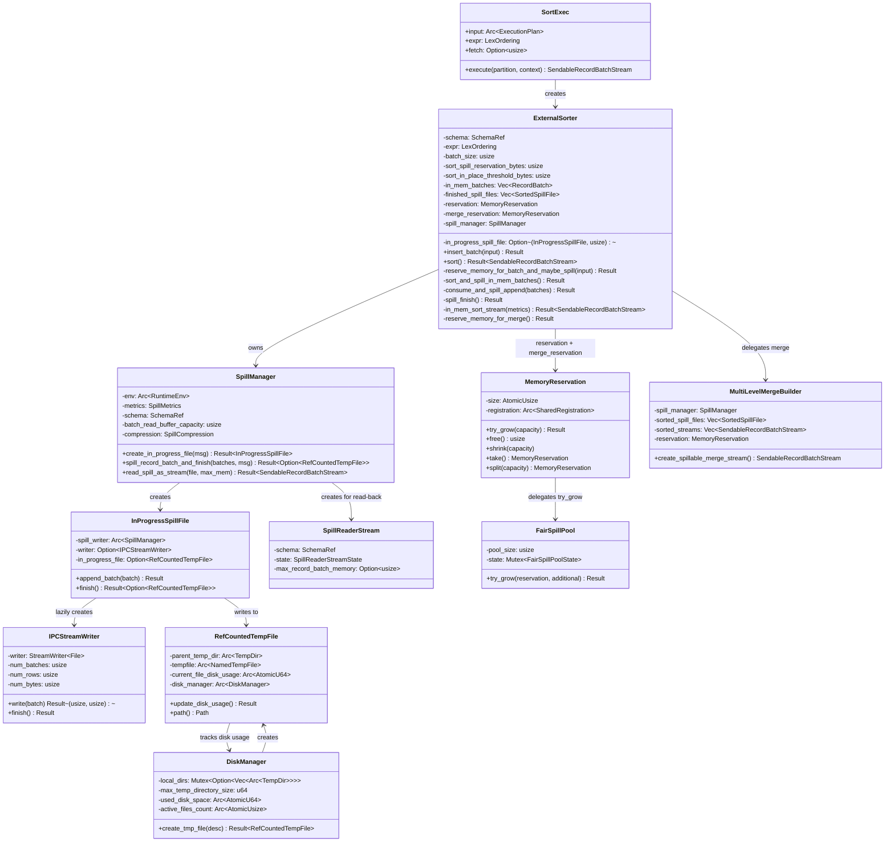
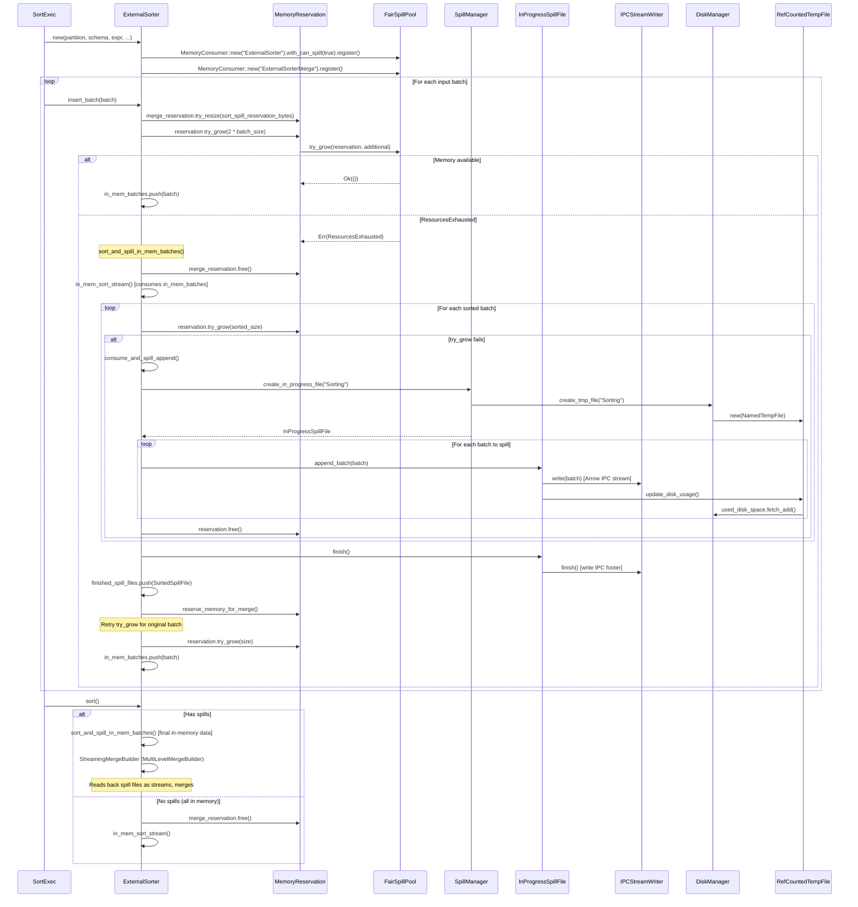

# Module Teardown: Proactive Disk Spilling (ExternalSorter, SpillManager, DiskManager)

## Table of Contents

- [0. Research Focus](#0-research-focus)
- [1. High-Level Overview](#1-high-level-overview)
- [2. Structural Architecture](#2-structural-architecture)
  - [Class Diagram](#class-diagram)
- [3. Execution & Call Flow](#3-execution-call-flow)
  - [3.1 SortExec::execute() -- Creating the ExternalSorter](#31-sortexecexecute-creating-the-externalsorter)
  - [3.2 ExternalSorter Construction](#32-externalsorter-construction)
  - [3.3 The Spill Trigger: insert_batch -> try_grow -> spill](#33-the-spill-trigger-insert_batch-try_grow-spill)
  - [3.4 Memory Estimation: get_reserved_bytes_for_record_batch](#34-memory-estimation-get_reserved_bytes_for_record_batch)
  - [Sequence Diagram](#sequence-diagram)
- [4. Concurrency & State Management](#4-concurrency-state-management)
  - [4.1 Memory Pool Fairness (FairSpillPool)](#41-memory-pool-fairness-fairspillpool)
  - [4.2 ExternalSorter -- Single-Threaded State Machine](#42-externalsorter-single-threaded-state-machine)
  - [4.3 DiskManager -- Mutex for Directory Creation](#43-diskmanager-mutex-for-directory-creation)
  - [4.4 RefCountedTempFile -- RAII Cleanup](#44-refcountedtempfile-raii-cleanup)
  - [4.5 SpillReaderStream -- Spawned Blocking Tasks](#45-spillreaderstream-spawned-blocking-tasks)
  - [4.6 Merge Reservation Transfer (Anti-Starvation)](#46-merge-reservation-transfer-anti-starvation)
- [5. Memory & Resource Profile](#5-memory-resource-profile)
  - [5.1 Configuration Options](#51-configuration-options)
  - [5.2 Memory Lifecycle in ExternalSorter](#52-memory-lifecycle-in-externalsorter)
  - [5.3 Disk Usage Tracking](#53-disk-usage-tracking)
- [6. Key Design Insights](#6-key-design-insights)
  - [Insight 1: The Spill Decision is Cooperative, Not Preemptive](#insight-1-the-spill-decision-is-cooperative-not-preemptive)
  - [Insight 2: Two-Phase Spill Writing (Incremental Append)](#insight-2-two-phase-spill-writing-incremental-append)
  - [Insight 3: StringView GC Before Spilling Prevents Buffer Bloat](#insight-3-stringview-gc-before-spilling-prevents-buffer-bloat)
  - [Insight 4: Arrow IPC Stream Format (Not File Format) for Spilling](#insight-4-arrow-ipc-stream-format-not-file-format-for-spilling)
  - [Insight 5: Alignment-Aware IPC Writing for Zero-Copy Read-Back](#insight-5-alignment-aware-ipc-writing-for-zero-copy-read-back)
  - [Insight 6: Multi-Level Merge for Extremely Large Datasets](#insight-6-multi-level-merge-for-extremely-large-datasets)
  - [Insight 7: Spilling is a Shared Infrastructure Across Operators](#insight-7-spilling-is-a-shared-infrastructure-across-operators)
  - [Insight 8: InProgressSpillFile Uses Lazy Writer Initialization](#insight-8-inprogressspillfile-uses-lazy-writer-initialization)
  - [Insight 9: Real-Time Disk Usage Enforcement](#insight-9-real-time-disk-usage-enforcement)
  - [Insight 10: SortedSpillFile Tracks Max Batch Memory for Merge Planning](#insight-10-sortedspillfile-tracks-max-batch-memory-for-merge-planning)


## 0. Research Focus
* **Task ID:** 3.5
* **Focus:** Trace `ExternalSorter` (used by `SortExec`). Trace the exact failure path of `try_grow()`. How does the operator initiate `spill_to_disk()`? Look at how the `DiskManager` writes and later re-reads the `arrow-ipc` format. Trace `sort_spill_reservation_bytes` and `max_spill_file_size_bytes` config options.

## 1. High-Level Overview
* **Core Responsibility:** DataFusion's proactive disk spilling system allows operators like `SortExec`, `GroupedHashAggregateStream`, and `RepartitionExec` to handle datasets larger than available memory by transparently spilling intermediate data to disk using Arrow IPC stream format and reading it back during merge.
* **Key Triggers:** Spilling is triggered when `MemoryReservation::try_grow()` fails against the memory pool (i.e., `FairSpillPool`'s per-consumer quota is exceeded). The operator catches the `ResourcesExhausted` error, sorts its in-memory batches, writes them to temp files via `SpillManager`, frees the reservation, then retries the allocation.

## 2. Structural Architecture
* **Primary Source Files:**
  - `datafusion/physical-plan/src/sorts/sort.rs` -- `ExternalSorter` and `SortExec`
  - `datafusion/physical-plan/src/spill/mod.rs` -- `IPCStreamWriter`, `SpillReaderStream`
  - `datafusion/physical-plan/src/spill/spill_manager.rs` -- `SpillManager`
  - `datafusion/physical-plan/src/spill/in_progress_spill_file.rs` -- `InProgressSpillFile`
  - `datafusion/physical-plan/src/spill/spill_pool.rs` -- `SpillPoolWriter`/`SpillPoolReader` (for streaming spill)
  - `datafusion/execution/src/memory_pool/mod.rs` -- `MemoryConsumer`, `MemoryReservation`
  - `datafusion/execution/src/memory_pool/pool.rs` -- `FairSpillPool`, `GreedyMemoryPool`
  - `datafusion/execution/src/disk_manager.rs` -- `DiskManager`, `RefCountedTempFile`
  - `datafusion/physical-plan/src/sorts/streaming_merge.rs` -- `StreamingMergeBuilder`, `SortedSpillFile`
  - `datafusion/physical-plan/src/sorts/multi_level_merge.rs` -- `MultiLevelMergeBuilder`

* **Key Data Structures:**
  - `ExternalSorter` -- accumulates batches, decides when to spill
  - `SpillManager` -- facade for writing/reading spill files (owns schema, compression, metrics)
  - `InProgressSpillFile` -- an open temp file being written to incrementally
  - `IPCStreamWriter` -- writes `RecordBatch`es in Arrow IPC stream format
  - `SpillReaderStream` -- reads back spill files one batch at a time in spawned blocking tasks
  - `DiskManager` -- creates temp files, tracks global disk usage
  - `RefCountedTempFile` -- RAII wrapper; cleans up disk space accounting on drop
  - `MemoryReservation` -- tracks bytes claimed against the pool; `try_grow` is the spill trigger
  - `FairSpillPool` -- divides memory equally among spillable consumers
  - `SortedSpillFile` -- a completed spill file plus the max batch memory for merge planning
  - `MultiLevelMergeBuilder` -- manages multi-pass merge when too many spill files for one pass

### Class Diagram



## 3. Execution & Call Flow

### 3.1 SortExec::execute() -- Creating the ExternalSorter

When `SortExec::execute()` is called for the no-fetch, unsorted case (`(false, None)` branch), it creates an `ExternalSorter` and wraps the entire sort in a `stream::once` future:

```rust
// sort.rs line 1314-1337
(false, None) => {
    let mut sorter = ExternalSorter::new(
        partition,
        input.schema(),
        self.expr.clone(),
        context.session_config().batch_size(),
        execution_options.sort_spill_reservation_bytes,  // default 10MB
        execution_options.sort_in_place_threshold_bytes,  // default 1MB
        context.session_config().spill_compression(),
        &self.metrics_set,
        context.runtime_env(),
    )?;
    Ok(Box::pin(RecordBatchStreamAdapter::new(
        self.schema(),
        futures::stream::once(async move {
            while let Some(batch) = input.next().await {
                let batch = batch?;
                sorter.insert_batch(batch).await?;
            }
            sorter.sort().await
        })
        .try_flatten(),
    )))
}
```

Key detail: the entire input is consumed in a single async block. Each incoming batch is fed through `insert_batch()`, which may trigger spilling. After all input is consumed, `sort()` produces the final output stream.

### 3.2 ExternalSorter Construction

The constructor registers two `MemoryConsumer`s with the memory pool:

```rust
// sort.rs line 282-288
let reservation = MemoryConsumer::new(format!("ExternalSorter[{partition_id}]"))
    .with_can_spill(true)     // <-- marks this as spillable
    .register(&runtime.memory_pool);

let merge_reservation =
    MemoryConsumer::new(format!("ExternalSorterMerge[{partition_id}]"))
        .register(&runtime.memory_pool);  // NOT spillable
```

The main `reservation` is marked `with_can_spill(true)`. This is critical because `FairSpillPool::try_grow()` treats spillable consumers differently -- it divides the available memory equally among them:

```rust
// pool.rs line 202-222 (FairSpillPool::try_grow)
true => {
    let spill_available = self.pool_size.saturating_sub(state.unspillable);
    let available = spill_available
        .checked_div(state.num_spill)
        .unwrap_or(spill_available);

    if reservation.size() + additional > available {
        return Err(insufficient_capacity_err(reservation, additional, available));
    }
    state.spillable += additional;
}
```

Each spillable consumer gets at most `(pool_size - unspillable) / num_spill_consumers` bytes. When a consumer exceeds its share, `try_grow` returns `Err(ResourcesExhausted)`.

### 3.3 The Spill Trigger: insert_batch -> try_grow -> spill

This is the most critical code path. Each batch follows this sequence:

```rust
// sort.rs line 317-328
async fn insert_batch(&mut self, input: RecordBatch) -> Result<()> {
    if input.num_rows() == 0 { return Ok(()); }
    self.reserve_memory_for_merge()?;          // Step 1: ensure merge headroom
    self.reserve_memory_for_batch_and_maybe_spill(&input).await?;  // Step 2: try_grow or spill
    self.in_mem_batches.push(input);           // Step 3: buffer the batch
    Ok(())
}
```

**Step 1 -- reserve_memory_for_merge():** Pre-reserves `sort_spill_reservation_bytes` (default 10MB) via `merge_reservation.try_resize()`. This guarantees headroom for the eventual sort/merge phase so that sorting never fails mid-spill. This reservation is only made when `tmp_files_enabled()` (i.e., DiskManager is not disabled).

```rust
// sort.rs line 783-794
fn reserve_memory_for_merge(&mut self) -> Result<()> {
    if self.runtime.disk_manager.tmp_files_enabled() {
        let size = self.sort_spill_reservation_bytes;
        if self.merge_reservation.size() != size {
            self.merge_reservation.try_resize(size)
                .map_err(Self::err_with_oom_context)?;
        }
    }
    Ok(())
}
```

**Step 2 -- reserve_memory_for_batch_and_maybe_spill():** This is the actual spill trigger:

```rust
// sort.rs line 799-819
async fn reserve_memory_for_batch_and_maybe_spill(
    &mut self,
    input: &RecordBatch,
) -> Result<()> {
    let size = get_reserved_bytes_for_record_batch(input)?;

    match self.reservation.try_grow(size) {
        Ok(_) => Ok(()),                                    // Memory available, done
        Err(e) => {
            if self.in_mem_batches.is_empty() {
                return Err(Self::err_with_oom_context(e));  // Nothing to spill, fatal
            }
            // Spill and try again.
            self.sort_and_spill_in_mem_batches().await?;
            self.reservation
                .try_grow(size)
                .map_err(Self::err_with_oom_context)        // Retry after spill
        }
    }
}
```

The decision tree is:
1. `try_grow(size)` succeeds -> batch is buffered normally
2. `try_grow(size)` fails AND `in_mem_batches` is empty -> fatal OOM error (nothing to free)
3. `try_grow(size)` fails AND `in_mem_batches` is non-empty -> spill all in-memory data, retry `try_grow`

### 3.4 Memory Estimation: get_reserved_bytes_for_record_batch

The reservation size accounts for both the batch's logical size and the memory needed for sort cursors:

```rust
// sort.rs line 846-866
pub(crate) fn get_reserved_bytes_for_record_batch_size(
    record_batch_size: usize,
    sliced_size: usize,
) -> usize {
    // 2x estimation: actual batch memory + sliced size for sort cursors
    record_batch_size + sliced_size
}

pub(crate) fn get_reserved_bytes_for_record_batch(batch: &RecordBatch) -> Result<usize> {
    batch.get_sliced_size().map(|sliced_size| {
        get_reserved_bytes_for_record_batch_size(
            get_record_batch_memory_size(batch),
            sliced_size,
        )
    })
}
```

The 2x factor covers sort/merge working memory: sorted copies are created as either row format or array format cursors. If 2x is not enough, users increase `sort_spill_reservation_bytes`.

### Sequence Diagram



## 4. Concurrency & State Management

### 4.1 Memory Pool Fairness (FairSpillPool)

The `FairSpillPool` maintains three counters under a single `Mutex`:
- `spillable`: total bytes reserved by spillable consumers
- `unspillable`: total bytes reserved by non-spillable consumers
- `num_spill`: count of registered spillable consumers

The fair division formula is: each spillable consumer may hold at most `(pool_size - unspillable) / num_spill` bytes. This prevents a single sort partition from consuming all memory and starving others.

### 4.2 ExternalSorter -- Single-Threaded State Machine

`ExternalSorter` is **not** `Send + Sync`. It operates within a single async task per partition. No concurrent mutation concerns exist. The entire insert-sort-spill cycle runs sequentially within `futures::stream::once(async move { ... })`.

### 4.3 DiskManager -- Mutex for Directory Creation

`DiskManager` uses `parking_lot::Mutex<Option<Vec<Arc<TempDir>>>>` for lazy directory creation. The lock is held briefly during `create_tmp_file()`. Disk usage counters use `AtomicU64` and `AtomicUsize` for lock-free tracking.

### 4.4 RefCountedTempFile -- RAII Cleanup

`RefCountedTempFile` wraps both a `NamedTempFile` and the `DiskManager` reference in `Arc`s. The `Drop` implementation only subtracts disk usage when `Arc::strong_count(&self.tempfile) == 1` (the last reference). This prevents double-counting with clones. When the last reference drops, the temp file is deleted by `NamedTempFile`'s own `Drop`.

### 4.5 SpillReaderStream -- Spawned Blocking Tasks

Reading spill files happens in `SpawnedTask::spawn_blocking` to avoid blocking the Tokio runtime. Critically, each batch is read in its own blocking task (rather than one long-running task per file). This prevents deadlocks when the number of concurrent spill reads exceeds the Tokio blocking thread pool limit:

```rust
// spill/mod.rs line 57-58
/// A simpler solution would be spawning a long-running blocking task for each
/// file read (instead of each batch). This approach does not work because when
/// the number of concurrent reads exceeds the Tokio thread pool limit,
/// deadlocks can occur and block progress.
```

The state machine cycles through:
- `Uninitialized(RefCountedTempFile)` -> opens file, reads first batch
- `ReadInProgress(SpawnedTask)` -> waiting for blocking read
- `Waiting(StreamReader)` -> batch delivered, ready for next read
- `Done` -> stream exhausted

### 4.6 Merge Reservation Transfer (Anti-Starvation)

A subtle but critical design: when entering the merge phase after spilling, `ExternalSorter` uses `self.merge_reservation.take()` (not `new_empty()`) to transfer the pre-reserved `sort_spill_reservation_bytes` to the merge stream:

```rust
// sort.rs line 352-358 (in sort() method)
// Transfer the pre-reserved merge memory to the streaming merge
// using `take()` instead of `new_empty()`. This ensures the merge
// stream starts with `sort_spill_reservation_bytes` already
// allocated, preventing starvation when concurrent sort partitions
// compete for pool memory.
.with_reservation(self.merge_reservation.take())
```

`take()` atomically moves bytes from one reservation to another without releasing them back to the pool. This prevents a TOCTOU race where freed bytes could be claimed by a competing partition.

## 5. Memory & Resource Profile

### 5.1 Configuration Options

| Config | Default | Purpose |
|--------|---------|---------|
| `sort_spill_reservation_bytes` | 10 MB | Pre-reserved for sort/merge during spill. Ensures the merge phase has memory even under pressure. |
| `sort_in_place_threshold_bytes` | 1 MB | Below this threshold, batches are concatenated and sorted in-place (faster than sort-merge for small datasets). |
| `max_spill_file_size_bytes` | 128 MB | Maximum size per spill file before `SpillPoolWriter` rotates to a new file. Used by `SpillPoolWriter` (streaming spill), not directly by `ExternalSorter`. |
| `max_temp_directory_size` | 100 GB | Global disk usage limit enforced by `DiskManager`. |
| `datafusion.execution.spill_compression` | `Uncompressed` | Compression for spill files. Supports `Lz4Frame` and `Zstd`. |

### 5.2 Memory Lifecycle in ExternalSorter

1. **On each batch**: `reservation.try_grow(2 * batch_size)` -- the 2x factor covers sort cursor overhead.
2. **Merge headroom**: `merge_reservation.try_resize(sort_spill_reservation_bytes)` -- held throughout to guarantee merge can proceed.
3. **During spill**: `merge_reservation.free()` first (to make room for sort), then sorted stream produces batches and each is reserved via `reservation.try_grow`. When `try_grow` fails during the sorted stream, those batches are immediately appended to the in-progress spill file and `reservation.free()` is called.
4. **After spill**: `reserve_memory_for_merge()` re-reserves the headroom.
5. **In merge phase**: `merge_reservation.take()` transfers bytes to the merge stream's `BatchBuilder`.

### 5.3 Disk Usage Tracking

Every write to a spill file triggers `RefCountedTempFile::update_disk_usage()`, which:
1. Queries the OS for the actual file size (`metadata.len()`)
2. Subtracts the old size from `DiskManager.used_disk_space`
3. Adds the new size to `DiskManager.used_disk_space`
4. Checks against `max_temp_directory_size` limit
5. Updates the per-file tracker

This gives real-time disk usage tracking and enforcement.

## 6. Key Design Insights

### Insight 1: The Spill Decision is Cooperative, Not Preemptive

DataFusion does not have a background thread that watches memory usage and triggers spills. Instead, each operator proactively checks via `try_grow()` before buffering a new batch. The memory pool returns `Err(ResourcesExhausted)` and the operator handles it by spilling. This is a **cooperative** model -- the pool cannot force an operator to spill; it can only refuse memory requests.

**Code evidence:**
```rust
// sort.rs line 805-818
match self.reservation.try_grow(size) {
    Ok(_) => Ok(()),
    Err(e) => {
        if self.in_mem_batches.is_empty() {
            return Err(Self::err_with_oom_context(e));
        }
        self.sort_and_spill_in_mem_batches().await?;
        self.reservation.try_grow(size)
            .map_err(Self::err_with_oom_context)
    }
}
```

### Insight 2: Two-Phase Spill Writing (Incremental Append)

`ExternalSorter` does not write all sorted batches to disk at once. It uses an incremental approach:
1. An `InProgressSpillFile` is lazily created on the first spill
2. Sorted batches are appended one at a time via `consume_and_spill_append()`
3. Within `sort_and_spill_in_mem_batches()`, if `try_grow` fails for a sorted batch during the merge, that batch is immediately spilled along with all previously buffered sorted batches
4. Only at the end is `spill_finish()` called to finalize the IPC stream and move the file to `finished_spill_files`

This design minimizes peak memory usage: sorted output batches are flushed to disk as soon as memory is tight, rather than accumulating them all before writing.

**Code evidence:**
```rust
// sort.rs line 558-571
while let Some(batch) = sorted_stream.next().await {
    let batch = batch?;
    let sorted_size = get_reserved_bytes_for_record_batch(&batch)?;
    if self.reservation.try_grow(sorted_size).is_err() {
        globally_sorted_batches.push(batch);
        self.consume_and_spill_append(&mut globally_sorted_batches).await?;
    } else {
        globally_sorted_batches.push(batch);
    }
}
```

### Insight 3: StringView GC Before Spilling Prevents Buffer Bloat

After sort-merge, `StringViewArray` columns may have payload buffers shared across multiple batches (because `interleave()` doesn't rebuild them). Writing each batch to IPC would require writing all referenced buffers repeatedly, causing disk bloat and potential failure. The fix: `organize_stringview_arrays()` calls `gc()` on each `StringViewArray` before spilling, which rebuilds payload buffers to be sequential per-batch.

**Code evidence:**
```rust
// sort.rs line 466-482 (comment)
/// After (merge-based) sorting, all batches will be sorted into a single run,
/// but physically this sorted run is chunked into many small batches. For
/// `StringViewArray`s inside each sorted run, their inner buffers are not
/// re-constructed by default, leading to non-sequential payload locations
/// (permutated by `interleave()` Arrow kernel). A single payload buffer might
/// be shared by multiple `RecordBatch`es.
```

### Insight 4: Arrow IPC Stream Format (Not File Format) for Spilling

DataFusion deliberately uses Arrow IPC **Stream** format, not File format:

```rust
// spill/mod.rs line 256-257
/// Stream format is used for spill because it supports dictionary replacement,
/// and the random access of IPC File format is not needed
```

Stream format allows dictionary replacement between batches (important for dictionary-encoded columns where the dictionary might change between sort runs). Read-back skips validation (`with_skip_validation(true)`) since DataFusion wrote the data and guarantees correctness:

```rust
// spill/mod.rs line 121-126
// SAFETY: DataFusion's spill writer strictly follows Arrow IPC specifications
// with validated schemas and buffers. Skip redundant validation during read
let mut reader = unsafe {
    StreamReader::try_new(file, None)?.with_skip_validation(true)
};
```

### Insight 5: Alignment-Aware IPC Writing for Zero-Copy Read-Back

The `IPCStreamWriter` computes the maximum required buffer alignment from the schema before writing. This prevents costly buffer copies during read-back for types like `StringViewArray` that require 16-byte alignment:

```rust
// spill/mod.rs line 286-288
let alignment = get_max_alignment_for_schema(schema);
let mut write_options = IpcWriteOptions::try_new(alignment, false, metadata_version)?;
write_options = write_options.try_with_compression(compression_type.into())?;
```

### Insight 6: Multi-Level Merge for Extremely Large Datasets

When there are more spill files than can be merged in one pass (limited by available memory), `MultiLevelMergeBuilder` runs a loop:
1. Estimate how many spill files can be merged within the memory budget
2. Merge those into a single sorted stream
3. If more spill files remain, write that stream back to a new spill file
4. Repeat until all files are merged

The memory budget for each spill file during merge is: `2 * max_record_batch_memory * buffer_len` (where buffer_len starts at 2 and is reduced to 1 if memory is tight). The builder tries to merge at least 2 files per pass.

**Code evidence:**
```rust
// multi_level_merge.rs line 183-218
async fn create_stream(mut self) -> Result<SendableRecordBatchStream> {
    loop {
        let mut stream = self.merge_sorted_runs_within_mem_limit()?;
        if self.sorted_spill_files.is_empty() {
            return Ok(stream);  // Last pass
        }
        // Spill intermediate merge result back to disk
        let Some((spill_file, max_record_batch_memory)) = self.spill_manager
            .spill_record_batch_stream_and_return_max_batch_memory(&mut stream, ...)
            .await? else { continue; };
        self.sorted_spill_files.push(SortedSpillFile { file: spill_file, max_record_batch_memory });
    }
}
```

### Insight 7: Spilling is a Shared Infrastructure Across Operators

The `SpillManager` + `InProgressSpillFile` + `DiskManager` stack is reused by multiple operators:

| Operator | How it spills |
|----------|---------------|
| **ExternalSorter** (SortExec) | Sorts in-memory batches, writes sorted run to spill file, merges during output |
| **GroupedHashAggregateStream** | Emits all groups, sorts them by group-by keys, writes sorted run to spill file. On read-back, re-merges and re-aggregates. |
| **RepartitionExec** | Uses `SpillManager` for partition buffering when downstream cannot keep up |
| **SortMergeJoin** | Uses `SpillManager` and `SpillPool` for materializing join sides |

The aggregation spill path is structurally similar to sorting but with an important difference: it emits intermediate aggregate states (not final values) and must re-aggregate after reading back:

```rust
// row_hash.rs line 1131-1172
fn spill(&mut self) -> Result<()> {
    let Some(emit) = self.emit(EmitTo::All, true)? else { return Ok(()); };
    self.clear_shrink(0);
    self.update_memory_reservation()?;
    // ... reserve sort memory, sort the batch, spill it ...
    let sorted_iter = IncrementalSortIterator::new(emit, self.spill_state.spill_expr.clone(), self.batch_size);
    let spillfile = self.spill_state.spill_manager
        .spill_record_batch_iter_and_return_max_batch_memory(sorted_iter, "HashAggSpill")?;
}
```

### Insight 8: InProgressSpillFile Uses Lazy Writer Initialization

The `IPCStreamWriter` inside `InProgressSpillFile` is only created on the first `append_batch()` call. If `finish()` is called without any appends (empty data), it returns `None` rather than creating an empty file. This avoids creating temp files for partitions that have no data.

**Code evidence:**
```rust
// in_progress_spill_file.rs line 123-128
pub fn finish(&mut self) -> Result<Option<RefCountedTempFile>> {
    if let Some(writer) = &mut self.writer {
        writer.finish()?;
    } else {
        return Ok(None);  // No batches were written
    }
```

### Insight 9: Real-Time Disk Usage Enforcement

Every `append_batch()` call in `InProgressSpillFile` triggers `update_disk_usage()` on the `RefCountedTempFile`, which queries the OS file size and checks against the global limit:

```rust
// disk_manager.rs line 401-433
pub fn update_disk_usage(&mut self) -> Result<()> {
    let metadata = self.tempfile.as_file().metadata()?;
    let new_disk_usage = metadata.len();
    // ... update global counter ...
    let global_disk_usage = self.disk_manager.used_disk_space.load(Ordering::Relaxed);
    if global_disk_usage > self.disk_manager.max_temp_directory_size {
        return resources_err!(
            "The used disk space during the spilling process has exceeded the allowable limit..."
        );
    }
}
```

This means a single batch write can fail if the global disk limit is hit, and the error propagates back to the operator.

### Insight 10: SortedSpillFile Tracks Max Batch Memory for Merge Planning

Each spill file records the maximum memory size of any batch it contains. This is critical for `MultiLevelMergeBuilder`: it uses this value to determine how many spill files can be merged simultaneously. The merge needs to hold one batch from each file in memory, so the total is `sum(max_record_batch_memory * 2 * buffer_len)` for all files being merged.

```rust
// streaming_merge.rs line 61-66
pub struct SortedSpillFile {
    pub file: RefCountedTempFile,
    pub max_record_batch_memory: usize,  // used for memory budgeting
}
```
