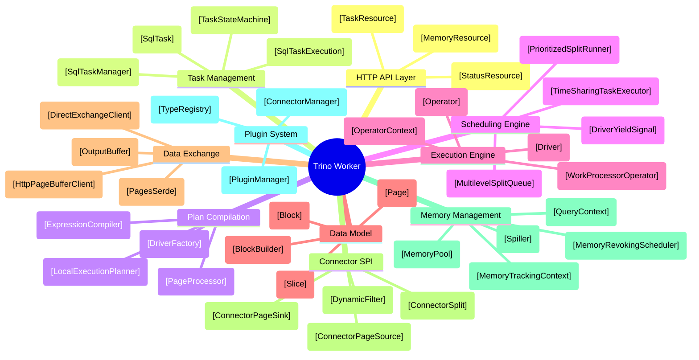

# Trino 480 Worker Module Map

## Mind Map

Modules are plain text, classes are wrapped in `[brackets]`.



---

## Detailed Module Breakdown

Base path: `trino-by-rust/trino/`
- `core/trino-main/src/main/java/io/trino/` → abbreviated as `c.t.`
- `core/trino-spi/src/main/java/io/trino/spi/` → abbreviated as `spi.`
- `lib/trino-memory-context/src/main/java/io/trino/memory/context/` → abbreviated as `lib.mem.`
- `io.airlift.slice` → external airlift library (v2.3)

### 1. HTTP API Layer
The worker's external surface. All coordinator communication enters here via JAX-RS REST endpoints.

| Class | Path | Role |
|-------|------|------|
| `TaskResource` | `c.t.server.TaskResource` | `POST /v1/task/{taskId}` (create/update), `GET .../results/{bufferId}/{token}` (data pull), `DELETE /v1/task/{taskId}` (abort) |
| `StatusResource` | `c.t.server.TaskResource` (same class, separate endpoints) | `GET /v1/task/{taskId}/status` — long-polling with version-based change detection |
| `MemoryResource` | `c.t.server.MemoryResource` | `GET /v1/memory` — returns `MemoryInfo` snapshot for coordinator aggregation |
| `ThreadResource` | `c.t.server.ThreadResource` | `GET /v1/thread` — thread dump for diagnostics |
| `ServerConfig` | `c.t.server.ServerConfig` | Determines if this node is coordinator, worker, or both |

### 2. Task Management
Lifecycle of tasks on the worker. Bridges REST requests to the execution engine.

| Class | Path | Role |
|-------|------|------|
| `SqlTaskManager` | `c.t.execution.SqlTaskManager` | Task registry. Creates/caches `SqlTask` and `QueryContext` instances. Entry point for `updateTask()` from REST. |
| `SqlTask` | `c.t.execution.SqlTask` | Wrapper for a single task. Holds `TaskHolder`, `LazyOutputBuffer`, `TaskStateMachine`. |
| `TaskHolder` | `c.t.execution.SqlTask.TaskHolder` | Inner class. Three-phase union: factory inputs → live `SqlTaskExecution` → terminal `TaskInfo`. |
| `SqlTaskExecution` | `c.t.execution.SqlTaskExecution` | Compiles plan via `LocalExecutionPlanner`, creates `DriverFactory` instances, routes splits to drivers. |
| `TaskStateMachine` | `c.t.execution.TaskStateMachine` | 10 states with two-phase termination. `PLANNED → RUNNING → FLUSHING → FINISHED` (happy path). |
| `TaskContext` | `c.t.operator.TaskContext` | Per-task resource context. Creates `PipelineContext` children. Bridges to `QueryContext` for memory. |
| `TaskUpdateRequest` | `c.t.server.TaskUpdateRequest` | JSON DTO: carries plan fragment, splits, output buffers, and dynamic filter domains from coordinator. |

### 3. Plan Compilation
Translates a plan fragment into executable operator pipelines. Glue between the distributed plan and local execution.

| Class | Path | Role |
|-------|------|------|
| `LocalExecutionPlanner` | `c.t.sql.planner.LocalExecutionPlanner` | Walks `PlanNode` tree → `LocalExecutionPlan` (list of `DriverFactory`). Each plan node maps to `OperatorFactory`(s). Handles pipeline boundary splits (e.g., hash join → build + probe). |
| `LocalExecutionPlan` | `c.t.sql.planner.LocalExecutionPlanner.LocalExecutionPlan` | Compiled result: `DriverFactory[]` + partition-to-driver mapping. |
| `DriverFactory` | `c.t.operator.DriverFactory` | Blueprint for `Driver` creation. Holds `OperatorFactory` list in pipeline order. Creates drivers on demand. |
| `OperatorFactory` | `c.t.operator.OperatorFactory` | Interface: `createOperator(DriverContext)` → `Operator`. One factory per plan node per pipeline. |
| `ExpressionCompiler` | `c.t.sql.gen.ExpressionCompiler` | Orchestrates bytecode generation for filter/projection expressions. |
| `PageFunctionCompiler` | `c.t.sql.gen.PageFunctionCompiler` | Generates JVM bytecode for `PageProjection` and `PageFilter` via airlift bytecode library. Row-at-a-time path. |
| `ColumnarFilterCompiler` | `c.t.sql.gen.columnar.ColumnarFilterCompiler` | Generates columnar filter evaluators that process entire columns at once. |
| `PageProcessor` | `c.t.operator.project.PageProcessor` | Compiled artifact: filter + projection list. Applied by `ScanFilterAndProjectOperator` with adaptive batching and yield. |

### 4. Scheduling Engine
Manages the fixed-size thread pool and decides which driver runs next.

| Class | Path | Role |
|-------|------|------|
| `TimeSharingTaskExecutor` | `c.t.execution.executor.timesharing.TimeSharingTaskExecutor` | Main thread pool (`2 × CPU cores`). Pulls highest-priority split from queue, calls `driver.processFor(1s)`, re-enqueues/parks/cleans up. |
| `MultilevelSplitQueue` | `c.t.execution.executor.timesharing.MultilevelSplitQueue` | 5-level feedback queue (0–1s, 1–10s, 10–60s, 1–5min, 5min+). Level 0 gets 16× CPU share of Level 4. |
| `PrioritizedSplitRunner` | `c.t.execution.executor.timesharing.PrioritizedSplitRunner` | Wraps `DriverSplitRunner` with scheduling metadata: accumulated CPU time, priority level, timestamp. |
| `DriverSplitRunner` | `c.t.execution.SqlTaskExecution.DriverSplitRunner` | Inner class. Bridges `Driver.processFor()` to executor. Lazy driver creation on first call. |
| `SplitConcurrencyController` | `c.t.execution.executor.timesharing.SplitConcurrencyController` | Dynamically adjusts concurrent driver count per pipeline based on throughput. |
| `DriverYieldSignal` | `c.t.operator.DriverYieldSignal` | Shared flag. Set by executor when quantum expires. Operators cooperatively check during long operations. |
| `TaskHandle` | `c.t.execution.executor.timesharing.TaskHandle` | Per-task metadata in the executor: tracks all split runners, concurrency limits, resource group. |

### 5. Execution Engine
The actual computation. Drivers shuttle Pages through Operator chains.

| Class | Path | Role |
|-------|------|------|
| `Driver` | `c.t.operator.Driver` | Execution unit. Single-threaded cooperative yield loop (`processInternal()`). Moves Pages between operators, checks blocked futures, respects yield signal. Never blocks a thread. |
| `DriverContext` | `c.t.operator.DriverContext` | Per-driver stats and memory tracking. Parent of `OperatorContext` instances. |
| `PipelineContext` | `c.t.operator.PipelineContext` | Per-pipeline context. Creates `DriverContext` children. Aggregates stats. |
| `Operator` | `c.t.operator.Operator` | Interface. Non-blocking Volcano contract: `needsInput()`, `addInput(Page)`, `getOutput()`, `isFinished()`, `isBlocked()`. |
| `SourceOperator` | `c.t.operator.SourceOperator` | Sub-interface for pipeline-start operators. No `addInput()`. Receives splits via `addSplit()`. |
| `WorkProcessorOperator` | `c.t.operator.WorkProcessorOperator` | Pull-based alternative. Internal `WorkProcessor<Page>` stream. |
| `WorkProcessorOperatorAdapter` | `c.t.operator.WorkProcessorOperatorAdapter` | Bridges `WorkProcessorOperator` to the push-pull `Operator` interface for the Driver. |
| `OperatorContext` | `c.t.operator.OperatorContext` | Per-operator resource tracking: CPU time, wall time, memory (user + revocable), peak tracking, revocation flag. |
| **54 concrete operators** | `c.t.operator.*` | See Task 3.1.C catalog. 10 categories. Only 4 support spilling: `HashAggregationOperator`, `OrderByOperator`, `WindowOperator`, `spilling.HashBuilderOperator`. |

### 6. Data Model
In-memory columnar representation. Passive data — no compute logic.

| Class | Path | Role |
|-------|------|------|
| `Slice` | `io.airlift.slice.Slice` | Byte substrate. Bounded view over heap `byte[]` with typed little-endian access via VarHandle. Zero-copy `slice()`. |
| `Slices` | `io.airlift.slice.Slices` | Factory: `allocate()`, `wrappedBuffer()`, `ensureSize()` (growth: 2× below 512KB, 1.25× above). |
| `Block` | `spi.block.Block` | Sealed interface. Three permitted: `ValueBlock`, `DictionaryBlock`, `RunLengthEncodedBlock`. |
| `ValueBlock` | `spi.block.ValueBlock` | Non-sealed sub-interface. 11 concrete implementations (one per physical type). |
| `LongArrayBlock` | `spi.block.LongArrayBlock` | BIGINT/TIMESTAMP. Fields: `long[] values`, `boolean[] valueIsNull`, `int arrayOffset`. |
| `VariableWidthBlock` | `spi.block.VariableWidthBlock` | VARCHAR/VARBINARY. Fields: `Slice slice`, `int[] offsets`, `boolean[] valueIsNull`, `int arrayOffset`. |
| `DictionaryBlock` | `spi.block.DictionaryBlock` | Index indirection: `int[] ids` → `ValueBlock dictionary`. Zero-copy projection. |
| `RunLengthEncodedBlock` | `spi.block.RunLengthEncodedBlock` | Single `ValueBlock value` × `int positionCount`. Constant memory. |
| `Page` | `spi.Page` | Passive envelope: `Block[] blocks` + `int positionCount`. Zero-copy transforms: `getColumns()`, `prependColumn()`, `getRegion()`. |
| `BlockBuilder` | `spi.block.BlockBuilder` | Interface. Mutable append-only builder. `build()` freezes into immutable `Block`. |
| `PageBuilder` | `spi.PageBuilder` | Page-level builder. Wraps `BlockBuilder[]`. Tracks size via `PageBuilderStatus` (1MB limit). |
| `PageBuilderStatus` | `spi.block.PageBuilderStatus` | Back-pressure: `isFull()` triggers page emit when accumulated size exceeds 1MB. |

### 7. Data Exchange
Inter-worker shuffle and result delivery.

| Class | Path | Role |
|-------|------|------|
| **Producer side** | | |
| `OutputBuffer` | `c.t.execution.buffer.OutputBuffer` | Interface for outgoing page buffers. |
| `PartitionedOutputBuffer` | `c.t.execution.buffer.PartitionedOutputBuffer` | Hash-partitioned buffer. Per-partition `ClientBuffer`. |
| `BroadcastOutputBuffer` | `c.t.execution.buffer.BroadcastOutputBuffer` | Replicates every page to all consumers. |
| `ArbitraryOutputBuffer` | `c.t.execution.buffer.ArbitraryOutputBuffer` | Round-robin via `MasterBuffer`. |
| `LazyOutputBuffer` | `c.t.execution.buffer.LazyOutputBuffer` | Proxy. Defers real buffer creation until `OutputBuffers` config arrives. |
| `ClientBuffer` | `c.t.execution.buffer.ClientBuffer` | Per-consumer FIFO. Sequence-token-based acknowledgment. Long-polling via `SettableFuture`. |
| `OutputBufferMemoryManager` | `c.t.execution.buffer.OutputBufferMemoryManager` | Back-pressure: blocks drivers via `SettableFuture` when buffer exceeds memory limit. |
| `CompressingEncryptingPageSerializer` | `c.t.execution.buffer.CompressingEncryptingPageSerializer` | Serialization: 12-byte header + per-block LZ4/ZSTD + optional AES-CBC. |
| `PagesSerdeFactory` | `c.t.execution.buffer.PagesSerdeFactory` | Creates serializer/deserializer with compression codec and encryption key. |
| `PartitionedOutputOperator` | `c.t.operator.output.PartitionedOutputOperator` | Operator: hashes rows via `PagePartitioner`, enqueues into partition buffers. |
| `TaskOutputOperator` | `c.t.operator.output.TaskOutputOperator` | Operator: unpartitioned output (broadcast/arbitrary). |
| **Consumer side** | | |
| `ExchangeOperator` | `c.t.operator.exchange.ExchangeOperator` | Source operator. Polls `ExchangeDataSource` for serialized pages, deserializes. |
| `DirectExchangeClient` | `c.t.operator.DirectExchangeClient` | Manages N `HttpPageBufferClient` instances. Capacity-based dispatch. |
| `HttpPageBufferClient` | `c.t.operator.HttpPageBufferClient` | Per-upstream HTTP client. Token-based idempotent protocol, eager ack, exponential backoff. |
| `StreamingDirectExchangeBuffer` | `c.t.operator.StreamingDirectExchangeBuffer` | In-memory FIFO of received serialized pages with capacity-based back-pressure. |

### 8. Connector Interface (Storage SPI)
The boundary between the engine and external data sources/sinks.

| Class | Path | Role |
|-------|------|------|
| **Read path** | | |
| `ConnectorPageSource` | `spi.connector.ConnectorPageSource` | SPI interface: `getNextSourcePage()`, `isFinished()`, `isBlocked()`. One per split. |
| `ConnectorPageSourceProvider` | `spi.connector.ConnectorPageSourceProvider` | SPI factory: `createPageSource(split, table, columns, dynamicFilter)`. |
| `SourcePage` | `spi.connector.SourcePage` | Wrapper returned by page sources. Supports lazy block loading. |
| `PageSourceManager` | `c.t.split.PageSourceManager` | Engine-side bridge: routes `CatalogHandle` → `ConnectorPageSourceProvider`. |
| `DynamicFilter` | `spi.connector.DynamicFilter` | Runtime predicate narrowing over query lifetime. Passed to connector at source creation. |
| `DynamicFilterService` | `c.t.server.DynamicFilterService` | Coordinator-side: aggregates filter domains from build-side workers, distributes to scan-side. |
| `LocalDynamicFilterConsumer` | `c.t.sql.planner.LocalDynamicFilterConsumer` | Task-local: delivers domain directly via in-memory futures (intra-stage, no REST). |
| **Write path** | | |
| `ConnectorPageSink` | `spi.connector.ConnectorPageSink` | SPI interface: `appendPage()`, `finish()` → fragment `Slice`s, `abort()`. |
| `ConnectorPageSinkProvider` | `spi.connector.ConnectorPageSinkProvider` | SPI factory: creates sinks for CTAS, INSERT, MERGE. |
| `PageSinkManager` | `c.t.split.PageSinkManager` | Engine-side bridge: routes to correct connector. |
| `TableWriterOperator` | `c.t.operator.TableWriterOperator` | Pushes pages into `ConnectorPageSink`. On finish, emits fragment descriptors. |
| `TableFinishOperator` | `c.t.operator.TableFinishOperator` | Coordinator-side: collects fragments, calls `finishCreateTable()`/`finishInsert()` for atomic commit. |
| **Common** | | |
| `ConnectorSplit` | `spi.connector.ConnectorSplit` | Opaque handle: file, byte range, partition shard. |
| `ConnectorTableHandle` | `spi.connector.ConnectorTableHandle` | Carries pushed-down predicates from planning. |
| `ConnectorMetadata` | `spi.connector.ConnectorMetadata` | Metadata SPI: table listing, column info, begin/finish write transactions. |

### 9. Memory Management
Hierarchical tracking, flow control, spilling, and cluster-level arbitration.

| Class | Path | Role |
|-------|------|------|
| **Pool** | | |
| `MemoryPool` | `c.t.memory.MemoryPool` | Single per-node. `ConcurrentHashMap` per-query tracking. Returns `NonCancellableMemoryFuture` when exhausted. |
| `LocalMemoryManager` | `c.t.memory.LocalMemoryManager` | Creates pool at startup. Size = JVM max heap − 30% headroom. |
| `NodeMemoryConfig` | `c.t.memory.NodeMemoryConfig` | Config: `query.max-memory-per-node`, `memory.heap-headroom-per-node`. |
| **Tracking tree** | | |
| `QueryContext` | `c.t.memory.QueryContext` | Per-query isolation. Enforces `maxUserMemory`. Creates `MemoryTrackingContext` sub-trees per task. |
| `MemoryTrackingContext` | `lib.mem.MemoryTrackingContext` | Composite: user + revocable `AggregatedMemoryContext` pairs. Factory for child contexts. |
| `RootAggregatedMemoryContext` | `lib.mem.RootAggregatedMemoryContext` | Tree root. Bridges to pool via `MemoryReservationHandler`. |
| `ChildAggregatedMemoryContext` | `lib.mem.ChildAggregatedMemoryContext` | Intermediate node. Delegates delta to parent, then records locally. |
| `SimpleLocalMemoryContext` | `lib.mem.SimpleLocalMemoryContext` | Leaf node. `setBytes()`/`addBytes()` compute delta, propagate up with allocation tag. |
| `CoarseGrainLocalMemoryContext` | `lib.mem.CoarseGrainLocalMemoryContext` | Decorator: 64KB batching (~1000× fewer pool interactions). |
| `MemoryReservationHandler` | `lib.mem.MemoryReservationHandler` | Bridge interface: `reserveMemory(tag, delta)` → `QueryContext.updateUserMemory()`. |
| **Spilling** | | |
| `MemoryRevokingScheduler` | `c.t.execution.MemoryRevokingScheduler` | Monitors pool (90% threshold). Traverses task tree, requests revocation on operators. Dual trigger: 1s timer + pool listener. |
| `VoidTraversingQueryContextVisitor` | `c.t.memory.VoidTraversingQueryContextVisitor` | Visitor that walks Task → Pipeline → Driver → Operator for revocation traversal. |
| `Spiller` | `c.t.spiller.Spiller` | Interface: multi-stream spill. |
| `GenericSpiller` | `c.t.spiller.GenericSpiller` | Creates one `SingleStreamSpiller` per spill call. |
| `FileSingleStreamSpiller` | `c.t.spiller.FileSingleStreamSpiller` | Writes serialized pages to temp files. Optional LZ4/ZSTD + AES encryption. |
| `SpillSpaceTracker` | `c.t.spiller.SpillSpaceTracker` | Global per-node spill disk quota. |

### 10. Plugin System
Extensibility: loading connectors, types, and functions at startup.

| Class | Path | Role |
|-------|------|------|
| `PluginManager` | `c.t.server.PluginManager` | Discovers/loads SPI plugins via `ServiceLoader` with isolated classloaders. |
| `ConnectorManager` | `c.t.connector.ConnectorManager` | Manages connector lifecycle: create, configure, shutdown. |
| `CatalogManager` | `c.t.metadata.CatalogManager` | Interface. Catalog registry (static + dynamic catalogs). |
| `TypeRegistry` | `c.t.metadata.TypeRegistry` | Maps type signatures → `Type` implementations. Resolves type operators and `BlockEncoding`. |
| `FunctionManager` | `c.t.metadata.FunctionManager` | Function resolution and binding for built-in and plugin-provided functions. |

---

## Data Flow: How Modules Connect

```
                          ┌─────────────────────────────────────────────────────────────┐
                          │                    COORDINATOR                              │
                          │  TaskUpdateRequest(plan, splits)    GET /status (long-poll) │
                          │  GET /results/{bufferId}/{token}    GET /memory             │
                          └──────────┬──────────────────────────────────┬───────────────┘
                                     │ REST/JSON                        │
                          ┌──────────▼──────────────────────────────────▼───────────────┐
                          │                  [HTTP API Layer]                           │
                          │  TaskResource    StatusResource    MemoryResource            │
                          └──────────┬──────────────────────────────────────────────────┘
                                     │
                          ┌──────────▼──────────────────────────────────────────────────┐
                          │                [Task Management]                            │
                          │  SqlTaskManager → SqlTask → SqlTaskExecution                │
                          │                              │                              │
                          │                    TaskStateMachine                         │
                          └──────────┬───────────────────┼──────────────────────────────┘
                                     │                   │ plan fragment
                          ┌──────────▼───────┐ ┌────────▼──────────────────────────────┐
                          │   SPLIT ROUTING  │ │       [Plan Compilation]              │
                          │  addSplits() →   │ │  LocalExecutionPlanner                │
                          │  schedule to     │ │  PlanNode → DriverFactory[]           │
                          │  correct driver  │ │  ExpressionCompiler → PageProcessor   │
                          └──────────┬───────┘ └────────┬──────────────────────────────┘
                                     │                   │ DriverFactory[]
                          ┌──────────▼───────────────────▼──────────────────────────────┐
                          │               [Scheduling Engine]                            │
                          │  TimeSharingTaskExecutor (2×CPU runner threads)              │
                          │  MultilevelSplitQueue (5 priority levels)                   │
                          │  PrioritizedSplitRunner → driver.processFor(1s)             │
                          └──────────┬──────────────────────────────────────────────────┘
                                     │ 1-second quanta
                          ┌──────────▼──────────────────────────────────────────────────┐
                          │               [Execution Engine]                             │
                          │  Driver (cooperative yield loop)                             │
                          │  ┌──────────┐   ┌──────────┐   ┌──────────┐                │
                          │  │ Source   │──▶│Transform │──▶│  Sink    │                │
                          │  │ Operator │   │ Operator │   │ Operator │                │
                          │  └────┬─────┘   └──────────┘   └────┬─────┘                │
                          │       │              ▲               │                      │
                          │       │        Page (Block[])        │                      │
                          └───────┼──────────────────────────────┼──────────────────────┘
                                  │                              │
                    ┌─────────────▼────────┐          ┌─────────▼─────────────┐
                    │   [Connector SPI]    │          │   [Data Exchange]     │
                    │  ConnectorPageSource  │          │  OutputBuffer         │
                    │  ConnectorPageSink    │          │  PagesSerde           │
                    │  DynamicFilter        │          │  DirectExchangeClient │
                    │         │             │          │         │             │
                    └─────────┼─────────────┘          └─────────┼─────────────┘
                              │                                  │
                     ┌────────▼────────┐              ┌─────────▼─────────┐
                     │  Object Store   │              │  Other Workers /  │
                     │  (S3/HDFS)      │              │  Coordinator      │
                     └─────────────────┘              └───────────────────┘

  CROSS-CUTTING:
  ┌─────────────────────────────────────────────────────────────────────────┐
  │  [Memory Management]                                                   │
  │  MemoryPool ← QueryContext ← TaskCtx ← PipelineCtx ← DriverCtx ←    │
  │  OperatorCtx.setBytes() → block/yield/exception                       │
  │  MemoryRevokingScheduler → Operator.startMemoryRevoke() → Spiller     │
  └─────────────────────────────────────────────────────────────────────────┘
  ┌─────────────────────────────────────────────────────────────────────────┐
  │  [Data Model] (passive, used everywhere)                               │
  │  Slice → Block (ValueBlock | DictionaryBlock | RLE) → Page            │
  └─────────────────────────────────────────────────────────────────────────┘
```

### Request Lifecycle (end-to-end)

1. **Coordinator** POSTs `TaskUpdateRequest` (plan fragment + initial splits) to `TaskResource`
2. **SqlTaskManager** creates `SqlTask` + `QueryContext` (or reuses cached)
3. **SqlTask** creates `SqlTaskExecution`, which calls `LocalExecutionPlanner.plan()` to compile `PlanNode` tree into `DriverFactory[]`
4. **Expression compilation** generates bytecode for filters/projections → `PageProcessor` artifacts
5. **SqlTaskExecution** creates `Driver` instances from factories, wraps them in `PrioritizedSplitRunner`, enqueues into `TimeSharingTaskExecutor`
6. **Runner thread** dequeues highest-priority split, calls `driver.processFor(1 second)`
7. **Driver** enters cooperative loop: shuttles `Page` objects between `Operator` chain
8. **Source operators** pull Pages from `ConnectorPageSource` (storage read) or `ExchangeOperator` (upstream shuffle)
9. **Transform operators** process Pages: filter, project, join, aggregate, sort, window
10. **Sink operators** push Pages into `OutputBuffer` (for downstream shuffle) or `ConnectorPageSink` (storage write)
11. Each **Operator** reports memory via `OperatorContext.setBytes()` → propagates up tracking tree → `MemoryPool`
12. If pool exhausted → operator blocks via `ListenableFuture` → driver yields → scheduler parks the split
13. If pool >90% full → `MemoryRevokingScheduler` triggers spilling → operators serialize state to disk → memory freed → blocked operators resume
14. **Downstream workers** (or coordinator) pull results via `GET /v1/task/{taskId}/results/{bufferId}/{token}` — token-based idempotent pull
15. When all drivers finish → `TaskStateMachine` transitions `RUNNING → FLUSHING → FINISHED`
16. Cleanup propagates bottom-up: Operator → Driver → Pipeline → Task → QueryContext → MemoryPool
