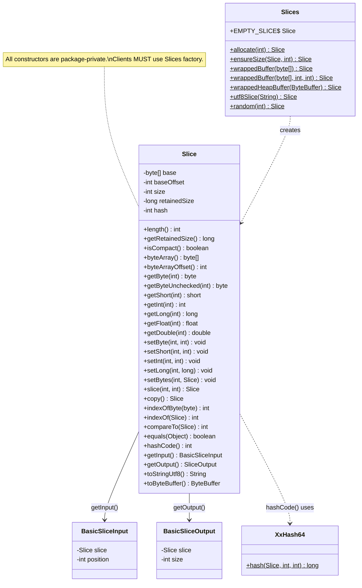
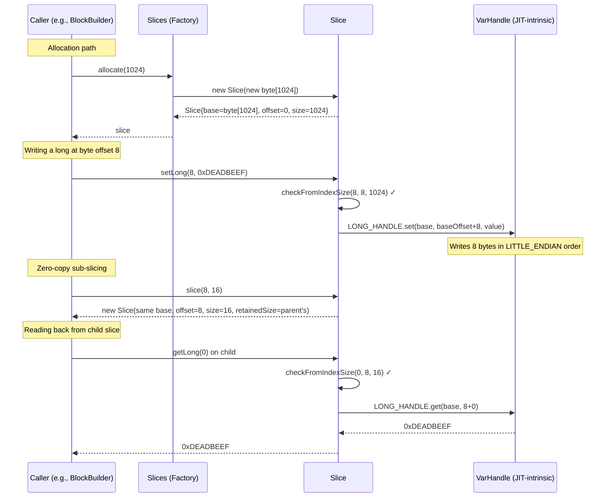
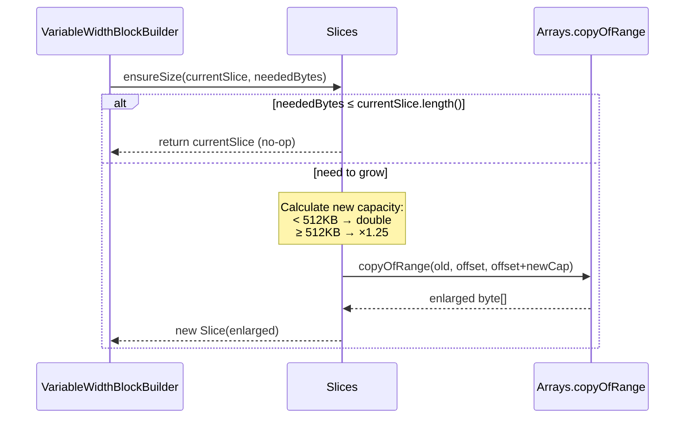

# Module Teardown: The `Slice` Memory Wrapper (Task 1.1.A)

## 1. High-Level Overview
* **Core Responsibility:** `Slice` is Trino's foundational memory abstraction — a bounded view over a heap `byte[]` array that provides typed, little-endian read/write access to raw bytes. It serves as the universal byte-buffer primitive that underpins all columnar data storage in Trino's SPI (the `Block` layer stores VARCHAR data, byte arrays, and serialized values in `Slice` instances). The companion `Slices` class is a factory for creating, wrapping, and resizing `Slice` instances.
* **Key Triggers:** `Slice` is a passive data structure — it does not act on its own. It is created whenever Trino needs to hold variable-length binary data: when a connector reads raw column bytes, when a `VariableWidthBlockBuilder` accumulates VARCHAR values, when data is serialized for network exchange, or when hash tables need to compare keys.

## 2. Structural Architecture
* **Primary Source Files:**
  - `io.airlift.slice.Slice` (1525 lines) — the core memory wrapper (external airlift library, BOM v420)
  - `io.airlift.slice.Slices` — factory methods for allocation and wrapping
  - `io.airlift.slice.SizeOf` — memory size constants and `instanceSize()` calculation
  - `io.airlift.slice.XxHash64` — hash implementation used by `Slice.hashCode()`
  - `io.airlift.slice.BasicSliceInput` / `BasicSliceOutput` — streaming I/O adapters

* **Key Data Structures:**

| Field | Type | Purpose |
|-------|------|---------|
| `base` | `byte[]` | The actual heap memory backing the slice |
| `baseOffset` | `int` | Start position within `base` (enables zero-copy sub-slicing) |
| `size` | `int` | Logical length of this slice's view |
| `retainedSize` | `long` | Total bytes retained for memory accounting (includes object overhead + full array size) |
| `hash` | `int` | Lazily-computed, cached XxHash64 value |

Static VarHandles (for typed access):
| Handle | Byte Order | Purpose |
|--------|-----------|---------|
| `SHORT_HANDLE` | Little-endian | Read/write `short` at arbitrary byte offset |
| `INT_HANDLE` | Little-endian | Read/write `int` at arbitrary byte offset |
| `LONG_HANDLE` | Little-endian | Read/write `long` at arbitrary byte offset |
| `FLOAT_HANDLE` | Little-endian | Read/write `float` at arbitrary byte offset |
| `DOUBLE_HANDLE` | Little-endian | Read/write `double` at arbitrary byte offset |

### Class Diagram

## 3. Execution & Call Flow

### Sequence Diagram: Creating and Reading Typed Data

### Sequence Diagram: Growth via `ensureSize`

* **Step-by-step text breakdown:**
  1. **Construction**: All `Slice` constructors are package-private. External code uses `Slices.allocate()` (new zeroed array), `Slices.wrappedBuffer()` (zero-copy wrap of existing `byte[]`), or `Slices.utf8Slice()` (encode string).
  2. **Typed Access**: Methods like `getInt(index)` first bounds-check via `checkFromIndexSize(index, SIZE_OF_INT, length())`, then delegate to `getIntUnchecked(index)` which uses `INT_HANDLE.get(base, baseOffset + index)`. The VarHandle reads 4 bytes in little-endian order, regardless of platform endianness. The JIT compiles this to a single MOV instruction on x86.
  3. **Unchecked Hot Path**: Package-private `*Unchecked` variants skip bounds checking entirely. Internal airlift code and Trino's block implementations use these on pre-validated indices for maximum throughput.
  4. **Zero-Copy Slicing**: `slice(index, length)` returns a new `Slice` object pointing to the *same* `base` array with adjusted `baseOffset` and `size`. The `retainedSize` is inherited from the parent — meaning the child correctly reports that it retains the entire backing array (important for memory tracking).
  5. **Deep Copy**: `copy()` calls `Arrays.copyOfRange()` to create a fully independent `Slice`. Used when data must be detached from a shared buffer.
  6. **Growth Strategy** (in `Slices.ensureSize`): Below 512KB threshold, capacity doubles. Above 512KB, it grows by 1.25×. Uses `Arrays.copyOfRange` instead of allocate-then-copy because `copyOfRange` avoids zeroing the new memory first (JVM optimization).
  7. **Hashing**: `hashCode()` lazily computes XxHash64 over the slice's content range and caches the result. XxHash64 provides superior distribution compared to Java's default hash for use in hash tables and dictionary encoding.
  8. **Search**: `indexOfByte(byte)` uses SWAR (SIMD Within A Register) — packs the search byte into all 8 positions of a `long`, XORs against 8 bytes at a time, then uses the classic zero-byte detection bit trick `(xor - 0x01010101_01010101L) & ~xor & 0x80808080_80808080L` to find matches. This processes 8 bytes per iteration instead of 1.

## 4. Concurrency & State Management
* **Threading Model:** `Slice` is a passive value object with no thread affinity. It is not tied to any specific thread, driver loop, or executor. Any thread can read from or write to a Slice.
* **State Machine:** None. `Slice` is structurally immutable (all fields are `final`). The underlying `byte[]` content is mutable, but the slice's bounds never change after construction.
* **Synchronization:** None whatsoever — no locks, no `volatile`, no `synchronized` blocks. Notably:
  - The `hash` field is not `volatile`. In a race, two threads may both compute the hash. This is safe because XxHash64 is deterministic (both compute the same value), and `int` writes are atomic on the JVM. This is a deliberate "benign race" pattern.
  - Thread safety for the *contents* of the backing `byte[]` is the caller's responsibility. In Trino's execution model, this is safe because the Driver loop processes data in a single thread per pipeline, and Slices are typically not shared across drivers once constructed.

## 5. Memory & Resource Profile
* **Allocation Pattern:**
  - **Heap-only**: Modern airlift `Slice` wraps ONLY `byte[]` arrays (heap memory). The historical `sun.misc.Unsafe` off-heap path has been removed. The current implementation uses `java.lang.invoke.VarHandle` and `java.lang.foreign.MemorySegment` (Panama API) instead.
  - **No direct/off-heap ByteBuffers**: Despite supporting `toByteBuffer()` for interop, the backing store is always a Java heap array.
  - **Zero-copy where possible**: `wrappedBuffer()` avoids copies; `slice()` shares the backing array.
  - **Copy-on-grow**: `ensureSize()` copies old data into a new, larger array. Below 512KB, capacity doubles; above 512KB, it grows by 25%.

* **Memory Tracking:**
  - `retainedSize` = `INSTANCE_SIZE` (object header + field overhead, via `SizeOf.instanceSize()`) + `SizeOf.sizeOf(base)` (full backing array size including Java array overhead).
  - When `slice()` creates a sub-view, the child inherits the parent's `retainedSize`. This is intentional — the child retains a reference to the full backing array, so it must report the full array's memory cost. This prevents under-reporting in Trino's memory accounting hierarchy.
  - `isCompact()` returns `true` only when `baseOffset == 0 && size == base.length`, meaning no wasted space from sub-slicing. Trino uses this to decide whether to compact data during serialization.
  - There is **no** direct integration with Trino's `LocalMemoryContext` or `MemoryPool` — Slice is a lower-level primitive. Memory reporting flows upward through the Block layer: `VariableWidthBlock.getRetainedSizeInBytes()` calls `slice.getRetainedSize()`, and the Block's enclosing Operator reports to its `OperatorContext`.

## 6. Porting Considerations (Java → Target Architecture)

* **Translation Blockers:**
  - **VarHandle JIT optimization**: Java's VarHandle calls compile to single machine instructions (e.g., `MOV` on x86). The Rust equivalent (`from_le_bytes` / `to_le_bytes` + `copy_from_slice`) should achieve parity, but the specific JVM optimization of proving bounds checks can be elided has no direct analogue — Rust achieves this differently via its borrow checker and `unsafe` blocks.
  - **GC-managed backing array**: Java's GC handles the lifecycle of the `byte[]` backing store. Multiple `Slice` views can share one array; the GC collects it when all references are dropped. In Rust, this requires explicit shared ownership (e.g., `Arc<Vec<u8>>` or `bytes::Bytes`).
  - **Benign hash race**: The `hash` field exploit of JVM `int` write atomicity has no Rust equivalent — Rust would need `AtomicU32` or a `OnceCell`/`OnceLock` for lazy initialization.
  - **MemorySegment bulk copies**: The `java.lang.foreign.MemorySegment` API for bulk typed array copies (lines 501-502, 550-551) is JDK-specific. Rust handles this natively with slice operations.

* **Recommended Abstractions:**

  | Java Concept | Rust Equivalent | Notes |
  |---|---|---|
  | `Slice` (owned, full array) | `bytes::Bytes` or `Vec<u8>` | `Bytes` provides zero-copy slicing with reference counting |
  | `Slice` (sub-view via `slice()`) | `bytes::Bytes::slice()` or `&[u8]` | `Bytes::slice()` preserves shared ownership; `&[u8]` for borrowed views |
  | `retainedSize` tracking | Custom wrapper with `size_of_val()` + explicit tracking | Rust has no equivalent to Java's `SizeOf.instanceSize()`; track allocations manually or use a custom allocator |
  | `VarHandle` typed reads | `byteorder` crate or `{i32,i64,f64}::from_le_bytes()` | Native Rust; zero-cost abstraction |
  | `Slices.ensureSize()` growth | `Vec::reserve()` with custom growth policy | Vec's default doubling is close but lacks the 1.25× large-buffer strategy |
  | `XxHash64` hashing | `xxhash-rust` crate (`xxh64`) | Identical algorithm |
  | `indexOfByte` SWAR search | `memchr` crate | Even faster — uses actual SIMD (SSE2/AVX2) instead of SWAR |
  | `isCompact()` check | `bytes::Bytes` — always compact after `copy_from_slice()` | Or track explicitly with offset/length metadata |
  | `BasicSliceInput` / `BasicSliceOutput` | `std::io::Cursor<Bytes>` | Standard library provides equivalent cursor-based I/O |

  **Architectural recommendation**: Use `bytes::Bytes` as the primary Rust equivalent. It provides:
  - Zero-copy slicing via reference-counted shared ownership (replaces Java's GC-based sharing)
  - `bytes::Buf` / `bytes::BufMut` traits for typed read/write (replaces VarHandle)
  - Cheap cloning (Arc increment, not data copy)
  - The `BytesMut` variant for the build phase, frozen into `Bytes` for the read phase (natural fit for Trino's block-building → block-reading lifecycle)
