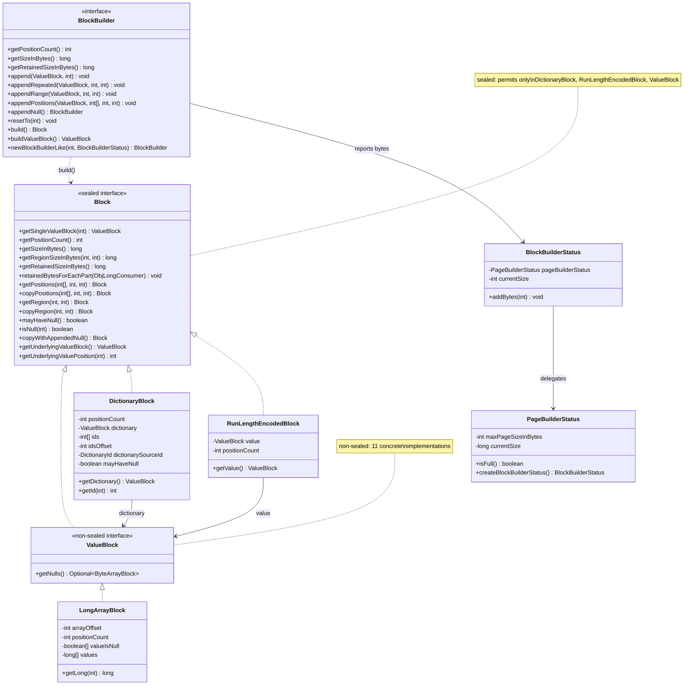
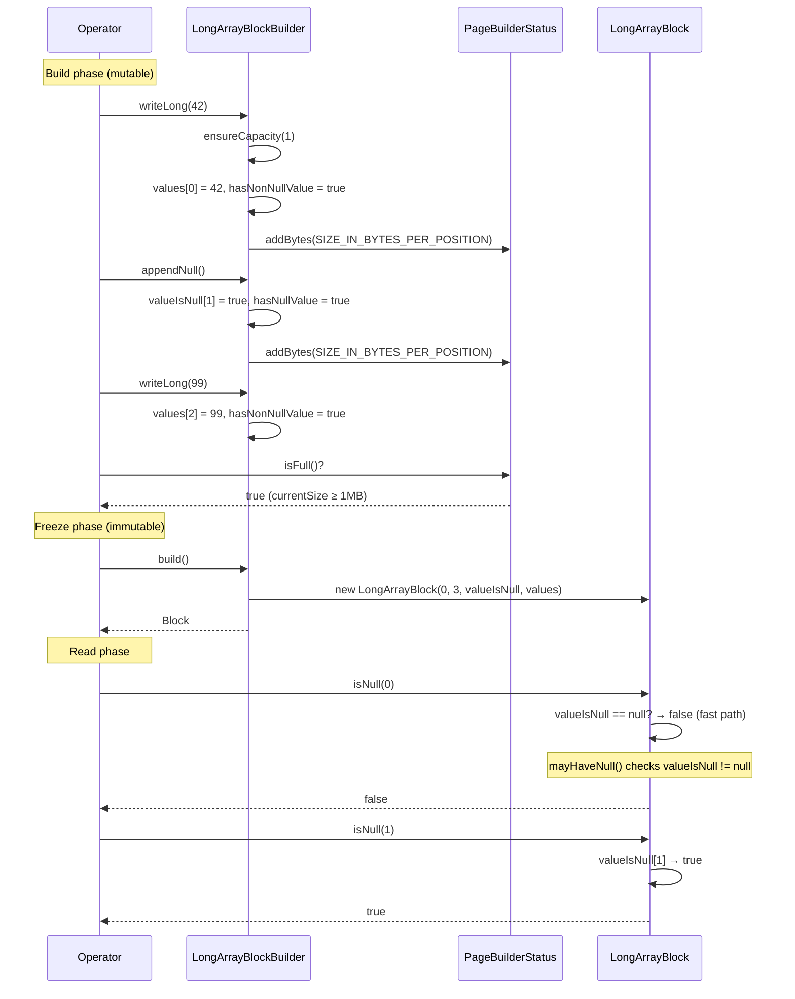
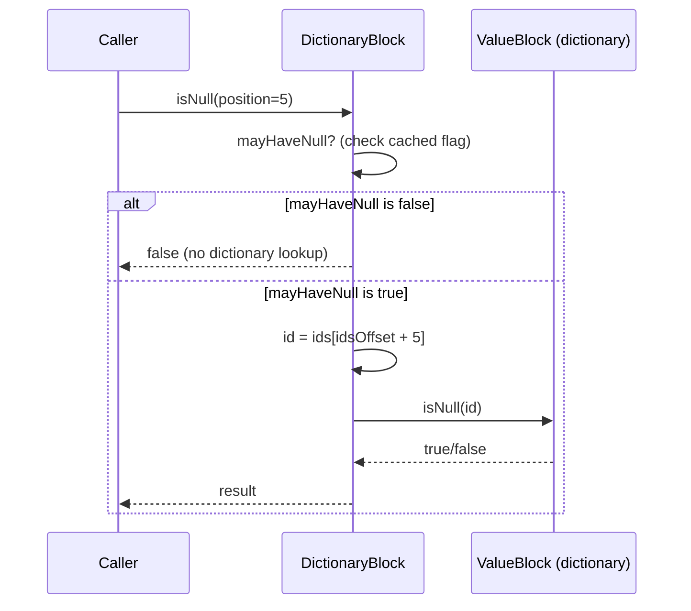

# Module Teardown: The `Block` & `BlockBuilder` Interfaces (Task 1.1.B)

## 0. Research Focus
* **Task ID:** 1.1.B
* **Focus:** Analyze the contract for columnar data. How are nulls (validity bitmaps) conceptually represented at this interface level?

## 1. High-Level Overview
* **Core Responsibility:** `Block` is the foundational interface for all columnar data in Trino's SPI. It represents an immutable, read-only column (or column segment) of typed values. `BlockBuilder` is its mutable counterpart — an append-only builder that accumulates values during operator execution and then freezes them into a `Block` via `build()`. Together, they define the contract that every Trino data type must implement for the execution engine to process data in a vectorized, column-at-a-time fashion.
* **Key Triggers:** `Block` instances are created by connectors (reading from storage), by `BlockBuilder.build()` (during operator processing), or by lazy transformations like `getRegion()` / `getPositions()`. `BlockBuilder` is driven by operators calling `append()` / `appendNull()` during their `addInput()` cycle.

## 2. Structural Architecture
* **Primary Source Files:**
  - `io.trino.spi.block.Block` — sealed interface (3 permitted subtypes)
  - `io.trino.spi.block.ValueBlock` — non-sealed sub-interface for concrete physical storage
  - `io.trino.spi.block.BlockBuilder` — mutable builder interface
  - `io.trino.spi.block.DictionaryBlock` — dictionary-encoded wrapper
  - `io.trino.spi.block.RunLengthEncodedBlock` — RLE wrapper
  - `io.trino.spi.block.BlockUtil` — null compaction, array growth, offset utilities
  - `io.trino.spi.block.BlockBuilderStatus` / `PageBuilderStatus` — back-pressure for page size limits

* **Key Data Structures:**

The `Block` hierarchy uses Java 17's **sealed interface** feature to enforce exactly three permitted implementations:

| Block Variant | Physical Storage | Null Representation |
|---|---|---|
| `ValueBlock` (non-sealed) | Concrete data (arrays, Slices) | `@Nullable boolean[] valueIsNull` per position |
| `DictionaryBlock` | `int[] ids` → `ValueBlock dictionary` | Delegates to `dictionary.isNull(ids[position])` |
| `RunLengthEncodedBlock` | Single `ValueBlock value`, repeated N times | `value.isNull(0)` — all positions share it |

Concrete `ValueBlock` implementations (11 total):

| Implementation | Data Type | Backing Storage |
|---|---|---|
| `ByteArrayBlock` | TINYINT, BOOLEAN | `byte[]` |
| `ShortArrayBlock` | SMALLINT | `short[]` |
| `IntArrayBlock` | INTEGER, DATE | `int[]` |
| `LongArrayBlock` | BIGINT, TIMESTAMP | `long[]` |
| `Int128ArrayBlock` | UUID, DECIMAL(>18) | `long[]` (pairs) |
| `Fixed12Block` | TIME, TIMESTAMP(>6) | `int[] + long[]` (12 bytes) |
| `VariableWidthBlock` | VARCHAR, VARBINARY | `Slice` + `int[] offsets` |
| `ArrayBlock` | ARRAY | `int[] offsets` + nested `ValueBlock` |
| `MapBlock` | MAP | `int[] offsets` + key/value `ValueBlock`s |
| `RowBlock` | ROW | child `ValueBlock[]` |
| `VariantBlock` | VARIANT | `Slice` + `int[] offsets` + metadata |

### Class Diagram

## 3. Execution & Call Flow

### Sequence Diagram: Building a Block and Reading Nulls

### Sequence Diagram: Dictionary/RLE Null Delegation

* **Step-by-step text breakdown:**
  1. **Sealed hierarchy enforces exhaustive matching**: `Block` is `sealed` permitting only `DictionaryBlock`, `RunLengthEncodedBlock`, and `ValueBlock`. Java `switch` on a `Block` instance is exhaustive without a `default` case. This is used in `BlockBuilder.appendBlockRange()` to dispatch efficiently.
  2. **Null representation is a `@Nullable boolean[]`**: Each concrete `ValueBlock` stores an optional `boolean[] valueIsNull` array (one boolean per position). When the array is `null`, the block has **no nulls at all** — this is the fast path. `mayHaveNull()` simply checks `valueIsNull != null` (O(1)), while `hasNull()` scans the array (O(N)).
  3. **`getNulls()` converts to `ByteArrayBlock`**: The `ValueBlock.getNulls()` method converts the internal `boolean[]` to a `ByteArrayBlock` (byte-per-position), returning `Optional.empty()` if no nulls exist. This provides a uniform null-vector representation for consumers. The code comment in `BlockUtil.getNulls()` explicitly notes this is a transitional representation and the internal `boolean[]` should eventually become `byte[]`.
  4. **Dictionary/RLE delegate null checks**: `DictionaryBlock.isNull(pos)` resolves `ids[pos]` and delegates to `dictionary.isNull(id)`. `RunLengthEncodedBlock.isNull(pos)` simply returns `value.isNull(0)`. Both cache a `mayHaveNull` flag to short-circuit when the underlying data has no nulls.
  5. **`getPositions()` defaults to `DictionaryBlock`**: The default `Block.getPositions()` wraps the current block in a `DictionaryBlock` using the provided positions array as the `ids`. This is the universal "projection" mechanism — instead of physically copying data, it creates an indirection layer.
  6. **`build()` may return RLE**: `LongArrayBlockBuilder.build()` checks `hasNonNullValue`. If false (all values were null), it returns a `RunLengthEncodedBlock` instead of a `LongArrayBlock`. This is an automatic compression for all-null columns.
  7. **Back-pressure via `BlockBuilderStatus`**: Each `append` / `writeLong` / `appendNull` call reports bytes to the `BlockBuilderStatus`, which propagates up to `PageBuilderStatus`. When `pageBuilderStatus.isFull()` (default 1MB threshold), the enclosing operator knows to `build()` the current page and yield it.
  8. **View vs Copy semantics**: `getRegion()` returns a view (shares underlying data — like `Slice.slice()`). `copyRegion()` returns a compact, independent copy. `copyPositions()` always copies. The choice between them depends on whether the caller will hold the result beyond the lifetime of the source.
  9. **`copyWithAppendedNull()`**: Creates a new block with one extra null position. Used to build dictionary blocks that need a null sentinel. Implementation varies by type — `LongArrayBlock` extends its arrays, `DictionaryBlock` either reuses an existing null in the dictionary or appends one.

## 4. Concurrency & State Management
* **Threading Model:** `Block` instances are immutable after construction — all fields are `final`. They are safe to share across threads without synchronization. `BlockBuilder` instances are **not thread-safe** — they are used by a single `Driver` thread in a single operator pipeline.
* **State Machine:** `BlockBuilder` has an implicit lifecycle: `(building) → build() → (frozen Block)`. The builder can be called with `build()` multiple times (it does not reset), but values cannot be removed except via `resetTo()`.
* **Synchronization:**
  - `DictionaryBlock`: `sizeInBytes`, `uniqueIds`, and `isSequentialIds` are `volatile` — lazily computed and cached. Multiple threads may race to compute these (benign race since the result is deterministic).
  - All other `Block` implementations: No synchronization needed (immutable).
  - `DictionaryId`: Uses `AtomicLong` for its global sequence counter.

## 5. Memory & Resource Profile
* **Allocation Pattern:**
  - `ValueBlock` implementations are thin wrappers over primitive arrays (heap). No off-heap memory.
  - `BlockBuilder` uses **lazy initialization**: arrays start at length 0 and grow to `initialEntryCount` on first write, then grow by 50% via `calculateNewArraySize()`. This avoids allocating memory for builders that are never used.
  - The null array (`boolean[] valueIsNull`) is always allocated at the same size as the values array in the builder, even if no nulls are added. The `build()` method passes `null` for the null array if `hasNullValue` is false, dropping the wasted array.
  - `DictionaryBlock` adds `int[] ids` overhead (4 bytes per position) on top of the dictionary's own storage.
  - `RunLengthEncodedBlock` is extremely compact: just the `INSTANCE_SIZE` + the single-value block.

* **Memory Tracking:**
  - Every `Block` reports two sizes: `getSizeInBytes()` (logical/compacted) and `getRetainedSizeInBytes()` (physical, including over-allocations and object headers).
  - `retainedBytesForEachPart(ObjLongConsumer)` enables fine-grained accounting by visiting each internal component (values array, null array, offsets, etc.) with its retained size.
  - `DictionaryBlock.getSizeInBytes()` uses an *estimate* based on average dictionary entry size × position count + id array size. The result is cached in a `volatile` field.
  - `RunLengthEncodedBlock.getSizeInBytes()` returns `value.getSizeInBytes() * positionCount` — the "as if fully expanded" semantic (important for cost estimation).
  - `BlockBuilderStatus.addBytes()` flows into `PageBuilderStatus`, which enforces the 1MB page limit (`DEFAULT_MAX_PAGE_SIZE_IN_BYTES = 1024 * 1024`).

## 6. Key Design Insights

* **Sealed three-way hierarchy enforces exhaustive dispatch:** `Block` is a Java 17 sealed interface permitting exactly `ValueBlock`, `DictionaryBlock`, and `RunLengthEncodedBlock`. This means every `switch` on a `Block` is exhaustive without a `default` — the compiler catches missing cases. `BlockBuilder.appendBlockRange()` exploits this for efficient dispatching. This is a deliberate type-system encoding of the fact that all columnar data is either raw, dictionary-compressed, or run-length-encoded.
* **Null bitmap is `@Nullable boolean[]`, not a bitmask:** Every `ValueBlock` stores nulls as an optional `boolean[]` — when the reference is `null`, the block has zero nulls. This enables an O(1) `mayHaveNull()` check (just a null-pointer test) as the fast path, while `hasNull()` does an O(N) scan only when needed. The `build()` method drops the array entirely (`null`) if `hasNullValue` is false, so all-non-null blocks carry zero null overhead. The code comment in `BlockUtil.getNulls()` notes this should eventually become `byte[]`.
* **`getPositions()` defaults to dictionary wrapping — projection without copying:** The default `Block.getPositions(positions)` wraps the block in a `DictionaryBlock` using the positions array as `ids`. This means projection (column reordering, filtering) creates only an indirection layer — no data movement at all. Physical copying happens only when explicitly requested via `copyPositions()`. This pattern is central to Trino's lazy evaluation model.
* **`build()` auto-compresses all-null blocks to RLE:** `LongArrayBlockBuilder.build()` checks `hasNonNullValue` — if all entries were null, it returns `RunLengthEncodedBlock.create(NULL_VALUE_BLOCK, positionCount)` instead of materializing an array of zeroes. This is universal across all builder types and means all-null columns (common in outer joins, nullable aggregations) consume constant memory regardless of row count.
* **`DictionaryBlock` caches `sizeInBytes` as `volatile` with benign race:** The logical size (`sizeInBytes`) is computed lazily on first access and cached in a `volatile` field. Multiple threads may race to compute it — this is safe because the result is deterministic and `long` writes on the JVM are not atomic but the value is always valid once visible. The same pattern applies to `uniqueIds` and `isSequentialIds`.

## 7. Porting Considerations (Java -> Target Architecture) *(Optional)*

* **Translation Blockers:**
  - **Sealed interface / pattern matching**: Java's `sealed` permits exhaustive `switch` without `default`. Rust's `enum` provides the identical guarantee natively. The three-way Block hierarchy maps perfectly to a Rust `enum Block { Value(..), Dictionary(..), Rle(..) }`.
  - **`boolean[]` null representation**: Each null costs 1 byte in Java (JVM represents `boolean[]` as `byte[]` internally). This is 8× less efficient than a bitmap. Arrow uses bitmaps. Porting should adopt Arrow's bitmap format directly.
  - **Nullable array vs. Option**: The `@Nullable boolean[] valueIsNull` pattern maps to Rust's `Option<Vec<bool>>` or `Option<Bitmap>`. The `mayHaveNull()` fast path (check for `null` / `None`) maps naturally.
  - **Object identity in `retainedBytesForEachPart`**: The `ObjLongConsumer<Object>` callback uses Java object identity to avoid double-counting shared arrays. In Rust, `Arc` reference equality (`Arc::ptr_eq`) serves the same role.

* **Recommended Abstractions:**

  | Java Concept | Rust Equivalent | Notes |
  |---|---|---|
  | `Block` (sealed interface) | `enum Block { Value(ValueBlock), Dict(DictionaryBlock), Rle(RleBlock) }` | Exhaustive match guaranteed by compiler |
  | `ValueBlock` (non-sealed) | `enum ValueBlock { Long(LongArrayBlock), VarWidth(VarWidthBlock), ... }` or trait object | Enum preferred for fixed set of types; trait object if extensible |
  | `boolean[] valueIsNull` | `Option<arrow2::bitmap::Bitmap>` or `Option<Vec<u8>>` | Bitmap is 8× denser; Arrow-compatible |
  | `mayHaveNull()` | `nulls.is_some()` | Free O(1) check |
  | `BlockBuilder` | Mutable struct with `Vec<T>` + `Option<MutableBitmap>` | Builder pattern; `.build()` consumes or freezes |
  | `build()` → RLE optimization | Check at build time, return `Block::Rle(..)` | Same pattern works in Rust enum |
  | `getPositions()` → DictionaryBlock | `Block::Dict(DictionaryBlock { ids: positions, dictionary: self })` | Zero-copy indirection |
  | `BlockBuilderStatus` / `PageBuilderStatus` | Shared `&mut PageBudget` or `Rc<RefCell<PageBudget>>` | Single-threaded, so no Arc needed |
  | `DictionaryId` | `u64` monotonic counter (`AtomicU64::fetch_add`) | Simpler than UUID; only used for deduplication within a query |
  | `retainedBytesForEachPart()` | Custom `fn retained_bytes(&self) -> usize` + visitor | Or derive with a proc-macro that sums field sizes |

  **Key architectural insight**: The `Block` sealed hierarchy directly parallels Apache Arrow's encoding strategies: `ValueBlock` → Arrow's flat arrays, `DictionaryBlock` → Arrow's dictionary encoding, `RunLengthEncodedBlock` → Arrow's REE (Run-End Encoded) arrays. A Rust port should align with Arrow's memory layout from the start to enable zero-copy interop with the Arrow ecosystem.
