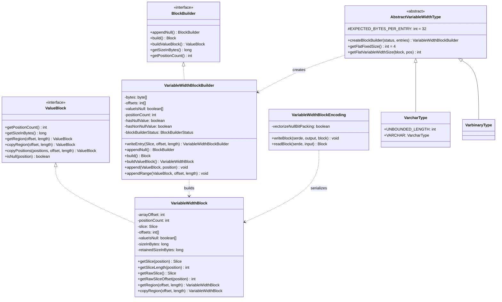
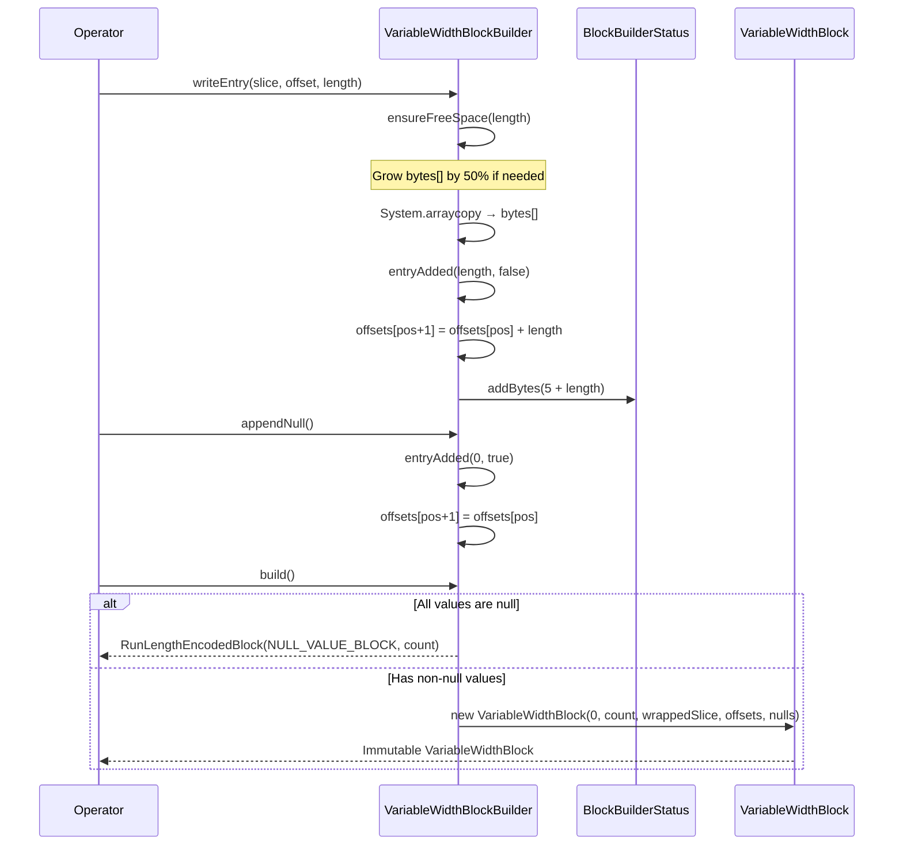

# Module Teardown: Variable-Width Storage

## 0. Research Focus
* **Task ID:** 1.1.C
* **Focus:** Trace exactly how variable-length data (like VARCHAR) calculates its `offsets` array and manages its underlying `Slice` memory.

## 1. High-Level Overview
* **Core Responsibility:** `VariableWidthBlock` and `VariableWidthBlockBuilder` provide Trino's columnar storage for variable-length data types (VARCHAR, VARBINARY). They use a classic three-component layout — a contiguous byte buffer (`Slice`), an offsets array, and an optional null bitmap — to enable O(1) random access to any position's bytes while keeping data cache-friendly and compact.
* **Key Triggers:** Created by `VariableWidthBlockBuilder` during operator execution (e.g., `ScanFilterAndProjectOperator` reading from a connector, aggregation operators accumulating string results). Also produced by deserialization (`VariableWidthBlockEncoding.readBlock()`) when receiving pages over the network.

## 2. Structural Architecture
* **Primary Source Files:**
  - `io.trino.spi.block.VariableWidthBlock` — Immutable columnar storage
  - `io.trino.spi.block.VariableWidthBlockBuilder` — Mutable builder
  - `io.trino.spi.block.VariableWidthBlockEncoding` — Wire format serialization
  - `io.trino.spi.type.AbstractVariableWidthType` — Type system integration and flat encoding
  - `io.trino.operator.VariableWidthData` / `AppendOnlyVariableWidthData` — Chunked storage for hash tables
* **Key Data Structures:**
  - `byte[] bytes` (builder) / `Slice slice` (block) — Contiguous raw byte storage for all entries
  - `int[] offsets` — Sentinel-pattern array mapping positions to byte ranges; always has `positionCount + 1` entries
  - `boolean[] valueIsNull` — Null bitmap; `null` reference when no nulls exist (optimization)
  - `int arrayOffset` — Enables zero-copy views into larger arrays without copying

### Class Diagram


## 3. Execution & Call Flow

### Memory Layout

The offset-sentinel pattern provides O(1) random access to any position's bytes:

```
Position:    0          1          2
             |          |          |
Slice:  [  bytes_0  |  bytes_1  |  bytes_2  ]
         ^          ^           ^           ^
offsets: [0,        10,         20,         25]
         sentinel    sentinel    sentinel    end-sentinel

Position 0: slice[offsets[0]..offsets[1]] = bytes 0..10  (10 bytes)
Position 1: slice[offsets[1]..offsets[2]] = bytes 10..20 (10 bytes)
Position 2: slice[offsets[2]..offsets[3]] = bytes 20..25 (5 bytes)
```

Key invariant: `offsets` always has exactly `positionCount + 1` elements. The last entry is the total bytes used.

### Value Access

```java
// VariableWidthBlock — O(1) random access
public Slice getSlice(int position) {
    checkReadablePosition(this, position);
    int offset = offsets[position + arrayOffset];
    int length = offsets[position + 1 + arrayOffset] - offset;
    return slice.slice(offset, length);  // Zero-copy view, NOT a deep copy
}

public int getSliceLength(int position) {
    checkReadablePosition(this, position);
    return getPositionOffset(position + 1) - getPositionOffset(position);
}
```

For performance-critical paths (hash computation, comparisons), operators access raw data directly:

```java
Slice rawSlice = block.getRawSlice();
int rawOffset = block.getRawSliceOffset(position);
int length = block.getSliceLength(position);
// Use rawSlice, rawOffset, length directly — avoids creating intermediate Slice object
```

### Builder Entry Writing

```java
// Writing a non-null entry
public VariableWidthBlockBuilder writeEntry(Slice source, int sourceIndex, int length) {
    ensureFreeSpace(length);  // Grow bytes[] if needed
    source.getBytes(sourceIndex, bytes, offsets[positionCount], length);
    entryAdded(length, false);
    return this;
}

// Core bookkeeping after each entry
private void entryAdded(int bytesWritten, boolean isNull) {
    ensureCapacity(positionCount + 1);  // Grow offsets[]/valueIsNull[] if needed
    valueIsNull[positionCount] = isNull;
    offsets[positionCount + 1] = offsets[positionCount] + bytesWritten;
    positionCount++;
    hasNonNullValue |= !isNull;
    if (blockBuilderStatus != null) {
        blockBuilderStatus.addBytes(SIZE_IN_BYTES_PER_POSITION + bytesWritten);  // 5 bytes metadata + data
    }
}

// Null entry — zero data bytes, null flag set
public BlockBuilder appendNull() {
    hasNullValue = true;
    entryAdded(0, true);
    return this;
}
```

### Build Process

```java
public Block build() {
    if (!hasNonNullValue) {
        // All-null optimization: single RLE block instead of materializing empty data
        return RunLengthEncodedBlock.create(NULL_VALUE_BLOCK, positionCount);
    }
    return buildValueBlock();
}

public VariableWidthBlock buildValueBlock() {
    return new VariableWidthBlock(
        0,
        positionCount,
        Slices.wrappedBuffer(bytes, 0, offsets[positionCount]),  // Wrap only used portion
        offsets,
        hasNullValue ? valueIsNull : null  // null reference = no nulls
    );
}
```

### Sequence Diagram


### Region and Copy Operations

Three distinct modes provide flexibility vs performance tradeoffs:

```java
// 1. ZERO-COPY VIEW — O(1), shares underlying arrays
public VariableWidthBlock getRegion(int positionOffset, int length) {
    return new VariableWidthBlock(
        positionOffset + arrayOffset, length, slice, offsets, valueIsNull);
    // Just shifts arrayOffset — no data movement
}

// 2. DEEP COPY WITH COMPACTION — O(n), creates independent copy
public VariableWidthBlock copyRegion(int positionOffset, int length) {
    int[] newOffsets = compactOffsets(offsets, positionOffset, length);   // Normalize to 0-based
    Slice newSlice = compactSlice(slice, offsets[positionOffset], newOffsets[length]);
    boolean[] newValueIsNull = compactIsNull(valueIsNull, positionOffset, length);
    return new VariableWidthBlock(0, length, newSlice, newOffsets, newValueIsNull);
}

// 3. ARBITRARY REORDER — O(n), scatter-gather with contiguous range optimization
public VariableWidthBlock copyPositions(int[] positions, int offset, int length) {
    // Detects contiguous byte ranges and copies in bulk
    // Key optimization: if positions are sequential, collapses into single memcpy
}
```

The `compactOffsets()` helper normalizes offsets to start from 0:

```java
static int[] compactOffsets(int[] offsets, int index, int length) {
    if (index == 0 && offsets.length == length + 1) return offsets;  // Already compact
    int[] newOffsets = new int[length + 1];
    for (int i = 1; i <= length; i++) {
        newOffsets[i] = offsets[index + i] - offsets[index];
    }
    return newOffsets;
}
```

### Bulk Append Operations

The builder provides optimized bulk operations for operator pipelines:

```java
// Append a range of positions from another block
public void appendRange(ValueBlock block, int offset, int length) {
    ensureCapacity(positionCount + length);
    VariableWidthBlock src = (VariableWidthBlock) block;

    // Bulk copy: single System.arraycopy for the byte data
    int startOffset = rawOffsets[rawArrayBase + offset];
    int endOffset = rawOffsets[rawArrayBase + offset + length];
    int bytesLength = endOffset - startOffset;

    ensureFreeSpace(bytesLength);
    System.arraycopy(rawByteArray, byteArrayOffset + startOffset,
                     bytes, offsets[positionCount], bytesLength);

    // Shift offsets in bulk
    int currentOffset = offsets[positionCount] - startOffset;
    for (int i = 0; i < length; i++) {
        offsets[positionCount + i + 1] = rawOffsets[rawArrayBase + offset + i + 1] + currentOffset;
    }
    positionCount += length;
}

// Exponential duplication for repeated values
public void appendRepeated(ValueBlock block, int position, int count) {
    // Copy once, then double exponentially until target count reached
    int duplicatedBytes = entryLength;
    while (duplicatedBytes * 2 <= totalBytes) {
        System.arraycopy(bytes, currentOffset, bytes, currentOffset + duplicatedBytes, duplicatedBytes);
        duplicatedBytes *= 2;
    }
    System.arraycopy(bytes, currentOffset, bytes, currentOffset + duplicatedBytes,
                     totalBytes - duplicatedBytes);
}
```

### Wire Format Serialization

```java
// VariableWidthBlockEncoding — Wire format:
// [positionCount: 4B] [null-bits: packed] [offsets: compacted] [raw-bytes]

public void writeBlock(BlockEncodingSerde serde, SliceOutput out, Block block) {
    VariableWidthBlock vwb = (VariableWidthBlock) block;
    int positionCount = vwb.getPositionCount();
    out.appendInt(positionCount);

    boolean[] isNull = vwb.getRawValueIsNull();
    encodeNullsAsBitsVectorized(out, isNull, arrayBaseOffset, positionCount);  // 1 bit per position

    int[] rawOffsets = vwb.getRawOffsets();
    writeOffsetsWithNullsCompacted(out, rawOffsets, isNull, arrayBaseOffset, positionCount);

    int startingOffset = rawOffsets[arrayBaseOffset];
    int totalLength = rawOffsets[positionCount + arrayBaseOffset] - startingOffset;
    out.writeBytes(vwb.getRawSlice(), startingOffset, totalLength);
}
```

Null compression: offsets for null positions are omitted entirely. On deserialization, null positions get duplicate offsets reconstructed.

## 4. Concurrency & State Management
* **Threading Model:** `VariableWidthBlock` is effectively immutable after construction — safe for concurrent reads. `VariableWidthBlockBuilder` is single-threaded; it's owned by one operator within one driver pipeline. No synchronization is needed.
* **State Machine:** The builder has an implicit lifecycle: construction → repeated `writeEntry()`/`appendNull()` calls → `build()` produces the block. After `build()`, the builder's arrays are shared with the block (no reset). `newBlockBuilderLike()` creates a fresh builder for the next page cycle.
* **Synchronization:** None. Builders are thread-confined. Blocks are immutable value objects.

## 5. Memory & Resource Profile
* **Allocation Pattern:**
  - Builder starts with empty arrays (`byte[0]`, `boolean[0]`, `int[1]`) — lazy allocation
  - Growth strategy: **50% increase** each time capacity is exceeded, minimum 64 elements
  - `PageBuilderStatus` caps total page size at **1 MB** (`DEFAULT_MAX_PAGE_SIZE_IN_BYTES`)
  - Types estimate **32 bytes per entry** as initial hint (`EXPECTED_BYTES_PER_ENTRY`)
  - After `build()`, `newBlockBuilderLike()` applies **1.25x skew** to the previous page's actual size for the next allocation

* **Size Metrics:**
  ```java
  // Logical size (what the data represents)
  sizeInBytes = totalDataBytes + (Integer.BYTES + Byte.BYTES) * positionCount
  //            ↑ actual bytes   ↑ 5 bytes metadata per position (offset + null flag)

  // Physical size (what the JVM actually holds)
  retainedSizeInBytes = INSTANCE_SIZE + slice.getRetainedSize() + sizeOf(offsets) + sizeOf(valueIsNull)
  //                    ↑ includes over-allocated array capacity
  ```

* **Memory Tracking:** `BlockBuilderStatus.addBytes()` reports each entry's size (5 bytes metadata + data bytes) upward to `PageBuilderStatus`, which triggers page-full detection at the 1 MB threshold.

### Flat Encoding in Hash Tables

For hash join and group-by operations, variable-width data uses a different representation optimized for cache locality:

```java
// Short string optimization (≤3 bytes): embedded in 4-byte fixed field
// Byte layout: [0x80 | length] [byte0] [byte1] [byte2]
// Long strings: [big-endian length: 4B] → pointer to variable-width chunk

// VariableWidthData — general purpose, supports free()
public static final int POINTER_SIZE = 12;  // chunkIndex(4) + chunkOffset(4) + valueLength(4)

// AppendOnlyVariableWidthData — append-only, saves 4 bytes per record
public static final int POINTER_SIZE = 8;   // chunkIndex(4) + chunkOffset(4)
```

Chunk growth: exponential doubling up to 512KB, then 1.5x. Min 1KB, max 8MB.

## 6. Key Design Insights

* **Offset-sentinel pattern with `arrayOffset` enables zero-copy slicing:** `VariableWidthBlock` stores `positionCount + 1` offsets where position N's data spans `slice[offsets[N]..offsets[N+1]]`. The `arrayOffset` field allows `getRegion()` to create a sub-view by simply shifting the base index — no data copying, no offset renormalization. This is O(1) and the dominant access pattern in the pipeline (e.g., passing a region of a page to a downstream operator).
* **Builder uses lazy allocation with 50% growth and 1.25x skew estimation:** The builder starts with empty arrays (`byte[0]`, `boolean[0]`, `int[1]`) and only allocates on first write. Growth is 50% each time, with a minimum of 64 elements. After `build()`, `newBlockBuilderLike()` applies a `1.25x` multiplier (`BLOCK_RESET_SKEW`) to the previous page's actual byte usage as the initial capacity for the next page. This adaptive sizing avoids both over-allocation (wasting memory) and under-allocation (triggering many resizes) across pages.
* **`copyPositions()` detects contiguous byte ranges for bulk copy:** When reordering positions, the method tracks whether consecutive positions map to contiguous bytes in the underlying slice. If they do, it copies the entire range in a single `writeBytes()` call rather than position-by-position. This optimization is critical for filter operations where surviving rows tend to cluster.
* **Short-string embedding in flat hash encoding avoids pointer chasing:** For hash table lookups, strings ≤3 bytes are stored inline in the 4-byte fixed field (using `0x80 | length` as a sentinel in the first byte, big-endian). Longer strings use a 12-byte pointer to chunked `VariableWidthData` storage. This means common short values (country codes, status flags, boolean strings) never leave the fixed-size row, maximizing cache locality during hash probes.
* **Wire format compacts offsets by omitting null positions:** `VariableWidthBlockEncoding.writeBlock()` packs nulls as a bit vector (1 bit per position, vectorized) and only writes offsets for non-null entries via `writeOffsetsWithNullsCompacted()`. On deserialization, null positions get duplicate offsets reconstructed. For sparse columns (many nulls), this significantly reduces network transfer size.

## 7. Porting Considerations (Java -> Target Architecture) *(Optional)*

* **Translation Blockers:**
  - `Slice` wraps either `byte[]` (heap) or direct `ByteBuffer` (off-heap). Rust needs a unified `Bytes`/`Vec<u8>` abstraction
  - `getSlice()` returns a zero-copy view via `Slice.slice()` — maps directly to Rust's `&[u8]` slices with lifetime bounds
  - `arrayOffset` for view-based blocks maps naturally to Rust slice ranges
  - `BlockBuilderStatus` / `PageBuilderStatus` callback chain for page-full detection needs a trait-based equivalent
  - The code-generated `FlatHashStrategy` (bytecode generation at runtime) must be replaced with monomorphized generic functions or trait dispatch

* **Recommended Abstractions:**
  - **Arrow alignment:** Trino's `(Slice, int[] offsets, boolean[] valueIsNull)` maps almost directly to Arrow's `StringArray` / `BinaryArray` layout: `(Buffer<u8>, OffsetsBuffer<i32>, NullBuffer)`. The main difference is Arrow uses a bit-packed validity bitmap vs Trino's `boolean[]`
  - **Builder pattern:** Rust's `arrow::array::GenericByteBuilder<T>` follows the same accumulate-then-freeze pattern. Consider wrapping or extending it with Trino's 1.25x skew estimation
  - **Zero-copy regions:** Trino's `getRegion()` → Arrow's `slice()` on `ArrayRef`. Both shift an offset without copying
  - **Flat hash encoding:** Implement as a Rust enum: `enum VarWidthFlat { Short([u8; 3]), Long { chunk_idx: u32, offset: u32 } }` — the short-string optimization avoids pointer chasing for common cases like country codes, status flags
  - **Null handling:** Convert Trino's `boolean[]` (1 byte per flag) to Arrow's bit-packed `NullBuffer` during block construction for 8x memory savings on the null bitmap
  - **Serialization:** The wire format (position count → bit-packed nulls → compacted offsets → raw bytes) is simple enough to implement directly with `bytes::BufMut` / `bytes::Buf`
  - **Chunk allocator for hash tables:** `VariableWidthData`'s chunked allocation with exponential growth maps to a `Vec<Vec<u8>>` pool with a bump allocator pattern per chunk
