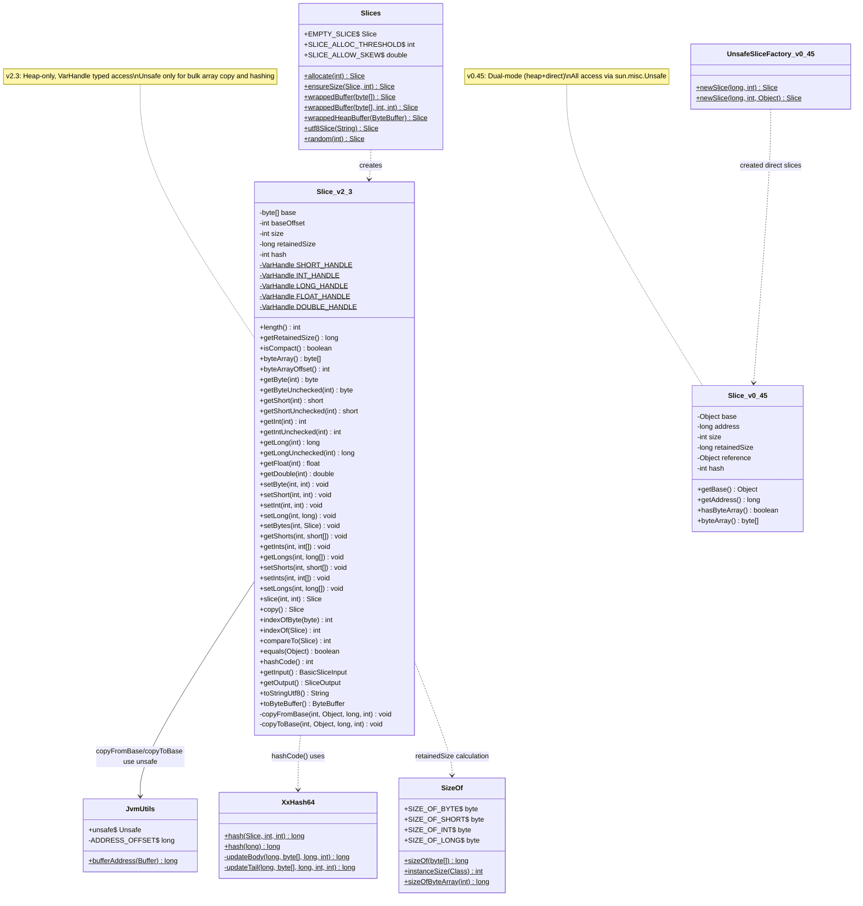
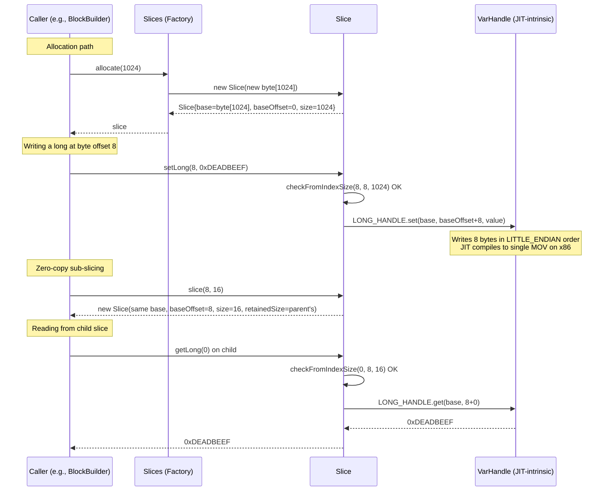
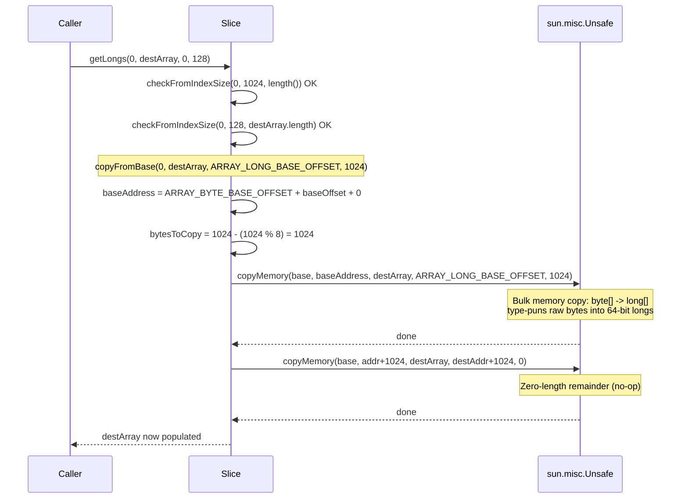
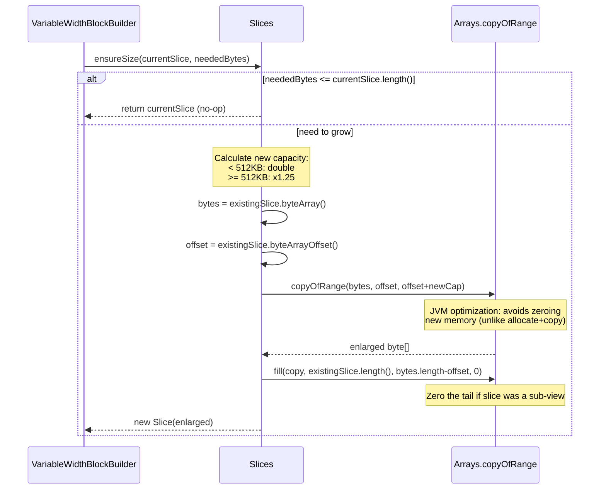
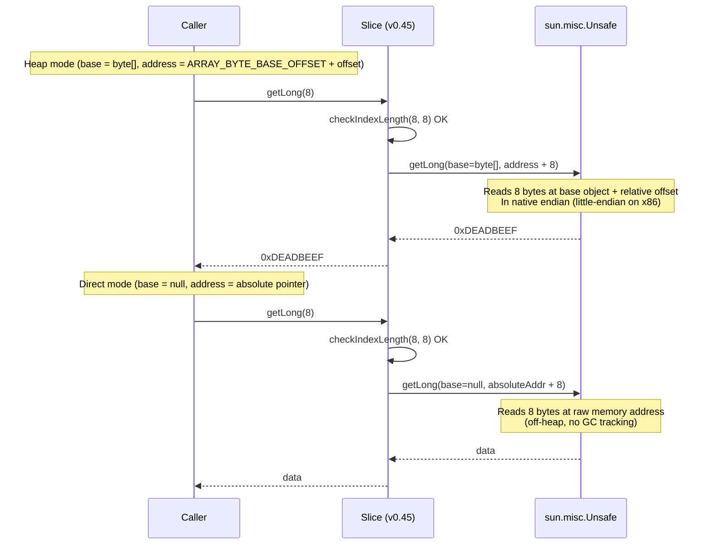

# Module Teardown: The `Slice` Memory Interface & Metadata (Task 1.1.A)

## 0. Research Focus
* **Task ID:** 1.1.A
* **Focus:** Analyze the internal metadata of a `Slice` (base object reference, address offset, size). Trace the APIs that utilize `Unsafe` memory access. Contrast the historical `HeapSlice` vs `DirectSlice` architecture (airlift slice 0.x) with the modern heap-only VarHandle design (airlift slice 2.3, used by Trino 480).

## 1. High-Level Overview
* **Core Responsibility:** `Slice` is Trino's foundational memory abstraction -- a bounded view over a heap `byte[]` array that provides typed, little-endian read/write access to raw bytes. It is the universal byte-buffer primitive underpinning all columnar data storage in Trino's SPI: the `Block` layer stores VARCHAR data, binary data, and serialized values in `Slice` instances. The companion `Slices` class is a factory for creating, wrapping, and resizing `Slice` instances.
* **Key Triggers:** `Slice` is a passive data structure -- it does not activate itself. It is created whenever Trino needs to hold variable-length binary data: when a connector reads raw column bytes, when a `VariableWidthBlockBuilder` accumulates VARCHAR values, when data is serialized for network exchange, or when hash tables need to compare keys.
* **Library Version:** Trino 480 uses airlift BOM v420, which transitively depends on **airlift `slice` 2.3** (the latest major version). Source: [github.com/airlift/slice tag 2.3](https://github.com/airlift/slice/tree/2.3).

## 2. Structural Architecture

### 2.1 Primary Source Files

| File | Lines | Role |
|------|-------|------|
| `io.airlift.slice.Slice` (v2.3) | 1427 | Core memory wrapper: fields, typed access, comparison, hashing |
| `io.airlift.slice.Slices` (v2.3) | 165 | Factory: allocate, wrap, grow, encode |
| `io.airlift.slice.JvmUtils` (v2.3) | 82 | Obtains `sun.misc.Unsafe` instance; validates array index scales; extracts direct buffer addresses |
| `io.airlift.slice.SizeOf` (v2.3) | 325 | Memory size constants, `instanceSize()` via JOL, array overhead calculation using `Unsafe` constants |
| `io.airlift.slice.XxHash64` (v2.3) | 324 | XxHash64 hashing -- uses `Unsafe` for high-performance bulk reads |
| `io.airlift.slice.Preconditions` (v2.3) | 36 | Minimal check utilities |

### 2.2 Internal Metadata Fields (v2.3 -- Current)

The core `Slice` class contains exactly five instance fields:

```java
// Slice.java, lines 64-78
private final byte[] base;          // The actual heap memory backing the slice
private final int baseOffset;       // Start position within base (enables zero-copy sub-slicing)
private final int size;             // Logical length of this slice's view
private final long retainedSize;    // Total bytes retained for memory accounting
private int hash;                   // Lazily-computed, cached XxHash64 value
```

| Field | Type | Purpose | Notes |
|-------|------|---------|-------|
| `base` | `byte[]` | The heap array backing this slice | Always a `byte[]` -- never null (except for `EMPTY_SLICE`, which uses `new byte[0]`) |
| `baseOffset` | `int` | Start position within `base` | Enables zero-copy sub-slicing; the child shares the parent's `base` with a different offset |
| `size` | `int` | Logical length of this slice's view | The number of valid bytes starting at `baseOffset` |
| `retainedSize` | `long` | Total bytes retained for memory accounting | = `INSTANCE_SIZE + SizeOf.sizeOf(base)` for full slices; inherited from parent for sub-views |
| `hash` | `int` | Lazily-computed XxHash64 of contents | Non-volatile; benign data race by design |

**Key difference from historical version:** In v2.3, `base` is `byte[]` (strongly typed). In v0.45, it was `Object` (could be `byte[]`, `int[]`, `long[]`, `null` for direct memory, etc.), and `address` was a `long` offset from the base object (or an absolute memory address when `base == null`).

### 2.3 Static VarHandle Fields (Typed Access Layer)

```java
// Slice.java, lines 55-59
private static final VarHandle SHORT_HANDLE  = byteArrayViewVarHandle(short[].class, LITTLE_ENDIAN);
private static final VarHandle INT_HANDLE    = byteArrayViewVarHandle(int[].class, LITTLE_ENDIAN);
private static final VarHandle LONG_HANDLE   = byteArrayViewVarHandle(long[].class, LITTLE_ENDIAN);
private static final VarHandle FLOAT_HANDLE  = byteArrayViewVarHandle(float[].class, LITTLE_ENDIAN);
private static final VarHandle DOUBLE_HANDLE = byteArrayViewVarHandle(double[].class, LITTLE_ENDIAN);
```

These VarHandles are the primary mechanism for typed read/write in v2.3. They provide:
- Little-endian byte ordering regardless of platform
- JIT compilation to single machine instructions (e.g., `MOV` on x86)
- Bounds checking by the JVM (the array view semantics implicitly check array bounds)

### 2.4 Historical Metadata Fields (v0.45 -- Contrast)

The old `Slice` class (airlift slice 0.45, used by earlier Trino/Presto versions) had a fundamentally different internal structure:

```java
// Old Slice.java (v0.45), lines 66-112
private final Object base;           // Base object: byte[], int[], long[], or null (for direct memory)
private final long address;          // Unsafe offset from base, OR absolute memory address when base==null
private final int size;              // Logical length
private final long retainedSize;     // Memory accounting
private final Object reference;      // GC anchor (for direct buffers) OR compactness marker
private int hash;                    // Lazily-computed hash
```

| Field (v0.45) | Type | Purpose | Replaced By (v2.3) |
|----------------|------|---------|---------------------|
| `base` | `Object` | Base reference -- null for direct/off-heap memory, a primitive array for heap | `byte[] base` (always non-null, always `byte[]`) |
| `address` | `long` | Unsafe-style absolute or relative address | `int baseOffset` (simple array offset, never an absolute address) |
| `reference` | `Object` | Dual-purpose: (1) GC anchor for direct ByteBuffer, (2) compactness marker (`COMPACT` sentinel vs `null`) | Removed -- compactness is now computed: `baseOffset == 0 && size == base.length` |

### 2.5 Class Diagram



## 3. Execution & Call Flow

### 3.1 Typed Read Path (VarHandle in v2.3)

The primary typed access pattern uses VarHandle for single-element reads and writes:

```java
// Slice.java, lines 276-284 -- getInt example
public int getInt(int index)
{
    checkFromIndexSize(index, SIZE_OF_INT, length());  // JDK 9+ bounds check
    return getIntUnchecked(index);
}

public int getIntUnchecked(int index)
{
    return (int) INT_HANDLE.get(base, baseOffset + index);  // VarHandle typed read
}
```

**All typed access methods follow the same pattern:**
1. Public method: bounds-check via `java.util.Objects.checkFromIndexSize()`, then delegate to unchecked variant
2. Package-private `*Unchecked` method: directly use VarHandle (for short/int/long/float/double) or direct array access (for byte)
3. Byte access is special: `getByteUnchecked(int index)` simply does `return base[baseOffset + index]` -- no VarHandle needed for single bytes

The `*Unchecked` variants are critical for hot-path performance. They skip bounds checking, and the JIT can inline them to single instructions.

### 3.2 Where `sun.misc.Unsafe` Is Actually Used in v2.3

Despite the migration to VarHandle for typed access, `sun.misc.Unsafe` is **not eliminated** in airlift slice 2.3. It survives in three specific areas:

#### Area 1: Bulk Typed Array Copies (`Slice.copyFromBase` / `Slice.copyToBase`)

```java
// Slice.java, lines 1406-1426
private void copyFromBase(int index, Object dest, long destAddress, int length)
{
    int baseAddress = ARRAY_BYTE_BASE_OFFSET + baseOffset + index;
    // The Unsafe Javadoc specifies that the transfer size is 8 iff length % 8 == 0
    // so ensure that we copy big chunks whenever possible
    int bytesToCopy = length - (length % 8);
    unsafe.copyMemory(base, baseAddress, dest, destAddress, bytesToCopy);
    unsafe.copyMemory(base, baseAddress + bytesToCopy, dest, destAddress + bytesToCopy, length - bytesToCopy);
}

private void copyToBase(int index, Object src, long srcAddress, int length)
{
    int baseAddress = ARRAY_BYTE_BASE_OFFSET + baseOffset + index;
    int bytesToCopy = length - (length % 8);
    unsafe.copyMemory(src, srcAddress, base, baseAddress, bytesToCopy);
    unsafe.copyMemory(src, srcAddress + bytesToCopy, base, baseAddress + bytesToCopy, length - bytesToCopy);
}
```

These are used by all the bulk-array methods:
- `getShorts()`, `getInts()`, `getLongs()`, `getFloats()`, `getDoubles()` -> `copyFromBase()`
- `setShorts()`, `setInts()`, `setLongs()`, `setFloats()`, `setDoubles()` -> `copyToBase()`

The use of `Unsafe.copyMemory()` here is deliberate: it provides zero-copy type-punning between a `byte[]` and a typed array (e.g., `int[]`) by using raw memory offsets. The split into two `copyMemory` calls (8-byte-aligned chunk, then remainder) exploits the Unsafe documentation that transfer size is 8 when `length % 8 == 0`, ensuring maximum throughput.

**Note:** Byte-to-byte copies (e.g., `getBytes(int, Slice)`, `setBytes(int, byte[], ...)`) use `System.arraycopy` instead -- no Unsafe needed for same-type copies.

#### Area 2: XxHash64 Hashing

```java
// XxHash64.java, lines 146-149 -- inner hashing loop
v1 = mix(v1, unsafe.getLong(base, address));
v2 = mix(v2, unsafe.getLong(base, address + 8));
v3 = mix(v3, unsafe.getLong(base, address + 16));
v4 = mix(v4, unsafe.getLong(base, address + 24));
```

```java
// XxHash64.java, lines 234-249 -- tail processing
while (index <= length - 8) {
    hash = updateTail(hash, unsafe.getLong(base, address + index));
    index += 8;
}
if (index <= length - 4) {
    hash = updateTail(hash, unsafe.getInt(base, address + index));
    index += 4;
}
while (index < length) {
    hash = updateTail(hash, unsafe.getByte(base, address + index));
    index++;
}
```

XxHash64 uses `Unsafe.getLong/getInt/getByte` extensively for its streaming and static hash methods. The address computation uses `ARRAY_BYTE_BASE_OFFSET + data.byteArrayOffset() + offset` to produce an absolute offset into the heap byte array. This avoids VarHandle overhead on the hash hot path.

Additionally, `XxHash64.updateHash()` uses `unsafe.copyMemory()` for buffering:

```java
// XxHash64.java, lines 118, 137
unsafe.copyMemory(base, address, buffer, BUFFER_ADDRESS + bufferSize, available);
// ...
unsafe.copyMemory(base, address, buffer, BUFFER_ADDRESS, length);
```

#### Area 3: JvmUtils Initialization and Buffer Address Extraction

```java
// JvmUtils.java, lines 33-65
static final Unsafe unsafe;
private static final long ADDRESS_OFFSET;

static {
    // fetch theUnsafe object
    Field field = Unsafe.class.getDeclaredField("theUnsafe");
    field.setAccessible(true);
    unsafe = (Unsafe) field.get(null);

    // verify the stride of arrays matches the width of primitives
    assertArrayIndexScale("Boolean", ARRAY_BOOLEAN_INDEX_SCALE, 1);
    // ... (validates all primitive array scales)

    // fetch the address field for direct buffers
    ADDRESS_OFFSET = unsafe.objectFieldOffset(Buffer.class.getDeclaredField("address"));
}

static long bufferAddress(Buffer buffer)
{
    checkArgument(buffer.isDirect(), "buffer is not direct");
    return unsafe.getLong(buffer, ADDRESS_OFFSET);
}
```

`JvmUtils.bufferAddress()` still uses Unsafe to extract the raw memory address from a `java.nio.DirectByteBuffer`. However, in v2.3 this method is **no longer called by Slice or Slices** -- it remains as a utility for legacy compatibility but is dead code for the core Slice path.

#### Area 4: SizeOf Constants

`SizeOf.java` imports `ARRAY_*_BASE_OFFSET` and `ARRAY_*_INDEX_SCALE` constants from `sun.misc.Unsafe` for its memory size calculations:

```java
// SizeOf.java, lines 36-53
import static sun.misc.Unsafe.ARRAY_BYTE_BASE_OFFSET;
import static sun.misc.Unsafe.ARRAY_BYTE_INDEX_SCALE;
// ... all primitive array base offsets and scales
```

These constants are compile-time constants used in `sizeOfByteArray()`, `sizeOfIntArray()`, etc. for memory accounting.

### 3.3 Sequence Diagram: Typed Access (v2.3 VarHandle Path)



### 3.4 Sequence Diagram: Bulk Typed Array Copy (Unsafe Path in v2.3)



### 3.5 Sequence Diagram: Growth via `ensureSize`



### 3.6 Contrasting the Historical Unsafe-Only Path (v0.45)

In the old architecture, **every** typed access went through `sun.misc.Unsafe`:

```java
// Old Slice.java (v0.45) -- getIntUnchecked
int getIntUnchecked(int index)
{
    return unsafe.getInt(base, address + index);  // base is Object, address is long
}
```

The old `address` field served dual purpose:
- **Heap mode:** `address = ARRAY_BYTE_BASE_OFFSET + arrayOffset` (relative to the `base` object)
- **Direct mode:** `address = absolute memory pointer` (when `base == null`)

The `Unsafe.getInt(Object base, long offset)` API transparently handles both modes: when `base` is non-null, `offset` is relative; when `base` is null, `offset` is an absolute memory address. This was the key mechanism enabling the unified `HeapSlice`/`DirectSlice` pattern.



## 4. Concurrency & State Management

* **Threading Model:** `Slice` is a passive value object with no thread affinity. It is not tied to any specific thread, driver loop, or executor. Any thread can read from or write to a Slice.

* **State Machine:** None. `Slice` is structurally immutable -- all fields except `hash` are `final`. The underlying `byte[]` content is mutable, but the slice's bounds never change after construction.

* **Synchronization:** None whatsoever -- no locks, no `volatile`, no `synchronized` blocks. The `hash` field is intentionally non-volatile:
  - In a race, two threads may both compute the hash. This is safe because XxHash64 is deterministic (both compute the same value), and `int` writes are atomic on the JVM per the Java Memory Model (JLS 17.7).
  - This is a deliberate "benign race" pattern that avoids synchronization overhead on the hot read path.

* **Caller Responsibility:** Thread safety for the *contents* of the backing `byte[]` is the caller's responsibility. In Trino's execution model, this is safe because the Driver loop processes data in a single thread per pipeline, and Slices are typically not shared across drivers once constructed.

## 5. Memory & Resource Profile

### 5.1 Allocation Pattern

- **Heap-only (v2.3):** Modern airlift `Slice` wraps ONLY `byte[]` arrays (heap memory). There is no off-heap/direct memory path.
- **No direct/off-heap ByteBuffers:** `Slices.wrappedHeapBuffer()` explicitly rejects non-array-backed buffers: `if (!buffer.hasArray()) throw new IllegalArgumentException(...)`. The old `Slices.allocateDirect()` and `Slices.wrappedBuffer(DirectByteBuffer)` methods are gone.
- **Zero-copy where possible:** `wrappedBuffer()` wraps an existing `byte[]` without copying; `slice()` shares the backing array with adjusted offset.
- **Copy-on-grow:** `ensureSize()` copies old data into a new, larger array. Below 512KB threshold, capacity doubles; above 512KB, it grows by 1.25x. Uses `Arrays.copyOfRange` because the JVM can skip zeroing the new memory (more efficient than allocate-then-copy).

### 5.2 Memory Tracking

- `retainedSize` = `INSTANCE_SIZE` (object header + field overhead, via `SizeOf.instanceSize()`) + `SizeOf.sizeOf(base)` (full backing array size including JVM array overhead).
- When `slice()` creates a sub-view, the child inherits the parent's `retainedSize` directly (line 1042: `new Slice(base, baseOffset + index, length, retainedSize)`). This is intentional -- the child retains a reference to the full backing array, so it must report the full array's memory cost. This prevents under-reporting in Trino's memory accounting hierarchy.
- `isCompact()` returns `true` only when `baseOffset == 0 && size == base.length` (line 168), meaning no wasted space from sub-slicing. Trino uses this to decide whether to compact data during serialization.

### 5.3 Lifecycle

There is **no** direct integration with Trino's `LocalMemoryContext` or `MemoryPool` -- `Slice` is a lower-level primitive. Memory reporting flows upward through the Block layer: `VariableWidthBlock.getRetainedSizeInBytes()` calls `slice.getRetainedSize()`, and the Block's enclosing Operator reports to its `OperatorContext`.

### 5.4 Unsafe Memory Usage in SizeOf

The `SizeOf` class uses `Unsafe` constants (not method calls) to compute memory sizes:

```java
// SizeOf.java, lines 262-264
public static long sizeOfByteArray(int length) {
    return ARRAY_BYTE_BASE_OFFSET + (((long) ARRAY_BYTE_INDEX_SCALE) * length);
}
```

`ARRAY_BYTE_BASE_OFFSET` (typically 16 on 64-bit JVMs with compressed oops) represents the JVM array object header size. This is accurate and JVM-specific, using Unsafe's own constants rather than hardcoded values.

## 6. Key Design Insights

* **Unsafe is not gone -- it migrated from data access to infrastructure:** Despite the headline change from `Unsafe`-based typed access to VarHandle, airlift slice 2.3 still uses `sun.misc.Unsafe` extensively. It appears in three distinct roles: (1) `copyMemory()` for bulk typed array transfers in `Slice.copyFromBase/copyToBase`, (2) `getLong/getInt/getByte` for XxHash64's streaming hash implementation, and (3) `objectFieldOffset` + `getLong` in `JvmUtils` for direct buffer address extraction. The migration was surgical: VarHandle replaced Unsafe only for single-element typed access (get/set of short/int/long/float/double), where VarHandle provides equivalent JIT optimization plus endianness control.

* **The elimination of HeapSlice vs DirectSlice is real and complete:** In v0.45, `Slice` used `Object base` + `long address` to support both heap arrays and raw off-heap memory through a single class (not subclasses). When `base == null`, the address was absolute; when `base != null`, it was relative. This unified approach relied on `Unsafe`'s dual-mode `get*(Object, long)` semantics. In v2.3, the `base` field is `byte[]` (not `Object`), `address` is replaced by `int baseOffset`, and no constructor accepts `null` base or absolute addresses. The `UnsafeSliceFactory` (which created direct-memory slices) and `Slices.allocateDirect()` are both removed. This reflects a broader JVM ecosystem shift: Java's Foreign Function & Memory API (Project Panama) provides safer alternatives to off-heap memory, and Trino's own memory management moved entirely to heap-based blocks.

* **VarHandle provides endianness control that Unsafe lacked:** Old v0.45 `Unsafe.getLong()` reads in native endian order (little-endian on x86, but theoretically platform-dependent). The v2.3 VarHandle is explicitly created with `LITTLE_ENDIAN` byte order via `byteArrayViewVarHandle(long[].class, LITTLE_ENDIAN)`. This makes the wire format platform-independent. The `JvmUtils` static initializer (line 37-39) still asserts little-endian platform: `if (!ByteOrder.LITTLE_ENDIAN.equals(ByteOrder.nativeOrder())) throw new UnsupportedOperationException(...)` -- this guards the XxHash64 code which uses Unsafe (native endian) rather than VarHandle.

* **The split-copy optimization in `copyFromBase`/`copyToBase` exploits undocumented Unsafe behavior:** The code splits bulk copies into an 8-byte-aligned chunk and a remainder: `int bytesToCopy = length - (length % 8)`. The comment references the Unsafe Javadoc specification that transfer size is 8 when `length % 8 == 0`. By splitting into two calls -- one guaranteed 8-byte-aligned, one for the tail -- the code ensures the JVM uses the widest possible memory transfer instructions (64-bit moves) for the bulk of the data.

* **Zero-copy slicing with accurate retained-size accounting prevents memory under-counting:** `slice(index, length)` creates a new `Slice` sharing the same backing `byte[]` with an adjusted `baseOffset`, but inherits the parent's `retainedSize`. Since the child holds a reference to the full array, it correctly reports the full array's cost. This is critical for Trino's memory pool accounting: if sub-views reported only their logical size, the system would undercount memory and risk OOM.

* **SWAR byte search was removed in v2.3 -- replaced by simple loop:** The existing research noted that `indexOfByte()` uses SWAR. This was true in v0.45 but **not in v2.3**. The current implementation is a simple linear scan:
  ```java
  // Slice.java v2.3, lines 1076-1084
  public int indexOfByte(byte b) {
      for (int i = 0; i < size; i++) {
          if (getByteUnchecked(i) == b) {
              return i;
          }
      }
      return -1;
  }
  ```
  However, the `indexOf(Slice)` method (line 1101) still uses a SWAR-style optimization when searching for a 4+ byte pattern: it reads 4 bytes at a time, XORs with a replicated first-byte mask, and uses the classic zero-byte detection trick `(valueXor - 0x01010101) & ~valueXor & 0x80808080` to skip non-matching positions 4 bytes at a time.

## 7. Porting Considerations (Java -> Rust)

### 7.1 Translation Blockers

| Blocker | Detail | Severity |
|---------|--------|----------|
| **VarHandle JIT optimization** | Java's VarHandle calls compile to single machine instructions. Rust's `from_le_bytes` / `to_le_bytes` + `copy_from_slice` should achieve parity, but the JVM's ability to prove bounds checks can be elided has no direct analogue -- Rust achieves this differently via the borrow checker and `unsafe` blocks. | Low |
| **GC-managed backing array** | Multiple `Slice` views share one `byte[]`; the GC collects it when all references are dropped. In Rust, this requires explicit shared ownership (e.g., `Arc<Vec<u8>>` or `bytes::Bytes`). | Medium |
| **Benign hash race** | The `hash` field exploits JVM `int` write atomicity with no synchronization. Rust would need `AtomicU32` with `Relaxed` ordering, or `OnceLock`/`OnceCell`. | Low |
| **Unsafe.copyMemory for type-punning** | `copyFromBase`/`copyToBase` use Unsafe to copy between `byte[]` and typed arrays (e.g., `long[]`). In Rust, this is naturally handled by `bytemuck::cast_slice` or direct pointer casting in `unsafe` blocks, but requires alignment guarantees. | Low |
| **Unsafe in XxHash64** | The hash implementation directly uses `Unsafe.getLong/getInt/getByte` on byte arrays with computed offsets. A Rust port should use the `xxhash-rust` crate which provides equivalent performance. | Low |

### 7.2 Recommended Abstractions

| Java Concept | Rust Equivalent | Notes |
|---|---|---|
| `Slice` (owned, full array) | `bytes::Bytes` or `Vec<u8>` | `Bytes` provides zero-copy slicing with reference counting |
| `Slice` (sub-view via `slice()`) | `bytes::Bytes::slice()` or `&[u8]` | `Bytes::slice()` preserves shared ownership; `&[u8]` for borrowed views |
| `retainedSize` tracking | Custom wrapper with `size_of_val()` + explicit tracking | Rust has no equivalent to Java's `SizeOf.instanceSize()`; track allocations manually or use a custom allocator |
| `VarHandle` typed reads | `byteorder` crate or `{i32,i64,f64}::from_le_bytes()` | Native Rust; zero-cost abstraction |
| `Unsafe.copyMemory` bulk copies | `bytemuck::cast_slice` or `std::ptr::copy_nonoverlapping` | For type-punning between `&[u8]` and `&[i64]`, etc. |
| `Slices.ensureSize()` growth | `Vec::reserve()` with custom growth policy | Vec's default doubling is close but lacks the 1.25x large-buffer strategy |
| `XxHash64` hashing | `xxhash-rust` crate (`xxh64`) | Identical algorithm |
| `indexOfByte` simple scan | `memchr` crate | Uses actual SIMD (SSE2/AVX2) -- faster than both the SWAR and simple-loop versions |
| `indexOf(Slice)` SWAR search | `memchr::memmem` | Provides optimized substring search using Rabin-Karp and Two-Way algorithms |
| `isCompact()` check | `bytes::Bytes` -- always compact after `copy_from_slice()` | Or track explicitly with offset/length metadata |
| `BasicSliceInput` / `BasicSliceOutput` | `std::io::Cursor<Bytes>` | Standard library provides equivalent cursor-based I/O |
| `Object reference` (old GC anchor) | N/A in Rust | Rust's ownership model handles this natively via `Arc` |
| `UnsafeSliceFactory` (old direct memory) | N/A or `MmapMut` from `memmap2` crate | If off-heap memory mapping is needed for file I/O |

### 7.3 Architectural Recommendation

Use `bytes::Bytes` as the primary Rust equivalent of `Slice`. It provides:
- **Zero-copy slicing** via reference-counted shared ownership (replaces Java's GC-based sharing)
- **`bytes::Buf` / `bytes::BufMut` traits** for typed read/write (replaces VarHandle)
- **Cheap cloning** (Arc increment, not data copy)
- **`BytesMut`** for the build phase, frozen into `Bytes` for the read phase (natural fit for Trino's block-building then block-reading lifecycle)

The key difference: Rust doesn't need the `retainedSize` tracking pattern because `Bytes::slice()` uses atomic reference counting, and the backing memory is freed when the last `Bytes` handle drops. Memory accounting in a Rust engine would use a custom allocator (e.g., `jemalloc` with per-query arenas) rather than per-object `retainedSize` fields.
