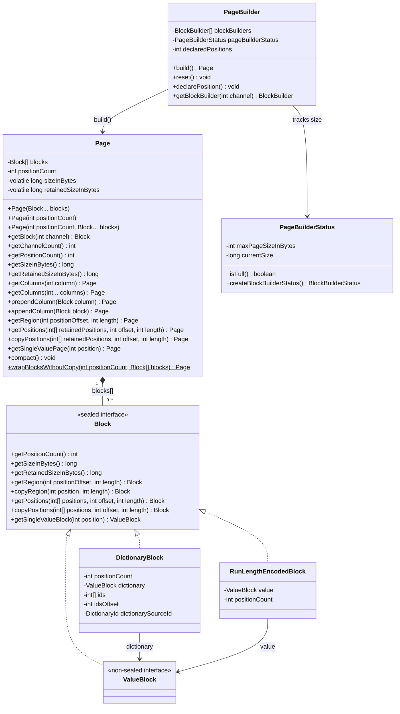
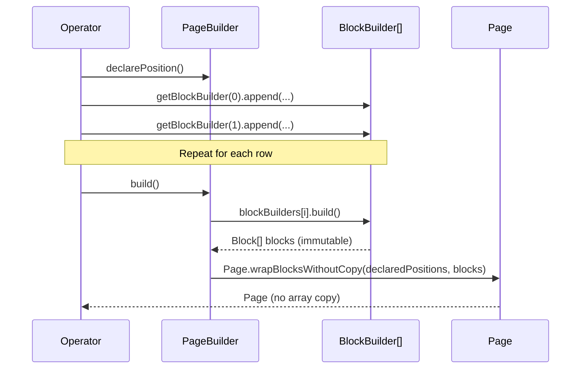
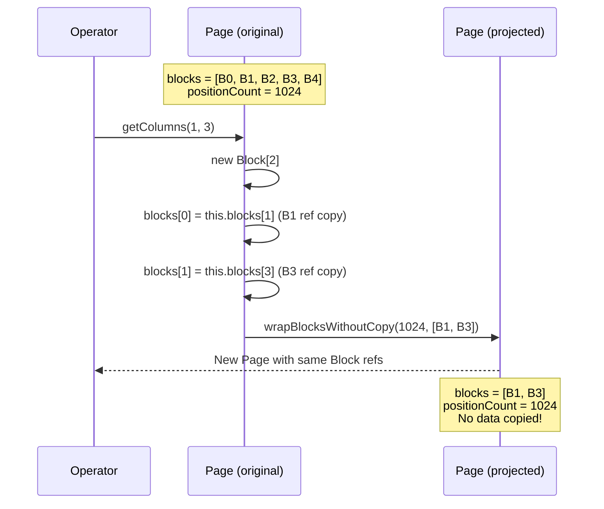
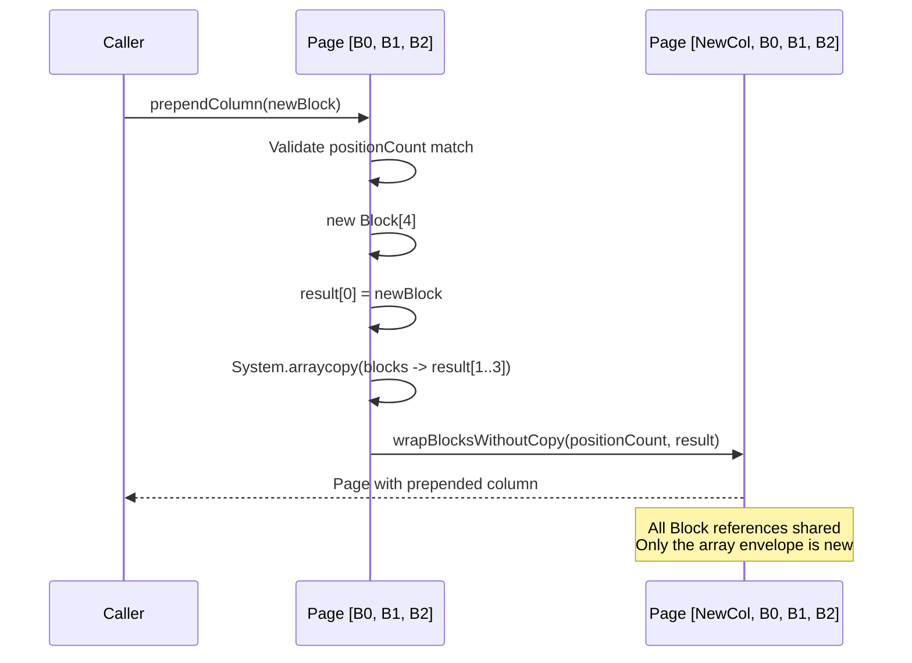
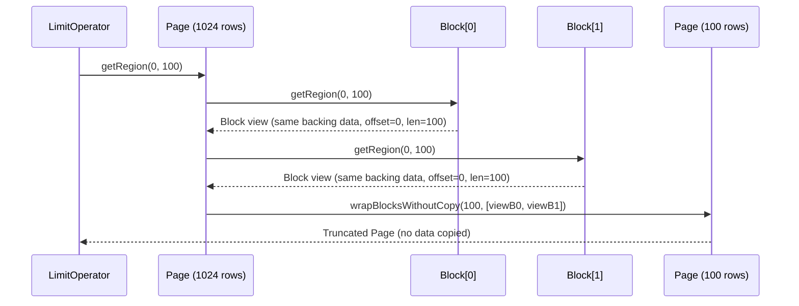

# Module Teardown: The `Page` Interface & Zero-Copy Mutations (Task 1.3.A)

## 0. Research Focus

* **Task ID:** 1.3.A
* **Focus:** Inspect the internal fields of a `Page` (`Block[]`, `positionCount`). Analyze `Page` as a passive data container. Trace how `Page.getColumns()` and `Page.prependColumn()` create new `Page` instances via shallow copies of `Block` references, establishing the zero-copy mutation vocabulary that the entire Trino execution engine depends on.

---

## 1. High-Level Overview

### Core Responsibility

`Page` is the **fundamental unit of data exchange** between operators in Trino's execution pipeline. It is a deliberately minimal, immutable-by-convention container that holds an array of `Block` references (columns) and a shared `positionCount` (number of rows). Page itself stores zero actual data bytes -- it is a thin structural envelope around the Block objects that carry the real columnar payloads.

The class provides a vocabulary of "mutation" operations -- `getColumns()`, `prependColumn()`, `appendColumn()`, `getRegion()`, `getPositions()` -- that all follow the same critical pattern: **they create a new `Page` object but share the underlying `Block` references without copying any data**. This zero-copy approach means that column projection, reordering, truncation, and augmentation are all O(number-of-columns) operations, never O(number-of-rows).

### Key Triggers

- **Operator output:** Every operator in the pipeline produces Pages via `getOutput()`.
- **PageBuilder.build():** The builder pattern finalizes mutable BlockBuilder instances into immutable Blocks, then wraps them into a Page.
- **Column projection:** Operators like aggregation, join, and window use `getColumns()` to extract subsets of columns before processing.
- **Column augmentation:** Operators like MarkDistinct, RowNumber, and AssignUniqueId use `appendColumn()` / `prependColumn()` to attach computed columns.
- **Row slicing:** Limit, page splitting, and streaming operators use `getRegion()` to take row-range views.
- **Row filtering:** Join operators and partitioners use `getPositions()` / `copyPositions()` to select specific rows.
- **Serialization boundaries:** Exchange operators call `compact()` before sending Pages across the network to shed over-allocated memory.

---

## 2. Structural Architecture

### Primary Source Files

| File | Lines | Role |
|------|-------|------|
| `core/trino-spi/src/main/java/io/trino/spi/Page.java` | 316 | The Page class itself -- passive container, zero-copy transformation methods, compact/size tracking |
| `core/trino-spi/src/main/java/io/trino/spi/PageBuilder.java` | 167 | Builder pattern for constructing Pages row-by-row via BlockBuilder instances |
| `core/trino-spi/src/main/java/io/trino/spi/block/Block.java` | 171 | Sealed interface for columnar data; `Page` holds a `Block[]` |
| `core/trino-spi/src/main/java/io/trino/spi/block/ValueBlock.java` | 51 | Non-sealed sub-interface for concrete column data (the leaf type) |
| `core/trino-spi/src/main/java/io/trino/spi/block/DictionaryBlock.java` | 596 | Dictionary-encoded wrapper block; Page.compact() specifically handles these |
| `core/trino-spi/src/main/java/io/trino/spi/block/RunLengthEncodedBlock.java` | 230 | Run-length-encoded wrapper block; another lazy encoding Page interacts with |
| `core/trino-spi/src/main/java/io/trino/spi/block/PageBuilderStatus.java` | 75 | Tracks accumulated byte size during PageBuilder filling to enforce max page size |

### Key Data Structures

#### `Page` Internal Fields

| Field | Type | Purpose |
|-------|------|---------|
| `blocks` | `Block[]` | Array of column references. The core payload. Shared across Page instances via shallow copy. |
| `positionCount` | `int` | Number of rows. All blocks in a page must have this same position count. |
| `sizeInBytes` | `volatile long` | Lazily computed sum of `block.getSizeInBytes()` for all blocks. Initialized to `-1` (uncomputed). |
| `retainedSizeInBytes` | `volatile long` | Lazily computed sum of `block.getRetainedSizeInBytes()` plus the Page object overhead. Initialized to `-1`. |
| `INSTANCE_SIZE` | `static final int` | Pre-computed shallow size of the `Page` object itself via `instanceSize(Page.class)`. |
| `EMPTY_BLOCKS` | `static final Block[]` | Shared empty array singleton to avoid allocating zero-length arrays. |

Source (lines 50-53):
```java
private final Block[] blocks;
private final int positionCount;
private volatile long sizeInBytes = -1;
private volatile long retainedSizeInBytes = -1;
```

#### `Block` Sealed Hierarchy

The `Block` interface is sealed with exactly three permitted implementations:

```java
public sealed interface Block
        permits DictionaryBlock, RunLengthEncodedBlock, ValueBlock
```

| Implementation | Nature | How Page Interacts |
|---------------|--------|-------------------|
| `ValueBlock` | Concrete columnar data (e.g., `IntArrayBlock`, `LongArrayBlock`, `VariableWidthBlock`) | Direct data carrier. `getRegion()` returns views, `copyRegion()` copies. |
| `DictionaryBlock` | Indirection layer: holds a `ValueBlock` dictionary + `int[]` ids mapping positions to dictionary entries | `Page.compact()` has special logic to compact related dictionary blocks together. |
| `RunLengthEncodedBlock` | Single value repeated N times | Extreme compression for constant columns. Page size calculations account for this. |

### Class Diagram



---

## 3. Execution & Call Flow

### 3.1 The Private Constructor & Trust Boundary

All `Page` creation flows through a single private constructor:

```java
private Page(boolean blocksCopyRequired, int positionCount, Block[] blocks)
{
    if (positionCount < 0) {
        throw new IllegalArgumentException(format("positionCount (%s) is negative", positionCount));
    }
    requireNonNull(blocks, "blocks is null");
    this.positionCount = positionCount;
    if (blocks.length == 0) {
        this.blocks = EMPTY_BLOCKS;
        this.sizeInBytes = 0;
        // Empty blocks are not considered "retained" by any particular page
        this.retainedSizeInBytes = INSTANCE_SIZE;
    }
    else {
        this.blocks = blocksCopyRequired ? blocks.clone() : blocks;
    }
}
```

The `blocksCopyRequired` parameter creates a **trust boundary**:

- **Public constructors** (`Page(Block...)`, `Page(int, Block...)`) pass `blocksCopyRequired = true`. The array is defensively cloned to prevent callers from mutating the blocks array after construction.
- **Internal factory** `wrapBlocksWithoutCopy()` passes `blocksCopyRequired = false`. This is package-private (accessible to `PageBuilder` and `Page`'s own methods) and skips the defensive copy because the caller has just created the array and will not retain a reference to it.

```java
static Page wrapBlocksWithoutCopy(int positionCount, Block[] blocks)
{
    return new Page(false, positionCount, blocks);
}
```

Every zero-copy transformation method inside Page uses `wrapBlocksWithoutCopy` because it controls the array lifecycle internally.

### 3.2 Page Construction via PageBuilder



The `PageBuilder.build()` method (lines 151-166):
```java
public Page build()
{
    if (blockBuilders.length == 0) {
        return new Page(declaredPositions);
    }

    Block[] blocks = new Block[blockBuilders.length];
    for (int i = 0; i < blocks.length; i++) {
        blocks[i] = blockBuilders[i].build();
        if (blocks[i].getPositionCount() != declaredPositions) {
            throw new IllegalStateException(format(
                "Declared positions (%s) does not match block %s's number of entries (%s)",
                declaredPositions, i, blocks[i].getPositionCount()));
        }
    }

    return Page.wrapBlocksWithoutCopy(declaredPositions, blocks);
}
```

Key insight: `build()` creates the `Block[]` locally, hands it to `wrapBlocksWithoutCopy`, and never stores a reference to it. This is why the trust boundary exists -- the array is guaranteed unreachable from outside the new Page.

### 3.3 `getColumns()` -- Zero-Copy Column Projection

This is the most heavily used Page transformation in the entire Trino engine. It creates a new Page containing only selected columns.

**Single-column overload** (line 256-259):
```java
public Page getColumns(int column)
{
    return wrapBlocksWithoutCopy(positionCount, new Block[] {this.blocks[column]});
}
```

**Multi-column overload** (lines 261-270):
```java
public Page getColumns(int... columns)
{
    requireNonNull(columns, "columns is null");

    Block[] blocks = new Block[columns.length];
    for (int i = 0; i < columns.length; i++) {
        blocks[i] = this.blocks[columns[i]];
    }
    return wrapBlocksWithoutCopy(positionCount, blocks);
}
```



**What is NOT copied:** The underlying column data (potentially megabytes of row data per block). Only the `Block` reference pointers are placed into a new small array.

**What IS allocated:** A new `Block[]` array (8 bytes per entry on 64-bit compressed oops) plus the `Page` object shell (~40 bytes including volatile longs).

**Real-world usage example** -- `Aggregator.processPage()` (lines 71-87):
```java
public void processPage(Page page)
{
    if (step.isInputRaw()) {
        Page arguments = page.getColumns(inputChannels);  // zero-copy subset
        // ...
        accumulator.addInput(arguments, mask);
    }
}
```

This is the pattern throughout the engine: an operator receives a wide page with many columns, calls `getColumns()` to extract only the columns it needs, and passes the narrowed page downstream. The original page's other columns remain unaffected and available to other consumers.

### 3.4 `prependColumn()` -- Zero-Copy Column Prepend

```java
public Page prependColumn(Block column)
{
    if (column.getPositionCount() != positionCount) {
        throw new IllegalArgumentException(format(
            "Column does not have same position count (%s) as page (%s)",
            column.getPositionCount(), positionCount));
    }

    Block[] result = new Block[blocks.length + 1];
    result[0] = column;
    System.arraycopy(blocks, 0, result, 1, blocks.length);

    return wrapBlocksWithoutCopy(positionCount, result);
}
```



**Real-world usage** -- `DistinctAccumulatorFactory` (line 231):
```java
Work<Block> work = hash.markDistinctRows(
    page.prependColumn(new IntArrayBlock(page.getPositionCount(), Optional.empty(), groupIds)));
```

Here, `prependColumn` is used to attach a `groupIds` column at position 0 before passing into the hash computation. The original page data is not touched.

### 3.5 `appendColumn()` -- Zero-Copy Column Append

```java
public Page appendColumn(Block block)
{
    requireNonNull(block, "block is null");
    if (positionCount != block.getPositionCount()) {
        throw new IllegalArgumentException("Block does not have same position count");
    }

    Block[] newBlocks = Arrays.copyOf(blocks, blocks.length + 1);
    newBlocks[blocks.length] = block;
    return wrapBlocksWithoutCopy(positionCount, newBlocks);
}
```

`Arrays.copyOf` creates a new array one element longer, copies the Block references (not data), then the new block reference is placed at the end.

**Real-world usage** -- `MarkDistinctOperator.getOutput()` (line 160):
```java
Page outputPage = inputPage.appendColumn(unfinishedWork.getResult());
```

The operator computes a boolean "is distinct" column and appends it to the input page. The result is a new Page with N+1 columns, where the first N columns share the exact same Block references as the input.

Other examples:
- `AssignUniqueIdOperator` (line 137): `inputPage.appendColumn(generateIdColumn(...))`
- `HashSemiJoinOperator` (line 204): `inputPage.appendColumn(blockBuilder.build())`

### 3.6 `getRegion()` -- Zero-Copy Row Slicing

```java
public Page getRegion(int positionOffset, int length)
{
    if (positionOffset < 0 || length < 0 || positionOffset + length > positionCount) {
        throw new IndexOutOfBoundsException(format(
            "Invalid position %s and length %s in page with %s positions",
            positionOffset, length, positionCount));
    }

    if (positionOffset == 0 && length == positionCount) {
        return this;  // short-circuit: return self if full range
    }

    int channelCount = getChannelCount();
    Block[] slicedBlocks = new Block[channelCount];
    for (int i = 0; i < channelCount; i++) {
        slicedBlocks[i] = blocks[i].getRegion(positionOffset, length);
    }
    return wrapBlocksWithoutCopy(length, slicedBlocks);
}
```

This delegates to `Block.getRegion()` on each column. For `ValueBlock` implementations, `getRegion()` typically returns a **view** -- a new Block object that references the same backing data array with adjusted offset/length. For `DictionaryBlock`, it adjusts the `idsOffset`. For `RunLengthEncodedBlock`, it just changes `positionCount`.



**Real-world usage** -- `LimitOperator.addInput()` (line 108):
```java
nextPage = page.getRegion(0, (int) remainingLimit);
```

Also used in `PageSplitterUtil.splitPage()` to recursively bisect oversized pages:
```java
Page leftHalf = page.getRegion(0, half);
Page rightHalf = page.getRegion(half, positionCount - half);
```

### 3.7 `getPositions()` -- Zero-Copy Row Filtering

```java
public Page getPositions(int[] retainedPositions, int offset, int length)
{
    requireNonNull(retainedPositions, "retainedPositions is null");

    Block[] blocks = new Block[this.blocks.length];
    for (int i = 0; i < blocks.length; i++) {
        blocks[i] = this.blocks[i].getPositions(retainedPositions, offset, length);
    }
    return wrapBlocksWithoutCopy(length, blocks);
}
```

Delegates to `Block.getPositions()`, which by default wraps the block in a `DictionaryBlock` -- an indirection layer that maps new logical positions to original positions via an `int[]` array. This is a zero-copy operation: no column data is moved, only an index mapping is created.

The default implementation in `Block` (line 83-88):
```java
default Block getPositions(int[] positions, int offset, int length)
{
    checkArrayRange(positions, offset, length);
    return DictionaryBlock.createInternal(offset, length, this, positions, randomDictionaryId());
}
```

### 3.8 `copyPositions()` -- Deep-Copy Row Filtering

```java
public Page copyPositions(int[] retainedPositions, int offset, int length)
{
    requireNonNull(retainedPositions, "retainedPositions is null");

    Block[] blocks = new Block[this.blocks.length];
    for (int i = 0; i < blocks.length; i++) {
        blocks[i] = this.blocks[i].copyPositions(retainedPositions, offset, length);
    }
    return wrapBlocksWithoutCopy(length, blocks);
}
```

Unlike `getPositions()`, this **copies the actual data**. Used when the caller needs the result to be independent of the original page's memory (e.g., before sending across the network in the exchange).

### 3.9 `compact()` -- In-Place Memory Reclamation

```java
public void compact()
{
    if (getRetainedSizeInBytes() <= getSizeInBytes()) {
        return;
    }

    for (int i = 0; i < blocks.length; i++) {
        Block block = blocks[i];
        if (block instanceof DictionaryBlock) {
            continue;
        }
        // Compact the block
        blocks[i] = block.copyRegion(0, block.getPositionCount());
    }

    Map<DictionaryId, DictionaryBlockIndexes> dictionaryBlocks = getRelatedDictionaryBlocks();
    for (DictionaryBlockIndexes blockIndexes : dictionaryBlocks.values()) {
        List<DictionaryBlock> compactBlocks = DictionaryBlock.compactRelatedBlocks(blockIndexes.getBlocks());
        List<Integer> indexes = blockIndexes.getIndexes();
        for (int i = 0; i < compactBlocks.size(); i++) {
            blocks[indexes.get(i)] = compactBlocks.get(i);
        }
    }

    updateRetainedSize();
}
```

`compact()` is the **only mutable operation** on a Page. It directly writes to the `blocks[]` array. It has two phases:

1. **Non-dictionary blocks:** Calls `block.copyRegion(0, block.getPositionCount())` which creates a tightly-packed copy, shedding any over-allocated capacity in the backing arrays.
2. **Dictionary blocks:** Groups DictionaryBlocks sharing the same `DictionaryId` (meaning they share the same underlying dictionary data) and compacts them together via `DictionaryBlock.compactRelatedBlocks()`. This removes unused dictionary entries that no position references.

**Real-world usage** -- `PartitioningExchanger` (line 87):
```java
page.compact();
pageSplit = page;
```
and `OrderByOperator` (line 267):
```java
page.compact();
```

Compact is called before storing or sending Pages to prevent excessive memory retention from dictionary encoding artifacts or over-allocated block builders.

### Complete Method Taxonomy

The following table classifies every Page transformation by its copy semantics:

| Method | New Page? | New Block[]? | Block Data Copied? | Copy Classification |
|--------|-----------|-------------|-------------------|-------------------|
| `getColumns(int)` | Yes | Yes (1 element) | No | Zero-copy |
| `getColumns(int...)` | Yes | Yes | No | Zero-copy |
| `prependColumn(Block)` | Yes | Yes (N+1) | No | Zero-copy |
| `appendColumn(Block)` | Yes | Yes (N+1) | No | Zero-copy |
| `getRegion(int, int)` | Yes | Yes | No (view delegates to Block.getRegion) | Zero-copy |
| `getPositions(int[], int, int)` | Yes | Yes | No (wraps in DictionaryBlock) | Zero-copy |
| `getSingleValuePage(int)` | Yes | Yes | Yes (each block.getSingleValueBlock) | Deep copy |
| `copyPositions(int[], int, int)` | Yes | Yes | Yes (each block.copyPositions) | Deep copy |
| `compact()` | No (mutates self) | No | Yes (replaces blocks in-place) | In-place deep copy |

---

## 4. Concurrency & State Management

### Threading Model

Page is designed for a **single-writer, multiple-reader** model, but with important caveats:

1. **Immutability by convention:** Page is declared `public final class` (not extendable), and `blocks` is a `private final` array reference. However, the array *contents* are mutable via `compact()`, which directly replaces Block references in the array. Page is NOT truly immutable.

2. **Volatile lazy computation:** Both `sizeInBytes` and `retainedSizeInBytes` use the **racy single-check idiom**:

```java
private volatile long sizeInBytes = -1;

public long getSizeInBytes()
{
    long sizeInBytes = this.sizeInBytes;  // single volatile read into local
    if (sizeInBytes < 0) {
        sizeInBytes = 0;
        for (Block block : blocks) {
            long blockSizeInBytes = block.getSizeInBytes();
            // ...
            sizeInBytes += blockSizeInBytes;
        }
        this.sizeInBytes = sizeInBytes;  // single volatile write
    }
    return sizeInBytes;
}
```

This pattern (local variable caching of the volatile read, computing, then writing back) is safe for concurrent reads: multiple threads may redundantly compute the value, but they will all arrive at the same result. It avoids synchronization. The `-1` sentinel value indicates "not yet computed."

3. **compact() is NOT thread-safe:** It mutates `blocks[i]` and then calls `updateRetainedSize()`. In practice, Trino's pipeline model ensures that a Page is only being compacted by a single driver thread. Pages are passed between operators via single-threaded pipelines within a driver, and are explicitly handed off (not shared) when crossing thread boundaries (e.g., via exchange buffers).

4. **No state machine:** Page has no lifecycle state transitions. Once constructed, it either flows through the pipeline and gets garbage-collected, or gets `compact()`ed once before being stored/sent.

---

## 5. Memory & Resource Profile

### Allocation Patterns

**Page object overhead:**
```java
public static final int INSTANCE_SIZE = instanceSize(Page.class);

public static long getInstanceSizeInBytes(int blockCount)
{
    return INSTANCE_SIZE + sizeOfObjectArray(blockCount);
}
```

The `INSTANCE_SIZE` is the JVM's accounting for the Page object header plus its fields (`blocks` reference, `positionCount`, `sizeInBytes`, `retainedSizeInBytes`). On typical 64-bit JVMs with compressed oops, this is approximately 40-48 bytes. The `sizeOfObjectArray(blockCount)` adds the Block[] array overhead (16 bytes array header + 4-8 bytes per reference).

For a page with 10 columns, the Page shell is approximately: ~48 + 16 + 80 = ~144 bytes. This is negligible compared to the actual block data which may be megabytes.

**Empty page optimization:**
```java
if (blocks.length == 0) {
    this.blocks = EMPTY_BLOCKS;       // shared singleton
    this.sizeInBytes = 0;              // pre-computed
    this.retainedSizeInBytes = INSTANCE_SIZE;  // pre-computed
}
```

Zero-column pages (used as "row count markers" in nested-loop joins and similar operators) share a static empty array and skip lazy computation entirely.

### Size Accounting: `sizeInBytes` vs `retainedSizeInBytes`

These two metrics serve fundamentally different purposes:

**`getSizeInBytes()`** -- Logical data size:
```java
public long getSizeInBytes()
{
    long sizeInBytes = this.sizeInBytes;
    if (sizeInBytes < 0) {
        sizeInBytes = 0;
        for (Block block : blocks) {
            long blockSizeInBytes = block.getSizeInBytes();
            // ...
            sizeInBytes += blockSizeInBytes;
        }
        this.sizeInBytes = sizeInBytes;
    }
    return sizeInBytes;
}
```

This represents the *logical* size of the data if fully expanded. For `DictionaryBlock`, this is the average entry size times position count (can be much larger than retained). For `RunLengthEncodedBlock`, this is the value size times position count. Used for deciding when to split pages for network transfer.

**`getRetainedSizeInBytes()`** -- Physical memory footprint:
```java
private long updateRetainedSize()
{
    long retainedSizeInBytes = getInstanceSizeInBytes(blocks.length);
    for (Block block : blocks) {
        retainedSizeInBytes += block.getRetainedSizeInBytes();
    }
    this.retainedSizeInBytes = retainedSizeInBytes;
    return retainedSizeInBytes;
}
```

This represents the actual JVM heap consumed, including over-allocated capacity in arrays and object headers. This is what the memory pool accounting system uses to prevent OOM. The `getRetainedSizeInBytes()` of a DictionaryBlock includes the full dictionary ValueBlock plus the ids array -- not the logically expanded size.

**compact() decision logic** exploits the gap between these two:
```java
public void compact()
{
    if (getRetainedSizeInBytes() <= getSizeInBytes()) {
        return;  // already compact, no waste
    }
    // ...
}
```

If `retainedSizeInBytes > sizeInBytes`, the page has "waste" -- over-allocated arrays, unreferenced dictionary entries, etc. -- and compaction is worthwhile.

### Zero-Copy Implications for Memory Sharing

When `getColumns()` or `getRegion()` creates a new Page, the underlying Block data is **shared**. This means:

1. The original Page and the derived Page both contribute to memory pressure via the same underlying Block data.
2. The GC cannot collect the Block data until ALL Pages (original and derived) that reference it are unreachable.
3. A single large Block can be referenced by many derived Pages simultaneously (e.g., a page split into 8 sub-pages via `getRegion()` all share the same backing arrays).

This is by design -- the cost of the additional Page/Block[] allocation (~100 bytes) is vastly outweighed by avoiding megabyte-scale data copies on every operator boundary.

---

## 6. Key Design Insights

* **Page is a structural envelope, not a data container.** The class itself holds zero data bytes. Its ~144-byte footprint (for 10 columns) is negligible. All actual data lives in the Block implementations. This separation means Page can be freely created and discarded in hot loops without memory pressure, while the heavyweight Block data remains pinned in place.

* **`wrapBlocksWithoutCopy` is the internal API that makes zero-copy possible.** Every transformation method inside Page -- `getColumns`, `prependColumn`, `appendColumn`, `getRegion`, `getPositions`, `copyPositions`, and `getSingleValuePage` -- terminates by calling this package-private static factory. It skips the defensive `blocks.clone()` that public constructors perform. The entire zero-copy vocabulary is built on this single trust boundary between "code that owns the array" and "code that receives the array."

* **The `Block` sealed hierarchy (ValueBlock | DictionaryBlock | RunLengthEncodedBlock) is what makes the zero-copy contract work at the column level.** Page delegates `getRegion()` to each Block, and the Block implementations decide how to provide a view: ValueBlock adjusts offset/length, DictionaryBlock adjusts `idsOffset`, RunLengthEncodedBlock changes `positionCount`. Page never needs to know the encoding strategy. This means a page could contain one RLE column, one dictionary column, and three value columns, and `getRegion()` will produce an optimal zero-copy view for all of them transparently.

* **`compact()` is the deliberate exception to immutability.** It mutates the `blocks[]` array in-place -- the only method that does so. This is a conscious design trade-off: rather than creating a new Page (which would still share the old blocks until GC), compact replaces block references so that the old (potentially oversized) blocks become immediately eligible for garbage collection. The `PageSplitterUtil`, `PartitioningExchanger`, and `OrderByOperator` all call `compact()` at the boundary where pages leave a pipeline stage, ensuring that accumulated dictionary bloat and over-allocation do not cross network/storage boundaries.

* **Lazy volatile size computation avoids synchronization while remaining correct for concurrent readers.** The racy single-check idiom (`volatile long sizeInBytes = -1`, local read, compute, write back) is used for both `sizeInBytes` and `retainedSizeInBytes`. This avoids the cost of `synchronized` in hot paths (size is checked frequently for memory tracking), at the cost of occasional redundant computation by multiple threads reading the same Page. For a field where the computation is deterministic and idempotent, this is the right trade-off.

* **The `positionCount` invariant is enforced at all boundaries.** Every method that adds or prepends a column validates that the new Block has the same position count as the Page. The constructor validates non-negative position count. `getRegion()` validates range bounds. `determinePositionCount()` (used by the `Page(Block...)` constructor) derives position count from the first block. This rigorous enforcement means operators can safely assume that all columns in a Page have identical row counts, which eliminates an entire class of off-by-one and misalignment bugs.

---

## 7. Porting Considerations (Java -> Rust)

### Translation Blockers

| Java Pattern | Challenge | Severity |
|-------------|-----------|----------|
| `Block[]` as shared mutable array (via `compact()`) | Rust's ownership model requires either `Arc<[Block]>` for shared immutable or `Vec<Block>` for owned mutable, but not both | High |
| `volatile long` lazy initialization | Rust equivalent is `AtomicI64` with `Ordering::Relaxed` loads/stores, or `once_cell::sync::Lazy` | Medium |
| `sealed interface Block permits ...` | Rust `enum Block { Value(...), Dictionary(...), Rle(...) }` maps cleanly | Low |
| Package-private `wrapBlocksWithoutCopy` | Rust's `pub(crate)` visibility is a direct equivalent | Low |
| `System.arraycopy` for shallow array copies | `Vec::clone()` or slice copy, but need to handle `Arc<Block>` reference counting | Medium |
| `instanceof DictionaryBlock` pattern matching in `compact()` | Rust `match` on the Block enum -- more natural | Low |
| GC-based reclamation of shared Block references | Must use `Arc<Block>` or arena allocation; zero-copy sharing requires reference counting | High |

### Recommended Rust Abstractions

| Java Concept | Recommended Rust Abstraction | Notes |
|-------------|------------------------------|-------|
| `Page` | `struct Page { blocks: Arc<[BlockRef]>, position_count: usize, ... }` | Use `Arc<[BlockRef]>` for the block array to enable cheap cloning for zero-copy operations. Alternatively, a `SmallVec<[BlockRef; 8]>` if pages are short-lived and column counts small. |
| `Block` sealed interface | `enum Block { Value(Arc<dyn ValueBlock>), Dictionary(DictionaryBlock), Rle(RleBlock) }` | The sealed hierarchy maps directly to Rust enum. |
| `Block[]` shallow copy in getColumns/prependColumn | Clone the `Arc<Block>` references into a new `Vec`; reference count increment is cheap | Direct equivalent of Java's reference copy semantics |
| `compact()` mutation | Return a new `Page` rather than mutating in-place. Rust's ownership makes in-place mutation awkward when the Page may be shared via `Arc`. Consider `Page::compact(&self) -> Page` | Breaking change from Java semantics but more idiomatic |
| `volatile long sizeInBytes` lazy init | `AtomicI64` with `Ordering::Relaxed` for the racy single-check pattern, or `OnceLock<i64>` for compute-once semantics | `OnceLock` is cleaner; the racy pattern is a Java micro-optimization that Rust's `OnceLock` handles without data races |
| `wrapBlocksWithoutCopy` trust boundary | `pub(crate) fn from_blocks_unchecked(...)` | Rust module-level visibility provides the same trust boundary |
| `EMPTY_BLOCKS` static singleton | `static EMPTY: &[BlockRef] = &[];` or `lazy_static!` | Trivial |
| `PageBuilder` with `BlockBuilder[]` | `struct PageBuilder { builders: Vec<Box<dyn BlockBuilder>>, position_count: usize }` with `fn build(self) -> Page` consuming the builder | Taking ownership on `build()` prevents reuse bugs |
| `DictionaryId` identity tracking for compact | `#[derive(Clone, Copy, Eq, PartialEq, Hash)] struct DictionaryId(u64)` using `AtomicU64` global counter | Simpler than Java's UUID-based scheme; a monotonic counter suffices for in-process identity |
