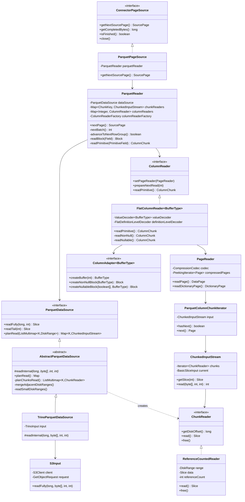
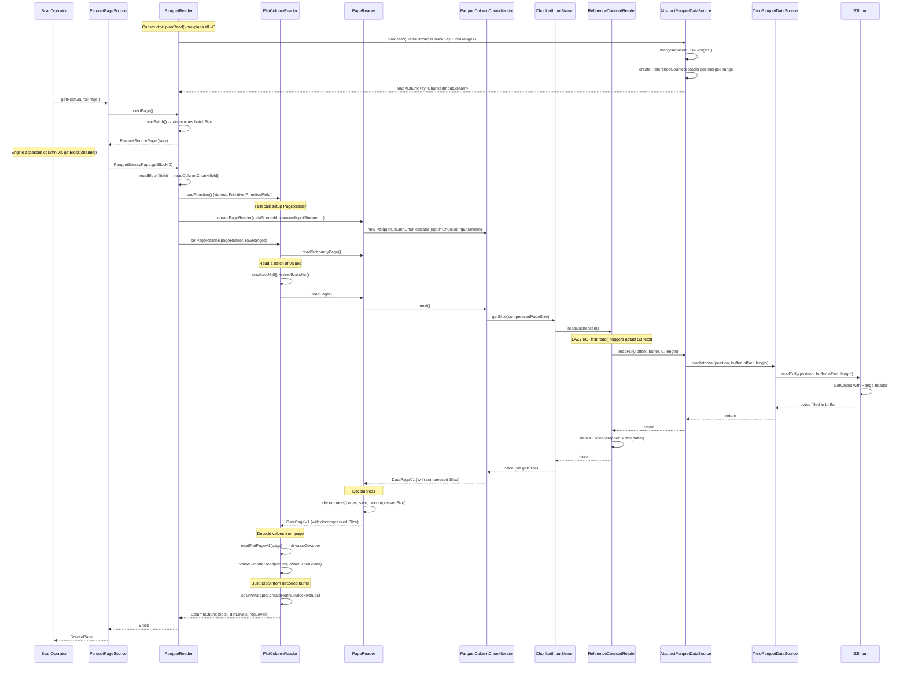

# Module Teardown: Physical Data Mapping -- The S3 Bridge (Task 1.4.A)

## 0. Research Focus
* **Task ID:** 1.4.A
* **Focus:** Trace the full path of an S3 read through the Parquet/Iceberg stack. How does Trino pull a range of bytes from an object store into a `Slice`? How does the format reader extract values to populate typed arrays and ultimately emit a `Page`? What are all the intermediate representations between raw bytes and columnar in-memory data?

---

## 1. High-Level Overview

### Core Responsibility
This module chain implements the **physical data bridge** -- the transformation of remote columnar file bytes (Parquet on S3) into Trino's in-memory columnar `Page` objects. It is the lowest layer in the read path, sitting below the query execution engine and above the object store SDK.

### Key Triggers
1. The `ScanOperator` calls `ConnectorPageSource.getNextSourcePage()` on the page source created by `IcebergPageSourceProvider`.
2. This triggers `ParquetReader.nextPage()`, which drives batch-at-a-time reading from the Parquet column chunk streams.
3. The column chunk streams are backed by `ChunkReader` objects whose `read()` methods lazily issue S3 `GetObject` range requests.

### The Five-Stage Pipeline
```
S3 Bytes --> Slice --> Decompressed Slice --> ValueDecoder --> typed array (long[]/int[]/BinaryBuffer) --> Block --> Page
```

Each stage has a distinct Java type and responsibility:

| Stage | Representation | Owner |
|-------|---------------|-------|
| 1. Remote bytes | HTTP range response `byte[]` | `S3Input` / `TrinoInput` |
| 2. Raw column chunk | `Slice` (via `Slices.wrappedBuffer`) | `ChunkReader` / `ReferenceCountedReader` |
| 3. Decompressed page | `Slice` (new allocation if compressed) | `PageReader.readPage()` |
| 4. Decoded values | `long[]` / `int[]` / `BinaryBuffer` etc. | `ValueDecoder` + `ColumnAdapter` |
| 5. Trino Page | `Block[]` inside `SourcePage` | `ParquetReader.ParquetSourcePage` |

---

## 2. Structural Architecture

### Primary Source Files

| File | Lines | Role |
|------|-------|------|
| `ConnectorPageSource.java` | 98 | SPI interface -- `getNextSourcePage()` contract |
| `ParquetDataSource.java` | 53 | Interface for reading bytes from Parquet files |
| `AbstractParquetDataSource.java` | 361 | Merges/plans disk ranges, creates `ChunkReader`s |
| `TrinoParquetDataSource.java` | 74 | Bridges `TrinoInput` (S3/HDFS) to `AbstractParquetDataSource` |
| `S3Input.java` | 123 | Issues S3 `GetObject` HTTP range requests |
| `DiskRange.java` | 50 | Value record: `(offset, length)` in the file |
| `ChunkReader.java` | 39 | Interface: lazy `Slice read()` + `free()` |
| `ChunkedInputStream.java` | 154 | Stitches multiple `ChunkReader`s into a continuous stream |
| `ParquetColumnChunkIterator.java` | 256 | Parses Thrift page headers from `ChunkedInputStream` |
| `PageReader.java` | 245 | Decompresses pages, manages dictionary pages |
| `ParquetReader.java` | 881 | Core orchestrator -- batch sizing, row groups, column dispatch |
| `FlatColumnReader.java` | 478 | Decodes flat (non-nested) columns from pages |
| `AbstractColumnReader.java` | 180 | Base class for dictionary handling and value decoder creation |
| `ColumnReaderFactory.java` | 319 | Type-driven factory for column readers |
| `ParquetPageSource.java` | 130 | Thin adapter: `ConnectorPageSource` -> `ParquetReader` |
| `IcebergPageSourceProvider.java` | 1924 | Creates the full page source pipeline for Iceberg |

### Key Data Structures

**DiskRange** -- The fundamental I/O unit.
```java
// io.trino.parquet.DiskRange (record)
public record DiskRange(long offset, long length) {
    public long end() { return offset + length; }
    public boolean contains(DiskRange diskRange) { ... }
    public DiskRange span(DiskRange otherDiskRange) { ... }  // merge two ranges
}
```

**ChunkKey** -- Indexes a column chunk within a row group.
```java
// io.trino.parquet.ChunkKey
public class ChunkKey {
    private final int column;   // PrimitiveField.getId()
    private final int rowGroup; // index into rowGroups list
}
```

**ChunkReader** -- Lazy, reference-counted byte reader.
```java
// io.trino.parquet.ChunkReader
public interface ChunkReader {
    long getDiskOffset();
    Slice read() throws IOException;    // lazy -- first call triggers I/O
    void free();                        // decrements reference count
}
```

**ColumnChunk** -- The output of a column reader: a `Block` plus Parquet definition/repetition levels.
```java
// io.trino.parquet.reader.ColumnChunk
public class ColumnChunk {
    private final Block block;
    private final int[] definitionLevels;
    private final int[] repetitionLevels;
    private OptionalLong maxBlockSize;
}
```

**ColumnAdapter\<BufferType\>** -- Type-erased bridge between raw decode buffers and Trino Blocks.
```java
// io.trino.parquet.reader.flat.ColumnAdapter<BufferType>
public interface ColumnAdapter<BufferType> {
    BufferType createBuffer(int size);
    Block createNullableBlock(boolean[] nulls, BufferType values);
    Block createNonNullBlock(BufferType values);
    void unpackNullValues(BufferType source, BufferType dest, boolean[] isNull, ...);
    void decodeDictionaryIds(BufferType values, int offset, int length, int[] ids, BufferType dictionary);
}
```

Concrete adapters and their buffer types:

| Adapter | BufferType | Block Type Created |
|---------|-----------|-------------------|
| `LongColumnAdapter` | `long[]` | `LongArrayBlock` |
| `IntColumnAdapter` | `int[]` | `IntArrayBlock` |
| `ShortColumnAdapter` | `short[]` | `ShortArrayBlock` |
| `ByteColumnAdapter` | `byte[]` | `ByteArrayBlock` |
| `Int128ColumnAdapter` | `long[]` (pairs) | `Int128ArrayBlock` |
| `Fixed12ColumnAdapter` | `long[]` + `int[]` | `Fixed12Block` |
| `BinaryColumnAdapter` | `BinaryBuffer` | `VariableWidthBlock` |

### Class Diagram



---

## 3. Execution & Call Flow

### 3.1 Full End-to-End Sequence



### 3.2 Stage 1: I/O Planning (Constructor Time)

When the `ParquetReader` constructor runs, it **eagerly plans all I/O** for every column in every row group. This is the most critical planning step.

```java
// ParquetReader constructor, lines 208-248
ListMultimap<ChunkKey, DiskRange> ranges = ArrayListMultimap.create();
for (int rowGroup = 0; rowGroup < rowGroups.size(); rowGroup++) {
    PrunedBlockMetadata blockMetadata = rowGroups.get(rowGroup).prunedBlockMetadata();
    for (PrimitiveField field : primitiveFields) {
        ColumnChunkMetadata chunkMetadata = blockMetadata.getColumnChunkMetaData(field.getDescriptor());
        long startingPosition = chunkMetadata.getStartingPos();
        long totalLength = chunkMetadata.getTotalSize();
        // ... column index filtering logic ...
        DiskRange range = new DiskRange(startingPosition, totalLength);
        ranges.put(new ChunkKey(columnId, rowGroup), range);
    }
}
// This single call plans ALL I/O for all row groups
this.chunkReaders = dataSource.planRead(ranges, memoryContext);
```

The `planRead` implementation in `AbstractParquetDataSource` performs three key optimizations:

**1. Split large ranges** (> `maxBufferSize`, default 8MB):
```java
// AbstractParquetDataSource.planChunksRead, line 155-162
if (entry.getValue().length() <= options.getMaxBufferSize().toBytes()) {
    smallRangesBuilder.put(entry);
} else {
    largeRangesBuilder.putAll(entry.getKey(), splitLargeRange(entry.getValue()));
}
```

**2. Merge adjacent small ranges** (within `maxMergeDistance`, default 1MB):
```java
// AbstractParquetDataSource.mergeAdjacentDiskRanges, lines 260-293
// Sorts ranges by offset, then merges adjacent ranges if:
//   - merged.length <= maxReadSizeBytes (8MB)
//   - gap between ranges <= maxMergeDistanceBytes (1MB)
if (!blockTooLong && merged.length() <= maxReadSizeBytes
        && last.end() + maxMergeDistanceBytes >= current.offset()) {
    last = merged;  // merge!
}
```

**3. Create reference-counted chunk readers** that share merged reads:
```java
// AbstractParquetDataSource.readSmallDiskRanges, lines 206-238
for (DiskRange mergedRange : mergedRanges) {
    ReferenceCountedReader mergedRangeLoader = new ReferenceCountedReader(mergedRange, memoryContext);
    for (Entry<K, DiskRange> diskRangeEntry : diskRanges.entries()) {
        DiskRange diskRange = diskRangeEntry.getValue();
        if (mergedRange.contains(diskRange)) {
            mergedRangeLoader.addReference();
            slices.put(diskRangeEntry.getKey(), new ChunkReader() {
                @Override
                public Slice read() throws IOException {
                    int offset = toIntExact(diskRange.offset() - mergedRange.offset());
                    return mergedRangeLoader.read().slice(offset, toIntExact(diskRange.length()));
                }
                // ...
            });
        }
    }
}
```

This means multiple column chunks that are close together on disk share a single S3 read. The `ChunkReader.read()` returns a **sub-slice** of the merged read.

### 3.3 Stage 2: S3 Byte Range Read (Lazy, On-Demand)

The actual S3 read is deferred until the first `ChunkReader.read()` call. The `ReferenceCountedReader` implements this:

```java
// AbstractParquetDataSource.ReferenceCountedReader, lines 318-335
@Override
public Slice read() throws IOException {
    checkState(referenceCount > 0, "Chunk reader is already closed");
    if (data == null) {  // LAZY: only fetches once
        byte[] buffer = new byte[toIntExact(range.length())];
        readerMemoryUsage.setBytes(buffer.length);
        readFully(range.offset(), buffer, 0, buffer.length);
        data = Slices.wrappedBuffer(buffer);
    }
    return data;
}
```

The `readFully` chain proceeds:
1. `AbstractParquetDataSource.readFully(long, byte[], int, int)` -- times the read, accumulates `readBytes`
2. `TrinoParquetDataSource.readInternal(long, byte[], int, int)` -- delegates to `TrinoInput`, collects stats
3. `S3Input.readFully(long, byte[], int, int)` -- issues the actual HTTP range request:

```java
// S3Input.readFully, lines 49-68
public void readFully(long position, byte[] buffer, int offset, int length) throws IOException {
    String range = "bytes=" + position + "-" + ((position + length) - 1);
    GetObjectRequest rangeRequest = request.toBuilder().range(range).build();
    int n = read(buffer, offset, length, rangeRequest);
    if (n < length) {
        throw new EOFException(...);
    }
}

private int read(byte[] buffer, int offset, int length, GetObjectRequest rangeRequest) throws IOException {
    return client.getObject(rangeRequest, (_, inputStream) -> {
        try (inputStream) {
            return inputStream.readNBytes(buffer, offset, length);
        }
    });
}
```

**Key insight:** Each S3 `GetObject` is a **synchronous, blocking** HTTP call with a `Range` header. The bytes are read directly into a pre-allocated `byte[]`, then wrapped into a `Slice` via `Slices.wrappedBuffer(buffer)` -- a zero-copy operation that just wraps the existing array.

### 3.4 Stage 3: ChunkedInputStream and Page Parsing

The `ChunkedInputStream` stitches multiple `ChunkReader`s into a continuous byte stream. A column chunk may be split across multiple 8MB reads, but the page headers and page data need to be read as a continuous stream.

```java
// ChunkedInputStream.getSlice, lines 55-79
public Slice getSlice(int length) throws IOException {
    while (!current.isReadable()) {
        checkArgument(chunks.hasNext(), "Requested %s bytes but 0 was available", length);
        readNextChunk();  // triggers lazy ChunkReader.read()
    }
    if (current.available() >= length) {
        return current.readSlice(length);  // zero-copy slice within current chunk
    }
    // requested length crosses the slice boundary -- must copy
    byte[] bytes = new byte[length];
    int read = this.readNBytes(bytes, 0, bytes.length);
    return Slices.wrappedBuffer(bytes);
}
```

The `ParquetColumnChunkIterator` reads page headers from this stream using Thrift deserialization, then reads the page data as a `Slice`:

```java
// ParquetColumnChunkIterator.readDataPageV1, lines 202-221
private DataPageV1 readDataPageV1(PageHeader pageHeader, int uncompressedPageSize,
        int compressedPageSize, OptionalLong firstRowIndex, int pageIndex) throws IOException {
    DataPageHeader dataHeaderV1 = pageHeader.getData_page_header();
    valueCount += dataHeaderV1.getNum_values();
    return new DataPageV1(
            input.getSlice(compressedPageSize),  // <-- reads compressed page bytes
            dataHeaderV1.getNum_values(),
            uncompressedPageSize,
            firstRowIndex,
            // ... encodings ...
            pageIndex);
}
```

### 3.5 Stage 4: Decompression in PageReader

The `PageReader.readPage()` method decompresses each data page:

```java
// PageReader.readPage, lines 137-185
public DataPage readPage() {
    Page compressedPage = compressedPages.next();
    Slice slice = decryptSliceIfNeeded(compressedPage.getSlice(), dataPageAad);
    if (compressedPage instanceof DataPageV1 dataPageV1) {
        return new DataPageV1(
                !arePagesCompressed() ? slice
                    : decompress(dataSourceId, codec, slice, dataPageV1.getUncompressedSize()),
                // ... other fields preserved ...
        );
    }
    // DataPageV2: only data portion is compressed (not def/rep levels)
}
```

The `decompress` method in `ParquetCompressionUtils` dispatches to codec-specific decompressors (Snappy, ZSTD, LZ4, GZIP), all of which allocate a new `byte[]` and return a `Slice` wrapping it.

### 3.6 Stage 5: Value Decoding via FlatColumnReader

This is the core decoding loop. The `FlatColumnReader.readPrimitive()` method orchestrates reading a batch of values from one or more Parquet pages.

**For non-null columns (`readNonNull`):**
```java
// FlatColumnReader.readNonNull, lines 170-193
ColumnChunk readNonNull() {
    NonNullValuesBuffer<BufferType> valuesBuffer = createNonNullValuesBuffer(nextBatchSize);
    int remainingInBatch = nextBatchSize;
    int offset = 0;
    while (remainingInBatch > 0) {
        if (remainingPageValueCount == 0) {
            if (!readNextPage()) { throwEndOfBatchException(remainingInBatch); }
        }
        if (skipToRowRangesStart()) { continue; }
        int chunkSize = rowRanges.advanceRange(Math.min(remainingPageValueCount, remainingInBatch));
        valuesBuffer.readNonNullValues(valueDecoder, offset, chunkSize);
        offset += chunkSize;
        remainingInBatch -= chunkSize;
        remainingPageValueCount -= chunkSize;
    }
    return valuesBuffer.createNonNullBlock(field.getType());
}
```

**For nullable columns (`readNullable`):**
```java
// FlatColumnReader.readNullable, lines 140-167
ColumnChunk readNullable() {
    NullableValuesBuffer<BufferType> valuesBuffer = createNullableValuesBuffer(nextBatchSize);
    boolean[] isNull = new boolean[nextBatchSize];
    int remainingInBatch = nextBatchSize;
    int offset = 0;
    while (remainingInBatch > 0) {
        if (remainingPageValueCount == 0) {
            if (!readNextPage()) { throwEndOfBatchException(remainingInBatch); }
        }
        if (skipToRowRangesStart()) { continue; }
        int chunkSize = rowRanges.advanceRange(Math.min(remainingPageValueCount, remainingInBatch));
        int nonNullCount = definitionLevelDecoder.readNext(isNull, offset, chunkSize);
        valuesBuffer.readNullableValues(valueDecoder, isNull, offset, nonNullCount, chunkSize);
        offset += chunkSize;
        remainingInBatch -= chunkSize;
        remainingPageValueCount -= chunkSize;
    }
    return valuesBuffer.createNullableBlock(isNull, field.getType());
}
```

**Page initialization** sets up the value decoder from the decompressed `Slice`:

```java
// FlatColumnReader.readFlatPageV1, lines 278-298
private void readFlatPageV1(DataPageV1 page) {
    Slice buffer = page.getSlice();  // decompressed page data
    // Parse definition levels (RLE encoded)
    int maxDefinitionLevel = field.getDescriptor().getMaxDefinitionLevel();
    definitionLevelDecoder = definitionLevelDecoderProvider.create(maxDefinitionLevel);
    if (maxDefinitionLevel > 0) {
        int bufferSize = buffer.getInt(0);
        definitionLevelDecoder.init(buffer.slice(Integer.BYTES, bufferSize));
        alreadyRead = bufferSize + Integer.BYTES;
    }
    // Create value decoder pointing at remaining data
    valueDecoder = createValueDecoder(decodersProvider, page.getValueEncoding(),
            buffer.slice(alreadyRead, buffer.length() - alreadyRead));
}
```

### 3.7 Stage 6: ValueDecoder to Typed Buffer

The `ValueDecoder.read(T values, int offset, int length)` method decodes Parquet-encoded data directly into a typed Java array. For example, `LongPlainValueDecoder`:

```java
// PlainValueDecoders.LongPlainValueDecoder
public void read(long[] values, int offset, int length) {
    input.readLongs(values, offset, length);  // bulk copy from Slice
}
```

The `SimpleSliceInputStream.readLongs` performs a bulk memory copy:
```java
// SimpleSliceInputStream.readLongs
public void readLongs(long[] output, int outputOffset, int length) {
    slice.getLongs(offset, output, outputOffset, length);  // sun.misc.Unsafe bulk copy
    offset += length * Long.BYTES;
}
```

### 3.8 Stage 7: Typed Buffer to Block

The `ColumnAdapter` creates the final `Block` from the decoded buffer:

```java
// LongColumnAdapter.createNonNullBlock
public Block createNonNullBlock(long[] values) {
    return new LongArrayBlock(values.length, Optional.empty(), values);
}

// LongColumnAdapter.createNullableBlock
public Block createNullableBlock(boolean[] nulls, long[] values) {
    return new LongArrayBlock(values.length, Optional.of(nulls), values);
}
```

For variable-width types, `BinaryColumnAdapter` creates `VariableWidthBlock`:
```java
// BinaryColumnAdapter.createNonNullBlock
public Block createNonNullBlock(BinaryBuffer values) {
    return new VariableWidthBlock(values.getValueCount(), values.asSlice(),
            values.getOffsets(), Optional.empty());
}
```

### 3.9 Stage 8: Block to SourcePage (Lazy Assembly)

The `ParquetReader.ParquetSourcePage` uses **lazy block loading**. Blocks are not read until `getBlock(channel)` is called:

```java
// ParquetReader.ParquetSourcePage.getBlock, lines 348-371
public Block getBlock(int channel) {
    checkState(currentPageId == expectedPageId, "Parquet reader has been advanced beyond block");
    Block block = blocks[channel];
    if (block == null) {
        if (channel == rowNumberColumnIndex) {
            block = selectedPositions.createRowNumberBlock(lastBatchStartRow());
        } else {
            block = readBlock(columnFields.get(channel).field());  // <-- LAZY read
            block = selectedPositions.apply(block);  // apply row-level filtering
        }
        blocks[channel] = block;
        sizeInBytes += block.getSizeInBytes();
    }
    return block;
}
```

This means columns that are projected but not consumed by any downstream operator are **never read from S3**.

### 3.10 Batch Size Adaptation

The `ParquetReader` adaptively adjusts batch size based on actual data sizes:

```java
// ParquetReader.readPrimitive, lines 718-727
double bytesPerCell = ((double) columnChunk.getMaxBlockSize()) / batchSize;
double bytesPerCellDelta = bytesPerCell - maxBytesPerCell.getOrDefault(fieldId, 0.0);
if (bytesPerCellDelta > 0) {
    maxCombinedBytesPerRow += bytesPerCellDelta;
    maxBatchSize = toIntExact(min(maxBatchSize,
            max(1, (long) (options.getMaxReadBlockSize().toBytes() / maxCombinedBytesPerRow))));
    maxBytesPerCell.put(fieldId, bytesPerCell);
}
```

The initial batch size starts at 1 and doubles each batch, capped at `maxReadBlockRowCount` (default 8192) and dynamically reduced based on observed bytes-per-row to keep each `Page` under `maxReadBlockSize` (default 16MB).

```java
// ParquetReader.nextBatch, lines 453-467
batchSize = min(nextBatchSize, maxBatchSize);
nextBatchSize = min(batchSize * BATCH_SIZE_GROWTH_FACTOR, options.getMaxReadBlockRowCount());
batchSize = toIntExact(min(batchSize, currentGroupRowCount - nextRowInGroup));
```

---

## 4. Concurrency & State Management

### Threading Model

The entire read path is **single-threaded per split**. There is no parallelism within a single `ParquetReader`:
- One split = one `ParquetReader` = one `ParquetPageSource` = one thread
- S3 reads are synchronous and blocking (AWS SDK v2 sync client)
- No async I/O, no futures, no read-ahead within a single reader
- Parallelism comes from the Trino engine assigning different splits to different threads

### I/O Prefetching Strategy

Trino's I/O planning is **eager** but **lazy in execution**:
- At `ParquetReader` construction time, `planRead()` maps ALL column chunks for ALL row groups to `ChunkReader` objects
- The `ChunkReader.read()` is lazy -- the actual S3 call happens on first access
- Adjacent disk ranges are merged at planning time, so the first access to any column in a merged range fetches all of them
- There is no separate prefetch thread -- the query thread does the I/O

### State Machine

The `ParquetReader` has a two-level iteration state:
1. **Row group level:** `currentRowGroup` advances through `rowGroups` list
2. **Batch level within row group:** `nextRowInGroup` advances by `batchSize` each call to `nextBatch()`

Each `FlatColumnReader` has its own page-level state:
- `remainingPageValueCount` -- values left in the current decoded page
- `readOffset` / `nextBatchSize` -- accumulated seek distance and requested batch size
- `valueDecoder` -- positioned decoder for the current page's data

### Reference Counting

The `ReferenceCountedReader` manages shared merged reads:
- Starts with `referenceCount = 1` (the merged range itself)
- `addReference()` called for each sub-range that shares this read
- Initial reference freed after setup (`mergedRangeLoader.free()` at line 239)
- Each sub-range `ChunkReader.free()` decrements the count
- When `referenceCount` reaches 0, `data = null` releases the `Slice` and resets memory accounting

---

## 5. Memory & Resource Profile

### Buffer Allocation Points

| Allocation | Size | Lifetime | Memory Tracked? |
|-----------|------|----------|----------------|
| S3 read buffer | Merged range size (up to 8MB) | Until all ChunkReaders freed | Yes, via `LocalMemoryContext` |
| Decompressed page | `page.getUncompressedSize()` | Until next page read in same column | Yes, via `FlatColumnReader.memoryContext` |
| Value decode buffer | `batchSize * typeWidth` | Until Block created | No (short-lived) |
| Block (output) | `batchSize * typeWidth` + nulls | Until Page consumed by engine | Yes (via Block.getSizeInBytes) |
| Dictionary | Varies | Lifetime of column chunk | Yes, via `dictionaryDecoder.getRetainedSizeInBytes()` |

### Key Size Defaults (ParquetReaderOptions)

| Parameter | Default | Purpose |
|-----------|---------|---------|
| `maxReadBlockSize` | 16 MB | Target max size per Page (in bytes) |
| `maxReadBlockRowCount` | 8192 | Max rows per batch |
| `maxMergeDistance` | 1 MB | Max gap to bridge when merging adjacent ranges |
| `maxBufferSize` | 8 MB | Max size of a single I/O read |
| `maxFooterReadSize` | 15 MB | Max Parquet footer read |
| `maxPageReadSize` | 500 MB | Max allowed Parquet page size (corruption guard) |
| `smallFileThreshold` | 3 MB | Files below this are read in one shot |

### Memory Accounting

Memory is tracked via `AggregatedMemoryContext`:
- `ParquetReader` owns a root `memoryContext`
- Each row group gets its own `currentRowGroupMemoryContext` (freed on group transition)
- Each `ReferenceCountedReader` gets a `LocalMemoryContext` for its S3 buffer
- Each `FlatColumnReader` gets a `LocalMemoryContext` for decompressed page + dictionary data

The `ParquetPageSource.getMemoryUsage()` reports the aggregated total:
```java
public long getMemoryUsage() {
    return parquetReader.getMemoryContext().getBytes();
}
```

### Resource Lifecycle

1. **Row group transition:** `freeCurrentRowGroupBuffers()` closes all `ChunkedInputStream` objects for the previous row group, which frees all `ChunkReader`s
2. **Close:** `ParquetReader.close()` releases all remaining column readers, memory contexts, and chunked streams, then closes the data source

---

## 6. Key Design Insights

* **Eager planning, lazy execution separates I/O strategy from I/O timing.** The `planRead()` call at construction time determines WHAT will be read (with merge optimization), but the actual S3 calls happen lazily when a `ChunkReader.read()` is first invoked. This allows the engine to skip columns entirely if they are projected but never accessed by downstream operators (via the `ParquetSourcePage` lazy block loading).

* **Merge-adjacent-ranges is the primary I/O optimization for object stores.** Unlike local SSDs where small random reads are cheap, S3 has high per-request latency (~5-50ms). By merging column chunks within 1MB of each other into a single range request, Trino dramatically reduces the number of HTTP round-trips. The `ReferenceCountedReader` pattern allows multiple logical column chunks to share a single physical read, with each getting a zero-copy sub-slice.

* **The decode path is columnar all the way down, avoiding row-at-a-time processing.** Values are decoded in bulk: `valueDecoder.read(long[] values, offset, length)` copies a contiguous run of values from the Parquet page directly into a typed Java array. This array is then wrapped (zero-copy) into a `Block`. There is no intermediate row materialization or per-value boxing.

* **Blocks are created zero-copy from decode buffers via the ColumnAdapter abstraction.** `LongColumnAdapter.createNonNullBlock(long[] values)` wraps the exact same `long[]` that the `ValueDecoder` wrote into. No copy occurs. The `ColumnAdapter<BufferType>` interface is the key abstraction that maps Parquet physical types to Trino Block types while enabling this zero-copy pattern. The type parameter `BufferType` erases the specific buffer type (`long[]`, `int[]`, `BinaryBuffer`, etc.).

* **Null handling uses a separate definition level decoder with a two-buffer shuffle.** For nullable columns, nulls are decoded separately via `definitionLevelDecoder.readNext(isNull, offset, chunkSize)` which populates a `boolean[]`. Non-null values are decoded into a compact temporary buffer, then "unpacked" into the final buffer using the null mask via `columnAdapter.unpackNullValues()`. This avoids wasting decode effort on null positions while keeping the final block layout contiguous.

* **Dictionary optimization spans the entire column chunk, not just individual pages.** When `pageReader.hasOnlyDictionaryEncodedPages()` is true, the `FlatColumnReader` switches to `DictionaryValuesBuffer` mode, reading only dictionary IDs (int[]) and wrapping the result in a `DictionaryBlock`. This avoids materializing the full values and is especially beneficial for low-cardinality string columns. The check ensures the entire chunk (all pages) uses dictionary encoding before committing to this path.

* **The batch size auto-tunes based on observed data density.** Starting at 1 row and doubling each batch, the `ParquetReader` tracks the maximum bytes-per-cell for each primitive column. When combined bytes-per-row exceeds `maxReadBlockSize / batchSize`, it reduces the batch size. This prevents OOM for wide-value columns (large strings) while maintaining good vectorization for narrow-value columns (integers).

---

## 7. Porting Considerations (Java -> Target Architecture)

### Translation Blockers

| Java Pattern | Challenge | Impact |
|-------------|-----------|--------|
| `Slice` backed by `byte[]` via Unsafe | Rust has no direct equivalent of sun.misc.Unsafe pointer arithmetic | Need to choose between `bytes::Bytes`, raw `Vec<u8>`, or custom arena |
| Lazy block loading via inner class capturing `this` | Rust closures cannot capture mutable self | Requires explicit state machine or `Rc<RefCell<...>>` |
| `ColumnAdapter<BufferType>` generic interface | Rust trait objects cannot have associated type parameters easily | Use enum dispatch or separate trait per buffer type |
| Reference-counted `ChunkReader` with shared `Slice` sub-slicing | Rust sub-slicing with shared ownership | `bytes::Bytes` supports zero-copy slicing with Arc-based refcount |
| `ChunkedInputStream` extending `InputStream` | Java's blocking InputStream model | Replace with `AsyncRead` + `Stream<Bytes>` for async I/O |
| AWS SDK sync `GetObject` | Blocking I/O in async context | Use `aws-sdk-s3` with Tokio `AsyncRead` |

### Recommended Rust Abstractions

| Trino Java | Recommended Rust | Rationale |
|-----------|-----------------|-----------|
| `Slice` (byte buffer) | `bytes::Bytes` | Arc-based refcount, zero-copy slicing, no Unsafe needed |
| `ChunkReader` + `ReferenceCountedReader` | `Bytes` with `slice()` | `Bytes::slice()` is already refcounted, matching the Java semantics |
| `ChunkedInputStream` | `impl Stream<Item=Bytes>` or `AsyncRead` | Async stream of chunks from object store |
| `S3Input.readFully` | `aws_sdk_s3::Client::get_object` + `ByteStream` | Native async, streaming response body |
| `ColumnAdapter<T>` | Enum `ColumnBuffer { Long(Vec<i64>), Int(Vec<i32>), Binary(Vec<u8>, Vec<usize>) }` | Enum dispatch avoids trait object boxing, matches fixed set of types |
| `ValueDecoder<T>` | Trait `ValueDecoder { fn read(&mut self, buf: &mut ColumnBuffer, offset: usize, len: usize) }` | Trait with enum buffer avoids generic proliferation |
| `Block` (multiple concrete types) | Enum `Block { Int64(Vec<i64>, Option<Vec<bool>>), ... }` or Arrow `ArrayRef` | Consider Apache Arrow arrays for interop; enum for performance |
| `ParquetSourcePage` (lazy blocks) | `Vec<OnceCell<Block>>` or `Vec<Option<Block>>` | `OnceCell` gives lazy-init semantics without closures |
| `AggregatedMemoryContext` | Custom allocator tracking or `jemalloc` stats | Rust does not have built-in memory accounting; need explicit tracking |
| `DiskRange` merging | Direct port -- pure algorithm | Straightforward translation of merge logic |

### Async I/O Opportunity

The biggest architectural win in a Rust port would be **async I/O with prefetching**. Trino's Java implementation is synchronous -- each `ChunkReader.read()` blocks the query thread on S3 latency. A Rust implementation could:

1. Use `tokio::spawn` to prefetch the next row group's column chunks while processing the current one
2. Use `aws_sdk_s3` async `get_object` with byte-range requests
3. Buffer prefetched chunks in a bounded channel, providing backpressure when memory is tight
4. This would hide S3 latency (~5-50ms per request) behind computation time

### Critical Path for Correctness

The ordering constraints that must be preserved:
1. DiskRanges for the same ChunkKey must be read and stitched in file order (enforced by `slices.orderValuesBy(comparingLong(ChunkReader::getDiskOffset))`)
2. Dictionary page must be the first page read from a column chunk
3. Definition levels must be decoded before values (they determine which positions are null)
4. Row ranges filtering must be applied consistently across all columns in a row group
