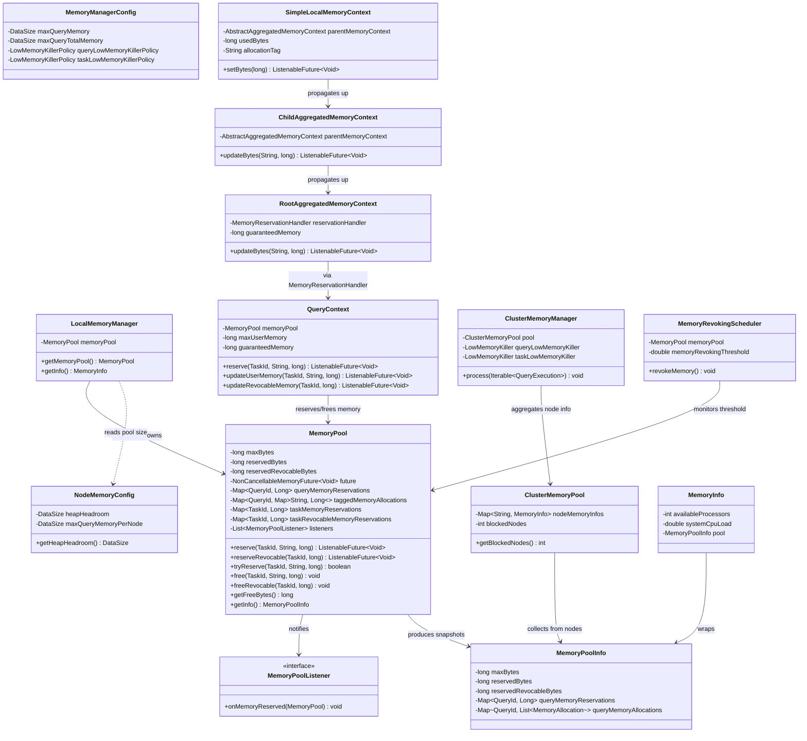
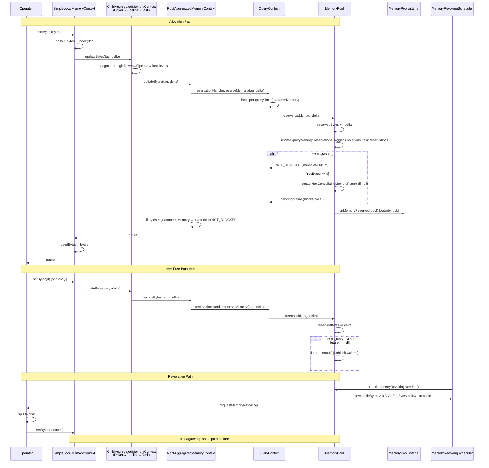

# Module Teardown: Global Memory Pools (MemoryPool)

## 0. Research Focus
* **Task ID:** 5.1.A
* **Focus:** How does the worker track total JVM memory? Analyze the concept of reserved vs. general pools (if applicable to the current Trino version).

## 1. High-Level Overview
* **Core Responsibility:** `MemoryPool` is the single, unified per-node memory accounting system that tracks all query/task memory reservations on a Trino worker. It enforces a hard ceiling (`maxBytes`), distinguishes between **non-revocable** (regular) and **revocable** (spillable) reservations, and blocks callers via `ListenableFuture` when the pool is exhausted. Trino 480 does **not** have separate "general" and "reserved" pools — the old dual-pool design was removed in favor of this single-pool model.
* **Key Triggers:** Operator-level `setBytes()` calls propagate up the hierarchical memory tracking context tree (Operator → Driver → Pipeline → Task → Query) until they reach `QueryContext`, which calls `MemoryPool.reserve()` or `MemoryPool.tryReserve()`. Memory is freed symmetrically via `MemoryPool.free()`. The `MemoryRevokingScheduler` triggers revocation when usage crosses a configurable threshold.

## 2. Structural Architecture
* **Primary Source Files:**
  - `core/trino-main/src/main/java/io/trino/memory/MemoryPool.java` — the pool itself
  - `core/trino-main/src/main/java/io/trino/memory/LocalMemoryManager.java` — creates and owns the single pool per node
  - `core/trino-main/src/main/java/io/trino/memory/QueryContext.java` — per-query context, bridges the tracking tree to the pool
  - `core/trino-main/src/main/java/io/trino/memory/ClusterMemoryManager.java` — coordinator-side, aggregates all nodes' pool info, drives low-memory killing
  - `core/trino-main/src/main/java/io/trino/memory/MemoryManagerConfig.java` — query-level memory config properties
  - `core/trino-main/src/main/java/io/trino/memory/NodeMemoryConfig.java` — node-level pool sizing config
  - `core/trino-main/src/main/java/io/trino/memory/MemoryPoolListener.java` — listener interface
  - `core/trino-main/src/main/java/io/trino/memory/MemoryInfo.java` — wraps `MemoryPoolInfo` with system metrics
  - `core/trino-spi/src/main/java/io/trino/spi/memory/MemoryPoolInfo.java` — serializable snapshot of pool state
  - `core/trino-spi/src/main/java/io/trino/spi/memory/MemoryAllocation.java` — per-operator allocation record
  - `core/trino-main/src/main/java/io/trino/execution/MemoryRevokingScheduler.java` — triggers operator memory revocation
  - `lib/trino-memory-context/src/main/java/io/trino/memory/context/RootAggregatedMemoryContext.java` — root of tracking tree, calls MemoryReservationHandler
  - `lib/trino-memory-context/src/main/java/io/trino/memory/context/ChildAggregatedMemoryContext.java` — intermediate tree nodes
  - `lib/trino-memory-context/src/main/java/io/trino/memory/context/SimpleLocalMemoryContext.java` — leaf-level operator allocation context

* **Key Data Structures:**
  - `ConcurrentHashMap<QueryId, Long> queryMemoryReservations` — total bytes reserved per query
  - `HashMap<QueryId, Map<String, Long>> taggedMemoryAllocations` — per-operator breakdown within each query (tag = operator type string)
  - `HashMap<TaskId, Long> taskMemoryReservations` — total bytes reserved per task
  - `HashMap<TaskId, Long> taskRevocableMemoryReservations` — revocable bytes per task
  - `NonCancellableMemoryFuture<Void> future` — shared blocking future, completed when free bytes > 0
  - `CopyOnWriteArrayList<MemoryPoolListener> listeners` — event subscribers notified on every reservation

### Class Diagram

## 3. Execution & Call Flow

### Sequence Diagram

* **Step-by-step text breakdown:**
  1. **Pool creation:** `LocalMemoryManager` reads `NodeMemoryConfig` and creates a single `MemoryPool` with `maxBytes = JVM max memory - heap headroom`. Default headroom is 30% of heap.
  2. **Query registration:** When a query starts on a worker, `SqlTaskManager` creates a `QueryContext` injected with the node's `MemoryPool` reference. `QueryContext.initializeMemoryLimits()` sets the per-query cap (or overcommits to pool max if `resourceOverCommit` is true).
  3. **Tracking tree construction:** `QueryContext` creates a `MemoryTrackingContext` for each task, with a `RootAggregatedMemoryContext` at the top connected to the pool via a `QueryMemoryReservationHandler`. As `TaskContext` → `PipelineContext` → `DriverContext` → `OperatorContext` are created, each adds a `ChildAggregatedMemoryContext` layer.
  4. **Operator allocation:** An operator calls `localUserMemoryContext().setBytes(n)`. `SimpleLocalMemoryContext` computes the delta and calls `parentMemoryContext.updateBytes(tag, delta)`, which cascades up through each `ChildAggregatedMemoryContext` until reaching the `RootAggregatedMemoryContext`.
  5. **Pool reservation:** `RootAggregatedMemoryContext` delegates to its `MemoryReservationHandler`, which calls `QueryContext.updateUserMemory()`, which calls `MemoryPool.reserve(taskId, tag, bytes)`. The pool atomically updates all tracking maps (`queryMemoryReservations`, `taggedMemoryAllocations`, `taskMemoryReservations`) and `reservedBytes`.
  6. **Blocking:** If `freeBytes <= 0` after the reservation, the pool creates (or reuses) a `NonCancellableMemoryFuture` and returns it. The calling operator is blocked from further processing until the future completes. If the query's total bytes are below `guaranteedMemory` (default 1MB), the `RootAggregatedMemoryContext` overrides the future to `NOT_BLOCKED` to prevent deadlock on trivial allocations.
  7. **Unblocking:** When any task calls `MemoryPool.free()` and `freeBytes` becomes positive, the pool calls `future.set(null)` to complete the shared future, unblocking all waiting operators.
  8. **Listener notification:** After every `reserve()`/`tryReserve()` call, `onMemoryReserved()` is called **outside** the synchronized block to notify `MemoryPoolListener` subscribers (used by `MemoryRevokingScheduler` and `ClusterMemoryManager`).
  9. **Revocation:** `MemoryRevokingScheduler` checks if `revocableBytes > 0 && freeBytes <= maxBytes * (1.0 - threshold)`. If so, it traverses the query context tree and calls `OperatorContext.requestMemoryRevoking()`, which sets a flag on operators with revocable memory. Operators respond by spilling state to disk and reducing their memory footprint.
  10. **Low-memory killing (coordinator):** `ClusterMemoryManager` periodically aggregates `MemoryPoolInfo` from all nodes. If any node has `blockedNodes > 0`, it invokes the configured `LowMemoryKiller` policy. Default policy (`TOTAL_RESERVATION_ON_BLOCKED_NODES`) kills the query with the highest total reservation across blocked nodes.

## 4. Concurrency & State Management
* **Threading Model:** `MemoryPool` is a shared resource accessed by all driver threads on a worker node. It does not run on a dedicated thread — it is invoked inline by any thread executing an operator's `addInput()`/`getOutput()` path. `MemoryRevokingScheduler` runs on a dedicated scheduled executor thread.
* **State Machine:** No formal state machine. The pool has two effective states: **available** (`freeBytes > 0`, `future == null` or completed) and **exhausted** (`freeBytes <= 0`, pending `future` blocks callers). Transitions happen atomically within the synchronized block.
* **Synchronization:**
  - Most `MemoryPool` methods are `synchronized (this)` — a single intrinsic lock guards all mutable state.
  - `queryMemoryReservations` is a `ConcurrentHashMap` (supports read-mostly patterns; writes are still synchronized).
  - `listeners` uses `CopyOnWriteArrayList` for safe concurrent iteration during `onMemoryReserved()`.
  - **Critical design choice:** `onMemoryReserved()` is called **outside** the synchronized block to avoid listener-induced deadlock. The sequence is: acquire lock → update state → release lock → notify listeners.
  - `NonCancellableMemoryFuture` prevents cancellation to ensure cleanup operations always execute — `cancel()` throws `UnsupportedOperationException`.

## 5. Memory & Resource Profile
* **Allocation Pattern:** `MemoryPool` itself is a lightweight accounting object — it allocates no data buffers. Its overhead is the `HashMap`/`ConcurrentHashMap` entries for query/task/tag tracking. The real memory being tracked lives in operator data structures (hash tables, sort buffers, aggregation state). The pool merely enforces a soft ceiling by blocking or revoking when `reservedBytes + reservedRevocableBytes > maxBytes`.
* **Memory Tracking:** The pool **is** the tracking system. It maintains three levels of granularity:
  - **Query level:** `queryMemoryReservations` (total bytes per `QueryId`)
  - **Task level:** `taskMemoryReservations` and `taskRevocableMemoryReservations` (per `TaskId`)
  - **Operator level:** `taggedMemoryAllocations` (per `QueryId` × allocation tag string, e.g., `"HashBuilderOperator"`)
  - `MemoryPool.getInfo()` serializes all of this into a `MemoryPoolInfo` snapshot for reporting to the coordinator and JMX.

## 6. Key Design Insights

* **Single unified pool per node — no general/reserved split:** Trino 480 uses exactly one `MemoryPool` per worker, created by `LocalMemoryManager` with `maxBytes = JVM max memory - heap headroom (30%)`. The old dual-pool design (general + reserved) was removed. All queries share the same pool, with isolation enforced at the `QueryContext` level (per-query limits) rather than at the pool level. This simplifies the model: one lock, one set of counters, one blocking future.
* **Blocking via `NonCancellableMemoryFuture` — reserve bytes first, then block:** When `reserve()` is called and `freeBytes <= 0`, the pool **still records the reservation** (`reservedBytes += delta`), then returns a pending future. The operator is blocked but its memory is accounted for. This is critical: it means the pool can go negative on free bytes, but the bookkeeping is always accurate. `NonCancellableMemoryFuture` prevents callers from cancelling the future (throws `UnsupportedOperationException` on `cancel()`), ensuring that cleanup code always runs.
* **Listener notification outside the lock prevents deadlock:** `onMemoryReserved()` is called after releasing the `synchronized` block — never while holding the pool lock. This is a deliberate design choice documented in the code flow: acquire lock → update state → release lock → notify listeners. Since `MemoryRevokingScheduler` is a listener that traverses the entire context tree, calling it under the pool lock would risk deadlock with operator threads holding context locks and trying to reserve from the pool.
* **Guaranteed memory (1MB) prevents deadlock on trivial allocations:** `RootAggregatedMemoryContext.updateBytes()` overrides the pool's pending future to `NOT_BLOCKED` when the query's total tracked bytes are below `guaranteedMemory` (1MB). Without this, a query that hasn't even started processing could be permanently blocked because the pool is exhausted by other queries. The 1MB threshold ensures every query can make initial progress (read at least one page, initialize hash tables) regardless of pool state.
* **Three-level allocation tracking in a single data structure:** The pool maintains `queryMemoryReservations` (per-QueryId total), `taskMemoryReservations` (per-TaskId breakdown), and `taggedMemoryAllocations` (per-QueryId × operator-type-string attribution) — all updated atomically within the same `synchronized` block on every `reserve()` call. This enables diagnostics at query, task, and operator granularity from a single lock acquisition.

## 7. Porting Considerations (Java -> Target Architecture) *(Optional)*

* **Translation Blockers:**
  - **`synchronized` + `ListenableFuture` blocking model:** Java's intrinsic locks and Guava futures are deeply embedded. The blocking-future pattern (`reserve()` returns a future that the driver loop checks before proceeding) works because Java threads can park cheaply. In async Rust, blocking a thread is unacceptable.
  - **`ConcurrentHashMap` semantics:** Java's CHM provides fine-grained locking with atomic `merge()`/`compute()` operations that Rust's `DashMap` or `RwLock<HashMap>` approximate but don't replicate exactly.
  - **GC-dependent cleanup:** `queryMemoryReservations` entries are cleaned up when `free()` decrements to zero. There's no destructor pattern — callers must explicitly free. In Rust, RAII via `Drop` can provide stronger guarantees.

* **Recommended Abstractions:**
  - **`MemoryPool` → Rust struct with `Arc<Mutex<MemoryPoolInner>>`:** The single-lock design maps cleanly. Use `tokio::sync::Mutex` if pool operations need to be `.await`-ed. Consider a `parking_lot::Mutex` for the synchronous path since pool operations are fast (no I/O, just arithmetic + map updates).
  - **Blocking future → `tokio::sync::Notify` or `tokio::sync::watch`:** Replace `NonCancellableMemoryFuture` with a shared `Notify` or `watch::Receiver<bool>`. When `free()` makes bytes available, call `notify_waiters()`. Operators `await` the notification in their async `poll_next()`.
  - **Revocable vs non-revocable → two separate counters**, same as Java. Consider an enum `ReservationType { Regular, Revocable }` to make the API type-safe.
  - **Tagged allocations → `HashMap<QueryId, HashMap<String, i64>>`** — direct translation. The `String` tags could be interned or replaced with an enum of known operator types for efficiency.
  - **Guaranteed memory (1MB deadlock prevention) → `const GUARANTEED_MEMORY: usize = 1_048_576`** with the same logic: if total query bytes < threshold, never block.
  - **RAII memory guards:** Consider a `MemoryReservation` struct that implements `Drop` to call `pool.free()` automatically, eliminating the manual free calls that Java requires. This is strictly better than the Java pattern.
  - **Configuration → `NodeMemoryConfig` struct** with `pool_size = available_memory - heap_headroom`. Since Rust has no GC, "headroom" maps to memory reserved for stack allocations, temporary buffers, and OS overhead.
  - **`CoarseGrainLocalMemoryContext` optimization (64KB granularity):** Replicate this in Rust — only propagate to the pool when crossing a 64KB boundary. This significantly reduces lock contention under high-frequency small allocations.

### Key Configuration Properties

| Property | Default | Purpose |
|----------|---------|---------|
| `query.max-memory-per-node` | 30% of JVM heap | Per-query memory cap on a single worker |
| `memory.heap-headroom-per-node` | 30% of JVM heap | Reserved for GC and untracked allocations |
| `query.max-memory` | 20 GB | Global per-query memory limit (coordinator-enforced) |
| `query.max-total-memory` | 2x `query.max-memory` | Global per-query total (user + system) limit |
| `query.low-memory-killer.policy` | `TOTAL_RESERVATION_ON_BLOCKED_NODES` | Which query to kill when OOM |
| `task.low-memory-killer.policy` | `TOTAL_RESERVATION_ON_BLOCKED_NODES` | Which task to kill when OOM (fault-tolerant mode) |
