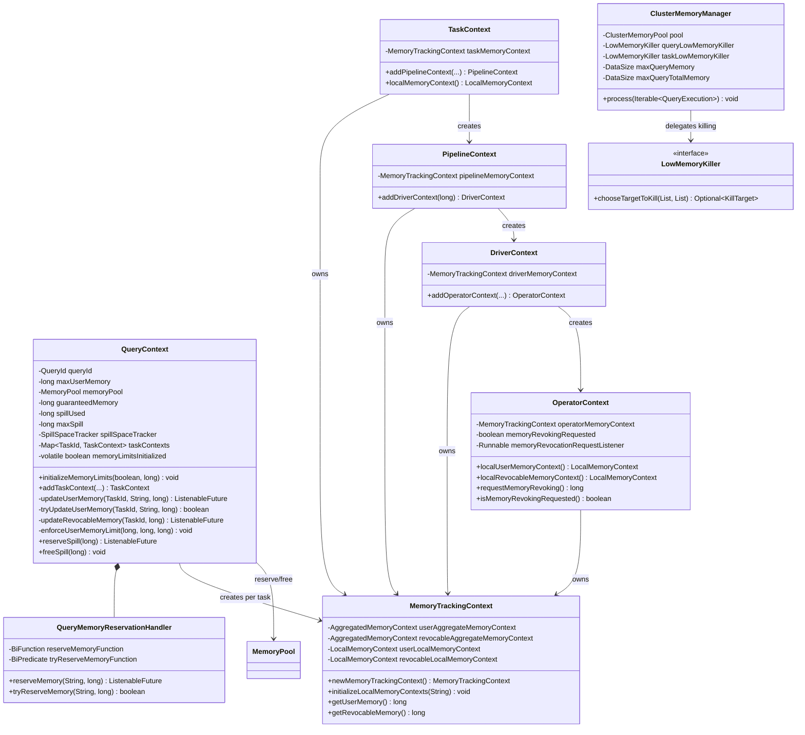
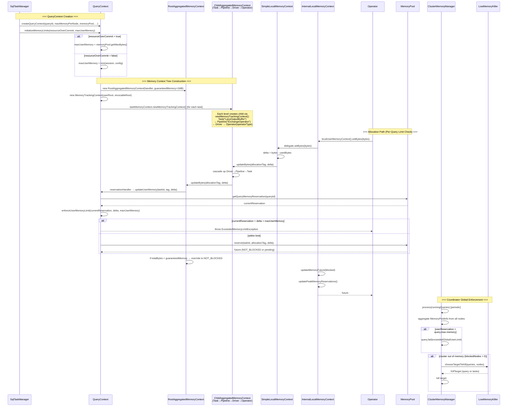

# Module Teardown: Query-Level Memory Tracking (QueryContext)

## 0. Research Focus
* **Task ID:** 5.1.B
* **Focus:** How does the worker isolate memory tracking per query to ensure one heavy query doesn't crash the worker?

## 1. High-Level Overview
* **Core Responsibility:** `QueryContext` is the per-query memory isolation boundary on each Trino worker. It sits between the operator-level memory tracking tree and the shared node-level `MemoryPool`, enforcing a per-query memory ceiling (`maxUserMemory`) so that no single query can exhaust the entire worker's memory. It also manages per-query spill tracking, GC monitoring, and creates the hierarchical `MemoryTrackingContext` tree (Task → Pipeline → Driver → Operator) that funnels all operator allocations through query-level limit checks before reaching the pool.
* **Key Triggers:** Operator `setBytes()`/`addBytes()` calls propagate up the `ChildAggregatedMemoryContext` chain until they hit the `RootAggregatedMemoryContext`, which calls `QueryContext.updateUserMemory()`. This method enforces the per-query limit and then delegates to `MemoryPool.reserve()`. On the coordinator side, `ClusterMemoryManager.process()` periodically enforces global per-query limits (`query.max-memory`, `query.max-total-memory`) and invokes low-memory killers when the cluster is out of memory.

## 2. Structural Architecture
* **Primary Source Files:**
  - `core/trino-main/src/main/java/io/trino/memory/QueryContext.java` — per-query isolation, limit enforcement, context tree factory
  - `core/trino-main/src/main/java/io/trino/memory/ClusterMemoryManager.java` — coordinator-side global limit enforcement and OOM killing
  - `core/trino-main/src/main/java/io/trino/memory/MemoryManagerConfig.java` — `query.max-memory`, `query.max-total-memory`, killer policies
  - `core/trino-main/src/main/java/io/trino/memory/NodeMemoryConfig.java` — `query.max-memory-per-node`, heap headroom
  - `core/trino-main/src/main/java/io/trino/memory/LowMemoryKiller.java` — killer interface
  - `core/trino-main/src/main/java/io/trino/memory/TotalReservationOnBlockedNodesQueryLowMemoryKiller.java` — default query killer
  - `core/trino-main/src/main/java/io/trino/memory/TotalReservationOnBlockedNodesTaskLowMemoryKiller.java` — default task killer
  - `core/trino-main/src/main/java/io/trino/memory/LeastWastedEffortTaskLowMemoryKiller.java` — alternative task killer
  - `lib/trino-memory-context/src/main/java/io/trino/memory/context/MemoryTrackingContext.java` — wrapper holding user + revocable aggregated contexts
  - `core/trino-main/src/main/java/io/trino/operator/TaskContext.java` — task-level context, creates pipeline children
  - `core/trino-main/src/main/java/io/trino/operator/PipelineContext.java` — pipeline-level, creates driver children
  - `core/trino-main/src/main/java/io/trino/operator/DriverContext.java` — driver-level, creates operator children
  - `core/trino-main/src/main/java/io/trino/operator/OperatorContext.java` — operator-level, leaf contexts with revocation and peak tracking
  - `core/trino-main/src/main/java/io/trino/execution/SqlTaskManager.java` — creates and caches `QueryContext` per query

* **Key Data Structures:**
  - `long maxUserMemory` — mutable per-query limit (synchronized), set via `initializeMemoryLimits()`
  - `MemoryPool memoryPool` — reference to the shared node-level pool
  - `long guaranteedMemory` — 1MB constant; queries below this threshold never block
  - `ConcurrentHashMap<TaskId, TaskContext> taskContexts` — all tasks belonging to this query
  - `SpillSpaceTracker spillSpaceTracker` + `long spillUsed` — per-query spill accounting
  - `QueryMemoryReservationHandler` — inner class bridging `MemoryReservationHandler` interface to `updateUserMemory()`/`updateRevocableMemory()`

### Class Diagram


## 3. Execution & Call Flow

### Sequence Diagram


* **Step-by-step text breakdown:**
  1. **QueryContext creation:** `SqlTaskManager` lazily creates one `QueryContext` per query on the worker, injecting `LocalMemoryManager.getMemoryPool()` and `maxQueryMemoryPerNode` from `NodeMemoryConfig`. Instances are cached in a `NonEvictableLoadingCache` with weak values so they're GC'd when all tasks complete.
  2. **Limit initialization:** `SqlTaskManager` calls `queryContext.initializeMemoryLimits(resourceOverCommit, maxUserMemory)`. In overcommit mode, the limit becomes the entire pool size (`memoryPool.getMaxBytes()`). For fault-tolerant queries (`RetryPolicy.TASK`), the limit is set to `Long.MAX_VALUE` (effectively unlimited per-node; the coordinator and task killers enforce limits instead). For normal queries, the limit is `min(sessionQueryMaxMemoryPerNode, configuredQueryMaxMemoryPerNode)`.
  3. **Context tree construction:** When `QueryContext.addTaskContext()` is called, it creates a `MemoryTrackingContext` with two `RootAggregatedMemoryContext` instances (user + revocable). Each root is wired via `QueryMemoryReservationHandler` to capture the `taskId` and route allocations to `updateUserMemory()`/`updateRevocableMemory()`. The task context initializes local memory contexts with tag `"LazyOutputBuffer"`. Each subsequent level — `addPipelineContext()` (tag `"ExchangeOperator"`), `addDriverContext()` (no local init), `addOperatorContext()` (tag = operator type) — calls `newMemoryTrackingContext()` which creates a `ChildAggregatedMemoryContext` pointing to its parent.
  4. **Per-query limit enforcement (worker-side):** When an operator calls `setBytes()`, the delta propagates up through `ChildAggregatedMemoryContext` → `RootAggregatedMemoryContext` → `QueryMemoryReservationHandler` → `QueryContext.updateUserMemory()`. This method first calls `enforceUserMemoryLimit()`:
     ```java
     private void enforceUserMemoryLimit(long allocated, long delta, long maxMemory) {
         if (allocated + delta > maxMemory) {
             throw exceededLocalUserMemoryLimit(succinctBytes(maxMemory),
                 getAdditionalFailureInfo(allocated, delta));
         }
     }
     ```
     If the check passes, it calls `memoryPool.reserve(taskId, allocationTag, delta)`. The error message includes the top 3 memory consumers by allocation tag for diagnostics.
  5. **Non-blocking path:** `tryUpdateUserMemory()` checks both the per-query limit (`memoryPool.getQueryMemoryReservation(queryId) + delta > maxUserMemory`) and pool availability (`memoryPool.tryReserve()`) without blocking. Returns `false` if either would be exceeded.
  6. **Revocable memory:** `updateRevocableMemory()` bypasses per-query limit enforcement entirely — revocable memory has no per-query cap. It goes directly to `memoryPool.reserveRevocable(taskId, delta)`. Revocable allocations also lack tagging support (noted as TODO in source).
  7. **Guaranteed memory (deadlock prevention):** `RootAggregatedMemoryContext.updateBytes()` checks: if the query's total tracked bytes are below `guaranteedMemory` (1MB), the returned future is overridden to `NOT_BLOCKED` regardless of pool state. This prevents deadlock where a query can't make any progress because the pool is exhausted:
     ```java
     synchronized ListenableFuture<Void> updateBytes(String allocationTag, long delta) {
         ListenableFuture<Void> future = reservationHandler.reserveMemory(allocationTag, delta);
         addBytes(delta);
         if (getBytes() < guaranteedMemory) {
             future = NOT_BLOCKED;
         }
         return future;
     }
     ```
  8. **Operator-level decoration:** `OperatorContext` wraps all memory contexts in `InternalLocalMemoryContext` / `InternalAggregatedMemoryContext` decorators that intercept every allocation to: (a) update `memoryFuture` (so the driver loop knows the operator is blocked), and (b) call `updatePeakMemoryReservations()` to track high-water marks via `AtomicLong.accumulateAndGet(value, Math::max)`.
  9. **Memory revocation at operator level:** `OperatorContext.requestMemoryRevoking()` sets `memoryRevokingRequested = true` and fires the registered `memoryRevocationRequestListener`. Operators check `isMemoryRevokingRequested()` during their processing loop and respond by spilling state to disk, then calling `localRevocableMemoryContext().setBytes(reduced)` to release revocable memory back up the tree.
  10. **Global limit enforcement (coordinator-side):** `ClusterMemoryManager.process()` runs periodically and enforces two global limits per query:
      ```java
      long userMemoryLimit = min(maxQueryMemory.toBytes(), getQueryMaxMemory(query.getSession()).toBytes());
      if (userMemoryReservation > userMemoryLimit) {
          query.fail(exceededGlobalUserLimit(succinctBytes(userMemoryLimit)));
      }
      long totalMemoryLimit = min(maxQueryTotalMemory.toBytes(), getQueryMaxTotalMemory(query.getSession()).toBytes());
      if (totalMemoryReservation > totalMemoryLimit) {
          query.fail(exceededGlobalTotalLimit(succinctBytes(totalMemoryLimit)));
      }
      ```
      If the cluster is out of memory (`blockedNodes > 0`), it invokes the configured `LowMemoryKiller`. The default `TotalReservationOnBlockedNodesQueryLowMemoryKiller` finds the query with the highest memory reservation across blocked nodes and kills it. For fault-tolerant queries, `TotalReservationOnBlockedNodesTaskLowMemoryKiller` kills individual tasks (preferring speculative ones). `LeastWastedEffortTaskLowMemoryKiller` uses a memory-to-runtime ratio to minimize wasted work, with a 30-second minimum wall time to avoid killing young tasks.
  11. **Cleanup:** When a task completes, `MemoryTrackingContext.close()` cascades through `ChildAggregatedMemoryContext.closeContext()` which calls `parentMemoryContext.updateBytes(FORCE_FREE_TAG, -getBytes())` to release all memory back up to the pool. `OperatorContext.destroy()` validates that memory is exactly zero after closure — any leak throws `GENERIC_INTERNAL_ERROR`. `QueryContext` has no explicit `close()` — it's GC'd via weak references in the cache when all tasks are gone.

## 4. Concurrency & State Management
* **Threading Model:** `QueryContext` is accessed by multiple driver threads concurrently (one per split). It does not run on a dedicated thread. All state-mutating methods (`updateUserMemory`, `tryUpdateUserMemory`, `updateRevocableMemory`, `reserveSpill`, `initializeMemoryLimits`) are `synchronized` on the `QueryContext` instance. The `memoryLimitsInitialized` flag is `volatile` for safe publication without the lock.
* **State Machine:** No formal state machine. The key lifecycle is: constructed → `initializeMemoryLimits()` → active (tasks created/destroyed) → GC'd. The `memoryLimitsInitialized` flag gates the transition from "limits unknown" to "limits active."
* **Synchronization:**
  - `QueryContext` methods: `synchronized (this)` — single intrinsic lock for all memory limit checks and pool interactions. This ensures atomicity of the "check limit then reserve" sequence.
  - `taskContexts`: `ConcurrentHashMap` — lock-free reads, concurrent puts from different task creation threads.
  - The `RootAggregatedMemoryContext` and `ChildAggregatedMemoryContext` each synchronize on their own `this` — so a single allocation acquires locks bottom-up through the chain: `SimpleLocalMemoryContext` → `ChildAggregatedMemoryContext` (operator) → ... → `RootAggregatedMemoryContext` → `QueryContext` → `MemoryPool`. Lock ordering is always leaf-to-root, preventing deadlock.
  - `OperatorContext` revocation state (`memoryRevokingRequested`, `memoryRevocationRequestListener`) is `synchronized (this)` but the listener itself is fired outside the lock to avoid deadlock.

## 5. Memory & Resource Profile
* **Allocation Pattern:** `QueryContext` itself allocates no data buffers. Its overhead is the `ConcurrentHashMap<TaskId, TaskContext>` and a handful of `long` fields. The real cost is the tree of `ChildAggregatedMemoryContext` objects (one per level per task per pipeline per driver per operator), each holding a `long usedBytes` and a parent reference. For a query with 100 operators across 10 tasks, this is ~500 small Java objects — negligible compared to the data they track.
* **Memory Tracking:** QueryContext is the **enforcement point** in the tracking hierarchy. It queries `memoryPool.getQueryMemoryReservation(queryId)` to get the current total, adds the delta, and compares against `maxUserMemory`. The pool maintains the authoritative per-query total in `ConcurrentHashMap<QueryId, Long> queryMemoryReservations`. The tracking tree's `usedBytes` at each `AggregatedMemoryContext` level provides per-task/per-pipeline/per-driver/per-operator visibility for monitoring and diagnostics (exposed via `getTaggedMemoryAllocations()` in `MemoryPoolInfo`).

## 6. Key Design Insights

* **Two-level enforcement — worker-side synchronous + coordinator-side periodic:** Per-query memory limits are enforced at two levels. On each worker, `QueryContext.enforceUserMemoryLimit()` throws `ExceededMemoryLimitException` synchronously on every allocation attempt that would exceed `maxUserMemory`. On the coordinator, `ClusterMemoryManager.process()` runs periodically and checks the cluster-wide aggregate against `query.max-memory` and `query.max-total-memory`. The worker check is fast (single comparison) and catches most violations immediately; the coordinator check catches distributed queries that stay within per-node limits but exceed the global budget.
* **Revocable memory bypasses per-query limits entirely:** `updateRevocableMemory()` goes directly to `memoryPool.reserveRevocable()` without calling `enforceUserMemoryLimit()`. This is by design — revocable memory can be forcibly reclaimed by the spilling system, so hard-limiting it per query is unnecessary. The pool's global `reservedRevocableBytes` counter is the only cap. The source code even notes tagging support for revocable allocations as a TODO.
* **`QueryMemoryReservationHandler` captures `taskId` via closure for attribution:** The reservation handler is an inner class with two lambda fields that close over the `taskId`. This means every allocation propagated from a specific task carries its `taskId` through to `MemoryPool.reserve()`, enabling per-task tracking without the context tree needing to know about task identity. The pattern is: operator → tree → root → handler (captures taskId) → QueryContext → pool.
* **Fault-tolerant mode disables per-node limits, relies on task killers:** When `RetryPolicy.TASK` is set, `initializeMemoryLimits()` sets `maxUserMemory = Long.MAX_VALUE` — effectively unlimited per node. Instead, `LeastWastedEffortTaskLowMemoryKiller` on the coordinator kills individual tasks (preferring speculative ones) using a memory-to-runtime ratio, with a 30-second minimum wall time to avoid killing young tasks. This is a fundamentally different strategy: instead of preventing overuse, allow it and recover by selectively killing.
* **Weak-value cache ties `QueryContext` lifecycle to task references:** `SqlTaskManager` stores `QueryContext` in a `NonEvictableLoadingCache` with weak values. The `QueryContext` stays alive as long as at least one `TaskContext` holds a strong reference to it. When all tasks complete and release their references, the GC collects the `QueryContext` — no explicit `close()` or deregistration needed. This is elegant but relies entirely on GC for deterministic cleanup.

## 7. Porting Considerations (Java -> Target Architecture) *(Optional)*

* **Translation Blockers:**
  - **Synchronized cascading lock chain:** Each allocation acquires locks bottom-up through 5+ objects. In Rust, this maps awkwardly to nested `Mutex` locks. The lock ordering is consistent (leaf-to-root), so deadlock is avoided, but contention under high concurrency is a concern.
  - **`ConcurrentHashMap` with weak-value cache:** `SqlTaskManager` uses Guava's `NonEvictableLoadingCache` with weak values for `QueryContext` lifecycle. Rust has no GC, so this pattern needs explicit lifecycle management.
  - **Inner class capturing `taskId`:** `QueryMemoryReservationHandler` captures `taskId` via lambda closures. In Rust, this maps to closures or trait objects with captured state, which requires careful lifetime management.
  - **`volatile boolean` for `memoryLimitsInitialized`:** Maps to `AtomicBool` in Rust, straightforward.

* **Recommended Abstractions:**
  - **`QueryContext` → Rust struct with `Arc<Mutex<QueryContextInner>>`:** The synchronized methods map to a single mutex. Since the critical section is short (arithmetic + hashmap lookup + pool call), contention should be manageable. Consider `parking_lot::Mutex` for the fast path.
  - **Per-query limit enforcement → dedicated method before pool call:** Keep the two-phase pattern: check `current + delta <= max` then call `pool.reserve()`. In Rust, this can be a simple method on `QueryContextInner` that returns `Result<MemoryFuture, ExceededMemoryLimitError>`.
  - **Memory context tree → trait-based hierarchy:**
    ```rust
    trait AggregatedMemoryContext: Send + Sync {
        fn update_bytes(&self, tag: &str, delta: i64) -> Result<MemoryFuture>;
        fn try_update_bytes(&self, tag: &str, delta: i64) -> bool;
        fn get_bytes(&self) -> i64;
        fn new_child(&self) -> Arc<dyn AggregatedMemoryContext>;
        fn new_local(&self, tag: String) -> LocalMemoryContext;
    }
    ```
    `RootAggregatedMemoryContext` implements this with a `Box<dyn MemoryReservationHandler>` that calls back to `QueryContext`. `ChildAggregatedMemoryContext` holds `Arc<dyn AggregatedMemoryContext>` parent reference.
  - **RAII for memory contexts:** Implement `Drop` on `LocalMemoryContext` and `ChildAggregatedMemoryContext` to automatically free bytes on destruction. This eliminates the manual `close()` pattern and the `FORCE_FREE_TAG` hack. Trino's `destroy()` validation (`memory must be zero`) becomes a debug assertion in `Drop`.
  - **Guaranteed memory → const + early return:** `const GUARANTEED_MEMORY: i64 = 1_048_576;` with the same check: if `total_bytes < GUARANTEED_MEMORY`, return `MemoryFuture::Ready` regardless of pool state.
  - **Revocation → `AtomicBool` + channel:** Replace `memoryRevokingRequested` with `AtomicBool` and the listener `Runnable` with a `tokio::sync::watch::Sender<bool>` or `tokio::sync::Notify`. Operators `await` the notification in their async poll loop.
  - **Low-memory killers → strategy pattern with trait:**
    ```rust
    trait LowMemoryKiller: Send + Sync {
        fn choose_target(&self, queries: &[RunningQueryInfo], nodes: &[MemoryInfo]) -> Option<KillTarget>;
    }
    ```
    Implement `TotalReservationOnBlockedNodes`, `LeastWastedEffort`, etc. as separate structs.
  - **QueryContext lifecycle → explicit `Arc<QueryContext>` with reference counting:** Instead of weak-value cache + GC, use `Arc` held by each `TaskContext`. When the last task drops its `Arc`, the `QueryContext` is destroyed. This is cleaner than Java's approach and guarantees deterministic cleanup.
  - **Allocation tags → interned strings or enum:** The Java code uses `String` tags like `"LazyOutputBuffer"`, `"ExchangeOperator"`, operator type names. In Rust, consider `&'static str` for known tags or a small string interning scheme to avoid per-allocation heap allocation for tags.

### Two-Level Enforcement Summary

| Level | Scope | Limit Source | Enforcement Point | Default |
|-------|-------|-------------|-------------------|---------|
| Worker per-query | Single node | `query.max-memory-per-node` | `QueryContext.enforceUserMemoryLimit()` | 30% of heap |
| Worker pool | Single node | `JVM max - heap headroom` | `MemoryPool.reserve()` (blocking future) | 70% of heap |
| Coordinator per-query (user) | Cluster-wide | `query.max-memory` | `ClusterMemoryManager.process()` | 20 GB |
| Coordinator per-query (total) | Cluster-wide | `query.max-total-memory` | `ClusterMemoryManager.process()` | 40 GB |
| Coordinator OOM killer | Cluster-wide | blocked nodes > 0 | `LowMemoryKiller.chooseTargetToKill()` | Kill biggest on blocked nodes |

### Allocation Tag Convention by Tree Level

| Level | Tag | Rationale |
|-------|-----|-----------|
| Task | `"LazyOutputBuffer"` | Output buffer allocations at task level |
| Pipeline | `"ExchangeOperator"` | Exchange client network buffer allocations |
| Driver | (no local context) | All allocations go through operators |
| Operator | Operator type name (e.g., `"HashBuilderOperator"`) | Per-operator attribution for diagnostics |
