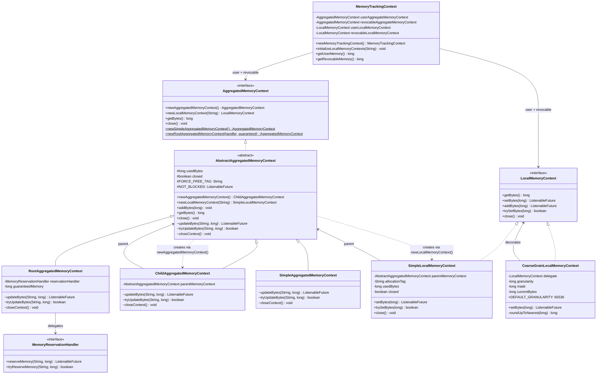
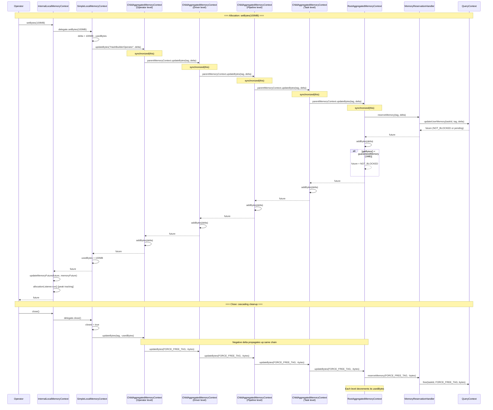

# Module Teardown: The Memory Tracking Tree (`io.trino.memory.context`)

## 0. Research Focus
* **Task ID:** 5.1.C
* **Focus:** Analyze the hierarchical tree structure (System -> Query -> Task -> Pipeline -> Driver -> Operator).

## 1. High-Level Overview
* **Core Responsibility:** The `io.trino.memory.context` package implements a hierarchical memory accounting tree that mirrors the execution hierarchy (Query → Task → Pipeline → Driver → Operator). Every memory allocation by an operator propagates upward through `ChildAggregatedMemoryContext` nodes to a `RootAggregatedMemoryContext` at the top, which bridges to the `MemoryPool` via a `MemoryReservationHandler`. This design provides per-level memory visibility, aggregation, and backpressure — the tree enforces that memory is reserved in the pool *before* operators can use it, and that freeing memory cascades cleanly on close.
* **Key Triggers:** Operators call `LocalMemoryContext.setBytes()` / `addBytes()` to report allocations. The delta propagates up through `ChildAggregatedMemoryContext.updateBytes()` at each level until `RootAggregatedMemoryContext.updateBytes()` calls `MemoryReservationHandler.reserveMemory()`, which bridges to `QueryContext.updateUserMemory()` → `MemoryPool.reserve()`. Memory is freed symmetrically via negative deltas or `close()`.

## 2. Structural Architecture
* **Primary Source Files:**
  - `lib/trino-memory-context/src/main/java/io/trino/memory/context/AggregatedMemoryContext.java` — public interface with static factory methods
  - `lib/trino-memory-context/src/main/java/io/trino/memory/context/AbstractAggregatedMemoryContext.java` — base class: `usedBytes`, lifecycle, abstract `updateBytes()`
  - `lib/trino-memory-context/src/main/java/io/trino/memory/context/RootAggregatedMemoryContext.java` — root node connected to pool, guaranteed memory logic
  - `lib/trino-memory-context/src/main/java/io/trino/memory/context/ChildAggregatedMemoryContext.java` — intermediate node delegating to parent
  - `lib/trino-memory-context/src/main/java/io/trino/memory/context/SimpleAggregatedMemoryContext.java` — standalone node (no parent, no pool, never blocks)
  - `lib/trino-memory-context/src/main/java/io/trino/memory/context/LocalMemoryContext.java` — leaf interface: `setBytes()`, `addBytes()`, `trySetBytes()`
  - `lib/trino-memory-context/src/main/java/io/trino/memory/context/SimpleLocalMemoryContext.java` — leaf implementation with allocation tag
  - `lib/trino-memory-context/src/main/java/io/trino/memory/context/CoarseGrainLocalMemoryContext.java` — decorator batching to 64KB granularity
  - `lib/trino-memory-context/src/main/java/io/trino/memory/context/MemoryTrackingContext.java` — composite wrapper: user + revocable aggregated contexts
  - `lib/trino-memory-context/src/main/java/io/trino/memory/context/MemoryReservationHandler.java` — bridge interface to MemoryPool
  - `core/trino-main/src/main/java/io/trino/operator/OperatorContext.java` — `InternalLocalMemoryContext` / `InternalAggregatedMemoryContext` decorators
  - `lib/trino-memory-context/src/test/java/io/trino/memory/context/TestMemoryContexts.java` — comprehensive test suite

* **Key Data Structures:**
  - `AbstractAggregatedMemoryContext.usedBytes` (`long`, `@GuardedBy("this")`) — cumulative bytes from all children at this level
  - `SimpleLocalMemoryContext.usedBytes` (`long`, `@GuardedBy("this")`) — bytes allocated at this leaf
  - `SimpleLocalMemoryContext.allocationTag` (`String`) — identifies the allocator (e.g., `"HashBuilderOperator"`) for pool-level tracking
  - `RootAggregatedMemoryContext.reservationHandler` (`MemoryReservationHandler`) — lambda bridge to `QueryContext.updateUserMemory()`
  - `RootAggregatedMemoryContext.guaranteedMemory` (`long`) — threshold below which allocations never block (default 1MB)
  - `CoarseGrainLocalMemoryContext.mask` (`long`) — bitwise mask `~(granularity - 1)` for power-of-2 rounding

### Class Diagram


## 3. Execution & Call Flow

### Sequence Diagram


* **Step-by-step text breakdown:**

  1. **Tree construction (top-down):** `QueryContext.addTaskContext()` creates two `RootAggregatedMemoryContext` instances (user + revocable), each wired to a `QueryMemoryReservationHandler` that captures the `taskId`. These are wrapped in a `MemoryTrackingContext`. At each subsequent level, `newMemoryTrackingContext()` calls `userAggregateMemoryContext.newAggregatedMemoryContext()` which creates a `ChildAggregatedMemoryContext` pointing to the parent's aggregated context:

     ```java
     // AbstractAggregatedMemoryContext
     public AbstractAggregatedMemoryContext newAggregatedMemoryContext() {
         return new ChildAggregatedMemoryContext(this);
     }
     ```

  2. **Local context initialization:** Each level calls `initializeLocalMemoryContexts(tag)` with a level-specific tag:

     | Level | Tag | Rationale |
     |-------|-----|-----------|
     | Task | `"LazyOutputBuffer"` | Output buffer allocations |
     | Pipeline | `"ExchangeOperator"` | Exchange client network buffers |
     | Driver | *(not initialized)* | Allocations go through operators |
     | Operator | operator type (e.g., `"FilterOperator"`) | Per-operator attribution |

     This calls `aggregatedContext.newLocalMemoryContext(tag)` which creates a `SimpleLocalMemoryContext`:

     ```java
     // AbstractAggregatedMemoryContext
     public LocalMemoryContext newLocalMemoryContext(String allocationTag) {
         return new SimpleLocalMemoryContext(this, allocationTag);
     }
     ```

  3. **Allocation propagation (bottom-up):** When an operator calls `setBytes(bytes)`, `SimpleLocalMemoryContext` computes `delta = bytes - usedBytes` and calls `parentMemoryContext.updateBytes(allocationTag, delta)`. Each `ChildAggregatedMemoryContext.updateBytes()` delegates to its parent **first** (allowing exceptions to propagate before local state changes), then records the delta locally:

     ```java
     // ChildAggregatedMemoryContext
     synchronized ListenableFuture<Void> updateBytes(String allocationTag, long delta) {
         checkState(!isClosed(), "ChildAggregatedMemoryContext is already closed");
         // update the parent before updating usedBytes as it may throw a runtime exception
         ListenableFuture<Void> future = parentMemoryContext.updateBytes(allocationTag, delta);
         addBytes(delta);
         return future;
     }
     ```

     This "parent-first" ordering is critical: if `QueryContext.enforceUserMemoryLimit()` throws `ExceededMemoryLimitException`, no intermediate `ChildAggregatedMemoryContext` has been mutated, keeping the tree consistent.

  4. **Root reservation and guaranteed memory:** `RootAggregatedMemoryContext.updateBytes()` calls the `MemoryReservationHandler`, records bytes, and applies the guaranteed memory override:

     ```java
     // RootAggregatedMemoryContext
     synchronized ListenableFuture<Void> updateBytes(String allocationTag, long delta) {
         ListenableFuture<Void> future = reservationHandler.reserveMemory(allocationTag, delta);
         addBytes(delta);
         // make sure we never block queries below guaranteedMemory
         if (getBytes() < guaranteedMemory) {
             future = NOT_BLOCKED;
         }
         return future;
     }
     ```

     The guaranteed memory (1MB for user, 0 for revocable) ensures queries can always make initial progress even when the pool is exhausted.

  5. **Non-blocking path (`trySetBytes` / `tryUpdateBytes`):** Follows the same bottom-up propagation but returns `boolean` instead of `ListenableFuture`. Each level attempts the parent's `tryUpdateBytes()` first and only records locally if the parent succeeds:

     ```java
     // ChildAggregatedMemoryContext
     synchronized boolean tryUpdateBytes(String allocationTag, long delta) {
         checkState(!isClosed(), "ChildAggregatedMemoryContext is already closed");
         if (parentMemoryContext.tryUpdateBytes(allocationTag, delta)) {
             addBytes(delta);
             return true;
         }
         return false;
     }
     ```

  6. **Operator-level decoration:** `OperatorContext` wraps all memory contexts in `InternalLocalMemoryContext` / `InternalAggregatedMemoryContext` decorators. These intercept every allocation to: (a) propagate blocking state via `updateMemoryFuture()`, and (b) track peak memory via `updatePeakMemoryReservations()`. The `updateMemoryFuture()` method uses CAS to atomically swap a `SettableFuture` and chain it to the pool's future:

     ```java
     // OperatorContext
     private static void updateMemoryFuture(ListenableFuture<Void> memoryPoolFuture,
             AtomicReference<SettableFuture<Void>> targetFutureReference) {
         if (!memoryPoolFuture.isDone()) {
             SettableFuture<Void> currentMemoryFuture = targetFutureReference.get();
             while (currentMemoryFuture.isDone()) {
                 SettableFuture<Void> settableFuture = SettableFuture.create();
                 if (targetFutureReference.compareAndSet(currentMemoryFuture, settableFuture)) {
                     currentMemoryFuture = settableFuture;
                 } else {
                     currentMemoryFuture = targetFutureReference.get();
                 }
             }
             SettableFuture<Void> finalMemoryFuture = currentMemoryFuture;
             memoryPoolFuture.addListener(() -> finalMemoryFuture.set(null), directExecutor());
         }
     }
     ```

  7. **CoarseGrainLocalMemoryContext optimization:** Wraps a `SimpleLocalMemoryContext` and only delegates to it when the rounded-up value crosses a 64KB boundary. This reduces lock contention for operators with frequent small allocations (e.g., `HashBuilderOperator`):

     ```java
     // CoarseGrainLocalMemoryContext
     public synchronized ListenableFuture<Void> setBytes(long bytes) {
         long roundedUpBytes = roundUpToNearest(bytes);
         if (roundedUpBytes != currentBytes) {
             currentBytes = roundedUpBytes;
             return delegate.setBytes(currentBytes);
         }
         return Futures.immediateVoidFuture();
     }

     long roundUpToNearest(long bytes) {
         long masked = bytes & mask;  // mask = ~(granularity - 1)
         return masked == bytes ? masked : masked + granularity;
     }
     ```

     Used by `HashBuilderOperator` (both spilled and unspilled variants) where hash table resizing produces many incremental allocations.

  8. **SimpleAggregatedMemoryContext (standalone):** A parentless, pool-less context that never blocks — `updateBytes()` just calls `addBytes()` and returns `NOT_BLOCKED`. Used extensively in connectors (Hive, Iceberg, Hudi, Redshift page sources), Parquet/ORC readers, and test utilities where pool enforcement is unnecessary or handled elsewhere. Found in ~115 files.

  9. **Close cascade:** `MemoryTrackingContext.close()` uses Guava's `Closer` to close both aggregated and both local contexts. Each `SimpleLocalMemoryContext.close()` sends a negative delta (`-usedBytes`) up to its parent. Each `ChildAggregatedMemoryContext.closeContext()` sends `FORCE_FREE_TAG` with `-getBytes()` to its parent. This cascades up to `RootAggregatedMemoryContext.closeContext()` which force-frees all remaining bytes via the handler:

     ```java
     // RootAggregatedMemoryContext
     void closeContext() {
         reservationHandler.reserveMemory(FORCE_FREE_TAG, -getBytes());
     }
     ```

  10. **Invariant check:** `OperatorContext.destroy()` validates that all memory has been freed after closure:

      ```java
      // OperatorContext.destroy()
      operatorMemoryContext.close();
      if (operatorMemoryContext.getUserMemory() != 0) {
          throw new TrinoException(GENERIC_INTERNAL_ERROR,
              format("Operator %s has non-zero user memory (%d bytes) after destroy()",
                  this, operatorMemoryContext.getUserMemory()));
      }
      ```

## 4. Concurrency & State Management
* **Threading Model:** The memory context tree is shared across driver threads within a query. Each context object synchronizes on its own `this` monitor — there is no global lock. Multiple operators in different drivers can allocate concurrently; contention occurs only when two operators share an ancestor (which they always do at the task and root levels).
* **State Machine:** No formal state machine. Each context has a binary `closed` flag: once `close()` is called, all further `setBytes()`/`addBytes()` throw `IllegalStateException`. The flag is idempotent — calling `close()` twice is safe.
* **Synchronization:**
  - **Lock ordering:** Always leaf-to-root. An allocation acquires `SimpleLocalMemoryContext`'s lock, then `ChildAggregatedMemoryContext` (operator) lock, then (driver), then (pipeline), then (task), then `RootAggregatedMemoryContext` lock, then `QueryContext` lock, then `MemoryPool` lock. This strict bottom-up ordering prevents deadlock.
  - **Lock granularity:** Each `AbstractAggregatedMemoryContext` and `SimpleLocalMemoryContext` synchronizes on its own `this`. This means two operators in different pipelines only contend at the task-level `ChildAggregatedMemoryContext` and above.
  - **Parent-first mutation:** Within `ChildAggregatedMemoryContext.updateBytes()`, the parent is called *before* `addBytes(delta)`. If the parent throws (e.g., per-query limit exceeded), the child's state is unchanged. This ensures tree consistency on failure.
  - **CAS for operator futures:** `OperatorContext.updateMemoryFuture()` uses `AtomicReference.compareAndSet()` to atomically swap blocking futures without holding a lock, avoiding contention between the driver thread and the memory-freeing thread.
  - **`CoarseGrainLocalMemoryContext`:** Adds its own `synchronized` block, but only calls the delegate when crossing a 64KB boundary — dramatically reducing upstream lock acquisition frequency.

## 5. Memory & Resource Profile
* **Allocation Pattern:** The context tree itself is lightweight — each node is a small Java object with a `long usedBytes`, a parent reference, and a monitor. For a query with 4 tasks × 3 pipelines × 2 drivers × 5 operators, the tree has ~120 `ChildAggregatedMemoryContext` nodes + ~80 `SimpleLocalMemoryContext` leaves. Total overhead: ~10KB. The `MemoryTrackingContext` wrappers double this (user + revocable), so ~20KB total per query — negligible.
* **Memory Tracking:** Each `AbstractAggregatedMemoryContext.usedBytes` represents the total bytes from all descendants at that subtree. Reading `getBytes()` at the task level gives the total memory for that task; at the root level, the total for the query. This enables per-level monitoring without additional bookkeeping. The `allocationTag` on `SimpleLocalMemoryContext` propagates to `MemoryPool.taggedMemoryAllocations` for per-operator visibility in query diagnostics.

## 6. Key Design Insights

* **Parent-first mutation ordering guarantees tree consistency on failure:** `ChildAggregatedMemoryContext.updateBytes()` calls `parentMemoryContext.updateBytes()` **before** calling its own `addBytes(delta)`. If the parent throws (e.g., `ExceededMemoryLimitException` from `QueryContext`), no intermediate context has been mutated. This means the tree is always in a consistent state after a failed allocation — no partial updates to unwind. The code explicitly comments: "update the parent before updating usedBytes as it may throw a runtime exception."
* **Leaf-to-root lock ordering prevents deadlock across concurrent operators:** Each context synchronizes on its own `this` monitor. An allocation acquires locks bottom-up: `SimpleLocalMemoryContext` → `ChildAggregatedMemoryContext` (operator) → (driver) → (pipeline) → (task) → `RootAggregatedMemoryContext` → `QueryContext` → `MemoryPool`. Because the ordering is always the same direction, two operators in different pipelines that share an ancestor can never deadlock — they both acquire locks in the same sequence. Contention occurs only at shared ancestor nodes (task level and above).
* **`CoarseGrainLocalMemoryContext` reduces pool interactions by ~1000x:** The 64KB granularity decorator uses bitwise rounding (`bytes & ~(granularity - 1)`) and only delegates to the underlying `SimpleLocalMemoryContext` when the rounded value changes. For hash table operators that resize incrementally (reporting byte-level changes on every row), this means the expensive synchronized propagation through 5+ levels to the pool happens only once per 64KB of growth — a ~1000x reduction in lock acquisitions for typical workloads.
* **`SimpleAggregatedMemoryContext` provides a pool-free escape hatch:** A parentless, never-blocking context used in ~115 files across connectors (Hive, Iceberg, Hudi), Parquet/ORC readers, and test utilities. Its `updateBytes()` simply calls `addBytes()` and returns `NOT_BLOCKED` — no pool check, no lock chain. This allows subsystems that manage their own memory budget (or are trusted to be bounded) to use the same context API without incurring pool overhead.
* **`FORCE_FREE_TAG` on close bypasses normal tag tracking:** When a context closes, it sends its remaining bytes as a negative delta with the special tag `FORCE_FREE_TAG` rather than the original allocation tag. This means cleanup doesn't need to remember which tag was used for each allocation — it simply force-frees everything. The pool records this under a distinct tag, keeping diagnostic attribution clean (you can distinguish forced cleanup from normal frees).

## 7. Porting Considerations (Java -> Target Architecture) *(Optional)*

* **Translation Blockers:**
  - **Synchronized cascading chain:** Each allocation acquires 5-7 nested intrinsic locks bottom-to-top. In Rust, this requires careful `Mutex` nesting or an alternative design. The consistent lock ordering prevents deadlock, but nested `Mutex::lock()` calls are verbose and error-prone.
  - **Guava `ListenableFuture` return type:** Every `updateBytes()` returns a `ListenableFuture<Void>` for backpressure. This deeply integrates with Guava's `SettableFuture` and `Futures.addCallback()`. Rust has no direct equivalent — need to map to `tokio` primitives.
  - **`AbstractAggregatedMemoryContext` as abstract class with package-private methods:** Java's package-private `updateBytes()` / `tryUpdateBytes()` / `closeContext()` pattern (template method) doesn't map directly to Rust traits. The `pub(crate)` visibility modifier is the closest equivalent.
  - **`CoarseGrainLocalMemoryContext` power-of-2 bitwise rounding:** Straightforward in Rust, but the `synchronized` wrapper adds another lock in the chain. Consider whether the Rust equivalent needs synchronization or can use `AtomicI64` for the `currentBytes` check.

* **Recommended Abstractions:**
  - **Trait-based hierarchy:**
    ```rust
    pub trait AggregatedMemoryContext: Send + Sync {
        fn update_bytes(&self, tag: &str, delta: i64) -> MemoryFuture;
        fn try_update_bytes(&self, tag: &str, delta: i64) -> bool;
        fn get_bytes(&self) -> i64;
        fn new_child(self: &Arc<Self>) -> Arc<dyn AggregatedMemoryContext>;
        fn new_local(self: &Arc<Self>, tag: String) -> LocalMemoryContext;
        fn close(&self);
    }
    ```
    `RootAggregatedMemoryContext` holds a `Box<dyn MemoryReservationHandler>`. `ChildAggregatedMemoryContext` holds `Arc<dyn AggregatedMemoryContext>` parent. Both wrap `Mutex<Inner>` for state.

  - **RAII memory contexts:** Implement `Drop` on `LocalMemoryContext` and `ChildAggregatedMemoryContext` to automatically free bytes. This eliminates the `FORCE_FREE_TAG` hack and the `OperatorContext.destroy()` validation:
    ```rust
    impl Drop for LocalMemoryContext {
        fn drop(&mut self) {
            let bytes = self.inner.lock().used_bytes;
            if bytes > 0 {
                self.parent.update_bytes(&self.tag, -bytes);
            }
        }
    }
    ```

  - **Flatten the lock chain:** Instead of each `ChildAggregatedMemoryContext` holding its own `Mutex`, consider a design where the root holds a single `Mutex<TreeState>` containing all level counters. Allocation would: lock once at root → update all counters → call pool → unlock. This trades per-level concurrency for simpler locking, and may perform better in practice since contention at the root is unavoidable anyway.

    Alternatively, use `AtomicI64` for `usedBytes` at each level (no lock needed for reads/writes) and only acquire the root's mutex for the pool call:
    ```rust
    struct ChildAggregatedMemoryContext {
        used_bytes: AtomicI64,  // lock-free counter
        parent: Arc<dyn AggregatedMemoryContext>,
    }
    ```

  - **Backpressure via `tokio::sync::Notify`:** Replace `ListenableFuture<Void>` with a `MemoryFuture` enum:
    ```rust
    enum MemoryFuture {
        Ready,
        Blocked(Arc<tokio::sync::Notify>),
    }
    ```
    Operators `.await` on `Notify::notified()` when blocked. `MemoryPool.free()` calls `notify.notify_waiters()`.

  - **CoarseGrainLocalMemoryContext → `AtomicI64` + bitwise rounding:**
    ```rust
    struct CoarseGrainLocalMemoryContext {
        delegate: LocalMemoryContext,
        granularity: i64,
        mask: i64,
        current_bytes: AtomicI64,
    }

    fn set_bytes(&self, bytes: i64) -> MemoryFuture {
        let rounded = self.round_up(bytes);
        let prev = self.current_bytes.swap(rounded, Ordering::SeqCst);
        if rounded != prev {
            self.delegate.set_bytes(rounded)
        } else {
            MemoryFuture::Ready
        }
    }
    ```

  - **`SimpleAggregatedMemoryContext` → `AtomicI64` counter:** Since it never blocks and has no parent, it's just an atomic counter. No mutex needed:
    ```rust
    struct SimpleAggregatedMemoryContext {
        used_bytes: AtomicI64,
    }
    ```

  - **`MemoryTrackingContext` → Rust struct bundling two `Arc<dyn AggregatedMemoryContext>`:**
    ```rust
    struct MemoryTrackingContext {
        user: Arc<dyn AggregatedMemoryContext>,
        revocable: Arc<dyn AggregatedMemoryContext>,
        user_local: Option<LocalMemoryContext>,
        revocable_local: Option<LocalMemoryContext>,
    }

    impl MemoryTrackingContext {
        fn new_child(&self) -> Self {
            Self {
                user: self.user.new_child(),
                revocable: self.revocable.new_child(),
                user_local: None,
                revocable_local: None,
            }
        }
    }
    ```

### Design Pattern Summary

| Java Pattern | Class | Rust Equivalent |
|---|---|---|
| Template method (`abstract` + subclass) | `AbstractAggregatedMemoryContext` | Trait with `dyn` dispatch |
| Decorator | `CoarseGrainLocalMemoryContext`, `InternalLocalMemoryContext` | Newtype wrapper implementing same trait |
| Composite | `MemoryTrackingContext` | Struct with two `Arc<dyn AggregatedMemoryContext>` |
| Factory method | `AggregatedMemoryContext.newRootAggregatedMemoryContext()` | Associated function on trait or module-level `fn` |
| Package-private | `updateBytes()`, `closeContext()` | `pub(crate)` visibility |
| Synchronized + intrinsic lock | `synchronized (this)` on each context | `Mutex<Inner>` or `AtomicI64` for counters |
| ListenableFuture backpressure | `reserve()` returns blocking future | `MemoryFuture::Blocked(Arc<Notify>)` |
| FORCE_FREE_TAG cleanup | `closeContext()` sends negative delta | `Drop` impl on context structs |
