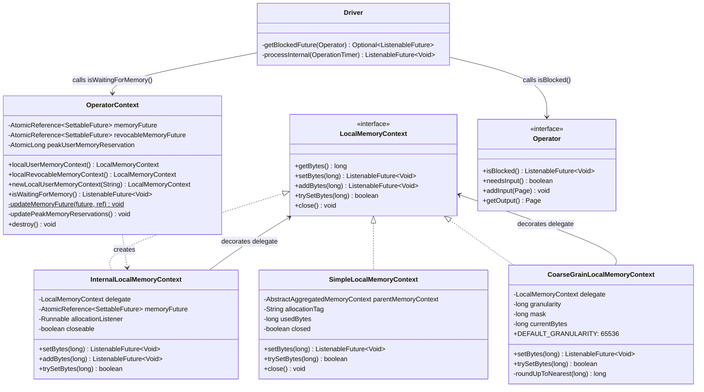

# Module Teardown: Operator Allocation Reporting (LocalMemoryContext)

## 1. High-Level Overview
* **Core Responsibility:** `LocalMemoryContext` is the leaf-level API that operators use to report memory allocations. When an operator calls `setBytes()` or `addBytes()`, two things happen synchronously: (1) the bytes propagate up the tracking tree to `MemoryPool.reserve()`, and (2) a `ListenableFuture<Void>` is returned signaling whether the operator should block. If the per-query limit is exceeded, `ExceededMemoryLimitException` is thrown immediately (the query dies). If the pool is merely exhausted (other queries using memory), a pending future is returned and the operator is suspended until memory is freed. The `Driver` detects this via `getBlockedFuture()` and yields control back to the `TaskExecutor`.
* **Key Triggers:** Operators call `setBytes()`/`addBytes()` after processing input pages (e.g., adding rows to a hash table, accumulating aggregation state). The returned future drives the cooperative scheduling loop — a blocked operator causes the entire driver to yield its CPU quantum.

## 2. Structural Architecture
* **Primary Source Files:**
  - `lib/trino-memory-context/src/main/java/io/trino/memory/context/LocalMemoryContext.java` — the interface operators code against
  - `lib/trino-memory-context/src/main/java/io/trino/memory/context/SimpleLocalMemoryContext.java` — concrete leaf implementation
  - `lib/trino-memory-context/src/main/java/io/trino/memory/context/CoarseGrainLocalMemoryContext.java` — 64KB granularity decorator
  - `core/trino-main/src/main/java/io/trino/operator/OperatorContext.java` — `InternalLocalMemoryContext` / `InternalAggregatedMemoryContext` decorators, `updateMemoryFuture()`, peak tracking
  - `core/trino-main/src/main/java/io/trino/operator/Operator.java` — operator interface with `isBlocked()`
  - `core/trino-main/src/main/java/io/trino/operator/Driver.java` — `processInternal()` loop, `getBlockedFuture()` checks
  - `core/trino-main/src/main/java/io/trino/ExceededMemoryLimitException.java` — thrown on per-query limit violation
  - `core/trino-main/src/main/java/io/trino/ExceededSpillLimitException.java` — thrown on spill limit violation
  - `core/trino-main/src/main/java/io/trino/operator/join/unspilled/HashBuilderOperator.java` — real-world allocation patterns
  - `core/trino-main/src/main/java/io/trino/operator/AggregationOperator.java` — simple allocation pattern
  - `core/trino-main/src/main/java/io/trino/operator/ScanFilterAndProjectOperator.java` — aggregated context pattern

* **Key Data Structures:**
  - `AtomicReference<SettableFuture<Void>> memoryFuture` — per-operator blocking state for user memory, swapped via CAS in `updateMemoryFuture()`
  - `AtomicReference<SettableFuture<Void>> revocableMemoryFuture` — same for revocable memory
  - `AtomicLong peakUserMemoryReservation` / `peakRevocableMemoryReservation` / `peakTotalMemoryReservation` — high-water marks updated on every allocation
  - `CoarseGrainLocalMemoryContext.mask` (`long`) — bitwise mask `~(granularity - 1)` for 64KB rounding

### Class Diagram


## 3. Execution & Call Flow

### Sequence Diagram
```mermaid
sequenceDiagram
    participant Op as Operator (e.g. HashBuilder)
    participant CGC as CoarseGrainLocalMemoryContext
    participant ILC as InternalLocalMemoryContext
    participant SLC as SimpleLocalMemoryContext
    participant Tree as ChildAggregatedMemoryContext chain
    participant Root as RootAggregatedMemoryContext
    participant QC as QueryContext
    participant MP as MemoryPool
    participant Drv as Driver

    Note over Op,MP: === Successful Allocation ===
    Op->>CGC: setBytes(estimatedSize)
    CGC->>CGC: roundedUp = roundUpToNearest(bytes)
    alt roundedUp == currentBytes
        CGC-->>Op: immediateVoidFuture() [skip delegation]
    else roundedUp changed
        CGC->>ILC: delegate.setBytes(roundedUp)
        ILC->>SLC: delegate.setBytes(roundedUp)
        SLC->>SLC: delta = roundedUp - usedBytes
        SLC->>Tree: parentMemoryContext.updateBytes(tag, delta)
        Tree->>Root: cascade up to root
        Root->>QC: reservationHandler.reserveMemory(tag, delta)
        QC->>QC: enforceUserMemoryLimit(current + delta <= max)
        QC->>MP: reserve(taskId, tag, delta)
        MP-->>QC: NOT_BLOCKED (done future)
        QC-->>Root: NOT_BLOCKED
        Root-->>Tree: NOT_BLOCKED
        Tree-->>SLC: NOT_BLOCKED
        SLC->>SLC: usedBytes = roundedUp
        SLC-->>ILC: NOT_BLOCKED
        ILC->>ILC: updateMemoryFuture(NOT_BLOCKED, memoryFuture) [no-op]
        ILC->>ILC: allocationListener.run() [peak tracking]
        ILC-->>CGC: NOT_BLOCKED
        CGC->>CGC: currentBytes = roundedUp
        CGC-->>Op: NOT_BLOCKED
    end

    Note over Op,MP: === Pool Exhausted (Blocking) ===
    Op->>CGC: setBytes(largeAmount)
    CGC->>ILC: delegate.setBytes(rounded)
    ILC->>SLC: delegate.setBytes(rounded)
    SLC->>Tree: updateBytes(tag, delta)
    Tree->>Root: cascade
    Root->>QC: reserveMemory(tag, delta)
    QC->>QC: enforceUserMemoryLimit() [passes]
    QC->>MP: reserve(taskId, tag, delta)
    MP->>MP: reservedBytes += delta; freeBytes <= 0
    MP-->>QC: pendingFuture (not done)
    QC-->>Root: pendingFuture
    Root-->>SLC: pendingFuture
    SLC->>SLC: usedBytes = rounded [bytes ARE reserved]
    SLC-->>ILC: pendingFuture
    ILC->>ILC: updateMemoryFuture(pendingFuture, memoryFuture)
    Note over ILC: CAS: swap in new SettableFuture<br/>chain pool future → operator future
    ILC->>ILC: allocationListener.run()
    ILC-->>Op: pendingFuture

    Note over Drv,MP: === Driver Detects Block ===
    Drv->>Op: getBlockedFuture(operator)
    Drv->>Op: operator.isBlocked() [done]
    Drv->>Op: operatorContext.isWaitingForMemory()
    Op-->>Drv: pendingFuture (not done!)
    Drv->>Drv: blockedFutures.add(pendingFuture)
    Drv-->>Drv: return firstFinishedFuture(blockedFutures) [yields]

    Note over MP,Drv: === Memory Freed → Unblock ===
    MP->>MP: free() → freeBytes > 0
    MP->>MP: future.set(null) [complete pool future]
    MP-->>ILC: listener fires → operatorFuture.set(null)
    Note over Drv: Driver resumed by TaskExecutor

    Note over Op,MP: === Per-Query Limit Exceeded (Exception) ===
    Op->>CGC: setBytes(hugeAmount)
    CGC->>ILC: delegate.setBytes(rounded)
    ILC->>SLC: delegate.setBytes(rounded)
    SLC->>Tree: updateBytes(tag, delta)
    Tree->>Root: cascade
    Root->>QC: reserveMemory(tag, delta)
    QC->>QC: enforceUserMemoryLimit(current + delta > maxUserMemory)
    QC-->>Op: throw ExceededMemoryLimitException
    Note over Op: Query fails immediately.<br/>No bytes were reserved.<br/>Tree state unchanged.
```

* **Step-by-step text breakdown:**

  1. **Operator obtains context:** Operators get their memory context via `operatorContext.localUserMemoryContext()`, which returns an `InternalLocalMemoryContext` wrapping the underlying `SimpleLocalMemoryContext`. Many operators additionally wrap this in `CoarseGrainLocalMemoryContext` for performance:
     ```java
     // HashBuilderOperator constructor
     this.localUserMemoryContext = new CoarseGrainLocalMemoryContext(
         operatorContext.localUserMemoryContext(),
         memorySyncThreshold);  // DEFAULT_GRANULARITY = 65536
     ```

  2. **Operator reports allocation:** After processing input (e.g., adding pages to a hash table), the operator estimates memory and calls `setBytes()`:
     ```java
     // HashBuilderOperator.updateIndex()
     if (!localUserMemoryContext.trySetBytes(index.getEstimatedSize().toBytes())) {
         index.compact();
         localUserMemoryContext.setBytes(index.getEstimatedSize().toBytes());
     }
     ```
     The `trySetBytes()` → compact → `setBytes()` pattern is idiomatic: try non-blocking first, compact on failure, then force the allocation.

  3. **CoarseGrainLocalMemoryContext filters:** If the rounded-up value hasn't crossed a 64KB boundary, the call short-circuits:
     ```java
     // CoarseGrainLocalMemoryContext.setBytes()
     long roundedUpBytes = roundUpToNearest(bytes);
     if (roundedUpBytes != currentBytes) {
         currentBytes = roundedUpBytes;
         return delegate.setBytes(currentBytes);
     }
     return Futures.immediateVoidFuture();  // No change → skip entirely
     ```

  4. **InternalLocalMemoryContext decorates:** Delegates to the underlying context, then performs two side effects:
     ```java
     // InternalLocalMemoryContext.setBytes()
     ListenableFuture<Void> blocked = delegate.setBytes(bytes);
     updateMemoryFuture(blocked, memoryFuture);  // propagate blocking
     allocationListener.run();                    // peak tracking
     return blocked;
     ```

  5. **SimpleLocalMemoryContext propagates to tree:** Computes delta and calls `parentMemoryContext.updateBytes()`. The parent is called **before** local state changes — if it throws, `usedBytes` is unchanged:
     ```java
     // SimpleLocalMemoryContext.setBytes()
     ListenableFuture<Void> future = parentMemoryContext.updateBytes(allocationTag, bytes - usedBytes);
     usedBytes = bytes;
     return future;
     ```

  6. **Tree cascade to pool:** The delta cascades up through `ChildAggregatedMemoryContext` nodes (each calling parent first, then `addBytes(delta)`) until reaching `RootAggregatedMemoryContext`, which calls `MemoryReservationHandler` → `QueryContext.updateUserMemory()` → `MemoryPool.reserve()`.

  7. **Outcome A — Success:** Pool returns `NOT_BLOCKED`. Future propagates back down. `updateMemoryFuture()` is a no-op (future is already done). Operator continues executing.

  8. **Outcome B — Pool exhausted (blocking):** Pool returns a pending `NonCancellableMemoryFuture`. **The bytes are still reserved** (pool tracks them), but the operator should stop processing. `updateMemoryFuture()` atomically swaps a new `SettableFuture` into the operator's `memoryFuture` via CAS and chains the pool's future to it:
     ```java
     // OperatorContext.updateMemoryFuture()
     if (!memoryPoolFuture.isDone()) {
         SettableFuture<Void> currentMemoryFuture = targetFutureReference.get();
         while (currentMemoryFuture.isDone()) {
             SettableFuture<Void> settableFuture = SettableFuture.create();
             if (targetFutureReference.compareAndSet(currentMemoryFuture, settableFuture)) {
                 currentMemoryFuture = settableFuture;
             } else {
                 currentMemoryFuture = targetFutureReference.get();
             }
         }
         SettableFuture<Void> finalMemoryFuture = currentMemoryFuture;
         memoryPoolFuture.addListener(() -> finalMemoryFuture.set(null), directExecutor());
     }
     ```
     The CAS loop handles the race where another thread may have already swapped the future. The `addListener` ensures: when the pool unblocks, the operator's future completes too.

  9. **Outcome C — Per-query limit exceeded (exception):** `QueryContext.enforceUserMemoryLimit()` throws `ExceededMemoryLimitException` synchronously. The exception propagates back through the tree — no `ChildAggregatedMemoryContext` has mutated (parent-first ordering), no `usedBytes` has changed. The query fails immediately:
     ```java
     // ExceededMemoryLimitException
     public static ExceededMemoryLimitException exceededLocalUserMemoryLimit(
             DataSize maxMemory, String additionalFailureInfo) {
         return new ExceededMemoryLimitException(EXCEEDED_LOCAL_MEMORY_LIMIT,
             format("Query exceeded per-node memory limit of %s [%s]", maxMemory, additionalFailureInfo));
     }
     ```
     The `additionalFailureInfo` includes top-3 memory consumers by allocation tag for diagnostics.

  10. **Driver detects blocking:** `Driver.getBlockedFuture()` checks three sources per operator in order:
      ```java
      // Driver.getBlockedFuture()
      // 1. Memory revocation in progress
      blocked = revokingOperators.get(operator);
      if (blocked != null) return Optional.of(blocked);

      // 2. Operator's own blocking (e.g., network I/O)
      blocked = operator.isBlocked();
      if (!blocked.isDone()) return Optional.of(blocked);

      // 3. Waiting for user memory
      blocked = operator.getOperatorContext().isWaitingForMemory();
      if (!blocked.isDone()) return Optional.of(blocked);

      // 4. Waiting for revocable memory
      blocked = operator.getOperatorContext().isWaitingForRevocableMemory();
      if (!blocked.isDone()) return Optional.of(blocked);
      ```

  11. **Driver yields:** If any operator is blocked and no pages were moved, the driver collects all blocked futures and returns `firstFinishedFuture(blockedFutures)` to the `TaskExecutor`. The driver's CPU quantum ends and it won't be rescheduled until at least one future completes:
      ```java
      // Driver.processInternal()
      if (!movedPage) {
          List<ListenableFuture<Void>> blockedFutures = new ArrayList<>();
          for (Operator operator : activeOperators) {
              Optional<ListenableFuture<Void>> blocked = getBlockedFuture(operator);
              if (blocked.isPresent()) {
                  blockedFutures.add(blocked.get());
              }
          }
          if (!blockedFutures.isEmpty()) {
              return firstFinishedFuture(blockedFutures);  // Yield
          }
      }
      ```

  12. **Unblock:** When another query frees memory, `MemoryPool.free()` calls `future.set(null)` on the shared `NonCancellableMemoryFuture`. This triggers the listener registered in step 8, which completes the operator's `SettableFuture`. The `TaskExecutor` notices the future completion and reschedules the driver.

## 4. Concurrency & State Management
* **Threading Model:** `LocalMemoryContext.setBytes()` is called from driver threads within the `processInternal()` loop, which is guarded by `Driver.exclusiveLock`. This means a single operator's memory context is only accessed by one thread at a time (no concurrent `setBytes()` calls on the same context). However, multiple operators in the same query share `ChildAggregatedMemoryContext` ancestors, so concurrent allocations from different drivers contend at parent nodes.
* **State Machine:** The operator memory lifecycle has three states: **active** (memoryFuture is done — operator can process), **blocked** (memoryFuture is pending — driver yields), and **closed** (all bytes freed, contexts closed). The transition active→blocked happens inside `updateMemoryFuture()` when the pool returns a pending future. The transition blocked→active happens when the pool's listener fires.
* **Synchronization:**
  - `SimpleLocalMemoryContext`: `synchronized (this)` on `setBytes()`, `addBytes()`, `trySetBytes()`, `close()`.
  - `CoarseGrainLocalMemoryContext`: `synchronized (this)` — adds one more lock in the chain but only calls delegate when crossing 64KB boundary.
  - `InternalLocalMemoryContext`: **not synchronized** — relies on caller (driver exclusive lock) for single-threaded access. The `updateMemoryFuture()` method uses lock-free CAS on `AtomicReference<SettableFuture<Void>>`.
  - Peak tracking uses `AtomicLong.accumulateAndGet(value, Math::max)` — lock-free.
  - The `memoryFuture` / `revocableMemoryFuture` `AtomicReference` is the critical cross-thread communication point: the driver thread reads it in `isWaitingForMemory()`, while the pool-freeing thread writes to it via the chained listener.

## 5. Memory & Resource Profile
* **Allocation Pattern:** Operators use two distinct patterns for reporting:
  - **Absolute (`setBytes`):** Used when the operator can estimate total memory at any point. Common for hash tables, aggregation state, lookup sources. Example: `AggregationOperator.addInput()` sums all aggregator sizes and calls `setBytes(total)` once per page.
  - **Try-then-force (`trySetBytes` → compact → `setBytes`):** Used by `HashBuilderOperator` when compaction can recover memory. Tries non-blocking first; on failure, compacts the data structure, then forces the allocation.
  - **Revocable vs user:** Spillable operators (spilled `HashBuilderOperator`) use revocable memory during accumulation (can be spilled to disk) and switch to user memory when building the final lookup source (cannot be spilled).
* **Memory Tracking:** Each `setBytes()` call propagates the allocation tag (operator type name) to `MemoryPool.taggedMemoryAllocations`, enabling per-operator attribution in query diagnostics. The `CoarseGrainLocalMemoryContext` reduces the number of pool interactions by ~1000x for operators with byte-level increments, reporting only when crossing 64KB boundaries.

## 6. Porting Considerations (Java -> Target Architecture)

* **Translation Blockers:**
  - **CAS-based `updateMemoryFuture()` with `SettableFuture` chaining:** This is the most complex piece — a lock-free algorithm that atomically swaps a blocking future and chains a listener. Rust's `Arc<Notify>` doesn't directly support this "swap and chain" pattern.
  - **`ListenableFuture<Void>` as return type of `setBytes()`:** The entire cooperative scheduling model depends on returning a future from every allocation. In async Rust, the operator's `poll()` method would need to check a shared signal instead.
  - **`firstFinishedFuture()` in driver:** Combines multiple blocking futures into one — maps to `tokio::select!` or `futures::future::select_all()`.
  - **Exception-based limit enforcement:** `ExceededMemoryLimitException` is thrown synchronously from `setBytes()` and caught by the driver/task framework. In Rust, this maps to `Result<MemoryFuture, ExceededMemoryLimit>`.

* **Recommended Abstractions:**
  - **`MemoryFuture` enum instead of `ListenableFuture<Void>`:**
    ```rust
    enum MemoryFuture {
        Ready,
        Blocked(Arc<tokio::sync::Notify>),
    }
    ```
    `setBytes()` returns `Result<MemoryFuture, MemoryLimitError>`. `Ready` means proceed; `Blocked(notify)` means the operator should `.await notify.notified()` in its async poll.

  - **Operator blocking state via `Arc<AtomicBool>` + `Arc<Notify>`:**
    ```rust
    struct OperatorMemoryState {
        is_blocked: AtomicBool,
        notify: Arc<Notify>,
    }
    ```
    `setBytes()` sets `is_blocked = true` when pool is exhausted. `MemoryPool.free()` calls `notify.notify_waiters()` and sets `is_blocked = false`. The driver checks `is_blocked` before calling `get_output()`.

  - **`LocalMemoryContext` as a Rust struct with `Drop`:**
    ```rust
    struct LocalMemoryContext {
        parent: Arc<dyn AggregatedMemoryContext>,
        tag: &'static str,
        used_bytes: i64,
    }

    impl LocalMemoryContext {
        fn set_bytes(&mut self, bytes: i64) -> Result<MemoryFuture, MemoryLimitError> {
            let delta = bytes - self.used_bytes;
            let future = self.parent.update_bytes(self.tag, delta)?;
            self.used_bytes = bytes;
            Ok(future)
        }
    }

    impl Drop for LocalMemoryContext {
        fn drop(&mut self) {
            if self.used_bytes > 0 {
                let _ = self.parent.update_bytes(self.tag, -self.used_bytes);
            }
        }
    }
    ```
    RAII `Drop` replaces `close()` + the `destroy()` invariant check.

  - **CoarseGrainLocalMemoryContext → newtype wrapper:**
    ```rust
    struct CoarseGrainLocalMemoryContext {
        inner: LocalMemoryContext,
        granularity: i64,
        mask: i64,
        current_rounded: i64,
    }

    impl CoarseGrainLocalMemoryContext {
        fn set_bytes(&mut self, bytes: i64) -> Result<MemoryFuture, MemoryLimitError> {
            let rounded = self.round_up(bytes);
            if rounded != self.current_rounded {
                self.current_rounded = rounded;
                self.inner.set_bytes(rounded)
            } else {
                Ok(MemoryFuture::Ready)
            }
        }

        fn round_up(&self, bytes: i64) -> i64 {
            let masked = bytes & self.mask;
            if masked == bytes { masked } else { masked + self.granularity }
        }
    }
    ```

  - **Driver blocking → `tokio::select!`:**
    ```rust
    // In the driver's async processing loop
    if !moved_page {
        let blocked: Vec<Arc<Notify>> = active_operators.iter()
            .filter_map(|op| op.get_blocked_notify())
            .collect();
        if !blocked.is_empty() {
            // Yield until any operator unblocks
            futures::future::select_all(
                blocked.iter().map(|n| Box::pin(n.notified()))
            ).await;
        }
    }
    ```

  - **Error types:**
    ```rust
    #[derive(Debug, thiserror::Error)]
    enum MemoryLimitError {
        #[error("Query exceeded per-node memory limit of {limit} [{details}]")]
        ExceededLocalUserLimit { limit: DataSize, details: String },
        #[error("Query exceeded distributed user memory limit of {limit}")]
        ExceededGlobalUserLimit { limit: DataSize },
        #[error("Query exceeded per-query local spill limit of {limit}")]
        ExceededSpillLimit { limit: DataSize },
    }
    ```

### Real Operator Allocation Patterns Summary

| Operator | Context Type | Strategy | When Reported |
|----------|-------------|----------|---------------|
| `HashBuilderOperator` (unspilled) | `CoarseGrainLocalMemoryContext` wrapping user context | `trySetBytes()` → compact → `setBytes()` | After each `addPage()` to index |
| `HashBuilderOperator` (spilled) | `CoarseGrainLocalMemoryContext` wrapping user + revocable | Revocable during input; user for lookup source | After each `addPage()`; on `finish()` |
| `AggregationOperator` | `localUserMemoryContext()` (plain) | `setBytes(total)` — sum all aggregators | Once per `addInput()` page |
| `ScanFilterAndProjectOperator` | Aggregated context with sub-contexts | Per-component tracking via `newLocalMemoryContext()` | Periodic sync via `blocking()` callback |

### Outcome Summary

| Condition | `setBytes()` Behavior | Tree State | Operator State |
|-----------|----------------------|------------|---------------|
| Memory available | Returns `NOT_BLOCKED` (done future) | All levels updated | Continues processing |
| Pool exhausted | Returns pending future; **bytes are reserved** | All levels updated | Blocked; driver yields |
| Per-query limit exceeded | Throws `ExceededMemoryLimitException` | **Unchanged** (parent-first ordering) | Query fails |
| `trySetBytes()` insufficient | Returns `false`; no side effects | Unchanged | Operator decides (compact, spill, etc.) |
