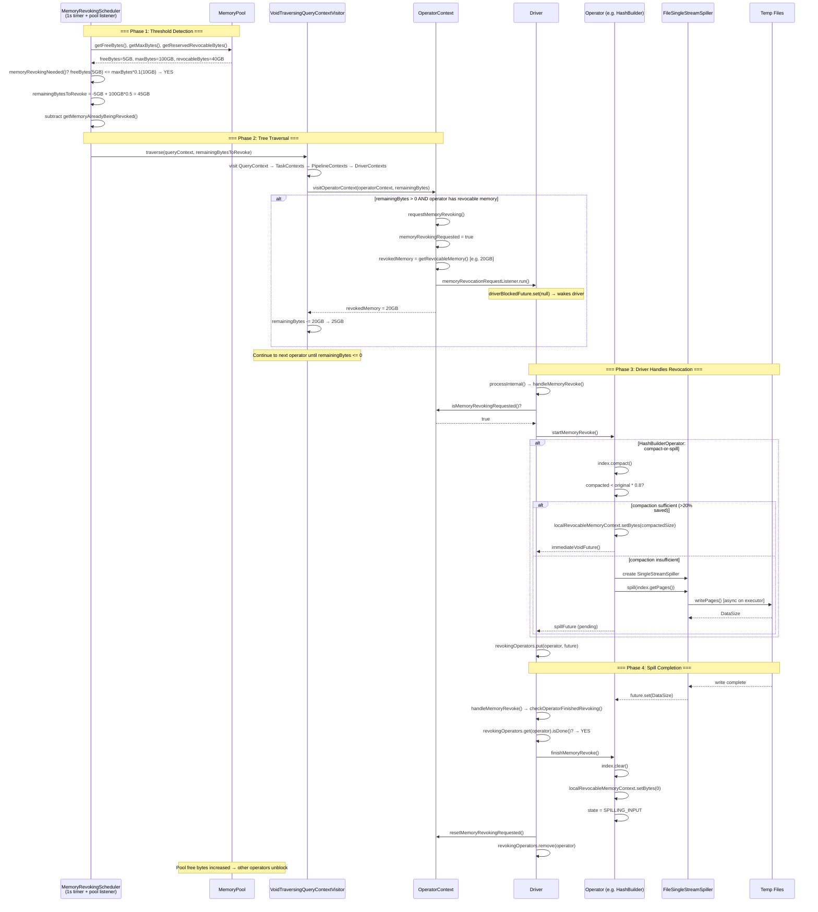

# Module Teardown: Memory Revocation

## 0. Research Focus
* **Task ID:** 5.2.B
* **Focus:** How does the engine signal an operator that it needs to free memory (triggering the spilling mechanism identified in Task 3.5.A)?

## 1. High-Level Overview
* **Core Responsibility:** The memory revocation system is Trino's pressure-relief valve. When the node-level `MemoryPool` fills beyond a configurable threshold (default 90%), `MemoryRevokingScheduler` traverses all running operators and signals those with revocable memory to spill their state to disk. Operators respond asynchronously — they serialize in-memory data structures (hash tables, sort buffers, aggregation state) to temporary files via the `Spiller` subsystem, free their revocable memory, and later read the data back when needed. This is a two-phase protocol: `startMemoryRevoke()` initiates the async spill and returns a future; `finishMemoryRevoke()` performs cleanup once the spill completes.
* **Key Triggers:** Two triggers fire `MemoryRevokingScheduler`: (1) a periodic 1-second timer, and (2) an event-driven `MemoryPoolListener` callback that fires on every `MemoryPool.reserve()` call. Both converge on `requestMemoryRevokingIfNeeded()` which checks if `freeBytes <= maxBytes * (1 - threshold)` and `revocableBytes > 0`. The scheduler then traverses the query context tree via a `VoidTraversingQueryContextVisitor`, calling `OperatorContext.requestMemoryRevoking()` on each operator until enough bytes are reclaimed to reach the target (default 50% free).

## 2. Structural Architecture
* **Primary Source Files:**
  - `core/trino-main/src/main/java/io/trino/execution/MemoryRevokingScheduler.java` — threshold monitoring, tree traversal, revocation requests
  - `core/trino-main/src/main/java/io/trino/operator/OperatorContext.java` — `requestMemoryRevoking()`, flag + listener mechanism
  - `core/trino-main/src/main/java/io/trino/operator/Driver.java` — `handleMemoryRevoke()`, two-phase orchestration, `revokingOperators` map
  - `core/trino-main/src/main/java/io/trino/operator/join/spilling/HashBuilderOperator.java` — hash join spill: compact-or-spill strategy
  - `core/trino-main/src/main/java/io/trino/operator/HashAggregationOperator.java` — delegates to `SpillableHashAggregationBuilder`
  - `core/trino-main/src/main/java/io/trino/operator/aggregation/builder/SpillableHashAggregationBuilder.java` — aggregation spill logic
  - `core/trino-main/src/main/java/io/trino/operator/OrderByOperator.java` — sort spill: sort-then-spill
  - `core/trino-main/src/main/java/io/trino/operator/WindowOperator.java` — window function spill
  - `core/trino-main/src/main/java/io/trino/spiller/Spiller.java` — multi-stream spill interface
  - `core/trino-main/src/main/java/io/trino/spiller/SingleStreamSpiller.java` — single-stream spill interface
  - `core/trino-main/src/main/java/io/trino/spiller/FileSingleStreamSpiller.java` — concrete: writes pages to temp files with optional encryption/compression
  - `core/trino-main/src/main/java/io/trino/spiller/GenericSpiller.java` — multi-stream wrapper creating one `SingleStreamSpiller` per spill call
  - `core/trino-main/src/main/java/io/trino/spiller/SpillSpaceTracker.java` — global per-node spill quota
  - `core/trino-main/src/main/java/io/trino/operator/SpillContext.java` — per-operator spill byte tracking
  - `core/trino-main/src/main/java/io/trino/spiller/LocalSpillContext.java` — hierarchical spill context with parent delegation
  - `core/trino-main/src/main/java/io/trino/spiller/NodeSpillConfig.java` — spill path, quota, compression, encryption config
  - `core/trino-main/src/main/java/io/trino/FeaturesConfig.java` — `memory-revoking-threshold`, `memory-revoking-target`
  - `core/trino-main/src/main/java/io/trino/memory/VoidTraversingQueryContextVisitor.java` — visitor for tree traversal
  - `core/trino-main/src/main/java/io/trino/memory/TraversingQueryContextVisitor.java` — visitor with merge results

* **Key Data Structures:**
  - `MemoryRevokingScheduler.memoryRevokingThreshold` (`double`, default 0.9) — trigger when pool >= 90% full
  - `MemoryRevokingScheduler.memoryRevokingTarget` (`double`, default 0.5) — revoke until pool <= 50% full
  - `OperatorContext.memoryRevokingRequested` (`boolean`, `@GuardedBy("this")`) — per-operator revocation flag
  - `OperatorContext.memoryRevocationRequestListener` (`Runnable`, `@GuardedBy("this")`) — callback to wake driver
  - `Driver.revokingOperators` (`Map<Operator, ListenableFuture<Void>>`) — tracks in-progress spills per operator
  - `FileSingleStreamSpiller.spillFiles` (`List<SpillFile>`) — temp files for round-robin page distribution

### Class Diagram

```mermaid
classDiagram
    class MemoryRevokingScheduler {
        -MemoryPool memoryPool
        -SqlTaskManager sqlTaskManager
        -double memoryRevokingThreshold
        -double memoryRevokingTarget
        +start() void
        -requestMemoryRevokingIfNeeded() void
        -memoryRevokingNeeded(MemoryPool) boolean
        -requestRevoking(List~SqlTask~, long) void
    }

    class OperatorContext {
        -boolean memoryRevokingRequested
        -Runnable memoryRevocationRequestListener
        +requestMemoryRevoking() long
        +isMemoryRevokingRequested() boolean
        +resetMemoryRevokingRequested() void
        +setMemoryRevocationRequestListener(Runnable) void
    }

    class Operator {
        <<interface>>
        +startMemoryRevoke() ListenableFuture~Void~
        +finishMemoryRevoke() void
    }

    class Driver {
        -Map~Operator, ListenableFuture~ revokingOperators
        -handleMemoryRevoke() void
        -checkOperatorFinishedRevoking(Operator) void
    }

    class Spiller {
        <<interface>>
        +spill(Iterator~Page~) ListenableFuture~DataSize~
        +getSpills() List~Iterator~Page~~
        +close() void
    }

    class SingleStreamSpiller {
        <<interface>>
        +spill(Iterator~Page~) ListenableFuture~DataSize~
        +getSpilledPages() Iterator~Page~
        +getAllSpilledPages() ListenableFuture~List~Page~~
    }

    class FileSingleStreamSpiller {
        -List~SpillFile~ spillFiles
        -PageSerializer serializer
        -ListeningExecutorService executor
        +spill(Iterator~Page~) ListenableFuture~DataSize~
        -writePages(Iterator~Page~) DataSize
    }

    class GenericSpiller {
        -SingleStreamSpillerFactory factory
        -List~SingleStreamSpiller~ singleStreamSpillers
        +spill(Iterator~Page~) ListenableFuture~DataSize~
    }

    class SpillSpaceTracker {
        -long maxBytes
        -long currentBytes
        +reserve(long) ListenableFuture~Void~
        +free(long) void
    }

    class SpillContext {
        <<interface>>
        +updateBytes(long) void
        +newLocalSpillContext() SpillContext
    }

    class VoidTraversingQueryContextVisitor {
        +visitQueryContext(QueryContext, C) Void
        +visitTaskContext(TaskContext, C) Void
        +visitOperatorContext(OperatorContext, C) Void
    }

    MemoryRevokingScheduler --> MemoryPool : monitors
    MemoryRevokingScheduler --> VoidTraversingQueryContextVisitor : traverses tree
    MemoryRevokingScheduler --> OperatorContext : requestMemoryRevoking()
    Driver --> Operator : startMemoryRevoke() / finishMemoryRevoke()
    Driver --> OperatorContext : isMemoryRevokingRequested()
    Operator ..> Spiller : creates for spilling
    GenericSpiller ..|> Spiller
    GenericSpiller --> SingleStreamSpiller : creates per spill
    FileSingleStreamSpiller ..|> SingleStreamSpiller
    FileSingleStreamSpiller --> SpillContext : tracks bytes
    SpillSpaceTracker --> SpillContext : enforces quota
```


## 3. Execution & Call Flow

### Sequence Diagram


* **Step-by-step text breakdown:**

  1. **Threshold detection (MemoryRevokingScheduler):** The scheduler runs on a 1-second periodic timer AND as a `MemoryPoolListener` callback. Both paths call `requestMemoryRevokingIfNeeded()`, which checks:
     ```java
     private boolean memoryRevokingNeeded(MemoryPool memoryPool) {
         return memoryPool.getReservedRevocableBytes() > 0
                 && memoryPool.getFreeBytes() <= memoryPool.getMaxBytes() * (1.0 - memoryRevokingThreshold);
     }
     ```
     With defaults (threshold=0.9, target=0.5): revocation triggers when pool is >=90% full and at least one operator has revocable memory. The target amount to revoke is calculated as:
     ```java
     long remainingBytesToRevoke = (long) (-memoryPool.getFreeBytes()
             + (memoryPool.getMaxBytes() * (1.0 - memoryRevokingTarget)));
     ```
     Already-in-progress revocations are subtracted via `getMemoryAlreadyBeingRevoked()` which uses a `TraversingQueryContextVisitor` to sum `getReservedRevocableBytes()` across all operators where `isMemoryRevokingRequested()` is true.

  2. **Tree traversal (Visitor pattern):** The scheduler uses `VoidTraversingQueryContextVisitor<AtomicLong>` to walk all running tasks → pipelines → drivers → operators. At each operator, if `remainingBytesToRevoke > 0`:
     ```java
     public Void visitOperatorContext(OperatorContext operatorContext, AtomicLong remainingBytesToRevoke) {
         if (remainingBytesToRevoke.get() > 0) {
             long revokedBytes = operatorContext.requestMemoryRevoking();
             if (revokedBytes > 0) {
                 remainingBytesToRevoke.addAndGet(-revokedBytes);
             }
         }
         return null;
     }
     ```

  3. **Signaling the operator (OperatorContext.requestMemoryRevoking()):** Sets the `memoryRevokingRequested` flag and fires the registered listener:
     ```java
     public long requestMemoryRevoking() {
         long revokedMemory = 0L;
         Runnable listener = null;
         synchronized (this) {
             if (!isMemoryRevokingRequested() && operatorMemoryContext.getRevocableMemory() > 0) {
                 memoryRevokingRequested = true;
                 revokedMemory = operatorMemoryContext.getRevocableMemory();
                 listener = memoryRevocationRequestListener;
             }
         }
         if (listener != null) {
             runListener(listener);  // Outside lock
         }
         return revokedMemory;
     }
     ```
     The listener is registered during `Driver` initialization:
     ```java
     operatorContext.setMemoryRevocationRequestListener(
         () -> driverBlockedFuture.get().set(null));  // Wake up the driver
     ```
     This completes the driver's blocked future, causing `TaskExecutor` to reschedule the driver.

  4. **Driver handles revocation (handleMemoryRevoke()):** Called at the top of every `processInternal()` iteration. For each operator, it checks the flag and initiates the two-phase protocol:
     ```java
     private void handleMemoryRevoke() {
         for (int i = 0; i < activeOperators.size(); i++) {
             Operator operator = activeOperators.get(i);
             if (revokingOperators.containsKey(operator)) {
                 checkOperatorFinishedRevoking(operator);
             } else if (operator.getOperatorContext().isMemoryRevokingRequested()) {
                 ListenableFuture<Void> future = operator.startMemoryRevoke();
                 revokingOperators.put(operator, future);
                 checkOperatorFinishedRevoking(operator);
             }
         }
     }
     ```
     While a spill is in progress, `getBlockedFuture()` returns the spill future for that operator, blocking it from normal processing:
     ```java
     ListenableFuture<Void> blocked = revokingOperators.get(operator);
     if (blocked != null) return Optional.of(blocked);
     ```

  5. **Operator spills (startMemoryRevoke()):** Each spillable operator implements its own strategy. `HashBuilderOperator` tries compaction first:
     ```java
     public ListenableFuture<Void> startMemoryRevoke() {
         long indexSizeBeforeCompaction = index.getEstimatedSize().toBytes();
         index.compact();
         long indexSizeAfterCompaction = index.getEstimatedSize().toBytes();

         if (indexSizeAfterCompaction < indexSizeBeforeCompaction * 0.8) {
             // Compaction freed >20% — sufficient
             finishMemoryRevoke = Optional.of(() -> {});
             localRevocableMemoryContext.setBytes(indexSizeAfterCompaction);
             return immediateVoidFuture();
         }

         // Compaction insufficient — spill to disk
         finishMemoryRevoke = Optional.of(() -> {
             index.clear();
             localUserMemoryContext.setBytes(index.getEstimatedSize().toBytes());
             localRevocableMemoryContext.setBytes(0);
             state = State.SPILLING_INPUT;
         });
         return spillIndex();
     }
     ```
     `OrderByOperator` sorts then spills:
     ```java
     private ListenableFuture<Void> spillToDisk() {
         pageIndex.sort(pagesIndexOrdering);
         spillInProgress = asVoid(spiller.get().spill(pageIndex.getSortedPages()));
         finishMemoryRevoke = Optional.of(() -> {
             pageIndex.clear();
             updateMemoryUsage();
         });
         return spillInProgress;
     }
     ```

  6. **Spilling to disk (FileSingleStreamSpiller):** Pages are serialized and written to temporary files asynchronously on a dedicated executor:
     ```java
     private DataSize writePages(Iterator<Page> pages) {
         while (pages.hasNext()) {
             Page page = pages.next();
             spilledPagesInMemorySize.addAndGet(page.getSizeInBytes());
             PageDataOutput pageDataOutput = serializer.serialize(page);
             long pageSize = pageDataOutput.size();
             SpillFile spillFile = spillFiles.get(fileIndex);
             fileIndex = (fileIndex + 1) % fileCount;  // Round-robin across disks
             spillFile.write(pageDataOutput);
             localSpillContext.updateBytes(pageSize);
             totalSpilledBytes += pageSize;
         }
         return DataSize.ofBytes(totalSpilledBytes);
     }
     ```
     Pages are distributed round-robin across configured spill paths for I/O parallelism. Optional LZ4 compression and AES encryption are applied at the serializer level.

  7. **Completion (finishMemoryRevoke()):** When the spill future completes, the driver calls `checkOperatorFinishedRevoking()`:
     ```java
     private void checkOperatorFinishedRevoking(Operator operator) {
         ListenableFuture<Void> future = revokingOperators.get(operator);
         if (future.isDone()) {
             getFutureValue(future);  // Propagate exceptions
             revokingOperators.remove(operator);
             operator.finishMemoryRevoke();
             operator.getOperatorContext().resetMemoryRevokingRequested();
         }
     }
     ```
     The operator's `finishMemoryRevoke()` runs the cleanup closure (clear in-memory data, set revocable memory to 0, transition state machine).

  8. **Reading back spilled data:** When the operator later needs the data (e.g., probe phase of a hash join), it reads from the spiller:
     ```java
     Iterator<Page> spilledPages = spiller.getSpilledPages();
     // or
     ListenableFuture<List<Page>> allPages = spiller.getAllSpilledPages();
     ```
     `FileSingleStreamSpiller` reads from all spill files in the same round-robin order, deserializing pages lazily.

## 4. Concurrency & State Management
* **Threading Model:** `MemoryRevokingScheduler` runs on the `taskManagementExecutor` thread (shared with other management tasks). It traverses the query context tree and calls `requestMemoryRevoking()` on operator contexts from this management thread. The listener callback (`driverBlockedFuture.set(null)`) is also called from this thread. The actual spill work (`writePages()`) runs on a dedicated `ListeningExecutorService` with `max(4, 2 * spillPaths.size())` threads. The driver's `handleMemoryRevoke()` and `checkOperatorFinishedRevoking()` run on the driver's own thread under `exclusiveLock`.
* **State Machine:** Each spillable operator has its own state machine. HashBuilderOperator: `CONSUMING_INPUT → SPILLING_INPUT → INPUT_SPILLED → INPUT_UNSPILLING → INPUT_UNSPILLED_AND_BUILT → CLOSED`. OrderByOperator: `NEEDS_INPUT → HAS_OUTPUT → FINISHED`. The `memoryRevokingRequested` flag on `OperatorContext` acts as a simple two-state latch (false → true → false after `resetMemoryRevokingRequested()`).
* **Synchronization:**
  - `OperatorContext.requestMemoryRevoking()`: `synchronized (this)` to atomically set the flag and capture the listener. Listener is called **outside** the lock.
  - `Driver.handleMemoryRevoke()`: Under `exclusiveLock` — no concurrent access to `revokingOperators` or operator state.
  - `FileSingleStreamSpiller.writePages()`: Runs on executor thread. The `writable` flag prevents concurrent reads during writes. `spilledPagesInMemorySize` uses `AtomicLong` for thread-safe updates.
  - `SpillSpaceTracker.reserve()/free()`: `synchronized (this)` for global quota enforcement.
  - Race condition defense: The scheduler subtracts `getMemoryAlreadyBeingRevoked()` from the target to avoid requesting revocation from multiple operators for the same memory deficit.

## 5. Memory & Resource Profile
* **Allocation Pattern:** Revocation converts in-memory data (revocable bytes in `MemoryPool`) to on-disk data (bytes tracked by `SpillSpaceTracker`). The memory freed is `reservedRevocableBytes` that the operator held; the disk cost is the serialized page size (potentially smaller with LZ4 compression). Each `FileSingleStreamSpiller` pre-allocates buffer memory (`SpillFile.BUFFER_SIZE * pathCount`) to prevent a race between the spiller thread and close(). The round-robin distribution across spill paths aims to balance disk I/O.
* **Memory Tracking:** Operators using revocable memory track it via `localRevocableMemoryContext.setBytes()`. When spilled, this is set to 0 and the operator may switch to a small amount of user memory for metadata. Spill bytes are tracked hierarchically: `LocalSpillContext` → parent `SpillContext` → `QueryContext.reserveSpill()` → `SpillSpaceTracker.reserve()`. On close, `LocalSpillContext` sends a negative delta to undo its contribution.

## 6. Key Design Insights

* **Dual trigger — timer + event listener — balances latency vs overhead:** `MemoryRevokingScheduler` uses both a 1-second periodic timer and a `MemoryPoolListener` callback on every `reserve()` call. The listener provides low-latency response to sudden memory spikes (triggers immediately when an allocation crosses the threshold). The timer acts as a safety net catching any edge cases the listener misses (e.g., revocation targets increasing after concurrent frees). Both paths converge on `requestMemoryRevokingIfNeeded()`, which is idempotent.
* **Threshold/target gap (90%/50%) prevents revocation oscillation:** The trigger threshold (0.9) and target (0.5) are deliberately far apart. When revocation triggers at 90% usage, the system revokes enough to reach 50% — a 40-percentage-point margin. This wide gap prevents the "revoke a little, allocate, revoke again" oscillation that would occur if the target were close to the threshold. The cost is that operators may spill more than strictly necessary, but the benefit is fewer revocation cycles.
* **Compact-or-spill strategy avoids unnecessary disk I/O:** `HashBuilderOperator.startMemoryRevoke()` calls `index.compact()` first and checks if compaction saved more than 20% (`indexSizeAfterCompaction < indexSizeBeforeCompaction * 0.8`). If so, it skips disk spilling entirely and just updates the memory context with the compacted size. This is a significant optimization: hash tables with tombstones from deleted entries can often be compacted in-place without touching disk.
* **Two-phase protocol separates async I/O from state cleanup:** `startMemoryRevoke()` returns a future (the async spill) while capturing a cleanup closure in `finishMemoryRevoke`. The driver stores the future in `revokingOperators` and blocks the operator from normal processing. When the future completes, `finishMemoryRevoke()` runs the closure synchronously (clear data structures, reset memory contexts, transition state machine). This separation means the expensive I/O runs on a dedicated spiller thread pool while state mutation happens safely on the driver's exclusive thread.
* **Round-robin file distribution balances disk I/O across spill paths:** `FileSingleStreamSpiller.writePages()` distributes pages across `spillFiles` using `fileIndex = (fileIndex + 1) % fileCount`, where each file maps to a different configured spill path. This ensures that multi-disk setups get balanced I/O rather than saturating a single disk. The same round-robin order is used for reading back, maintaining page ordering.

## 7. Porting Considerations (Java -> Target Architecture) *(Optional)*

* **Translation Blockers:**
  - **Visitor pattern for tree traversal:** `VoidTraversingQueryContextVisitor` and `TraversingQueryContextVisitor` use Java generics + virtual dispatch to walk the context tree. In Rust, this maps to a trait with `visit_operator_context()` or a simpler closure-based traversal.
  - **Two-phase async protocol:** `startMemoryRevoke()` returns `ListenableFuture<Void>`, driver stores it in `revokingOperators` map, checks `isDone()` each iteration. This maps to `tokio` futures but requires careful integration with the cooperative scheduling loop.
  - **Runnable listener across threads:** The `memoryRevocationRequestListener` is set by the driver thread and called from the scheduler thread. In Rust, this requires `Send + Sync` closures or a channel-based approach.
  - **FileSingleStreamSpiller async I/O:** Uses a Java `ListeningExecutorService` thread pool. In Rust, disk I/O would use `tokio::fs` or `tokio::task::spawn_blocking`.

* **Recommended Abstractions:**
  - **Revocation scheduler → `tokio::time::interval` + channel:**
    ```rust
    struct MemoryRevokingScheduler {
        pool: Arc<MemoryPool>,
        threshold: f64,   // 0.9
        target: f64,      // 0.5
    }

    impl MemoryRevokingScheduler {
        async fn run(&self, mut tasks: watch::Receiver<Vec<Arc<SqlTask>>>) {
            let mut interval = tokio::time::interval(Duration::from_secs(1));
            loop {
                tokio::select! {
                    _ = interval.tick() => self.check_and_revoke().await,
                    _ = self.pool.on_memory_reserved() => self.check_and_revoke().await,
                }
            }
        }
    }
    ```

  - **Revocation signal → `AtomicBool` + `tokio::sync::Notify`:**
    ```rust
    struct OperatorRevocationState {
        requested: AtomicBool,
        notify_driver: Arc<Notify>,
    }

    fn request_memory_revoking(&self) -> i64 {
        if !self.requested.swap(true, Ordering::SeqCst) {
            let revocable = self.revocable_memory();
            if revocable > 0 {
                self.notify_driver.notify_one();
                return revocable;
            }
        }
        0
    }
    ```

  - **Two-phase protocol → trait on operators:**
    ```rust
    #[async_trait]
    trait SpillableOperator: Operator {
        async fn start_memory_revoke(&mut self) -> Result<()>;
        fn finish_memory_revoke(&mut self);
    }
    ```
    The driver `select!`s between the spill future and normal processing.

  - **Spiller → `tokio::task::spawn_blocking` + temp files:**
    ```rust
    trait SingleStreamSpiller: Send {
        async fn spill(&mut self, pages: Vec<Page>) -> Result<DataSize>;
        fn get_spilled_pages(&mut self) -> impl Iterator<Item = Page>;
        async fn get_all_spilled_pages(&mut self) -> Result<Vec<Page>>;
    }

    struct FileSingleStreamSpiller {
        spill_files: Vec<SpillFile>,
        file_index: usize,
        serializer: PageSerializer,
    }

    impl FileSingleStreamSpiller {
        async fn spill(&mut self, pages: Vec<Page>) -> Result<DataSize> {
            let files = self.spill_files.clone();
            tokio::task::spawn_blocking(move || {
                // Write pages round-robin to files
            }).await?
        }
    }
    ```

  - **Spill space tracking → `Arc<Mutex<SpillSpaceTracker>>`:** Direct translation — the tracker is simple arithmetic with a limit check.

  - **Tree traversal → closure-based iteration instead of visitor:**
    ```rust
    fn for_each_operator<F: FnMut(&OperatorContext)>(tasks: &[TaskContext], f: &mut F) {
        for task in tasks {
            for pipeline in &task.pipelines {
                for driver in &pipeline.drivers {
                    for operator in &driver.operators {
                        f(&operator.context);
                    }
                }
            }
        }
    }
    ```
    The visitor pattern is overkill for Rust — simple nested iteration suffices.

### Configuration Summary

| Property | Default | Description |
|----------|---------|-------------|
| `memory-revoking-threshold` | 0.9 | Trigger revocation when pool ≥ 90% full |
| `memory-revoking-target` | 0.5 | Revoke until pool ≤ 50% full |
| `spill-enabled` | false | Must be true for any operator to use revocable memory |
| `max-spill-per-node` | 100 GB | Global disk spill quota per worker |
| `query-max-spill-per-node` | 100 GB | Per-query spill limit |
| `spill-compression-codec` | NONE | NONE or LZ4 |
| `spill-encryption-enabled` | false | AES encryption for spilled data |
| `spiller-spill-path` | (none) | Disk directories for temp files |
| `spiller-threads` | max(4, 2×paths) | Thread pool for async I/O |

### Operators Supporting Memory Revocation

| Operator | Strategy | State Transition |
|----------|----------|-----------------|
| `HashBuilderOperator` (spilling) | Compact first; spill if <20% saved | CONSUMING_INPUT → SPILLING_INPUT |
| `HashAggregationOperator` | Spill aggregation groups; rebuild builder | Delegates to SpillableHashAggregationBuilder |
| `OrderByOperator` | Sort in-memory, then spill sorted pages | NEEDS_INPUT (revocable) → spilled |
| `WindowOperator` | Spill partitioned pages | Delegates to SpillablePagesToPagesIndexes |
