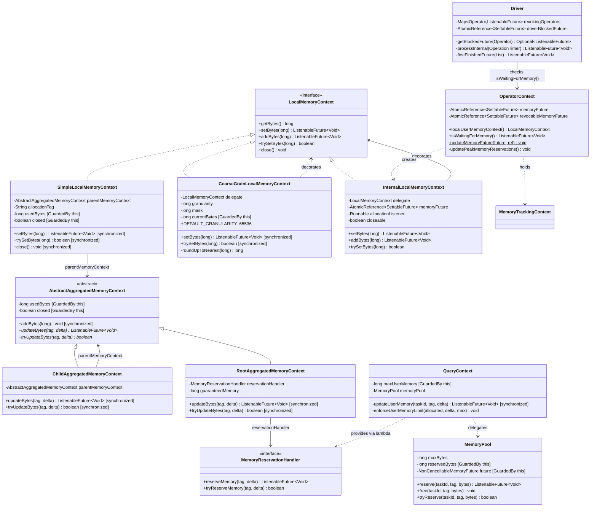
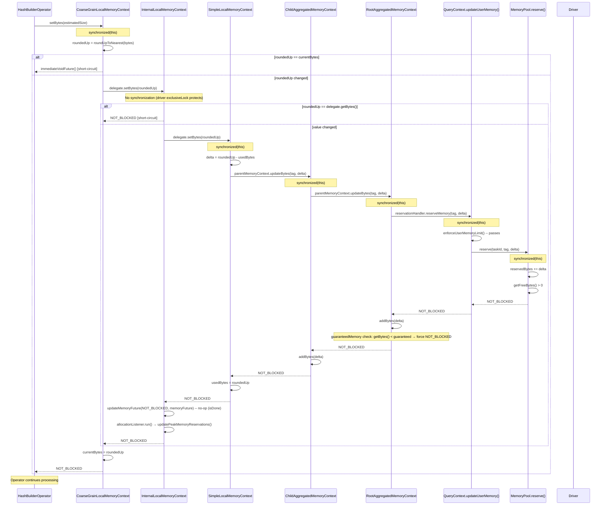
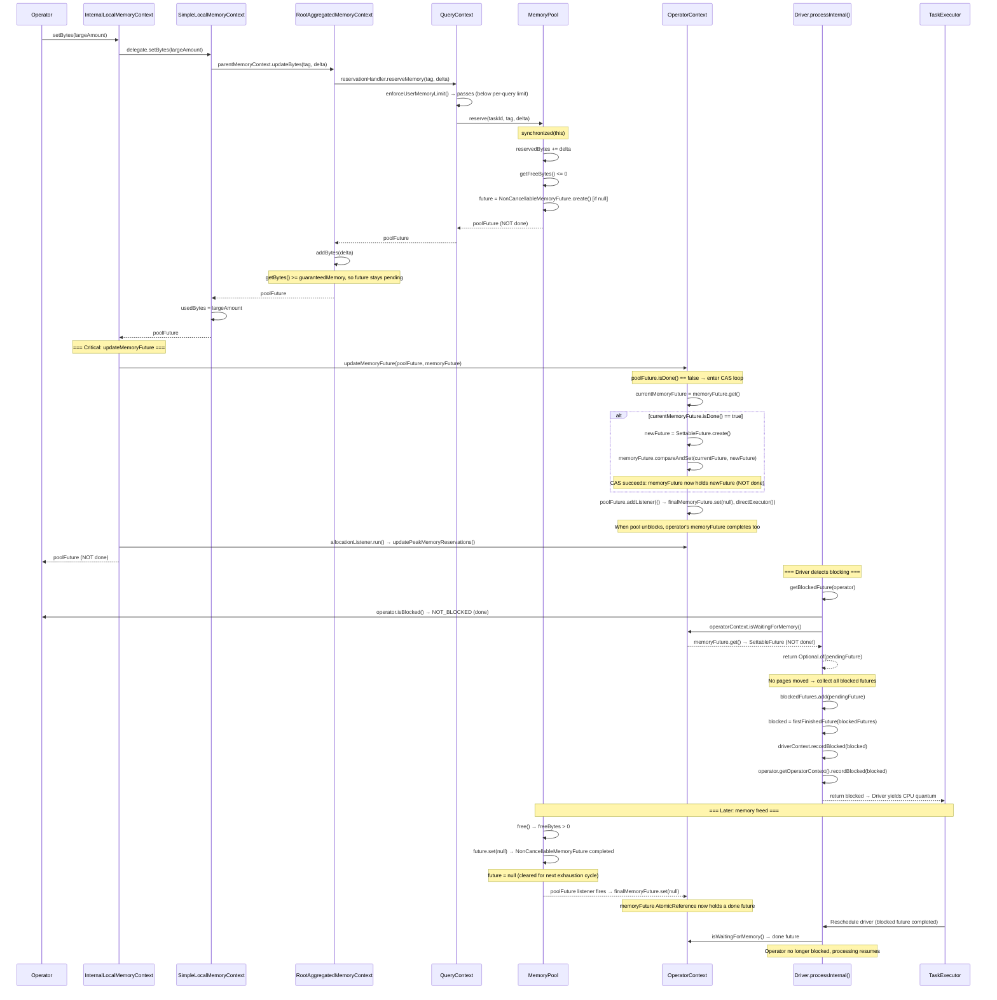
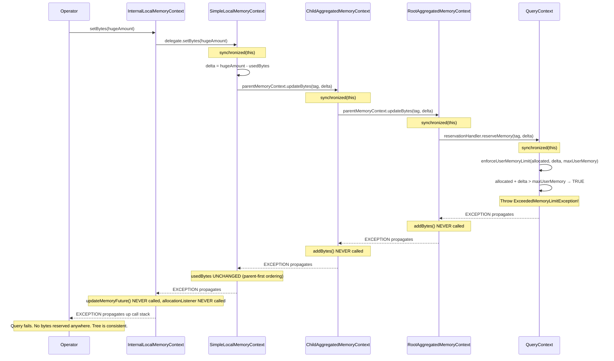

# Module Teardown: Operator Allocation and Blocking (Task 5.2.A)

## 0. Research Focus
* **Task ID:** 5.2.A
* **Focus:** Trace the exact mechanism an Operator uses to report an allocation: `LocalMemoryContext.setBytes()`. What is the exact execution path when this call results in a limit being exceeded? Trace how the resulting `ListenableFuture` is passed back to the Driver yield loop. Cover the full end-to-end path from the operator's `setBytes()` call through the memory tracking tree, through `MemoryPool`, back through `OperatorContext.updateMemoryFuture()`, and into the `Driver.processInternal()` blocking logic.

## 1. High-Level Overview

When an operator in Trino processes data, it must report its memory consumption through the `LocalMemoryContext.setBytes()` API. This single method call triggers a synchronous cascade that:

1. Optionally filters through `CoarseGrainLocalMemoryContext` (64KB boundary rounding)
2. Passes through `InternalLocalMemoryContext` (OperatorContext's decorator)
3. Delegates to `SimpleLocalMemoryContext` (the leaf tracker)
4. Propagates a delta up the `AggregatedMemoryContext` tree (through `ChildAggregatedMemoryContext` nodes)
5. Reaches `RootAggregatedMemoryContext`, which calls the `MemoryReservationHandler`
6. Enters `QueryContext.updateUserMemory()` for per-query limit enforcement
7. Arrives at `MemoryPool.reserve()` for physical pool accounting

The return value -- a `ListenableFuture<Void>` -- encodes the outcome:
- **`NOT_BLOCKED` (immediate/done future):** Memory is available. The operator continues.
- **Pending future (not done):** The pool is exhausted. Bytes are reserved (the pool goes negative), but the operator must block. The future completes when memory is freed.
- **Exception thrown (`ExceededMemoryLimitException`):** The per-query limit is violated. No bytes are reserved. The query dies immediately.

The blocking future propagates back through `InternalLocalMemoryContext`, which calls `OperatorContext.updateMemoryFuture()` to atomically swap a new `SettableFuture` into the operator's `memoryFuture` `AtomicReference` and chain the pool's future to it. The `Driver.processInternal()` loop detects this via `getBlockedFuture()` -> `isWaitingForMemory()`, collects all blocked futures, and returns `firstFinishedFuture(blockedFutures)` to the `TaskExecutor`, yielding the CPU quantum.

## 2. Structural Architecture

### Primary Source Files

| File | Role |
|------|------|
| `lib/trino-memory-context/.../LocalMemoryContext.java` | Interface: `setBytes()`, `addBytes()`, `trySetBytes()`, `close()` |
| `lib/trino-memory-context/.../SimpleLocalMemoryContext.java` | Leaf tracker -- computes delta, calls parent, updates `usedBytes` |
| `lib/trino-memory-context/.../CoarseGrainLocalMemoryContext.java` | 64KB boundary filter -- reduces pool interaction frequency |
| `lib/trino-memory-context/.../AbstractAggregatedMemoryContext.java` | Base class: `updateBytes()`, `tryUpdateBytes()`, `addBytes()` |
| `lib/trino-memory-context/.../ChildAggregatedMemoryContext.java` | Intermediate tree node -- delegates to parent, then updates self |
| `lib/trino-memory-context/.../RootAggregatedMemoryContext.java` | Tree root -- calls `MemoryReservationHandler`, applies `guaranteedMemory` |
| `lib/trino-memory-context/.../MemoryReservationHandler.java` | Interface bridging tree to pool: `reserveMemory()`, `tryReserveMemory()` |
| `lib/trino-memory-context/.../MemoryTrackingContext.java` | Groups user + revocable aggregate and local contexts |
| `core/trino-main/.../OperatorContext.java` | `InternalLocalMemoryContext`, `updateMemoryFuture()`, `isWaitingForMemory()` |
| `core/trino-main/.../Driver.java` | `processInternal()`, `getBlockedFuture()`, `firstFinishedFuture()` |
| `core/trino-main/.../QueryContext.java` | `updateUserMemory()`, `enforceUserMemoryLimit()`, `QueryMemoryReservationHandler` |
| `core/trino-main/.../MemoryPool.java` | `reserve()`, `free()`, `NonCancellableMemoryFuture`, pool-level accounting |
| `core/trino-main/.../ExceededMemoryLimitException.java` | Exception for per-query and global limit violations |

### Key Data Structures

| Structure | Location | Purpose |
|-----------|----------|---------|
| `AtomicReference<SettableFuture<Void>> memoryFuture` | `OperatorContext` | Per-operator blocking signal for user memory |
| `AtomicReference<SettableFuture<Void>> revocableMemoryFuture` | `OperatorContext` | Per-operator blocking signal for revocable memory |
| `NonCancellableMemoryFuture<Void> future` | `MemoryPool` | Single shared pool-level blocking future |
| `long usedBytes` | `SimpleLocalMemoryContext` | Leaf-level bytes tracked (guarded by `synchronized`) |
| `long currentBytes` | `CoarseGrainLocalMemoryContext` | Rounded bytes after 64KB granularity filter |
| `long mask` | `CoarseGrainLocalMemoryContext` | Bitwise mask `~(granularity - 1)` for rounding |
| `long reservedBytes` / `long reservedRevocableBytes` | `MemoryPool` | Pool-level byte counters |
| `Map<QueryId, Long> queryMemoryReservations` | `MemoryPool` | Per-query totals (ConcurrentHashMap for lock-free reads) |
| `Map<QueryId, Map<String, Long>> taggedMemoryAllocations` | `MemoryPool` | Per-query per-operator-type breakdowns |

### Class Diagram



## 3. Execution & Call Flow

### 3.1 The Decorator Stack: Operator to SimpleLocalMemoryContext

When an operator obtains its memory context, it passes through a decoration chain. The exact stack depends on the operator:

**HashBuilderOperator (unspilled) -- typical production stack:**
```
CoarseGrainLocalMemoryContext          ← operator creates this wrapper
  └── InternalLocalMemoryContext       ← OperatorContext.localUserMemoryContext() creates
        └── SimpleLocalMemoryContext   ← MemoryTrackingContext.localUserMemoryContext() provides
```

**AggregationOperator -- minimal stack (no coarse-grain):**
```
InternalLocalMemoryContext             ← OperatorContext.localUserMemoryContext() creates
  └── SimpleLocalMemoryContext         ← MemoryTrackingContext.localUserMemoryContext() provides
```

The decorator chain is assembled during operator construction:

```java
// OperatorContext.java line 309-312
public LocalMemoryContext localUserMemoryContext()
{
    return new InternalLocalMemoryContext(
        operatorMemoryContext.localUserMemoryContext(),   // → SimpleLocalMemoryContext
        memoryFuture,                                     // → AtomicReference<SettableFuture<Void>>
        this::updatePeakMemoryReservations,               // → Runnable
        false);                                           // not closeable by caller
}
```

```java
// HashBuilderOperator.java line 216
this.localUserMemoryContext = new CoarseGrainLocalMemoryContext(
    operatorContext.localUserMemoryContext(),  // → InternalLocalMemoryContext wrapping SimpleLocal
    memorySyncThreshold);                     // DEFAULT_GRANULARITY = 65536
```

### 3.2 Complete Execution Path: `setBytes()` Success (Pool Has Memory)

#### Sequence Diagram


#### Step-by-step Code Trace

**Step 1: Operator calls `setBytes()`**

Real example from `HashBuilderOperator.updateIndex()`:
```java
// HashBuilderOperator.java line 266-276
private void updateIndex(Page page)
{
    checkState(index != null, "index is null");
    index.addPage(page);

    if (!localUserMemoryContext.trySetBytes(index.getEstimatedSize().toBytes())) {
        index.compact();
        localUserMemoryContext.setBytes(index.getEstimatedSize().toBytes());
    }
    operatorContext.recordOutput(page.getSizeInBytes(), page.getPositionCount());
}
```

Real example from `AggregationOperator.addInput()`:
```java
// AggregationOperator.java line 132-143
public void addInput(Page page)
{
    checkState(needsInput(), "Operator is already finishing");
    requireNonNull(page, "page is null");

    long memorySize = 0;
    for (Aggregator aggregate : aggregates) {
        aggregate.processPage(page);
        memorySize += aggregate.getEstimatedSize();
    }
    userMemoryContext.setBytes(memorySize);
}
```

**Step 2: `CoarseGrainLocalMemoryContext.setBytes()` -- 64KB boundary filter**

```java
// CoarseGrainLocalMemoryContext.java line 63-71
@Override
public synchronized ListenableFuture<Void> setBytes(long bytes)
{
    long roundedUpBytes = roundUpToNearest(bytes);
    if (roundedUpBytes != currentBytes) {
        currentBytes = roundedUpBytes;
        return delegate.setBytes(currentBytes);
    }
    return Futures.immediateVoidFuture();
}
```

The rounding uses a bitwise mask:
```java
// CoarseGrainLocalMemoryContext.java line 101-105
long roundUpToNearest(long bytes)
{
    long masked = bytes & mask;
    return masked == bytes ? masked : masked + granularity;
}
```

With `DEFAULT_GRANULARITY = 65536` (`0x10000`), `mask = ~0xFFFF = 0xFFFFFFFFFFFF0000`. For example, `bytes = 100000` -> `masked = 65536`, not equal, so result = `65536 + 65536 = 131072`. This means the delegate only sees updates when the rounded value crosses a 64KB boundary, reducing lock contention upstream.

**Step 3: `InternalLocalMemoryContext.setBytes()` -- OperatorContext decorator**

```java
// OperatorContext.java InternalLocalMemoryContext, line 692-703
@Override
public ListenableFuture<Void> setBytes(long bytes)
{
    if (bytes == delegate.getBytes()) {
        return NOT_BLOCKED;
    }

    ListenableFuture<Void> blocked = delegate.setBytes(bytes);
    updateMemoryFuture(blocked, memoryFuture);
    allocationListener.run();
    return blocked;
}
```

Two side effects after delegation:
1. `updateMemoryFuture(blocked, memoryFuture)` -- atomically propagates blocking state to the operator's `SettableFuture`
2. `allocationListener.run()` -- calls `OperatorContext.updatePeakMemoryReservations()` to track high-water marks

**Step 4: `SimpleLocalMemoryContext.setBytes()` -- leaf tracker**

```java
// SimpleLocalMemoryContext.java line 55-68
@Override
public synchronized ListenableFuture<Void> setBytes(long bytes)
{
    checkState(!closed, "SimpleLocalMemoryContext is already closed");
    checkArgument(bytes >= 0, "bytes cannot be negative");

    if (bytes == usedBytes) {
        return NOT_BLOCKED;
    }

    // update the parent first as it may throw a runtime exception (e.g., ExceededMemoryLimitException)
    ListenableFuture<Void> future = parentMemoryContext.updateBytes(allocationTag, bytes - usedBytes);
    usedBytes = bytes;
    return future;
}
```

Critical ordering: **`parentMemoryContext.updateBytes()` is called BEFORE `usedBytes` is modified.** If the parent throws `ExceededMemoryLimitException`, `usedBytes` remains at its previous value -- the exception path leaves the entire tree consistent.

**Step 5: Tree cascade through `ChildAggregatedMemoryContext`**

```java
// ChildAggregatedMemoryContext.java line 34-41
@Override
synchronized ListenableFuture<Void> updateBytes(String allocationTag, long delta)
{
    checkState(!isClosed(), "ChildAggregatedMemoryContext is already closed");
    // update the parent before updating usedBytes as it may throw a runtime exception
    ListenableFuture<Void> future = parentMemoryContext.updateBytes(allocationTag, delta);
    addBytes(delta);
    return future;
}
```

Same parent-first pattern: `parentMemoryContext.updateBytes()` is called before `addBytes(delta)`. If the parent throws, this node's `usedBytes` is unchanged.

**Step 6: `RootAggregatedMemoryContext.updateBytes()` -- tree root**

```java
// RootAggregatedMemoryContext.java line 34-44
@Override
synchronized ListenableFuture<Void> updateBytes(String allocationTag, long delta)
{
    checkState(!isClosed(), "RootAggregatedMemoryContext is already closed");
    ListenableFuture<Void> future = reservationHandler.reserveMemory(allocationTag, delta);
    addBytes(delta);
    // make sure we never block queries below guaranteedMemory
    if (getBytes() < guaranteedMemory) {
        future = NOT_BLOCKED;
    }
    return future;
}
```

The `guaranteedMemory` check (default: 1 MB per `QueryContext.GUARANTEED_MEMORY`) ensures that queries below the guaranteed threshold are never blocked even if the pool is exhausted. The bytes are still reserved in the pool, but the returned future is forced to `NOT_BLOCKED`.

**Step 7: `QueryContext.updateUserMemory()` -- per-query enforcement**

```java
// QueryContext.java line 164-177
private synchronized ListenableFuture<Void> updateUserMemory(TaskId taskId, String allocationTag, long delta)
{
    if (delta >= 0) {
        enforceUserMemoryLimit(memoryPool.getQueryMemoryReservation(queryId), delta, maxUserMemory);
        ListenableFuture<Void> future = memoryPool.reserve(taskId, allocationTag, delta);
        if (future.isDone()) {
            return NOT_BLOCKED;
        }

        return future;
    }
    memoryPool.free(taskId, allocationTag, -delta);
    return NOT_BLOCKED;
}
```

The per-query limit is checked **before** calling `memoryPool.reserve()`:
```java
// QueryContext.java line 331-336
@GuardedBy("this")
private void enforceUserMemoryLimit(long allocated, long delta, long maxMemory)
{
    if (allocated + delta > maxMemory) {
        throw exceededLocalUserMemoryLimit(succinctBytes(maxMemory), getAdditionalFailureInfo(allocated, delta));
    }
}
```

**Step 8: `MemoryPool.reserve()` -- physical pool accounting**

```java
// MemoryPool.java line 123-149
public ListenableFuture<Void> reserve(TaskId taskId, String allocationTag, long bytes)
{
    checkArgument(bytes >= 0, "'%s' is negative", bytes);
    ListenableFuture<Void> result;
    synchronized (this) {
        if (bytes != 0) {
            QueryId queryId = taskId.queryId();
            queryMemoryReservations.merge(queryId, bytes, Long::sum);
            updateTaggedMemoryAllocations(queryId, allocationTag, bytes);
            taskMemoryReservations.merge(taskId, bytes, Long::sum);
        }
        reservedBytes += bytes;
        if (getFreeBytes() <= 0) {
            if (future == null) {
                future = NonCancellableMemoryFuture.create();
            }
            checkState(!future.isDone(), "future is already completed");
            result = future;
        }
        else {
            result = NOT_BLOCKED;
        }
    }

    onMemoryReserved();
    return result;
}
```

Key details:
- **Bytes are always reserved**, even when the pool goes negative. `reservedBytes += bytes` happens unconditionally.
- **`getFreeBytes()` can go negative:** `maxBytes - reservedBytes - reservedRevocableBytes`. The pool is over-committed.
- **Single shared future:** There is exactly one `NonCancellableMemoryFuture` per pool. All operators that find the pool exhausted receive the same future instance.
- **`onMemoryReserved()`** fires after releasing the lock, notifying listeners (used by memory revocation).

### 3.3 Complete Execution Path: `setBytes()` When Pool Is Exhausted (Blocking)



### 3.4 `updateMemoryFuture()` -- The Lock-Free Cross-Thread Bridge

This is the most intricate piece of the blocking mechanism. It bridges two threads:
- **Driver thread:** reads `memoryFuture.get()` in `isWaitingForMemory()`
- **Pool-freeing thread:** completes the pool future, which fires the chained listener

```java
// OperatorContext.java line 369-388
private static void updateMemoryFuture(ListenableFuture<Void> memoryPoolFuture, AtomicReference<SettableFuture<Void>> targetFutureReference)
{
    if (!memoryPoolFuture.isDone()) {
        SettableFuture<Void> currentMemoryFuture = targetFutureReference.get();
        while (currentMemoryFuture.isDone()) {
            SettableFuture<Void> settableFuture = SettableFuture.create();
            // We can't replace one that's not done, because the task may be blocked on that future
            if (targetFutureReference.compareAndSet(currentMemoryFuture, settableFuture)) {
                currentMemoryFuture = settableFuture;
            }
            else {
                currentMemoryFuture = targetFutureReference.get();
            }
        }

        SettableFuture<Void> finalMemoryFuture = currentMemoryFuture;
        // Create a new future, so that this operator can un-block before the pool does, if it's moved to a new pool
        memoryPoolFuture.addListener(() -> finalMemoryFuture.set(null), directExecutor());
    }
}
```

**Algorithm walkthrough:**

1. **Guard:** If `memoryPoolFuture.isDone()`, do nothing -- no blocking needed.
2. **CAS loop:** Ensure `targetFutureReference` holds a NOT-done future:
   - Read `currentMemoryFuture = targetFutureReference.get()`
   - If it's already done (the operator was previously unblocked), create a new `SettableFuture` and CAS-swap it in
   - The comment is critical: *"We can't replace one that's not done, because the task may be blocked on that future"*
   - If CAS fails (another thread swapped in a different future), re-read and try again
   - Loop exits when `currentMemoryFuture.isDone() == false` -- we have a pending future to chain to
3. **Chain listener:** `memoryPoolFuture.addListener(() -> finalMemoryFuture.set(null), directExecutor())` -- when the pool future completes, complete the operator's future too.

**Why `SettableFuture` and not just forward the pool future?** The comment says: *"Create a new future, so that this operator can un-block before the pool does, if it's moved to a new pool."* This is for query migration scenarios -- the operator can be unblocked independently of the pool.

**Initialization:** The `memoryFuture` starts as a completed `SettableFuture`:
```java
// OperatorContext constructor, line 135-136
this.memoryFuture = new AtomicReference<>(SettableFuture.create());
this.memoryFuture.get().set(null);
```

### 3.5 Complete Execution Path: `setBytes()` When Per-Query Limit Exceeded (Exception)



The key design insight is **parent-first mutation ordering**. In every method:

```java
// SimpleLocalMemoryContext.setBytes()
ListenableFuture<Void> future = parentMemoryContext.updateBytes(allocationTag, bytes - usedBytes);  // ← parent FIRST
usedBytes = bytes;  // ← local SECOND (only if parent didn't throw)

// ChildAggregatedMemoryContext.updateBytes()
ListenableFuture<Void> future = parentMemoryContext.updateBytes(allocationTag, delta);  // ← parent FIRST
addBytes(delta);  // ← local SECOND

// RootAggregatedMemoryContext.updateBytes()
ListenableFuture<Void> future = reservationHandler.reserveMemory(allocationTag, delta);  // ← handler FIRST
addBytes(delta);  // ← local SECOND
```

The exception thrown by `enforceUserMemoryLimit()` unwinds the entire call stack without any intermediate node having modified its `usedBytes`. The tree remains perfectly consistent.

**The exception itself:**
```java
// ExceededMemoryLimitException.java line 37-41
public static ExceededMemoryLimitException exceededLocalUserMemoryLimit(DataSize maxMemory, String additionalFailureInfo)
{
    return new ExceededMemoryLimitException(EXCEEDED_LOCAL_MEMORY_LIMIT,
            format("Query exceeded per-node memory limit of %s [%s]", maxMemory, additionalFailureInfo));
}
```

The `additionalFailureInfo` includes diagnostic information:
```java
// QueryContext.java line 339-358
private String getAdditionalFailureInfo(long allocated, long delta)
{
    Map<String, Long> queryAllocations = memoryPool.getTaggedMemoryAllocations().get(queryId);
    String additionalInfo = format("Allocated: %s, Delta: %s", succinctBytes(allocated), succinctBytes(delta));

    if (queryAllocations == null) {
        return additionalInfo;
    }

    String topConsumers = queryAllocations.entrySet().stream()
            .sorted(comparingByValue(Comparator.reverseOrder()))
            .limit(3)
            .filter(e -> e.getValue() >= 0)
            .collect(toImmutableMap(Entry::getKey, e -> succinctBytes(e.getValue())))
            .toString();

    return format("%s, Top Consumers: %s", additionalInfo, topConsumers);
}
```

This provides the user with the top 3 memory-consuming operator types for the query.

### 3.6 Driver Integration: From Blocked Future to Yield

The `Driver.processInternal()` method is the core processing loop. It interleaves page movement between operators with blocking detection.

**Phase 1: Page movement loop**
```java
// Driver.java line 390-424
boolean movedPage = false;
for (int i = 0; i < activeOperators.size() - 1 && !driverContext.isTerminatingOrDone(); i++) {
    Operator current = activeOperators.get(i);
    Operator next = activeOperators.get(i + 1);

    // skip blocked operator
    if (getBlockedFuture(current).isPresent()) {
        continue;
    }

    // if the current operator is not finished and next operator isn't blocked and needs input...
    if (!current.isFinished() && getBlockedFuture(next).isEmpty() && next.needsInput()) {
        // get an output page from current operator
        Page page = current.getOutput();
        current.getOperatorContext().recordGetOutput(operationTimer, page);

        // if we got an output page, add it to the next operator
        if (page != null && page.getPositionCount() != 0) {
            next.addInput(page);
            next.getOperatorContext().recordAddInput(operationTimer, page);
            movedPage = true;
        }
        ...
    }
    ...
}
```

Note: `getBlockedFuture()` is called **before** attempting `getOutput()` or `addInput()`. If an operator is memory-blocked, it is skipped entirely -- no CPU time is spent on it.

**Phase 2: `getBlockedFuture()` -- the four-source priority check**

```java
// Driver.java line 602-622
private Optional<ListenableFuture<Void>> getBlockedFuture(Operator operator)
{
    // 1. Memory revocation in progress (highest priority)
    ListenableFuture<Void> blocked = revokingOperators.get(operator);
    if (blocked != null) {
        // We mark operator as blocked regardless of blocked.isDone(),
        // because finishMemoryRevoke has not been called yet.
        return Optional.of(blocked);
    }

    // 2. Operator's own blocking (e.g., network I/O, waiting for lookup source)
    blocked = operator.isBlocked();
    if (!blocked.isDone()) {
        return Optional.of(blocked);
    }

    // 3. Waiting for user memory
    blocked = operator.getOperatorContext().isWaitingForMemory();
    if (!blocked.isDone()) {
        return Optional.of(blocked);
    }

    // 4. Waiting for revocable memory
    blocked = operator.getOperatorContext().isWaitingForRevocableMemory();
    if (!blocked.isDone()) {
        return Optional.of(blocked);
    }

    return Optional.empty();
}
```

`isWaitingForMemory()` simply returns the current value of the `AtomicReference`:
```java
// OperatorContext.java line 292-295
public ListenableFuture<Void> isWaitingForMemory()
{
    return memoryFuture.get();
}
```

This is the read side of the cross-thread bridge. The driver thread reads the `SettableFuture` that was atomically swapped in by `updateMemoryFuture()`. If it's not done, the operator is memory-blocked.

**Phase 3: Blocked future collection and yield**

```java
// Driver.java line 447-481
// if we did not move any pages, check if we are blocked
if (!movedPage) {
    List<Operator> blockedOperators = new ArrayList<>();
    List<ListenableFuture<Void>> blockedFutures = new ArrayList<>();
    for (Operator operator : activeOperators) {
        Optional<ListenableFuture<Void>> blocked = getBlockedFuture(operator);
        if (blocked.isPresent()) {
            blockedOperators.add(operator);
            blockedFutures.add(blocked.get());
        }
    }

    if (!blockedFutures.isEmpty()) {
        // allow for operators to unblock drivers when they become finished
        for (Operator operator : activeOperators) {
            operator.getOperatorContext().getFinishedFuture().ifPresent(blockedFutures::add);
        }

        // unblock when the first future is complete
        ListenableFuture<Void> blocked = firstFinishedFuture(blockedFutures);
        if (driverContext.getBlockedTimeout().isPresent()) {
            blocked = withTimeout(
                    nonCancellationPropagating(blocked),
                    driverContext.getBlockedTimeout().get().toMillis(),
                    MILLISECONDS,
                    driverContext.getTimeoutExecutor());
        }
        // driver records serial blocked time
        driverContext.recordBlocked(blocked);
        // each blocked operator is responsible for blocking the execution
        // until one of the operators can continue
        for (Operator operator : blockedOperators) {
            operator.getOperatorContext().recordBlocked(blocked);
        }
        return blocked;
    }
}
```

Key details:
- **Only checked when no pages moved:** If `movedPage == true`, the driver returns `NOT_BLOCKED` and gets rescheduled immediately for another iteration.
- **Finished futures added:** `operator.getOperatorContext().getFinishedFuture()` is also added to the list. This handles operators like `HashBuilderOperator` that set a "finished" future when the lookup source is no longer needed.
- **`firstFinishedFuture()`:** Creates a `SettableFuture` that completes when ANY of the input futures completes:
  ```java
  // Driver.java line 656-669
  private static ListenableFuture<Void> firstFinishedFuture(List<ListenableFuture<Void>> futures)
  {
      if (futures.size() == 1) {
          return futures.get(0);
      }
      SettableFuture<Void> result = SettableFuture.create();
      for (ListenableFuture<Void> future : futures) {
          future.addListener(() -> result.set(null), directExecutor());
      }
      return result;
  }
  ```
- **Blocked timeout:** If configured, wraps the future with a timeout so the driver doesn't hang indefinitely.
- **Recording:** Both `driverContext.recordBlocked()` and `operator.getOperatorContext().recordBlocked()` are called for metrics/diagnostics.

**Phase 4: `process()` receives the blocked future and returns it to the TaskExecutor**

```java
// Driver.java line 298-338
Optional<ListenableFuture<Void>> result = tryWithLock(100, TimeUnit.MILLISECONDS, true, () -> {
    ...
    try {
        long start = System.nanoTime();
        int iterations = 0;
        while (!isTerminatingOrDoneInternal()) {
            ListenableFuture<Void> future = processInternal(operationTimer);
            iterations++;
            if (!future.isDone()) {
                return updateDriverBlockedFuture(future);  // ← wraps blocked future
            }
            if (System.nanoTime() - start >= maxRuntimeInNanos || iterations >= maxIterations) {
                break;
            }
        }
    }
    ...
    return NOT_BLOCKED;
});
```

**`updateDriverBlockedFuture()`** wraps the blocked future with the memory revocation signal:
```java
// Driver.java line 348-369
private ListenableFuture<Void> updateDriverBlockedFuture(ListenableFuture<Void> sourceBlockedFuture)
{
    // driverBlockedFuture will be completed as soon as the sourceBlockedFuture is completed
    // or any of the operators gets a memory revocation request
    SettableFuture<Void> newDriverBlockedFuture = SettableFuture.create();
    driverBlockedFuture.set(newDriverBlockedFuture);
    sourceBlockedFuture.addListener(() -> newDriverBlockedFuture.set(null), directExecutor());

    // it's possible that memory revoking is requested for some operator
    // before we update driverBlockedFuture above and we don't want to miss that
    // notification, so we check to see whether that's the case before returning.
    boolean memoryRevokingRequested = activeOperators.stream()
            .filter(operator -> !revokingOperators.containsKey(operator))
            .map(Operator::getOperatorContext)
            .anyMatch(OperatorContext::isMemoryRevokingRequested);

    if (memoryRevokingRequested) {
        newDriverBlockedFuture.set(null);
    }

    return newDriverBlockedFuture;
}
```

This creates an additional `SettableFuture` that can be completed by EITHER:
1. The original blocked future completing (memory freed, operator unblocked)
2. A memory revocation request arriving (which sets `driverBlockedFuture.get().set(null)` via the listener installed in `initialize()`)

The `initialize()` method sets up the revocation signal:
```java
// Driver.java line 152-155
private void initialize()
{
    activeOperators.stream()
            .map(Operator::getOperatorContext)
            .forEach(operatorContext -> operatorContext.setMemoryRevocationRequestListener(
                () -> driverBlockedFuture.get().set(null)));
}
```

### 3.7 `MemoryPool.free()` -- Unblocking the Chain

```java
// MemoryPool.java line 219-260
public synchronized void free(TaskId taskId, String allocationTag, long bytes)
{
    checkArgument(bytes >= 0, "'%s' is negative", bytes);
    checkArgument(reservedBytes >= bytes, "tried to free more memory than is reserved");
    if (bytes == 0) {
        return;
    }

    QueryId queryId = taskId.queryId();
    // ... update queryMemoryReservations, taggedMemoryAllocations, taskMemoryReservations ...

    reservedBytes -= bytes;
    if (getFreeBytes() > 0 && future != null) {
        future.set(null);
        future = null;
    }
}
```

When `free()` causes `getFreeBytes()` to go positive:
1. `future.set(null)` completes the `NonCancellableMemoryFuture`
2. `future = null` clears the reference (a new one will be created if the pool gets exhausted again)
3. The completion of `future` triggers all chained listeners, including those registered by `updateMemoryFuture()`:
   - `memoryPoolFuture.addListener(() -> finalMemoryFuture.set(null), directExecutor())` fires
   - The operator's `SettableFuture` completes
   - The driver's `driverBlockedFuture` completes (chained from `firstFinishedFuture`)
   - The `TaskExecutor` reschedules the driver

### 3.8 `trySetBytes()` Path -- Non-Blocking Probe

```java
// SimpleLocalMemoryContext.java line 77-87
@Override
public synchronized boolean trySetBytes(long bytes)
{
    checkState(!closed, "SimpleLocalMemoryContext is already closed");
    checkArgument(bytes >= 0, "bytes cannot be negative");
    long delta = bytes - usedBytes;
    if (parentMemoryContext.tryUpdateBytes(allocationTag, delta)) {
        usedBytes = bytes;
        return true;
    }
    return false;
}
```

This path uses `MemoryPool.tryReserve()` which checks `getFreeBytes() - bytes < 0` BEFORE reserving:
```java
// MemoryPool.java line 185-203
public boolean tryReserve(TaskId taskId, String allocationTag, long bytes)
{
    checkArgument(bytes >= 0, "'%s' is negative", bytes);
    synchronized (this) {
        if (getFreeBytes() - bytes < 0) {
            return false;  // ← does NOT reserve, does NOT go negative
        }
        reservedBytes += bytes;
        ...
    }
    onMemoryReserved();
    return true;
}
```

Unlike `reserve()`, `tryReserve()` does **not** over-commit the pool. It returns `false` without modifying any state. `InternalLocalMemoryContext.trySetBytes()` does not call `updateMemoryFuture()` -- no blocking signal is propagated.

### 3.9 HashBuilderOperator.finishInput() -- The Yield-Before-Build Pattern

A particularly sophisticated use of the memory future occurs in `HashBuilderOperator.finishInput()`:

```java
// HashBuilderOperator.java line 310-333
private void finishInput()
{
    checkState(state == State.CONSUMING_INPUT);
    if (lookupSourceFactoryDestroyed.isDone()) {
        close();
        return;
    }

    checkState(index != null, "index is null");
    ListenableFuture<Void> reserved = localUserMemoryContext.setBytes(
        index.getEstimatedMemoryRequiredToCreateLookupSource(
            hashArraySizeSupplier, sortChannel, hashChannels));
    if (!reserved.isDone() || !operatorContext.isWaitingForMemory().isDone()) {
        // Yield when not enough memory is available to proceed,
        // finish is expected to be called again when some memory is freed
        return;
    }
    LookupSourceSupplier partition = buildLookupSource();
    localUserMemoryContext.setBytes(partition.get().getInMemorySizeInBytes());
    ...
}
```

This checks BOTH:
1. The returned future from `setBytes()` (direct pool signal)
2. `operatorContext.isWaitingForMemory()` (the operator-level `SettableFuture`)

The `isWaitingForMemory()` check is needed because `CoarseGrainLocalMemoryContext` might have filtered out the `setBytes()` call (rounding didn't change), but a PREVIOUS call may have left the operator in a blocked state. The operator must wait for that previous blocking to resolve before building the lookup source.

## 4. Concurrency & State Management

### Threading Model

| Thread | Accesses | Synchronization |
|--------|----------|----------------|
| Driver thread (TaskExecutor worker) | Calls `setBytes()`, reads `isWaitingForMemory()` | `Driver.exclusiveLock` (ReentrantLock) ensures single-threaded access per driver |
| Memory-freeing thread (any thread calling `MemoryPool.free()`) | Completes `NonCancellableMemoryFuture`, triggering chained listener | `MemoryPool synchronized(this)` for pool state; listener fires via `directExecutor()` |
| Memory revocation thread (can be any thread) | Sets `memoryRevokingRequested`, triggers revocation listener | `OperatorContext synchronized(this)` for revocation state |

### Synchronization Hierarchy (Lock Acquisition Order)

```
Driver.exclusiveLock (outermost)
  └── CoarseGrainLocalMemoryContext.this (synchronized)
        └── SimpleLocalMemoryContext.this (synchronized)
              └── ChildAggregatedMemoryContext.this (synchronized)
                    └── ... (tree cascade)
                          └── RootAggregatedMemoryContext.this (synchronized)
                                └── QueryContext.this (synchronized)
                                      └── MemoryPool.this (synchronized, innermost)
```

All locks are acquired in the same order during `setBytes()`. The driver's `exclusiveLock` is the outermost boundary -- it ensures only one thread processes a given driver at a time. The memory context locks protect individual context state. `MemoryPool.this` is always the innermost lock.

### State Machine: Operator Memory Lifecycle

```
                 ┌─────────────────────────────────────────────┐
                 │                                             │
    ┌────────────▼────────────┐     pool returns          ┌───┴──────────┐
    │         ACTIVE          │     pending future         │   BLOCKED    │
    │ memoryFuture.isDone()   │──────────────────────────→│   memoryFuture│
    │   == true               │   (updateMemoryFuture     │   NOT done   │
    │                         │    swaps new future)      │              │
    └────────┬────────────────┘                           └──────┬───────┘
             │                                                    │
             │                          pool.free() fires         │
             │                          chained listener          │
             │                    ◄───────────────────────────────┘
             │
             │  close()/destroy()
             ▼
    ┌─────────────────────────┐
    │         CLOSED          │
    │  All bytes freed        │
    │  Contexts closed        │
    └─────────────────────────┘
```

### The `AtomicReference<SettableFuture<Void>>` Cross-Thread Protocol

The `memoryFuture` on `OperatorContext` is the critical cross-thread communication point:

**Write side (driver thread, inside `updateMemoryFuture()`):**
1. Check if pool future is pending (`!memoryPoolFuture.isDone()`)
2. CAS-loop to swap in a new NOT-done `SettableFuture` (only if current one is done)
3. Chain pool future to the new `SettableFuture` via `addListener()`

**Read side (driver thread, inside `processInternal()`):**
1. `operatorContext.isWaitingForMemory()` returns `memoryFuture.get()`
2. If NOT done, operator is blocked

**Completion side (pool-freeing thread, via listener):**
1. `MemoryPool.free()` calls `future.set(null)` on the `NonCancellableMemoryFuture`
2. The `addListener` callback fires: `finalMemoryFuture.set(null)`
3. The operator's `SettableFuture` is now done
4. The `firstFinishedFuture` in the driver completes
5. The `TaskExecutor` reschedules the driver

**Race condition handling:** The CAS loop in `updateMemoryFuture()` handles the case where:
- Thread A is in `updateMemoryFuture()` creating a new future
- Thread B has already completed the previous future (pool freed)
- Thread A's CAS fails because thread B changed the reference
- Thread A re-reads and finds a non-done future (possibly set by another concurrent allocation), and chains to it instead

## 5. Memory & Resource Profile

### Allocation Patterns by Operator

| Operator | Context Stack | Strategy | Timing | Code |
|----------|--------------|----------|--------|------|
| `HashBuilderOperator` (unspilled) | `CoarseGrain` -> `Internal` -> `Simple` | `trySetBytes()` -> compact -> `setBytes()` | After each `addPage()` to index | `updateIndex()` |
| `HashBuilderOperator` (unspilled, finish) | Same stack | `setBytes()` then check `isDone()` + `isWaitingForMemory()` | During `finishInput()` before build | `finishInput()` |
| `AggregationOperator` | `Internal` -> `Simple` | `setBytes(total)` -- sum all aggregators | Once per `addInput()` page | `addInput()` |
| `ScanFilterAndProjectOperator` | `InternalAggregated` -> sub-contexts | Aggregated context with sub-local-contexts | Per-component via `WorkProcessor` | `SplitToPages` transform |

### Future Types in the System

| Future Type | Created By | Properties |
|-------------|-----------|------------|
| `NOT_BLOCKED` / `immediateVoidFuture()` | Various | Pre-completed singleton; indicates no blocking |
| `NonCancellableMemoryFuture<Void>` | `MemoryPool.reserve()` | Cannot be canceled (throws on `cancel()`); shared across all operators hitting pool exhaustion |
| `SettableFuture<Void>` (in `memoryFuture`) | `updateMemoryFuture()` | Per-operator; chained to pool future; completed when pool future completes |
| `SettableFuture<Void>` (in `driverBlockedFuture`) | `updateDriverBlockedFuture()` | Per-driver; completed by pool OR revocation signal |
| `SettableFuture<Void>` (from `firstFinishedFuture`) | `Driver.firstFinishedFuture()` | Composites multiple blocked futures; completes when any input completes |

### Memory Overhead of the Tracking Infrastructure

Per operator:
- 1 `AtomicReference<SettableFuture<Void>>` for user memory (8 bytes reference + SettableFuture object)
- 1 `AtomicReference<SettableFuture<Void>>` for revocable memory
- 3 `AtomicLong` for peak tracking (24 bytes)
- 1 `InternalLocalMemoryContext` (references only, no allocation)
- Optional: 1 `CoarseGrainLocalMemoryContext` (24 bytes extra: granularity, mask, currentBytes)

Per memory pool:
- 1 `NonCancellableMemoryFuture` when pool is exhausted (allocated lazily, cleared on `free()`)
- `ConcurrentHashMap<QueryId, Long>` for per-query totals
- `HashMap<QueryId, Map<String, Long>>` for tagged allocations (diagnostic)

### `CoarseGrainLocalMemoryContext` Reduction Factor

With 64KB granularity, an operator that increments memory by ~100 bytes per row (common for hash tables processing small rows) will only trigger a delegate call every ~655 rows. For a 1M-row input, this reduces 1,000,000 `synchronized` calls on the parent chain to ~1,525 -- a ~655x reduction in lock contention.

## 6. Key Design Insights

* **Two-outcome bifurcation from a single `setBytes()` call.** The same API surface produces radically different outcomes: pool exhaustion returns a pending future (bytes are reserved, operator blocks, recoverable when memory is freed) versus per-query limit violation throws `ExceededMemoryLimitException` (no bytes reserved, query dies). The per-query check in `enforceUserMemoryLimit()` happens BEFORE `MemoryPool.reserve()`, so the pool never sees the allocation when the limit is violated.

* **Parent-first mutation ordering guarantees exception-safe tree consistency.** Every node in the tracking tree calls its parent BEFORE updating its own `usedBytes`. When `ExceededMemoryLimitException` unwinds the stack, no intermediate node has mutated. This is a deliberate, structural invariant documented in comments throughout the codebase (e.g., `SimpleLocalMemoryContext.setBytes()`: "update the parent first as it may throw a runtime exception").

* **The `MemoryPool` over-commits intentionally.** `reserve()` always adds to `reservedBytes` even when `getFreeBytes()` goes negative. The pool does not refuse the allocation -- it tracks the debt and returns a pending future. This design means the actual memory is consumed (the operator holds the data), but the scheduling system prevents the operator from consuming more until others free up. The pool is a soft limit enforced by cooperative yielding, not a hard limit.

* **Lock-free `updateMemoryFuture()` bridges two threads without contention.** The CAS loop on `AtomicReference<SettableFuture<Void>>` avoids holding any lock during the driver-to-pool handoff. The driver thread atomically swaps in a new pending future and chains it to the pool's future. The pool-freeing thread completes the chain via `addListener()` with `directExecutor()`. This is the only piece of the memory tracking system that communicates across threads without a `synchronized` block.

* **`CoarseGrainLocalMemoryContext` eliminates ~99.8% of lock contention for byte-level reporters.** By filtering `setBytes()` calls through a 64KB boundary check before taking any lock, operators that report memory after every row (or even every byte) avoid cascading through the entire `synchronized` tree. The filter is purely arithmetic (`bytes & mask`), has zero allocation overhead, and short-circuits with `immediateVoidFuture()`.

* **The driver's `getBlockedFuture()` checks four sources in strict priority order.** (1) Memory revocation in progress, (2) operator's own `isBlocked()`, (3) waiting for user memory, (4) waiting for revocable memory. Revocation always wins because the operator must complete its spill before any other processing. The separate `isWaitingForMemory()` check (rather than relying on operator `isBlocked()`) decouples memory pressure from operator-specific blocking (e.g., network I/O), enabling fine-grained diagnostics.

* **`firstFinishedFuture()` implements cooperative multi-source wakeup.** Rather than blocking on a single future, the driver collects ALL blocked futures (from all operators), adds `finishedFuture` entries (for operators that can signal completion), and creates a composite future that completes when ANY source resolves. Combined with `updateDriverBlockedFuture()` (which adds the memory revocation signal), this means the driver wakes up for the earliest of: memory freed, operator unblocked, revocation requested, or operator finished.

## 7. Porting Considerations (Java -> Target Architecture)

### Key Translation Challenges

| Java Pattern | Challenge | Rust Approach |
|-------------|-----------|---------------|
| `ListenableFuture<Void>` return from `setBytes()` | Entire cooperative scheduling model depends on futures | Return `Result<MemoryFuture, MemoryLimitError>` where `MemoryFuture` is `Ready` or `Blocked(Arc<Notify>)` |
| `AtomicReference<SettableFuture<Void>>` + CAS loop in `updateMemoryFuture()` | Lock-free swap-and-chain for cross-thread signaling | `Arc<AtomicBool>` + `Arc<tokio::sync::Notify>` or a custom `WaitHandle` |
| `NonCancellableMemoryFuture` (single shared pool future) | All blocked operators share one future; completion broadcasts to all | `Arc<Notify>` with `notify_waiters()` on free |
| `firstFinishedFuture()` (composite "any of" future) | Combines N futures into one that completes on first | `tokio::select!` or `futures::future::select_all()` |
| `synchronized` on every `AbstractAggregatedMemoryContext` node | Cascading lock acquisition from leaf to root | `Mutex` per node, or redesign to batch updates through a single lock |
| Exception-based limit enforcement (`ExceededMemoryLimitException`) | Thrown from deep inside `setBytes()` chain, unwinds without mutation | `Result<_, MemoryLimitError>` propagated through `?` operator; parent-first ordering naturally works with `Result` |

### Recommended Rust Abstractions

**Memory future type:**
```rust
enum MemoryFuture {
    Ready,
    Blocked(Arc<tokio::sync::Notify>),
}

// setBytes returns Result to separate limit-exceeded from pool-exhausted
fn set_bytes(&mut self, bytes: i64) -> Result<MemoryFuture, MemoryLimitError> {
    let delta = bytes - self.used_bytes;
    let future = self.parent.update_bytes(self.tag, delta)?;  // ? propagates limit error
    self.used_bytes = bytes;
    Ok(future)
}
```

**Operator blocking state:**
```rust
struct OperatorMemoryState {
    is_blocked: AtomicBool,
    notify: Arc<Notify>,
}

impl OperatorMemoryState {
    fn update_memory_future(&self, pool_future: &MemoryFuture) {
        match pool_future {
            MemoryFuture::Ready => { /* no-op */ }
            MemoryFuture::Blocked(pool_notify) => {
                self.is_blocked.store(true, Ordering::Release);
                let notify = self.notify.clone();
                let is_blocked = self.is_blocked.clone(); // Arc<AtomicBool>
                // When pool unblocks, unblock the operator
                tokio::spawn(async move {
                    pool_notify.notified().await;
                    is_blocked.store(false, Ordering::Release);
                    notify.notify_waiters();
                });
            }
        }
    }

    fn is_waiting_for_memory(&self) -> bool {
        self.is_blocked.load(Ordering::Acquire)
    }
}
```

**Driver yield loop:**
```rust
async fn process_internal(&mut self) -> DriverBlocked {
    // ... page movement loop ...
    if !moved_page {
        let blocked: Vec<Arc<Notify>> = self.active_operators.iter()
            .filter_map(|op| {
                if op.context().memory_state().is_waiting_for_memory() {
                    Some(op.context().memory_state().notify.clone())
                } else {
                    None
                }
            })
            .collect();

        if !blocked.is_empty() {
            // Yield until any operator unblocks
            let futures: Vec<_> = blocked.iter()
                .map(|n| Box::pin(n.notified()))
                .collect();
            futures::future::select_all(futures).await;
            return DriverBlocked::WasBlocked;
        }
    }
    DriverBlocked::NotBlocked
}
```

**RAII-based `LocalMemoryContext`:**
```rust
struct LocalMemoryContext {
    parent: Arc<dyn AggregatedMemoryContext>,
    tag: &'static str,
    used_bytes: i64,
}

impl Drop for LocalMemoryContext {
    fn drop(&mut self) {
        if self.used_bytes != 0 {
            // Ignore errors on cleanup -- the query is already being torn down
            let _ = self.parent.update_bytes(self.tag, -self.used_bytes);
        }
    }
}
```

### Critical Porting Decision: Lock Cascade vs. Single Lock

The Java implementation acquires N `synchronized` locks during a single `setBytes()` call (one per tree node). In Rust, this cascading `Mutex` acquisition is error-prone and may cause deadlocks if the lock order is ever violated. Two alternatives:

1. **Replicate the cascade:** Use `std::sync::Mutex` per node, with strict ordering. Risk: lock ordering bugs.
2. **Single root lock:** Acquire one `Mutex` at the `RootAggregatedMemoryContext` level and propagate the delta atomically. Trade-off: higher contention at the root, but simpler correctness reasoning. Since `CoarseGrainLocalMemoryContext` already reduces calls by ~655x, the root lock may not be a bottleneck.

### Outcome Summary

| Condition | `setBytes()` Return | Pool State | Tree State | Operator State |
|-----------|---------------------|-----------|------------|---------------|
| Memory available | `NOT_BLOCKED` (done future) | `reservedBytes` updated, `freeBytes > 0` | All levels updated | Continues processing |
| Pool exhausted | Pending `NonCancellableMemoryFuture` | `reservedBytes` updated, `freeBytes <= 0` | All levels updated | Blocked; driver yields via `firstFinishedFuture()` |
| Per-query limit exceeded | `ExceededMemoryLimitException` thrown | **Unchanged** (never reached) | **Unchanged** (parent-first ordering) | Query fails immediately |
| `trySetBytes()` pool insufficient | Returns `false` | **Unchanged** | **Unchanged** | Operator decides (compact, spill, etc.) |
| Below `guaranteedMemory` (1MB) | `NOT_BLOCKED` even if pool exhausted | `reservedBytes` updated | All levels updated | Continues despite pool exhaustion |
