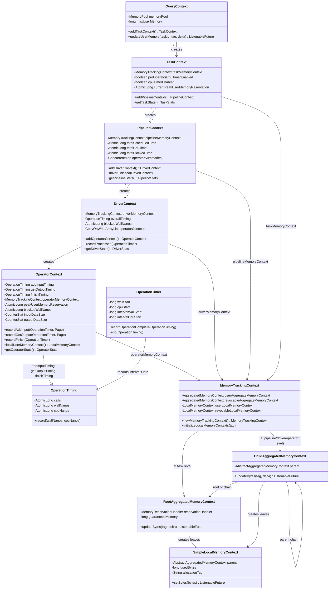
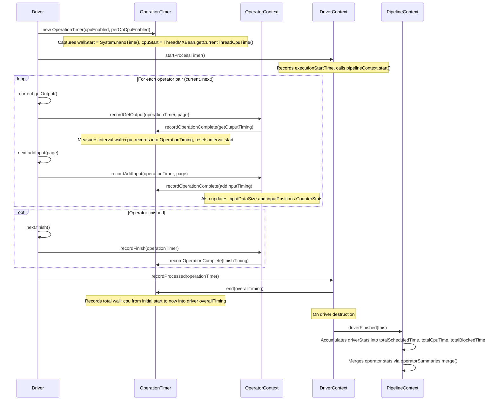
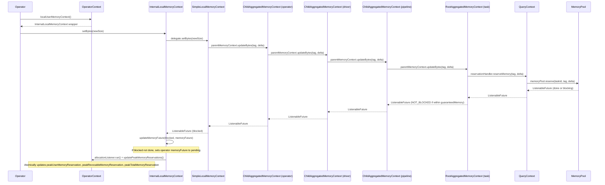

# Module Teardown: Operator Resource Context (Task 3.1.B)

## 0. Research Focus
* **Task ID:** 3.1.B
* **Focus:** How does an individual Operator track its CPU time, wall time, and memory allocations? How do these localized metrics bubble up to the DriverContext?

## 1. High-Level Overview
* **Core Responsibility:** Each Trino operator is wrapped by an `OperatorContext` that owns dedicated timing counters (via `OperationTiming`) and a `MemoryTrackingContext` sub-tree. The `Driver` processing loop creates a single `OperationTimer` per `process()` invocation to measure wall and CPU time, then calls `recordAddInput`, `recordGetOutput`, and `recordFinish` on each operator's context to distribute per-operation timing intervals. Memory is tracked through a hierarchical tree of `AggregatedMemoryContext` nodes: every byte reserved by a leaf `LocalMemoryContext` propagates upward through `ChildAggregatedMemoryContext` parents until it reaches a `RootAggregatedMemoryContext` that interacts with the query-level `MemoryPool`.
* **Key Triggers:**
  - `Driver.processInternal()` -- the main execution loop that moves pages between operators, calling `recordGetOutput`, `recordAddInput`, and `recordFinish` on each operator context
  - `OperatorContext.localUserMemoryContext().setBytes()` / `addBytes()` -- operators requesting memory
  - `DriverContext.getDriverStats()` -- stats collection that aggregates all child operator stats
  - `PipelineContext.driverFinished()` -- merges completed driver stats into pipeline-level accumulators
  - `OperatorContext.destroy()` -- releases all operator memory and validates zero-balance on shutdown

## 2. Structural Architecture
* **Primary Source Files:**

| File | Lines | Role |
|------|-------|------|
| `core/.../operator/OperatorContext.java` | 788 | Per-operator resource tracking: timing, memory, I/O counters, blocked time, spill |
| `core/.../operator/DriverContext.java` | 499 | Per-driver (split) aggregation: owns CopyOnWriteArrayList of OperatorContexts, overall timing, blocked time |
| `core/.../operator/OperationTimer.java` | 140 | Wall-clock and CPU-time interval measurement using System.nanoTime() and ThreadMXBean |
| `core/.../operator/PipelineContext.java` | 682 | Per-pipeline aggregation: accumulates finished driver stats, merges operator summaries |
| `core/.../operator/TaskContext.java` | 683 | Per-task aggregation: owns pipeline contexts, cumulative memory, GC tracking |
| `core/.../memory/QueryContext.java` | 360 | Per-query root: creates RootAggregatedMemoryContext with MemoryPool handlers, enforces limits |
| `core/.../operator/Driver.java` | 866 | Processing loop: creates OperationTimer, calls record* on OperatorContext for each operation |
| `lib/.../memory/context/MemoryTrackingContext.java` | 149 | Facade: holds user and revocable AggregatedMemoryContext pairs plus local contexts |
| `lib/.../memory/context/SimpleLocalMemoryContext.java` | 108 | Leaf allocation tracker: stores usedBytes, delegates delta to parent AggregatedMemoryContext |
| `lib/.../memory/context/AbstractAggregatedMemoryContext.java` | 103 | Base aggregator: synchronized usedBytes counter, factory for children |
| `lib/.../memory/context/ChildAggregatedMemoryContext.java` | 59 | Interior node: propagates updateBytes to parent, frees on close |
| `lib/.../memory/context/RootAggregatedMemoryContext.java` | 62 | Tree root: calls MemoryReservationHandler to reserve/free on MemoryPool |
| `lib/.../memory/context/CoarseGrainLocalMemoryContext.java` | 106 | Optimization wrapper: rounds allocations to 64KB granularity to reduce contention |
| `core/.../operator/OperatorStats.java` | 776 | Immutable snapshot of all operator metrics, serializable for JSON transport |

* **Key Data Structures:**

| Structure | Location | Purpose |
|-----------|----------|---------|
| `OperationTiming` | Inner class of `OperationTimer` | Thread-safe accumulator: AtomicLong for calls, wallNanos, cpuNanos |
| `OperationTimer` | `OperationTimer.java` | Short-lived per-process timer: captures wallStart/cpuStart, emits intervals to OperationTiming targets |
| `MemoryTrackingContext` | `MemoryTrackingContext.java` | Paired user + revocable aggregate contexts plus initialized local contexts |
| `InternalLocalMemoryContext` | Inner class of `OperatorContext` | Decorator around LocalMemoryContext: intercepts setBytes/addBytes to update SettableFuture and peak tracking |
| `InternalAggregatedMemoryContext` | Inner class of `OperatorContext` | Decorator around AggregatedMemoryContext: same interception pattern for aggregated contexts |
| `BlockedMonitor` | Inner class of `OperatorContext` and `DriverContext` | Runnable callback that measures blocked wall time from System.nanoTime |
| `OperatorSpillContext` | Inner class of `OperatorContext` | Delegates spill byte tracking to DriverContext which routes to PipelineContext then TaskContext then QueryContext |
| `CounterStat` | airlift library | Concurrent counter for data size and position count metrics |

### Class Diagram



## 3. Execution & Call Flow

### Sequence Diagram -- Timing Flow



### Sequence Diagram -- Memory Allocation Flow



* **Step-by-step text breakdown:**

**Timing Collection (per Driver.process() call):**

1. `Driver.process()` acquires the exclusive lock and calls `createTimer()`, which instantiates an `OperationTimer`. The timer records `wallStart = System.nanoTime()` and, if `cpuTimerEnabled` is true, `cpuStart = ThreadMXBean.getCurrentThreadCpuTime()`. Two boolean flags control granularity: `trackOverallCpuTime` (for driver-level CPU time) and `trackOperationCpuTime` (for per-operator CPU time breakdown).

2. For each operator pair in the pipeline, `Driver.processInternal()` calls `current.getOutput()` and then `operatorContext.recordGetOutput(operationTimer, page)`. Inside `recordGetOutput`, `operationTimer.recordOperationComplete(getOutputTiming)` is called, which computes the interval wall/cpu time since the last interval mark, records it into the `getOutputTiming` OperationTiming accumulator (incrementing calls, adding wallNanos and cpuNanos), and resets the interval markers.

3. Similarly, `next.addInput(page)` is followed by `operatorContext.recordAddInput(operationTimer, page)`, which records the addInput interval into `addInputTiming` and updates `inputDataSize` and `inputPositions` counters.

4. When an operator finishes, `recordFinish(operationTimer)` captures the finish interval into `finishTiming`.

5. At the end of the processing loop, `driverContext.recordProcessed(operationTimer)` calls `operationTimer.end(overallTiming)`, recording the total wall+cpu time from the initial timer start to now into the driver's `overallTiming` OperationTiming.

6. When a driver is destroyed, `driverContext.finished()` calls `pipelineContext.driverFinished(this)`, which snapshots `driverContext.getDriverStats()` and accumulates totalScheduledTime, totalCpuTime, and totalBlockedTime into the pipeline's atomic counters. It also merges each operator's `OperatorStats` into the pipeline's `operatorSummaries` ConcurrentHashMap via `first.addFillingPipelineMetrics(second, pipelineLevelMetrics)`.

**Blocked Time Tracking:**

7. When `Driver.processInternal()` detects that no pages moved and operators are blocked, it calls `driverContext.recordBlocked(blocked)` and `operatorContext.recordBlocked(blocked)` for each blocked operator. Both create a `BlockedMonitor` (a Runnable) that captures `start = System.nanoTime()`. When the future completes, the monitor's `run()` method computes `nanosBetween(start, System.nanoTime())` and adds it to `blockedWallNanos`.

**Memory Allocation:**

8. An operator calls `operatorContext.localUserMemoryContext()`, which returns an `InternalLocalMemoryContext` wrapping the operator's `MemoryTrackingContext`'s local user context.

9. The operator calls `setBytes(newSize)` on this context. The `InternalLocalMemoryContext` first checks if the value changed (short-circuit optimization), then delegates to the real `SimpleLocalMemoryContext.setBytes()`.

10. `SimpleLocalMemoryContext` computes `delta = bytes - usedBytes` and calls `parentMemoryContext.updateBytes(allocationTag, delta)` on its parent `AbstractAggregatedMemoryContext`.

11. The delta propagates upward through the `ChildAggregatedMemoryContext` chain. Each child calls `parentMemoryContext.updateBytes()` on its parent before updating its own `usedBytes` (parent-first ordering ensures that if the root rejects the allocation via an exception like `ExceededMemoryLimitException`, the child's counter is not incremented).

12. At the top of the chain, `RootAggregatedMemoryContext.updateBytes()` calls `reservationHandler.reserveMemory(tag, delta)`, which in `QueryContext` translates to `memoryPool.reserve(taskId, tag, delta)`. If the pool is low on memory, it returns a non-done `ListenableFuture`.

13. Back in `InternalLocalMemoryContext`, after the delegate returns, `updateMemoryFuture(blocked, memoryFuture)` is called. If the returned future is not done, it sets the operator's `memoryFuture` to a new pending `SettableFuture` and wires it to complete when the pool's future completes. The `allocationListener` (which is `OperatorContext::updatePeakMemoryReservations`) is then called to atomically update peak memory watermarks.

14. The `memoryFuture` is checked by `Driver.getBlockedFuture()` -- if it is not done, the operator is considered blocked for memory, and the driver will yield.

**Memory Teardown:**

15. When `OperatorContext.destroy()` is called, it closes the `operatorMemoryContext`, which closes all aggregate and local contexts. Each `SimpleLocalMemoryContext.close()` sets usedBytes to 0 and calls `parentMemoryContext.updateBytes(tag, -usedBytes)` to free memory. Each `ChildAggregatedMemoryContext.closeContext()` calls `parentMemoryContext.updateBytes(FORCE_FREE_TAG, -getBytes())`. After closing, `destroy()` verifies that both user and revocable memory are zero; if not, it throws `GENERIC_INTERNAL_ERROR`.

## 4. Concurrency & State Management

* **Threading Model:**
  - `OperatorContext` is documented as "not thread-safe" with the exception of revocable-memory operations. The driver's exclusive `ReentrantLock` ensures only one thread processes operators at a time. Atomic fields (`AtomicLong`, `AtomicReference`) are used for values that may be read concurrently during stats collection (e.g., `peakUserMemoryReservation`, `blockedWallNanos`, `physicalWrittenDataSize`).
  - `DriverContext` is documented as "only getDriverStats is thread-safe." The stats collection method reads atomic and volatile fields, while mutations happen under the driver lock.
  - `PipelineContext` is `@ThreadSafe`. All its accumulators use `AtomicLong` and `CounterStat`. The `operatorSummaries` ConcurrentHashMap uses `merge()` for lock-free accumulation.
  - `OperationTimer` is `@NotThreadSafe` -- it lives on the stack of the single driver thread that runs `process()`.
  - `OperationTiming` is `@ThreadSafe` -- it uses `AtomicLong` for all fields, allowing concurrent reads from stats collection threads while the driver thread writes.
  - All memory context classes (`AbstractAggregatedMemoryContext`, `SimpleLocalMemoryContext`) use `synchronized` blocks on every method. The parent-first update ordering prevents inconsistent partial states.

* **State Machine:**
  - Driver state: `ALIVE` -> `NEED_DESTRUCTION` -> `DESTROYING` -> `DESTROYED` (managed via `AtomicReference<State>`)
  - Memory revocation per operator: `memoryRevokingRequested` boolean flag guarded by `synchronized(this)` on OperatorContext, with a Runnable listener that unblocks the driver's `driverBlockedFuture`
  - Memory blocking: `memoryFuture` and `revocableMemoryFuture` are `AtomicReference<SettableFuture<Void>>` -- when a memory allocation returns a non-done future, a new SettableFuture is CAS'd in, and the pool's completion wires into it

* **Synchronization:**
  - `Driver.exclusiveLock` (ReentrantLock): ensures single-threaded operator processing. The custom `DriverLock` wrapper tracks the current owner thread and supports interrupt-on-close for cooperative cancellation.
  - `synchronized(OperatorContext.this)`: guards `memoryRevokingRequested` and `memoryRevocationRequestListener`
  - `synchronized` on all `AbstractAggregatedMemoryContext` / `SimpleLocalMemoryContext` methods: ensures atomicity of parent-then-self byte updates
  - `CAS` patterns on `AtomicReference<SettableFuture<Void>>` for memory futures: the CAS loop in `updateMemoryFuture` ensures only one pending future exists at a time

## 5. Memory & Resource Profile

* **Allocation Pattern:**

The memory hierarchy forms a tree of `AggregatedMemoryContext` nodes:

```
QueryContext
  RootAggregatedMemoryContext (user) -- calls MemoryPool.reserve()
  RootAggregatedMemoryContext (revocable) -- calls MemoryPool.reserveRevocable()
    TaskContext.MemoryTrackingContext
      ChildAggregatedMemoryContext (user/revocable)
        PipelineContext.MemoryTrackingContext
          ChildAggregatedMemoryContext
            DriverContext.MemoryTrackingContext
              ChildAggregatedMemoryContext
                OperatorContext.MemoryTrackingContext
                  SimpleLocalMemoryContext (user) -- leaf allocation point
                  SimpleLocalMemoryContext (revocable) -- leaf allocation point
                  [additional child AggregatedMemoryContexts created by operator]
```

Each `MemoryTrackingContext.newMemoryTrackingContext()` creates a new child pair of `AggregatedMemoryContext` nodes. This is called at each level: TaskContext creates for PipelineContext, PipelineContext creates for DriverContext, DriverContext creates for OperatorContext.

The key creation chain:
- `QueryContext.addTaskContext()`: creates `RootAggregatedMemoryContext` pairs with `QueryMemoryReservationHandler` lambdas bound to the task's `TaskId`
- `TaskContext.addPipelineContext()`: `taskMemoryContext.newMemoryTrackingContext()`
- `PipelineContext.addDriverContext()`: `pipelineMemoryContext.newMemoryTrackingContext()`
- `DriverContext.addOperatorContext()`: `driverMemoryContext.newMemoryTrackingContext()`

Each level also gets its own local memory contexts via `initializeLocalMemoryContexts(tag)`, enabling direct allocations at that level (e.g., `ExchangeOperator` at pipeline level, `LazyOutputBuffer` at task level).

* **Memory Tracking:**

Every allocation at the operator leaf propagates upward through the entire chain of `ChildAggregatedMemoryContext` parents, each incrementing its own `usedBytes` counter, until reaching the `RootAggregatedMemoryContext` that calls `MemoryPool.reserve()`. This means:
- Reading `operatorMemoryContext.getUserMemory()` gives the bytes for that specific operator
- Reading `driverMemoryContext.getUserMemory()` gives the total for all operators in that driver
- Reading `pipelineMemoryContext.getUserMemory()` gives the total for all active drivers in that pipeline
- Reading `taskMemoryContext.getUserMemory()` gives the total for all pipelines in that task
- Reading `memoryPool.getQueryMemoryReservation(queryId)` gives the total for the entire query

The `OperatorContext` adds a decorator layer (`InternalLocalMemoryContext`, `InternalAggregatedMemoryContext`) that intercepts all allocation operations to:
1. Update the operator's `memoryFuture` / `revocableMemoryFuture` if the pool signals backpressure
2. Call `updatePeakMemoryReservations()` to maintain operator-level peak watermarks via `AtomicLong.accumulateAndGet(value, Math::max)`

The `RootAggregatedMemoryContext` has a `guaranteedMemory` (default 1MB from `QueryContext.GUARANTEED_MEMORY`). If the total allocation is below this threshold, even if the pool returns a blocking future, the root overrides it with `NOT_BLOCKED`, ensuring small queries never stall on memory pressure.

`CoarseGrainLocalMemoryContext` (default 64KB granularity) is available as an optimization wrapper. It rounds allocations up to the nearest power-of-two boundary, reducing the number of synchronized calls propagating through the tree for workloads with many small incremental allocations.

**Two categories of memory tracked:**
1. **User memory**: Standard query allocations (hash tables, sort buffers, etc.). Enforced against per-query limits via `QueryContext.enforceUserMemoryLimit()`.
2. **Revocable memory**: Memory that can be spilled to disk under pressure. Not subject to the same hard limits. `tryReserveMemory` is explicitly unsupported for revocable memory.

## 6. Key Design Insights

1. **Interval-based timing with a single timer per process() call.** The `OperationTimer` uses a clever interval pattern: `recordOperationComplete()` measures the time since the last mark and resets the mark. This means the timer is created once at the top of `process()` and shared across all operators. Each operator records only its own interval, and the `end()` call captures the total. This avoids per-operator timer object creation and ensures wall/cpu time intervals are contiguous with no gaps or overlaps. (OperationTimer.java:63-77, Driver.java:299-334)

2. **Two-tier CPU timing controlled by session flags.** `trackOverallCpuTime` enables driver-level CPU measurement (via `end()` into `overallTiming`), while `trackOperationCpuTime` enables per-operator CPU breakdown (via `recordOperationComplete()` into addInput/getOutput/finish timings). The latter uses `ThreadMXBean.getCurrentThreadCpuTime()` which has overhead, so it is gated by `perOperatorCpuTimerEnabled`. When per-operator tracking is disabled, `operationCpuNanos` is always 0, but wall time is still recorded. (OperationTimer.java:50-54, 68-73)

3. **Parent-first memory update ordering prevents inconsistent state.** In `SimpleLocalMemoryContext.setBytes()`, the parent's `updateBytes()` is called before updating `usedBytes`. If the root rejects the allocation (throwing `ExceededMemoryLimitException`), the leaf's counter remains unchanged, preserving consistency. The same pattern is used in `ChildAggregatedMemoryContext.updateBytes()`. This makes the hierarchy's byte counts always consistent from the top down, though they may temporarily disagree from the bottom up during a concurrent allocation. (SimpleLocalMemoryContext.java:64-67, ChildAggregatedMemoryContext.java:37-41)

4. **Memory backpressure via ListenableFuture and SettableFuture CAS loop.** When `MemoryPool.reserve()` returns a non-done future (pool is full), the system propagates this backpressure all the way to the operator. `InternalLocalMemoryContext.setBytes()` calls `updateMemoryFuture()`, which uses a CAS loop to install a new `SettableFuture` if the current one is already done. The pool's future completion triggers the operator's future completion. `Driver.getBlockedFuture()` checks `operatorContext.isWaitingForMemory()` and blocks the driver if any operator's memory future is pending. This creates cooperative memory-aware scheduling without busy-waiting. (OperatorContext.java:369-388, Driver.java:613-620)

5. **Decorator pattern for operator-level memory interception.** `InternalLocalMemoryContext` and `InternalAggregatedMemoryContext` are private inner classes of `OperatorContext` that wrap the raw memory contexts from `MemoryTrackingContext`. They add two behaviors: (a) updating the operator's memory future for backpressure, and (b) calling `updatePeakMemoryReservations()` as an allocation listener. Importantly, they distinguish between "closeable" contexts (created via `new*` factory methods, caller must close) and "managed" contexts (the operator's default local contexts, closed by `destroy()`). Calling `close()` on a non-closeable context throws `UnsupportedOperationException`. (OperatorContext.java:670-781)

6. **Stats aggregation uses a pull model with immutable snapshots.** `OperatorContext.getOperatorStats()` creates an immutable `OperatorStats` by reading all atomic counters at call time. `DriverContext.getDriverStats()` calls `getOperatorStats()` on each child and packages them into a `DriverStats`. `PipelineContext.driverFinished()` extracts the stats at driver destruction time and merges them into cumulative pipeline counters. At any point, `getPipelineStats()` merges completed driver summaries with live driver snapshots. This pull model avoids write contention on shared counters during the hot path, at the cost of slightly stale reads. (OperatorContext.java:523-586, DriverContext.java:311-316, PipelineContext.java:192-245)

7. **Blocked time is tracked both at the operator and driver level, independently.** The `BlockedMonitor` inner class is duplicated in both `OperatorContext` and `DriverContext` (nearly identical implementations). Each records its own blocked wall-time independently. The driver's blocked time represents the serial blocked time for the entire pipeline, while each operator's blocked time is the time that specific operator contributed to blocking. When multiple operators are blocked simultaneously, the driver records the combined blocking once, while each operator records its own share. (Driver.java:473-480, OperatorContext.java:272-285, DriverContext.java:167-179)

8. **The memory hierarchy supports both direct and aggregated allocations at every level.** `MemoryTrackingContext` provides both `localUserMemoryContext()` (for direct byte-level allocations at the current level) and `aggregateUserMemoryContext()` (the parent aggregate that all children roll up into). For example, at the pipeline level, `ExchangeOperator` makes direct allocations via `pipelineMemoryContext.localUserMemoryContext()`, while operator-level allocations propagate through the child `ChildAggregatedMemoryContext` hierarchy. Both types are visible in the pipeline's total via `userAggregateMemoryContext.getBytes()`. (MemoryTrackingContext.java:25-43)

## 7. Porting Considerations (Java -> Target Architecture)

1. **Replace ThreadMXBean with platform-specific CPU time APIs.** Java's `ManagementFactory.getThreadMXBean().getCurrentThreadCpuTime()` has no direct Rust equivalent. On Linux, use `clock_gettime(CLOCK_THREAD_CPUTIME_ID)` via the `libc` crate. On macOS, use `thread_info(THREAD_BASIC_INFO)`. Consider making CPU timing optional at compile time rather than a runtime flag, since the cost of the syscall may differ from Java.

2. **Model the memory context tree with Arc and Mutex.** The `ChildAggregatedMemoryContext` chain with synchronized methods maps naturally to `Arc<Mutex<InnerState>>` in Rust. However, the parent-first lock ordering (child locks, then calls parent which locks again) means each node holds its own lock while calling the parent. In Rust, this can be modeled with separate `Mutex` per node, or with a single lock at the root (coarser but simpler). The `CoarseGrainLocalMemoryContext` pattern (64KB granularity rounding) is easy to port and significantly reduces lock contention.

3. **Use Rust's type system to enforce closeable vs. managed contexts.** The Java code uses a runtime `closeable` boolean to prevent operators from closing managed contexts. In Rust, this can be a compile-time distinction: return a `ManagedMemoryContext` (no `drop` semantics) vs. `OwnedMemoryContext` (implements `Drop`), using different wrapper types over the same inner allocation logic.

4. **Replace SettableFuture CAS patterns with async/await.** The `memoryFuture` / `revocableMemoryFuture` pattern with `AtomicReference<SettableFuture>` and CAS loops is essentially an async notification mechanism. In Rust, use `tokio::sync::Notify` or a `tokio::sync::watch` channel for memory backpressure signaling. The "memory future" concept maps well to a shared `Notify` that the memory pool signals when space is freed.

5. **Consider arena-based allocation tracking instead of per-byte propagation.** The Java model propagates every delta through 4+ levels of synchronized method calls. In a Rust rewrite, consider using arena/region-based accounting where each operator pre-declares a reservation, and only the delta between reservation and actual use triggers propagation. This is what `CoarseGrainLocalMemoryContext` approximates, but it could be made more systematic.

6. **OperationTiming accumulators map to AtomicU64 counters.** The `OperationTiming` class with its `AtomicLong` fields translates directly to `AtomicU64` with `Relaxed` or `Release/Acquire` ordering. Since they are only written by one thread (the driver thread) and read by stats collection threads, `Relaxed` writes with `Acquire` reads would suffice and avoid unnecessary memory barriers.

7. **The stats pull model fits well with Rust's snapshot semantics.** The pattern of creating immutable `OperatorStats` snapshots from mutable counters maps naturally to Rust structs. Implement `get_operator_stats()` as a method that reads all atomics and returns an owned, non-Copy stats struct. The `addFillingPipelineMetrics` merge method becomes a consuming builder pattern.
