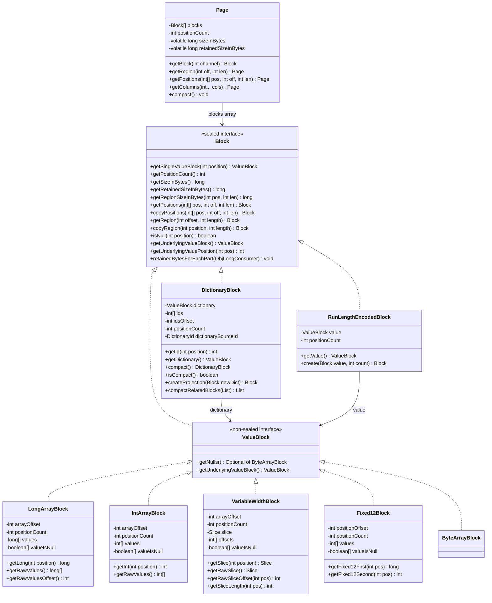
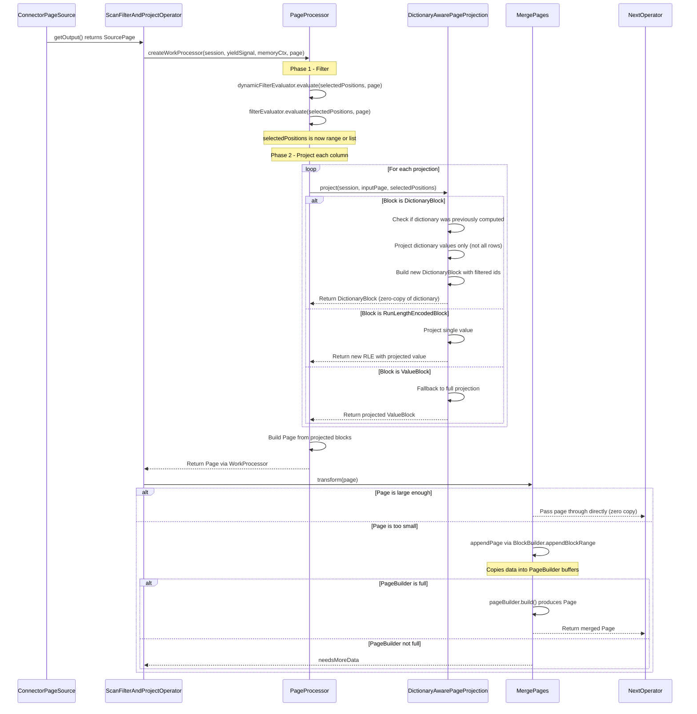

# Module Teardown: The Columnar Memory Model (Task 3.2.A)

## 0. Research Focus
* **Task ID:** 3.2.A
* **Focus:** How is a Page structured? Trace how a Block represents a single column of data in memory (DictionaryBlock, RunLengthEncodedBlock, VariableWidthBlock). How do Operators read from these structures without copying data?

## 1. High-Level Overview
* **Core Responsibility:** The columnar memory model is Trino's fundamental data representation layer. A `Page` is a horizontal partition of a table -- it holds N rows across M columns, where each column is represented by a `Block`. Blocks are immutable, columnar data containers with a sealed type hierarchy (`ValueBlock | DictionaryBlock | RunLengthEncodedBlock`) that enables zero-copy slicing, lazy materialization, and dictionary-encoded projections. Operators interact with Pages and Blocks through view-based operations (getRegion, getPositions) that avoid copying data wherever possible, and use BlockBuilders only when data must be materialized (aggregation output, merge of small pages).
* **Key Triggers:**
  - Connector scan produces Pages from storage (ORC, Parquet columns map directly to Blocks)
  - PageProcessor filters/projects pages through the operator pipeline
  - Operators pass Pages between pipeline stages via exchange buffers
  - MergePages consolidates small post-filter pages into efficiently-sized output

## 2. Structural Architecture
* **Primary Source Files:**
  - `io.trino.spi.Page` -- horizontal partition: array of Blocks with shared positionCount
  - `io.trino.spi.block.Block` -- sealed interface: permits DictionaryBlock, RunLengthEncodedBlock, ValueBlock
  - `io.trino.spi.block.ValueBlock` -- non-sealed interface for raw data blocks
  - `io.trino.spi.block.DictionaryBlock` -- indirection layer: int[] ids into a ValueBlock dictionary
  - `io.trino.spi.block.RunLengthEncodedBlock` -- constant-value optimization: single ValueBlock repeated N times
  - `io.trino.spi.block.LongArrayBlock` -- fixed-width 8-byte values (BIGINT, DOUBLE, TIMESTAMP)
  - `io.trino.spi.block.IntArrayBlock` -- fixed-width 4-byte values (INTEGER, DATE)
  - `io.trino.spi.block.ByteArrayBlock` -- fixed-width 1-byte values (BOOLEAN, TINYINT)
  - `io.trino.spi.block.ShortArrayBlock` -- fixed-width 2-byte values (SMALLINT)
  - `io.trino.spi.block.Fixed12Block` -- fixed-width 12-byte values (TIMESTAMP WITH TIME ZONE via long+int)
  - `io.trino.spi.block.Int128ArrayBlock` -- fixed-width 16-byte values (DECIMAL, UUID)
  - `io.trino.spi.block.VariableWidthBlock` -- variable-length values (VARCHAR, VARBINARY) with offset array
  - `io.trino.spi.block.ArrayBlock` -- nested array type
  - `io.trino.spi.block.MapBlock` -- nested map type
  - `io.trino.spi.block.RowBlock` -- nested struct type
  - `io.trino.spi.block.VariantBlock` -- variant/union type
  - `io.trino.spi.block.BlockBuilder` -- mutable append-only builder interface
  - `io.trino.spi.PageBuilder` -- coordinates multiple BlockBuilders for row-at-a-time Page construction
  - `io.trino.operator.project.PageProcessor` -- core filter+project engine for operator pipeline
  - `io.trino.operator.project.DictionaryAwarePageProjection` -- dictionary-preserving projection optimization
  - `io.trino.operator.project.SelectedPositions` -- position-list or range representation for filtered rows
  - `io.trino.operator.project.MergePages` -- small-page consolidation transformation
  - `io.trino.spi.connector.SourcePage` -- lazy column-loading interface for connector pages
  - `io.trino.spi.block.DictionaryId` -- globally unique identity for dictionary lineage tracking

* **Key Data Structures:**

### Block Type Hierarchy (sealed)

The `Block` interface is a **sealed interface** permitting exactly three implementations:

1. **ValueBlock** (non-sealed interface) -- holds actual data in typed arrays. All concrete block types implement this.
2. **DictionaryBlock** -- indirection wrapper: `int[] ids` index into a `ValueBlock dictionary`. Enables sharing a single dictionary across many rows.
3. **RunLengthEncodedBlock** -- constant wrapper: a single `ValueBlock value` (positionCount=1) logically repeated N times.

### Fixed-Width ValueBlock Layout (LongArrayBlock, IntArrayBlock, ByteArrayBlock, ShortArrayBlock, Fixed12Block, Int128ArrayBlock)

All fixed-width blocks share the same internal layout pattern:
- `int arrayOffset` -- starting offset into the backing arrays (enables zero-copy getRegion)
- `int positionCount` -- number of logical positions
- `T[] values` -- the raw data array (long[], int[], byte[], etc.)
- `boolean[] valueIsNull` -- nullable: null if no nulls possible, otherwise per-position null flags
- `long retainedSizeInBytes` -- precomputed at construction (INSTANCE_SIZE + sizeOf(values) + sizeOf(valueIsNull))

The `arrayOffset` pattern is the key to zero-copy views. When `getRegion(offset, length)` is called, a new block object is created that references the same backing arrays but with `arrayOffset += offset` and a reduced `positionCount`. No data is copied.

### Variable-Width ValueBlock Layout (VariableWidthBlock)

- `int arrayOffset` -- offset into offsets/valueIsNull arrays
- `int positionCount` -- number of logical positions
- `Slice slice` -- the raw byte buffer holding all variable-length data contiguously
- `int[] offsets` -- position i's data spans from offsets[arrayOffset+i] to offsets[arrayOffset+i+1]
- `boolean[] valueIsNull` -- per-position null flags (null if no nulls)
- `long sizeInBytes` -- precomputed: data bytes + (Integer.BYTES + Byte.BYTES) per position
- `long retainedSizeInBytes` -- precomputed: INSTANCE_SIZE + slice retained + offsets + valueIsNull

### DictionaryBlock Layout

- `int positionCount` -- number of logical positions (rows in this block)
- `ValueBlock dictionary` -- the shared dictionary of unique values
- `int idsOffset` -- offset into the ids array (for zero-copy getRegion)
- `int[] ids` -- maps each position to a dictionary entry index
- `DictionaryId dictionarySourceId` -- globally unique ID for tracking dictionary lineage
- `long retainedSizeInBytes` -- INSTANCE_SIZE + sizeOf(ids), plus dictionary's retained size
- `volatile long sizeInBytes` -- lazily computed as (avgEntrySize * positionCount) + (4 * positionCount)
- `volatile int uniqueIds` -- lazily computed count of distinct dictionary entries referenced
- `volatile boolean isSequentialIds` -- whether ids are monotonically increasing (valid only after uniqueIds computed)
- `boolean mayHaveNull` -- cached from dictionary.mayHaveNull()

### RunLengthEncodedBlock Layout

- `ValueBlock value` -- the single repeated value (positionCount == 1)
- `int positionCount` -- always at least 2 (positionCount of 0 or 1 returns the value block directly)

### Size Semantics (Three Distinct Metrics)

| Method | Meaning | Use Case |
|--------|---------|----------|
| `getSizeInBytes()` | Estimated logical size as if data were fully expanded. For DictionaryBlock: avgEntrySize * positionCount + 4 * positionCount. For RLE: value.getSizeInBytes() * positionCount. | Memory accounting for exchange buffers, output size estimation |
| `getRetainedSizeInBytes()` | Actual JVM heap consumed including over-allocations. For DictionaryBlock: INSTANCE_SIZE + sizeOf(ids) + dictionary.getRetainedSizeInBytes(). For RLE: INSTANCE_SIZE + value.getRetainedSizeInBytes(). | Memory tracking, spill-to-disk decisions |
| `getRegionSizeInBytes(pos, len)` | Size of a hypothetical region. For fixed-width: SIZE_PER_POSITION * len. For variable-width: actual byte range from offsets + overhead. | Optimizing batch sizes in PageProcessor |

Key insight: `getSizeInBytes()` can be much larger than `getRetainedSizeInBytes()` for dictionary and RLE blocks. This discrepancy is what triggers `Page.compact()`.

### Class Diagram



## 3. Execution and Call Flow

### Sequence Diagram: Page Processing Pipeline



* **Step-by-step text breakdown:**

**Step 1: Connector produces SourcePage.** The connector (e.g., Hive ORC reader) produces a `SourcePage` wrapping columnar data decoded from storage. ORC columns map directly to Trino Blocks -- no row-to-column conversion needed. The `SourcePage` interface supports lazy column loading: `getBlock(channel)` may trigger decompression only when that column is actually needed by a projection.

**Step 2: PageProcessor filters positions.** The `PageProcessor` receives the `SourcePage` and first applies dynamic filters, then static filters. The result is a `SelectedPositions` object -- either a contiguous range (`positionsRange(offset, size)`) or a sparse list (`positionsList(int[], offset, size)`). This is a lightweight representation; no data has been copied yet.

**Step 3: PageProcessor projects columns.** For each output column, a `PageProjection` is invoked with the `SourcePage` and `SelectedPositions`. The PageProcessor wraps single-input deterministic projections in `DictionaryAwarePageProjection` to preserve dictionary encoding.

**Step 4: DictionaryAwarePageProjection optimizes dictionary blocks.** When the input block is a `DictionaryBlock`, the projection evaluates the expression on just the dictionary entries (which may be much smaller than the row count), then wraps the result in a new `DictionaryBlock` with filtered ids. This avoids computing the expression for every row -- only for each unique dictionary value. For `RunLengthEncodedBlock`, it evaluates the expression once on the single value and wraps it in a new RLE. The dictionary is cached: if the same dictionary appears in the next batch, the cached output dictionary is reused.

**Step 5: InputPageProjection handles pass-through columns.** For identity projections (column pass-through), `InputPageProjection` uses zero-copy operations:
- If `selectedPositions` is a contiguous range matching the full block, return the block as-is.
- If it is a contiguous sub-range, call `block.getRegion(offset, length)` (zero-copy view).
- If it is a sparse list, call `block.copyPositions(positions, offset, length)` (creates a new block).

**Step 6: Page is constructed from projected blocks.** A new `Page` is created via `Page.wrapBlocksWithoutCopy()`, avoiding the defensive array copy used in the public constructors.

**Step 7: MergePages consolidates small pages.** After filter+project, the output page may be very small (e.g., highly selective filter). `MergePages` buffers small pages using `PageBuilder` and only emits when the accumulated size exceeds `minPageSizeInBytes` or `minRowCount`. Large pages pass through without copying. The `BlockBuilder.appendBlockRange()` method handles all three block types efficiently:
- `RunLengthEncodedBlock` -> `appendRepeated(value, 0, length)` -- fills the builder with the repeated value
- `DictionaryBlock` -> `appendPositions(dictionary, rawIds, offset, length)` -- resolves ids and copies underlying values
- `ValueBlock` -> `appendRange(block, offset, length)` -- bulk copies the raw arrays using `System.arraycopy`

**Step 8: Adaptive batch sizing.** The PageProcessor dynamically adjusts `projectBatchSize` (between 1 and MAX_BATCH_SIZE=8192). If the output page exceeds MAX_PAGE_SIZE_IN_BYTES (16MB), batch size is halved. If output is below MIN_PAGE_SIZE_IN_BYTES (4MB), batch size is doubled. This prevents both tiny pages (overhead) and huge pages (memory pressure).

## 4. Concurrency and State Management

**Block immutability is the foundation.** All Block implementations are effectively immutable once constructed. Fields like `arrayOffset`, `positionCount`, and the backing arrays are set in the constructor and never modified. This means blocks can be safely shared across threads without synchronization.

**Lazy size computation with volatile.** `Page.sizeInBytes` and `Page.retainedSizeInBytes` are computed lazily and cached in `volatile` fields. The pattern is a benign race: multiple threads may compute the same value, but the result is always consistent. DictionaryBlock uses the same pattern for `sizeInBytes`, `uniqueIds`, and `isSequentialIds`.

**DictionaryId for lineage tracking.** `DictionaryId` uses a node-local UUID combined with an `AtomicLong` sequence counter. This provides globally unique identities without coordination. The `DictionarySourceIdFunction` in `PageProcessor` maintains a mapping from input dictionary IDs to output dictionary IDs, scoped to a single page processing call (reset between pages).

**PageBuilder and BlockBuilder are NOT thread-safe.** They are mutable, append-only structures used within a single operator thread. The `PageProcessor` class itself is annotated `@NotThreadSafe`.

**SourcePage.selectPositions() enables push-down filtering.** When the connector's `SourcePage` implementation supports it, position filtering can be pushed down to the reader level, avoiding materialization of filtered-out rows entirely.

## 5. Memory and Resource Profile

### Page Memory Anatomy

A Page's memory footprint is the sum of its Blocks' retained sizes plus the Block[] array overhead:
- `Page.INSTANCE_SIZE` + `sizeOfObjectArray(blockCount)` -- the Page object itself
- Plus each `block.getRetainedSizeInBytes()`

### Fixed-Width Block Memory

For a `LongArrayBlock` with N positions (no nulls):
- INSTANCE_SIZE (~40 bytes) + sizeOf(long[N]) = 40 + 16 + 8*N bytes
- SIZE_IN_BYTES_PER_POSITION = Long.BYTES + Byte.BYTES = 9 bytes (even without null array)
- getSizeInBytes() = 9 * N (logical size includes null byte overhead)
- getRetainedSizeInBytes() = INSTANCE_SIZE + sizeOf(values) [+ sizeOf(valueIsNull) if present]

### Variable-Width Block Memory

For a `VariableWidthBlock` with N positions and total data size D:
- INSTANCE_SIZE + slice.getRetainedSize() + sizeOf(int[N+1]) + sizeOf(boolean[N])
- getSizeInBytes() = D + (Integer.BYTES + Byte.BYTES) * N = D + 5*N

### DictionaryBlock Memory Amplification

A DictionaryBlock's retained size is much smaller than its logical size:
- retainedSizeInBytes = INSTANCE_SIZE + sizeOf(int[positionCount]) + dictionary.getRetainedSizeInBytes()
- getSizeInBytes() = (dictionary.getSizeInBytes() / dictionary.getPositionCount()) * positionCount + 4 * positionCount
- Example: 1000-entry dictionary, 1M rows, 100 bytes avg entry:
  - retained: ~4MB (ids) + ~100KB (dictionary) = ~4.1MB
  - logical (sizeInBytes): ~104MB

### Page.compact() Strategy

`Page.compact()` is triggered when `retainedSizeInBytes > sizeInBytes` -- indicating wasted space. It handles two cases:
1. **Non-dictionary blocks:** calls `block.copyRegion(0, block.getPositionCount())` which creates a trimmed copy if the backing arrays have slack.
2. **Dictionary blocks:** groups by `DictionaryId`, then calls `DictionaryBlock.compactRelatedBlocks()` which:
   - Scans all ids to find which dictionary entries are actually referenced
   - If all entries are used, returns as-is
   - Otherwise, copies only the referenced entries into a new compact dictionary and remaps the ids

### BlockBuilder Growth Strategy

BlockBuilders start with a small initial capacity (default 8 entries) and grow by 50% on each resize (via `calculateNewArraySize`). The `PageBuilderStatus` tracks cumulative bytes across all BlockBuilders and signals `isFull()` when the total exceeds `DEFAULT_MAX_PAGE_SIZE_IN_BYTES` (1MB).

### Memory Context Integration

The `PageProcessor` maintains a `LocalMemoryContext` that tracks retained bytes of the in-progress page, previously computed projection results, and selected positions. It uses `RetainedBytesByPartVisitor` with `ReferenceCountMap` to avoid double-counting shared internal arrays (e.g., when a DictionaryBlock and a projection result share the same dictionary).

## 6. Key Design Insights

### Insight 1: The arrayOffset Pattern Enables Universal Zero-Copy Slicing

Every ValueBlock type uses an `arrayOffset` field that indexes into shared backing arrays. `getRegion(offset, length)` creates a new Block object with `arrayOffset += offset` but references the SAME underlying arrays. This is O(1) in time and O(1) in memory overhead (just the new Block wrapper object). The critical code path in `LongArrayBlock.getRegion()`:

```java
return new LongArrayBlock(positionOffset + arrayOffset, length, valueIsNull, values);
```

No array copying occurs. The same `values` and `valueIsNull` arrays are shared. For a Rust port, this maps naturally to slices (`&[i64]`) with offset/length bounds.

### Insight 2: Block.getPositions() Defaults to DictionaryBlock Wrapping

The default implementation of `Block.getPositions(int[] positions, int offset, int length)` in the `Block` interface creates a `DictionaryBlock` wrapping the current block with the positions array as ids:

```java
default Block getPositions(int[] positions, int offset, int length) {
    return DictionaryBlock.createInternal(offset, length, this, positions, randomDictionaryId());
}
```

This means that when a filter selects sparse positions from a block, the result is a DictionaryBlock pointing back to the original data -- zero copy. The positions array is potentially retained by the DictionaryBlock, not copied. This is the primary mechanism by which filtered pages avoid data copying.

### Insight 3: DictionaryBlock.createInternal() Automatically Unwraps Nested Dictionaries

When creating a DictionaryBlock over another DictionaryBlock, the factory method flattens the nesting:

```java
// unwrap dictionary in dictionary
int[] newIds = new int[positionCount];
for (int position = 0; position < positionCount; position++) {
    newIds[position] = dictionary.getUnderlyingValuePosition(ids[idsOffset + position]);
}
return new DictionaryBlock(0, positionCount, dictionary.getUnderlyingValueBlock(), newIds, ...);
```

This prevents unbounded dictionary nesting (dictionary-of-dictionary-of-dictionary...) which would degrade access performance. Similarly, creating a DictionaryBlock over an RLE collapses to a new RLE.

### Insight 4: DictionaryAwarePageProjection Caches Dictionary Results Across Batches

The `DictionaryAwarePageProjection` caches the last input dictionary (by reference equality) and its projected output. If the next batch has the same dictionary object (common when processing consecutive batches from the same ORC stripe), the dictionary projection is skipped entirely. The `lastDictionaryUsageCount` heuristic tracks whether dictionary processing is worthwhile: if the dictionary was used for more positions than it has entries, it is considered efficient to process.

### Insight 5: BlockBuilder.appendBlockRange() Is the Universal Copy Dispatch

The `BlockBuilder.appendBlockRange()` default method handles all three Block types with pattern matching:

```java
default void appendBlockRange(Block rawBlock, int offset, int length) {
    switch (rawBlock) {
        case RunLengthEncodedBlock rleBlock -> appendRepeated(rleBlock.getValue(), 0, length);
        case DictionaryBlock dictionaryBlock -> appendPositions(dictionaryBlock.getDictionary(),
            dictionaryBlock.getRawIds(), dictionaryBlock.getRawIdsOffset() + offset, length);
        case ValueBlock valueBlock -> appendRange(valueBlock, offset, length);
    }
}
```

This is the key boundary between zero-copy (view-based) and copy (builder-based) code paths. `appendRange` for LongArrayBlockBuilder uses `System.arraycopy` on the raw values array -- the fastest possible bulk copy on the JVM. For VariableWidthBlockBuilder, it copies both the byte data and recomputes offsets.

### Insight 6: Sealed Block Hierarchy Enables Exhaustive Pattern Matching

The `Block` interface is a `sealed interface permits DictionaryBlock, RunLengthEncodedBlock, ValueBlock`. This means the JVM can verify that switch expressions over Block cover all cases. The three-type hierarchy is deliberate:
- **ValueBlock**: raw data, the base case
- **DictionaryBlock**: indirection for deduplication/filtering
- **RunLengthEncodedBlock**: extreme deduplication (one value repeated N times)

Any code that handles these three cases handles all possible blocks. For Rust, this maps perfectly to an `enum Block { Value(ValueBlock), Dictionary(DictionaryBlock), Rle(RleBlock) }`.

### Insight 7: getSizeInBytes() vs getRetainedSizeInBytes() Drive Different Decisions

- `getSizeInBytes()` is an "expanded logical size" -- it estimates how much data this block represents as if it were a plain ValueBlock. DictionaryBlock computes this as (avgEntrySize * positionCount + 4 * positionCount). This is used for exchange buffer sizing and network transfer estimation.
- `getRetainedSizeInBytes()` measures actual JVM heap consumption. DictionaryBlock's retained size includes only the ids array plus the dictionary's retained size -- potentially orders of magnitude smaller.
- `Page.compact()` is triggered when retained > logical, indicating the backing arrays are over-allocated relative to the logical data size.

### Insight 8: SelectedPositions Is a Dual-Mode Position Representation

`SelectedPositions` can be either:
- A **range** (offset, size) -- representing a contiguous sequence of positions. No int[] allocation needed.
- A **list** (int[], offset, size) -- representing an arbitrary subset of positions.

Operators check `isList()` and branch accordingly. Range mode is the fast path (used when no filter is applied or the filter selects a contiguous prefix). List mode is used after filter evaluation selects sparse positions. The `subRange()` method creates a narrower view without copying the positions array.

### Insight 9: Page Column Selection Is Zero-Copy Reference Reshuffling

`Page.getColumns(int... columns)` creates a new Page with a subset of blocks by simply copying Block references into a new array:

```java
public Page getColumns(int... columns) {
    Block[] blocks = new Block[columns.length];
    for (int i = 0; i < columns.length; i++) {
        blocks[i] = this.blocks[columns[i]];
    }
    return wrapBlocksWithoutCopy(positionCount, blocks);
}
```

No data is copied. The same Block objects are shared between the original and projected Page. `appendColumn()` and `prependColumn()` similarly create new Pages by reference.

### Insight 10: BlockBuilder.build() Can Return RLE for All-Null Columns

Both `LongArrayBlockBuilder.build()` and `VariableWidthBlockBuilder.build()` check whether any non-null value was written. If the block is entirely null:

```java
public Block build() {
    if (!hasNonNullValue) {
        return RunLengthEncodedBlock.create(NULL_VALUE_BLOCK, positionCount);
    }
    return buildValueBlock();
}
```

This means the output of `PageBuilder.build()` can contain a mix of ValueBlocks and RLEs -- the RLE optimization applies even at the builder level.

### Insight 11: SourcePage.selectPositions() Enables Reader-Level Push-Down

The `SourcePage` interface includes `selectPositions(int[] positions, int offset, int size)` which modifies the page to filter positions. Unlike `Page.getPositions()` which creates a new view, this mutates the SourcePage state so that subsequent `getBlock()` calls return already-filtered blocks. This enables the connector reader to skip decoding filtered-out rows entirely -- a form of predicate push-down to the I/O level.

### Insight 12: Page.compact() Handles Dictionary Blocks as a Group

When compacting a Page, dictionary blocks sharing the same `DictionaryId` are compacted together via `DictionaryBlock.compactRelatedBlocks()`. This is critical because multiple columns may share the same dictionary (e.g., after a projection that derives multiple columns from the same dictionary-encoded source). The shared compaction ensures they all reference the same new compact dictionary with consistent ids.

## 7. Porting Considerations (Java to Rust)

### Zero-Copy View Pattern
The `arrayOffset` + shared backing array pattern maps to Rust slices (`&[T]`) or `Arc<Vec<T>>` with offset/length metadata. Rust's ownership model makes this even safer than Java: a `Block` struct holding an `Arc<Vec<i64>>` ensures the backing data lives as long as any view references it, without GC overhead. The key challenge is that Java blocks share mutable-looking arrays that are actually never mutated after construction -- Rust enforces this at the type level.

### Sealed Hierarchy to Enum
`sealed interface Block permits DictionaryBlock, RunLengthEncodedBlock, ValueBlock` maps directly to:
```
enum Block {
    Dictionary { dictionary: Arc<ValueBlock>, ids: Vec<i32>, ids_offset: usize, ... },
    Rle { value: Arc<ValueBlock>, position_count: usize },
    Value(ValueBlock),
}
```
Rust match expressions provide the same exhaustiveness guarantees.

### Null Representation
Java uses `boolean[] valueIsNull` (nullable reference). Rust options:
- `Option<Vec<bool>>` -- mirrors Java exactly
- `Option<BitVec>` -- 8x more compact, better cache utilization
- Arrow's validity bitmap format for interop

### BlockBuilder to Vec-Based Builder
Java BlockBuilders use `Arrays.copyOf` for growth. Rust `Vec<T>` provides the same amortized growth automatically. The `appendRange` using `System.arraycopy` maps to `extend_from_slice()`. The challenge is the `appendPositions` scatter-gather pattern which requires indexed access.

### DictionaryId Can Use Atomic Counter
Java's `DictionaryId` uses UUID + AtomicLong. In Rust, a simple `AtomicU64` counter is sufficient for process-local uniqueness. If cross-process uniqueness is needed (distributed execution), a UUID prefix can be added.

### Page Compaction
Rust's `Arc::make_mut()` or `Arc::try_unwrap()` can be used to determine if a backing array is uniquely owned, avoiding unnecessary copies during compaction. This is more precise than Java's approach which always copies.

### SourcePage Lazy Loading
The lazy column loading pattern in `SourcePage` / `InputChannelsSourcePage` maps to `Option<Block>` fields that are populated on first access. Rust's `OnceCell` or `LazyCell` can provide thread-safe lazy initialization if needed, though the single-threaded operator model may not require it.
